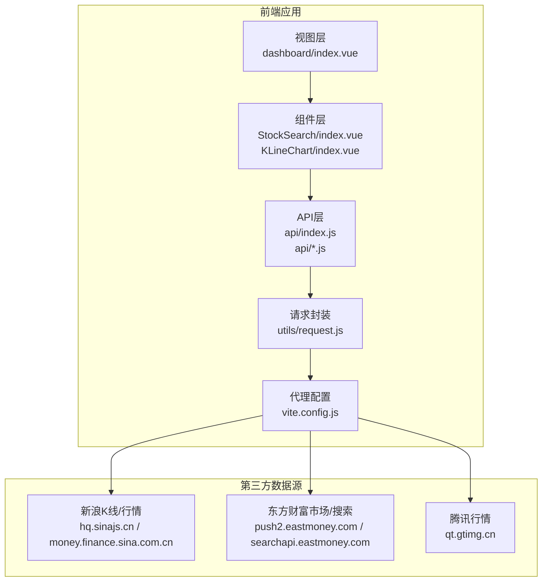
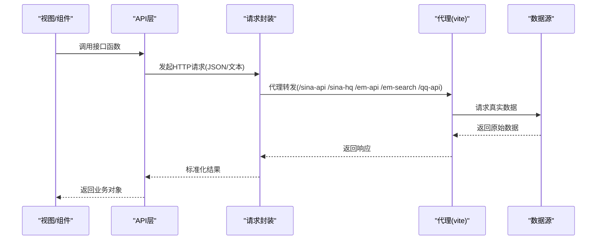
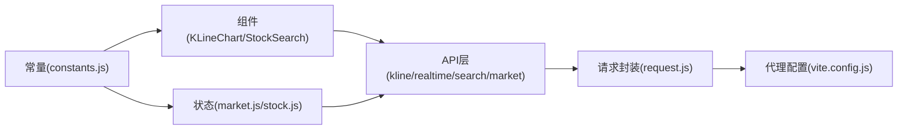

# API接口文档

<cite>
**本文档引用的文件**
- [src/api/index.js](file://src/api/index.js)
- [src/api/kline.js](file://src/api/kline.js)
- [src/api/realtime.js](file://src/api/realtime.js)
- [src/api/search.js](file://src/api/search.js)
- [src/api/market.js](file://src/api/market.js)
- [src/utils/request.js](file://src/utils/request.js)
- [src/utils/constants.js](file://src/utils/constants.js)
- [src/stores/market.js](file://src/stores/market.js)
- [src/stores/stock.js](file://src/stores/stock.js)
- [src/components/KLineChart/index.vue](file://src/components/KLineChart/index.vue)
- [src/components/StockSearch/index.vue](file://src/components/StockSearch/index.vue)
- [src/views/dashboard/index.vue](file://src/views/dashboard/index.vue)
- [src/router/index.js](file://src/router/index.js)
- [vite.config.js](file://vite.config.js)
- [package.json](file://package.json)
</cite>

## 目录
1. [简介](#简介)
2. [项目结构](#项目结构)
3. [核心组件](#核心组件)
4. [架构总览](#架构总览)
5. [详细组件分析](#详细组件分析)
6. [依赖关系分析](#依赖关系分析)
7. [性能考虑](#性能考虑)
8. [故障排查指南](#故障排查指南)
9. [结论](#结论)
10. [附录](#附录)

## 简介
本文件为量化交易平台的前端API接口文档，覆盖K线数据、实时行情、股票搜索、市场数据等接口的端点、方法、URL模式、请求参数与响应格式。文档同时说明认证机制、请求头设置、参数校验、错误处理、限流策略、版本管理与迁移建议，并提供客户端集成示例与最佳实践。

## 项目结构
前端通过Vite构建，使用Vue 3 + Pinia进行状态管理，Axios封装请求实例，组件化展示数据。代理配置将前端请求转发至第三方财经数据源（新浪、腾讯、东方财富）。

图表来源
- [src/views/dashboard/index.vue:1-163](file://src/views/dashboard/index.vue#L1-L163)
- [src/components/StockSearch/index.vue:1-76](file://src/components/StockSearch/index.vue#L1-L76)
- [src/components/KLineChart/index.vue:1-285](file://src/components/KLineChart/index.vue#L1-L285)
- [src/api/index.js:1-5](file://src/api/index.js#L1-L5)
- [src/utils/request.js:1-29](file://src/utils/request.js#L1-L29)
- [vite.config.js:15-52](file://vite.config.js#L15-L52)

章节来源
- [src/router/index.js:1-58](file://src/router/index.js#L1-L58)
- [vite.config.js:1-63](file://vite.config.js#L1-L63)

## 核心组件
- API聚合导出：统一从各模块导出函数，便于组件调用。
- 请求封装：提供JSON与文本两类请求实例，内置超时与错误提示拦截器。
- 常量配置：颜色、周期、默认指标参数、信号阈值、大盘指数等。
- 状态管理：市场与个股数据的自动刷新、计算与缓存策略。

章节来源
- [src/api/index.js:1-5](file://src/api/index.js#L1-L5)
- [src/utils/request.js:1-29](file://src/utils/request.js#L1-L29)
- [src/utils/constants.js:1-68](file://src/utils/constants.js#L1-L68)
- [src/stores/market.js:1-41](file://src/stores/market.js#L1-L41)
- [src/stores/stock.js:1-92](file://src/stores/stock.js#L1-L92)

## 架构总览
前端通过代理将请求转发到第三方财经数据源，API层负责参数校验与数据转换，组件层负责渲染与交互，状态管理层负责数据缓存与定时刷新。

图表来源
- [src/api/kline.js:1-27](file://src/api/kline.js#L1-L27)
- [src/api/realtime.js:1-56](file://src/api/realtime.js#L1-L56)
- [src/api/search.js:1-38](file://src/api/search.js#L1-L38)
- [src/api/market.js:1-46](file://src/api/market.js#L1-L46)
- [src/utils/request.js:1-29](file://src/utils/request.js#L1-L29)
- [vite.config.js:15-52](file://vite.config.js#L15-L52)

## 详细组件分析

### K线数据API
- 接口功能：获取指定股票的K线数据，支持周期与数量控制。
- 请求方法与URL：GET /sina-api/quotes_service/api/json_v2.php/CN_MarketData.getKLineData
- 请求头：由代理统一注入Referer（见代理配置）
- 查询参数
  - symbol: 股票代码，如 sz000001
  - scale: 周期，默认240（日），可选5/15/30/60/240/1200（周）
  - datalen: 数据条数，默认300
  - ma: 固定为“no”
- 成功响应：数组，每项包含day/open/high/low/close/volume字段；数值型字段已转换为浮点。
- 错误处理：异常或非数组返回空数组，避免前端崩溃。
- 使用场景：K线图表渲染、技术指标计算。

章节来源
- [src/api/kline.js:1-27](file://src/api/kline.js#L1-L27)
- [src/stores/stock.js:35-52](file://src/stores/stock.js#L35-L52)
- [src/components/KLineChart/index.vue:22-241](file://src/components/KLineChart/index.vue#L22-L241)
- [vite.config.js:15-23](file://vite.config.js#L15-L23)

### 实时行情API
- 批量行情接口
  - 方法与URL：GET /sina-hq/list=sh000001,sz000001,...
  - 请求头：由代理统一注入Referer
  - 参数：无查询参数，symbols以逗号拼接在路径中
  - 成功响应：解析文本格式，返回数组，每项包含name/open/prevClose/price/high/low/volume/amount/date/time/change/changePercent/symbol
  - 错误处理：异常返回空数组
- 单只快照接口
  - 方法与URL：批量接口包装，传入单个symbol
  - 成功响应：返回第一项或null

章节来源
- [src/api/realtime.js:1-56](file://src/api/realtime.js#L1-L56)
- [src/stores/stock.js:54-57](file://src/stores/stock.js#L54-L57)
- [vite.config.js:24-31](file://vite.config.js#L24-L31)

### 股票搜索API
- 方法与URL：GET /em-search/api/suggest/get
- 请求头：由代理统一注入Referer
- 查询参数
  - input: 关键词（已去空白）
  - type: 固定14
  - count: 固定10
- 成功响应：过滤出符合A股主板/创业板/科创板规则的记录，返回code/name/market/symbol字段
- 错误处理：异常返回空数组

章节来源
- [src/api/search.js:1-38](file://src/api/search.js#L1-L38)
- [src/components/StockSearch/index.vue:34-43](file://src/components/StockSearch/index.vue#L34-L43)
- [vite.config.js:45-52](file://vite.config.js#L45-L52)

### 市场数据API
- 大盘指数
  - 方法与URL：复用实时行情接口，固定指数代码集合
  - 成功响应：返回指数行情数组
- 热门股票
  - 方法与URL：GET /em-api/api/qt/clist/get
  - 查询参数：pn/pz/po/np/fltt/invt/fid/fs/fields等，用于排序与筛选
  - 成功响应：返回rank/code/name/price/changePercent/change/volume/amount/turnoverRate/symbol字段

章节来源
- [src/api/market.js:1-46](file://src/api/market.js#L1-L46)
- [src/stores/market.js:11-23](file://src/stores/market.js#L11-L23)
- [vite.config.js:37-44](file://vite.config.js#L37-L44)

### 请求封装与错误处理
- JSON请求实例：默认超时15秒，响应类型json
- 文本请求实例：默认超时15秒，响应类型text，禁用自动解析
- 全局错误拦截：根据响应状态或网络错误/超时提示消息，统一reject

章节来源
- [src/utils/request.js:1-29](file://src/utils/request.js#L1-L29)

### 前端使用与集成示例
- 路由与页面：仪表盘首页展示热门股票与大盘指数，支持跳转到个股详情页
- 自动刷新：市场与自选股面板每30秒刷新一次；个股实时行情每10秒刷新一次
- 组件交互：搜索框输入关键词触发搜索，选择后跳转到个股页

章节来源
- [src/views/dashboard/index.vue:1-163](file://src/views/dashboard/index.vue#L1-L163)
- [src/stores/market.js:25-33](file://src/stores/market.js#L25-L33)
- [src/stores/stock.js:74-81](file://src/stores/stock.js#L74-L81)
- [src/router/index.js:1-58](file://src/router/index.js#L1-L58)

## 依赖关系分析
- 组件依赖API层，API层依赖请求封装，请求封装依赖代理配置
- 状态管理依赖API层与常量配置，组件依赖状态管理与常量配置

图表来源
- [src/components/KLineChart/index.vue:1-285](file://src/components/KLineChart/index.vue#L1-L285)
- [src/components/StockSearch/index.vue:1-76](file://src/components/StockSearch/index.vue#L1-L76)
- [src/api/index.js:1-5](file://src/api/index.js#L1-L5)
- [src/utils/request.js:1-29](file://src/utils/request.js#L1-L29)
- [vite.config.js:1-63](file://vite.config.js#L1-L63)
- [src/stores/market.js:1-41](file://src/stores/market.js#L1-L41)
- [src/stores/stock.js:1-92](file://src/stores/stock.js#L1-L92)
- [src/utils/constants.js:1-68](file://src/utils/constants.js#L1-L68)

## 性能考虑
- 代理层统一Referer与跨域，减少CORS复杂度
- 组件内ECharts按需渲染子图，避免不必要的重绘
- 状态层定时器集中管理，组件卸载时清理，防止内存泄漏
- 请求超时15秒，建议客户端结合重试与缓存策略

## 故障排查指南
- 网络错误：检查代理是否正确、目标域名可达
- 超时错误：适当增加重试次数与退避间隔
- 数据为空：确认symbol格式、scale取值、关键词非空
- 图表不更新：确认自动刷新定时器是否启动与停止

章节来源
- [src/utils/request.js:17-25](file://src/utils/request.js#L17-L25)
- [src/stores/market.js:25-33](file://src/stores/market.js#L25-L33)
- [src/stores/stock.js:74-81](file://src/stores/stock.js#L74-L81)

## 结论
本API体系以简洁的函数式封装对接第三方数据源，配合代理与拦截器实现跨域与错误处理，通过状态管理与组件解耦实现高效的数据驱动界面。建议在生产环境引入重试、缓存与限流策略，确保稳定性与用户体验。

## 附录

### API端点一览与规范
- K线数据
  - 方法：GET
  - URL：/sina-api/quotes_service/api/json_v2.php/CN_MarketData.getKLineData
  - 查询参数：symbol, scale(默认240), datalen(默认300), ma="no"
  - 成功响应：数组，元素含day/open/high/low/close/volume
- 实时行情（批量）
  - 方法：GET
  - URL：/sina-hq/list=sh000001,sz000001,...
  - 成功响应：数组，元素含name/open/prevClose/price/high/low/volume/amount/date/time/change/changePercent/symbol
- 实时行情（单只）
  - 方法：GET（批量包装）
  - URL：/sina-hq/list=单个symbol
- 股票搜索
  - 方法：GET
  - URL：/em-search/api/suggest/get
  - 查询参数：input(关键词), type=14, count=10
  - 成功响应：过滤后的code/name/market/symbol
- 大盘指数
  - 方法：GET（复用批量行情）
  - URL：/sina-hq/list=sh000001,sz399001,sz399006
- 热门股票
  - 方法：GET
  - URL：/em-api/api/qt/clist/get
  - 查询参数：pn=1, pz=15, po=1, np=1, fltt=2, invt=2, fid="f6", fs="m:0+t:6,m:0+t:80,m:1+t:2,m:1+t:23", fields="f2,f3,f4,f5,f6,f8,f12,f14"
  - 成功响应：rank/code/name/price/changePercent/change/volume/amount/turnoverRate/symbol

章节来源
- [src/api/kline.js:9-26](file://src/api/kline.js#L9-L26)
- [src/api/realtime.js:39-47](file://src/api/realtime.js#L39-L47)
- [src/api/search.js:7-22](file://src/api/search.js#L7-L22)
- [src/api/market.js:7-45](file://src/api/market.js#L7-L45)
- [vite.config.js:15-52](file://vite.config.js#L15-L52)

### 认证机制与请求头
- 当前实现未包含显式认证（如Token/Bearer），代理层统一注入Referer以满足部分站点防盗链要求。
- 建议：若接入自有后端网关，可在请求拦截器中添加Authorization头与签名/时间戳等安全措施。

章节来源
- [vite.config.js:15-52](file://vite.config.js#L15-L52)
- [src/utils/request.js:1-29](file://src/utils/request.js#L1-L29)

### 参数验证规则
- K线：scale必须为5/15/30/60/240/1200之一；datalen为正整数；symbol字符串
- 行情：symbols非空数组
- 搜索：keyword非空且去空白
- 市场：热门股票参数为固定值，无需用户输入

章节来源
- [src/api/kline.js:3-8](file://src/api/kline.js#L3-L8)
- [src/api/realtime.js:35-40](file://src/api/realtime.js#L35-L40)
- [src/api/search.js:3-8](file://src/api/search.js#L3-L8)
- [src/api/market.js:14-28](file://src/api/market.js#L14-L28)

### 错误码与异常处理
- 错误分类：网络错误、超时、服务端错误
- 处理策略：统一弹窗提示并reject，调用方应捕获并降级显示空数据
- 建议：在客户端实现指数退避重试与本地缓存兜底

章节来源
- [src/utils/request.js:17-25](file://src/utils/request.js#L17-L25)

### 限流策略与最佳实践
- 限流建议：对高频接口（如实时行情）设置最大并发与队列长度；对搜索与K线接口设置合理节流
- 重试策略：指数退避、最大重试次数、区分可重试与不可重试错误
- 缓存策略：短期缓存（秒级）+ 版本化key；热点数据优先命中缓存
- 超时与取消：统一超时时间，支持请求取消避免竞态

### 版本管理与迁移指南
- 版本号：当前项目版本为1.0.0
- 迁移建议：新增接口采用新URL前缀；变更现有接口保持兼容或提供别名；在拦截器中加入版本头或查询参数
- 向后兼容：对必填参数增加默认值；对新增字段做存在性判断；对响应结构做兼容映射

章节来源
- [package.json:1-28](file://package.json#L1-L28)

### 客户端集成示例与最佳实践
- 初始化：在应用入口配置代理与全局拦截器
- 调用流程：先搜索得到symbol，再拉取K线与实时行情，最后渲染图表与表格
- 错误重试：对网络错误与超时进行有限次重试
- 超时处理：统一超时时间，避免阻塞UI
- 缓存策略：基于symbol+周期+时间窗口的缓存键，命中则直接渲染，未命中再发起请求