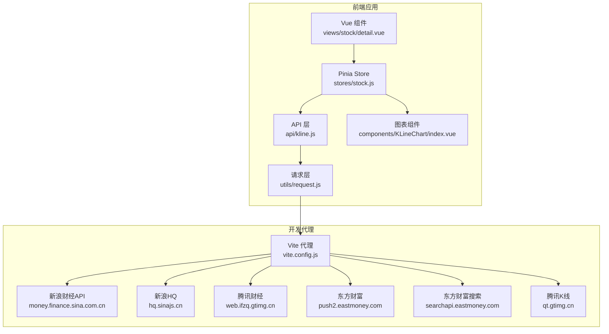
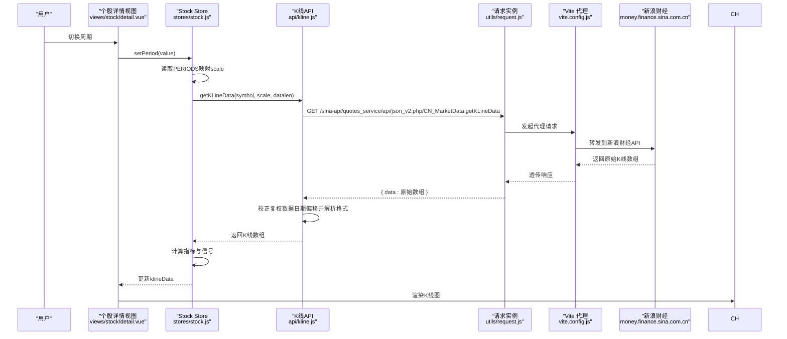
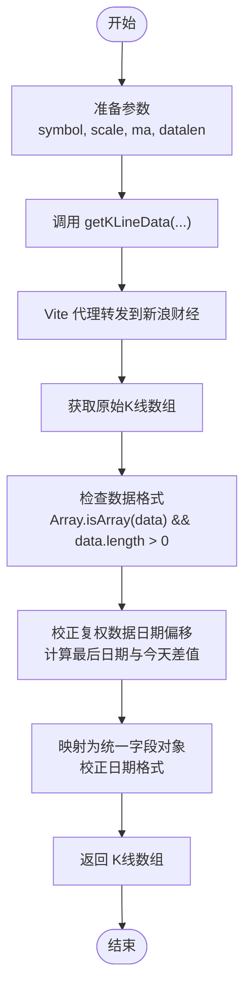
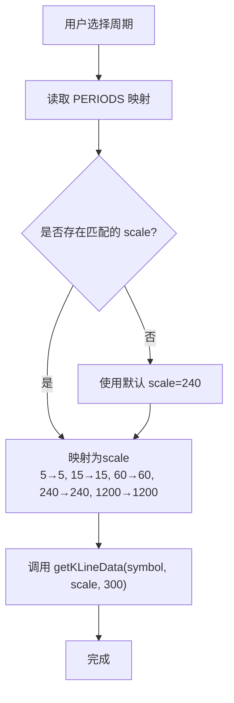
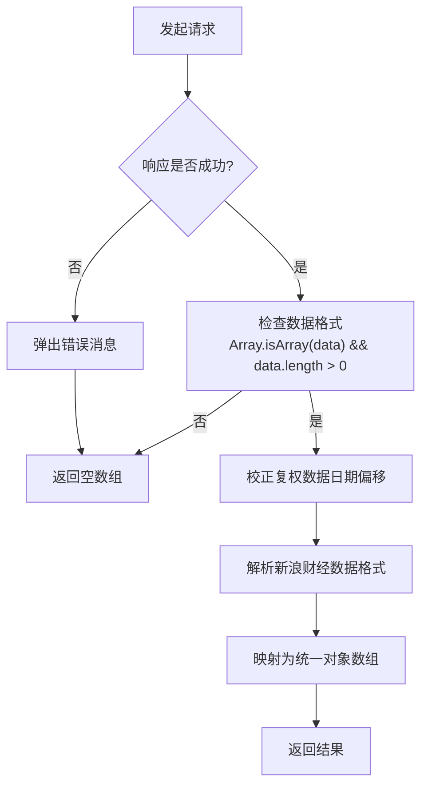
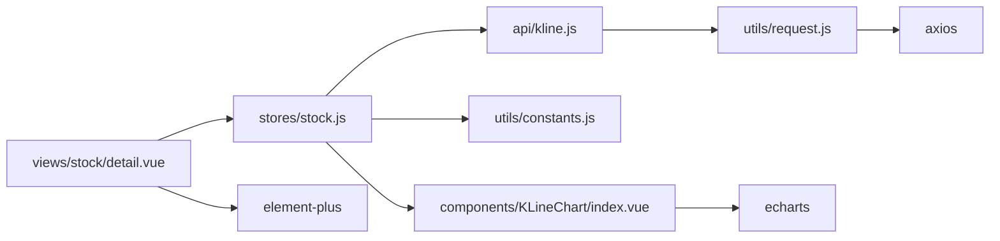

# K线数据API

<cite>
**本文引用的文件**
- [src/api/kline.js](file://src/api/kline.js)
- [src/utils/request.js](file://src/utils/request.js)
- [src/stores/stock.js](file://src/stores/stock.js)
- [src/utils/constants.js](file://src/utils/constants.js)
- [src/components/KLineChart/index.vue](file://src/components/KLineChart/index.vue)
- [src/views/stock/detail.vue](file://src/views/stock/detail.vue)
- [vite.config.js](file://vite.config.js)
- [package.json](file://package.json)
- [src/utils/indicators.js](file://src/utils/indicators.js)
- [src/utils/signals.js](file://src/utils/signals.js)
</cite>

## 更新摘要
**变更内容**
- 更新了K线数据API，从腾讯财经API迁移到新浪财经API
- 新增新浪财经复权数据日期校正逻辑，解决日期偏移问题
- 增强了错误处理和数据解析能力
- 改进了API响应格式处理逻辑
- 更新了代理配置以支持新的新浪财经API

## 目录
1. [简介](#简介)
2. [项目结构](#项目结构)
3. [核心组件](#核心组件)
4. [架构总览](#架构总览)
5. [详细组件分析](#详细组件分析)
6. [依赖关系分析](#依赖关系分析)
7. [性能考虑](#性能考虑)
8. [故障排查指南](#故障排查指南)
9. [结论](#结论)
10. [附录](#附录)

## 简介
本文件为"K线数据API"的详细接口文档，面向前端与集成开发者，说明如何通过RESTful风格的前端请求获取股票历史K线数据。内容涵盖：
- 接口的HTTP方法、URL路径、查询参数与响应格式
- K线数据字段定义（开盘价、收盘价、最高价、最低价、成交量）
- 时间周期参数（日线、周线、分钟线等）的使用方式
- 完整的请求与响应示例（以路径形式给出，避免直接粘贴代码）
- 错误处理与异常情况说明
- 客户端调用示例与最佳实践建议

注意：该系统通过Vite代理转发到第三方财经数据源（新浪财经），实际接口由代理目标服务提供。

## 项目结构
围绕K线数据的关键文件与职责如下：
- API层：封装K线请求与数据转换
- 请求层：统一的HTTP客户端与拦截器
- 状态层：Pinia Store负责周期切换、拉取K线、计算指标与信号
- 视图层：个股详情页驱动周期切换与图表渲染
- 图表层：基于 ECharts 的K线图组件
- 代理层：Vite开发服务器代理到第三方财经数据源

**图表来源**
- [src/views/stock/detail.vue:113-175](file://src/views/stock/detail.vue#L113-L175)
- [src/stores/stock.js:10-92](file://src/stores/stock.js#L10-L92)
- [src/api/kline.js:1-55](file://src/api/kline.js#L1-L55)
- [src/utils/request.js:1-29](file://src/utils/request.js#L1-L29)
- [src/components/KLineChart/index.vue:1-285](file://src/components/KLineChart/index.vue#L1-L285)
- [vite.config.js:15-56](file://vite.config.js#L15-L56)

**章节来源**
- [src/api/kline.js:1-55](file://src/api/kline.js#L1-L55)
- [src/utils/request.js:1-29](file://src/utils/request.js#L1-L29)
- [src/stores/stock.js:10-92](file://src/stores/stock.js#L10-L92)
- [src/utils/constants.js:28-36](file://src/utils/constants.js#L28-L36)
- [src/components/KLineChart/index.vue:1-285](file://src/components/KLineChart/index.vue#L1-L285)
- [src/views/stock/detail.vue:113-175](file://src/views/stock/detail.vue#L113-L175)
- [vite.config.js:15-56](file://vite.config.js#L15-L56)

## 核心组件
- K线API函数：负责向代理路径发起请求，并将返回数据映射为统一的K线对象数组
- 请求实例：统一的JSON请求客户端，内置超时与错误提示
- 周期常量：定义可用的时间周期与对应的数据源周期参数
- Pinia Store：负责周期切换、拉取K线、计算技术指标与信号
- 图表组件：消费K线数据与指标，渲染蜡烛图与各类技术指标子图

**章节来源**
- [src/api/kline.js:9-54](file://src/api/kline.js#L9-L54)
- [src/utils/request.js:5-8](file://src/utils/request.js#L5-L8)
- [src/utils/constants.js:28-36](file://src/utils/constants.js#L28-L36)
- [src/stores/stock.js:30-52](file://src/stores/stock.js#L30-L52)
- [src/components/KLineChart/index.vue:22-241](file://src/components/KLineChart/index.vue#L22-L241)

## 架构总览
K线数据从用户选择周期开始，经由Store触发API请求，通过Vite代理转发到新浪财经，最终在前端完成数据映射与图表渲染。

**图表来源**
- [src/views/stock/detail.vue:186-188](file://src/views/stock/detail.vue#L186-L188)
- [src/stores/stock.js:30-52](file://src/stores/stock.js#L30-L52)
- [src/api/kline.js:9-54](file://src/api/kline.js#L9-L54)
- [src/utils/request.js:5-8](file://src/utils/request.js#L5-L8)
- [vite.config.js:15-23](file://vite.config.js#L15-L23)

## 详细组件分析

### 接口定义与调用流程
- HTTP方法：GET
- URL路径：/sina-api/quotes_service/api/json_v2.php/CN_MarketData.getKLineData
- 查询参数：
  - symbol：股票代码，如 sz000001
  - scale：周期参数，映射见"周期与scale对照"
  - ma：均线周期，默认5
  - datalen：数据条数，默认300
- 响应格式：对象，包含data字段，其中为股票代码作为键的数据；API内部会将其映射为统一的K线对象数组

**更新** 新增新浪财经复权数据日期校正逻辑，自动检测并修正未来日期偏移

**图表来源**
- [src/api/kline.js:9-54](file://src/api/kline.js#L9-L54)
- [vite.config.js:15-23](file://vite.config.js#L15-L23)

**章节来源**
- [src/api/kline.js:9-54](file://src/api/kline.js#L9-L54)
- [src/utils/request.js:5-8](file://src/utils/request.js#L5-L8)
- [vite.config.js:15-23](file://vite.config.js#L15-L23)

### K线数据字段定义
- day：日期字符串，如 "2025-01-01"
- open：开盘价（数值）
- high：最高价（数值）
- low：最低价（数值）
- close：收盘价（数值）
- volume：成交量（数值）

**更新** 新增复权数据日期校正功能，确保日期准确性

字段来源与转换逻辑：
- day 来自原始数据的 day 字段，经过日期校正处理
- open/high/low/close/volume 经过数值转换（parseFloat）

**章节来源**
- [src/api/kline.js:36-49](file://src/api/kline.js#L36-L49)

### 时间周期参数与使用方法
- 周期常量与scale映射：
  - 日K：value=daily, scale=240
  - 周K：value=weekly, scale=1200
  - 60分：value=60min, scale=60
  - 30分：value=30min, scale=30
  - 15分：value=15min, scale=15
  - 5分：value=5min, scale=5
- 使用方法：
  - 在视图层切换周期时，Store根据当前周期值查找PERIODS中的scale
  - 将scale传入 getKLineData(symbol, scale, 300)
  - API内部将scale映射为period参数

**图表来源**
- [src/utils/constants.js:28-36](file://src/utils/constants.js#L28-L36)
- [src/stores/stock.js:40-42](file://src/stores/stock.js#L40-L42)

**章节来源**
- [src/utils/constants.js:28-36](file://src/utils/constants.js#L28-L36)
- [src/stores/stock.js:30-52](file://src/stores/stock.js#L30-L52)

### 请求与响应示例（以路径为准）
- 请求示例（路径参考）：
  - GET /sina-api/quotes_service/api/json_v2.php/CN_MarketData.getKLineData?symbol=sz000001&scale=240&ma=5&datalen=300
  - 代理配置参考：[vite.config.js:15-23](file://vite.config.js#L15-L23)
- 响应示例（路径参考）：
  - 原始对象结构参考：[src/api/kline.js:20-22](file://src/api/kline.js#L20-L22)
  - 统一映射后的对象数组参考：[src/api/kline.js:36-49](file://src/api/kline.js#L36-L49)

**章节来源**
- [src/api/kline.js:20-49](file://src/api/kline.js#L20-L49)
- [vite.config.js:15-23](file://vite.config.js#L15-L23)

### 错误处理与异常情况
- 网络错误：拦截器会提示"网络错误，请检查网络连接"
- 请求超时：拦截器会提示"请求超时，请稍后重试"
- 其他错误：拦截器会提示"请求失败: {状态码}"
- API内部异常：当请求失败或返回非数组时，API会返回空数组，避免抛错影响UI
- 数据解析异常：API会检查数据格式并进行日期校正，若解析失败则返回空数组
- **新增** 复权数据日期校正：自动检测未来日期并计算偏移天数进行校正

**图表来源**
- [src/utils/request.js:17-25](file://src/utils/request.js#L17-L25)
- [src/api/kline.js:20-54](file://src/api/kline.js#L20-L54)

**章节来源**
- [src/utils/request.js:17-25](file://src/utils/request.js#L17-L25)
- [src/api/kline.js:20-54](file://src/api/kline.js#L20-L54)

### 客户端调用示例与最佳实践
- 调用示例（路径参考）：
  - 在视图层切换周期时触发：[src/views/stock/detail.vue:186-188](file://src/views/stock/detail.vue#L186-L188)
  - Store中根据周期映射scale并调用API：[src/stores/stock.js:40-42](file://src/stores/stock.js#L40-L42)
  - API封装与数据映射：[src/api/kline.js:9-54](file://src/api/kline.js#L9-L54)
- 最佳实践：
  - 优先使用 PERIODS 常量进行周期选择，确保scale正确
  - datalen 固定为300，若需更多数据可在业务侧二次处理
  - 对返回的K线数组进行空值与边界检查后再渲染图表
  - 图表组件已内置对空数据的处理与tooltip格式化，无需额外处理
  - **新增** 复权数据日期校正已自动处理，无需手动干预

**章节来源**
- [src/views/stock/detail.vue:186-188](file://src/views/stock/detail.vue#L186-L188)
- [src/stores/stock.js:40-42](file://src/stores/stock.js#L40-L42)
- [src/api/kline.js:9-54](file://src/api/kline.js#L9-L54)
- [src/components/KLineChart/index.vue:219-229](file://src/components/KLineChart/index.vue#L219-L229)

## 依赖关系分析
- 组件耦合：
  - views/stock/detail.vue 依赖 stores/stock.js
  - stores/stock.js 依赖 api/kline.js 与 utils/constants.js
  - api/kline.js 依赖 utils/request.js
  - components/KLineChart/index.vue 依赖 stores/stock.js 提供的数据
- 外部依赖：
  - axios：HTTP客户端
  - echarts：图表渲染
  - element-plus：消息提示与UI组件

**图表来源**
- [src/views/stock/detail.vue:113-175](file://src/views/stock/detail.vue#L113-L175)
- [src/stores/stock.js:10-92](file://src/stores/stock.js#L10-L92)
- [src/api/kline.js:1-55](file://src/api/kline.js#L1-L55)
- [src/utils/request.js:1-29](file://src/utils/request.js#L1-L29)
- [src/components/KLineChart/index.vue:1-285](file://src/components/KLineChart/index.vue#L1-L285)
- [package.json:11-21](file://package.json#L11-L21)

**章节来源**
- [src/views/stock/detail.vue:113-175](file://src/views/stock/detail.vue#L113-L175)
- [src/stores/stock.js:10-92](file://src/stores/stock.js#L10-L92)
- [src/api/kline.js:1-55](file://src/api/kline.js#L1-L55)
- [src/utils/request.js:1-29](file://src/utils/request.js#L1-L29)
- [src/components/KLineChart/index.vue:1-285](file://src/components/KLineChart/index.vue#L1-L285)
- [package.json:11-21](file://package.json#L11-L21)

## 性能考虑
- 请求超时：统一设置为15秒，避免长时间阻塞
- 数据量：默认拉取300条K线，可根据需要调整 datalen（当前API固定为300）
- 图表渲染：ECharts按需渲染蜡烛图与子图，支持缩放与滑块控件，减少全量绘制
- 自动刷新：Store提供定时器用于实时行情刷新，K线数据刷新由周期切换触发
- **新增** 日期校正优化：仅在需要时进行日期计算，避免重复处理

**章节来源**
- [src/utils/request.js:6](file://src/utils/request.js#L6)
- [src/stores/stock.js:74-81](file://src/stores/stock.js#L74-L81)
- [src/components/KLineChart/index.vue:236-239](file://src/components/KLineChart/index.vue#L236-L239)

## 故障排查指南
- 现象：请求失败或无数据
  - 检查网络连接与代理配置
  - 查看控制台错误提示（网络错误/请求超时/请求失败: 状态码）
  - 确认 symbol 与 scale 参数是否正确
  - 检查新浪财经API响应格式是否符合预期
- 现象：图表空白
  - 确认 klineData 非空且包含统一字段
  - 检查 PERIODS 映射是否正确
  - 验证新浪财经API返回的数据结构
- 现象：数据缺失或NaN
  - API内部会将字段转换为数值，若原始数据异常，可能返回空数组
  - 建议在调用方做空值与边界检查
- **新增** 现象：日期异常或时间倒序
  - API已自动处理复权数据日期偏移，无需手动干预
  - 如仍有问题，检查代理配置和网络连接

**章节来源**
- [src/utils/request.js:17-25](file://src/utils/request.js#L17-L25)
- [src/api/kline.js:20-54](file://src/api/kline.js#L20-L54)
- [src/stores/stock.js:40-52](file://src/stores/stock.js#L40-L52)

## 结论
本K线数据API通过Vite代理访问新浪财经，提供标准化的K线数据获取能力。**新增的复权数据日期校正功能**确保了数据的准确性和时序正确性。前端通过Store与组件协同，实现周期切换、数据拉取、指标计算与图表渲染的完整闭环。建议在生产环境中结合缓存与限流策略，提升用户体验与系统稳定性。

## 附录

### 接口清单
- 方法：GET
- 路径：/sina-api/quotes_service/api/json_v2.php/CN_MarketData.getKLineData
- 查询参数：
  - symbol：股票代码（必填）
  - scale：周期参数（必填，见"周期与scale对照"）
  - ma：均线周期（默认5）
  - datalen：数据条数（默认300）
- 响应：对象，包含data字段，每项为包含 day/open/high/low/close/volume 的对象

**章节来源**
- [src/api/kline.js:9-54](file://src/api/kline.js#L9-L54)
- [src/utils/constants.js:28-36](file://src/utils/constants.js#L28-L36)

### 周期与scale对照
- 日K：daily → 240
- 周K：weekly → 1200
- 60分：60min → 60
- 30分：30min → 30
- 15分：15min → 15
- 5分：5min → 5

**章节来源**
- [src/utils/constants.js:28-36](file://src/utils/constants.js#L28-L36)
- [src/api/kline.js:12-16](file://src/api/kline.js#L12-L16)

### 字段说明
- day：日期字符串
- open：开盘价（数值）
- high：最高价（数值）
- low：最低价（数值）
- close：收盘价（数值）
- volume：成交量（数值）

**章节来源**
- [src/api/kline.js:41-48](file://src/api/kline.js#L41-L48)

### 代理配置参考
- 代理前缀：/sina-api
- 目标地址：https://money.finance.sina.com.cn
- 重写规则：移除前缀
- Referer：https://finance.sina.com.cn

**章节来源**
- [vite.config.js:15-23](file://vite.config.js#L15-L23)

### 技术指标与信号处理
- 指标计算：支持MA、MACD、KDJ、RSI、布林带、支撑压力位
- 信号生成：支持MACD、KDJ、RSI、布林带、均线、量能等多种策略
- 综合评分：基于信号强度和类型计算综合投资建议

**章节来源**
- [src/utils/indicators.js:221-244](file://src/utils/indicators.js#L221-L244)
- [src/utils/signals.js:288-325](file://src/utils/signals.js#L288-L325)

### 新增功能：复权数据日期校正
**更新** 新增新浪财经复权数据日期校正逻辑

- 功能概述：自动检测并修正新浪财经前复权数据的日期偏移问题
- 工作原理：
  - 计算最后一条数据的日期与当前日期的差值
  - 如果最后日期在未来，则计算偏移天数
  - 对所有数据日期进行相应校正
- 应用场景：解决前复权数据日期向前偏移的问题，确保时间序列的正确性

**章节来源**
- [src/api/kline.js:24-34](file://src/api/kline.js#L24-L34)
- [src/api/kline.js:36-49](file://src/api/kline.js#L36-L49)