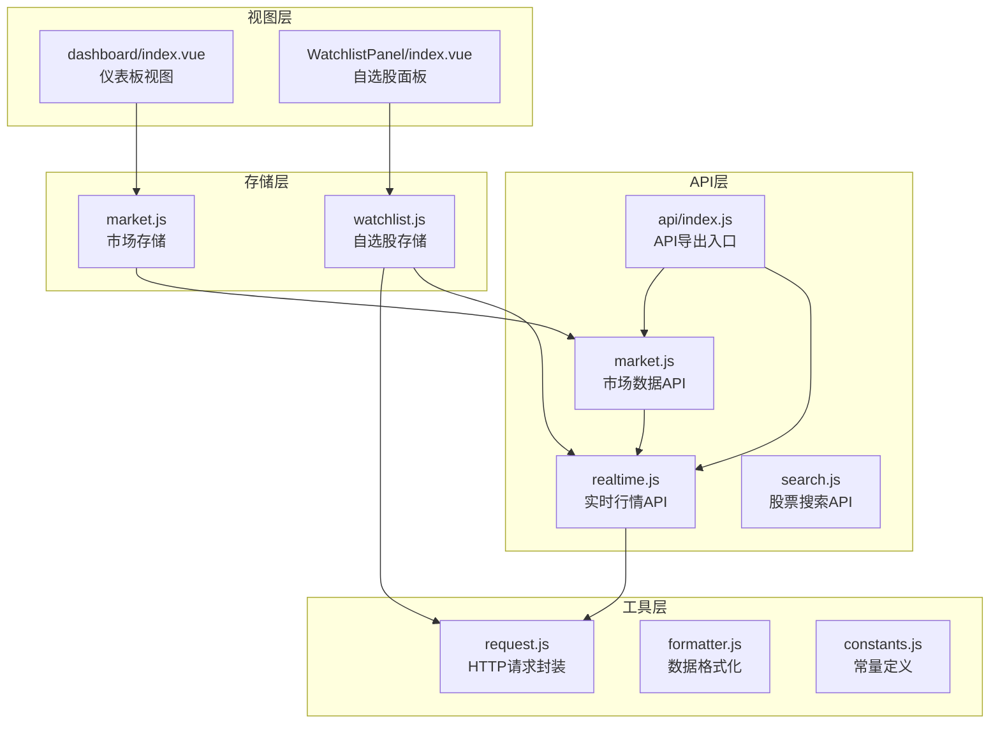
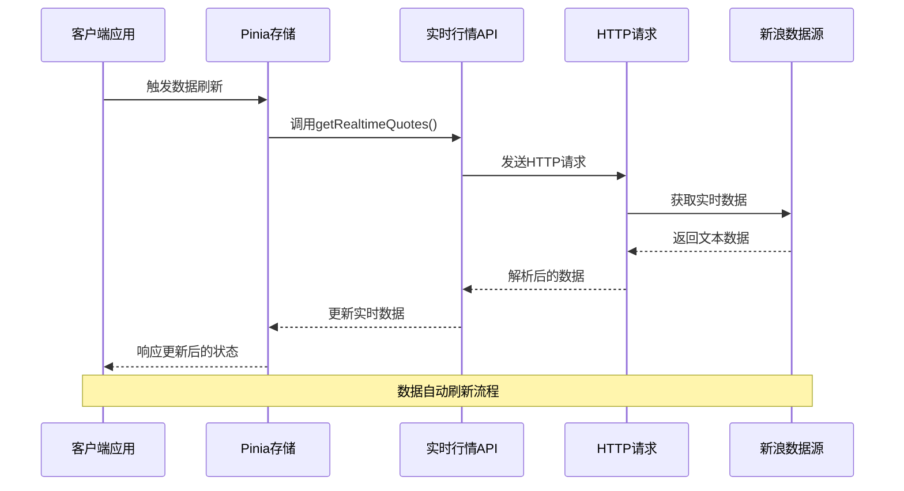
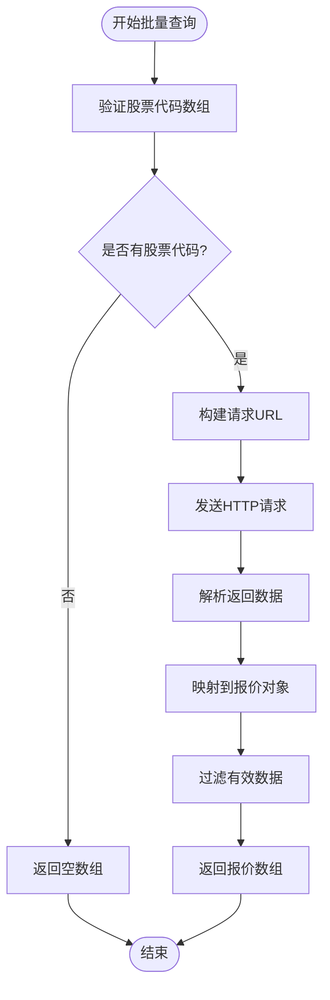
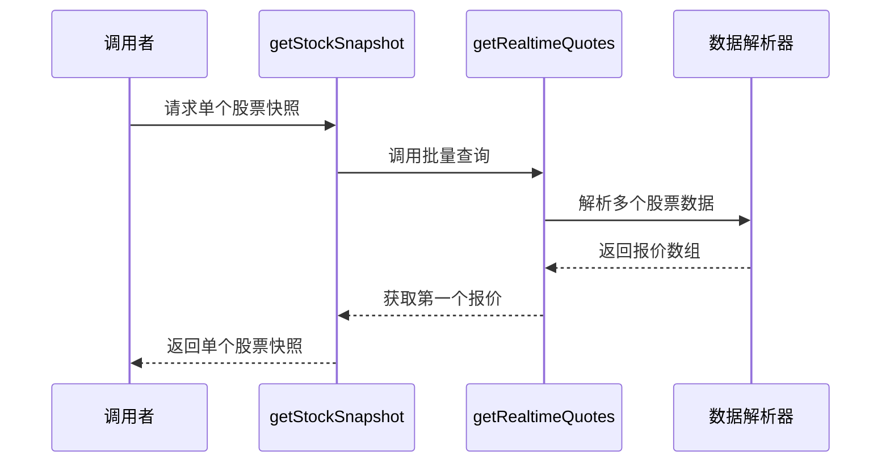
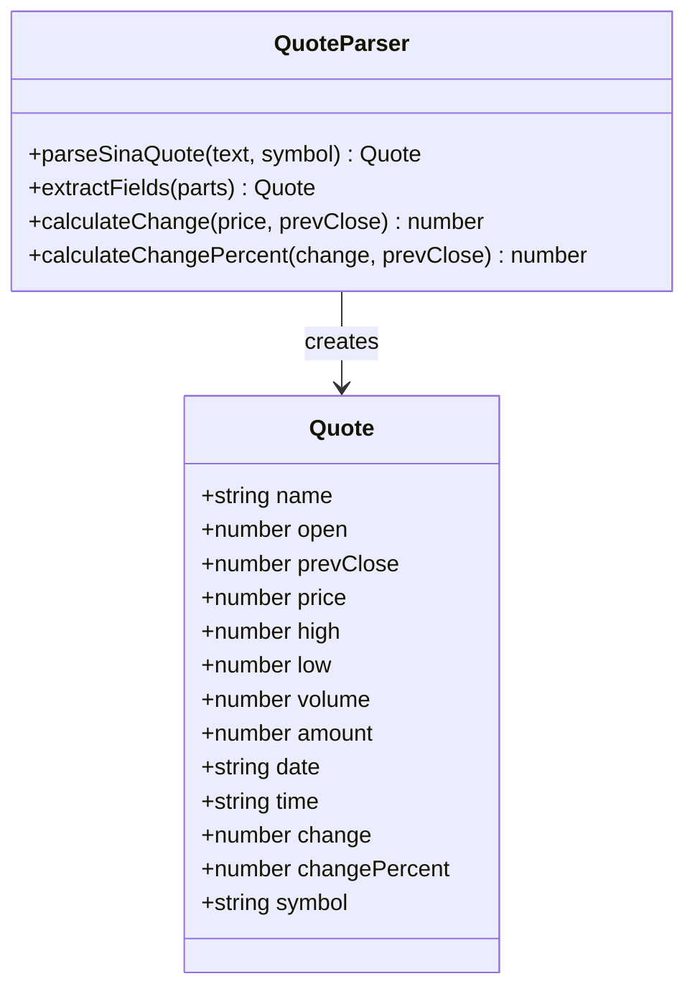
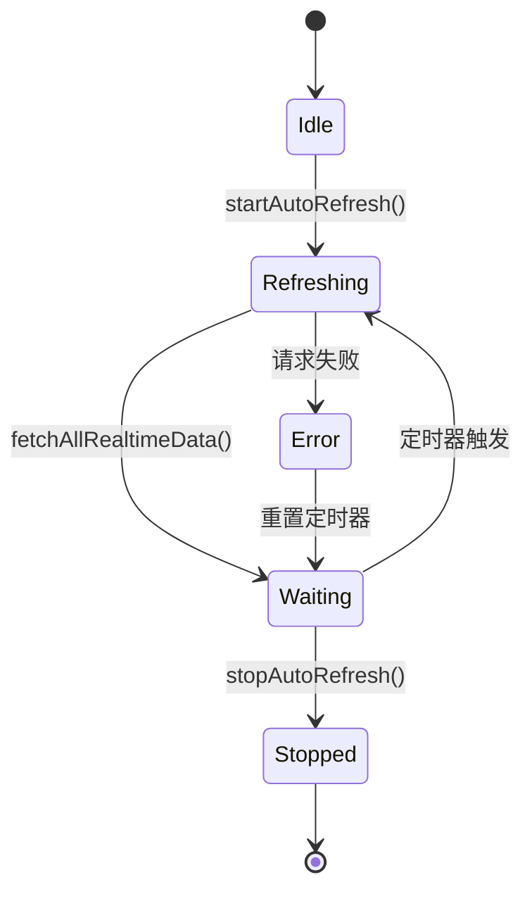
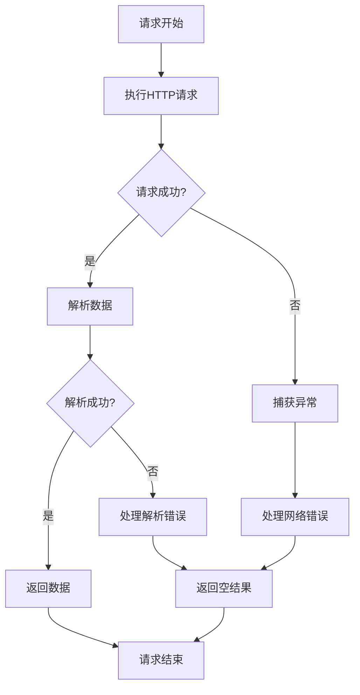
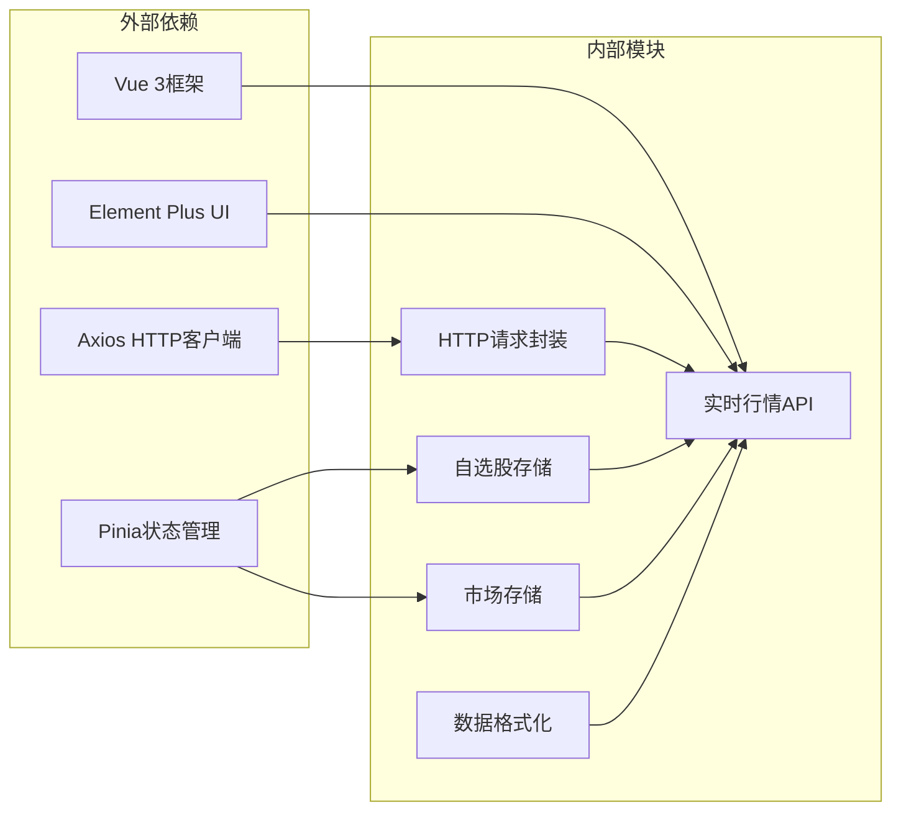

# 实时行情API

<cite>
**本文档引用的文件**
- [src/api/realtime.js](file://src/api/realtime.js)
- [src/utils/request.js](file://src/utils/request.js)
- [src/stores/watchlist.js](file://src/stores/watchlist.js)
- [src/stores/market.js](file://src/stores/market.js)
- [src/api/market.js](file://src/api/market.js)
- [src/utils/formatter.js](file://src/utils/formatter.js)
- [src/components/WatchlistPanel/index.vue](file://src/components/WatchlistPanel/index.vue)
- [src/views/dashboard/index.vue](file://src/views/dashboard/index.vue)
- [src/api/index.js](file://src/api/index.js)
</cite>

## 目录
1. [简介](#简介)
2. [项目结构](#项目结构)
3. [核心组件](#核心组件)
4. [架构概览](#架构概览)
5. [详细组件分析](#详细组件分析)
6. [依赖关系分析](#依赖关系分析)
7. [性能考量](#性能考量)
8. [故障排除指南](#故障排除指南)
9. [结论](#结论)

## 简介

本项目提供了一个基于Vue 3和Pinia的状态管理框架的实时行情API系统。该系统实现了获取股票实时报价和快照数据的功能，支持批量查询和单个股票查询两种模式。系统采用新浪财经的数据源，通过HTTP文本请求获取实时行情数据，并提供统一的数据解析和格式化服务。

实时行情API的主要特点：
- 支持批量实时数据查询
- 提供股票快照数据获取
- 自动化的数据刷新机制
- 错误处理和降级策略
- 响应式数据绑定

## 项目结构

项目采用模块化设计，实时行情功能主要分布在以下目录中：

**图表来源**
- [src/api/realtime.js:1-56](file://src/api/realtime.js#L1-L56)
- [src/stores/watchlist.js:1-53](file://src/stores/watchlist.js#L1-L53)
- [src/utils/request.js:1-29](file://src/utils/request.js#L1-L29)

**章节来源**
- [src/api/realtime.js:1-56](file://src/api/realtime.js#L1-L56)
- [src/stores/watchlist.js:1-53](file://src/stores/watchlist.js#L1-L53)
- [src/utils/request.js:1-29](file://src/utils/request.js#L1-L29)

## 核心组件

### 实时行情API模块

实时行情API模块提供了两个核心函数：`getRealtimeQuotes`和`getStockSnapshot`，用于获取批量实时报价和单个股票快照数据。

**章节来源**
- [src/api/realtime.js:35-55](file://src/api/realtime.js#L35-L55)

### HTTP请求封装

系统使用Axios库创建了两个专用的请求实例：
- `textRequest`: 用于处理文本格式的实时行情数据
- `jsonRequest`: 用于处理JSON格式的其他API数据

**章节来源**
- [src/utils/request.js:4-29](file://src/utils/request.js#L4-L29)

### 数据存储管理

系统采用Pinia状态管理库，实现了两个关键的存储模块：
- `useWatchlistStore`: 管理自选股列表和实时数据缓存
- `useMarketStore`: 管理市场指数和热门股票数据

**章节来源**
- [src/stores/watchlist.js:1-53](file://src/stores/watchlist.js#L1-L53)
- [src/stores/market.js:1-41](file://src/stores/market.js#L1-L41)

## 架构概览

系统采用分层架构设计，各层职责明确：

**图表来源**
- [src/stores/watchlist.js:29-45](file://src/stores/watchlist.js#L29-L45)
- [src/api/realtime.js:39-47](file://src/api/realtime.js#L39-L47)

## 详细组件分析

### 实时行情API实现

#### getRealtimeQuotes函数

该函数负责批量获取股票实时行情数据：

**图表来源**
- [src/api/realtime.js:39-47](file://src/api/realtime.js#L39-L47)

#### getStockSnapshot函数

该函数提供单个股票的实时行情快照：

**图表来源**
- [src/api/realtime.js:52-55](file://src/api/realtime.js#L52-L55)

**章节来源**
- [src/api/realtime.js:35-55](file://src/api/realtime.js#L35-L55)

### 数据解析器

系统实现了专门的解析器来处理新浪财经返回的文本格式数据：

**图表来源**
- [src/api/realtime.js:7-33](file://src/api/realtime.js#L7-L33)

**章节来源**
- [src/api/realtime.js:7-33](file://src/api/realtime.js#L7-L33)

### 自动刷新机制

系统实现了智能的自动刷新机制，确保数据的实时性和准确性：

**图表来源**
- [src/stores/watchlist.js:37-45](file://src/stores/watchlist.js#L37-L45)

**章节来源**
- [src/stores/watchlist.js:29-45](file://src/stores/watchlist.js#L29-L45)

### 错误处理策略

系统采用了多层次的错误处理机制：

**图表来源**
- [src/api/realtime.js:40-47](file://src/api/realtime.js#L40-L47)
- [src/utils/request.js:17-28](file://src/utils/request.js#L17-L28)

**章节来源**
- [src/api/realtime.js:40-47](file://src/api/realtime.js#L40-L47)
- [src/utils/request.js:17-28](file://src/utils/request.js#L17-L28)

## 依赖关系分析

系统的核心依赖关系如下：

**图表来源**
- [src/api/realtime.js:1](file://src/api/realtime.js#L1)
- [src/utils/request.js:1](file://src/utils/request.js#L1)
- [src/stores/watchlist.js:1](file://src/stores/watchlist.js#L1)

**章节来源**
- [src/api/realtime.js:1](file://src/api/realtime.js#L1)
- [src/utils/request.js:1](file://src/utils/request.js#L1)
- [src/stores/watchlist.js:1](file://src/stores/watchlist.js#L1)

## 性能考量

### 数据刷新策略

系统采用了智能的刷新策略来平衡数据实时性和系统性能：

- **自选股刷新间隔**: 15秒
- **市场指数刷新间隔**: 30秒  
- **批量查询优化**: 合并多个股票代码到单个请求中

### 内存管理

系统实现了有效的内存管理策略：
- 实时数据缓存只保留最近的查询结果
- 自动清理过期的定时器
- 使用响应式数据避免不必要的重新渲染

### 网络优化

- **超时设置**: 15秒超时时间
- **错误重试**: 自动降级到空结果而非抛出异常
- **批量请求**: 减少HTTP请求次数

## 故障排除指南

### 常见问题及解决方案

#### 网络连接问题

**症状**: 实时数据无法获取，显示为空白

**可能原因**:
- 网络连接不稳定
- 数据源服务器不可达
- 请求超时

**解决方法**:
1. 检查网络连接状态
2. 稍后重试请求
3. 查看浏览器开发者工具中的网络请求

#### 数据解析错误

**症状**: 股票数据显示异常或缺失

**可能原因**:
- 数据源格式变化
- 股票代码格式不正确
- 网络传输数据损坏

**解决方法**:
1. 验证股票代码格式（sh/sz前缀）
2. 检查数据源返回格式
3. 清除浏览器缓存后重试

#### 刷新频率过高

**症状**: 页面响应缓慢或CPU占用率高

**解决方法**:
1. 调整刷新间隔设置
2. 减少同时监控的股票数量
3. 关闭不需要的实时数据功能

**章节来源**
- [src/utils/request.js:17-28](file://src/utils/request.js#L17-L28)
- [src/stores/watchlist.js:37-45](file://src/stores/watchlist.js#L37-L45)

## 结论

本实时行情API系统提供了完整、可靠的股票实时数据获取能力。系统具有以下优势：

1. **可靠性**: 多层错误处理和降级机制确保系统稳定性
2. **性能**: 智能刷新策略和批量请求优化提升性能
3. **可扩展性**: 模块化设计便于功能扩展和维护
4. **用户体验**: 响应式数据更新提供流畅的交互体验

系统目前支持中国A股市场的实时行情数据获取，包括上证指数、深证成指和创业板指等主要市场指数。未来可以考虑扩展到更多市场和金融产品类型。