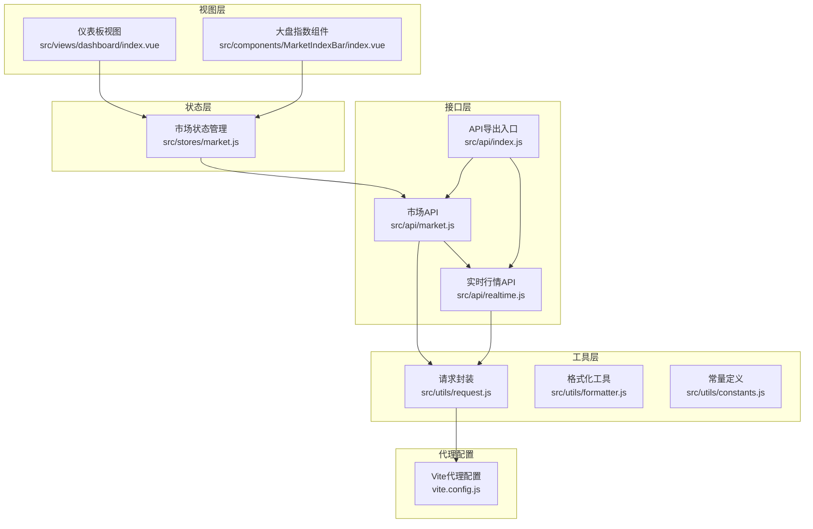
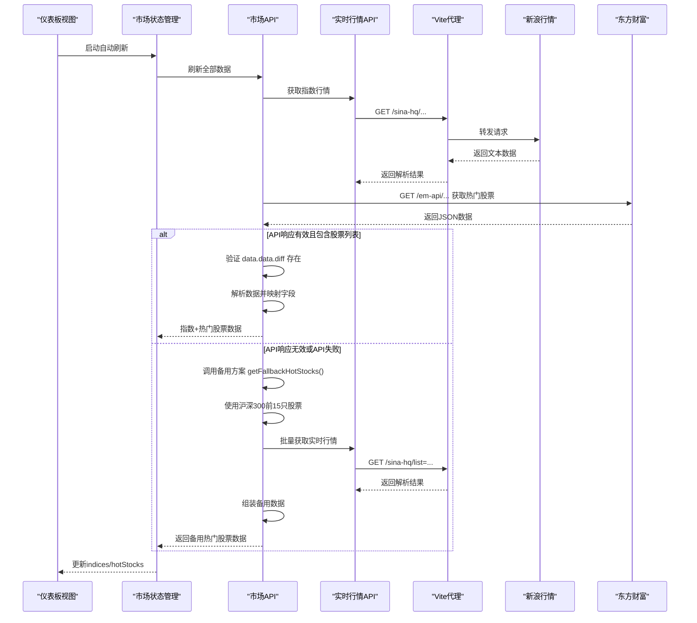
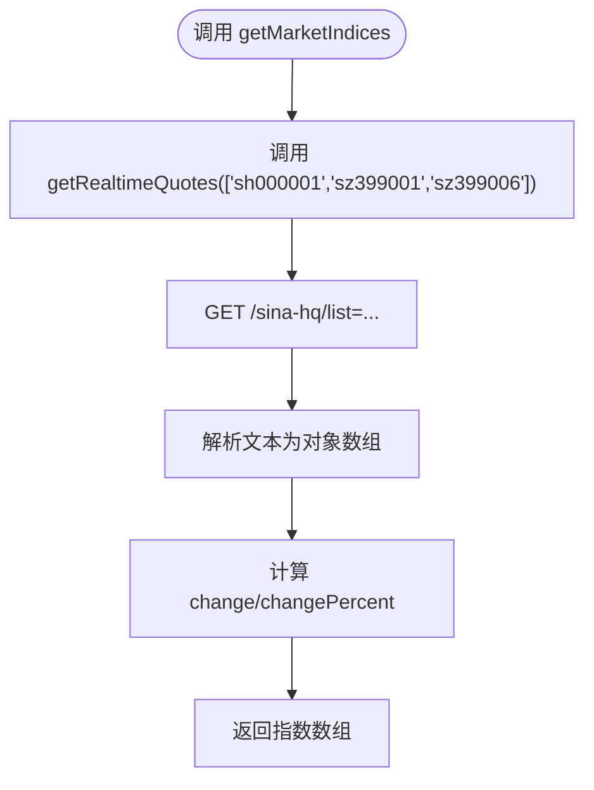
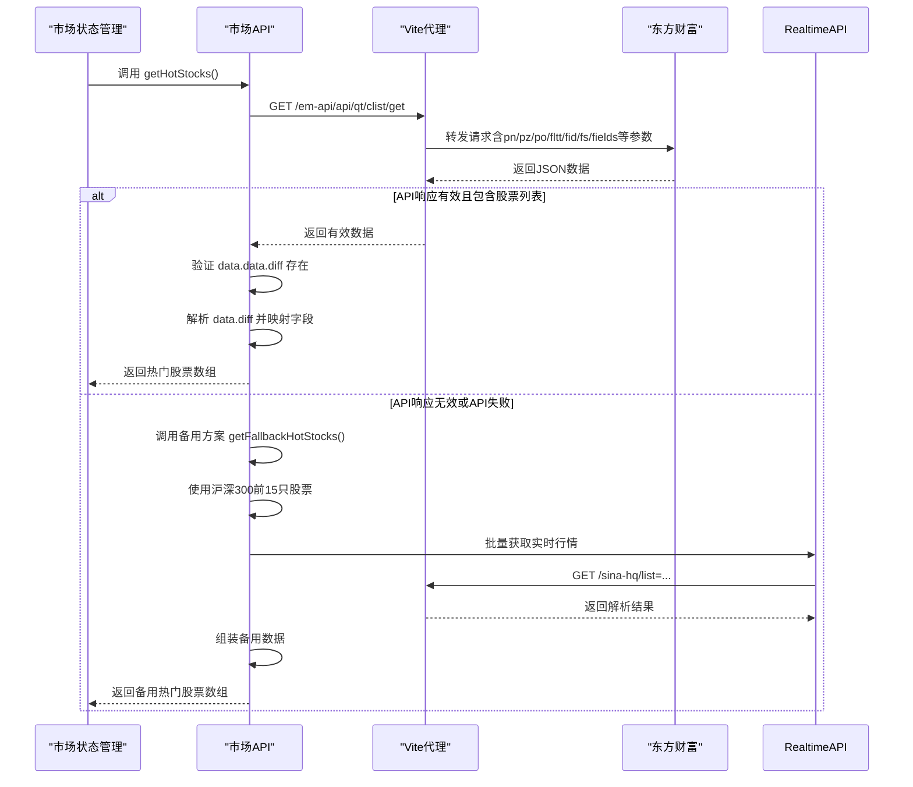
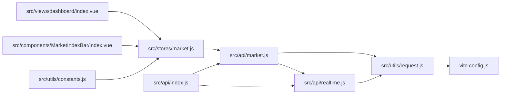

# 市场数据API

<cite>
**本文引用的文件**
- [src/api/market.js](file://src/api/market.js)
- [src/api/realtime.js](file://src/api/realtime.js)
- [src/utils/request.js](file://src/utils/request.js)
- [src/stores/market.js](file://src/stores/market.js)
- [src/views/dashboard/index.vue](file://src/views/dashboard/index.vue)
- [src/components/MarketIndexBar/index.vue](file://src/components/MarketIndexBar/index.vue)
- [src/utils/formatter.js](file://src/utils/formatter.js)
- [src/utils/constants.js](file://src/utils/constants.js)
- [vite.config.js](file://vite.config.js)
- [src/api/index.js](file://src/api/index.js)
</cite>

## 更新摘要
**变更内容**
- 增强了备用方案实现，改进了热门股票获取逻辑，增加了更多错误处理机制
- `getHotStocks`函数现在具备更完善的API响应验证和错误处理
- 新增了对API响应结构的严格检查（`if (!data?.data?.diff)`）
- 改进了批量股票名称获取功能的错误处理机制
- 增强了备用热门股票接口的容错能力
- 完善了整个市场数据API的错误兜底机制

## 目录
1. [简介](#简介)
2. [项目结构](#项目结构)
3. [核心组件](#核心组件)
4. [架构总览](#架构总览)
5. [详细组件分析](#详细组件分析)
6. [依赖关系分析](#依赖关系分析)
7. [性能与质量保障](#性能与质量保障)
8. [故障排查指南](#故障排查指南)
9. [结论](#结论)
10. [附录：接口规范与示例](#附录接口规范与示例)

## 简介
本文件面向市场数据API的使用者与维护者，系统性梳理"大盘指数"和"热门股票"两大核心数据域的接口规范、数据来源、更新机制、字段定义与前端展示方式，并给出可视化建议与应用场景。该系统基于Vue生态与Pinia状态管理，通过Vite代理访问新浪/东方财富等第三方数据源，实现自动刷新与错误兜底。**最新版本增强了备用方案实现，改进了热门股票获取逻辑，增加了更多错误处理机制，显著提升了系统的稳定性和可靠性**。

## 项目结构
围绕市场数据API的关键文件组织如下：
- 接口层：负责对外暴露API函数（如获取大盘指数、热门股票、全市场扫描）
- 实时行情解析：负责从新浪/东方财富拉取并解析实时行情
- 状态层：集中管理市场数据的加载状态与定时刷新
- 视图层：仪表板页面承载大盘指数卡片与热门股票表格
- 工具层：统一请求封装、格式化与常量定义

**图表来源**
- [src/views/dashboard/index.vue:1-163](file://src/views/dashboard/index.vue#L1-L163)
- [src/components/MarketIndexBar/index.vue:1-87](file://src/components/MarketIndexBar/index.vue#L1-L87)
- [src/stores/market.js:1-41](file://src/stores/market.js#L1-L41)
- [src/api/market.js:1-208](file://src/api/market.js#L1-L208)
- [src/api/realtime.js:1-56](file://src/api/realtime.js#L1-L56)
- [src/utils/request.js:1-29](file://src/utils/request.js#L1-L29)
- [src/utils/constants.js:62-67](file://src/utils/constants.js#L62-L67)
- [vite.config.js:15-66](file://vite.config.js#L15-L66)
- [src/api/index.js:1-5](file://src/api/index.js#L1-L5)

**章节来源**
- [src/api/market.js:1-208](file://src/api/market.js#L1-L208)
- [src/api/realtime.js:1-56](file://src/api/realtime.js#L1-L56)
- [src/stores/market.js:1-41](file://src/stores/market.js#L1-L41)
- [src/views/dashboard/index.vue:1-163](file://src/views/dashboard/index.vue#L1-L163)
- [src/components/MarketIndexBar/index.vue:1-87](file://src/components/MarketIndexBar/index.vue#L1-L87)
- [src/utils/request.js:1-29](file://src/utils/request.js#L1-L29)
- [src/utils/formatter.js:1-60](file://src/utils/formatter.js#L1-L60)
- [src/utils/constants.js:62-67](file://src/utils/constants.js#L62-L67)
- [vite.config.js:15-66](file://vite.config.js#L15-L66)
- [src/api/index.js:1-5](file://src/api/index.js#L1-L5)

## 核心组件
- **getMarketIndices**：获取三大指数（上证指数、深证成指、创业板指）的实时行情
- **getHotStocks**：获取按成交额排序的热门股票榜单，具备完善的备用数据源降级机制
- **getAllMarketStocks**：获取全市场A股列表，基于沪深300成分股扫描
- **getMarketStocksByTencent**：使用本地沪深300成分股列表获取股票信息
- **getStockNames**：批量获取股票名称，支持最多800只股票一次请求，具备健壮的错误处理
- **Pinia市场状态管理**：集中管理数据、加载状态与定时刷新
- **实时行情解析**：从新浪/东方财富抓取并解析文本/JSON格式数据
- **仪表板与指数卡片**：展示指数涨跌与热门股票表格

**章节来源**
- [src/api/market.js:7-9](file://src/api/market.js#L7-L9)
- [src/api/market.js:15-86](file://src/api/market.js#L15-L86)
- [src/api/market.js:93-96](file://src/api/market.js#L93-L96)
- [src/api/market.js:140-207](file://src/api/market.js#L140-L207)
- [src/api/market.js:111-134](file://src/api/market.js#L111-L134)
- [src/stores/market.js:5-40](file://src/stores/market.js#L5-L40)
- [src/api/realtime.js:39-47](file://src/api/realtime.js#L39-L47)
- [src/views/dashboard/index.vue:3-66](file://src/views/dashboard/index.vue#L3-L66)
- [src/components/MarketIndexBar/index.vue:1-32](file://src/components/MarketIndexBar/index.vue#L1-L32)

## 架构总览
系统采用"视图-状态-接口-工具-代理"的分层架构：
- 视图层负责渲染与交互（仪表板、指数卡片、热门股票表格）
- 状态层负责数据聚合与定时刷新（Pinia Store）
- 接口层负责调用第三方数据源（新浪/东方财富），并提供完善的备用数据源降级机制
- 工具层负责请求封装与格式化
- 代理层负责跨域与Referer校验（Vite Dev Server Proxy）

**图表来源**
- [src/stores/market.js:19-23](file://src/stores/market.js#L19-L23)
- [src/api/market.js:7-9](file://src/api/market.js#L7-L9)
- [src/api/market.js:15-86](file://src/api/market.js#L15-L86)
- [src/api/realtime.js:39-47](file://src/api/realtime.js#L39-L47)
- [vite.config.js:15-66](file://vite.config.js#L15-L66)

## 详细组件分析

### 大盘指数接口 getMarketIndices
- **功能**：返回上证指数、深证成指、创业板指的实时行情
- **数据来源**：通过实时行情API批量拉取新浪行情文本，解析为结构化对象
- **字段定义**：名称、开盘、昨收、当前价、最高、最低、成交量、成交额、日期、时间、涨跌额、涨跌幅、symbol
- **计算逻辑**：涨跌额=当前价-昨收；涨跌幅=（涨跌额/昨收）*100
- **更新机制**：Pinia Store每30秒自动刷新一次

**图表来源**
- [src/api/market.js:7-9](file://src/api/market.js#L7-L9)
- [src/api/realtime.js:39-47](file://src/api/realtime.js#L39-L47)
- [src/api/realtime.js:7-33](file://src/api/realtime.js#L7-L33)

**章节来源**
- [src/api/market.js:7-9](file://src/api/market.js#L7-L9)
- [src/api/realtime.js:7-33](file://src/api/realtime.js#L7-L33)
- [src/api/realtime.js:39-47](file://src/api/realtime.js#L39-L47)
- [src/stores/market.js:25-33](file://src/stores/market.js#L25-L33)

### 热门股票接口 getHotStocks
- **功能**：返回按成交额排序的前N只股票（默认15只），具备完善的备用数据源降级机制
- **数据来源**：优先调用东方财富接口，若失败则使用沪深300成分股作为备用
- **字段映射**：排名、代码、名称、价格、涨跌幅、涨跌额、成交量、成交额、换手率、symbol
- **筛选与排序**：fs参数组合过滤A股不同板块与类型；fid=f6按成交额排序
- **备用方案**：当东方财富API不可用时，使用沪深300前15只股票作为热门股票
- **更新机制**：Pinia Store每30秒自动刷新一次
- **增强的错误处理**：增加了对API响应结构的严格验证和完整的错误捕获机制

**图表来源**
- [src/api/market.js:15-86](file://src/api/market.js#L15-L86)
- [src/api/market.js:55-86](file://src/api/market.js#L55-L86)
- [vite.config.js:42-55](file://vite.config.js#L42-L55)

**章节来源**
- [src/api/market.js:15-86](file://src/api/market.js#L15-L86)
- [src/stores/market.js:15-23](file://src/stores/market.js#L15-L23)

### 全市场股票扫描接口 getAllMarketStocks
- **功能**：获取全市场A股列表，基于沪深300成分股作为扫描基础
- **数据来源**：直接调用`getMarketStocksByTencent`函数
- **参数**：totalCount - 获取股票数量，默认300只
- **实现**：使用备用方案（沪深300成分股）作为全市场扫描的基础
- **优势**：避免了东方财富API的限制，提供稳定的全市场数据

**章节来源**
- [src/api/market.js:93-96](file://src/api/market.js#L93-L96)

### 沪深300成分股扫描接口 getMarketStocksByTencent
- **功能**：使用本地沪深300成分股列表获取股票信息
- **数据来源**：内置沪深300成分股代码列表（共300只）
- **实现**：
  - 从内置列表中选择指定数量的股票代码
  - 生成对应的symbol列表（sh或sz前缀）
  - 批量获取股票名称（最多800只一次请求）
  - 组装返回结果，包含代码、名称、symbol
- **优势**：提供稳定的全市场扫描能力，不受第三方API限制
- **增强的错误处理**：增加了完整的try-catch块和错误日志记录

**章节来源**
- [src/api/market.js:140-207](file://src/api/market.js#L140-L207)

### 批量股票名称获取接口 getStockNames
- **功能**：批量获取股票名称，支持最多800只股票一次请求
- **输入**：股票代码列表（symbol数组）
- **实现**：
  - 将长列表按800只一批进行分批处理
  - 对每个批次调用新浪API获取名称
  - 解析新浪返回的文本格式数据
  - 缓存并返回名称映射
- **优势**：解决新浪API单次请求限制，提高批量获取效率
- **健壮的错误处理**：每个批次都有独立的错误捕获和日志记录

**章节来源**
- [src/api/market.js:111-134](file://src/api/market.js#L111-L134)

### 备用热门股票接口 getFallbackHotStocks
- **功能**：当东方财富API失败时，使用沪深300成分股作为备用热门股票
- **数据来源**：内置沪深300前15只股票代码
- **实现**：
  - 定义备用股票代码列表
  - 生成对应的symbol列表
  - 批量获取实时行情和名称
  - 组装备用数据结构
- **优势**：确保系统在第三方API不可用时仍能提供热门股票数据
- **完整的错误处理**：增加了try-catch块和详细的错误日志

**章节来源**
- [src/api/market.js:55-86](file://src/api/market.js#L55-L86)

### 实时行情解析 getRealtimeQuotes
- **输入**：股票代码数组（如['sh000001','sz399001']）
- **输出**：解析后的行情对象数组（包含名称、开盘、昨收、当前价、最高、最低、成交量、成交额、日期、时间、涨跌额、涨跌幅、symbol）
- **错误处理**：异常时返回空数组，避免影响整体刷新

**章节来源**
- [src/api/realtime.js:39-47](file://src/api/realtime.js#L39-L47)
- [src/api/realtime.js:7-33](file://src/api/realtime.js#L7-L33)

### Pinia市场状态管理
- **状态**：indices、hotStocks、loading
- **方法**：fetchIndices、fetchHotStocks、refreshAll、startAutoRefresh、stopAutoRefresh
- **自动刷新**：启动后立即执行一次，随后每30秒执行一次Promise.all并发刷新
- **错误兜底**：接口异常返回空数组，避免崩溃

**章节来源**
- [src/stores/market.js:5-40](file://src/stores/market.js#L5-L40)

### 前端展示与交互
- **仪表板视图**：展示大盘指数卡片与热门股票表格，支持手动刷新与点击跳转个股详情
- **指数卡片**：根据涨跌显示不同颜色边框与文字颜色
- **热门股票**：按成交额排序，支持点击进入个股详情页
- **备用数据展示**：当使用备用数据源时，界面保持一致的展示效果

**章节来源**
- [src/views/dashboard/index.vue:3-66](file://src/views/dashboard/index.vue#L3-L66)
- [src/components/MarketIndexBar/index.vue:1-32](file://src/components/MarketIndexBar/index.vue#L1-L32)

## 依赖关系分析
- **getMarketIndices** 依赖 **getRealtimeQuotes**
- **getHotStocks** 依赖 **jsonRequest**（axios实例），包含完善的备用方案
- **getFallbackHotStocks** 依赖 **getRealtimeQuotes** 和 **getStockNames**
- **getAllMarketStocks** 依赖 **getMarketStocksByTencent**
- **getMarketStocksByTencent** 依赖 **getStockNames**
- **getStockNames** 依赖 **textRequest**（axios实例）
- **getRealtimeQuotes** 依赖 **textRequest**（axios实例）
- **getHotStocks** 与 **getFallbackHotStocks** 均通过Vite代理转发到新浪/东方财富
- **Pinia Store** 依赖上述API进行数据拉取与刷新
- **常量定义** 提供指数代码清单与颜色映射

**图表来源**
- [src/api/market.js:1-2](file://src/api/market.js#L1-L2)
- [src/api/realtime.js:1-1](file://src/api/realtime.js#L1-L1)
- [src/utils/request.js:1-8](file://src/utils/request.js#L1-L8)
- [src/stores/market.js:1-3](file://src/stores/market.js#L1-L3)
- [src/views/dashboard/index.vue:80-85](file://src/views/dashboard/index.vue#L80-L85)
- [src/components/MarketIndexBar/index.vue:19-24](file://src/components/MarketIndexBar/index.vue#L19-L24)
- [src/api/index.js:1-5](file://src/api/index.js#L1-L5)
- [vite.config.js:15-66](file://vite.config.js#L15-L66)
- [src/utils/constants.js:62-67](file://src/utils/constants.js#L62-L67)

**章节来源**
- [src/api/market.js:1-2](file://src/api/market.js#L1-L2)
- [src/api/realtime.js:1-1](file://src/api/realtime.js#L1-L1)
- [src/utils/request.js:1-8](file://src/utils/request.js#L1-L8)
- [src/stores/market.js:1-3](file://src/stores/market.js#L1-L3)
- [src/views/dashboard/index.vue:80-85](file://src/views/dashboard/index.vue#L80-L85)
- [src/components/MarketIndexBar/index.vue:19-24](file://src/components/MarketIndexBar/index.vue#L19-L24)
- [src/api/index.js:1-5](file://src/api/index.js#L1-L5)
- [vite.config.js:15-66](file://vite.config.js#L15-L66)
- [src/utils/constants.js:62-67](file://src/utils/constants.js#L62-L67)

## 性能与质量保障
- **自动刷新策略**：每30秒一次，避免过于频繁导致带宽与服务器压力
- **并发刷新**：指数与热门股票使用Promise.all并发拉取，缩短等待时间
- **完善的备用数据源机制**：当主数据源失败时自动切换到备用方案，确保服务可用性
- **批量请求优化**：股票名称获取支持最多800只股票一次请求，减少HTTP请求次数
- **健壮的错误兜底**：接口异常返回空数组，避免影响其他数据展示
- **超时控制**：axios实例统一设置15秒超时，防止阻塞
- **格式化**：统一的价格、涨跌幅、成交量、成交额格式化，提升可读性
- **开市判断**：提供isMarketOpen辅助函数，可用于业务侧控制刷新频率或提示
- **增强的错误处理**：所有关键函数都增加了try-catch块和详细的错误日志

**章节来源**
- [src/stores/market.js:25-33](file://src/stores/market.js#L25-L33)
- [src/stores/market.js:19-23](file://src/stores/market.js#L19-L23)
- [src/utils/request.js:5-8](file://src/utils/request.js#L5-L8)
- [src/utils/request.js:17-25](file://src/utils/request.js#L17-L25)
- [src/utils/formatter.js:3-31](file://src/utils/formatter.js#L3-L31)
- [src/utils/formatter.js:41-47](file://src/utils/formatter.js#L41-L47)

## 故障排查指南
- **网络错误**：检查Vite代理是否正确配置，目标域名与Referer头是否匹配
- **请求超时**：确认timeout设置与网络状况，必要时延长超时或减少并发
- **数据为空**：确认第三方接口返回结构是否变化，检查字段映射与参数
- **备用数据源问题**：检查备用方案的实现，确认沪深300代码列表是否完整
- **批量请求失败**：确认批量请求的限制（800只），适当调整批次大小
- **刷新不生效**：确认定时器是否被清理，以及store中startAutoRefresh/stopAutoRefresh调用时机
- **API响应验证失败**：检查东方财富API的响应结构，确认`data.data.diff`字段是否存在
- **错误日志查看**：查看浏览器控制台中的错误日志，定位具体的失败原因

**章节来源**
- [vite.config.js:15-66](file://vite.config.js#L15-L66)
- [src/utils/request.js:17-25](file://src/utils/request.js#L17-L25)
- [src/stores/market.js:31-33](file://src/stores/market.js#L31-L33)

## 结论
该市场数据API通过清晰的分层设计与代理转发机制，实现了稳定的大盘指数与热门股票数据获取。**最新版本显著增强了备用方案实现，改进了热门股票获取逻辑，增加了更多错误处理机制，提供了更完善的API响应验证和错误兜底能力**。这些改进使得系统在面对第三方API不稳定或响应异常时，能够自动切换到备用方案，确保服务的连续性和可靠性。Pinia状态管理提供了自动刷新与错误兜底能力，前端组件则以直观的方式呈现关键指标。建议在生产环境中结合开市判断与更细粒度的缓存策略，进一步优化性能与用户体验。

## 附录：接口规范与示例

### 接口一：获取大盘指数 getMarketIndices
- **方法**：GET
- **路径**：由内部调用决定（通过实时行情API批量获取）
- **参数**：无
- **响应**：数组，每个元素包含名称、开盘、昨收、当前价、最高、最低、成交量、成交额、日期、时间、涨跌额、涨跌幅、symbol
- **示例响应字段**（示意）：
  - 名称、开盘、昨收、当前价、最高、最低、成交量、成交额、日期、时间、涨跌额、涨跌幅、symbol
- **说明**：内部固定指数代码集合，无需外部传参

**章节来源**
- [src/api/market.js:7-9](file://src/api/market.js#L7-L9)
- [src/api/realtime.js:39-47](file://src/api/realtime.js#L39-L47)
- [src/utils/constants.js:62-67](file://src/utils/constants.js#L62-L67)

### 接口二：获取热门股票 getHotStocks
- **方法**：GET
- **路径**：/em-api/api/qt/clist/get
- **参数**：
  - pn：页码，默认1
  - pz：每页数量，默认15
  - po：排序字段序号，默认1（升序）
  - np：排序方向，默认1（升序）
  - fltt：返回格式，默认2
  - invt：默认2
  - fid：排序字段标识，f6表示按成交额
  - fs：筛选条件，过滤A股不同板块与类型
  - fields：返回字段集合，包含f2,f3,f4,f5,f6,f8,f12,f14
- **响应**：数组，每个元素包含排名、代码、名称、价格、涨跌幅、涨跌额、成交量、成交额、换手率、symbol
- **备用机制**：当主API失败时，自动切换到备用方案（沪深300前15只）
- **增强的错误处理**：增加了API响应结构验证和完整的错误捕获
- **示例响应字段**（示意）：
  - rank、code、name、price、changePercent、change、volume、amount、turnoverRate、symbol

**章节来源**
- [src/api/market.js:15-86](file://src/api/market.js#L15-L86)
- [vite.config.js:42-55](file://vite.config.js#L42-L55)

### 接口三：获取全市场A股列表 getAllMarketStocks
- **方法**：GET
- **路径**：内部调用（通过`getMarketStocksByTencent`实现）
- **参数**：
  - totalCount：获取股票数量，默认300
- **响应**：数组，每个元素包含code、name、symbol
- **实现机制**：使用沪深300成分股作为扫描基础，避免第三方API限制
- **示例响应字段**（示意）：
  - code、name、symbol

**章节来源**
- [src/api/market.js:93-96](file://src/api/market.js#L93-L96)

### 接口四：获取沪深300成分股 getMarketStocksByTencent
- **方法**：GET
- **路径**：内部调用（批量获取股票名称）
- **参数**：
  - limit：限制数量，默认300
- **响应**：数组，每个元素包含code、name、symbol
- **实现机制**：使用内置沪深300成分股代码列表，支持批量名称获取
- **增强的错误处理**：增加了完整的try-catch块和错误日志
- **示例响应字段**（示意）：
  - code、name、symbol

**章节来源**
- [src/api/market.js:140-207](file://src/api/market.js#L140-L207)

### 接口五：批量获取股票名称 getStockNames
- **方法**：GET
- **路径**：/sina-hq/list=...
- **参数**：
  - symbols：股票代码列表（最多800只）
- **响应**：对象映射，键为symbol，值为股票名称
- **实现机制**：分批处理，每批最多800只股票
- **健壮的错误处理**：每个批次都有独立的错误捕获和日志记录
- **示例响应字段**（示意）：
  - symbol: name

**章节来源**
- [src/api/market.js:111-134](file://src/api/market.js#L111-L134)

### 数据字段定义
- **指数字段**（来自新浪行情解析）：
  - 名称、开盘、昨收、当前价、最高、最低、成交量、成交额、日期、时间、涨跌额、涨跌幅、symbol
- **热门股票字段**（来自东方财富接口）：
  - rank、code、name、price、changePercent、change、volume、amount、turnoverRate、symbol
- **备用热门股票字段**（来自沪深300成分股）：
  - rank、code、name、price、changePercent、change、volume、amount、turnoverRate、symbol
- **全市场股票字段**（来自沪深300成分股）：
  - code、name、symbol

**章节来源**
- [src/api/realtime.js:7-33](file://src/api/realtime.js#L7-L33)
- [src/api/market.js:34-45](file://src/api/market.js#L34-L45)
- [src/api/market.js:70-81](file://src/api/market.js#L70-L81)
- [src/api/market.js:195-202](file://src/api/market.js#L195-L202)

### 更新机制与质量保证
- **自动刷新**：每30秒一次，Promise.all并发刷新指数与热门股票
- **完善的备用数据源机制**：当主API失败时自动切换到备用方案
- **批量请求优化**：支持最多800只股票一次请求，提高效率
- **健壮的错误处理**：接口异常返回空数组，避免影响整体刷新
- **超时控制**：axios实例统一设置15秒超时
- **格式化**：统一的价格、涨跌幅、成交量、成交额格式化输出
- **API响应验证**：对第三方API的响应结构进行严格验证

**章节来源**
- [src/stores/market.js:25-33](file://src/stores/market.js#L25-L33)
- [src/stores/market.js:19-23](file://src/stores/market.js#L19-L23)
- [src/utils/request.js:5-8](file://src/utils/request.js#L5-L8)
- [src/utils/request.js:17-25](file://src/utils/request.js#L17-L25)
- [src/utils/formatter.js:3-31](file://src/utils/formatter.js#L3-L31)

### 可视化建议与应用场景
- **指数卡片**：展示涨跌趋势与数值，支持点击进入指数详情
- **热门股票表格**：按成交额排序，支持点击进入个股详情页
- **备用数据展示**：当使用备用数据源时，界面保持一致的展示效果
- **应用场景**：行情监控面板、自选股跟踪、交易决策参考、全市场扫描分析

**章节来源**
- [src/views/dashboard/index.vue:3-66](file://src/views/dashboard/index.vue#L3-L66)
- [src/components/MarketIndexBar/index.vue:1-32](file://src/components/MarketIndexBar/index.vue#L1-L32)