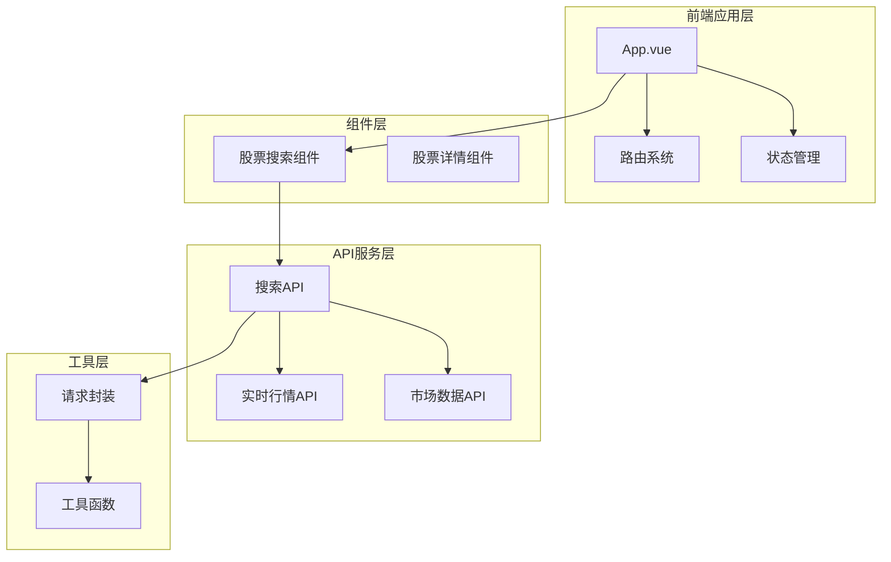
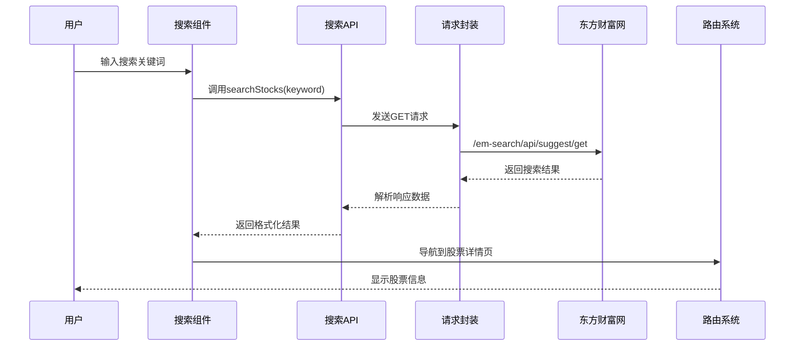
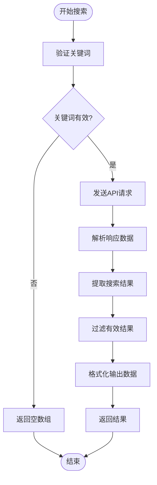
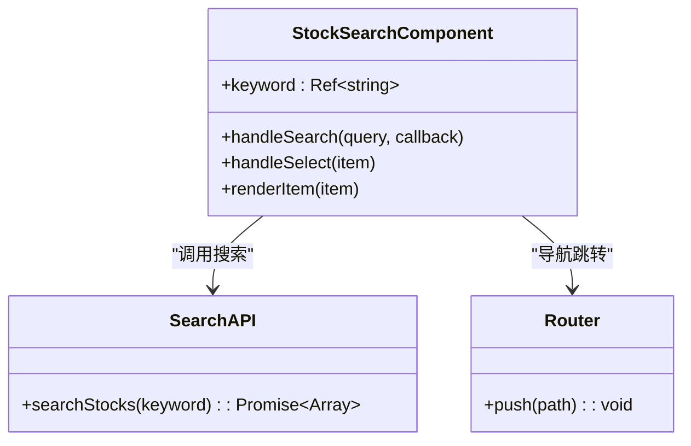
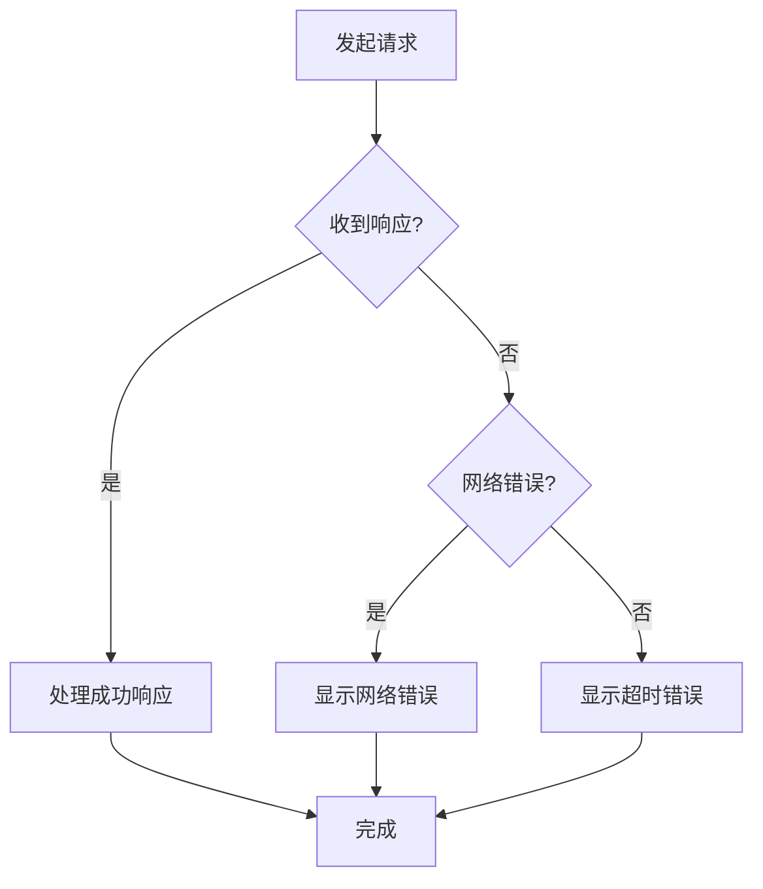
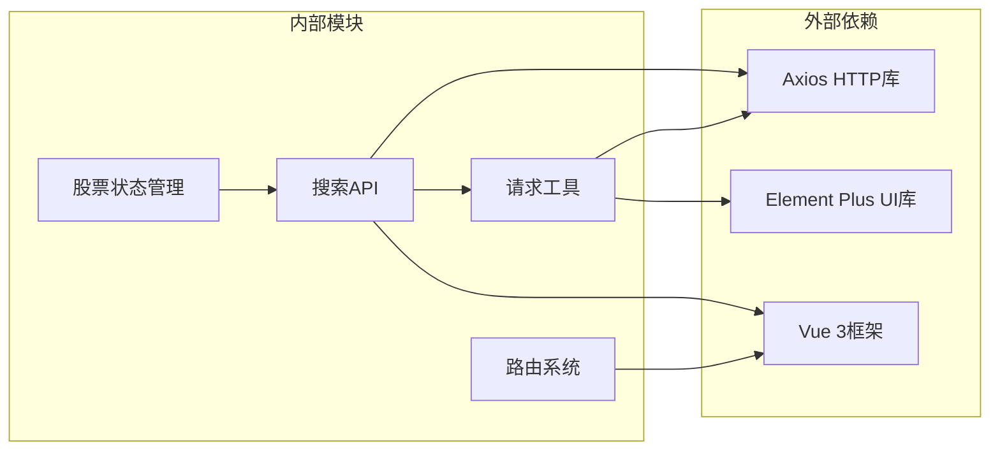
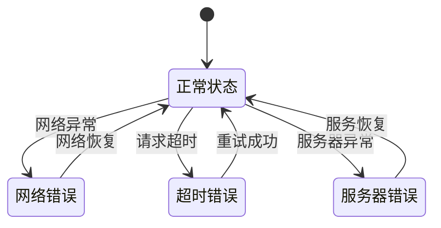

# 股票搜索API

<cite>
**本文档引用的文件**
- [search.js](file://src/api/search.js)
- [index.vue](file://src/components/StockSearch/index.vue)
- [request.js](file://src/utils/request.js)
- [stock.js](file://src/stores/stock.js)
- [constants.js](file://src/utils/constants.js)
- [market.js](file://src/api/market.js)
- [realtime.js](file://src/api/realtime.js)
- [index.js](file://src/router/index.js)
- [main.js](file://src/main.js)
</cite>

## 目录
1. [简介](#简介)
2. [项目结构](#项目结构)
3. [核心组件](#核心组件)
4. [架构概览](#架构概览)
5. [详细组件分析](#详细组件分析)
6. [依赖关系分析](#依赖关系分析)
7. [性能考虑](#性能考虑)
8. [故障排除指南](#故障排除指南)
9. [结论](#结论)

## 简介

本文档详细说明了量化交易系统中的股票搜索API接口规范。该系统基于Vue 3 + Element Plus构建，提供了完整的股票搜索功能，支持通过股票代码和名称进行快速检索。系统集成了东方财富网的数据源，实现了高效的股票搜索和导航功能。

## 项目结构

量化交易系统的前端架构采用模块化设计，主要包含以下关键模块：

**图表来源**
- [main.js:1-17](file://src/main.js#L1-L17)
- [index.js:1-58](file://src/router/index.js#L1-L58)

**章节来源**
- [main.js:1-17](file://src/main.js#L1-L17)
- [index.js:1-58](file://src/router/index.js#L1-L58)

## 核心组件

### 搜索API服务

搜索功能由专门的API服务提供，位于`src/api/search.js`文件中。该服务封装了与东方财富网搜索接口的交互逻辑。

### 搜索组件

股票搜索组件位于`src/components/StockSearch/index.vue`，提供了用户友好的搜索界面，支持自动完成和实时搜索功能。

### 请求封装

统一的请求封装位于`src/utils/request.js`，提供了JSON和文本两种请求模式，支持超时控制和错误处理。

**章节来源**
- [search.js:1-38](file://src/api/search.js#L1-L38)
- [index.vue:1-76](file://src/components/StockSearch/index.vue#L1-L76)
- [request.js:1-29](file://src/utils/request.js#L1-L29)

## 架构概览

系统采用前后端分离的架构设计，搜索功能通过RESTful API实现：

**图表来源**
- [search.js:7-37](file://src/api/search.js#L7-L37)
- [index.vue:34-43](file://src/components/StockSearch/index.vue#L34-L43)
- [request.js:5-8](file://src/utils/request.js#L5-L8)

## 详细组件分析

### 搜索API实现

#### 接口规范

搜索API提供了一个异步函数`searchStocks(keyword)`，用于执行股票搜索操作：

**HTTP方法**: GET  
**URL路径**: `/em-search/api/suggest/get`  
**查询参数**:
- `input`: 搜索关键词（必填）
- `type`: 搜索类型（固定值14）
- `count`: 返回结果数量（固定值10）

#### 数据处理流程

**图表来源**
- [search.js:7-37](file://src/api/search.js#L7-L37)

#### 结果过滤机制

搜索结果经过多层过滤确保数据质量：

1. **基础验证**: 检查关键词是否为空
2. **API响应验证**: 确保响应数据结构正确
3. **代码格式验证**: 使用正则表达式验证股票代码格式
4. **市场过滤**: 仅显示A股主板、创业板、科创板

#### 输出数据结构

每个搜索结果包含以下字段：
- `code`: 股票代码（字符串）
- `name`: 股票名称（字符串）
- `market`: 交易所标识（'sh'或'sz'）
- `symbol`: 完整股票代码（market+code）

**章节来源**
- [search.js:7-37](file://src/api/search.js#L7-L37)

### 搜索组件实现

#### 用户界面设计

搜索组件基于Element Plus的Autocomplete组件构建，提供以下特性：

**图表来源**
- [index.vue:25-43](file://src/components/StockSearch/index.vue#L25-L43)

#### 搜索行为特征

- **防抖机制**: 300毫秒延迟避免频繁请求
- **自动完成**: 实时显示搜索建议
- **选择处理**: 点击结果自动跳转到详情页
- **市场标识**: 在UI中显示沪市/深市标识

**章节来源**
- [index.vue:1-76](file://src/components/StockSearch/index.vue#L1-L76)

### 请求封装机制

#### HTTP客户端配置

系统使用Axios创建了两个专用的HTTP客户端：

1. **JSON请求客户端** (`jsonRequest`):
   - 超时时间: 15秒
   - 响应类型: JSON
   - 错误处理: 统一错误消息提示

2. **文本请求客户端** (`textRequest`):
   - 超时时间: 15秒
   - 响应类型: 文本
   - 特殊转换: 保持原始文本格式

#### 错误处理策略

**图表来源**
- [request.js:17-28](file://src/utils/request.js#L17-L28)

**章节来源**
- [request.js:1-29](file://src/utils/request.js#L1-L29)

## 依赖关系分析

### 核心依赖关系

**图表来源**
- [package.json:11-26](file://package.json#L11-L26)
- [search.js:1](file://src/api/search.js#L1)
- [request.js:1](file://src/utils/request.js#L1)

### 模块间耦合度

系统采用低耦合设计：
- API层与UI层完全解耦
- 请求封装独立于业务逻辑
- 状态管理与具体组件分离
- 外部依赖通过统一接口访问

**章节来源**
- [package.json:11-26](file://package.json#L11-L26)

## 性能考虑

### 缓存策略建议

1. **本地缓存**:
   - 对于常用搜索词建立内存缓存
   - 设置合理的过期时间（5-10分钟）
   - 支持LRU淘汰策略

2. **浏览器缓存**:
   - 利用HTTP缓存头控制缓存行为
   - 对静态搜索结果启用缓存

3. **CDN加速**:
   - 将搜索结果通过CDN分发
   - 优化图片和静态资源加载

### 性能优化建议

1. **请求优化**:
   - 实现请求去重，避免重复请求相同关键词
   - 使用节流控制搜索频率
   - 实现智能预加载机制

2. **渲染优化**:
   - 使用虚拟滚动处理大量搜索结果
   - 实现懒加载减少初始渲染压力
   - 优化CSS动画和过渡效果

3. **数据处理优化**:
   - 异步处理大数据量搜索结果
   - 实现增量更新机制
   - 优化DOM操作和事件绑定

## 故障排除指南

### 常见问题及解决方案

#### 搜索无结果

**可能原因**:
- 关键词格式不正确
- 网络连接异常
- API接口不可用

**解决步骤**:
1. 检查关键词是否包含特殊字符
2. 验证网络连接状态
3. 查看浏览器开发者工具中的网络请求
4. 确认API接口可用性

#### 搜索响应缓慢

**可能原因**:
- 网络延迟过高
- 服务器负载过大
- 浏览器缓存问题

**解决步骤**:
1. 清除浏览器缓存
2. 尝试在不同网络环境下测试
3. 检查服务器状态
4. 实现本地缓存机制

#### 错误处理机制

系统实现了完善的错误处理机制：

**图表来源**
- [request.js:17-28](file://src/utils/request.js#L17-L28)

**章节来源**
- [request.js:17-28](file://src/utils/request.js#L17-L28)

## 结论

该股票搜索API系统提供了完整、高效的股票搜索功能，具有以下特点：

1. **简洁的接口设计**: 通过单一函数提供完整的搜索能力
2. **强大的数据处理**: 实现了多层次的数据验证和过滤
3. **优秀的用户体验**: 提供实时搜索和智能提示功能
4. **可靠的错误处理**: 全面的错误捕获和用户反馈机制
5. **良好的扩展性**: 模块化设计便于功能扩展和维护

系统成功集成了东方财富网的数据源，为用户提供准确、及时的股票搜索服务，是量化交易系统的重要基础设施。