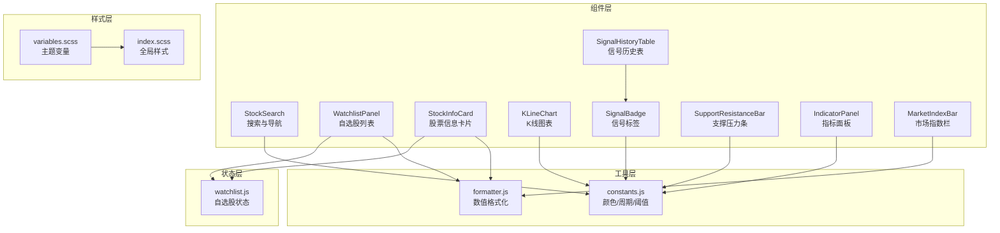
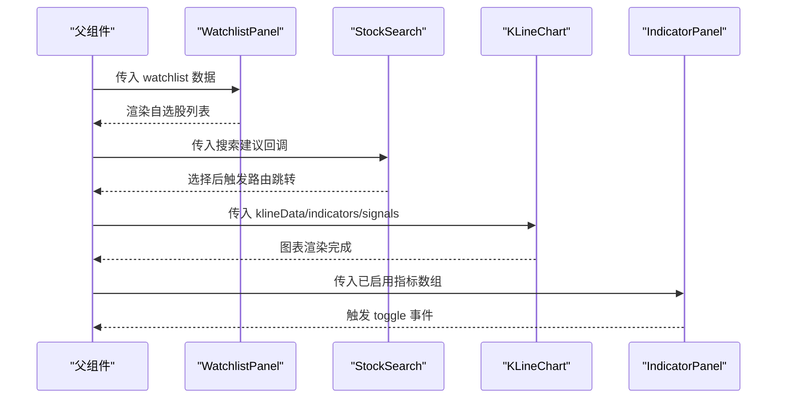
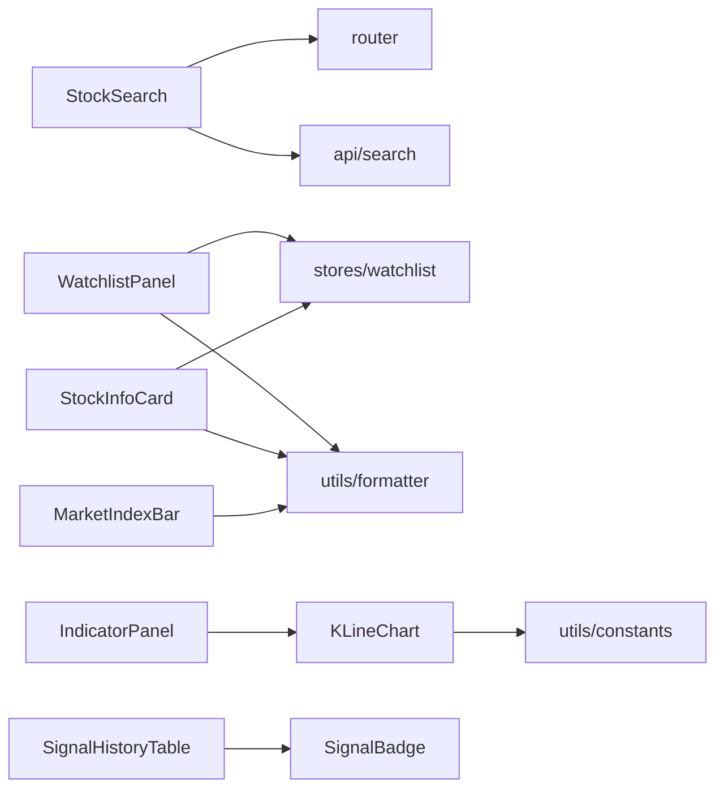

# UI组件系统

<cite>
**本文引用的文件**
- [src/components/index.js](file://src/components/index.js)
- [src/components/KLineChart/index.vue](file://src/components/KLineChart/index.vue)
- [src/components/StockSearch/index.vue](file://src/components/StockSearch/index.vue)
- [src/components/WatchlistPanel/index.vue](file://src/components/WatchlistPanel/index.vue)
- [src/components/SignalBadge/index.vue](file://src/components/SignalBadge/index.vue)
- [src/components/StockInfoCard/index.vue](file://src/components/StockInfoCard/index.vue)
- [src/components/SignalHistoryTable/index.vue](file://src/components/SignalHistoryTable/index.vue)
- [src/components/SupportResistanceBar/index.vue](file://src/components/SupportResistanceBar/index.vue)
- [src/components/IndicatorPanel/index.vue](file://src/components/IndicatorPanel/index.vue)
- [src/components/MarketIndexBar/index.vue](file://src/components/MarketIndexBar/index.vue)
- [src/styles/variables.scss](file://src/styles/variables.scss)
- [src/styles/index.scss](file://src/styles/index.scss)
- [src/utils/constants.js](file://src/utils/constants.js)
- [src/utils/formatter.js](file://src/utils/formatter.js)
- [src/stores/watchlist.js](file://src/stores/watchlist.js)
</cite>

## 目录
1. [简介](#简介)
2. [项目结构](#项目结构)
3. [核心组件](#核心组件)
4. [架构总览](#架构总览)
5. [详细组件分析](#详细组件分析)
6. [依赖关系分析](#依赖关系分析)
7. [性能考量](#性能考量)
8. [故障排查指南](#故障排查指南)
9. [结论](#结论)
10. [附录](#附录)

## 简介
本文件为量化交易平台的UI组件系统提供系统化、可操作的技术文档。内容覆盖组件设计理念与分类（业务组件、展示组件、交互组件）、职责划分、功能特性、API接口、使用方法、配置项、组件间通信方式（props、事件、插槽）、样式定制（主题、CSS变量、响应式）、可访问性与跨浏览器兼容性建议，以及实际使用示例与最佳实践。

## 项目结构
组件系统位于 src/components 下，采用按功能模块化的组织方式，每个组件独立封装并在 src/components/index.js 中统一导出，便于在应用中集中引入与复用。样式通过 SCSS 变量与全局样式进行统一管理；数据格式化与常量定义分别位于 utils 与 stores，为组件提供一致的数据处理与状态管理能力。

**图表来源**
- [src/components/index.js:1-22](file://src/components/index.js#L1-L22)
- [src/styles/variables.scss:1-24](file://src/styles/variables.scss#L1-L24)
- [src/styles/index.scss:1-64](file://src/styles/index.scss#L1-L64)
- [src/utils/constants.js:1-68](file://src/utils/constants.js#L1-L68)
- [src/utils/formatter.js:1-60](file://src/utils/formatter.js#L1-L60)
- [src/stores/watchlist.js:1-53](file://src/stores/watchlist.js#L1-L53)

**章节来源**
- [src/components/index.js:1-22](file://src/components/index.js#L1-L22)
- [src/styles/variables.scss:1-24](file://src/styles/variables.scss#L1-L24)
- [src/styles/index.scss:1-64](file://src/styles/index.scss#L1-L64)

## 核心组件
本节对各组件进行职责与能力概述，并给出统一的使用指引与最佳实践。

- StockSearch：提供股票搜索与跳转，基于远程建议与路由导航。
- WatchlistPanel：展示与管理自选股列表，支持刷新与移除。
- StockInfoCard：展示股票实时行情与基础数据，支持加入/移出自选。
- KLineChart：可视化K线与技术指标，支持多子图、缩放与信号标注。
- SignalBadge：根据买卖类型与强度渲染不同风格的标签。
- SignalHistoryTable：以表格形式展示信号历史，内嵌 SignalBadge。
- SupportResistanceBar：可视化支撑/压力位，直观显示相对当前价的比例。
- IndicatorPanel：切换启用的技术指标集合，向父组件发出 toggle 事件。
- MarketIndexBar：展示主要市场指数的涨跌情况。

**章节来源**
- [src/components/StockSearch/index.vue:1-76](file://src/components/StockSearch/index.vue#L1-L76)
- [src/components/WatchlistPanel/index.vue:1-143](file://src/components/WatchlistPanel/index.vue#L1-L143)
- [src/components/StockInfoCard/index.vue:1-150](file://src/components/StockInfoCard/index.vue#L1-L150)
- [src/components/KLineChart/index.vue:1-285](file://src/components/KLineChart/index.vue#L1-L285)
- [src/components/SignalBadge/index.vue:1-40](file://src/components/SignalBadge/index.vue#L1-L40)
- [src/components/SignalHistoryTable/index.vue:1-32](file://src/components/SignalHistoryTable/index.vue#L1-L32)
- [src/components/SupportResistanceBar/index.vue:1-129](file://src/components/SupportResistanceBar/index.vue#L1-L129)
- [src/components/IndicatorPanel/index.vue:1-37](file://src/components/IndicatorPanel/index.vue#L1-L37)
- [src/components/MarketIndexBar/index.vue:1-87](file://src/components/MarketIndexBar/index.vue#L1-L87)

## 架构总览
组件系统遵循“展示组件 + 业务组件 + 交互组件”的分层理念：
- 展示组件：StockInfoCard、MarketIndexBar、SupportResistanceBar、SignalBadge、SignalHistoryTable 等，负责数据呈现与基础交互。
- 业务组件：StockSearch、WatchlistPanel、KLineChart、IndicatorPanel，承担业务逻辑与复杂交互。
- 交互组件：IndicatorPanel（事件）、StockSearch（路由）、WatchlistPanel（状态）。

组件间通信：
- Props：父组件向子组件传递数据与配置。
- 事件：子组件向父组件发出通知（如 toggle）。
- 插槽：用于内容投影与自定义渲染（如 StockSearch 的默认插槽）。

**图表来源**
- [src/components/WatchlistPanel/index.vue:1-143](file://src/components/WatchlistPanel/index.vue#L1-L143)
- [src/components/StockSearch/index.vue:1-76](file://src/components/StockSearch/index.vue#L1-L76)
- [src/components/KLineChart/index.vue:1-285](file://src/components/KLineChart/index.vue#L1-L285)
- [src/components/IndicatorPanel/index.vue:1-37](file://src/components/IndicatorPanel/index.vue#L1-L37)

## 详细组件分析

### StockSearch（股票搜索）
- 职责：提供带前缀图标的自动完成输入框，远程检索股票并支持选择后跳转详情页。
- 关键API与配置：
  - 属性：v-model（关键词）、fetch-suggestions（远程建议函数）、placeholder、trigger-on-focus、debounce、clearable。
  - 事件：select（选择项时触发）。
  - 插槽：#prefix（前缀图标）、#default（自定义建议项渲染）。
- 使用方法：在页面中引入组件，绑定 v-model 并提供 fetch-suggestions 回调；在回调中调用搜索接口返回标准化结果；选择后通过路由跳转到详情页。
- 最佳实践：设置合理的防抖时间；确保建议项包含 code/name/symbol 字段以便渲染与跳转。

**章节来源**
- [src/components/StockSearch/index.vue:1-76](file://src/components/StockSearch/index.vue#L1-L76)
- [src/api/search.js:1-200](file://src/api/search.js#L1-L200)

### WatchlistPanel（自选股面板）
- 职责：展示用户自选股列表，支持点击跳转、刷新与移除。
- 关键API与配置：
  - 属性：无（内部使用 Pinia 状态）。
  - 事件：无（内部通过路由与状态管理交互）。
  - 插槽：无。
- 使用方法：直接引入组件，组件会从 Pinia 读取 watchlist 与实时行情数据；点击行项跳转至详情；点击刷新按钮拉取最新行情。
- 最佳实践：结合 Pinia 的定时刷新策略，避免频繁请求；在空状态时展示占位图。

**章节来源**
- [src/components/WatchlistPanel/index.vue:1-143](file://src/components/WatchlistPanel/index.vue#L1-L143)
- [src/stores/watchlist.js:1-53](file://src/stores/watchlist.js#L1-L53)
- [src/utils/formatter.js:1-60](file://src/utils/formatter.js#L1-L60)

### StockInfoCard（股票信息卡片）
- 职责：展示股票名称、代码、当前价与涨跌幅、开盘/昨收/最高/最低、成交量/成交额，并支持加入/移出自选。
- 关键API与配置：
  - 属性：info（股票信息对象）。
  - 事件：无。
  - 插槽：无。
- 使用方法：传入包含必要字段的 info 对象；点击星标按钮切换自选状态。
- 最佳实践：确保传入的 info 含有 price/change/changePercent/open/prevClose/high/low/volume/amount 等字段；使用格式化工具保证数字显示一致性。

**章节来源**
- [src/components/StockInfoCard/index.vue:1-150](file://src/components/StockInfoCard/index.vue#L1-L150)
- [src/utils/formatter.js:1-60](file://src/utils/formatter.js#L1-L60)
- [src/stores/watchlist.js:1-53](file://src/stores/watchlist.js#L1-L53)

### KLineChart（K线图表）
- 职责：绘制K线蜡烛图与技术指标（MA、MACD、KDJ、RSI、布林带、成交量），支持多子图、缩放与信号标注。
- 关键API与配置：
  - 属性：klineData（K线数据数组）、indicators（指标对象）、signals（信号数组）、enabledIndicators（启用指标数组）、height（图表高度）。
  - 事件：无（内部暴露 resize 方法供外部调用）。
  - 插槽：无。
- 使用方法：传入标准格式的 K 线数据与指标计算结果；根据需要启用不同指标；传入买卖信号进行标注；在容器尺寸变化时调用 expose 的 resize 方法。
- 最佳实践：确保指标数据与 K 线索引对齐；合理设置 enabledIndicators 以控制子图数量；在大数据量场景下开启 dataZoom 提升交互体验。

**章节来源**
- [src/components/KLineChart/index.vue:1-285](file://src/components/KLineChart/index.vue#L1-L285)
- [src/utils/constants.js:1-68](file://src/utils/constants.js#L1-L68)

### SignalBadge（信号标签）
- 职责：根据信号类型与强度渲染不同风格的标签。
- 关键API与配置：
  - 属性：type（BUY/SELL/OPTIONAL）、strength（STRONG/MEDIUM/WEAK）、effect（主题效果）。
  - 事件：无。
  - 插槽：无。
- 使用方法：传入 type 与 strength 即可生成对应标签文本与样式。
- 最佳实践：保持 type 与 strength 的枚举值一致，便于统一管理。

**章节来源**
- [src/components/SignalBadge/index.vue:1-40](file://src/components/SignalBadge/index.vue#L1-L40)
- [src/utils/constants.js:1-68](file://src/utils/constants.js#L1-L68)

### SignalHistoryTable（信号历史表）
- 职责：以表格形式展示信号历史，列含日期、信号（使用 SignalBadge）、价格、策略与说明。
- 关键API与配置：
  - 属性：signals（信号数组）。
  - 事件：无。
  - 插槽：无。
- 使用方法：传入包含 date/type/strength/price/source/description 的信号数组。
- 最佳实践：确保每条记录包含完整字段；对长文本使用 show-overflow-tooltip。

**章节来源**
- [src/components/SignalHistoryTable/index.vue:1-32](file://src/components/SignalHistoryTable/index.vue#L1-L32)
- [src/components/SignalBadge/index.vue:1-40](file://src/components/SignalBadge/index.vue#L1-L40)

### SupportResistanceBar（支撑压力条）
- 职责：可视化展示支撑/压力位，直观反映与当前价的比例关系。
- 关键API与配置：
  - 属性：supports（支撑位数组）、resistances（压力位数组）、currentPrice（当前价）。
  - 事件：无。
  - 插槽：无。
- 使用方法：传入支撑/压力位与当前价，组件自动计算宽度比例并渲染。
- 最佳实践：确保传入的价格数组有序且非空；对极端值进行边界处理。

**章节来源**
- [src/components/SupportResistanceBar/index.vue:1-129](file://src/components/SupportResistanceBar/index.vue#L1-L129)
- [src/utils/constants.js:1-68](file://src/utils/constants.js#L1-L68)

### IndicatorPanel（指标面板）
- 职责：提供可切换的技术指标集合，向父组件发出 toggle 事件。
- 关键API与配置：
  - 属性：enabled（已启用指标数组）。
  - 事件：toggle（指标切换事件）。
  - 插槽：无。
- 使用方法：传入当前启用指标数组；监听 toggle 事件更新父组件状态。
- 最佳实践：与 KLineChart 的 enabledIndicators 保持一致；避免同时启用冲突指标。

**章节来源**
- [src/components/IndicatorPanel/index.vue:1-37](file://src/components/IndicatorPanel/index.vue#L1-L37)

### MarketIndexBar（市场指数栏）
- 职责：展示主要市场指数的名称、价格与涨跌。
- 关键API与配置：
  - 属性：indices（指数数组）。
  - 事件：无。
  - 插槽：无。
- 使用方法：传入包含 name/price/change/changePercent 的指数数据。
- 最佳实践：使用统一的颜色类名 up/down/flat 控制样式；对数值使用格式化工具。

**章节来源**
- [src/components/MarketIndexBar/index.vue:1-87](file://src/components/MarketIndexBar/index.vue#L1-L87)
- [src/utils/formatter.js:1-60](file://src/utils/formatter.js#L1-L60)

## 依赖关系分析
组件依赖关系如下：

**图表来源**
- [src/components/StockSearch/index.vue:1-76](file://src/components/StockSearch/index.vue#L1-L76)
- [src/components/WatchlistPanel/index.vue:1-143](file://src/components/WatchlistPanel/index.vue#L1-L143)
- [src/components/StockInfoCard/index.vue:1-150](file://src/components/StockInfoCard/index.vue#L1-L150)
- [src/components/KLineChart/index.vue:1-285](file://src/components/KLineChart/index.vue#L1-L285)
- [src/components/SignalHistoryTable/index.vue:1-32](file://src/components/SignalHistoryTable/index.vue#L1-L32)
- [src/components/IndicatorPanel/index.vue:1-37](file://src/components/IndicatorPanel/index.vue#L1-L37)
- [src/components/MarketIndexBar/index.vue:1-87](file://src/components/MarketIndexBar/index.vue#L1-L87)
- [src/stores/watchlist.js:1-53](file://src/stores/watchlist.js#L1-L53)
- [src/utils/formatter.js:1-60](file://src/utils/formatter.js#L1-L60)
- [src/utils/constants.js:1-68](file://src/utils/constants.js#L1-L68)

**章节来源**
- [src/components/index.js:1-22](file://src/components/index.js#L1-L22)

## 性能考量
- 图表渲染：KLineChart 使用 ECharts，建议在大数据量场景下启用 dataZoom、禁用动画、合并 setOption 以减少重绘。
- 列表渲染：WatchlistPanel 与 SignalHistoryTable 使用 v-for 渲染大量行项时，应确保 key 唯一并避免不必要的深度监听。
- 状态刷新：WatchlistPanel 依赖 Pinia 自动刷新，建议设置合理的刷新间隔，避免频繁请求。
- 样式体积：通过 SCSS 变量集中管理颜色与字体，避免重复定义导致的样式膨胀。

## 故障排查指南
- 图表不显示或空白：检查容器尺寸是否变化，调用图表暴露的 resize 方法；确认传入的 klineData 是否为空或格式错误。
- 搜索无结果：确认 fetch-suggestions 回调返回的建议项包含 code/name/symbol 字段；检查网络请求与接口返回格式。
- 自选股列表为空：确认 Pinia 中 watchlist 是否持久化成功；检查实时行情接口返回是否正确映射到 realtimeData。
- 标签样式异常：确认 type 与 strength 的取值范围；检查 SCSS 变量是否被覆盖。
- 指标面板无法切换：确认父组件正确监听 toggle 事件并更新 enabled 数组。

**章节来源**
- [src/components/KLineChart/index.vue:251-276](file://src/components/KLineChart/index.vue#L251-L276)
- [src/components/StockSearch/index.vue:34-43](file://src/components/StockSearch/index.vue#L34-L43)
- [src/stores/watchlist.js:29-45](file://src/stores/watchlist.js#L29-L45)
- [src/components/IndicatorPanel/index.vue:27](file://src/components/IndicatorPanel/index.vue#L27)

## 结论
该组件系统以模块化与分层设计为核心，结合统一的主题变量、格式化工具与状态管理，实现了从数据到视图的高效闭环。通过明确的 props/事件/插槽约定与样式规范，开发者可以快速集成、扩展并维护组件。建议在实际项目中遵循本文档的最佳实践，持续优化性能与可维护性。

## 附录

### 组件API汇总（简要）
- StockSearch
  - 属性：v-model、fetch-suggestions、placeholder、trigger-on-focus、debounce、clearable
  - 事件：select
  - 插槽：#prefix、#default
- WatchlistPanel
  - 属性：无
  - 事件：无
  - 插槽：无
- StockInfoCard
  - 属性：info
  - 事件：无
  - 插槽：无
- KLineChart
  - 属性：klineData、indicators、signals、enabledIndicators、height
  - 事件：无
  - 插槽：无
- SignalBadge
  - 属性：type、strength、effect
  - 事件：无
  - 插槽：无
- SignalHistoryTable
  - 属性：signals
  - 事件：无
  - 插槽：无
- SupportResistanceBar
  - 属性：supports、resistances、currentPrice
  - 事件：无
  - 插槽：无
- IndicatorPanel
  - 属性：enabled
  - 事件：toggle
  - 插槽：无
- MarketIndexBar
  - 属性：indices
  - 事件：无
  - 插槽：无

### 样式定制指南
- 主题变量：通过 SCSS 变量集中管理主色、涨跌色、背景、边框、字体等，便于全局替换。
- 全局样式：统一基础排版、链接颜色、进度条颜色与滚动条样式，确保一致性。
- 组件级样式：使用 scoped 作用域避免污染；通过类名组合实现状态态样式（如 up/down/flat）。
- 响应式设计：利用容器自适应与媒体查询，确保在小屏设备上的可读性与可用性。

**章节来源**
- [src/styles/variables.scss:1-24](file://src/styles/variables.scss#L1-L24)
- [src/styles/index.scss:1-64](file://src/styles/index.scss#L1-L64)

### 可访问性与兼容性
- 可访问性：为交互元素提供语义化标签与键盘可达性；为图片与图标提供替代文本；确保颜色对比度满足可读性要求。
- 兼容性：针对不同浏览器的 CSS 行为差异进行测试；对第三方库（如 ECharts）进行版本兼容性验证；在移动端提供触摸友好的交互尺寸。