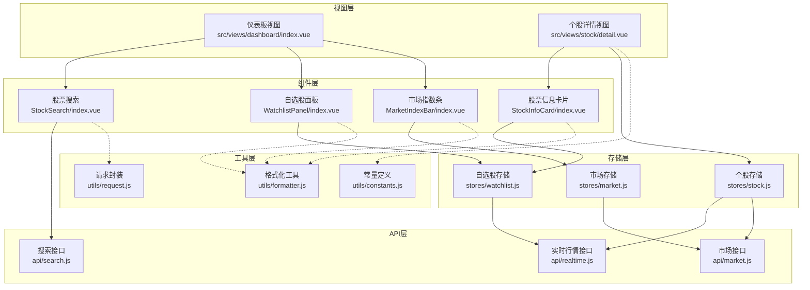
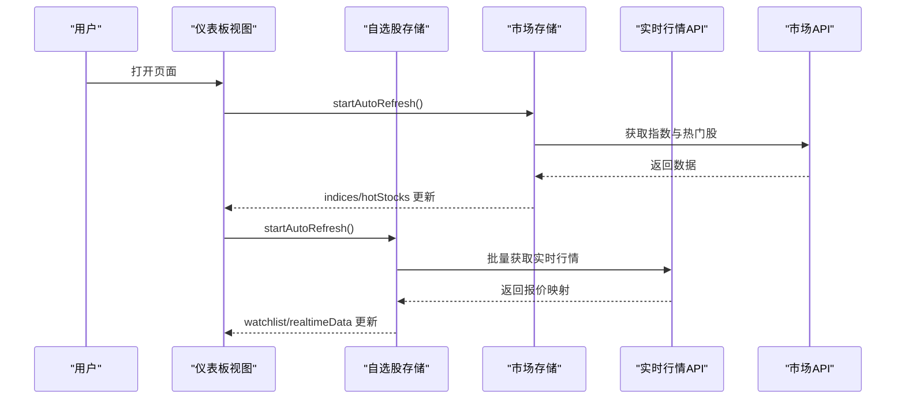
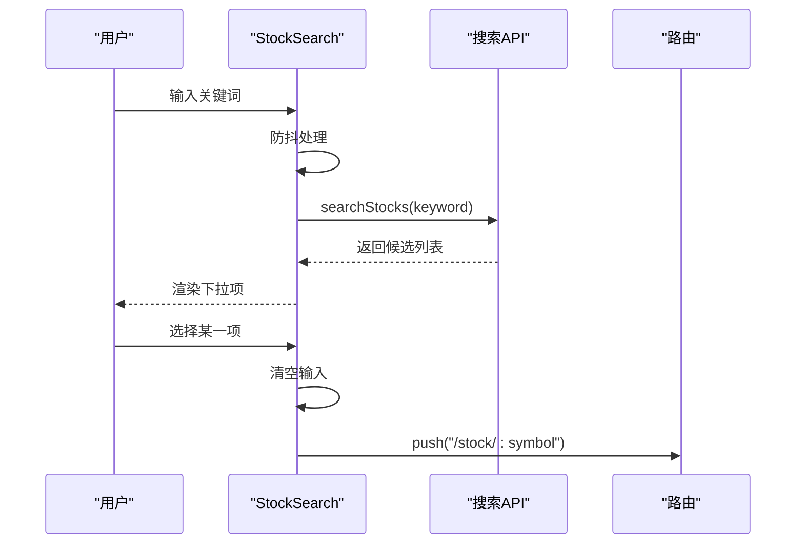
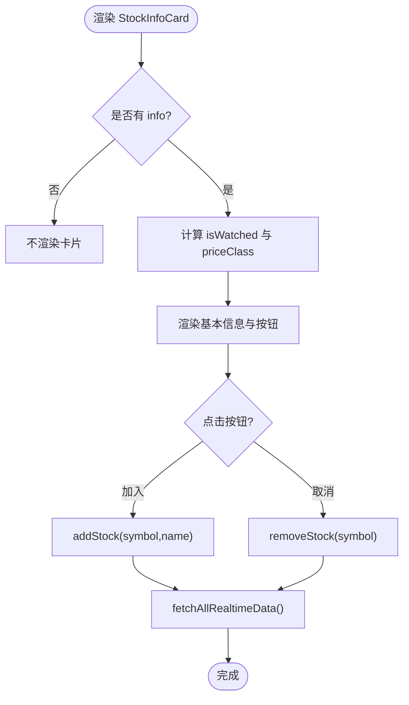
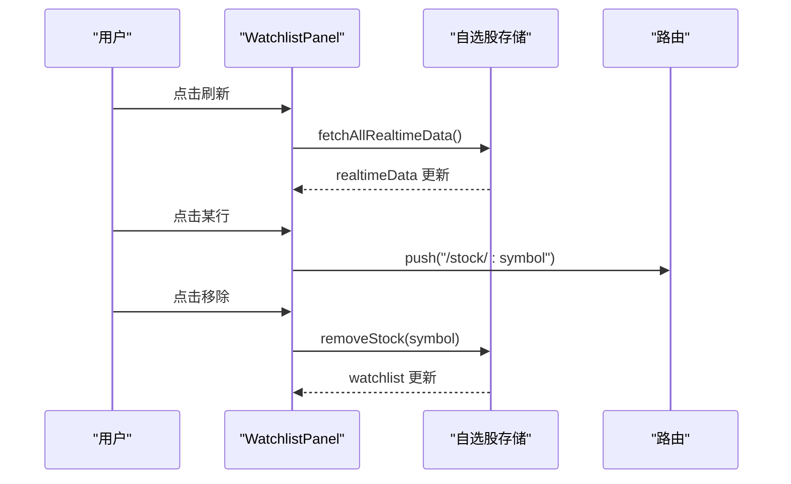
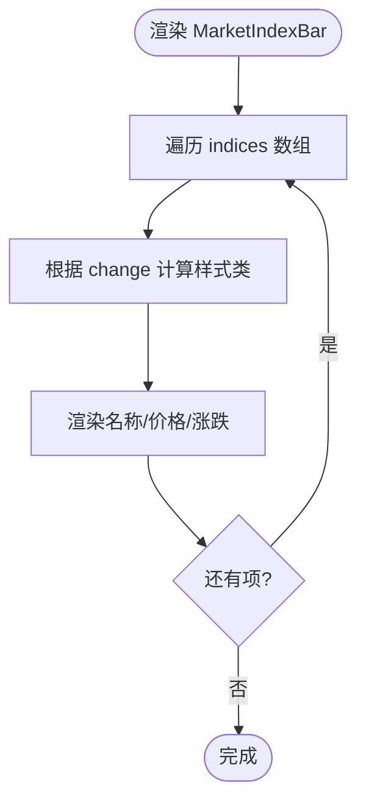
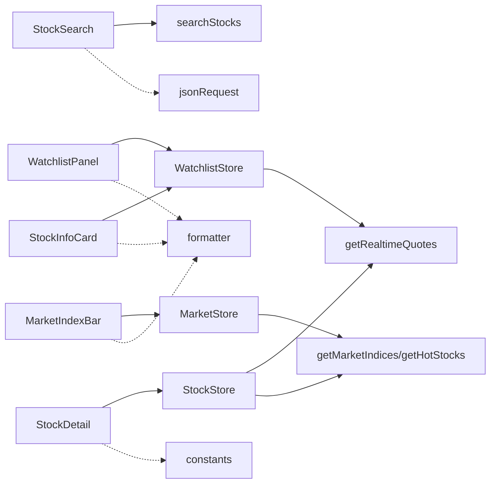

# 业务组件

<cite>
**本文引用的文件**
- [src/components/StockSearch/index.vue](file://src/components/StockSearch/index.vue)
- [src/components/StockInfoCard/index.vue](file://src/components/StockInfoCard/index.vue)
- [src/components/WatchlistPanel/index.vue](file://src/components/WatchlistPanel/index.vue)
- [src/components/MarketIndexBar/index.vue](file://src/components/MarketIndexBar/index.vue)
- [src/api/search.js](file://src/api/search.js)
- [src/api/market.js](file://src/api/market.js)
- [src/api/realtime.js](file://src/api/realtime.js)
- [src/stores/watchlist.js](file://src/stores/watchlist.js)
- [src/stores/market.js](file://src/stores/market.js)
- [src/stores/stock.js](file://src/stores/stock.js)
- [src/utils/formatter.js](file://src/utils/formatter.js)
- [src/utils/constants.js](file://src/utils/constants.js)
- [src/utils/request.js](file://src/utils/request.js)
- [src/views/dashboard/index.vue](file://src/views/dashboard/index.vue)
- [src/views/stock/detail.vue](file://src/views/stock/detail.vue)
</cite>

## 目录
1. [简介](#简介)
2. [项目结构](#项目结构)
3. [核心组件](#核心组件)
4. [架构总览](#架构总览)
5. [详细组件分析](#详细组件分析)
6. [依赖关系分析](#依赖关系分析)
7. [性能考量](#性能考量)
8. [故障排查指南](#故障排查指南)
9. [结论](#结论)
10. [附录](#附录)

## 简介
本文件聚焦于量化交易平台中的核心业务组件：股票搜索、股票信息卡片、自选股面板、市场指数条。文档从系统架构、组件职责、数据模型、业务流程、用户交互、状态管理、事件处理与配置选项等方面进行深入说明，并结合真实使用场景给出实践建议与参考路径。

## 项目结构
- 组件层：位于 src/components，包含 StockSearch、StockInfoCard、WatchlistPanel、MarketIndexBar 等可复用 UI 组件。
- 视图层：位于 src/views，如仪表板与个股详情页，负责编排组件与业务流程。
- 存储层（Pinia）：位于 src/stores，封装自选股、市场、个股等状态与自动刷新策略。
- API 层：位于 src/api，封装搜索、市场、实时行情等外部接口。
- 工具层：位于 src/utils，提供格式化、常量、请求封装等通用能力。

图表来源
- [src/views/dashboard/index.vue:1-163](file://src/views/dashboard/index.vue#L1-L163)
- [src/views/stock/detail.vue:1-295](file://src/views/stock/detail.vue#L1-L295)
- [src/components/StockSearch/index.vue:1-76](file://src/components/StockSearch/index.vue#L1-L76)
- [src/components/StockInfoCard/index.vue:1-150](file://src/components/StockInfoCard/index.vue#L1-L150)
- [src/components/WatchlistPanel/index.vue:1-143](file://src/components/WatchlistPanel/index.vue#L1-L143)
- [src/components/MarketIndexBar/index.vue:1-87](file://src/components/MarketIndexBar/index.vue#L1-L87)
- [src/stores/watchlist.js:1-53](file://src/stores/watchlist.js#L1-L53)
- [src/stores/market.js:1-41](file://src/stores/market.js#L1-L41)
- [src/stores/stock.js:1-92](file://src/stores/stock.js#L1-L92)
- [src/api/search.js:1-38](file://src/api/search.js#L1-L38)
- [src/api/market.js:1-46](file://src/api/market.js#L1-L46)
- [src/api/realtime.js:1-56](file://src/api/realtime.js#L1-L56)
- [src/utils/formatter.js:1-60](file://src/utils/formatter.js#L1-L60)
- [src/utils/constants.js:1-68](file://src/utils/constants.js#L1-L68)
- [src/utils/request.js:1-29](file://src/utils/request.js#L1-L29)

章节来源
- [src/views/dashboard/index.vue:1-163](file://src/views/dashboard/index.vue#L1-L163)
- [src/views/stock/detail.vue:1-295](file://src/views/stock/detail.vue#L1-L295)

## 核心组件
- 股票搜索组件：提供输入联想、模糊匹配、市场标识展示与路由跳转。
- 股票信息卡片：展示个股实时行情、涨跌样式、加自选按钮与格式化数值。
- 自选股面板：展示自选股列表、实时报价、涨跌样式、移除操作与批量刷新。
- 市场指数条：展示上证、深证、创业板指数的实时行情与涨跌样式。

章节来源
- [src/components/StockSearch/index.vue:1-76](file://src/components/StockSearch/index.vue#L1-L76)
- [src/components/StockInfoCard/index.vue:1-150](file://src/components/StockInfoCard/index.vue#L1-L150)
- [src/components/WatchlistPanel/index.vue:1-143](file://src/components/WatchlistPanel/index.vue#L1-L143)
- [src/components/MarketIndexBar/index.vue:1-87](file://src/components/MarketIndexBar/index.vue#L1-L87)

## 架构总览
- 数据流：组件通过 Pinia Store 访问状态；Store 调用 API 层获取数据；API 层基于 axios 实例请求外部服务；工具层提供格式化与常量。
- 自动刷新：各 Store 在挂载时启动定时器，周期性拉取最新数据；卸载时停止定时器，避免内存泄漏。
- 用户交互：组件通过事件回调触发 Store 动作（如添加/移除自选股、刷新行情），视图层统一编排组件与生命周期。

图表来源
- [src/views/dashboard/index.vue:101-109](file://src/views/dashboard/index.vue#L101-L109)
- [src/stores/market.js:25-33](file://src/stores/market.js#L25-L33)
- [src/stores/watchlist.js:37-45](file://src/stores/watchlist.js#L37-L45)
- [src/api/market.js:7-9](file://src/api/market.js#L7-L9)
- [src/api/realtime.js:39-47](file://src/api/realtime.js#L39-L47)

## 详细组件分析

### 股票搜索组件（StockSearch）
- 核心功能
  - 输入联想：基于关键词调用搜索接口，过滤出 A 股主板/创业板/科创板代码，返回带市场标识的结果。
  - 结果渲染：展示代码、名称与市场（沪/深）标签。
  - 交互行为：选择项后清空输入并跳转到个股详情页。
- 数据模型
  - 搜索结果项包含 code、name、market、symbol 字段；symbol 由 market 前缀与纯数字代码拼接而成。
- 业务流程
  - 输入触发防抖查询 → 接口返回 → 映射为下拉项 → 选择后路由跳转。
- 用户交互
  - 支持清空、前缀图标、自定义占位符与选择事件。
- 配置与扩展
  - debounce 控制查询频率；可调整返回数量与筛选规则。
- 错误处理
  - 空关键词直接返回空列表；异常捕获后返回空数组，保证 UI 稳定。
- 使用示例（参考路径）
  - [仪表板视图中引入与使用:10-18](file://src/views/dashboard/index.vue#L10-L18)
  - [搜索接口实现:7-37](file://src/api/search.js#L7-L37)

图表来源
- [src/components/StockSearch/index.vue:34-43](file://src/components/StockSearch/index.vue#L34-L43)
- [src/api/search.js:7-37](file://src/api/search.js#L7-L37)
- [src/views/dashboard/index.vue:14-17](file://src/views/dashboard/index.vue#L14-L17)

章节来源
- [src/components/StockSearch/index.vue:1-76](file://src/components/StockSearch/index.vue#L1-L76)
- [src/api/search.js:1-38](file://src/api/search.js#L1-L38)
- [src/views/dashboard/index.vue:10-18](file://src/views/dashboard/index.vue#L10-L18)

### 股票信息卡片（StockInfoCard）
- 核心功能
  - 展示名称、代码、当前价、涨跌额与涨跌幅、开盘/昨收/最高/最低、成交量/成交额。
  - 提供“加入自选/取消自选”按钮，联动自选股存储。
  - 根据涨跌动态设置样式类名。
- 数据模型
  - 接收 info 对象，字段包含 name、symbol、price、change、changePercent、open、prevClose、high、low、volume、amount 等。
- 业务流程
  - 组件计算 isWatched → 渲染按钮图标与类型 → 点击时调用存储方法增删 → 刷新自选股实时数据。
- 用户交互
  - 点击按钮切换关注状态；点击卡片可跳转至详情页（由父组件绑定）。
- 配置与扩展
  - 可通过 props 注入任意 info；支持自定义样式覆盖。
- 错误处理
  - 当 info 为空时安全渲染；格式化函数对空值进行兜底。
- 使用示例（参考路径）
  - [个股详情页使用:4-4](file://src/views/stock/detail.vue#L4-L4)
  - [自选股存储联动:13-27](file://src/stores/watchlist.js#L13-L27)
  - [格式化工具:3-31](file://src/utils/formatter.js#L3-L31)

图表来源
- [src/components/StockInfoCard/index.vue:58-82](file://src/components/StockInfoCard/index.vue#L58-L82)
- [src/stores/watchlist.js:13-35](file://src/stores/watchlist.js#L13-L35)
- [src/utils/formatter.js:3-31](file://src/utils/formatter.js#L3-L31)

章节来源
- [src/components/StockInfoCard/index.vue:1-150](file://src/components/StockInfoCard/index.vue#L1-L150)
- [src/stores/watchlist.js:1-53](file://src/stores/watchlist.js#L1-L53)
- [src/utils/formatter.js:1-60](file://src/utils/formatter.js#L1-L60)
- [src/views/stock/detail.vue:4-4](file://src/views/stock/detail.vue#L4-L4)

### 自选股面板（WatchlistPanel）
- 核心功能
  - 展示自选股列表，每行包含名称、代码、实时价格与涨跌幅。
  - 支持点击行跳转到个股详情，点击“×”移除自选股。
  - 提供一键刷新按钮，批量获取实时行情。
- 数据模型
  - watchlist：[{ symbol, name, addedAt }]；realtimeData：{ [symbol]: quote }。
- 业务流程
  - 初始化时读取本地存储；点击刷新触发批量拉取；点击行路由跳转；点击移除更新本地存储。
- 用户交互
  - 行悬停显示移除按钮；涨跌样式随 change 动态变化。
- 配置与扩展
  - 可调整刷新间隔、列表最大高度、样式主题变量。
- 错误处理
  - 无行情时显示占位符；异常捕获后返回空数组。
- 使用示例（参考路径）
  - [仪表板视图中引入与使用:69-73](file://src/views/dashboard/index.vue#L69-L73)
  - [自选股存储实现:1-53](file://src/stores/watchlist.js#L1-L53)
  - [格式化工具:7-11](file://src/utils/formatter.js#L7-L11)

图表来源
- [src/components/WatchlistPanel/index.vue:5-63](file://src/components/WatchlistPanel/index.vue#L5-L63)
- [src/stores/watchlist.js:29-45](file://src/stores/watchlist.js#L29-L45)
- [src/views/dashboard/index.vue:71-71](file://src/views/dashboard/index.vue#L71-L71)

章节来源
- [src/components/WatchlistPanel/index.vue:1-143](file://src/components/WatchlistPanel/index.vue#L1-L143)
- [src/stores/watchlist.js:1-53](file://src/stores/watchlist.js#L1-L53)
- [src/utils/formatter.js:1-60](file://src/utils/formatter.js#L1-L60)
- [src/views/dashboard/index.vue:69-73](file://src/views/dashboard/index.vue#L69-L73)

### 市场指数条（MarketIndexBar）
- 核心功能
  - 展示上证、深证、创业板指数的名称、价格、涨跌额与涨跌幅。
  - 根据涨跌设置不同样式边框与文字颜色。
- 数据模型
  - 接收 indices 数组，元素包含 name、price、change、changePercent、symbol 等。
- 业务流程
  - 从市场存储获取指数数据；遍历渲染卡片；根据 change 决定样式类。
- 用户交互
  - 卡片为只读展示，无交互事件。
- 配置与扩展
  - 可扩展更多指数；支持自定义样式主题变量。
- 使用示例（参考路径）
  - [仪表板视图中引入与使用:4-4](file://src/views/dashboard/index.vue#L4-L4)
  - [市场存储实现:1-41](file://src/stores/market.js#L1-L41)
  - [格式化工具:3-17](file://src/utils/formatter.js#L3-L17)

图表来源
- [src/components/MarketIndexBar/index.vue:1-32](file://src/components/MarketIndexBar/index.vue#L1-L32)
- [src/stores/market.js:11-23](file://src/stores/market.js#L11-L23)
- [src/utils/formatter.js:3-17](file://src/utils/formatter.js#L3-L17)

章节来源
- [src/components/MarketIndexBar/index.vue:1-87](file://src/components/MarketIndexBar/index.vue#L1-L87)
- [src/stores/market.js:1-41](file://src/stores/market.js#L1-L41)
- [src/utils/formatter.js:1-60](file://src/utils/formatter.js#L1-L60)
- [src/views/dashboard/index.vue:4-4](file://src/views/dashboard/index.vue#L4-L4)

## 依赖关系分析
- 组件与存储
  - StockInfoCard 依赖 WatchlistStore 的 isWatched/addStock/removeStock。
  - WatchlistPanel 依赖 WatchlistStore 的 watchlist/realtimeData/fetchAllRealtimeData。
  - MarketIndexBar 依赖 MarketStore 的 indices。
  - StockDetail 依赖 StockStore 的 currentStockInfo/klineData/indicators/signals/compositeSignal。
- 组件与 API
  - StockSearch 依赖 searchStocks。
  - WatchlistPanel/StockInfoCard 依赖 getRealtimeQuotes。
  - MarketIndexBar/MarketStore 依赖 getMarketIndices/getHotStocks。
- 组件与工具
  - 所有组件使用 formatter 进行数值格式化；MarketIndexBar/WatchlistPanel 使用 formatPercent；StockInfoCard 使用多种格式化函数。
- 请求封装
  - jsonRequest 用于 JSON 接口（如搜索、热门股），textRequest 用于文本接口（如实时行情）。

图表来源
- [src/components/StockSearch/index.vue:29-37](file://src/components/StockSearch/index.vue#L29-L37)
- [src/components/StockInfoCard/index.vue:55-82](file://src/components/StockInfoCard/index.vue#L55-L82)
- [src/components/WatchlistPanel/index.vue:48-63](file://src/components/WatchlistPanel/index.vue#L48-L63)
- [src/components/MarketIndexBar/index.vue:20-31](file://src/components/MarketIndexBar/index.vue#L20-L31)
- [src/stores/watchlist.js:1-53](file://src/stores/watchlist.js#L1-L53)
- [src/stores/market.js:1-41](file://src/stores/market.js#L1-L41)
- [src/stores/stock.js:1-92](file://src/stores/stock.js#L1-L92)
- [src/api/search.js:1-38](file://src/api/search.js#L1-L38)
- [src/api/market.js:1-46](file://src/api/market.js#L1-L46)
- [src/api/realtime.js:1-56](file://src/api/realtime.js#L1-L56)
- [src/utils/formatter.js:1-60](file://src/utils/formatter.js#L1-L60)
- [src/utils/constants.js:1-68](file://src/utils/constants.js#L1-L68)
- [src/utils/request.js:1-29](file://src/utils/request.js#L1-L29)

章节来源
- [src/utils/request.js:1-29](file://src/utils/request.js#L1-L29)
- [src/utils/formatter.js:1-60](file://src/utils/formatter.js#L1-L60)
- [src/utils/constants.js:1-68](file://src/utils/constants.js#L1-L68)

## 性能考量
- 防抖与节流
  - StockSearch 使用 debounce 减少频繁请求；建议在高频输入场景保持合理延迟。
- 批量请求
  - WatchlistPanel 与 StockStore 使用批量实时行情接口，减少多次往返。
- 定时刷新
  - 各 Store 在挂载时启动定时器，卸载时清理；建议根据业务需求调整刷新间隔。
- 渲染优化
  - 使用 computed 缓存派生数据（如 watchlist 符号数组、K线收盘价序列）。
- 格式化开销
  - formatter 对大数进行字符串化与单位换算，建议在高频渲染场景缓存中间结果。

## 故障排查指南
- 搜索无结果
  - 检查关键词是否为空；确认接口返回结构与字段映射；查看异常捕获日志。
  - 参考路径：[搜索接口实现:7-37](file://src/api/search.js#L7-L37)
- 实时行情为空
  - 确认 symbols 列表非空；检查 textRequest 返回文本格式是否符合预期；核对解析正则。
  - 参考路径：[实时行情接口:39-47](file://src/api/realtime.js#L39-L47)
- 自选股未刷新
  - 确认定时器已启动；检查 symbols 是否为空；查看刷新间隔与错误处理。
  - 参考路径：[自选股存储:37-45](file://src/stores/watchlist.js#L37-L45)
- 页面白屏或报错
  - 检查 axios 拦截器错误提示；确认网络状态与跨域配置。
  - 参考路径：[请求封装:17-28](file://src/utils/request.js#L17-L28)

章节来源
- [src/api/search.js:1-38](file://src/api/search.js#L1-L38)
- [src/api/realtime.js:1-56](file://src/api/realtime.js#L1-L56)
- [src/stores/watchlist.js:1-53](file://src/stores/watchlist.js#L1-L53)
- [src/utils/request.js:1-29](file://src/utils/request.js#L1-L29)

## 结论
上述组件围绕“搜索—关注—行情—分析”的主线构建，形成闭环的数据流与交互体验。通过 Pinia 状态管理与 API 封装，实现了低耦合、高内聚的业务模块；借助工具层的格式化与常量，提升了可维护性与一致性。建议在生产环境中进一步完善错误上报、埋点统计与缓存策略，以提升稳定性与用户体验。

## 附录
- 实际使用场景与最佳实践
  - 仪表板首页：在 mounted 中启动自动刷新，在 onUnmounted 中停止；通过 MarketIndexBar 与 WatchlistPanel 快速概览市场与自选。
    - 参考路径：[仪表板视图:101-109](file://src/views/dashboard/index.vue#L101-L109)
  - 个股详情页：根据路由参数加载股票数据；周期切换时重新计算指标与信号；实时刷新当前价。
    - 参考路径：[个股详情页:163-174](file://src/views/stock/detail.vue#L163-L174)
  - 自定义指标与信号：通过 constants.js 调整周期、默认参数与权重阈值；在 store 中扩展计算逻辑。
    - 参考路径：[常量定义:29-67](file://src/utils/constants.js#L29-L67)