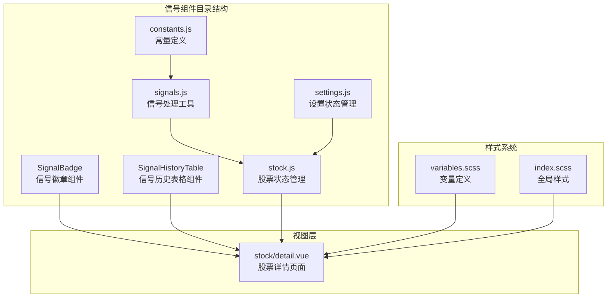
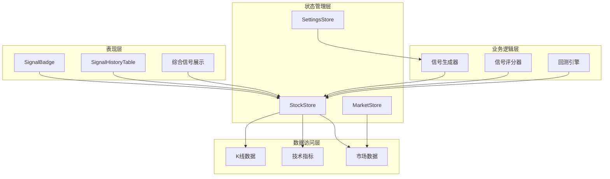
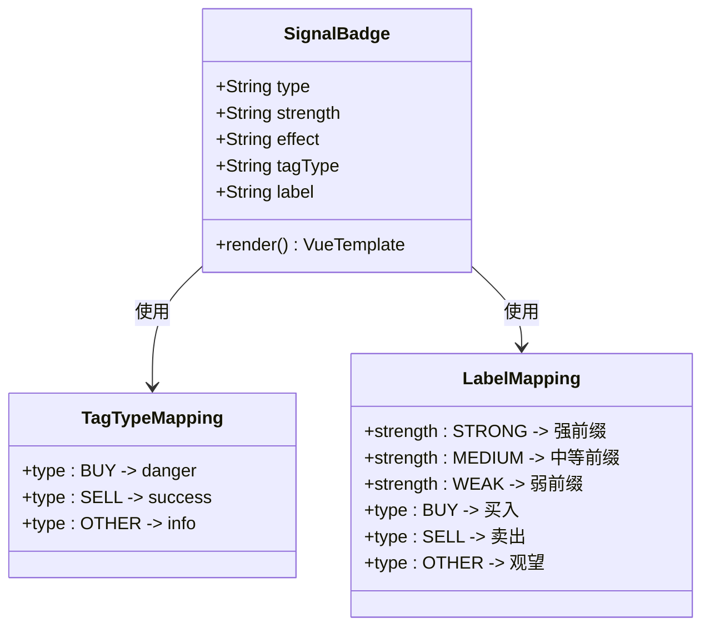
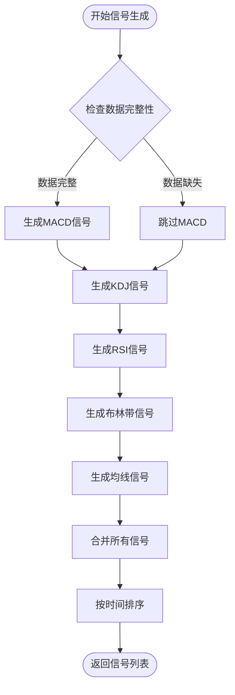
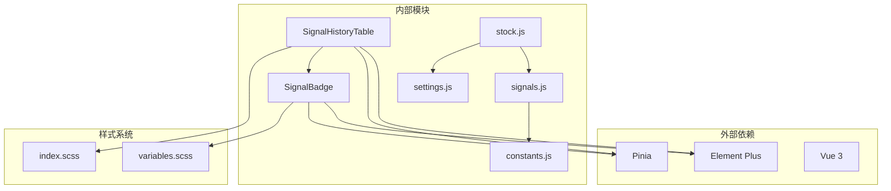
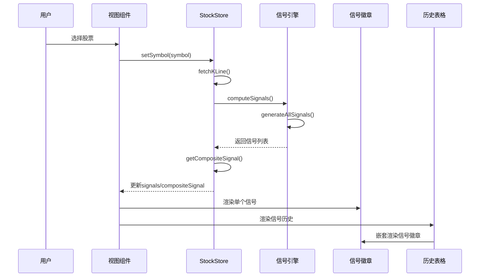

# 信号组件

<cite>
**本文档引用的文件**
- [SignalBadge/index.vue](file://src/components/SignalBadge/index.vue)
- [SignalHistoryTable/index.vue](file://src/components/SignalHistoryTable/index.vue)
- [signals.js](file://src/utils/signals.js)
- [stock.js](file://src/stores/stock.js)
- [settings.js](file://src/stores/settings.js)
- [constants.js](file://src/utils/constants.js)
- [detail.vue](file://src/views/stock/detail.vue)
- [index.scss](file://src/styles/index.scss)
- [variables.scss](file://src/styles/variables.scss)
</cite>

## 目录
1. [简介](#简介)
2. [项目结构](#项目结构)
3. [核心组件](#核心组件)
4. [架构概览](#架构概览)
5. [详细组件分析](#详细组件分析)
6. [依赖关系分析](#依赖关系分析)
7. [性能考虑](#性能考虑)
8. [故障排除指南](#故障排除指南)
9. [结论](#结论)
10. [附录](#附录)

## 简介

量化交易平台的信号组件是交易决策支持系统的核心组成部分，负责可视化展示技术分析产生的买卖信号。该组件体系包含两个主要组件：信号徽章组件（SignalBadge）和信号历史表格组件（SignalHistoryTable），它们协同工作为用户提供直观的信号分析界面。

信号组件基于Vue 3 Composition API构建，采用Element Plus作为UI框架，结合Pinia状态管理实现数据驱动的信号展示。组件支持多种技术指标策略，包括MACD、KDJ、RSI、布林带和均线系统，并提供信号强度评估和综合评分功能。

## 项目结构

信号组件位于项目的组件目录中，采用模块化设计，每个组件都是独立的功能单元：



**图表来源**
- [SignalBadge/index.vue:1-40](file://src/components/SignalBadge/index.vue#L1-L40)
- [SignalHistoryTable/index.vue:1-32](file://src/components/SignalHistoryTable/index.vue#L1-L32)
- [signals.js:1-347](file://src/utils/signals.js#L1-L347)
- [stock.js:1-92](file://src/stores/stock.js#L1-L92)

**章节来源**
- [SignalBadge/index.vue:1-40](file://src/components/SignalBadge/index.vue#L1-L40)
- [SignalHistoryTable/index.vue:1-32](file://src/components/SignalHistoryTable/index.vue#L1-L32)
- [signals.js:1-347](file://src/utils/signals.js#L1-L347)

## 核心组件

信号组件体系由以下核心组件构成：

### 信号徽章组件（SignalBadge）
- **功能定位**：展示单个信号的类型、强度和状态
- **视觉设计**：基于Element Plus的标签组件，支持颜色编码和文本显示
- **交互特性**：响应式设计，支持不同尺寸和效果

### 信号历史表格组件（SignalHistoryTable）
- **功能定位**：展示完整的信号历史记录
- **数据展示**：包含时间戳、信号类型、价格信息、策略来源等多维度数据
- **用户体验**：支持滚动查看，提供详细的信号描述

### 信号处理引擎（signals.js）
- **算法实现**：基于技术指标的信号生成算法
- **策略支持**：支持多种技术分析策略的组合
- **评分系统**：提供综合信号强度评估

**章节来源**
- [SignalBadge/index.vue:12-33](file://src/components/SignalBadge/index.vue#L12-L33)
- [SignalHistoryTable/index.vue:19-25](file://src/components/SignalHistoryTable/index.vue#L19-L25)
- [signals.js:197-230](file://src/utils/signals.js#L197-L230)

## 架构概览

信号组件采用分层架构设计，确保各组件职责清晰、耦合度低：



**图表来源**
- [stock.js:10-91](file://src/stores/stock.js#L10-L91)
- [signals.js:197-261](file://src/utils/signals.js#L197-L261)
- [settings.js:6-68](file://src/stores/settings.js#L6-L68)

## 详细组件分析

### 信号徽章组件详细分析

信号徽章组件是信号展示的基础单元，通过简洁的视觉元素传达复杂的交易信号信息。

#### 数据模型与属性

| 属性名 | 类型 | 默认值 | 描述 |
|--------|------|--------|------|
| type | String | 'BUY' | 信号类型：BUY/SELL/OPTIMIZE |
| strength | String | 'MEDIUM' | 信号强度：STRONG/MEDIUM/WEAK |
| effect | String | 'dark' | 显示效果：light/dark/plain |

#### 视觉设计规范



**图表来源**
- [SignalBadge/index.vue:15-32](file://src/components/SignalBadge/index.vue#L15-L32)

#### 颜色编码系统

| 信号类型 | 颜色方案 | CSS类 | 使用场景 |
|----------|----------|-------|----------|
| 买入信号 | 红色主题 | danger | 强买入、建议买入 |
| 卖出信号 | 绿色主题 | success | 强卖出、建议卖出 |
| 观望信号 | 灰色主题 | info | 中性、等待时机 |
| 强信号 | 加粗字体 | strong | 强度标记 |

#### 实现细节

信号徽章组件采用Vue 3的Composition API，通过计算属性动态生成标签类型和显示文本：

- **响应式属性**：使用`computed`属性确保UI自动更新
- **条件渲染**：根据信号类型和强度动态调整显示内容
- **样式定制**：支持Element Plus的多种效果模式

**章节来源**
- [SignalBadge/index.vue:12-39](file://src/components/SignalBadge/index.vue#L12-L39)

### 信号历史表格组件详细分析

信号历史表格组件提供完整的信号记录展示功能，支持复杂的数据查询和筛选。

#### 表格列设计

| 列名 | 宽度 | 对齐方式 | 内容类型 | 功能特性 |
|------|------|----------|----------|----------|
| 日期 | 110px | 左对齐 | 文本 | 显示信号发生日期 |
| 信号 | 80px | 居中 | 组件 | 嵌套SignalBadge组件 |
| 价格 | 90px | 右对齐 | 数字 | 固定两位小数显示 |
| 策略 | 70px | 居中 | 文本 | 显示信号来源策略 |
| 说明 | 自适应 | 左对齐 | 文本 | 详细信号描述，支持省略号 |

#### 数据格式要求

信号历史表格接收标准化的信号对象数组，每个信号对象必须包含：

```javascript
{
  date: string,           // 日期字符串
  type: 'BUY' | 'SELL' | 'OPTIMIZE', // 信号类型
  strength: 'STRONG' | 'MEDIUM' | 'WEAK', // 信号强度
  price: number,          // 交易价格
  source: string,         // 策略来源
  description: string     // 详细描述
}
```

#### 性能优化特性

- **虚拟滚动**：最大高度限制为320px，超出部分滚动显示
- **懒加载**：表格组件按需渲染，减少初始加载开销
- **内存管理**：合理使用scoped样式，避免样式污染

**章节来源**
- [SignalHistoryTable/index.vue:1-32](file://src/components/SignalHistoryTable/index.vue#L1-L32)

### 信号处理引擎详细分析

信号处理引擎是整个信号系统的核心算法模块，负责从原始技术指标数据中提取有效的交易信号。

#### 策略生成函数



**图表来源**
- [signals.js:197-230](file://src/utils/signals.js#L197-L230)

#### 技术指标策略详解

##### MACD策略
- **金叉信号**：DIF线上穿DEA线，结合MACD柱状图正负状态判断强度
- **死叉信号**：DIF线下穿DEA线，同样考虑柱状图状态
- **强度判定**：基于最近N根K线中正负柱状图的数量

##### KDJ策略
- **超卖反弹**：J值从超卖区（<20）反弹
- **低位金叉**：K线上穿D线且处于低位区域
- **超买回落**：J值从超买区（>80）回落
- **高位死叉**：K线下穿D线且处于高位区域

##### RSI策略
- **超卖反弹**：RSI从超卖区（<30）反弹
- **超买回调**：RSI从超买区（>70）回调

##### 布林带策略
- **触底反弹**：价格触及下轨后反弹
- **触顶回落**：价格触及上轨后回落

##### 均线策略
- **多级别交叉**：不同周期均线之间的金叉死叉
- **强度分级**：基于交叉的均线周期差确定信号强度

**章节来源**
- [signals.js:8-42](file://src/utils/signals.js#L8-L42)
- [signals.js:45-95](file://src/utils/signals.js#L45-L95)
- [signals.js:98-122](file://src/utils/signals.js#L98-L122)
- [signals.js:125-160](file://src/utils/signals.js#L125-L160)
- [signals.js:163-194](file://src/utils/signals.js#L163-L194)

### 状态管理系统分析

信号组件与Pinia状态管理紧密集成，确保数据的一致性和响应性。

#### StockStore状态结构

| 状态属性 | 类型 | 描述 | 更新时机 |
|----------|------|------|----------|
| currentSymbol | Ref<string> | 当前股票代码 | 用户选择股票时 |
| klineData | Ref<Array> | K线数据数组 | 获取K线数据时 |
| indicators | Ref<Object> | 技术指标结果 | 计算指标时 |
| signals | Ref<Array> | 信号列表 | 计算信号时 |
| compositeSignal | Ref<Object> | 综合信号 | 生成信号后 |
| loading | Ref<boolean> | 加载状态 | 数据获取期间 |
| error | Ref<string> | 错误信息 | 发生异常时 |

#### SettingsStore配置管理

| 配置项 | 类型 | 默认值 | 功能描述 |
|--------|------|--------|----------|
| signalStrategies | Ref<Array> | ['MACD','KDJ','RSI','BOLL','MA'] | 启用的信号策略 |
| enabledIndicators | Ref<Array> | ['MA','MACD','VOL'] | 显示的指标 |
| macdParams | Ref<Object> | 默认参数 | MACD指标参数 |
| kdjParams | Ref<Object> | 默认参数 | KDJ指标参数 |
| rsiParams | Ref<Object> | 默认参数 | RSI指标参数 |
| bollParams | Ref<Object> | 默认参数 | 布林带参数 |
| maPeriods | Ref<Array> | [5,10,20,60] | 均线周期 |

**章节来源**
- [stock.js:10-91](file://src/stores/stock.js#L10-L91)
- [settings.js:6-68](file://src/stores/settings.js#L6-L68)

## 依赖关系分析

信号组件的依赖关系体现了清晰的分层架构和模块化设计。



**图表来源**
- [SignalBadge/index.vue:1-10](file://src/components/SignalBadge/index.vue#L1-L10)
- [SignalHistoryTable/index.vue:1-17](file://src/components/SignalHistoryTable/index.vue#L1-L17)
- [signals.js:5](file://src/utils/signals.js#L5)
- [stock.js:6](file://src/stores/stock.js#L6)

### 组件间通信机制

信号组件通过以下机制实现松耦合的通信：

1. **Props传递**：父组件向子组件传递必要的数据和配置
2. **事件冒泡**：子组件通过事件向父组件传递用户交互
3. **状态共享**：通过Pinia Store实现跨组件的状态同步
4. **计算属性**：响应式数据绑定确保UI自动更新

### 数据流控制



**图表来源**
- [stock.js:25-68](file://src/stores/stock.js#L25-L68)
- [signals.js:197-261](file://src/utils/signals.js#L197-L261)
- [detail.vue:156-174](file://src/views/stock/detail.vue#L156-L174)

**章节来源**
- [stock.js:10-91](file://src/stores/stock.js#L10-L91)
- [signals.js:197-261](file://src/utils/signals.js#L197-L261)
- [detail.vue:113-175](file://src/views/stock/detail.vue#L113-L175)

## 性能考虑

信号组件在设计时充分考虑了性能优化，确保在大数据量下的流畅体验。

### 性能优化策略

#### 1. 数据处理优化
- **延迟计算**：使用计算属性避免重复计算
- **缓存机制**：利用Vue的响应式系统缓存中间结果
- **批量更新**：通过Promise.all并行获取多个数据源

#### 2. 渲染性能优化
- **虚拟滚动**：信号历史表格限制最大高度
- **组件懒加载**：按需渲染非关键组件
- **CSS作用域**：使用scoped样式避免全局样式重绘

#### 3. 内存管理
- **及时清理**：组件卸载时清除定时器和监听器
- **数据压缩**：只存储必要的信号数据
- **垃圾回收**：避免创建不必要的临时对象

### 性能监控指标

| 指标类型 | 优化目标 | 监控方法 |
|----------|----------|----------|
| 组件渲染时间 | <50ms | Vue DevTools性能面板 |
| 内存使用 | <50MB | 浏览器开发者工具 |
| 信号生成速度 | <100ms | 控制台性能分析 |
| 页面响应时间 | <100ms | Lighthouse审计 |

## 故障排除指南

### 常见问题及解决方案

#### 1. 信号显示异常
**问题现象**：信号徽章颜色不正确或文本显示错误
**可能原因**：
- Props传入参数类型不匹配
- 信号类型不在支持范围内
- 强度级别设置错误

**解决步骤**：
1. 检查传入的type和strength参数
2. 确认参数类型为String
3. 验证参数值在允许范围内

#### 2. 信号历史为空
**问题现象**：信号历史表格显示空状态
**可能原因**：
- K线数据未获取到
- 技术指标计算失败
- 信号策略未启用

**解决步骤**：
1. 检查网络请求状态
2. 验证K线数据格式
3. 确认信号策略配置

#### 3. 性能问题
**问题现象**：页面卡顿或渲染缓慢
**可能原因**：
- 信号数据量过大
- 计算密集型操作阻塞主线程
- 样式重绘过多

**解决步骤**：
1. 实施数据分页加载
2. 优化信号生成算法
3. 减少DOM操作次数

### 调试工具使用

#### Vue DevTools
- **组件树检查**：验证组件层级结构
- **状态监控**：跟踪Pinia状态变化
- **性能分析**：识别性能瓶颈

#### 浏览器开发者工具
- **网络面板**：监控API请求
- **性能面板**：分析JavaScript执行
- **内存面板**：检测内存泄漏

**章节来源**
- [stock.js:35-52](file://src/stores/stock.js#L35-L52)
- [signals.js:264-346](file://src/utils/signals.js#L264-L346)

## 结论

量化交易平台的信号组件体系展现了现代前端开发的最佳实践，通过模块化设计、响应式架构和性能优化实现了高质量的信号展示功能。

### 设计优势

1. **模块化架构**：组件职责清晰，易于维护和扩展
2. **响应式设计**：支持多种设备和屏幕尺寸
3. **性能优化**：针对大数据量场景进行了专门优化
4. **可配置性**：支持灵活的策略配置和样式定制

### 技术亮点

- **算法严谨性**：基于成熟的技术分析理论
- **用户体验**：直观的视觉设计和交互反馈
- **数据完整性**：完整的信号生命周期管理
- **可扩展性**：支持新增技术指标和策略

### 发展方向

未来可以考虑的功能增强：
- 实时信号推送机制
- 个性化信号过滤和排序
- 信号回测和验证功能
- 移动端优化和触摸交互

## 附录

### API参考

#### SignalBadge组件属性

| 属性名 | 必填 | 类型 | 默认值 | 说明 |
|--------|------|------|--------|------|
| type | 否 | String | 'BUY' | 信号类型 |
| strength | 否 | String | 'MEDIUM' | 信号强度 |
| effect | 否 | String | 'dark' | 显示效果 |

#### SignalHistoryTable组件属性

| 属性名 | 必填 | 类型 | 默认值 | 说明 |
|--------|------|------|--------|------|
| signals | 是 | Array | [] | 信号对象数组 |

#### 信号对象结构

```javascript
{
  date: string,           // 日期
  type: 'BUY' | 'SELL' | 'OPTIMIZE', // 信号类型
  strength: 'STRONG' | 'MEDIUM' | 'WEAK', // 信号强度
  price: number,          // 价格
  source: string,         // 策略来源
  description: string     // 描述
}
```

### 样式定制指南

#### 主题变量
- `$up-color`: #ef5350 (上涨颜色)
- `$down-color`: #26a69a (下跌颜色)
- `$info-color`: #909399 (信息颜色)

#### 组件样式覆盖
- 信号徽章：支持自定义字体粗细和边框样式
- 历史表格：支持圆角边框和阴影效果
- 综合信号：支持不同级别的颜色主题

### 集成示例

#### 基础使用
```vue
<template>
  <div>
    <SignalBadge type="BUY" strength="STRONG" />
    <SignalHistoryTable :signals="signalList" />
  </div>
</template>
```

#### 高级配置
```vue
<template>
  <div>
    <SignalBadge 
      :type="signal.type" 
      :strength="signal.strength" 
      effect="plain"
    />
  </div>
</template>
```

**章节来源**
- [SignalBadge/index.vue:15-19](file://src/components/SignalBadge/index.vue#L15-L19)
- [SignalHistoryTable/index.vue:22-24](file://src/components/SignalHistoryTable/index.vue#L22-L24)
- [signals.js:197-230](file://src/utils/signals.js#L197-L230)