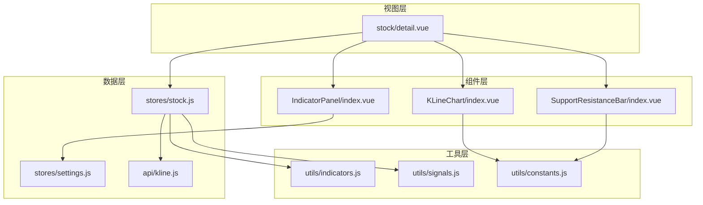
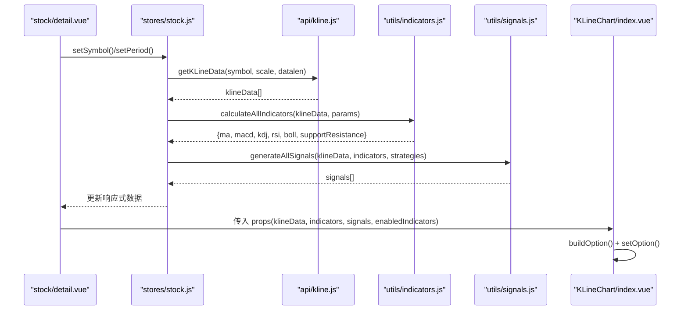
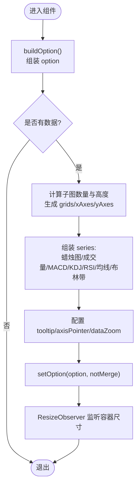
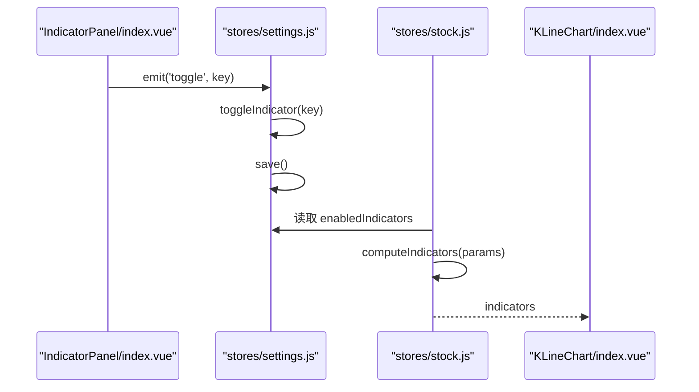
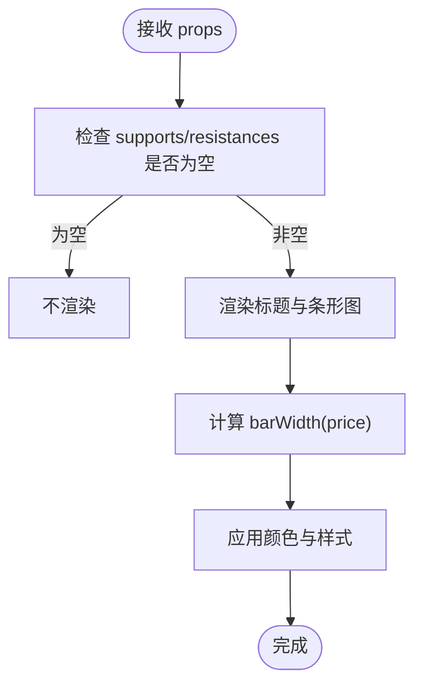
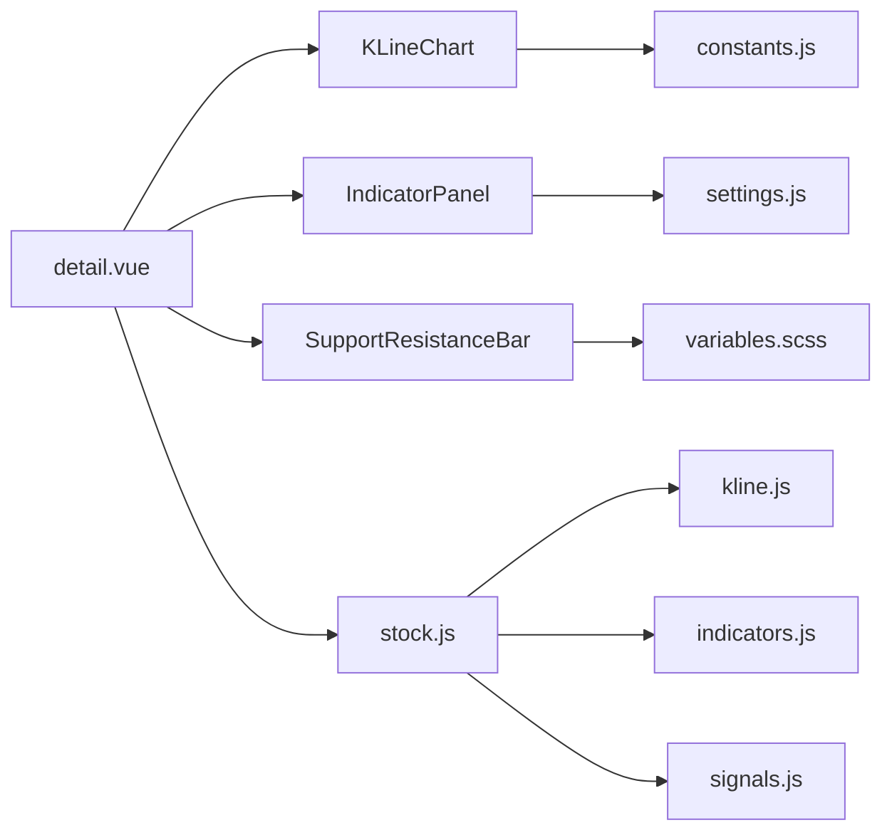

# 图表组件

<cite>
**本文引用的文件**
- [KLineChart/index.vue](file://src/components/KLineChart/index.vue)
- [IndicatorPanel/index.vue](file://src/components/IndicatorPanel/index.vue)
- [SupportResistanceBar/index.vue](file://src/components/SupportResistanceBar/index.vue)
- [indicators.js](file://src/utils/indicators.js)
- [signals.js](file://src/utils/signals.js)
- [kline.js](file://src/api/kline.js)
- [constants.js](file://src/utils/constants.js)
- [variables.scss](file://src/styles/variables.scss)
- [stock.js](file://src/stores/stock.js)
- [settings.js](file://src/stores/settings.js)
- [detail.vue](file://src/views/stock/detail.vue)
- [package.json](file://package.json)
</cite>

## 目录
1. [简介](#简介)
2. [项目结构](#项目结构)
3. [核心组件](#核心组件)
4. [架构总览](#架构总览)
5. [组件详解](#组件详解)
6. [依赖关系分析](#依赖关系分析)
7. [性能与大数据优化](#性能与大数据优化)
8. [故障排查指南](#故障排查指南)
9. [结论](#结论)
10. [附录](#附录)

## 简介
本文件面向量化交易平台中的图表组件，系统性梳理基于 ECharts 的 K 线图组件、技术指标面板、支撑阻力位组件的实现与使用方法。内容涵盖：
- 组件配置项、数据绑定方式与交互功能
- 大量 K 线与指标数据的渲染优化、缩放控制与工具提示
- 主题定制、颜色配置与响应式适配
- 事件处理、用户交互与动态更新机制
- 实际使用示例与最佳实践

## 项目结构
图表相关的核心文件分布如下：
- 组件层：K 线图、指标面板、支撑阻力位
- 工具层：技术指标计算、信号生成、颜色与周期常量
- 数据层：K 线 API、状态管理（Pinia）
- 视图层：股票详情页整合展示

**图表来源**
- [detail.vue:1-295](file://src/views/stock/detail.vue#L1-L295)
- [KLineChart/index.vue:1-285](file://src/components/KLineChart/index.vue#L1-L285)
- [IndicatorPanel/index.vue:1-37](file://src/components/IndicatorPanel/index.vue#L1-L37)
- [SupportResistanceBar/index.vue:1-129](file://src/components/SupportResistanceBar/index.vue#L1-L129)
- [indicators.js:1-245](file://src/utils/indicators.js#L1-L245)
- [signals.js:1-347](file://src/utils/signals.js#L1-L347)
- [kline.js:1-27](file://src/api/kline.js#L1-L27)
- [constants.js:1-68](file://src/utils/constants.js#L1-L68)
- [stock.js:1-92](file://src/stores/stock.js#L1-L92)
- [settings.js:1-70](file://src/stores/settings.js#L1-L70)

**章节来源**
- [detail.vue:1-295](file://src/views/stock/detail.vue#L1-L295)
- [package.json:1-28](file://package.json#L1-L28)

## 核心组件
- K 线图组件：基于 ECharts，支持蜡烛图、成交量、多技术指标叠加显示，内置缩放与工具提示，支持响应式自适应。
- 技术指标面板：提供指标开关面板，联动 Pinia 设置存储与图表渲染。
- 支撑阻力位组件：以可视化条形图展示支撑/压力位，结合当前价格进行对比展示。

**章节来源**
- [KLineChart/index.vue:1-285](file://src/components/KLineChart/index.vue#L1-L285)
- [IndicatorPanel/index.vue:1-37](file://src/components/IndicatorPanel/index.vue#L1-L37)
- [SupportResistanceBar/index.vue:1-129](file://src/components/SupportResistanceBar/index.vue#L1-L129)

## 架构总览
图表数据流从 API 获取 K 线数据，经 Pinia Store 计算技术指标与信号，再传递给各组件渲染。组件通过 props 接收数据，内部使用 ECharts 渲染，同时监听 props 变化进行动态更新。

**图表来源**
- [detail.vue:156-174](file://src/views/stock/detail.vue#L156-L174)
- [stock.js:25-72](file://src/stores/stock.js#L25-L72)
- [kline.js:9-26](file://src/api/kline.js#L9-L26)
- [indicators.js:221-244](file://src/utils/indicators.js#L221-L244)
- [signals.js:197-230](file://src/utils/signals.js#L197-L230)
- [KLineChart/index.vue:22-241](file://src/components/KLineChart/index.vue#L22-L241)

## 组件详解

### K 线图组件（KLineChart）
- 功能特性
  - 蜡烛图主图 + 成交量子图 + 指标子图（MACD、KDJ/RSI、布林带）按需组合
  - 内置缩放（inside + slider），默认初始显示最近 N 条
  - 工具提示统一格式，跨轴联动
  - 信号标记（买入/卖出三角形/图钉）
  - 响应式：ResizeObserver 监听容器尺寸变化
- 关键配置
  - props：klineData、indicators、signals、enabledIndicators、height
  - 内部构建 ECharts option，动态计算 grid、xAxis/yAxis、series
  - 使用 COLORS 常量统一颜色
- 数据绑定
  - 通过 props 接收 K 线 OHLC、成交量、指标序列与信号列表
  - watch 深度监听 props 变化，触发重新 setOption
- 性能与交互
  - 关闭动画提升渲染性能
  - 内置 dataZoom 控制所有 xAxis
  - 信号 markPoint 使用动画关闭避免闪烁

**图表来源**
- [KLineChart/index.vue:22-241](file://src/components/KLineChart/index.vue#L22-L241)
- [KLineChart/index.vue:243-276](file://src/components/KLineChart/index.vue#L243-L276)

**章节来源**
- [KLineChart/index.vue:1-285](file://src/components/KLineChart/index.vue#L1-L285)
- [constants.js:1-68](file://src/utils/constants.js#L1-L68)

### 技术指标面板（IndicatorPanel）
- 功能特性
  - 提供指标开关按钮（MA、MACD、KDJ、RSI、BOLL、VOL）
  - 与 Pinia settings store 同步，持久化到本地存储
- 交互流程
  - 用户点击标签 -> 触发 toggle 事件 -> settings.toggleIndicator -> 保存到本地存储
  - stock store 读取 enabledIndicators 作为计算参数

**图表来源**
- [IndicatorPanel/index.vue:1-37](file://src/components/IndicatorPanel/index.vue#L1-L37)
- [settings.js:28-40](file://src/stores/settings.js#L28-L40)
- [stock.js:59-62](file://src/stores/stock.js#L59-L62)

**章节来源**
- [IndicatorPanel/index.vue:1-37](file://src/components/IndicatorPanel/index.vue#L1-L37)
- [settings.js:1-70](file://src/stores/settings.js#L1-L70)

### 支撑阻力位组件（SupportResistanceBar）
- 功能特性
  - 展示压力位/支撑位与当前价格的对比条形图
  - 当前价居中高亮，压力位用红色，支撑位用绿色
- 数据绑定
  - props：supports、resistances、currentPrice
  - barWidth 以当前价为基准计算宽度，限制最小/最大宽度

**图表来源**
- [SupportResistanceBar/index.vue:1-129](file://src/components/SupportResistanceBar/index.vue#L1-L129)

**章节来源**
- [SupportResistanceBar/index.vue:1-129](file://src/components/SupportResistanceBar/index.vue#L1-L129)

## 依赖关系分析
- 组件依赖
  - KLineChart 依赖 COLORS 常量、ECharts、props 数据
  - IndicatorPanel 依赖 settings store
  - SupportResistanceBar 依赖样式变量与 props
- 工具函数
  - indicators.js：指标计算（MA、MACD、KDJ、RSI、布林带、支撑阻力位）
  - signals.js：信号生成与综合评分
- 数据流
  - detail.vue 整合三大组件与 store 数据
  - stock store 调用 API 获取 K 线，计算指标与信号
  - settings store 管理指标启用与参数

**图表来源**
- [detail.vue:1-295](file://src/views/stock/detail.vue#L1-L295)
- [KLineChart/index.vue:1-285](file://src/components/KLineChart/index.vue#L1-L285)
- [IndicatorPanel/index.vue:1-37](file://src/components/IndicatorPanel/index.vue#L1-L37)
- [SupportResistanceBar/index.vue:1-129](file://src/components/SupportResistanceBar/index.vue#L1-L129)
- [indicators.js:1-245](file://src/utils/indicators.js#L1-L245)
- [signals.js:1-347](file://src/utils/signals.js#L1-L347)
- [kline.js:1-27](file://src/api/kline.js#L1-L27)
- [constants.js:1-68](file://src/utils/constants.js#L1-L68)
- [variables.scss:1-24](file://src/styles/variables.scss#L1-L24)
- [stock.js:1-92](file://src/stores/stock.js#L1-L92)
- [settings.js:1-70](file://src/stores/settings.js#L1-L70)

**章节来源**
- [package.json:11-21](file://package.json#L11-L21)

## 性能与大数据优化
- 渲染优化
  - 关闭动画：减少渲染开销，提升大数据量时的流畅度
  - 使用 notMerge：每次 setOption 时不合并旧配置，避免历史状态干扰
- 缩放控制
  - inside + slider 双控件，支持平移与缩放
  - 初始显示最近 N 条，保证首次加载性能
- 数据处理
  - 指标计算采用滑动窗口与指数加权，时间复杂度 O(n)
  - 信号生成按索引顺序排序，便于后续回测与展示
- 响应式适配
  - ResizeObserver 自动监听容器尺寸变化并调用 resize
- 最佳实践
  - 尽量减少 series 数量与 symbol 绘制
  - 对长序列指标（如 MA60）可考虑降采样或虚拟化
  - 合理设置 dataZoom 的 start/end，避免一次性渲染过多数据

**章节来源**
- [KLineChart/index.vue:211-241](file://src/components/KLineChart/index.vue#L211-L241)
- [KLineChart/index.vue:257-260](file://src/components/KLineChart/index.vue#L257-L260)
- [indicators.js:21-32](file://src/utils/indicators.js#L21-L32)
- [indicators.js:43-75](file://src/utils/indicators.js#L43-L75)

## 故障排查指南
- 图表不显示或空白
  - 检查容器是否挂载完成（nextTick）
  - 确认 props.klineData 是否存在且非空
  - 查看 buildOption 返回值是否为 null
- 颜色不生效
  - 确认 COLORS 常量定义与组件引用一致
  - 检查样式变量是否正确导入（variables.scss）
- 指标未显示
  - 确认 settings.store 中 enabledIndicators 是否包含对应指标
  - 检查 indicators 计算结果是否为空
- 信号标记异常
  - 确认 signals 数据结构与坐标匹配
  - 检查 markPoint 动画关闭与 symbol 尺寸设置
- 响应式失效
  - 确认 ResizeObserver 是否成功观察到容器
  - 检查父容器是否设置了固定高度

**章节来源**
- [KLineChart/index.vue:251-276](file://src/components/KLineChart/index.vue#L251-L276)
- [constants.js:1-68](file://src/utils/constants.js#L1-L68)
- [variables.scss:1-24](file://src/styles/variables.scss#L1-L24)
- [settings.js:28-40](file://src/stores/settings.js#L28-L40)
- [indicators.js:221-244](file://src/utils/indicators.js#L221-L244)

## 结论
该图表体系以 ECharts 为核心，结合 Pinia 状态管理与自研指标/信号引擎，实现了从数据获取、计算、到可视化的完整闭环。组件具备良好的扩展性与性能表现，适合在量化交易场景中处理大量 K 线与指标数据，并提供丰富的交互与主题定制能力。

## 附录

### 配置项与属性清单
- KLineChart
  - klineData: 数组，K 线数据（day/open/high/low/close/volume）
  - indicators: 对象，指标序列（ma/macd/kdj/rsi/boll/supportResistance）
  - signals: 数组，信号标记（date/index/type/price/description）
  - enabledIndicators: 数组，启用的指标集合
  - height: 数字，图表高度（像素）
- IndicatorPanel
  - enabled: 数组，已启用指标集合
  - toggle 事件：用于切换指标
- SupportResistanceBar
  - supports: 数组，支撑位
  - resistances: 数组，压力位
  - currentPrice: 数字，当前价格

**章节来源**
- [KLineChart/index.vue:10-16](file://src/components/KLineChart/index.vue#L10-L16)
- [IndicatorPanel/index.vue:24-27](file://src/components/IndicatorPanel/index.vue#L24-L27)
- [SupportResistanceBar/index.vue:43-47](file://src/components/SupportResistanceBar/index.vue#L43-L47)

### 主题与颜色定制
- 颜色常量（COLORS）集中管理，覆盖涨跌、均线、布林带、MACD、KDJ、RSI、成交量、信号等
- 样式变量（SCSS）定义主色、文本色、边框色等，支撑组件样式一致性

**章节来源**
- [constants.js:1-68](file://src/utils/constants.js#L1-L68)
- [variables.scss:1-24](file://src/styles/variables.scss#L1-L24)

### 使用示例与最佳实践
- 在视图中引入三大组件，绑定 store 数据与 settings
- 通过 IndicatorPanel 切换指标，实时影响 K 线渲染
- 在 detail 页面中展示综合信号与指标摘要，形成完整的分析界面
- 对于长周期数据，优先使用 slider 缩放，避免一次性渲染全部数据

**章节来源**
- [detail.vue:1-295](file://src/views/stock/detail.vue#L1-L295)
- [settings.js:28-40](file://src/stores/settings.js#L28-L40)
- [stock.js:59-68](file://src/stores/stock.js#L59-L68)