# 组件集成与通信

<cite>
**本文引用的文件**
- [src/components/index.js](file://src/components/index.js)
- [src/main.js](file://src/main.js)
- [src/App.vue](file://src/App.vue)
- [src/router/index.js](file://src/router/index.js)
- [src/stores/index.js](file://src/stores/index.js)
- [src/stores/market.js](file://src/stores/market.js)
- [src/stores/watchlist.js](file://src/stores/watchlist.js)
- [src/components/StockSearch/index.vue](file://src/components/StockSearch/index.vue)
- [src/components/KLineChart/index.vue](file://src/components/KLineChart/index.vue)
- [src/components/WatchlistPanel/index.vue](file://src/components/WatchlistPanel/index.vue)
- [src/components/SignalHistoryTable/index.vue](file://src/components/SignalHistoryTable/index.vue)
- [src/views/dashboard/index.vue](file://src/views/dashboard/index.vue)
- [src/layout/index.vue](file://src/layout/index.vue)
- [src/layout/components/Sidebar/index.vue](file://src/layout/components/Sidebar/index.vue)
- [src/layout/components/Navbar/index.vue](file://src/layout/components/Navbar/index.vue)
- [src/utils/constants.js](file://src/utils/constants.js)
- [src/api/search.js](file://src/api/search.js)
- [src/api/kline.js](file://src/api/kline.js)
</cite>

## 更新摘要
**所做更改**
- 更新了侧边栏组件部分，反映了 src/layout/components/Sidebar/index.vue 的菜单项简化
- 移除了关于 "信号筛选" 菜单项的描述，因为该菜单项已被移除
- 更新了侧边栏菜单结构说明，现在包含 3 个菜单项而非 4 个
- 更新了相关图表和流程图以反映简化的菜单结构

## 目录
1. [简介](#简介)
2. [项目结构](#项目结构)
3. [核心组件](#核心组件)
4. [架构总览](#架构总览)
5. [详细组件分析](#详细组件分析)
6. [依赖关系分析](#依赖关系分析)
7. [性能考量](#性能考量)
8. [故障排查指南](#故障排查指南)
9. [结论](#结论)
10. [附录：使用示例与集成指南](#附录使用示例与集成指南)

## 简介
本文件面向量化交易平台的前端组件系统，聚焦组件的集成与通信机制，涵盖以下主题：
- 组件系统整体架构与模块化组织
- 组件间通信范式：props 传递、事件发射、插槽使用
- 统一导入导出与主应用中的集中管理
- 数据流最佳实践：从搜索组件到图表组件的端到端流转
- 生命周期管理与状态同步策略
- 错误处理、性能优化与内存管理
- 完整的使用示例与集成指南

## 项目结构
该工程采用"视图层 + 组件层 + 存储层 + 工具与API层"的分层组织方式。核心入口通过 Vue 应用挂载，路由负责页面级导航，Pinia 提供全局状态管理，组件库通过统一出口集中导出，便于在视图中按需引入。

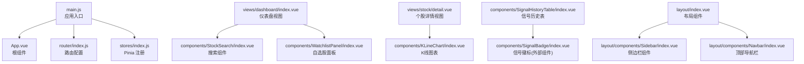

**图表来源**
- [src/main.js:1-17](file://src/main.js#L1-L17)
- [src/App.vue:1-13](file://src/App.vue#L1-L13)
- [src/router/index.js:1-58](file://src/router/index.js#L1-L58)
- [src/stores/index.js:1-11](file://src/stores/index.js#L1-L11)
- [src/views/dashboard/index.vue:1-163](file://src/views/dashboard/index.vue#L1-L163)
- [src/layout/index.vue:1-61](file://src/layout/index.vue#L1-L61)
- [src/layout/components/Sidebar/index.vue:1-172](file://src/layout/components/Sidebar/index.vue#L1-L172)
- [src/layout/components/Navbar/index.vue:1-128](file://src/layout/components/Navbar/index.vue#L1-L128)

**章节来源**
- [src/main.js:1-17](file://src/main.js#L1-L17)
- [src/App.vue:1-13](file://src/App.vue#L1-L13)
- [src/router/index.js:1-58](file://src/router/index.js#L1-L58)
- [src/stores/index.js:1-11](file://src/stores/index.js#L1-L11)

## 核心组件
本节梳理平台关键组件及其职责与交互点：
- StockSearch：提供股票搜索与跳转能力，依赖搜索 API，并通过路由跳转至个股详情页
- WatchlistPanel：展示与管理自选股列表，读取 Pinia 中的实时行情并支持移除
- KLineChart：基于 ECharts 的蜡烛图与技术指标可视化组件，接收 K 线数据、指标与信号
- SignalHistoryTable：以表格形式展示信号历史，内部组合 SignalBadge 展示信号强度
- Dashboard 视图：作为容器，聚合 MarketIndexBar、StockSearch、WatchlistPanel 等组件，协调数据刷新与生命周期
- Sidebar：侧边栏导航组件，提供主要功能入口（行情总览、信号回测、参数设置），支持折叠展开
- Navbar：顶部导航栏组件，包含汉堡菜单、页面标题、搜索框和市场状态显示

**章节来源**
- [src/components/StockSearch/index.vue:1-76](file://src/components/StockSearch/index.vue#L1-L76)
- [src/components/WatchlistPanel/index.vue:1-143](file://src/components/WatchlistPanel/index.vue#L1-L143)
- [src/components/KLineChart/index.vue:1-285](file://src/components/KLineChart/index.vue#L1-L285)
- [src/components/SignalHistoryTable/index.vue:1-32](file://src/components/SignalHistoryTable/index.vue#L1-L32)
- [src/views/dashboard/index.vue:1-163](file://src/views/dashboard/index.vue#L1-L163)
- [src/layout/components/Sidebar/index.vue:1-172](file://src/layout/components/Sidebar/index.vue#L1-L172)
- [src/layout/components/Navbar/index.vue:1-128](file://src/layout/components/Navbar/index.vue#L1-L128)

## 架构总览
组件系统围绕"视图层组件 + 全局状态 + API 工具 + 布局组件"展开，形成清晰的数据流闭环：
- 视图层组件通过 Pinia Store 获取/更新全局状态
- 组件通过 API 工具发起网络请求，拉取远端数据
- 组件之间通过 props 传递数据，必要时通过路由参数进行页面级联动
- 图表组件通过 ECharts 渲染，具备响应式尺寸与销毁清理
- 布局组件提供统一的导航结构，支持侧边栏折叠与自选股快捷访问

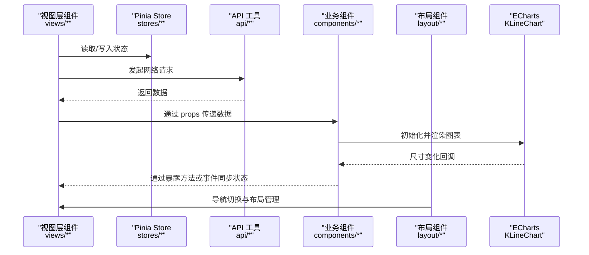

**图表来源**
- [src/views/dashboard/index.vue:1-163](file://src/views/dashboard/index.vue#L1-L163)
- [src/stores/market.js:1-41](file://src/stores/market.js#L1-L41)
- [src/stores/watchlist.js:1-53](file://src/stores/watchlist.js#L1-L53)
- [src/api/search.js:1-38](file://src/api/search.js#L1-L38)
- [src/api/kline.js:1-27](file://src/api/kline.js#L1-L27)
- [src/components/KLineChart/index.vue:1-285](file://src/components/KLineChart/index.vue#L1-L285)
- [src/layout/components/Sidebar/index.vue:1-172](file://src/layout/components/Sidebar/index.vue#L1-L172)

## 详细组件分析

### 组件导入导出与统一管理
- 组件统一导出：通过组件目录的集中导出文件，提供统一的 import 接口，便于在视图中按需引入
- 主应用注册：在应用入口完成插件与状态管理的安装，确保组件可在运行时访问全局服务

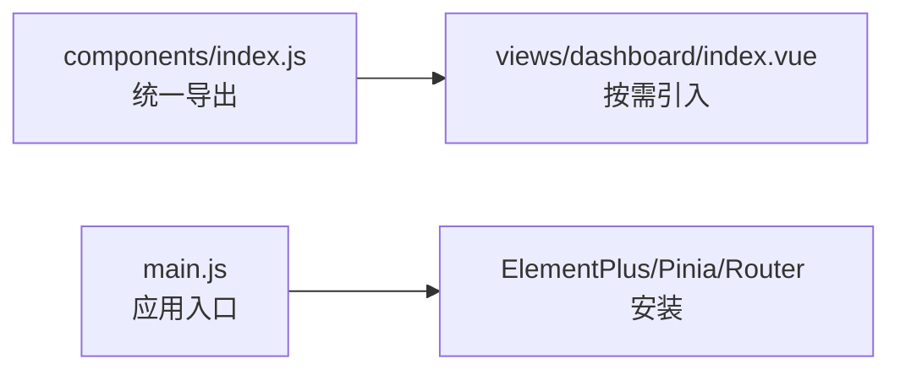

**图表来源**
- [src/components/index.js:1-22](file://src/components/index.js#L1-L22)
- [src/views/dashboard/index.vue:84-85](file://src/views/dashboard/index.vue#L84-L85)
- [src/main.js:1-17](file://src/main.js#L1-L17)

**章节来源**
- [src/components/index.js:1-22](file://src/components/index.js#L1-L22)
- [src/main.js:1-17](file://src/main.js#L1-L17)

### 侧边栏组件（Sidebar）与导航结构
- 功能要点：提供主要功能入口，支持折叠展开，显示自选股快捷访问
- 菜单结构：简化后的菜单包含 3 个主要入口，移除了原有的"信号筛选"功能
- 通信方式：通过 Element Plus Menu 组件实现路由导航，支持图标与标题显示
- 状态管理：与布局组件协同工作，响应 Navbar 的折叠指令

**更新** 侧边栏菜单结构已简化，从原来的 4 个菜单项减少到 3 个菜单项

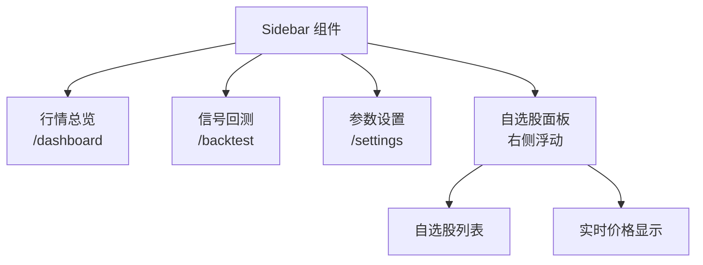

**图表来源**
- [src/layout/components/Sidebar/index.vue:15-26](file://src/layout/components/Sidebar/index.vue#L15-L26)
- [src/layout/components/Sidebar/index.vue:29-49](file://src/layout/components/Sidebar/index.vue#L29-L49)
- [src/router/index.js:13-38](file://src/router/index.js#L13-L38)

**章节来源**
- [src/layout/components/Sidebar/index.vue:1-172](file://src/layout/components/Sidebar/index.vue#L1-L172)
- [src/router/index.js:1-58](file://src/router/index.js#L1-L58)

### 顶部导航栏（Navbar）与交互控制
- 功能要点：包含汉堡菜单、页面标题、搜索框和市场状态显示
- 交互控制：通过事件发射实现与 Sidebar 的折叠同步
- 时间显示：实时更新当前时间，显示市场状态（交易中/休市）

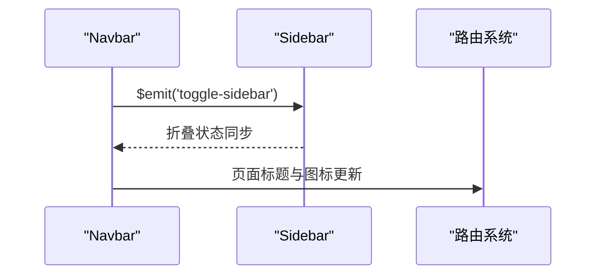

**图表来源**
- [src/layout/components/Navbar/index.vue:4-8](file://src/layout/components/Navbar/index.vue#L4-L8)
- [src/layout/components/Navbar/index.vue:29-30](file://src/layout/components/Navbar/index.vue#L29-L30)
- [src/layout/components/Navbar/index.vue:32-49](file://src/layout/components/Navbar/index.vue#L32-L49)

**章节来源**
- [src/layout/components/Navbar/index.vue:1-128](file://src/layout/components/Navbar/index.vue#L1-L128)

### 搜索组件（StockSearch）与路由联动
- 功能要点：自动补全搜索、结果格式化、选择项跳转
- 通信方式：通过 props 接收建议结果；通过事件触发路由跳转；模板插槽用于自定义展示
- 数据流：调用搜索 API -> 格式化结果 -> 传给 UI -> 用户选择 -> 路由跳转

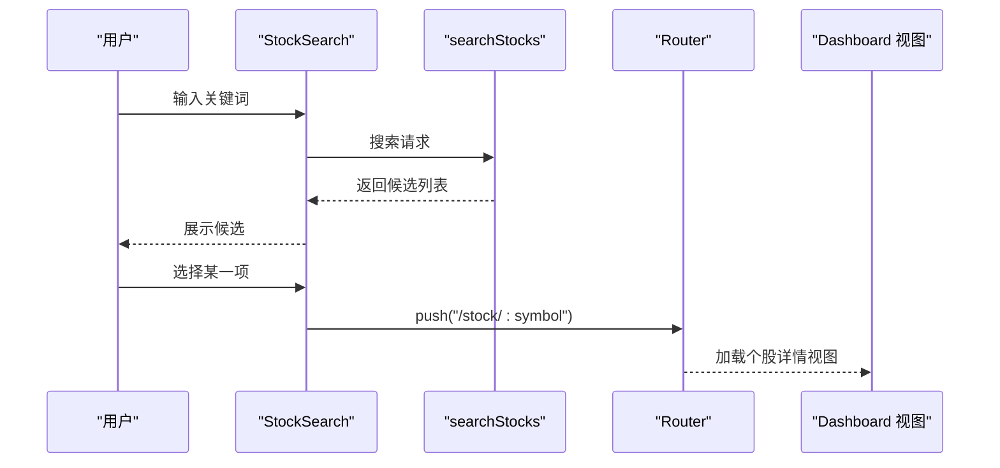

**图表来源**
- [src/components/StockSearch/index.vue:1-76](file://src/components/StockSearch/index.vue#L1-L76)
- [src/api/search.js:1-38](file://src/api/search.js#L1-L38)
- [src/router/index.js:21-25](file://src/router/index.js#L21-L25)
- [src/views/dashboard/index.vue:14-18](file://src/views/dashboard/index.vue#L14-L18)

**章节来源**
- [src/components/StockSearch/index.vue:1-76](file://src/components/StockSearch/index.vue#L1-L76)
- [src/api/search.js:1-38](file://src/api/search.js#L1-L38)
- [src/router/index.js:21-25](file://src/router/index.js#L21-L25)
- [src/views/dashboard/index.vue:14-18](file://src/views/dashboard/index.vue#L14-L18)

### 图表组件（KLineChart）与数据渲染
- 功能要点：接收 K 线数据、指标与信号，动态构建 ECharts 选项，支持多子图布局与缩放
- 通信方式：通过 props 接收数据；在挂载后初始化图表实例；监听 props 变化重绘；暴露 resize 方法
- 生命周期：mounted 初始化与 ResizeObserver 监听；unmounted 释放实例与观察器
- 性能优化：禁用动画、深度监听、延迟渲染、按需渲染子图

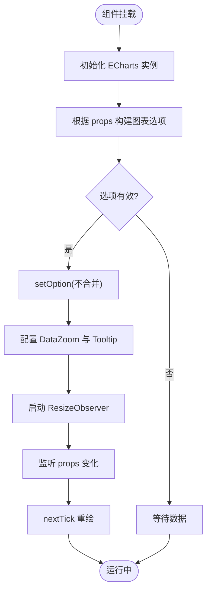

**图表来源**
- [src/components/KLineChart/index.vue:1-285](file://src/components/KLineChart/index.vue#L1-L285)
- [src/utils/constants.js:1-68](file://src/utils/constants.js#L1-L68)

**章节来源**
- [src/components/KLineChart/index.vue:1-285](file://src/components/KLineChart/index.vue#L1-L285)
- [src/utils/constants.js:1-68](file://src/utils/constants.js#L1-L68)

### 自选股面板（WatchlistPanel）与状态同步
- 功能要点：展示自选股列表、实时报价、刷新与移除操作
- 通信方式：直接读取 Pinia Store 的 watchlist 与 realtimeData；通过按钮触发 store 方法
- 生命周期：在视图挂载/卸载时启动/停止定时刷新

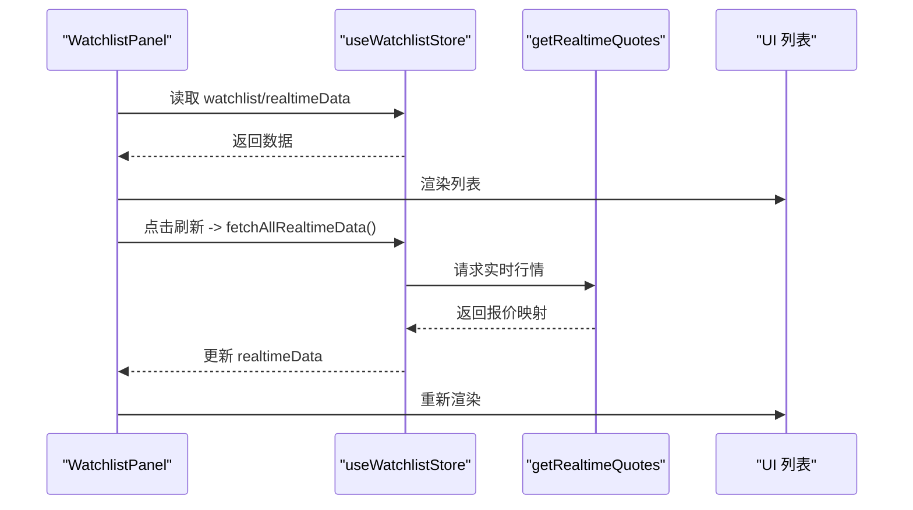

**图表来源**
- [src/components/WatchlistPanel/index.vue:1-143](file://src/components/WatchlistPanel/index.vue#L1-L143)
- [src/stores/watchlist.js:1-53](file://src/stores/watchlist.js#L1-L53)

**章节来源**
- [src/components/WatchlistPanel/index.vue:1-143](file://src/components/WatchlistPanel/index.vue#L1-L143)
- [src/stores/watchlist.js:1-53](file://src/stores/watchlist.js#L1-L53)

### 信号历史表（SignalHistoryTable）与插槽复用
- 功能要点：以表格展示信号历史，单元格内嵌套 SignalBadge 展示信号强度
- 通信方式：通过 props 接收信号数组；使用默认插槽对信号列进行自定义渲染

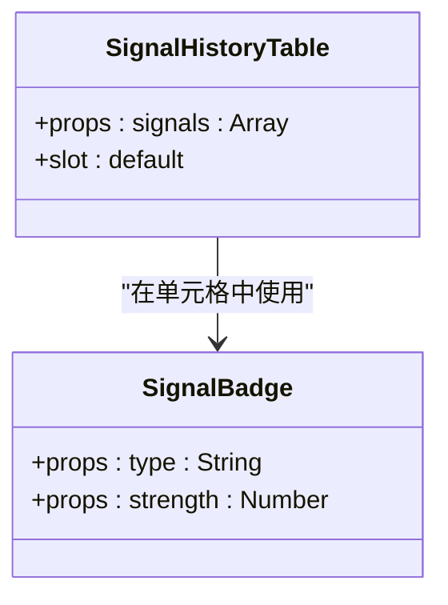

**图表来源**
- [src/components/SignalHistoryTable/index.vue:1-32](file://src/components/SignalHistoryTable/index.vue#L1-L32)

**章节来源**
- [src/components/SignalHistoryTable/index.vue:1-32](file://src/components/SignalHistoryTable/index.vue#L1-L32)

### 仪表盘视图（Dashboard）的编排与生命周期
- 功能要点：聚合大盘指数、快速搜索、热门股票与自选股面板
- 通信方式：通过 props 向子组件传递数据；通过按钮事件触发 store 方法；在生命周期中启动/停止自动刷新
- 路由联动：点击热门股票或自选股行项跳转至个股详情页

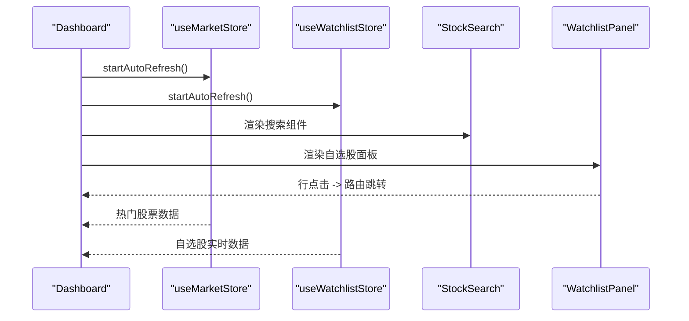

**图表来源**
- [src/views/dashboard/index.vue:1-163](file://src/views/dashboard/index.vue#L1-L163)
- [src/stores/market.js:25-33](file://src/stores/market.js#L25-L33)
- [src/stores/watchlist.js:37-45](file://src/stores/watchlist.js#L37-L45)

**章节来源**
- [src/views/dashboard/index.vue:1-163](file://src/views/dashboard/index.vue#L1-L163)
- [src/stores/market.js:25-33](file://src/stores/market.js#L25-L33)
- [src/stores/watchlist.js:37-45](file://src/stores/watchlist.js#L37-L45)

## 依赖关系分析
- 组件依赖：视图层组件依赖 Pinia Store 与 API 工具；图表组件依赖 ECharts 与颜色常量；布局组件依赖 Element Plus 组件库
- 状态依赖：MarketStore 与 WatchlistStore 分别管理大盘与自选股相关状态
- 路由依赖：搜索组件与自选股面板通过路由跳转实现页面级联动
- 布局依赖：所有视图组件都通过 Layout 组件提供统一的导航结构

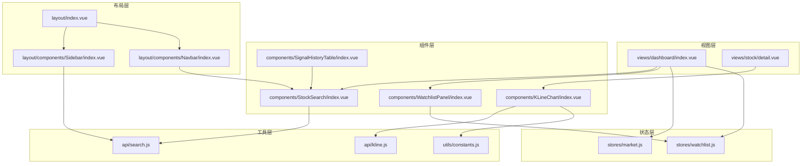

**图表来源**
- [src/views/dashboard/index.vue:1-163](file://src/views/dashboard/index.vue#L1-L163)
- [src/views/stock/detail.vue](file://src/views/stock/detail.vue)
- [src/components/StockSearch/index.vue:1-76](file://src/components/StockSearch/index.vue#L1-L76)
- [src/components/KLineChart/index.vue:1-285](file://src/components/KLineChart/index.vue#L1-L285)
- [src/components/WatchlistPanel/index.vue:1-143](file://src/components/WatchlistPanel/index.vue#L1-L143)
- [src/components/SignalHistoryTable/index.vue:1-32](file://src/components/SignalHistoryTable/index.vue#L1-L32)
- [src/layout/index.vue:1-61](file://src/layout/index.vue#L1-L61)
- [src/layout/components/Sidebar/index.vue:1-172](file://src/layout/components/Sidebar/index.vue#L1-L172)
- [src/layout/components/Navbar/index.vue:1-128](file://src/layout/components/Navbar/index.vue#L1-L128)
- [src/stores/market.js:1-41](file://src/stores/market.js#L1-L41)
- [src/stores/watchlist.js:1-53](file://src/stores/watchlist.js#L1-L53)
- [src/utils/constants.js:1-68](file://src/utils/constants.js#L1-L68)
- [src/api/search.js:1-38](file://src/api/search.js#L1-L38)
- [src/api/kline.js:1-27](file://src/api/kline.js#L1-L27)

**章节来源**
- [src/views/dashboard/index.vue:1-163](file://src/views/dashboard/index.vue#L1-L163)
- [src/stores/market.js:1-41](file://src/stores/market.js#L1-L41)
- [src/stores/watchlist.js:1-53](file://src/stores/watchlist.js#L1-L53)
- [src/utils/constants.js:1-68](file://src/utils/constants.js#L1-L68)
- [src/api/search.js:1-38](file://src/api/search.js#L1-L38)
- [src/api/kline.js:1-27](file://src/api/kline.js#L1-L27)

## 性能考量
- 图表渲染优化
  - 禁用动画：图表构建阶段关闭动画，减少首屏渲染压力
  - 深度监听：对包含对象/数组的 props 进行深度监听，避免遗漏变更
  - 延迟渲染：在 nextTick 中执行重绘，保证 DOM 更新后再渲染
- 内存与资源管理
  - ResizeObserver：在组件卸载时断开观察器，防止内存泄漏
  - ECharts 实例：在卸载时 dispose 实例，释放 WebGl/Canvas 资源
- 网络与状态刷新
  - 自动刷新：MarketStore 与 WatchlistStore 在挂载时启动定时器，卸载时清理
  - 并发请求：使用 Promise.all 并行刷新多个数据源，缩短等待时间
- UI 交互优化
  - 搜索防抖：搜索组件对输入进行防抖，降低请求频率
  - 滚动与空态：列表组件使用滚动容器与空态占位，提升可读性
  - 侧边栏折叠：支持快速折叠展开，节省屏幕空间

**章节来源**
- [src/components/KLineChart/index.vue:251-276](file://src/components/KLineChart/index.vue#L251-L276)
- [src/stores/market.js:25-33](file://src/stores/market.js#L25-L33)
- [src/stores/watchlist.js:37-45](file://src/stores/watchlist.js#L37-L45)
- [src/components/StockSearch/index.vue:34-43](file://src/components/StockSearch/index.vue#L34-L43)
- [src/layout/components/Sidebar/index.vue:78-95](file://src/layout/components/Sidebar/index.vue#L78-L95)

## 故障排查指南
- 搜索无结果
  - 检查搜索 API 返回结构是否符合预期，确认过滤逻辑与正则匹配
  - 查看控制台错误输出，定位网络请求异常
- 图表不渲染或空白
  - 确认 props 数据结构完整（如日期、开盘价、收盘价、最高价、最低价、成交量）
  - 检查 ECharts 初始化时机与容器尺寸，确保 ResizeObserver 正常工作
- 自选股刷新不生效
  - 确认 symbols 计算属性已正确收集符号列表
  - 检查定时器是否被清理，以及实时行情接口返回格式
- 路由跳转失败
  - 检查路由守卫与路径参数是否正确
  - 确保视图组件在挂载时启动了自动刷新
- 侧边栏菜单异常
  - 检查路由配置是否与菜单项对应
  - 确认菜单项索引与实际路由路径一致
- 布局显示问题
  - 检查 CSS 变量定义是否正确
  - 确认组件样式类名与布局结构匹配

**章节来源**
- [src/api/search.js:1-38](file://src/api/search.js#L1-L38)
- [src/components/KLineChart/index.vue:251-276](file://src/components/KLineChart/index.vue#L251-L276)
- [src/stores/watchlist.js:29-35](file://src/stores/watchlist.js#L29-L35)
- [src/router/index.js:47-55](file://src/router/index.js#L47-L55)
- [src/layout/components/Sidebar/index.vue:15-26](file://src/layout/components/Sidebar/index.vue#L15-L26)

## 结论
本组件系统通过"视图层组件 + Pinia 状态 + API 工具 + 布局组件"的分层设计，实现了清晰的数据流与可维护的扩展性。组件间主要通过 props 传递数据、通过路由实现页面级联动、通过插槽实现内容复用。配合生命周期管理与性能优化策略，系统在复杂金融场景下具备良好的稳定性与可扩展性。

**更新** 最新的侧边栏组件经过简化调整，移除了"信号筛选"功能，现在提供更简洁的导航体验，同时保持了核心功能的完整性。

## 附录：使用示例与集成指南

- 在视图中引入组件
  - 通过统一导出文件引入所需组件，然后在模板中直接使用
  - 示例参考：[src/views/dashboard/index.vue:84-85](file://src/views/dashboard/index.vue#L84-L85)

- 通过 props 传递数据
  - 搜索组件接收建议结果并展示，参考：[src/components/StockSearch/index.vue:34-43](file://src/components/StockSearch/index.vue#L34-L43)
  - 图表组件接收 K 线数据、指标与信号，参考：[src/components/KLineChart/index.vue:10-16](file://src/components/KLineChart/index.vue#L10-L16)

- 使用插槽进行内容定制
  - 搜索组件使用默认插槽自定义候选项展示，参考：[src/components/StockSearch/index.vue:15-22](file://src/components/StockSearch/index.vue#L15-L22)
  - 信号历史表在单元格中嵌套 SignalBadge，参考：[src/components/SignalHistoryTable/index.vue:5-7](file://src/components/SignalHistoryTable/index.vue#L5-L7)

- 状态管理与生命周期
  - 在视图中启动/停止自动刷新，参考：[src/views/dashboard/index.vue:101-109](file://src/views/dashboard/index.vue#L101-L109)
  - Store 中的定时器管理，参考：[src/stores/market.js:25-33](file://src/stores/market.js#L25-L33)、[src/stores/watchlist.js:37-45](file://src/stores/watchlist.js#L37-L45)

- 错误处理与容错
  - 搜索 API 对异常进行捕获并返回空数组，参考：[src/api/search.js:33-37](file://src/api/search.js#L33-L37)
  - K 线数据解析失败时返回空数组，参考：[src/api/kline.js:23-26](file://src/api/kline.js#L23-L26)

- 性能优化实践
  - 图表禁用动画与深度监听，参考：[src/components/KLineChart/index.vue:212](file://src/components/KLineChart/index.vue#L212)、[src/components/KLineChart/index.vue:270-274](file://src/components/KLineChart/index.vue#L270-L274)
  - 卸载时释放资源，参考：[src/components/KLineChart/index.vue:264-268](file://src/components/KLineChart/index.vue#L264-L268)

- 布局组件集成
  - 侧边栏组件通过路由配置实现导航，参考：[src/layout/components/Sidebar/index.vue:15-26](file://src/layout/components/Sidebar/index.vue#L15-L26)
  - 顶部导航栏与侧边栏协同工作，参考：[src/layout/components/Navbar/index.vue:4-8](file://src/layout/components/Navbar/index.vue#L4-L8)