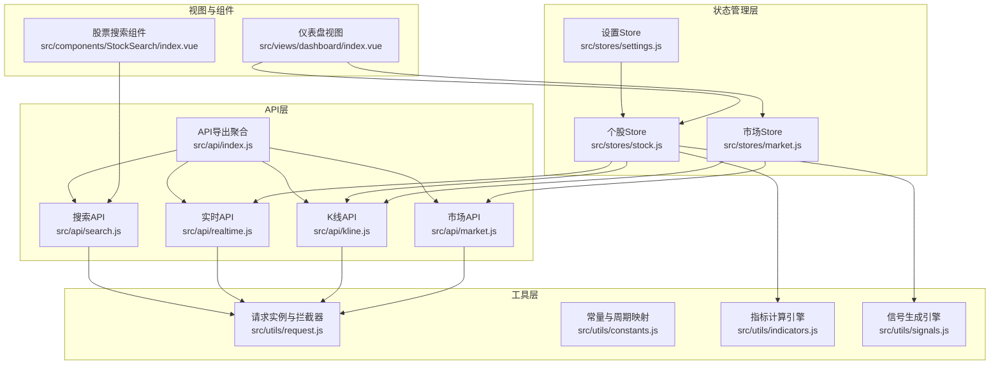
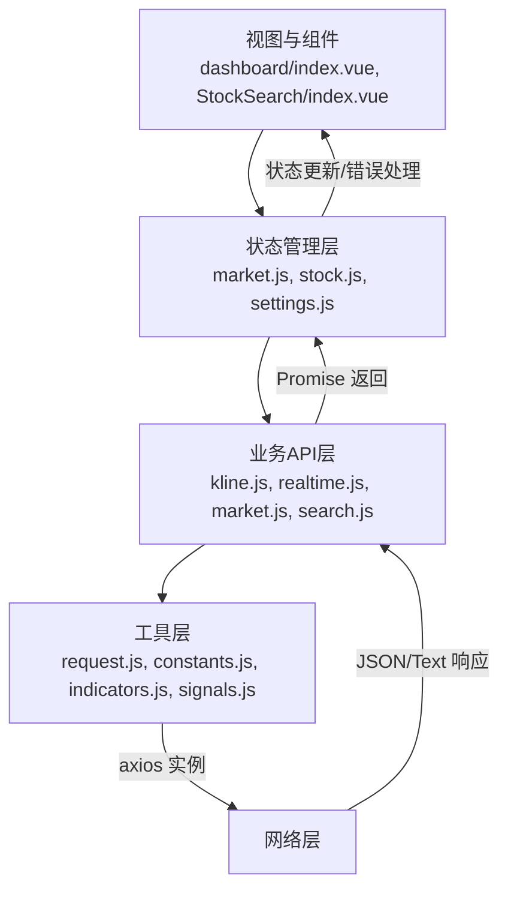
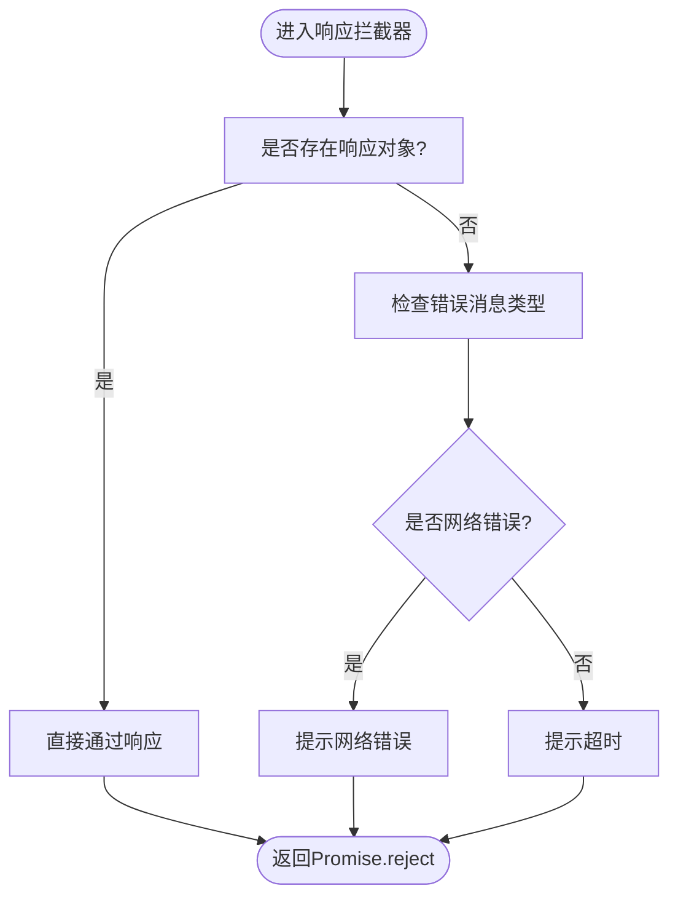
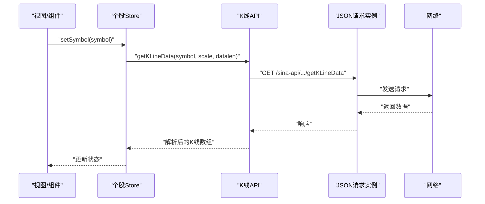
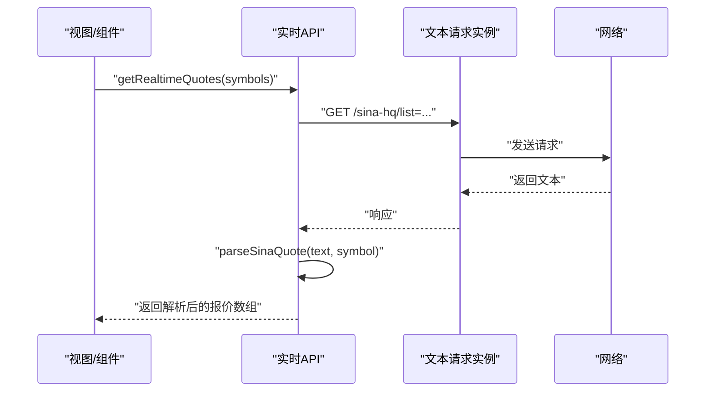
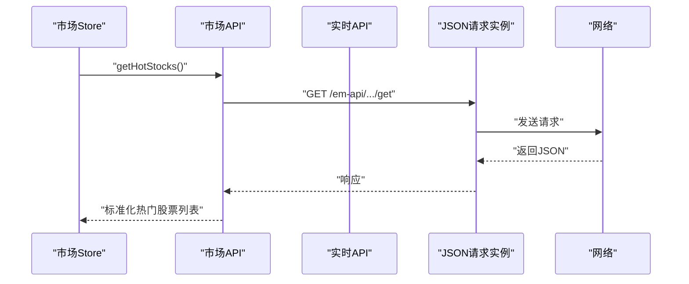
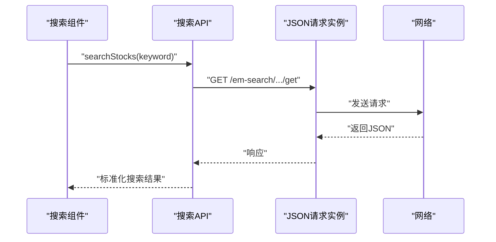
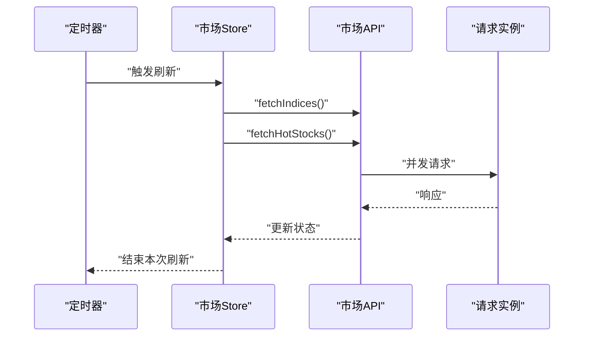
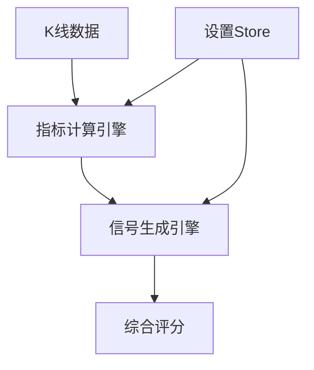
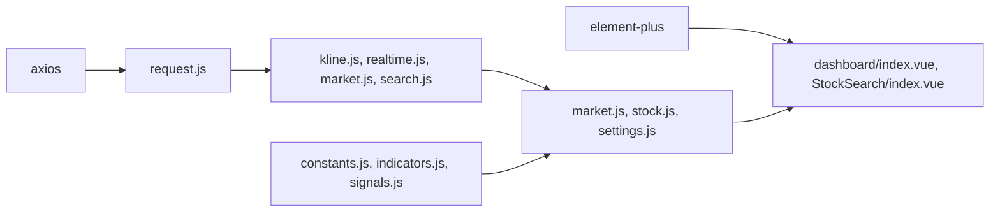

# HTTP请求

<cite>
**本文引用的文件**
- [src/utils/request.js](file://src/utils/request.js)
- [src/api/index.js](file://src/api/index.js)
- [src/api/kline.js](file://src/api/kline.js)
- [src/api/realtime.js](file://src/api/realtime.js)
- [src/api/market.js](file://src/api/market.js)
- [src/api/search.js](file://src/api/search.js)
- [src/stores/market.js](file://src/stores/market.js)
- [src/stores/stock.js](file://src/stores/stock.js)
- [src/utils/constants.js](file://src/utils/constants.js)
- [src/utils/indicators.js](file://src/utils/indicators.js)
- [src/utils/signals.js](file://src/utils/signals.js)
- [src/stores/settings.js](file://src/stores/settings.js)
- [src/views/dashboard/index.vue](file://src/views/dashboard/index.vue)
- [src/components/StockSearch/index.vue](file://src/components/StockSearch/index.vue)
- [package.json](file://package.json)
</cite>

## 目录
1. [简介](#简介)
2. [项目结构](#项目结构)
3. [核心组件](#核心组件)
4. [架构总览](#架构总览)
5. [详细组件分析](#详细组件分析)
6. [依赖分析](#依赖分析)
7. [性能考虑](#性能考虑)
8. [故障排查指南](#故障排查指南)
9. [结论](#结论)
10. [附录](#附录)

## 简介
本章节概述量化交易平台中HTTP请求模块的设计目标与整体思路。该模块以axios为基础，通过创建不同用途的请求实例（JSON与文本），统一管理超时、响应类型与错误提示；API层对具体业务进行封装，提供清晰的函数式接口；状态管理层负责并发控制、自动刷新与错误兜底；前端组件通过调用API与状态管理完成用户交互与数据展示。

## 项目结构
HTTP请求相关代码主要分布在以下位置：
- 工具层：请求实例与错误处理
- API层：面向业务的请求函数（K线、实时行情、市场、搜索）
- 状态层：Pinia Store（市场、个股）
- 工具与常量：周期映射、指标与信号计算
- 视图与组件：仪表盘页面与搜索组件

图表来源
- [src/views/dashboard/index.vue:1-163](file://src/views/dashboard/index.vue#L1-L163)
- [src/components/StockSearch/index.vue:1-76](file://src/components/StockSearch/index.vue#L1-L76)
- [src/stores/market.js:1-41](file://src/stores/market.js#L1-L41)
- [src/stores/stock.js:1-92](file://src/stores/stock.js#L1-L92)
- [src/stores/settings.js:1-70](file://src/stores/settings.js#L1-L70)
- [src/api/index.js:1-5](file://src/api/index.js#L1-L5)
- [src/api/kline.js:1-27](file://src/api/kline.js#L1-L27)
- [src/api/realtime.js:1-56](file://src/api/realtime.js#L1-L56)
- [src/api/market.js:1-46](file://src/api/market.js#L1-L46)
- [src/api/search.js:1-38](file://src/api/search.js#L1-L38)
- [src/utils/request.js:1-29](file://src/utils/request.js#L1-L29)
- [src/utils/constants.js:1-68](file://src/utils/constants.js#L1-L68)
- [src/utils/indicators.js:1-245](file://src/utils/indicators.js#L1-L245)
- [src/utils/signals.js:1-347](file://src/utils/signals.js#L1-L347)

章节来源
- [src/utils/request.js:1-29](file://src/utils/request.js#L1-L29)
- [src/api/index.js:1-5](file://src/api/index.js#L1-L5)
- [src/api/kline.js:1-27](file://src/api/kline.js#L1-L27)
- [src/api/realtime.js:1-56](file://src/api/realtime.js#L1-L56)
- [src/api/market.js:1-46](file://src/api/market.js#L1-L46)
- [src/api/search.js:1-38](file://src/api/search.js#L1-L38)
- [src/stores/market.js:1-41](file://src/stores/market.js#L1-L41)
- [src/stores/stock.js:1-92](file://src/stores/stock.js#L1-L92)
- [src/utils/constants.js:1-68](file://src/utils/constants.js#L1-L68)
- [src/utils/indicators.js:1-245](file://src/utils/indicators.js#L1-L245)
- [src/utils/signals.js:1-347](file://src/utils/signals.js#L1-L347)
- [src/stores/settings.js:1-70](file://src/stores/settings.js#L1-L70)
- [src/views/dashboard/index.vue:1-163](file://src/views/dashboard/index.vue#L1-L163)
- [src/components/StockSearch/index.vue:1-76](file://src/components/StockSearch/index.vue#L1-L76)

## 核心组件
- 请求实例与拦截器
  - JSON请求实例：用于返回JSON格式的API，统一超时与响应类型。
  - 文本请求实例：用于返回文本格式的API，保留原始字符串并统一错误提示。
  - 全局响应拦截器：集中处理网络错误、超时与服务端错误，并通过消息组件提示用户。
- API函数封装
  - K线：获取历史K线数据，参数化周期与长度，异常时返回空数组。
  - 实时行情：批量获取实时报价，解析文本格式，异常时返回空数组。
  - 市场：获取大盘指数与热门股票，内部复用实时行情API。
  - 搜索：根据关键词检索股票，过滤无效结果并返回标准化数据。
- 状态管理与并发控制
  - 市场Store：支持自动刷新与并发拉取，避免重复请求。
  - 个股Store：管理K线、指标、信号与自动刷新，异常时设置错误状态。
- 前端集成
  - 仪表盘页面：启动自动刷新，展示热门股票与指数。
  - 搜索组件：调用搜索API，提供下拉联想与路由跳转。

章节来源
- [src/utils/request.js:1-29](file://src/utils/request.js#L1-L29)
- [src/api/kline.js:1-27](file://src/api/kline.js#L1-L27)
- [src/api/realtime.js:1-56](file://src/api/realtime.js#L1-L56)
- [src/api/market.js:1-46](file://src/api/market.js#L1-L46)
- [src/api/search.js:1-38](file://src/api/search.js#L1-L38)
- [src/stores/market.js:1-41](file://src/stores/market.js#L1-L41)
- [src/stores/stock.js:1-92](file://src/stores/stock.js#L1-L92)
- [src/views/dashboard/index.vue:1-163](file://src/views/dashboard/index.vue#L1-L163)
- [src/components/StockSearch/index.vue:1-76](file://src/components/StockSearch/index.vue#L1-L76)

## 架构总览
HTTP请求模块采用“工具层-业务API层-状态层-视图层”的分层设计，确保职责分离与可维护性。

图表来源
- [src/views/dashboard/index.vue:1-163](file://src/views/dashboard/index.vue#L1-L163)
- [src/components/StockSearch/index.vue:1-76](file://src/components/StockSearch/index.vue#L1-L76)
- [src/stores/market.js:1-41](file://src/stores/market.js#L1-L41)
- [src/stores/stock.js:1-92](file://src/stores/stock.js#L1-L92)
- [src/stores/settings.js:1-70](file://src/stores/settings.js#L1-L70)
- [src/api/kline.js:1-27](file://src/api/kline.js#L1-L27)
- [src/api/realtime.js:1-56](file://src/api/realtime.js#L1-L56)
- [src/api/market.js:1-46](file://src/api/market.js#L1-L46)
- [src/api/search.js:1-38](file://src/api/search.js#L1-L38)
- [src/utils/request.js:1-29](file://src/utils/request.js#L1-L29)
- [src/utils/constants.js:1-68](file://src/utils/constants.js#L1-L68)
- [src/utils/indicators.js:1-245](file://src/utils/indicators.js#L1-L245)
- [src/utils/signals.js:1-347](file://src/utils/signals.js#L1-L347)

## 详细组件分析

### 请求实例与拦截器（工具层）
- 设计要点
  - 创建两个axios实例：一个用于JSON响应，一个用于文本响应。
  - 统一超时时间与响应类型，减少重复配置。
  - 注册全局响应拦截器，集中处理错误并提示用户。
- 错误处理
  - 对网络错误、超时与服务端错误进行区分提示。
  - 将错误对象透传给调用方，便于上层捕获与降级。
- 使用建议
  - 优先使用JSON实例；仅当需要解析原始文本时使用文本实例。
  - 不要在拦截器中吞掉错误，保证调用链路可感知异常。

图表来源
- [src/utils/request.js:17-25](file://src/utils/request.js#L17-L25)

章节来源
- [src/utils/request.js:1-29](file://src/utils/request.js#L1-L29)

### API函数封装（业务层）

#### K线数据获取（GET）
- 功能：根据股票代码与周期参数获取K线数据。
- 参数：symbol（股票代码）、scale（周期，默认日K）、datalen（数据条数）。
- 行为：请求成功则映射为统一结构；异常时返回空数组。
- 并发与性能：由调用方控制并发；建议在Store中统一调度。

图表来源
- [src/stores/stock.js:25-52](file://src/stores/stock.js#L25-L52)
- [src/api/kline.js:9-26](file://src/api/kline.js#L9-L26)
- [src/utils/request.js:5-8](file://src/utils/request.js#L5-L8)

章节来源
- [src/api/kline.js:1-27](file://src/api/kline.js#L1-L27)
- [src/stores/stock.js:1-92](file://src/stores/stock.js#L1-L92)

#### 实时行情获取（GET）
- 功能：批量获取实时行情，解析新浪文本格式。
- 参数：symbols（股票代码数组）。
- 行为：请求成功后逐个解析文本，返回标准化对象；异常时返回空数组。
- 注意：文本解析依赖正则匹配，需确保服务端返回格式稳定。

图表来源
- [src/api/realtime.js:39-47](file://src/api/realtime.js#L39-L47)
- [src/api/realtime.js:7-33](file://src/api/realtime.js#L7-L33)
- [src/utils/request.js:11-15](file://src/utils/request.js#L11-L15)

章节来源
- [src/api/realtime.js:1-56](file://src/api/realtime.js#L1-L56)

#### 市场数据获取（GET）
- 功能：获取大盘指数与热门股票。
- 指数：内部调用实时API批量获取上证、深证、创业板数据。
- 热门股票：调用JSON API获取按成交额排序的股票列表，清洗字段并返回标准化数据。
- 异常：内部try/catch兜底，失败时返回空数组。

图表来源
- [src/stores/market.js:15-23](file://src/stores/market.js#L15-L23)
- [src/api/market.js:14-45](file://src/api/market.js#L14-L45)
- [src/utils/request.js:5-8](file://src/utils/request.js#L5-L8)

章节来源
- [src/api/market.js:1-46](file://src/api/market.js#L1-L46)
- [src/stores/market.js:1-41](file://src/stores/market.js#L1-L41)

#### 股票搜索（GET）
- 功能：根据关键词搜索股票，过滤无效代码并返回标准化结果。
- 参数：keyword（关键词）。
- 行为：请求成功后清洗数据；异常时记录日志并返回空数组。

图表来源
- [src/components/StockSearch/index.vue:34-43](file://src/components/StockSearch/index.vue#L34-L43)
- [src/api/search.js:7-37](file://src/api/search.js#L7-L37)
- [src/utils/request.js:5-8](file://src/utils/request.js#L5-L8)

章节来源
- [src/api/search.js:1-38](file://src/api/search.js#L1-L38)
- [src/components/StockSearch/index.vue:1-76](file://src/components/StockSearch/index.vue#L1-L76)

### 状态管理与并发控制（状态层）
- 市场Store
  - 提供获取指数与热门股票的方法，支持并发执行与自动刷新定时器。
  - 使用Promise.all并发拉取，提升加载效率。
- 个股Store
  - 管理当前股票、K线、指标、信号与自动刷新。
  - 在获取K线与实时行情时设置loading/error状态，便于UI反馈。
  - 通过周期映射与设置Store参数驱动指标与信号计算。

图表来源
- [src/stores/market.js:19-33](file://src/stores/market.js#L19-L33)
- [src/stores/stock.js:74-81](file://src/stores/stock.js#L74-L81)

章节来源
- [src/stores/market.js:1-41](file://src/stores/market.js#L1-L41)
- [src/stores/stock.js:1-92](file://src/stores/stock.js#L1-L92)

### 数据流与处理逻辑（工具层）
- 周期映射：将UI周期值映射到服务端scale参数，确保请求一致性。
- 指标计算：基于K线数据计算MA、MACD、KDJ、RSI、布林带与支撑压力位。
- 信号生成：基于指标生成多策略信号，并综合评分给出交易建议。
- 设置持久化：通过本地存储保存用户偏好，避免每次初始化丢失。

图表来源
- [src/utils/constants.js:28-36](file://src/utils/constants.js#L28-L36)
- [src/utils/indicators.js:221-244](file://src/utils/indicators.js#L221-L244)
- [src/utils/signals.js:197-230](file://src/utils/signals.js#L197-L230)
- [src/stores/settings.js:54-62](file://src/stores/settings.js#L54-L62)

章节来源
- [src/utils/constants.js:1-68](file://src/utils/constants.js#L1-L68)
- [src/utils/indicators.js:1-245](file://src/utils/indicators.js#L1-L245)
- [src/utils/signals.js:1-347](file://src/utils/signals.js#L1-L347)
- [src/stores/settings.js:1-70](file://src/stores/settings.js#L1-L70)

## 依赖分析
- 外部依赖
  - axios：HTTP客户端，提供请求与响应拦截能力。
  - element-plus：UI组件库，用于消息提示与表格展示。
- 内部依赖
  - API层依赖工具层请求实例。
  - 状态层依赖API层与工具层（指标、信号、常量）。
  - 视图层依赖状态层与组件库。

图表来源
- [package.json:11-20](file://package.json#L11-L20)
- [src/utils/request.js:1-2](file://src/utils/request.js#L1-L2)
- [src/views/dashboard/index.vue:80-85](file://src/views/dashboard/index.vue#L80-L85)
- [src/components/StockSearch/index.vue:29](file://src/components/StockSearch/index.vue#L29)
- [src/api/kline.js:1](file://src/api/kline.js#L1)
- [src/api/realtime.js:1](file://src/api/realtime.js#L1)
- [src/api/market.js:2](file://src/api/market.js#L2)
- [src/api/search.js:1](file://src/api/search.js#L1)
- [src/stores/market.js:3](file://src/stores/market.js#L3)
- [src/stores/stock.js:4](file://src/stores/stock.js#L4)
- [src/stores/settings.js:3](file://src/stores/settings.js#L3)
- [src/utils/constants.js:1](file://src/utils/constants.js#L1)
- [src/utils/indicators.js:1](file://src/utils/indicators.js#L1)
- [src/utils/signals.js:1](file://src/utils/signals.js#L1)

章节来源
- [package.json:1-28](file://package.json#L1-L28)
- [src/utils/request.js:1-29](file://src/utils/request.js#L1-L29)

## 性能考虑
- 并发控制
  - 使用Promise.all并发拉取市场数据，缩短首屏加载时间。
  - 个股Store中同时获取K线与实时行情，减少等待时间。
- 超时与重试
  - 当前未实现自动重试策略；可在拦截器或封装函数中增加指数退避重试。
- 缓存策略
  - 可引入内存缓存（如LRU）或本地缓存，降低重复请求频率。
- 网络错误处理
  - 统一错误提示，避免重复弹窗；在高频刷新场景中合并提示。
- 安全与鉴权
  - 若后端需要鉴权，建议在请求头中注入令牌并在拦截器中统一处理。
- UI体验
  - 使用loading状态与骨架屏提升感知速度；对错误进行友好提示。

## 故障排查指南
- 常见问题
  - 网络错误：检查网络连通性与代理设置。
  - 超时：适当增大超时时间或优化后端响应。
  - 解析失败：确认服务端返回格式是否符合预期（特别是文本解析）。
- 调试方法
  - 在API函数中添加日志输出，定位请求参数与响应结构。
  - 使用浏览器开发者工具观察请求与响应，核对状态码与数据格式。
  - 在Store中设置错误状态，结合UI反馈定位问题范围。
- 错误处理
  - 拦截器已提供统一错误提示；若需自定义行为，可在调用处catch并处理。

章节来源
- [src/utils/request.js:17-25](file://src/utils/request.js#L17-L25)
- [src/api/kline.js:23-25](file://src/api/kline.js#L23-L25)
- [src/api/realtime.js:44-46](file://src/api/realtime.js#L44-L46)
- [src/api/market.js:42-44](file://src/api/market.js#L42-L44)
- [src/api/search.js:33-36](file://src/api/search.js#L33-L36)

## 结论
该HTTP请求模块通过清晰的分层设计实现了高内聚低耦合：工具层提供统一的请求实例与拦截器，API层聚焦业务封装，状态层负责并发与刷新，视图层专注交互。模块具备良好的扩展性与可维护性，适合在量化平台中持续演进。

## 附录
- API函数一览
  - K线：getKLineData(symbol, scale?, datalen?)
  - 实时：getRealtimeQuotes(symbols[])、getStockSnapshot(symbol)
  - 市场：getMarketIndices()、getHotStocks()
  - 搜索：searchStocks(keyword)
- 关键配置
  - 周期映射：PERIODS（日/周/分钟级）
  - 指标默认参数：DEFAULT_INDICATOR_PARAMS
  - 信号权重与阈值：SIGNAL_WEIGHTS、SCORE_THRESHOLDS

章节来源
- [src/api/kline.js:1-27](file://src/api/kline.js#L1-L27)
- [src/api/realtime.js:1-56](file://src/api/realtime.js#L1-L56)
- [src/api/market.js:1-46](file://src/api/market.js#L1-L46)
- [src/api/search.js:1-38](file://src/api/search.js#L1-L38)
- [src/utils/constants.js:28-60](file://src/utils/constants.js#L28-L60)