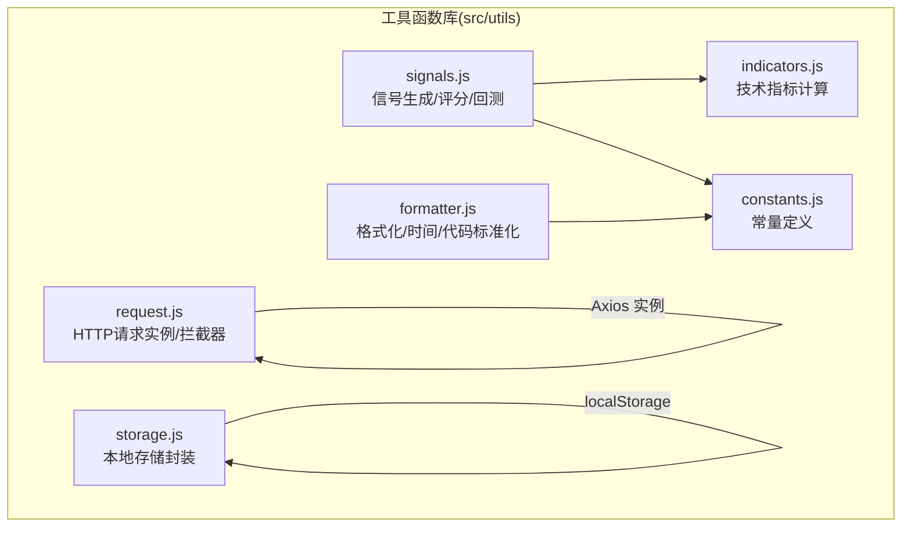
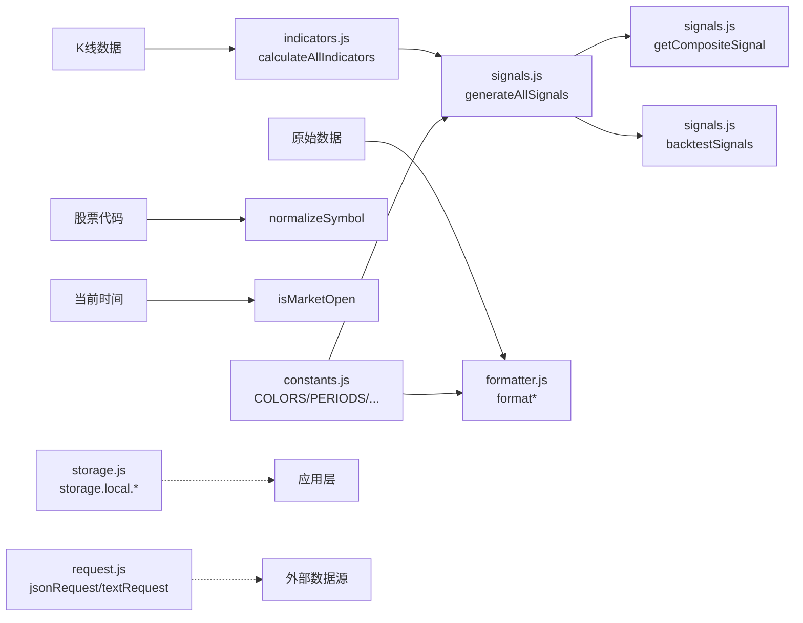
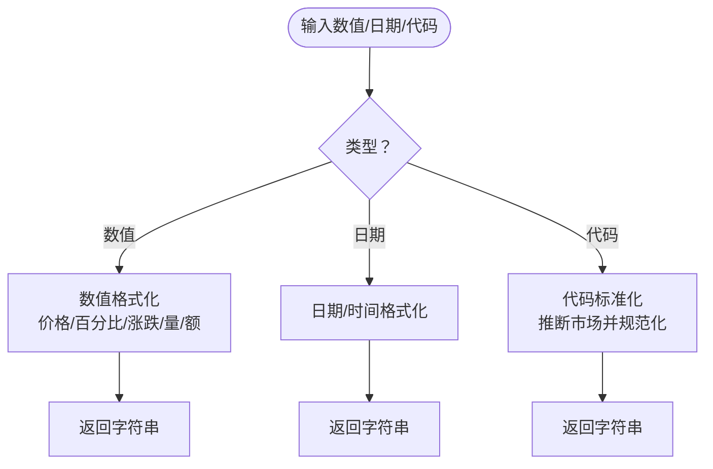
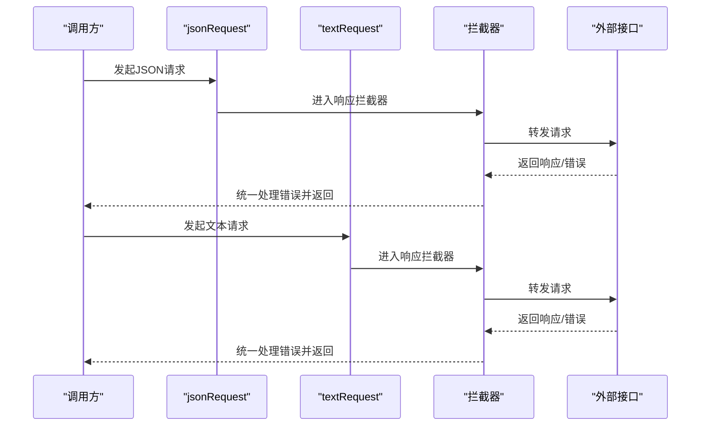
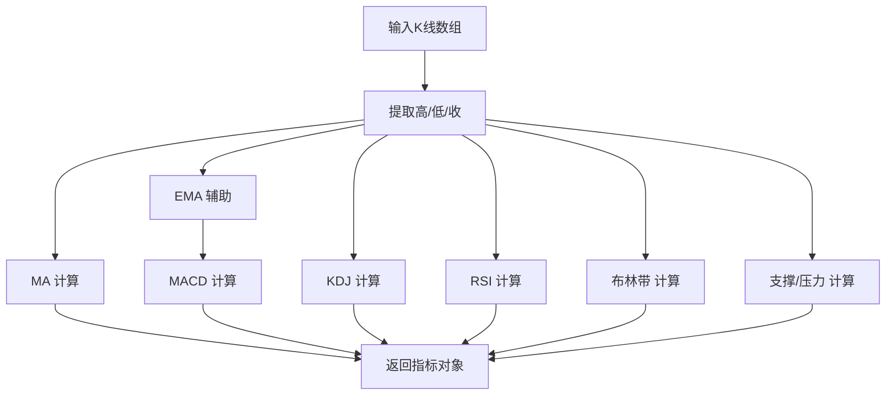
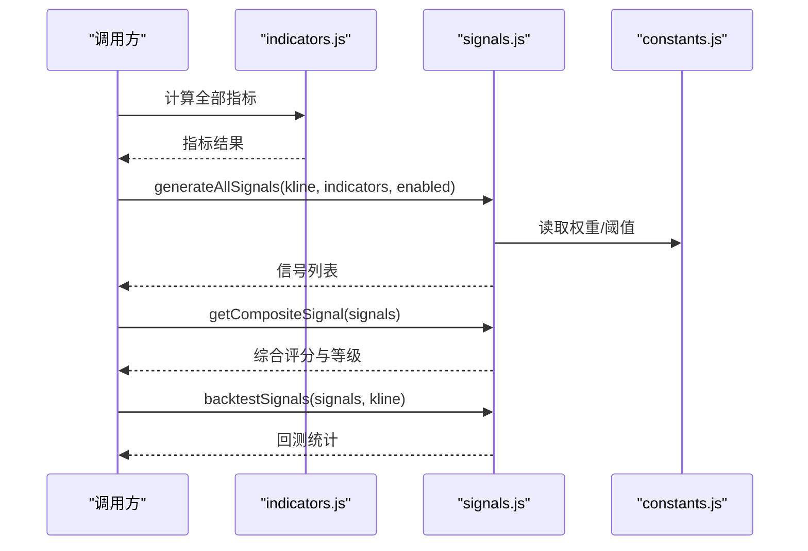
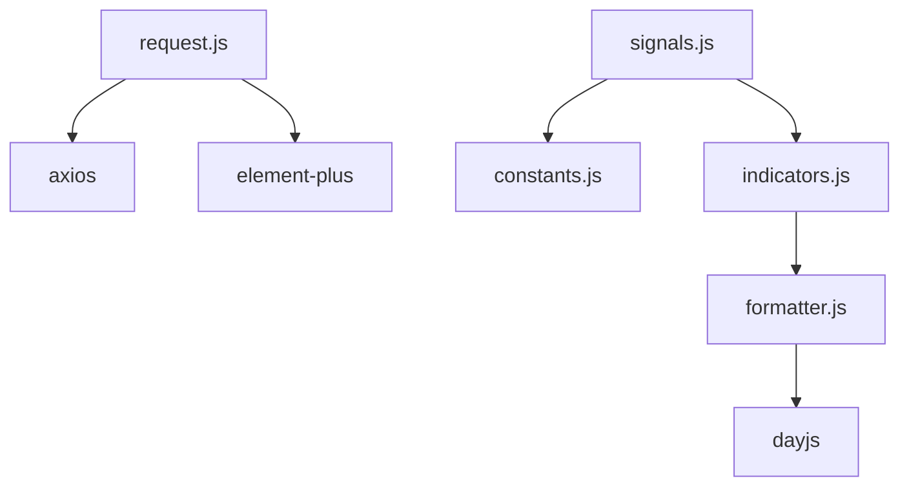

# 工具函数库

<cite>
**本文引用的文件**
- [src/utils/constants.js](file://src/utils/constants.js)
- [src/utils/formatter.js](file://src/utils/formatter.js)
- [src/utils/storage.js](file://src/utils/storage.js)
- [src/utils/request.js](file://src/utils/request.js)
- [src/utils/indicators.js](file://src/utils/indicators.js)
- [src/utils/signals.js](file://src/utils/signals.js)
</cite>

## 目录
1. [简介](#简介)
2. [项目结构](#项目结构)
3. [核心组件](#核心组件)
4. [架构总览](#架构总览)
5. [详细组件分析](#详细组件分析)
6. [依赖分析](#依赖分析)
7. [性能考量](#性能考量)
8. [故障排查指南](#故障排查指南)
9. [结论](#结论)
10. [附录](#附录)

## 简介
本文件系统化梳理量化交易平台的工具函数库，覆盖常量定义、数据格式化、本地存储、HTTP 请求、技术指标计算与信号生成等模块。文档以“设计原则 + 分类体系 + 功能说明 + API 接口 + 使用示例 + 最佳实践 + 扩展与自定义 + 测试策略”为主线，帮助开发者快速理解与高效使用这些工具函数，并在实际业务中安全、稳定地集成。

## 项目结构
工具函数库位于 src/utils 目录，采用按功能域拆分的模块化组织方式：
- constants.js：全局常量（颜色、周期、默认指标参数、信号权重、评分阈值、大盘指数）
- formatter.js：数据格式化与市场时间判断、股票代码标准化
- storage.js：本地存储封装（统一前缀、JSON 序列化）
- request.js：HTTP 请求实例与统一错误处理拦截器
- indicators.js：技术指标计算引擎（MA/MACD/KDJ/RSI/布林带/支撑压力位）
- signals.js：基于指标的信号生成与综合评分、简易回测

图表来源
- [src/utils/constants.js](file://src/utils/constants.js)
- [src/utils/formatter.js](file://src/utils/formatter.js)
- [src/utils/storage.js](file://src/utils/storage.js)
- [src/utils/request.js](file://src/utils/request.js)
- [src/utils/indicators.js](file://src/utils/indicators.js)
- [src/utils/signals.js](file://src/utils/signals.js)

章节来源
- [src/utils/constants.js](file://src/utils/constants.js)
- [src/utils/formatter.js](file://src/utils/formatter.js)
- [src/utils/storage.js](file://src/utils/storage.js)
- [src/utils/request.js](file://src/utils/request.js)
- [src/utils/indicators.js](file://src/utils/indicators.js)
- [src/utils/signals.js](file://src/utils/signals.js)

## 核心组件
- 常量模块：提供颜色、周期、默认指标参数、信号权重、评分阈值、大盘指数等全局配置，确保界面与策略的一致性。
- 格式化模块：提供价格/百分比/涨跌/成交量/金额/日期时间等格式化函数，以及市场开市判断与股票代码标准化。
- 存储模块：提供本地存储的统一封装，自动加前缀与 JSON 序列化/反序列化，简化持久化逻辑。
- 请求模块：基于 Axios 创建 JSON 与文本两类请求实例，统一设置超时与响应类型，并通过拦截器集中处理错误提示。
- 指标模块：实现 MA、MACD、KDJ、RSI、布林带、支撑压力位等指标的纯函数计算，便于复用与测试。
- 信号模块：基于指标结果生成买卖信号，支持多策略聚合、信号强度加权、近期评分、简易回测统计。

章节来源
- [src/utils/constants.js](file://src/utils/constants.js)
- [src/utils/formatter.js](file://src/utils/formatter.js)
- [src/utils/storage.js](file://src/utils/storage.js)
- [src/utils/request.js](file://src/utils/request.js)
- [src/utils/indicators.js](file://src/utils/indicators.js)
- [src/utils/signals.js](file://src/utils/signals.js)

## 架构总览
工具函数库遵循“纯函数优先、无副作用、可组合”的设计原则。各模块之间通过清晰的输入输出契约协作：
- 指标模块产出标准化数组/对象，供信号模块消费；
- 信号模块汇总多策略信号并进行评分与回测；
- 格式化模块负责 UI 展示层的数据呈现；
- 常量模块为颜色、周期、阈值等提供统一配置；
- 存储模块与请求模块分别承担本地持久化与网络通信的基础设施职责。

图表来源
- [src/utils/indicators.js](file://src/utils/indicators.js)
- [src/utils/signals.js](file://src/utils/signals.js)
- [src/utils/formatter.js](file://src/utils/formatter.js)
- [src/utils/constants.js](file://src/utils/constants.js)
- [src/utils/storage.js](file://src/utils/storage.js)
- [src/utils/request.js](file://src/utils/request.js)

## 详细组件分析

### 常量模块（constants.js）
职责与设计原则
- 将与 UI 和策略相关的“硬编码值”集中管理，避免散落配置带来的维护成本与不一致风险。
- 采用分组导出，便于按需引入，降低包体积与耦合度。

关键内容
- 颜色常量：涵盖涨跌、均线、MACD/DIF/DEA、KDJ/J、RSI、成交量、支撑/压力、买卖信号等，满足图表与状态展示一致性。
- K线周期：包含周期标签、内部值与缩放因子，便于 UI 选择与数据聚合。
- 默认指标参数：提供 MACD/KDJ/RSI/BOLL/MA 的默认窗口与平滑参数，作为计算引擎的默认配置。
- 信号权重与评分阈值：定义“强/中/弱”信号的权重与综合评分阈值，用于信号聚合与推荐等级判定。
- 大盘指数：列举主要市场指数代码与名称，便于首页或对比分析使用。

最佳实践
- 在新增策略或图表颜色时，优先在该模块补充常量，保持全局一致。
- 对外暴露的阈值与权重应尽量通过配置项注入，以便策略调参与 A/B 测试。

章节来源
- [src/utils/constants.js](file://src/utils/constants.js)

### 格式化模块（formatter.js）
职责与设计原则
- 提供面向 UI 的数据格式化能力，统一展示风格。
- 封装日期时间与市场时间判断，减少重复逻辑。

关键函数与行为
- 数值格式化：价格保留两位小数；百分比与涨跌带正负号保留两位小数。
- 量值格式化：以“亿/万/个”为单位自动转换，兼顾可读性与精度。
- 日期时间：支持自定义格式，默认返回“年-月-日”或“年-月-日 时:分:秒”。
- 市场开市判断：根据周几与小时分钟范围判断是否开市，适配中国市场交易时段。
- 代码标准化：根据代码前缀推断市场（sh/sz），并规范化为“市场+纯数字代码”。

使用示例（路径指引）
- 价格/百分比/涨跌/量/额格式化：[src/utils/formatter.js](file://src/utils/formatter.js)
- 日期/时间格式化：[src/utils/formatter.js](file://src/utils/formatter.js)
- 市场开市判断：[src/utils/formatter.js](file://src/utils/formatter.js)
- 代码标准化：[src/utils/formatter.js](file://src/utils/formatter.js)

图表来源
- [src/utils/formatter.js](file://src/utils/formatter.js)

章节来源
- [src/utils/formatter.js](file://src/utils/formatter.js)

### 本地存储模块（storage.js）
职责与设计原则
- 统一本地存储访问入口，自动加前缀与 JSON 序列化，避免跨模块重复逻辑与错误处理遗漏。

关键接口
- storage.local.get(key)：读取并解析 JSON，异常时返回空值。
- storage.local.set(key, value)：序列化后写入。
- storage.local.remove(key)：删除指定键。

最佳实践
- 所有持久化键名统一加前缀，避免命名冲突。
- 对可能非 JSON 的旧数据进行容错处理，防止异常中断。
- 对大对象写入注意浏览器存储限额，必要时进行压缩或分片。

章节来源
- [src/utils/storage.js](file://src/utils/storage.js)

### HTTP 请求模块（request.js）
职责与设计原则
- 基于 Axios 创建两类请求实例，分别面向 JSON 与文本响应，统一超时与响应类型。
- 通过响应拦截器集中处理错误消息，提升用户体验与错误可见性。

关键点
- jsonRequest：JSON 响应，适合结构化接口（如 K 线、行情）。
- textRequest：文本响应，适合解析型接口（如搜索、文本协议）。
- 错误处理：区分网络错误、服务端错误与超时，统一弹窗提示并拒绝 Promise。

图表来源
- [src/utils/request.js](file://src/utils/request.js)

章节来源
- [src/utils/request.js](file://src/utils/request.js)

### 技术指标模块（indicators.js）
职责与设计原则
- 以纯函数形式实现各类技术指标，输入为数组，输出为数组或对象，便于单元测试与组合使用。
- 通过辅助函数（如 EMA）构建更复杂的指标，确保数值对齐与边界处理。

关键算法与复杂度
- MA：滑动窗口求和，时间复杂度 O(n*p)，空间复杂度 O(n)。
- EMA：指数加权递推，时间复杂度 O(n)。
- MACD：先算短/长 EMA，再算 DIF/DEA，整体 O(n)。
- KDJ：窗口内最高最低滚动计算，整体 O(n*p)。
- RSI：前后差分累积平均，整体 O(n)。
- 布林带：滚动均值与标准差，整体 O(n*p)。
- 支撑/压力：枢轴点与 MA 合并去重，整体 O(n)。

图表来源
- [src/utils/indicators.js](file://src/utils/indicators.js)

章节来源
- [src/utils/indicators.js](file://src/utils/indicators.js)

### 信号模块（signals.js）
职责与设计原则
- 基于指标结果生成买卖信号，支持多策略聚合与信号强度分级。
- 提供综合评分与简易回测，辅助策略验证与推荐等级。

关键流程
- 信号生成：遍历指标序列，识别交叉/超买超卖/触位等条件，构造信号对象（含日期索引、类型、强度、描述等）。
- 多策略聚合：按启用列表组合 MACD/KDJ/RSI/BOLL/MA 信号，按索引排序。
- 综合评分：按信号强度权重与方向累加，映射到“强烈买入/建议买入/观望/建议卖出/强烈卖出”。
- 回测：模拟持有期、止盈止损，统计胜率、平均收益、最大回撤与分策略表现。

图表来源
- [src/utils/signals.js](file://src/utils/signals.js)
- [src/utils/constants.js](file://src/utils/constants.js)
- [src/utils/indicators.js](file://src/utils/indicators.js)

章节来源
- [src/utils/signals.js](file://src/utils/signals.js)
- [src/utils/constants.js](file://src/utils/constants.js)

## 依赖分析
- 模块内聚与解耦
  - constants 仅提供配置，无运行时副作用，被 formatter、signals 广泛引用。
  - formatter 依赖 dayjs，提供纯格式化能力，不依赖其他工具模块。
  - storage 仅封装 localStorage，不依赖业务逻辑。
  - request 依赖 axios 与 UI 消息组件，集中处理错误，不参与业务数据处理。
  - indicators 与 signals 互为输入输出关系，indicators 为纯函数，signals 为组合与统计。
- 外部依赖
  - dayjs：日期时间处理。
  - axios：HTTP 客户端。
  - element-plus：错误消息提示（仅在请求模块使用）。

图表来源
- [src/utils/formatter.js](file://src/utils/formatter.js)
- [src/utils/request.js](file://src/utils/request.js)
- [src/utils/signals.js](file://src/utils/signals.js)
- [src/utils/indicators.js](file://src/utils/indicators.js)
- [src/utils/constants.js](file://src/utils/constants.js)

章节来源
- [src/utils/formatter.js](file://src/utils/formatter.js)
- [src/utils/request.js](file://src/utils/request.js)
- [src/utils/signals.js](file://src/utils/signals.js)
- [src/utils/indicators.js](file://src/utils/indicators.js)
- [src/utils/constants.js](file://src/utils/constants.js)

## 性能考量
- 指标计算
  - 大多数指标为 O(n) 或 O(n*p)，注意避免在热路径重复计算相同窗口。
  - 对长序列数据，优先使用滑动窗口与增量更新（如 MA 的滑动求和）。
- 信号生成
  - 信号遍历为 O(n) 级别，建议在数据量较大时限制回看窗口与启用策略数量。
- 格式化
  - 量值格式化包含分支判断，建议批量渲染时复用格式化函数，避免重复创建闭包。
- 存储
  - localStorage 写入为同步阻塞，建议异步化或批量写入，避免主线程卡顿。
- 请求
  - 统一超时与拦截器可减少重复错误处理代码，提高稳定性。

## 故障排查指南
- 请求失败
  - 现象：接口报错或超时，UI 弹出错误提示。
  - 排查：确认网络连通性、接口可用性与超时设置；检查拦截器是否正确捕获错误。
  - 参考：[src/utils/request.js](file://src/utils/request.js)
- 数据为空或格式异常
  - 现象：格式化结果异常或信号为空。
  - 排查：确认输入数据类型与边界值（null/undefined），检查指标计算是否越界。
  - 参考：[src/utils/formatter.js](file://src/utils/formatter.js)、[src/utils/indicators.js](file://src/utils/indicators.js)
- 本地存储读取失败
  - 现象：读取返回空值或抛出异常。
  - 排查：确认键名前缀、JSON 可序列化性与浏览器存储限额。
  - 参考：[src/utils/storage.js](file://src/utils/storage.js)
- 信号评分异常
  - 现象：综合评分与预期不符。
  - 排查：核对信号强度权重与评分阈值，确认最近 N 根 K 线的选择逻辑。
  - 参考：[src/utils/signals.js](file://src/utils/signals.js)、[src/utils/constants.js](file://src/utils/constants.js)

章节来源
- [src/utils/request.js](file://src/utils/request.js)
- [src/utils/formatter.js](file://src/utils/formatter.js)
- [src/utils/indicators.js](file://src/utils/indicators.js)
- [src/utils/storage.js](file://src/utils/storage.js)
- [src/utils/signals.js](file://src/utils/signals.js)
- [src/utils/constants.js](file://src/utils/constants.js)

## 结论
工具函数库以“纯函数 + 明确职责 + 统一配置 + 基础设施封装”为核心设计思想，既保证了可测试性与可维护性，又为上层业务提供了稳定可靠的能力底座。通过常量、格式化、存储、请求、指标与信号六大模块的协同，能够高效支撑 K 线图、技术分析、策略生成与回测等关键场景。

## 附录

### API 接口速览（路径指引）
- 常量
  - 颜色/周期/默认参数/权重/阈值/指数：[src/utils/constants.js](file://src/utils/constants.js)
- 格式化
  - 价格/百分比/涨跌/量/额/日期/时间/开市判断/代码标准化：[src/utils/formatter.js](file://src/utils/formatter.js)
- 存储
  - storage.local.get/set/remove：[src/utils/storage.js](file://src/utils/storage.js)
- 请求
  - jsonRequest、textRequest、错误拦截器：[src/utils/request.js](file://src/utils/request.js)
- 指标
  - MA/MACD/KDJ/RSI/布林带/支撑压力位/综合计算：[src/utils/indicators.js](file://src/utils/indicators.js)
- 信号
  - 信号生成/聚合/评分/回测：[src/utils/signals.js](file://src/utils/signals.js)

### 使用示例与最佳实践（路径指引）
- 格式化
  - 价格/百分比/量/时间格式化：[src/utils/formatter.js](file://src/utils/formatter.js)
  - 市场开市判断与代码标准化：[src/utils/formatter.js](file://src/utils/formatter.js)
- 存储
  - 读取/写入/删除键值：[src/utils/storage.js](file://src/utils/storage.js)
- 请求
  - 使用 jsonRequest/textRequest 获取数据并处理错误：[src/utils/request.js](file://src/utils/request.js)
- 指标与信号
  - 计算指标并生成信号、评分与回测：[src/utils/indicators.js](file://src/utils/indicators.js)、[src/utils/signals.js](file://src/utils/signals.js)
- 常量
  - 引入颜色/周期/阈值等配置：[src/utils/constants.js](file://src/utils/constants.js)

### 扩展与自定义
- 新增指标
  - 在 indicators.js 中添加纯函数，遵循输入输出约定，避免副作用。
  - 在 signals.js 中注册到 generateAllSignals 的启用列表。
- 自定义格式化
  - 在 formatter.js 中新增函数，保持幂等与可测试性。
- 自定义存储键
  - 使用 storage.local.* 并遵循统一前缀与 JSON 规范。
- 自定义请求
  - 基于现有实例扩展或新增实例，统一拦截器策略。

### 测试策略与质量保证
- 单元测试
  - 对纯函数（如 format*、calculate*）编写输入输出断言，覆盖边界值与异常路径。
- 集成测试
  - 对信号生成与回测流程进行端到端校验，确保指标与信号的一致性。
- 兼容性与鲁棒性
  - 对空值、越界、异常输入进行容错处理，保证 UI 不崩溃。
- 性能回归
  - 对长序列数据进行基准测试，监控 O(n) 算法的执行时间与内存占用。