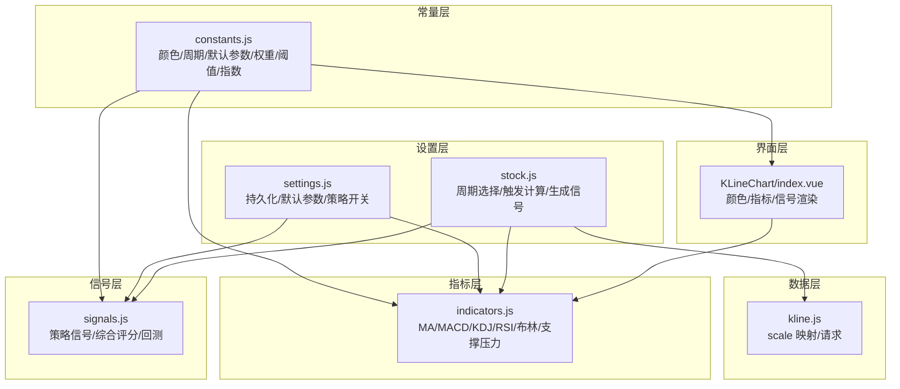
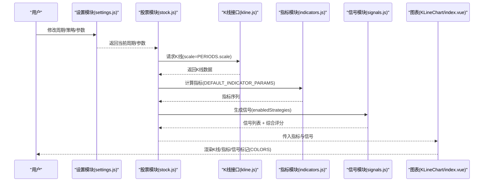
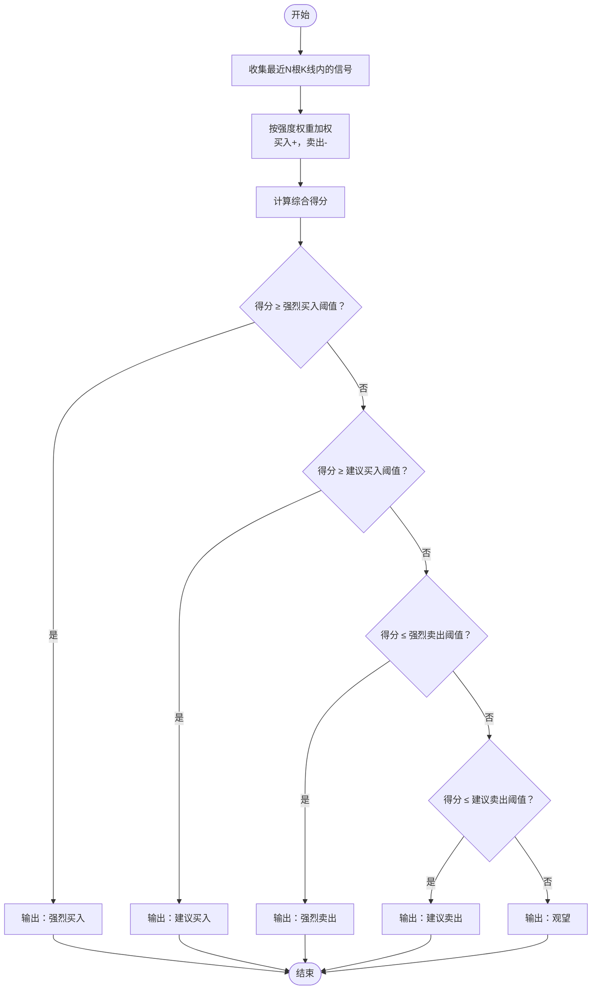
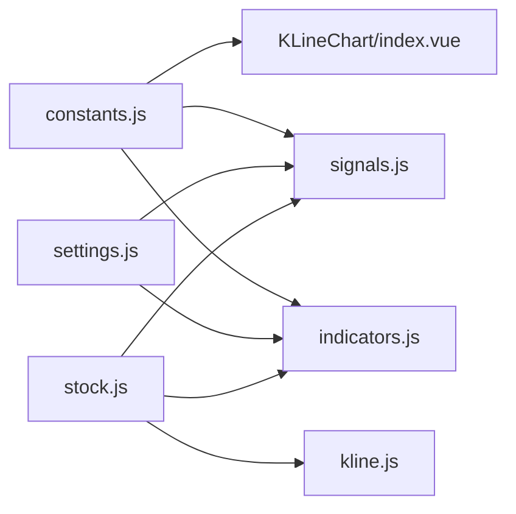

# 常量定义

<cite>
**本文引用的文件**
- [constants.js](file://src/utils/constants.js)
- [indicators.js](file://src/utils/indicators.js)
- [signals.js](file://src/utils/signals.js)
- [settings.js](file://src/stores/settings.js)
- [stock.js](file://src/stores/stock.js)
- [kline.js](file://src/api/kline.js)
- [index.vue（K线图表）](file://src/components/KLineChart/index.vue)
- [variables.scss](file://src/styles/variables.scss)
</cite>

## 目录
1. [简介](#简介)
2. [项目结构与定位](#项目结构与定位)
3. [核心常量组](#核心常量组)
4. [架构总览](#架构总览)
5. [组件与流程详解](#组件与流程详解)
6. [依赖关系分析](#依赖关系分析)
7. [性能与可维护性](#性能与可维护性)
8. [故障排查与常见问题](#故障排查与常见问题)
9. [结论](#结论)
10. [附录：最佳实践与扩展指南](#附录最佳实践与扩展指南)

## 简介
本文件系统化梳理量化交易系统的“常量定义”模块，覆盖颜色常量、K线周期、默认指标参数、信号权重、评分阈值、大盘指数代码等关键常量的定义、设计原则与使用场景，并结合指标计算与信号生成链路，给出最佳实践与扩展方法，帮助开发者在不破坏既有约定的前提下进行定制化开发。

## 项目结构与定位
常量定义位于工具层，被多个业务模块复用：
- 指标计算模块：读取默认参数，驱动技术指标计算
- 信号生成模块：依据权重与阈值，综合多策略信号生成推荐
- 图表渲染模块：使用颜色常量绘制蜡烛图、指标曲线与信号标记
- 设置存储模块：持久化用户偏好，联动默认参数与策略启用
- K线数据接口：根据周期常量映射到服务端 scale 参数

**图表来源**
- [constants.js:1-68](file://src/utils/constants.js#L1-L68)
- [indicators.js:1-245](file://src/utils/indicators.js#L1-L245)
- [signals.js:1-347](file://src/utils/signals.js#L1-L347)
- [settings.js:1-70](file://src/stores/settings.js#L1-L70)
- [stock.js:30-77](file://src/stores/stock.js#L30-L77)
- [kline.js:1-26](file://src/api/kline.js#L1-L26)
- [index.vue（K线图表）:1-285](file://src/components/KLineChart/index.vue#L1-L285)

**章节来源**
- [constants.js:1-68](file://src/utils/constants.js#L1-L68)
- [indicators.js:1-245](file://src/utils/indicators.js#L1-L245)
- [signals.js:1-347](file://src/utils/signals.js#L1-L347)
- [settings.js:1-70](file://src/stores/settings.js#L1-L70)
- [stock.js:30-77](file://src/stores/stock.js#L30-L77)
- [kline.js:1-26](file://src/api/kline.js#L1-L26)
- [index.vue（K线图表）:1-285](file://src/components/KLineChart/index.vue#L1-L285)

## 核心常量组
本节逐项解析各常量组的定义、用途与设计原则。

- 颜色常量（COLORS）
  - 设计原则：遵循中国市场“红涨绿跌”的通用视觉约定；不同指标系列采用统一语义色系，便于识别与对比。
  - 使用场景：蜡烛图涨跌颜色、成交量涨跌颜色、均线/指标线颜色、信号标记颜色、布林带三轨颜色等。
  - 关键字段举例：up/down/ma5/ma10/ma20/ma60/bollUpper/bollMiddle/bollLower/dif/dea/macdPositive/macdNegative/kLine/dLine/jLine/rsi/volume/support/resistance/buySignal/sellSignal。
  - 参考路径：[colors 定义:2-26](file://src/utils/constants.js#L2-L26)

- K线周期（PERIODS）
  - 设计原则：标准化周期标签与服务端 scale 映射，确保前后端一致。
  - 使用场景：用户切换周期时的映射、K线数据请求的 scale 参数。
  - 关键字段：label/value/scale；典型值：日K/daily/240，周K/weekly/1200，60分/60min/60，30分/30min/30，15分/15min/15，5分/5min/5。
  - 参考路径：[周期定义:29-36](file://src/utils/constants.js#L29-L36)

- 默认指标参数（DEFAULT_INDICATOR_PARAMS）
  - 设计原则：提供业界常用默认值，兼顾灵敏度与稳定性；支持用户通过设置模块覆盖。
  - 使用场景：指标计算函数的默认参数来源；设置模块持久化与恢复。
  - 关键字段：macd.short/long/signal，kdj.period/kPeriod/dPeriod，rsi.period，boll.period/multiplier，ma数组。
  - 参考路径：[默认参数:39-45](file://src/utils/constants.js#L39-L45)

- 信号强度权重（SIGNAL_WEIGHTS）
  - 设计原则：以数值表达信号可信度，便于综合评分聚合。
  - 使用场景：综合评分函数按强度加权，决定最终推荐等级。
  - 参考路径：[权重定义:48-52](file://src/utils/constants.js#L48-L52)

- 综合评分阈值（SCORE_THRESHOLDS）
  - 设计原则：以阈值区间划分推荐等级，形成明确的买卖建议边界。
  - 使用场景：综合评分函数根据区间输出“强烈买入/建议买入/建议卖出/强烈卖出/观望”。
  - 参考路径：[阈值定义:55-60](file://src/utils/constants.js#L55-L60)

- 大盘指数代码（MARKET_INDICES）
  - 设计原则：覆盖主要市场代表性指数，便于首页展示与数据拉取。
  - 使用场景：首页指数卡片展示、市场状态概览。
  - 参考路径：[指数列表:63-67](file://src/utils/constants.js#L63-L67)

**章节来源**
- [constants.js:1-68](file://src/utils/constants.js#L1-L68)

## 架构总览
常量在系统中的流转如下：
- 设置模块（settings.js）读取默认参数并持久化，作为指标计算与信号生成的输入。
- 股票模块（stock.js）根据用户选择的周期映射到 PERIODS，调用数据接口（kline.js）获取K线，随后计算指标与信号。
- 指标模块（indicators.js）使用 DEFAULT_INDICATOR_PARAMS 作为默认参数，生成多指标序列。
- 信号模块（signals.js）基于策略生成信号，使用 SIGNAL_WEIGHTS 与 SCORE_THRESHOLDS 进行综合评分。
- 图表模块（KLineChart/index.vue）使用 COLORS 渲染蜡烛图、指标曲线与信号标记。

**图表来源**
- [settings.js:1-70](file://src/stores/settings.js#L1-L70)
- [stock.js:30-77](file://src/stores/stock.js#L30-L77)
- [kline.js:1-26](file://src/api/kline.js#L1-L26)
- [indicators.js:221-245](file://src/utils/indicators.js#L221-L245)
- [signals.js:197-261](file://src/utils/signals.js#L197-L261)
- [index.vue（K线图表）:22-241](file://src/components/KLineChart/index.vue#L22-L241)

**章节来源**
- [settings.js:1-70](file://src/stores/settings.js#L1-L70)
- [stock.js:30-77](file://src/stores/stock.js#L30-L77)
- [kline.js:1-26](file://src/api/kline.js#L1-L26)
- [indicators.js:221-245](file://src/utils/indicators.js#L221-L245)
- [signals.js:197-261](file://src/utils/signals.js#L197-L261)
- [index.vue（K线图表）:22-241](file://src/components/KLineChart/index.vue#L22-L241)

## 组件与流程详解

### 颜色常量的使用与设计原则
- 设计原则
  - 中国市场的通用约定：红色代表上涨，绿色代表下跌。
  - 同类指标使用相近色系，如均线系列、KDJ/J线、MACD正负柱等，提升可读性。
  - 信号标记采用与涨跌一致的颜色，便于快速识别买卖方向。
- 典型使用
  - 蜡烛图涨跌颜色：up/down
  - 成交量涨跌颜色：volume 与蜡烛图涨跌颜色一致
  - 指标线颜色：ma5/ma10/ma20/ma60、kLine/dLine/jLine、rsi、dif/dea
  - 布林带：upper/middle/lower 三轨
  - 信号标记：buySignal/sellSignal
- 扩展建议
  - 新增颜色时保持与现有色系一致，避免混淆。
  - 若需区分多策略颜色，可在策略内部使用独立键名，但保持与整体风格一致。

**章节来源**
- [constants.js:2-26](file://src/utils/constants.js#L2-L26)
- [index.vue（K线图表）:72-205](file://src/components/KLineChart/index.vue#L72-L205)

### K线周期的标准化定义与映射
- 设计原则
  - 周期标签与服务端 scale 一一对应，避免歧义。
  - 支持分钟级、小时级、日/周级别，满足不同分析需求。
- 使用流程
  - 用户选择周期 -> 查找 PERIODS 中的 scale -> 调用接口传入 scale -> 后端返回对应K线。
- 扩展建议
  - 新增周期时，同时更新 PERIODS 与接口参数映射，保证一致性。

**章节来源**
- [constants.js:29-36](file://src/utils/constants.js#L29-L36)
- [stock.js:40-42](file://src/stores/stock.js#L40-L42)
- [kline.js:9-13](file://src/api/kline.js#L9-L13)

### 默认指标参数的默认配置与覆盖
- 设计原则
  - 提供业界常用默认值，兼顾灵敏度与稳定性。
  - 支持用户通过设置模块覆盖默认参数，实现个性化策略。
- 使用方式
  - 设置模块读取 DEFAULT_INDICATOR_PARAMS 并持久化，作为指标计算的默认输入。
  - 指标计算函数优先使用传入参数，否则回退到默认参数。
- 扩展建议
  - 新增策略参数时，同步更新 DEFAULT_INDICATOR_PARAMS 与设置模块的持久化键。

**章节来源**
- [constants.js:39-45](file://src/utils/constants.js#L39-L45)
- [settings.js:11-15](file://src/stores/settings.js#L11-L15)
- [indicators.js:226-230](file://src/utils/indicators.js#L226-L230)

### 信号强度权重与评分阈值的判断逻辑
- 设计原则
  - 强度权重用于综合评分聚合，形成明确的买卖建议边界。
  - 阈值区间划分清晰，便于前端展示与策略执行。
- 判断流程
  - 统计最近若干根K线内的信号数量，按强度加权（买入为正，卖出为负）。
  - 根据阈值区间输出推荐等级与描述。
- 扩展建议
  - 调整权重与阈值需谨慎，避免过度敏感或迟钝。

**图表来源**
- [signals.js:233-261](file://src/utils/signals.js#L233-L261)
- [constants.js:48-60](file://src/utils/constants.js#L48-L60)

**章节来源**
- [signals.js:233-261](file://src/utils/signals.js#L233-L261)
- [constants.js:48-60](file://src/utils/constants.js#L48-L60)

### 大盘指数代码的组织与应用
- 设计原则
  - 覆盖主要市场代表性指数，便于首页展示与数据拉取。
- 应用场景
  - 首页指数卡片展示，支持自动刷新与交互跳转。
- 扩展建议
  - 新增指数时，同步更新常量与数据接口调用逻辑。

**章节来源**
- [constants.js:63-67](file://src/utils/constants.js#L63-L67)

## 依赖关系分析
- 常量与模块耦合
  - COLORS 被图表模块直接使用，耦合度高但职责单一。
  - PERIODS 与 DEFAULT_INDICATOR_PARAMS 被设置模块与股票模块共同依赖。
  - SIGNAL_WEIGHTS 与 SCORE_THRESHOLDS 被信号模块使用，影响推荐结果。
- 循环依赖
  - 未发现循环依赖；常量单向流向使用方。
- 外部依赖
  - 图表渲染依赖 ECharts；颜色常量与 SCSS 变量协同保证视觉一致性。

**图表来源**
- [constants.js:1-68](file://src/utils/constants.js#L1-L68)
- [index.vue（K线图表）:1-285](file://src/components/KLineChart/index.vue#L1-L285)
- [signals.js:1-347](file://src/utils/signals.js#L1-L347)
- [indicators.js:1-245](file://src/utils/indicators.js#L1-L245)
- [settings.js:1-70](file://src/stores/settings.js#L1-L70)
- [stock.js:30-77](file://src/stores/stock.js#L30-L77)
- [kline.js:1-26](file://src/api/kline.js#L1-L26)

**章节来源**
- [constants.js:1-68](file://src/utils/constants.js#L1-L68)
- [index.vue（K线图表）:1-285](file://src/components/KLineChart/index.vue#L1-L285)
- [signals.js:1-347](file://src/utils/signals.js#L1-L347)
- [indicators.js:1-245](file://src/utils/indicators.js#L1-L245)
- [settings.js:1-70](file://src/stores/settings.js#L1-L70)
- [stock.js:30-77](file://src/stores/stock.js#L30-L77)
- [kline.js:1-26](file://src/api/kline.js#L1-L26)

## 性能与可维护性
- 性能考量
  - 常量本身无计算开销，但频繁渲染图表时，颜色与指标序列的构建应避免重复计算。
  - 指标计算函数已做缓存式滑动窗口处理，注意传入数据长度与参数变化频率。
- 可维护性
  - 常量集中管理，命名规范统一，便于检索与变更。
  - 建议为新增常量补充注释，说明设计背景与使用场景。

[本节为通用指导，无需特定文件引用]

## 故障排查与常见问题
- 颜色显示异常
  - 症状：蜡烛图/指标线/信号标记颜色不符合预期。
  - 排查：确认 COLORS 键名是否正确；检查图表组件是否使用了正确的键。
  - 参考路径：[颜色使用示例:72-205](file://src/components/KLineChart/index.vue#L72-L205)
- 周期不生效
  - 症状：切换周期后数据未更新。
  - 排查：确认 PERIODS 中是否存在目标周期；检查股票模块是否正确映射 scale；核对接口请求参数。
  - 参考路径：[周期映射:40-42](file://src/stores/stock.js#L40-L42)，[scale 请求:9-13](file://src/api/kline.js#L9-L13)
- 默认参数未生效
  - 症状：指标计算结果与预期不符。
  - 排查：确认设置模块是否正确持久化默认参数；检查指标计算函数是否优先使用传入参数。
  - 参考路径：[默认参数:39-45](file://src/utils/constants.js#L39-L45)，[设置模块:11-15](file://src/stores/settings.js#L11-L15)
- 信号强度与评分异常
  - 症状：综合评分与推荐等级不符合预期。
  - 排查：核对 SIGNAL_WEIGHTS 与 SCORE_THRESHOLDS 的数值；检查近期信号数量与强度分布。
  - 参考路径：[权重与阈值:48-60](file://src/utils/constants.js#L48-L60)，[评分逻辑:233-261](file://src/utils/signals.js#L233-L261)

**章节来源**
- [index.vue（K线图表）:72-205](file://src/components/KLineChart/index.vue#L72-L205)
- [stock.js:40-42](file://src/stores/stock.js#L40-L42)
- [kline.js:9-13](file://src/api/kline.js#L9-L13)
- [constants.js:39-60](file://src/utils/constants.js#L39-L60)
- [signals.js:233-261](file://src/utils/signals.js#L233-L261)

## 结论
常量定义模块以“约定优于配置”的方式，为颜色、周期、默认参数、信号权重与评分阈值提供了稳定、可扩展的基础。通过与设置模块、指标模块、信号模块和图表模块的协同，实现了从数据到可视化的完整闭环。遵循既定设计原则与扩展方法，可在不破坏系统一致性的前提下灵活定制。

[本节为总结，无需特定文件引用]

## 附录：最佳实践与扩展指南

- 修改默认参数
  - 在设置模块中读取并持久化 DEFAULT_INDICATOR_PARAMS，随后在指标计算时传入覆盖值。
  - 参考路径：[默认参数:39-45](file://src/utils/constants.js#L39-L45)，[设置模块:11-15](file://src/stores/settings.js#L11-L15)，[指标计算:226-230](file://src/utils/indicators.js#L226-L230)

- 添加新的颜色主题
  - 在 COLORS 中新增键值，确保与现有色系风格一致；在图表组件中使用新键名。
  - 参考路径：[颜色常量:2-26](file://src/utils/constants.js#L2-L26)，[图表使用:72-205](file://src/components/KLineChart/index.vue#L72-L205)

- 自定义信号规则
  - 在信号模块中新增策略函数，遵循现有信号结构（type/price/date/strength/source），并在综合评分中考虑权重。
  - 参考路径：[信号生成:197-230](file://src/utils/signals.js#L197-L230)，[权重与阈值:48-60](file://src/utils/constants.js#L48-L60)

- 扩展K线周期
  - 在 PERIODS 中新增周期项，确保与接口 scale 对应；在股票模块中正确映射。
  - 参考路径：[周期定义:29-36](file://src/utils/constants.js#L29-L36)，[周期映射:40-42](file://src/stores/stock.js#L40-L42)

- 大盘指数扩展
  - 在 MARKET_INDICES 中新增指数项，确保名称与代码正确；在数据接口与展示组件中同步更新。
  - 参考路径：[指数列表:63-67](file://src/utils/constants.js#L63-L67)

- 视觉一致性保障
  - 颜色常量与 SCSS 变量协同，确保图表与页面整体风格一致。
  - 参考路径：[颜色常量:2-26](file://src/utils/constants.js#L2-L26)，[SCSS 变量:1-23](file://src/styles/variables.scss#L1-L23)

**章节来源**
- [constants.js:1-68](file://src/utils/constants.js#L1-L68)
- [settings.js:1-70](file://src/stores/settings.js#L1-L70)
- [indicators.js:221-245](file://src/utils/indicators.js#L221-L245)
- [signals.js:197-261](file://src/utils/signals.js#L197-L261)
- [index.vue（K线图表）:72-205](file://src/components/KLineChart/index.vue#L72-L205)
- [variables.scss:1-23](file://src/styles/variables.scss#L1-L23)