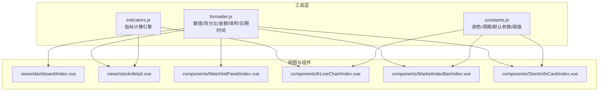
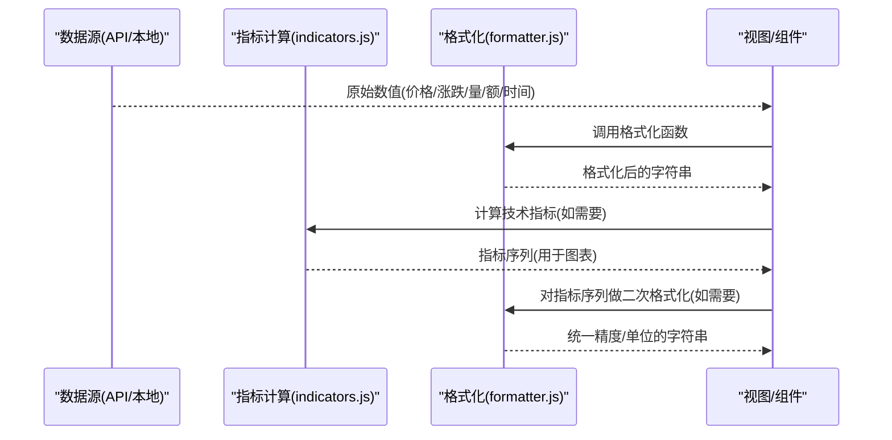
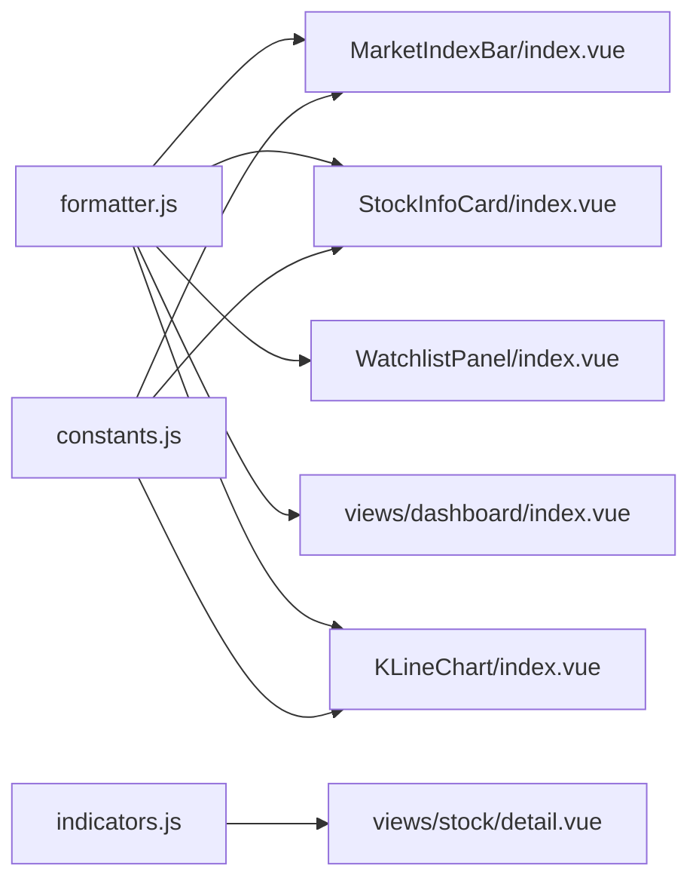

# 数据格式化

<cite>
**本文引用的文件**
- [formatter.js](file://src/utils/formatter.js)
- [constants.js](file://src/utils/constants.js)
- [indicators.js](file://src/utils/indicators.js)
- [KLineChart/index.vue](file://src/components/KLineChart/index.vue)
- [MarketIndexBar/index.vue](file://src/components/MarketIndexBar/index.vue)
- [StockInfoCard/index.vue](file://src/components/StockInfoCard/index.vue)
- [WatchlistPanel/index.vue](file://src/components/WatchlistPanel/index.vue)
- [dashboard/index.vue](file://src/views/dashboard/index.vue)
- [detail.vue](file://src/views/stock/detail.vue)
- [request.js](file://src/utils/request.js)
</cite>

## 目录
1. [简介](#简介)
2. [项目结构](#项目结构)
3. [核心组件](#核心组件)
4. [架构总览](#架构总览)
5. [详细组件分析](#详细组件分析)
6. [依赖关系分析](#依赖关系分析)
7. [性能考量](#性能考量)
8. [故障排查指南](#故障排查指南)
9. [结论](#结论)
10. [附录](#附录)

## 简介
本文件系统性梳理量化交易平台的数据格式化模块，聚焦于数值格式化、日期时间处理、百分比与金额转换、以及技术指标与K线数据在界面层的展示格式化。文档从设计目的、实现原理、参数与返回值、使用场景、扩展方法、错误与边界处理、到性能优化与故障排查，形成完整知识体系，帮助开发者与产品人员高效理解与维护。

## 项目结构
数据格式化能力主要由工具函数与多个UI组件协作完成：
- 工具层：数值/百分比/金额/体积/日期时间格式化，以及市场状态判断、代码规范化等辅助函数
- 指标层：技术指标计算（MA/MACD/KDJ/RSI/布林带/支撑压力位），为格式化提供数据源
- 视图与组件层：K线图、大盘指数、个股信息卡、自选股面板、仪表盘等组件消费格式化函数进行展示

图表来源
- [formatter.js:1-60](file://src/utils/formatter.js#L1-L60)
- [indicators.js:1-245](file://src/utils/indicators.js#L1-L245)
- [constants.js:1-68](file://src/utils/constants.js#L1-L68)
- [KLineChart/index.vue:1-285](file://src/components/KLineChart/index.vue#L1-L285)
- [MarketIndexBar/index.vue:1-87](file://src/components/MarketIndexBar/index.vue#L1-L87)
- [StockInfoCard/index.vue:1-150](file://src/components/StockInfoCard/index.vue#L1-L150)
- [WatchlistPanel/index.vue:1-143](file://src/components/WatchlistPanel/index.vue#L1-L143)
- [dashboard/index.vue:1-163](file://src/views/dashboard/index.vue#L1-L163)
- [detail.vue:1-295](file://src/views/stock/detail.vue#L1-L295)

章节来源
- [formatter.js:1-60](file://src/utils/formatter.js#L1-L60)
- [indicators.js:1-245](file://src/utils/indicators.js#L1-L245)
- [constants.js:1-68](file://src/utils/constants.js#L1-L68)
- [KLineChart/index.vue:1-285](file://src/components/KLineChart/index.vue#L1-L285)
- [MarketIndexBar/index.vue:1-87](file://src/components/MarketIndexBar/index.vue#L1-L87)
- [StockInfoCard/index.vue:1-150](file://src/components/StockInfoCard/index.vue#L1-L150)
- [WatchlistPanel/index.vue:1-143](file://src/components/WatchlistPanel/index.vue#L1-L143)
- [dashboard/index.vue:1-163](file://src/views/dashboard/index.vue#L1-L163)
- [detail.vue:1-295](file://src/views/stock/detail.vue#L1-L295)

## 核心组件
本模块的核心是位于工具层的格式化函数，它们统一了数值、百分比、金额、成交量、日期时间的展示风格，确保跨组件一致性与可读性。

- 数值格式化：统一保留两位小数，正数带“+”前缀
- 百分比格式化：统一保留两位小数并附加“%”，正数带“+”前缀
- 金额/成交量格式化：大数采用“亿/万”单位，保留相应小数位
- 日期时间格式化：支持自定义格式，默认输出标准时间戳
- 市场状态判断：根据星期与分钟级时间判断是否交易时段
- 代码规范化：去除前缀并补全市场前缀，便于统一展示与查询

章节来源
- [formatter.js:3-60](file://src/utils/formatter.js#L3-L60)

## 架构总览
格式化流程自下而上分为三层：
- 数据源层：来自API与本地存储的原始数值（价格、涨跌、成交量、成交额、日期时间）
- 指标计算层：对K线数据进行技术指标计算，生成用于展示的序列
- 展示层：各组件通过格式化函数将原始数据转为用户可读的字符串

图表来源
- [formatter.js:1-60](file://src/utils/formatter.js#L1-L60)
- [indicators.js:221-244](file://src/utils/indicators.js#L221-L244)
- [KLineChart/index.vue:219-229](file://src/components/KLineChart/index.vue#L219-L229)
- [dashboard/index.vue:48-58](file://src/views/dashboard/index.vue#L48-L58)
- [detail.vue:148-150](file://src/views/stock/detail.vue#L148-L150)

## 详细组件分析

### 数值格式化（价格、涨跌）
- 设计目的：统一数值显示精度，提升对比一致性；正数带“+”增强可读性
- 实现原理：将输入转为数字后固定小数位
- 参数与返回值
  - 参数：任意可转为数字的值
  - 返回：字符串（价格/涨跌）
- 使用场景
  - 个股信息卡的价格、开盘、最高、最低字段
  - 大盘指数涨跌与幅度
  - 自选股列表涨跌幅
- 边界与错误处理
  - 非法输入将被转换为NaN，需在上游保证数据有效性
  - 正负号策略：仅在非零时添加“+”
- 扩展建议
  - 支持千分位分隔符
  - 支持不同精度的动态配置

章节来源
- [formatter.js:3-17](file://src/utils/formatter.js#L3-L17)
- [StockInfoCard/index.vue:15-46](file://src/components/StockInfoCard/index.vue#L15-L46)
- [MarketIndexBar/index.vue:9-14](file://src/components/MarketIndexBar/index.vue#L9-L14)
- [WatchlistPanel/index.vue:21-27](file://src/components/WatchlistPanel/index.vue#L21-L27)

### 百分比格式化
- 设计目的：统一百分比显示，便于快速识别涨跌方向与幅度
- 实现原理：数值转数字后保留两位小数，附加“%”，正数加“+”
- 参数与返回值
  - 参数：任意可转为数字的值
  - 返回：形如“+xx.xx%”或“xx.xx%”的字符串
- 使用场景
  - 仪表盘表格涨跌幅列
  - 自选股面板涨跌幅列
  - 指标摘要中MACD/KDJ/RSI等相对值
- 边界与错误处理
  - 非法输入导致NaN时，最终结果为“NaN%”或类似异常字符串，需在上游校验
- 扩展建议
  - 支持区间高亮（如>0、<0、=0）
  - 支持符号与颜色联动

章节来源
- [formatter.js:7-11](file://src/utils/formatter.js#L7-L11)
- [dashboard/index.vue:48-58](file://src/views/dashboard/index.vue#L48-L58)
- [WatchlistPanel/index.vue:25-27](file://src/components/WatchlistPanel/index.vue#L25-L27)
- [detail.vue:78-105](file://src/views/stock/detail.vue#L78-L105)

### 金额格式化
- 设计目的：将大额成交额以“亿/万”为单位展示，兼顾精度与可读性
- 实现原理：按阈值分级，保留相应小数位
- 参数与返回值
  - 参数：任意可转为数字的值
  - 返回：形如“xxx.xx亿”、“xxx.xx万”或“xxx.xx”的字符串
- 使用场景
  - 仪表盘“成交额”列
  - 个股信息卡“成交额”字段
- 边界与错误处理
  - 输入为0或负数时按常规处理
- 扩展建议
  - 支持货币符号（如¥）
  - 支持不同语言环境的本地化

章节来源
- [formatter.js:26-31](file://src/utils/formatter.js#L26-L31)
- [dashboard/index.vue:55-58](file://src/views/dashboard/index.vue#L55-L58)
- [StockInfoCard/index.vue:44-46](file://src/components/StockInfoCard/index.vue#L44-L46)

### 成交量格式化
- 设计目的：将巨量数据以“亿/万”为单位展示，避免长串数字影响阅读
- 实现原理：与金额格式化一致，但保留整数或两位小数取决于阈值
- 参数与返回值
  - 参数：任意可转为数字的值
  - 返回：形如“xxx.xx亿”、“xxx.xx万”或“xxx”的字符串
- 使用场景
  - 个股信息卡“成交量”字段
- 边界与错误处理
  - 输入为0或负数时按常规处理
- 扩展建议
  - 支持单位切换（如“手”）
  - 支持动态精度

章节来源
- [formatter.js:19-24](file://src/utils/formatter.js#L19-L24)
- [StockInfoCard/index.vue:40-43](file://src/components/StockInfoCard/index.vue#L40-L43)

### 日期时间格式化
- 设计目的：统一时间展示格式，满足不同组件的时间显示需求
- 实现原理：基于dayjs进行格式化，默认输出标准时间戳
- 参数与返回值
  - 参数：日期对象或可解析为日期的值；可选格式字符串
  - 返回：字符串（日期或日期时间）
- 使用场景
  - K线图提示框中的日期显示
  - 日志与报表中的时间标注
- 边界与错误处理
  - 非法日期将产生无效结果，需在上游校验
- 扩展建议
  - 支持时区转换
  - 支持本地化格式

章节来源
- [formatter.js:33-39](file://src/utils/formatter.js#L33-L39)
- [KLineChart/index.vue:219-229](file://src/components/KLineChart/index.vue#L219-L229)

### 市场状态判断与代码规范化
- 市场状态判断：根据当前星期与分钟级时间判断是否为交易时段
- 代码规范化：去除已有前缀并补全市场前缀，便于统一展示与查询
- 使用场景
  - 交易时段提示
  - 股票代码标准化展示
- 边界与错误处理
  - 输入为空或非法时返回默认值
- 扩展建议
  - 支持节假日与夜盘时间配置
  - 支持多市场（沪/深/港/美）差异化逻辑

章节来源
- [formatter.js:41-59](file://src/utils/formatter.js#L41-L59)

### 技术指标数据格式化（二次格式化）
- 设计目的：将指标序列中的数值统一为两位小数，缺失值显示占位符
- 实现原理：对数组元素逐个处理，null保留为占位符，否则转为两位小数
- 参数与返回值
  - 参数：指标数组（如MACD/DIF/DEA、KDJ/K/D/J、RSI、布林带）
  - 返回：字符串数组（或占位符）
- 使用场景
  - 个股详情页“指标摘要”区域
- 边界与错误处理
  - 数组为空或元素为null时按占位符处理
- 扩展建议
  - 支持不同指标的专用精度策略
  - 支持批量格式化与缓存

章节来源
- [detail.vue:148-150](file://src/views/stock/detail.vue#L148-L150)

### K线数据格式化（图表提示）
- 设计目的：在K线图tooltip中统一展示OHLC与成交量
- 实现原理：从K线数据中提取当日开盘、最高、最低、收盘与成交量，统一格式化
- 参数与返回值
  - 参数：K线数据数组与当前索引
  - 返回：HTML片段（字符串）
- 使用场景
  - K线图鼠标悬停提示
- 边界与错误处理
  - 数据缺失时跳过或返回空
- 扩展建议
  - 支持更多指标联动显示
  - 支持模板化与多语言

章节来源
- [KLineChart/index.vue:219-229](file://src/components/KLineChart/index.vue#L219-L229)

## 依赖关系分析
- 组件对格式化函数的依赖
  - 大盘指数、个股信息卡、自选股面板、仪表盘表格均直接调用格式化函数
  - K线图通过formatter.js提供的日期时间格式化与组件内部OHLC格式化共同完成tooltip
- 指标计算与格式化的耦合
  - 指标计算引擎独立于格式化，但其结果在视图层被格式化函数二次处理
- 颜色与格式化的关系
  - 颜色常量用于配合涨跌状态的视觉呈现，与数值格式化协同工作

图表来源
- [formatter.js:1-60](file://src/utils/formatter.js#L1-L60)
- [indicators.js:221-244](file://src/utils/indicators.js#L221-L244)
- [constants.js:1-68](file://src/utils/constants.js#L1-L68)
- [MarketIndexBar/index.vue:1-87](file://src/components/MarketIndexBar/index.vue#L1-L87)
- [StockInfoCard/index.vue:1-150](file://src/components/StockInfoCard/index.vue#L1-L150)
- [WatchlistPanel/index.vue:1-143](file://src/components/WatchlistPanel/index.vue#L1-L143)
- [dashboard/index.vue:1-163](file://src/views/dashboard/index.vue#L1-L163)
- [KLineChart/index.vue:1-285](file://src/components/KLineChart/index.vue#L1-L285)
- [detail.vue:1-295](file://src/views/stock/detail.vue#L1-L295)

章节来源
- [formatter.js:1-60](file://src/utils/formatter.js#L1-L60)
- [indicators.js:221-244](file://src/utils/indicators.js#L221-L244)
- [constants.js:1-68](file://src/utils/constants.js#L1-L68)
- [MarketIndexBar/index.vue:1-87](file://src/components/MarketIndexBar/index.vue#L1-L87)
- [StockInfoCard/index.vue:1-150](file://src/components/StockInfoCard/index.vue#L1-L150)
- [WatchlistPanel/index.vue:1-143](file://src/components/WatchlistPanel/index.vue#L1-L143)
- [dashboard/index.vue:1-163](file://src/views/dashboard/index.vue#L1-L163)
- [KLineChart/index.vue:1-285](file://src/components/KLineChart/index.vue#L1-L285)
- [detail.vue:1-295](file://src/views/stock/detail.vue#L1-L295)

## 性能考量
- 函数复用与无副作用：格式化函数均为纯函数，便于在多个组件间共享，减少重复计算
- 批量处理：在表格与列表中，优先使用组件内部的模板绑定一次性格式化，避免额外中间变量
- 图表渲染：K线tooltip的格式化在交互时触发，应避免在高频更新时重复构造复杂HTML
- 指标格式化：对指标数组的二次格式化应避免在每次渲染时创建新数组，可在数据变更时缓存结果
- 本地化与国际化：若引入多语言，建议在格式化层集中处理，避免分散逻辑

## 故障排查指南
- 常见问题
  - 百分比/金额显示异常：检查上游数据是否为数字或字符串，必要时在调用前进行类型转换
  - K线tooltip缺失：确认传入的K线数据与索引有效，且组件内部格式化逻辑未被覆盖
  - 指标为空：确认指标计算已执行且结果非空，必要时在视图层增加占位符处理
- 错误处理建议
  - 在调用格式化函数前进行空值与类型检查
  - 对于可能的非法输入，提供默认值或占位符
  - 对于网络请求失败或数据拉取异常，结合请求拦截器统一提示

章节来源
- [request.js:17-29](file://src/utils/request.js#L17-L29)

## 结论
数据格式化模块通过统一的工具函数与组件协作，实现了价格、涨跌、百分比、金额、成交量与日期时间的一致化展示。结合技术指标计算与图表组件，形成了从数据到可视化的完整链路。未来可在本地化、单位切换、精度策略与缓存机制等方面进一步增强，以适配更复杂的业务场景与更高的性能要求。

## 附录

### 格式化函数一览与使用示例路径
- 数值格式化（价格/涨跌）
  - 示例路径：[StockInfoCard/index.vue:15-46](file://src/components/StockInfoCard/index.vue#L15-L46)、[MarketIndexBar/index.vue:9-14](file://src/components/MarketIndexBar/index.vue#L9-L14)
- 百分比格式化
  - 示例路径：[dashboard/index.vue:48-58](file://src/views/dashboard/index.vue#L48-L58)、[WatchlistPanel/index.vue:25-27](file://src/components/WatchlistPanel/index.vue#L25-L27)
- 金额格式化
  - 示例路径：[dashboard/index.vue:55-58](file://src/views/dashboard/index.vue#L55-L58)、[StockInfoCard/index.vue:44-46](file://src/components/StockInfoCard/index.vue#L44-L46)
- 成交量格式化
  - 示例路径：[StockInfoCard/index.vue:40-43](file://src/components/StockInfoCard/index.vue#L40-L43)
- 日期时间格式化
  - 示例路径：[KLineChart/index.vue:219-229](file://src/components/KLineChart/index.vue#L219-L229)
- 指标二次格式化
  - 示例路径：[detail.vue:148-150](file://src/views/stock/detail.vue#L148-L150)

### 扩展与最佳实践
- 新增格式化规则
  - 在工具层新增函数并导出，在需要的组件中按需引入
  - 保持函数纯度与幂等性，避免外部状态依赖
- 特殊数据类型处理
  - 对null/undefined/NaN进行显式处理，提供默认值或占位符
  - 对字符串数字进行显式转换，避免隐式转换带来的误差
- 性能优化
  - 在列表/表格中使用一次性格式化，避免重复计算
  - 对高频交互（如tooltip）的格式化逻辑进行节流或缓存
- 错误与边界
  - 在调用层增加输入校验与兜底逻辑
  - 对网络异常与数据异常进行统一提示与回退