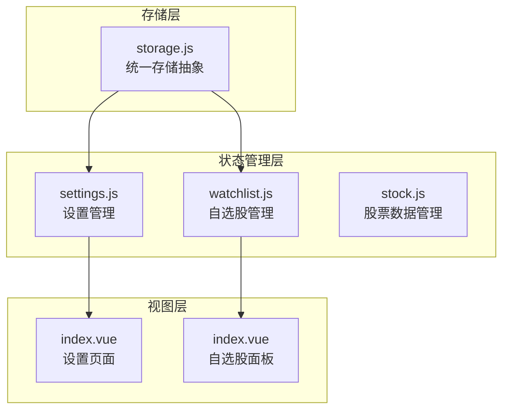
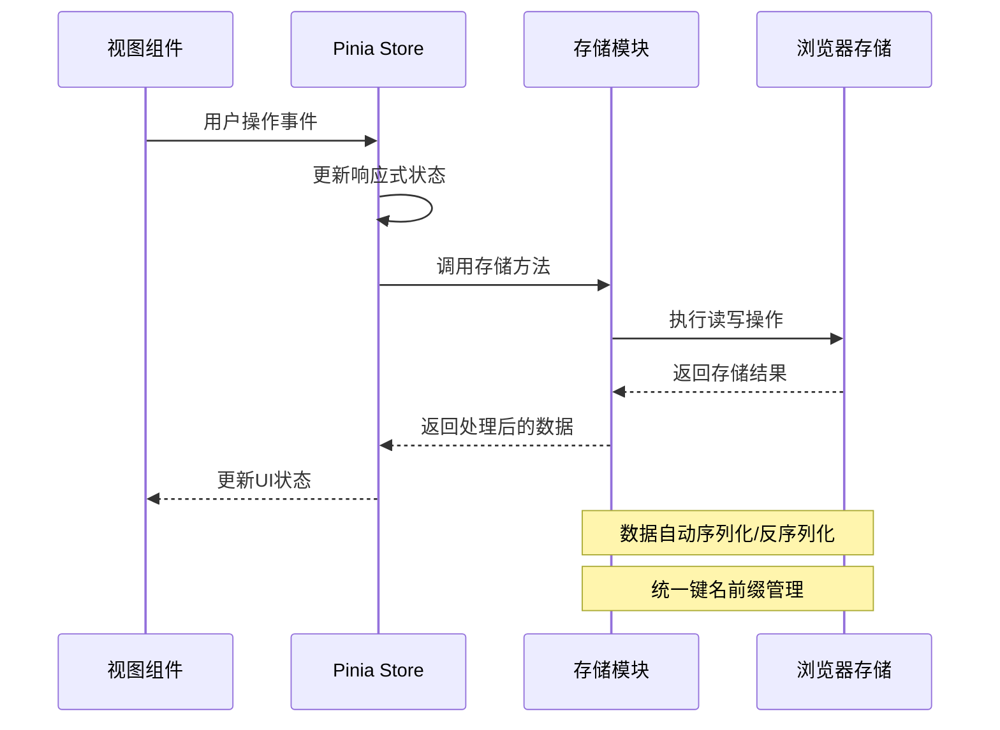
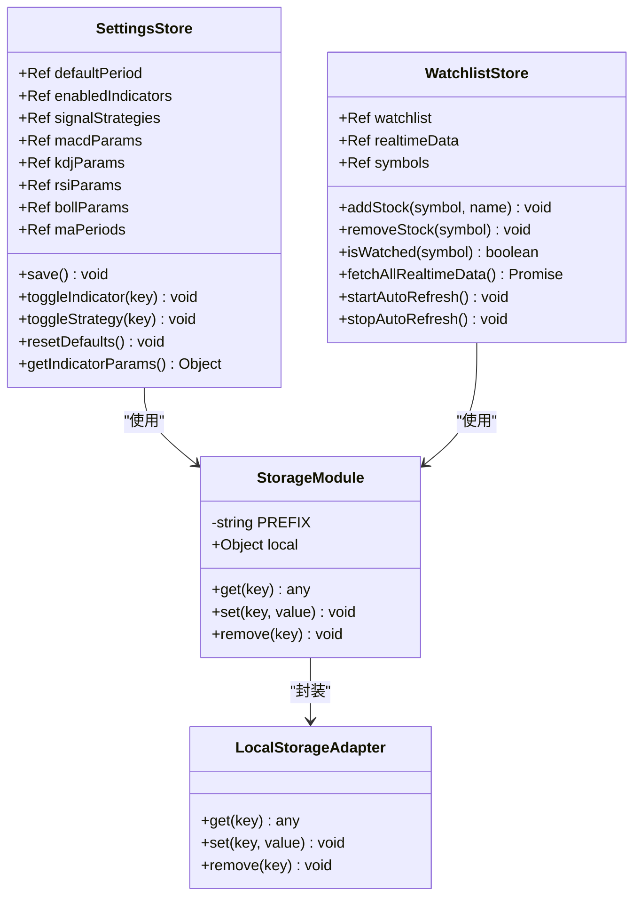
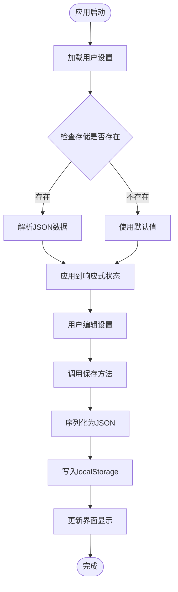
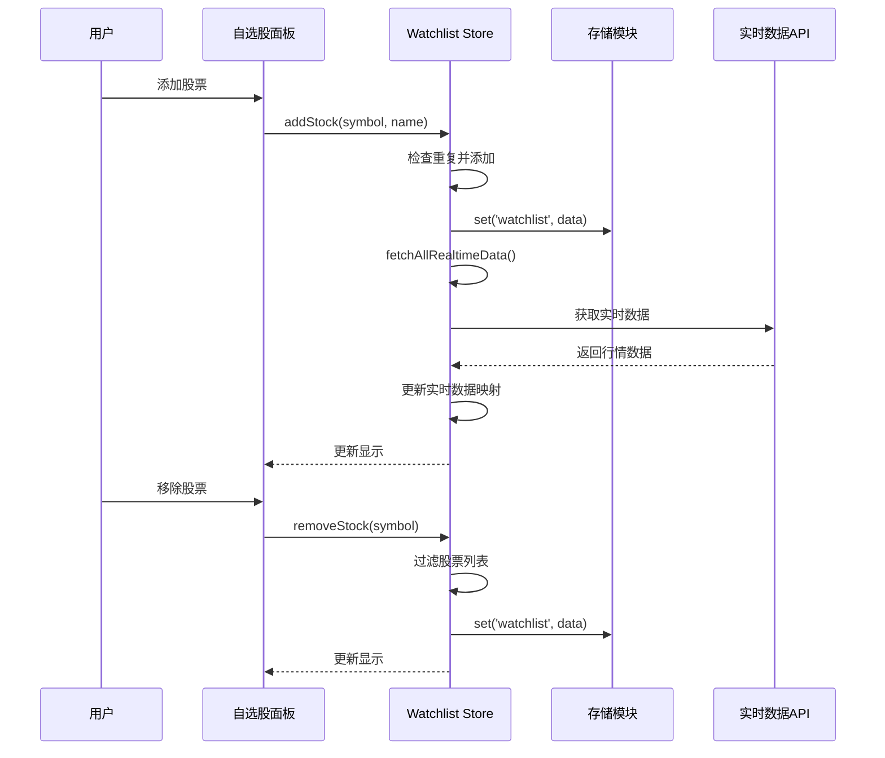
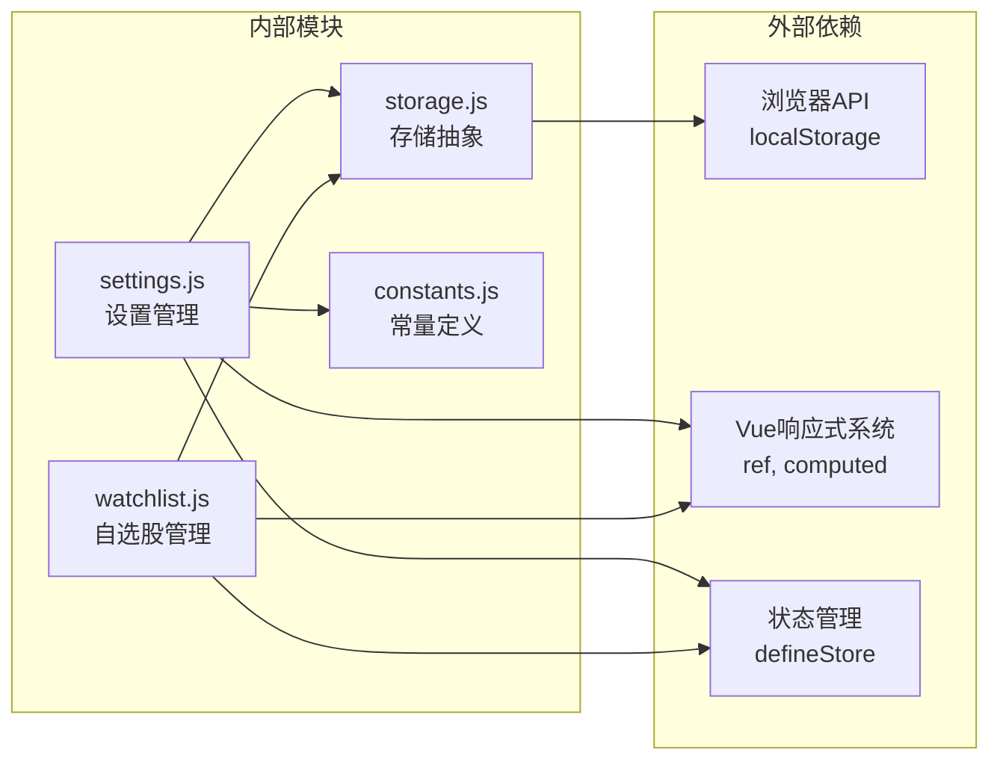

# 本地存储

<cite>
**本文档引用的文件**
- [storage.js](file://src/utils/storage.js)
- [settings.js](file://src/stores/settings.js)
- [watchlist.js](file://src/stores/watchlist.js)
- [index.vue](file://src/views/settings/index.vue)
- [index.vue](file://src/components/WatchlistPanel/index.vue)
- [stock.js](file://src/stores/stock.js)
- [constants.js](file://src/utils/constants.js)
- [main.js](file://src/main.js)
</cite>

## 目录
1. [简介](#简介)
2. [项目结构](#项目结构)
3. [核心组件](#核心组件)
4. [架构概览](#架构概览)
5. [详细组件分析](#详细组件分析)
6. [依赖关系分析](#依赖关系分析)
7. [性能考量](#性能考量)
8. [故障排除指南](#故障排除指南)
9. [结论](#结论)

## 简介

本文件详细阐述了量化交易平台的本地存储模块设计与实现。该模块采用localStorage作为主要持久化存储方案，通过统一的存储抽象层为应用各功能模块提供数据持久化能力。系统实现了键值对数据的序列化/反序列化、存储前缀管理、错误处理等核心功能，并在设置管理、自选股列表等关键业务场景中得到广泛应用。

## 项目结构

本地存储模块在项目中的组织结构如下：

**图表来源**
- [storage.js:1-21](file://src/utils/storage.js#L1-L21)
- [settings.js:1-70](file://src/stores/settings.js#L1-L70)
- [watchlist.js:1-53](file://src/stores/watchlist.js#L1-L53)

**章节来源**
- [storage.js:1-21](file://src/utils/storage.js#L1-L21)
- [settings.js:1-70](file://src/stores/settings.js#L1-L70)
- [watchlist.js:1-53](file://src/stores/watchlist.js#L1-L53)

## 核心组件

### 存储抽象层

存储模块的核心是一个统一的存储抽象对象，提供标准的CRUD操作接口：

- **get(key)**: 获取指定键的数据，自动进行JSON解析
- **set(key, value)**: 设置指定键的数据，自动进行JSON序列化
- **remove(key)**: 删除指定键的数据

所有存储键都带有统一的前缀标识，确保命名空间隔离。

**章节来源**
- [storage.js:3-20](file://src/utils/storage.js#L3-L20)

### 设置管理模块

设置管理模块负责用户偏好的持久化存储，包括：
- 默认K线周期
- 启用的指标类型
- 信号策略配置
- 各种技术指标的参数设置

每个设置项都对应一个独立的存储键，支持实时保存和批量重置功能。

**章节来源**
- [settings.js:6-69](file://src/stores/settings.js#L6-L69)

### 自选股管理模块

自选股模块提供股票池的持久化管理：
- 股票添加/移除
- 实时行情缓存
- 自动刷新机制

所有自选股数据以数组形式存储，支持快速查询和去重。

**章节来源**
- [watchlist.js:6-52](file://src/stores/watchlist.js#L6-L52)

## 架构概览

本地存储模块采用分层架构设计，确保了良好的可维护性和扩展性：

**图表来源**
- [storage.js:3-20](file://src/utils/storage.js#L3-L20)
- [settings.js:17-26](file://src/stores/settings.js#L17-L26)
- [watchlist.js:13-23](file://src/stores/watchlist.js#L13-L23)

## 详细组件分析

### 存储模块类图

**图表来源**
- [storage.js:1-21](file://src/utils/storage.js#L1-L21)
- [settings.js:6-69](file://src/stores/settings.js#L6-L69)
- [watchlist.js:6-52](file://src/stores/watchlist.js#L6-L52)

### 设置管理流程

设置管理模块实现了完整的数据持久化流程：

**图表来源**
- [settings.js:7-26](file://src/stores/settings.js#L7-L26)
- [settings.js:17-26](file://src/stores/settings.js#L17-L26)

**章节来源**
- [settings.js:7-26](file://src/stores/settings.js#L7-L26)
- [settings.js:17-26](file://src/stores/settings.js#L17-L26)

### 自选股管理流程

自选股模块提供了完整的股票池管理功能：

**图表来源**
- [watchlist.js:13-23](file://src/stores/watchlist.js#L13-L23)
- [watchlist.js:29-35](file://src/stores/watchlist.js#L29-L35)

**章节来源**
- [watchlist.js:13-23](file://src/stores/watchlist.js#L13-L23)
- [watchlist.js:29-35](file://src/stores/watchlist.js#L29-L35)

## 依赖关系分析

本地存储模块的依赖关系清晰明确，遵循单一职责原则：

**图表来源**
- [storage.js:1-21](file://src/utils/storage.js#L1-L21)
- [settings.js:1-4](file://src/stores/settings.js#L1-L4)
- [watchlist.js:1-4](file://src/stores/watchlist.js#L1-L4)

**章节来源**
- [storage.js:1-21](file://src/utils/storage.js#L1-L21)
- [settings.js:1-4](file://src/stores/settings.js#L1-L4)
- [watchlist.js:1-4](file://src/stores/watchlist.js#L1-L4)

## 性能考量

### 存储性能优化

1. **批量操作**: 设置模块提供批量保存功能，减少多次存储操作
2. **延迟加载**: 应用启动时只加载必要的设置，其他设置按需加载
3. **内存管理**: 及时清理定时器，避免内存泄漏
4. **序列化优化**: 使用高效的JSON序列化，避免循环引用

### 缓存策略

- **实时数据缓存**: 自选股模块缓存实时行情数据，减少API调用频率
- **计算结果缓存**: 技术指标和信号计算结果在数据未变化时不重复计算
- **自动刷新控制**: 提供手动刷新和自动刷新两种模式，平衡数据新鲜度和性能

**章节来源**
- [settings.js:17-26](file://src/stores/settings.js#L17-L26)
- [watchlist.js:37-45](file://src/stores/watchlist.js#L37-L45)

## 故障排除指南

### 常见问题及解决方案

#### 存储权限问题
- **症状**: 设置无法保存或页面刷新后丢失
- **原因**: 浏览器禁用了localStorage或存储空间不足
- **解决**: 检查浏览器隐私设置，清理过期数据

#### 数据格式错误
- **症状**: 应用启动时报错或显示异常
- **原因**: 存储的数据格式不符合预期
- **解决**: 清空相关存储键，重新初始化数据

#### 异步操作冲突
- **症状**: 数据更新不同步或出现竞态条件
- **原因**: 多个地方同时修改同一存储键
- **解决**: 使用集中式的存储操作，避免并发修改

### 调试技巧

1. **浏览器开发者工具**: 在Application标签页查看localStorage内容
2. **控制台监控**: 监听存储相关的错误信息
3. **日志记录**: 在关键存储操作处添加日志输出
4. **数据验证**: 在读取存储数据时进行格式验证

**章节来源**
- [storage.js:5-11](file://src/utils/storage.js#L5-L11)

## 结论

量化交易平台的本地存储模块通过简洁而强大的设计，为应用提供了可靠的持久化能力。模块采用统一的存储抽象，确保了数据访问的一致性和安全性。通过合理的错误处理机制和性能优化策略，系统能够在保证用户体验的同时维持良好的运行效率。

未来可以考虑的改进方向包括：
- 增加存储容量监控和清理机制
- 实现存储数据的版本管理和迁移
- 考虑引入IndexedDB以支持更大规模的数据存储
- 增强数据加密和安全防护措施