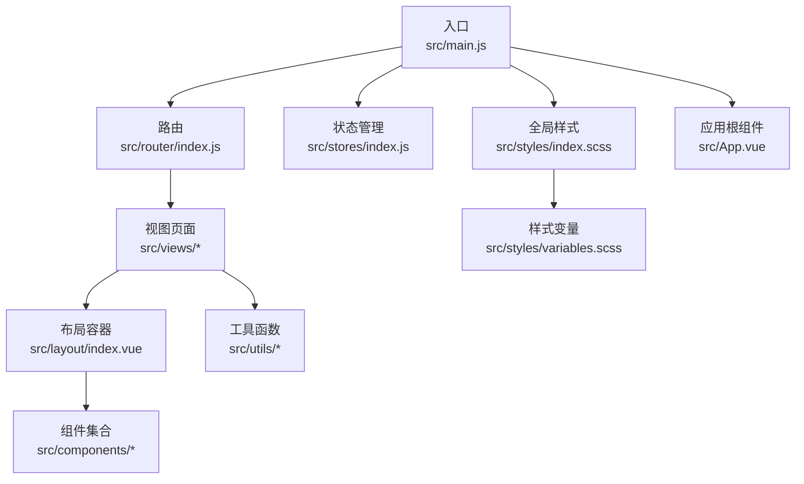
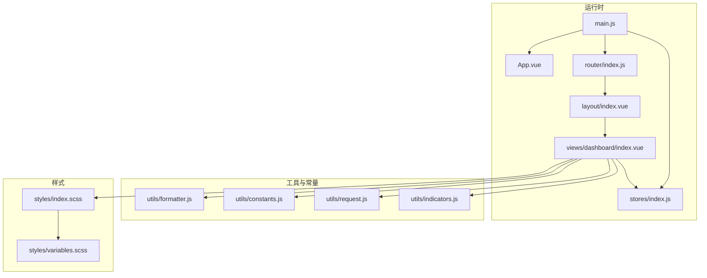
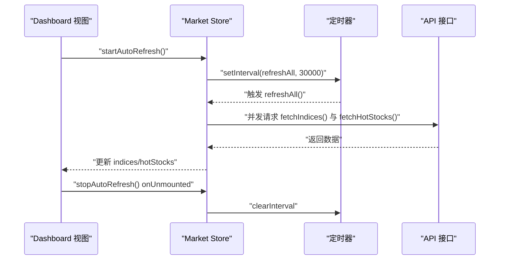
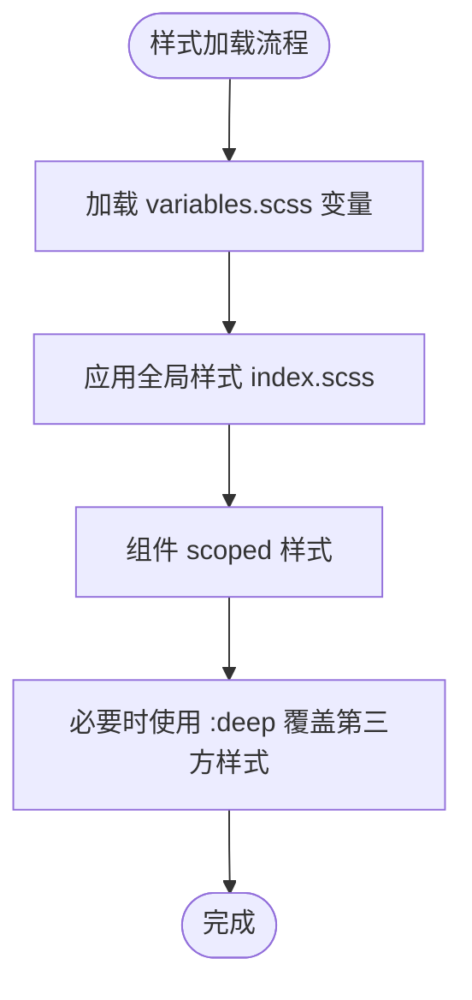
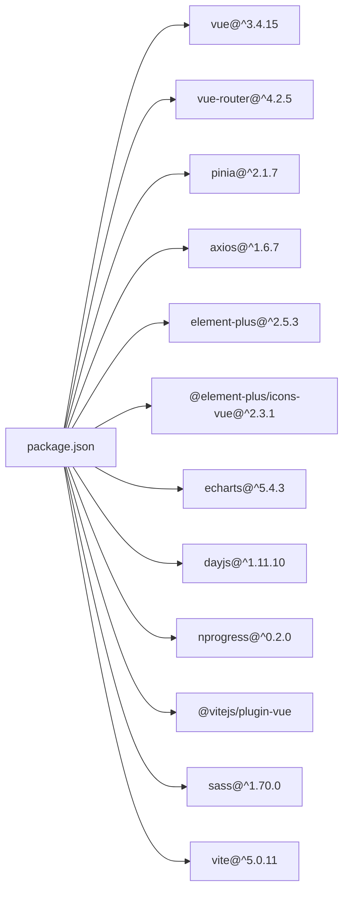

# 代码规范与最佳实践

<cite>
**本文引用的文件**
- [package.json](file://package.json)
- [vite.config.js](file://vite.config.js)
- [src/main.js](file://src/main.js)
- [src/App.vue](file://src/App.vue)
- [src/router/index.js](file://src/router/index.js)
- [src/stores/index.js](file://src/stores/index.js)
- [src/stores/market.js](file://src/stores/market.js)
- [src/styles/index.scss](file://src/styles/index.scss)
- [src/styles/variables.scss](file://src/styles/variables.scss)
- [src/components/index.js](file://src/components/index.js)
- [src/layout/index.vue](file://src/layout/index.vue)
- [src/views/dashboard/index.vue](file://src/views/dashboard/index.vue)
- [src/utils/constants.js](file://src/utils/constants.js)
- [src/utils/formatter.js](file://src/utils/formatter.js)
- [src/utils/indicators.js](file://src/utils/indicators.js)
- [src/utils/request.js](file://src/utils/request.js)
</cite>

## 目录
1. [引言](#引言)
2. [项目结构](#项目结构)
3. [核心组件](#核心组件)
4. [架构总览](#架构总览)
5. [详细组件分析](#详细组件分析)
6. [依赖分析](#依赖分析)
7. [性能考虑](#性能考虑)
8. [故障排查指南](#故障排查指南)
9. [结论](#结论)
10. [附录](#附录)

## 引言
本指南面向量化交易平台的前端工程，围绕 JavaScript/ES6+ 编码规范、Vue 3 组件开发规范（Composition API）、SCSS 样式编写规范、文件组织与命名约定、代码质量工具配置以及性能优化实践，结合仓库现有实现进行系统性梳理与最佳实践建议。目标是帮助团队统一风格、提升可维护性与可扩展性。

## 项目结构
项目采用基于功能域的目录划分，结合 Vue 3 + Vite 的现代前端工程化实践：
- 入口与框架装配：main.js、App.vue、router、stores
- 视图层：views 下按页面组织
- 组件层：components 下按业务功能拆分
- 布局层：layout 提供全局布局与导航
- 工具与常量：utils、constants
- 样式：styles（变量与全局样式）
- 构建与代理：vite.config.js、package.json

图表来源
- [src/main.js:1-17](file://src/main.js#L1-L17)
- [src/router/index.js:1-58](file://src/router/index.js#L1-L58)
- [src/stores/index.js:1-11](file://src/stores/index.js#L1-L11)
- [src/styles/index.scss:1-64](file://src/styles/index.scss#L1-L64)
- [src/layout/index.vue:1-61](file://src/layout/index.vue#L1-L61)
- [src/App.vue:1-13](file://src/App.vue#L1-L13)

章节来源
- [package.json:1-28](file://package.json#L1-L28)
- [vite.config.js:1-63](file://vite.config.js#L1-L63)
- [src/main.js:1-17](file://src/main.js#L1-L17)
- [src/App.vue:1-13](file://src/App.vue#L1-L13)

## 核心组件
- 应用入口与插件注册：在入口中集中注册 Pinia、Router、Element Plus，并引入全局样式。
- 路由与进度条：使用 NProgress 实现页面切换进度提示；路由元信息用于标题与菜单展示。
- 状态管理：Pinia Store 使用组合式写法，集中管理市场与自选股等数据。
- 布局与视图：Layout 提供侧边栏与主内容区，Dashboard 页面组织大盘、热门股与自选股面板。
- 工具与常量：formatter 提供格式化方法；constants 定义颜色、周期、默认指标参数等；indicators 提供技术指标计算引擎；request 封装 axios 并统一错误处理。

章节来源
- [src/main.js:1-17](file://src/main.js#L1-L17)
- [src/router/index.js:1-58](file://src/router/index.js#L1-L58)
- [src/stores/index.js:1-11](file://src/stores/index.js#L1-L11)
- [src/stores/market.js:1-41](file://src/stores/market.js#L1-L41)
- [src/layout/index.vue:1-61](file://src/layout/index.vue#L1-L61)
- [src/views/dashboard/index.vue:1-163](file://src/views/dashboard/index.vue#L1-L163)
- [src/utils/formatter.js:1-60](file://src/utils/formatter.js#L1-L60)
- [src/utils/constants.js:1-68](file://src/utils/constants.js#L1-L68)
- [src/utils/indicators.js:1-245](file://src/utils/indicators.js#L1-L245)
- [src/utils/request.js:1-29](file://src/utils/request.js#L1-L29)

## 架构总览
下图展示了从入口到视图、组件、工具与状态管理的整体交互关系。

图表来源
- [src/main.js:1-17](file://src/main.js#L1-L17)
- [src/App.vue:1-13](file://src/App.vue#L1-L13)
- [src/router/index.js:1-58](file://src/router/index.js#L1-L58)
- [src/stores/index.js:1-11](file://src/stores/index.js#L1-L11)
- [src/layout/index.vue:1-61](file://src/layout/index.vue#L1-L61)
- [src/views/dashboard/index.vue:1-163](file://src/views/dashboard/index.vue#L1-L163)
- [src/utils/formatter.js:1-60](file://src/utils/formatter.js#L1-L60)
- [src/utils/constants.js:1-68](file://src/utils/constants.js#L1-L68)
- [src/utils/request.js:1-29](file://src/utils/request.js#L1-L29)
- [src/utils/indicators.js:1-245](file://src/utils/indicators.js#L1-L245)
- [src/styles/index.scss:1-64](file://src/styles/index.scss#L1-L64)
- [src/styles/variables.scss:1-24](file://src/styles/variables.scss#L1-L24)

## 详细组件分析

### JavaScript/ES6+ 编码规范
- 变量与常量
  - 使用 const/let 声明变量，优先使用 const；仅在需要重新赋值时使用 let。
  - 常量集中于 constants.js，导出对象与枚举，便于复用与维护。
- 函数定义
  - 优先使用箭头函数表达式以获得词法作用域的 this；对于需要 this 的场景使用普通函数。
  - 工具函数独立模块化，职责单一，便于测试与复用。
- 模块导入导出
  - 使用 ES Module 导入导出语法；组件通过 components/index.js 统一聚合导出，便于按需引入。
  - 路由懒加载使用动态 import，减少首屏体积。
- 错误处理
  - 在 request.js 中对 axios 拦截器进行统一错误处理，结合 Element Plus 的消息提示，保证用户反馈一致。
- 性能注意
  - 避免在模板中直接调用复杂计算逻辑；将计算结果缓存至响应式数据或计算属性中。
  - 对高频更新的数据使用节流/防抖策略（例如定时刷新）。

章节来源
- [src/utils/constants.js:1-68](file://src/utils/constants.js#L1-L68)
- [src/utils/formatter.js:1-60](file://src/utils/formatter.js#L1-L60)
- [src/utils/request.js:1-29](file://src/utils/request.js#L1-L29)
- [src/components/index.js:1-22](file://src/components/index.js#L1-L22)
- [src/router/index.js:17-17](file://src/router/index.js#L17-L17)

### Vue 3 组件开发规范（Composition API）
- 组合式 API 使用
  - 在 script setup 中声明响应式数据与生命周期钩子；在 Dashboard 页面中演示了 onMounted/onUnmounted 的典型用法。
  - 使用 ref/defineStore 管理本地与全局状态，保持组件职责清晰。
- 响应式数据管理
  - Store 使用组合式写法，返回公开的方法与状态，便于在多个组件间共享与复用。
  - 在 Store 中使用定时器进行自动刷新，退出时及时清理，避免内存泄漏。
- 组件通信模式
  - 父子通信：通过 props 传递数据，通过事件向父级回调。
  - 兄弟/跨层级通信：通过 Pinia Store 共享状态；在布局组件中通过事件总线（如 toggle-sidebar）进行轻量交互。
- 模板与样式
  - 使用 scoped 样式隔离组件样式；在布局与视图中合理使用 :deep 选择器覆盖第三方组件样式。
  - 利用 Element Plus 的 Card/Table/Icon 等组件提升交互一致性。

图表来源
- [src/views/dashboard/index.vue:101-109](file://src/views/dashboard/index.vue#L101-L109)
- [src/stores/market.js:25-33](file://src/stores/market.js#L25-L33)
- [src/stores/market.js:19-23](file://src/stores/market.js#L19-L23)

章节来源
- [src/views/dashboard/index.vue:1-163](file://src/views/dashboard/index.vue#L1-L163)
- [src/stores/market.js:1-41](file://src/stores/market.js#L1-L41)
- [src/layout/index.vue:1-61](file://src/layout/index.vue#L1-L61)

### SCSS 样式编写规范
- 命名规范
  - 使用语义化类名，如 price-up/price-down 表示涨跌颜色；stat-card 表示通用卡片样式。
- 层级结构
  - 全局样式集中于 index.scss，按功能模块（滚动条、Element Plus 覆盖、颜色体系）分段组织。
  - 变量集中于 variables.scss，统一字体、颜色、尺寸等设计令牌。
- 变量使用
  - 通过 Vite 的 additionalData 配置在所有 SCSS 文件中自动可用，避免重复导入。
- 组件样式
  - 组件内使用 scoped 样式，必要时使用 :deep 选择器覆盖第三方组件样式；过渡动画使用 scoped 样式限定作用域。

图表来源
- [vite.config.js:55-61](file://vite.config.js#L55-L61)
- [src/styles/index.scss:1-64](file://src/styles/index.scss#L1-L64)
- [src/styles/variables.scss:1-24](file://src/styles/variables.scss#L1-L24)

章节来源
- [vite.config.js:55-61](file://vite.config.js#L55-L61)
- [src/styles/index.scss:1-64](file://src/styles/index.scss#L1-L64)
- [src/styles/variables.scss:1-24](file://src/styles/variables.scss#L1-L24)

### 文件组织与命名约定
- 组件命名
  - 组件文件夹采用 PascalCase（如 KLineChart），index.vue 作为入口。
  - components/index.js 聚合导出，便于统一引入。
- 视图与布局
  - views 下按页面组织，如 dashboard、stock/detail、backtest、settings。
  - layout 提供全局布局与导航组件，统一页面骨架。
- 导入路径
  - 通过 Vite alias @ 指向 src，简化导入路径，提升可读性与可维护性。
- API 与工具
  - api 下按领域拆分接口模块；utils 下按功能拆分工具模块，保持单一职责。

章节来源
- [src/components/index.js:1-22](file://src/components/index.js#L1-L22)
- [src/layout/index.vue:1-61](file://src/layout/index.vue#L1-L61)
- [src/views/dashboard/index.vue:1-163](file://src/views/dashboard/index.vue#L1-L163)
- [vite.config.js:7-11](file://vite.config.js#L7-L11)

### 代码质量工具配置（建议）
以下为推荐的工具配置清单，帮助团队建立一致的代码风格与质量保障：
- ESLint
  - 规则集：@rushstack/eslint-patch/linters/clean-publish
  - 插件：eslint-plugin-vue、@typescript-eslint/eslint-plugin（如启用 TS）
  - 规则建议：禁用 var；强制使用单引号或模板字符串；禁止未使用的变量；限制函数复杂度；要求必要的注释。
- Prettier
  - 半宽空格缩进；尾逗号仅多行；单引号；无分号；行末换行。
- Git 钩子
  - 使用 Husky + lint-staged，在提交前自动格式化与静态检查，确保主分支整洁。
- Vite 集成
  - 在 Vite 中通过插件与别名配置，统一路径解析与样式预处理。

（本节为通用配置建议，不直接分析具体文件）

## 依赖分析
- 外部依赖
  - Vue 3、Vue Router、Pinia、Axios、Element Plus、ECharts、Day.js、NProgress。
- 开发依赖
  - @vitejs/plugin-vue、sass、vite。
- 代理与别名
  - Vite 代理配置支持 sina-api、sina-hq、qq-api、em-api、em-search 等后端接口；alias @ 指向 src。

图表来源
- [package.json:11-26](file://package.json#L11-L26)

章节来源
- [package.json:1-28](file://package.json#L1-L28)
- [vite.config.js:1-63](file://vite.config.js#L1-L63)

## 性能考虑
- 渲染性能
  - 使用 Composition API 的响应式数据，避免在模板中执行重型计算；将计算结果缓存至响应式状态。
  - 合理使用 v-if/v-show 与 keep-alive，减少不必要的组件重建。
- 网络与数据
  - request.js 中统一超时与错误处理，避免异常风暴；对高频刷新使用定时器并在组件卸载时清理。
  - API 调用采用并发 Promise.all，缩短等待时间。
- 图表与可视化
  - ECharts 组件按需初始化与销毁，避免重复渲染；在 Store 中集中管理数据源，减少重复计算。
- 样式与资源
  - 通过 Vite alias 与 SCSS 变量减少重复导入；全局样式按需引入，避免阻塞首屏。
- 代码分割
  - 路由懒加载与组件按需引入，降低首屏包体。

章节来源
- [src/utils/request.js:1-29](file://src/utils/request.js#L1-L29)
- [src/stores/market.js:25-33](file://src/stores/market.js#L25-L33)
- [src/views/dashboard/index.vue:101-109](file://src/views/dashboard/index.vue#L101-L109)

## 故障排查指南
- 路由与标题
  - 若页面标题未更新或进度条异常，检查 router.beforeEach/afterEach 的实现与 meta.title 的设置。
- 样式冲突
  - 若第三方组件样式被覆盖异常，检查 scoped 与 :deep 的使用是否正确；确认 variables.scss 是否正确注入。
- 数据未刷新
  - 若市场数据未自动刷新，检查 Store 中定时器是否在 onMounted 启动、onUnmounted 是否清理。
- 网络请求失败
  - 若出现网络错误或超时提示，检查 request.js 的拦截器与错误消息提示逻辑；确认代理配置是否正确。

章节来源
- [src/router/index.js:47-55](file://src/router/index.js#L47-L55)
- [src/stores/market.js:31-33](file://src/stores/market.js#L31-L33)
- [src/utils/request.js:17-28](file://src/utils/request.js#L17-L28)
- [vite.config.js:15-52](file://vite.config.js#L15-L52)

## 结论
本指南基于现有代码库总结了从入口装配、路由与状态管理、组件开发、样式体系到性能优化的完整规范建议。建议团队在开发过程中遵循统一的命名、导入与模块化策略，配合 ESLint/Prettier/Husky 等工具形成闭环的质量保障体系，持续提升代码一致性与可维护性。

## 附录
- 示例与反例对比（文字描述）
  - 反例：在模板中直接调用复杂计算函数，导致每次渲染都重复计算。
  - 正例：将计算结果缓存至响应式状态或计算属性，减少重复开销。
  - 反例：在组件中直接创建定时器但未在卸载时清理，造成内存泄漏。
  - 正例：在 onMounted 启动定时器，在 onUnmounted 清理，确保生命周期一致。
  - 反例：在组件中直接引入大量第三方样式，导致全局污染。
  - 正例：使用 scoped 样式与 :deep 选择器，按需覆盖第三方样式，避免全局影响。