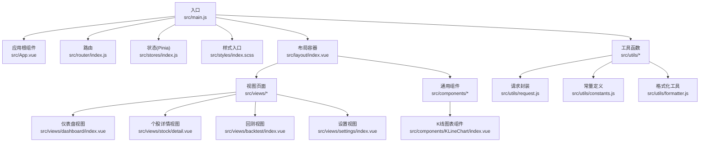
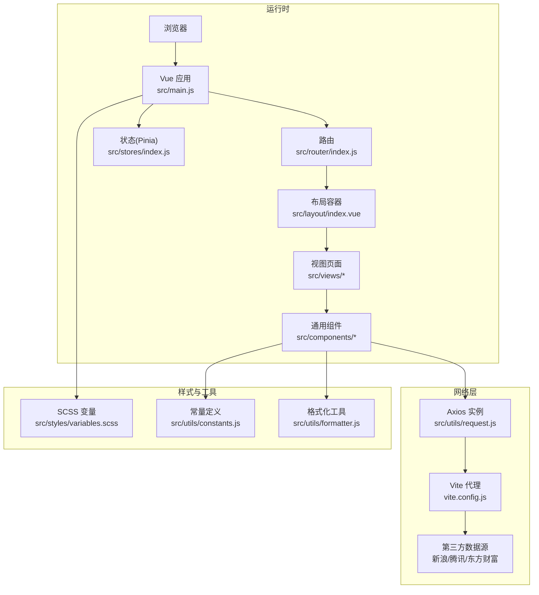
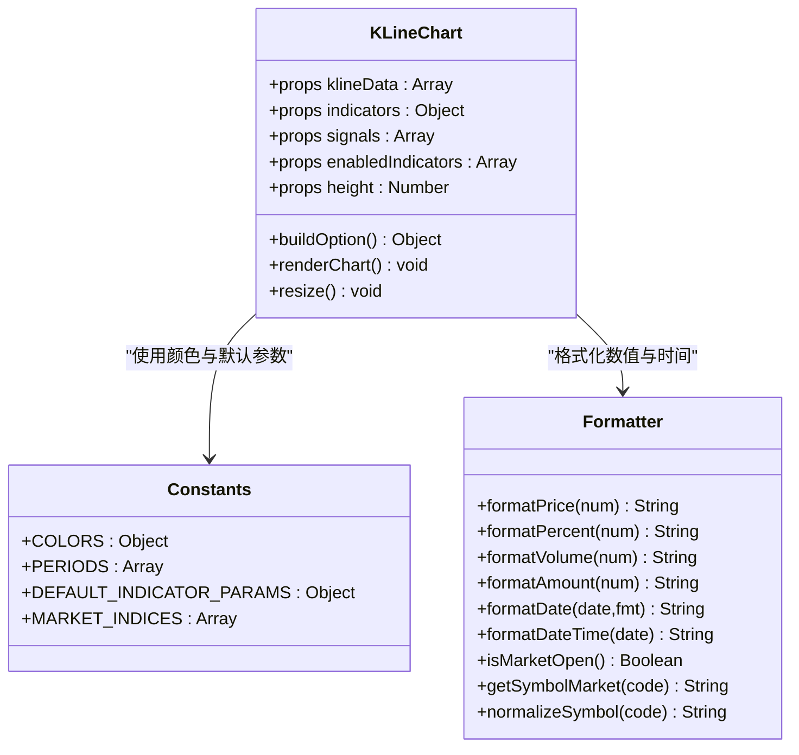
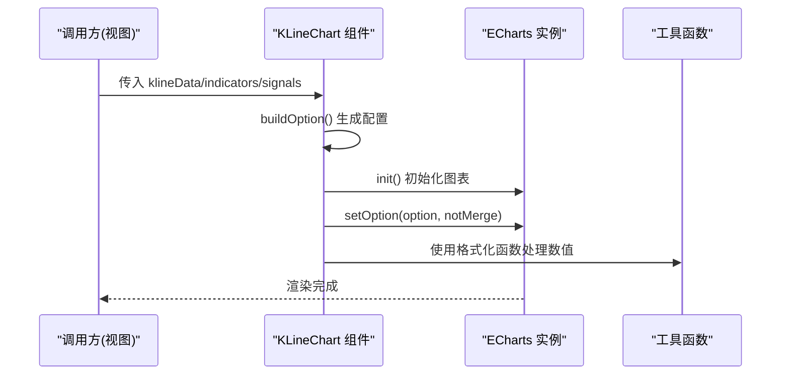
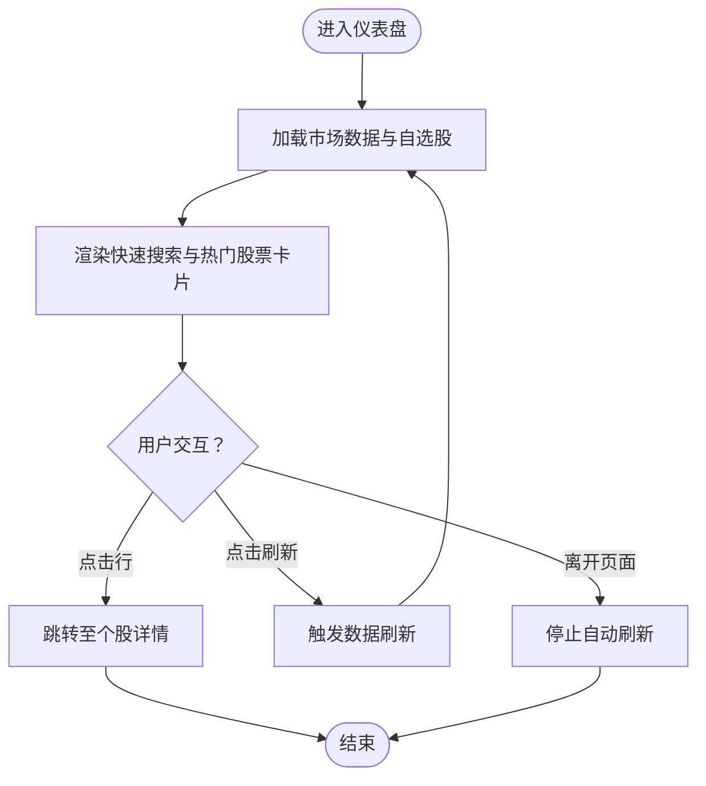
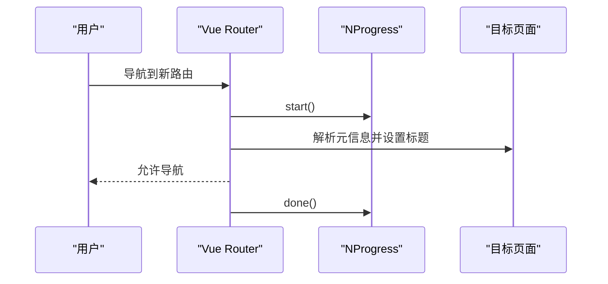
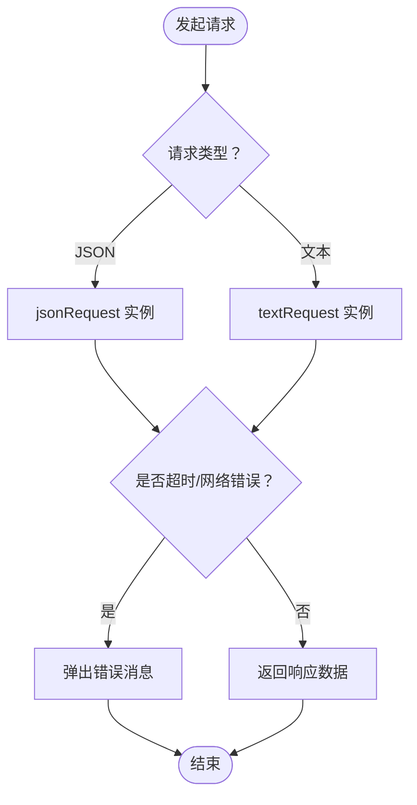
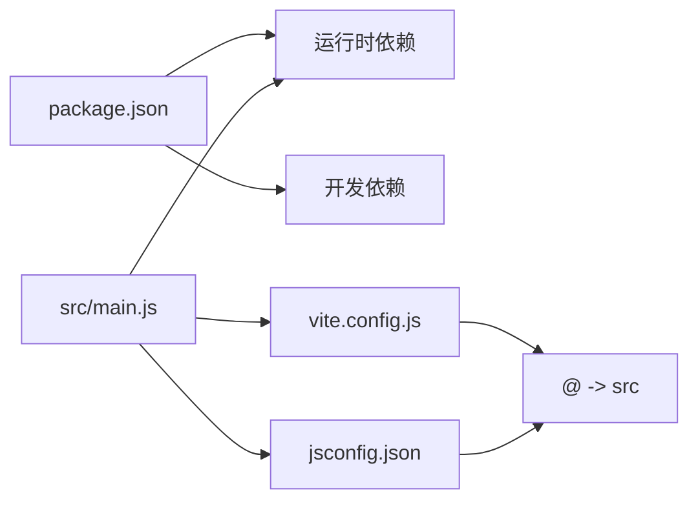

# 开发指南

<cite>
**本文引用的文件**
- [package.json](file://package.json)
- [vite.config.js](file://vite.config.js)
- [jsconfig.json](file://jsconfig.json)
- [src/main.js](file://src/main.js)
- [src/App.vue](file://src/App.vue)
- [src/router/index.js](file://src/router/index.js)
- [src/stores/index.js](file://src/stores/index.js)
- [src/utils/request.js](file://src/utils/request.js)
- [src/styles/variables.scss](file://src/styles/variables.scss)
- [src/layout/index.vue](file://src/layout/index.vue)
- [src/views/dashboard/index.vue](file://src/views/dashboard/index.vue)
- [src/components/KLineChart/index.vue](file://src/components/KLineChart/index.vue)
- [src/utils/constants.js](file://src/utils/constants.js)
- [src/utils/formatter.js](file://src/utils/formatter.js)
</cite>

## 目录
1. [简介](#简介)
2. [项目结构](#项目结构)
3. [核心组件](#核心组件)
4. [架构总览](#架构总览)
5. [详细组件分析](#详细组件分析)
6. [依赖分析](#依赖分析)
7. [性能考虑](#性能考虑)
8. [故障排查指南](#故障排查指南)
9. [结论](#结论)
10. [附录](#附录)

## 简介
本指南面向量化交易平台的开发者，提供从开发环境搭建到构建、调试、性能优化与持续交付的全流程说明。项目采用 Vue 3 + Vite 技术栈，结合 Pinia 状态管理、Element Plus UI 框架、ECharts 图表库以及 Axios 网络请求封装，覆盖行情数据、K线图表、技术指标、信号标注与回测分析等模块。

## 项目结构
项目采用基于功能的目录组织方式，核心入口与路由、状态、样式、工具函数、视图与组件分布清晰，便于扩展与维护。

**图表来源**
- [src/main.js:1-17](file://src/main.js#L1-L17)
- [src/App.vue:1-13](file://src/App.vue#L1-L13)
- [src/router/index.js:1-58](file://src/router/index.js#L1-L58)
- [src/stores/index.js:1-11](file://src/stores/index.js#L1-L11)
- [src/layout/index.vue:1-61](file://src/layout/index.vue#L1-L61)
- [src/views/dashboard/index.vue:1-163](file://src/views/dashboard/index.vue#L1-L163)
- [src/components/KLineChart/index.vue:1-285](file://src/components/KLineChart/index.vue#L1-L285)
- [src/utils/request.js:1-29](file://src/utils/request.js#L1-L29)
- [src/utils/constants.js:1-68](file://src/utils/constants.js#L1-L68)
- [src/utils/formatter.js:1-60](file://src/utils/formatter.js#L1-L60)

**章节来源**
- [src/main.js:1-17](file://src/main.js#L1-L17)
- [src/App.vue:1-13](file://src/App.vue#L1-L13)
- [src/router/index.js:1-58](file://src/router/index.js#L1-L58)
- [src/stores/index.js:1-11](file://src/stores/index.js#L1-L11)
- [src/layout/index.vue:1-61](file://src/layout/index.vue#L1-L61)
- [src/views/dashboard/index.vue:1-163](file://src/views/dashboard/index.vue#L1-L163)
- [src/components/KLineChart/index.vue:1-285](file://src/components/KLineChart/index.vue#L1-L285)
- [src/utils/request.js:1-29](file://src/utils/request.js#L1-L29)
- [src/utils/constants.js:1-68](file://src/utils/constants.js#L1-L68)
- [src/utils/formatter.js:1-60](file://src/utils/formatter.js#L1-L60)

## 核心组件
- 应用入口与依赖注入：在入口文件中注册 Pinia、Vue Router、Element Plus 并挂载应用。
- 路由与进度条：使用 NProgress 在路由切换时显示加载进度，并动态设置页面标题。
- 状态管理：通过 Pinia 创建全局状态仓库，导出各业务 Store。
- 请求封装：基于 Axios 提供 JSON 与文本两类请求实例，统一处理错误提示。
- 样式体系：SCSS 变量集中管理主题色、尺寸与字体，支持全局导入。
- 布局容器：提供可折叠侧边栏与顶部导航，配合过渡动画渲染视图。
- 视图页面：仪表盘聚合市场指数、热门股票、自选股面板；支持个股详情、回测与设置。
- K线图表：基于 ECharts 实现蜡烛图、成交量、多技术指标叠加与信号标注，支持响应式缩放与数据更新。

**章节来源**
- [src/main.js:1-17](file://src/main.js#L1-L17)
- [src/router/index.js:1-58](file://src/router/index.js#L1-L58)
- [src/stores/index.js:1-11](file://src/stores/index.js#L1-L11)
- [src/utils/request.js:1-29](file://src/utils/request.js#L1-L29)
- [src/styles/variables.scss:1-24](file://src/styles/variables.scss#L1-L24)
- [src/layout/index.vue:1-61](file://src/layout/index.vue#L1-L61)
- [src/views/dashboard/index.vue:1-163](file://src/views/dashboard/index.vue#L1-L163)
- [src/components/KLineChart/index.vue:1-285](file://src/components/KLineChart/index.vue#L1-L285)

## 架构总览
系统采用前端单页应用架构，以 Vue 3 Composition API 为核心，结合路由懒加载与组件化设计，实现高内聚、低耦合的模块划分。网络层通过代理转发对接多家数据源，UI 层以 Element Plus 为基础，ECharts 提供专业级图表能力。

**图表来源**
- [src/main.js:1-17](file://src/main.js#L1-L17)
- [src/router/index.js:1-58](file://src/router/index.js#L1-L58)
- [src/stores/index.js:1-11](file://src/stores/index.js#L1-L11)
- [src/layout/index.vue:1-61](file://src/layout/index.vue#L1-L61)
- [src/views/dashboard/index.vue:1-163](file://src/views/dashboard/index.vue#L1-L163)
- [src/components/KLineChart/index.vue:1-285](file://src/components/KLineChart/index.vue#L1-L285)
- [src/utils/request.js:1-29](file://src/utils/request.js#L1-L29)
- [vite.config.js:1-63](file://vite.config.js#L1-L63)
- [src/styles/variables.scss:1-24](file://src/styles/variables.scss#L1-L24)
- [src/utils/constants.js:1-68](file://src/utils/constants.js#L1-L68)
- [src/utils/formatter.js:1-60](file://src/utils/formatter.js#L1-L60)

## 详细组件分析

### 组件一：K线图表（ECharts 集成）
该组件负责渲染 K 线蜡烛图、成交量与技术指标（MA、BOLL、MACD、KDJ、RSI），并支持买卖信号标注与自适应缩放。

**图表来源**
- [src/components/KLineChart/index.vue:1-285](file://src/components/KLineChart/index.vue#L1-L285)
- [src/utils/constants.js:1-68](file://src/utils/constants.js#L1-L68)
- [src/utils/formatter.js:1-60](file://src/utils/formatter.js#L1-L60)

**图表来源**
- [src/components/KLineChart/index.vue:22-241](file://src/components/KLineChart/index.vue#L22-L241)
- [src/utils/formatter.js:1-60](file://src/utils/formatter.js#L1-L60)

**章节来源**
- [src/components/KLineChart/index.vue:1-285](file://src/components/KLineChart/index.vue#L1-L285)
- [src/utils/constants.js:1-68](file://src/utils/constants.js#L1-L68)
- [src/utils/formatter.js:1-60](file://src/utils/formatter.js#L1-L60)

### 组件二：仪表盘视图（数据聚合与交互）
仪表盘整合大盘指数、热门股票列表与自选股面板，支持刷新与跳转至个股详情。

**图表来源**
- [src/views/dashboard/index.vue:77-110](file://src/views/dashboard/index.vue#L77-L110)

**章节来源**
- [src/views/dashboard/index.vue:1-163](file://src/views/dashboard/index.vue#L1-L163)

### 组件三：路由与进度条（NProgress）
路由守卫在每次导航前启动进度条并在完成后结束，同时动态设置页面标题。

**图表来源**
- [src/router/index.js:47-55](file://src/router/index.js#L47-L55)

**章节来源**
- [src/router/index.js:1-58](file://src/router/index.js#L1-L58)

### 组件四：请求封装与错误处理
基于 Axios 创建 JSON 与文本两类请求实例，统一封装超时、响应类型与错误提示逻辑。

**图表来源**
- [src/utils/request.js:4-29](file://src/utils/request.js#L4-L29)

**章节来源**
- [src/utils/request.js:1-29](file://src/utils/request.js#L1-L29)

## 依赖分析
- 运行时依赖：Vue 3、Vue Router、Pinia、Axios、Element Plus、图标库、ECharts、Day.js、NProgress。
- 开发依赖：Vite、Vue 插件、Sass。
- 脚本命令：dev、build、preview。
- 路径别名：通过 jsconfig.json 与 Vite 配置统一映射 @ 到 src。

**图表来源**
- [package.json:1-28](file://package.json#L1-L28)
- [vite.config.js:1-63](file://vite.config.js#L1-L63)
- [jsconfig.json:1-12](file://jsconfig.json#L1-L12)
- [src/main.js:1-17](file://src/main.js#L1-L17)

**章节来源**
- [package.json:1-28](file://package.json#L1-L28)
- [vite.config.js:1-63](file://vite.config.js#L1-L63)
- [jsconfig.json:1-12](file://jsconfig.json#L1-L12)
- [src/main.js:1-17](file://src/main.js#L1-L17)

## 性能考虑
- 代码分割与懒加载：路由与视图均采用动态导入，减少首屏体积。
- 图表性能：禁用动画、延迟初始化与 ResizeObserver 自适应，避免频繁重绘。
- 状态与计算：合理拆分 Store，避免不必要的响应式数据膨胀。
- 缓存策略：建议在服务端或 CDN 层面对静态资源启用强缓存；对 API 数据采用合理的缓存与失效策略。
- 打包优化：利用 Vite 的预构建与 Tree Shaking；生产构建开启压缩与资源内联策略。

[本节为通用指导，无需特定文件引用]

## 故障排查指南
- 网络请求失败
  - 检查代理配置与目标域名是否正确，确认跨域与 Referer 头设置。
  - 查看错误拦截器中的提示信息，定位超时或网络错误。
- 图表不显示或空白
  - 确认容器尺寸与 ECharts 初始化时机，确保在 nextTick 后执行。
  - 检查数据格式与指标开关，确保传入的数据结构符合预期。
- 页面标题与进度条异常
  - 核对路由元信息与 beforeEach/afterEach 钩子逻辑。
- 样式变量未生效
  - 确认 SCSS 变量导入路径与作用域，检查额外导入配置。

**章节来源**
- [vite.config.js:15-53](file://vite.config.js#L15-L53)
- [src/utils/request.js:17-25](file://src/utils/request.js#L17-L25)
- [src/components/KLineChart/index.vue:251-268](file://src/components/KLineChart/index.vue#L251-L268)
- [src/router/index.js:47-55](file://src/router/index.js#L47-L55)
- [src/styles/variables.scss:1-24](file://src/styles/variables.scss#L1-L24)

## 结论
本项目以现代化前端技术栈构建，具备清晰的模块边界与良好的扩展性。通过合理的路由与组件设计、完善的请求封装与样式体系，能够支撑复杂的量化交易场景。建议在后续迭代中补充单元测试与端到端测试、完善 CI/CD 流程与发布策略，进一步提升质量与交付效率。

[本节为总结性内容，无需特定文件引用]

## 附录

### 开发环境搭建
- Node.js 与包管理器：使用稳定版本的 Node.js 与 npm/pnpm/yarn。
- IDE 推荐：VSCode（安装 Vue、ESLint、Prettier 插件）。
- 依赖安装：在项目根目录执行安装命令。
- 启动开发服务器：运行 dev 脚本，默认端口可在 Vite 配置中查看。

**章节来源**
- [package.json:6-10](file://package.json#L6-L10)
- [vite.config.js:12-14](file://vite.config.js#L12-L14)

### 代码规范与最佳实践
- ESLint：建议在项目中添加 ESLint 规则，统一风格与避免潜在问题。
- Prettier：与 ESLint 协同，保证格式一致性。
- Git 提交规范：建议采用约定式提交，如 feat/fix/docs/chore 等类型。
- 分支与合并：采用功能分支开发，合并前进行代码审查与静态检查。

[本节为通用指导，无需特定文件引用]

### 调试技巧与工具
- 浏览器调试：使用 DevTools 定位网络请求、样式与脚本问题。
- Vue DevTools：检查组件树、状态与事件流。
- 网络请求调试：结合 Vite 代理与浏览器 Network 面板，验证跨域与响应头。

[本节为通用指导，无需特定文件引用]

### 构建配置详解
- Vite 配置要点：路径别名、开发服务器端口与自动打开、代理规则、SCSS 全局变量注入。
- 打包优化：生产构建开启压缩、资源内联与分包策略；根据需要启用预加载与懒加载。
- 环境变量：通过 Vite 的环境变量机制管理不同环境配置。

**章节来源**
- [vite.config.js:5-62](file://vite.config.js#L5-L62)

### 单元测试与集成测试
- 单元测试：针对工具函数与纯函数（如格式化、常量）编写测试用例。
- 集成测试：对组件交互与路由行为进行端到端验证，建议使用 Vitest 与相关测试工具链。

[本节为通用指导，无需特定文件引用]

### 持续集成与部署
- 自动化测试：在 CI 中执行测试任务，确保变更质量。
- 代码检查：在 CI 中运行 ESLint/Prettier 等检查。
- 发布流程：构建产物上传至静态托管或容器镜像，配合 CDN 加速与缓存策略。

[本节为通用指导，无需特定文件引用]