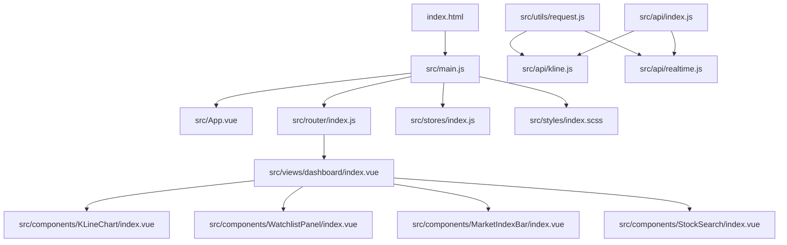
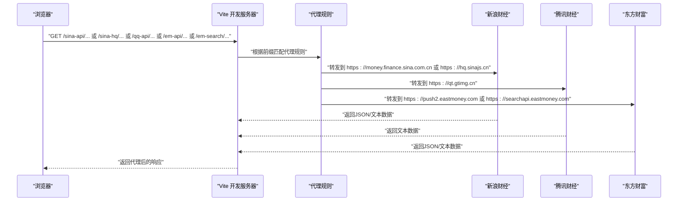
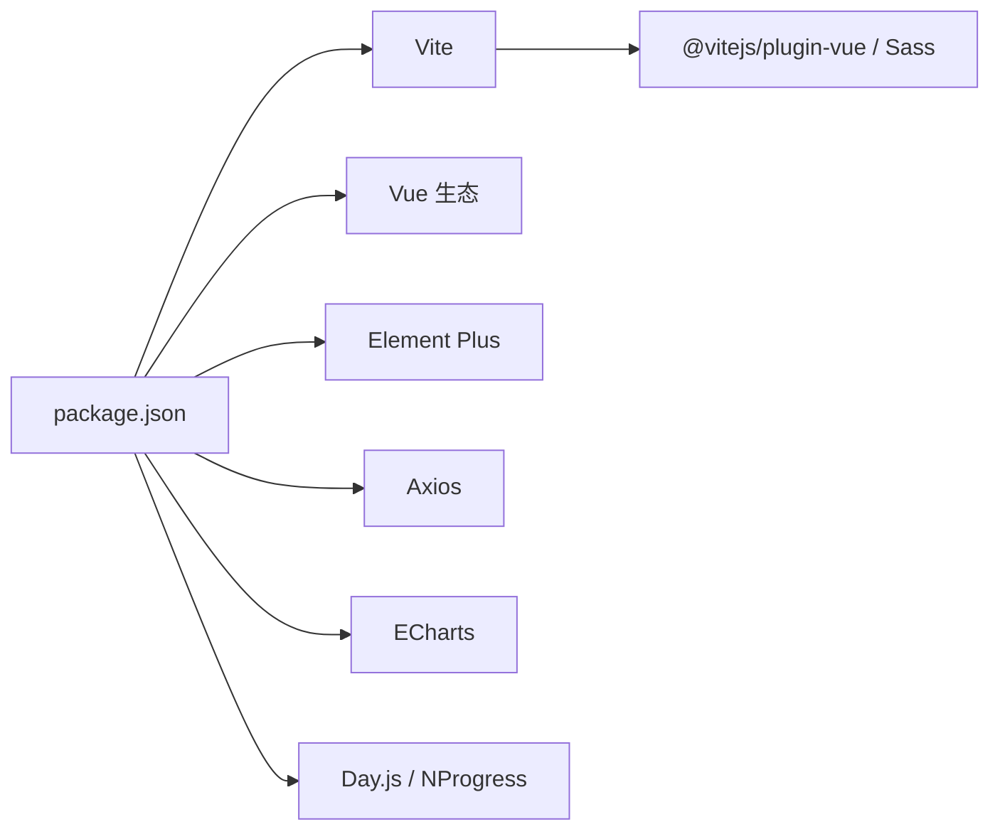

# 开发环境搭建

<cite>
**本文引用的文件**
- [package.json](file://package.json)
- [vite.config.js](file://vite.config.js)
- [jsconfig.json](file://jsconfig.json)
- [index.html](file://index.html)
- [src/main.js](file://src/main.js)
- [src/App.vue](file://src/App.vue)
- [src/utils/request.js](file://src/utils/request.js)
- [src/api/index.js](file://src/api/index.js)
- [src/api/kline.js](file://src/api/kline.js)
- [src/api/realtime.js](file://src/api/realtime.js)
- [src/router/index.js](file://src/router/index.js)
- [src/stores/index.js](file://src/stores/index.js)
- [src/styles/variables.scss](file://src/styles/variables.scss)
- [src/views/dashboard/index.vue](file://src/views/dashboard/index.vue)
- [src/components/KLineChart/index.vue](file://src/components/KLineChart/index.vue)
- [src/layout/index.vue](file://src/layout/index.vue)
- [src/utils/constants.js](file://src/utils/constants.js)
</cite>

## 目录
1. [简介](#简介)
2. [项目结构](#项目结构)
3. [核心组件](#核心组件)
4. [架构总览](#架构总览)
5. [详细组件分析](#详细组件分析)
6. [依赖分析](#依赖分析)
7. [性能考虑](#性能考虑)
8. [故障排查指南](#故障排查指南)
9. [结论](#结论)
10. [附录：开发环境与工具链](#附录开发环境与工具链)

## 简介
本指南面向量化交易平台的前端开发者，提供从零开始搭建开发环境的完整流程，涵盖 Node.js 版本与安装、nvm 使用建议、依赖安装、Vite 开发服务器配置、IDE 推荐与调试、项目结构与关键配置文件说明，以及与后端接口相关的代理配置与数据流解析。

## 项目结构
该工程采用 Vue 3 + Vite 的现代前端架构，核心目录与职责如下：
- public：静态资源与入口 HTML
- src：源代码
  - api：接口封装与聚合导出
  - assets：静态资源
  - components：可复用组件（如 K 线图、自选股面板等）
  - layout：布局容器与导航
  - router：路由定义与进度条
  - stores：状态管理（Pinia）
  - styles：样式与 SCSS 变量
  - utils：工具函数与常量
  - views：页面级视图
  - main.js：应用入口
  - App.vue：根组件
- vite.config.js：构建与开发服务器配置
- jsconfig.json：路径别名与模块解析配置
- index.html：应用入口模板

图表来源
- [index.html](file://index.html)
- [src/main.js](file://src/main.js)
- [src/App.vue](file://src/App.vue)
- [src/router/index.js](file://src/router/index.js)
- [src/stores/index.js](file://src/stores/index.js)
- [src/views/dashboard/index.vue](file://src/views/dashboard/index.vue)
- [src/components/KLineChart/index.vue](file://src/components/KLineChart/index.vue)
- [src/utils/request.js](file://src/utils/request.js)
- [src/api/kline.js](file://src/api/kline.js)
- [src/api/realtime.js](file://src/api/realtime.js)
- [src/api/index.js](file://src/api/index.js)

章节来源
- [index.html](file://index.html)
- [src/main.js](file://src/main.js)
- [src/App.vue](file://src/App.vue)
- [src/router/index.js](file://src/router/index.js)
- [src/stores/index.js](file://src/stores/index.js)
- [src/views/dashboard/index.vue](file://src/views/dashboard/index.vue)
- [src/components/KLineChart/index.vue](file://src/components/KLineChart/index.vue)
- [src/utils/request.js](file://src/utils/request.js)
- [src/api/kline.js](file://src/api/kline.js)
- [src/api/realtime.js](file://src/api/realtime.js)
- [src/api/index.js](file://src/api/index.js)

## 核心组件
- 应用入口与依赖注入：在入口文件中注册路由、状态管理、UI 组件库与全局样式，并挂载应用。
- 路由与进度条：基于 History 模式的路由，配合进度条展示页面切换状态。
- 状态管理：通过 Pinia 创建仓库并导出各模块。
- API 层：统一封装 axios 实例，分别处理 JSON 与文本响应；对外暴露具体业务接口。
- 视图与组件：仪表盘视图组合多个业务组件，实现市场概览、自选股、搜索与 K 线图等能力。
- 构建与别名：Vite 提供开发服务器与构建能力；jsconfig.json 与 Vite 别名保持一致，便于路径导入。

章节来源
- [src/main.js](file://src/main.js)
- [src/router/index.js](file://src/router/index.js)
- [src/stores/index.js](file://src/stores/index.js)
- [src/utils/request.js](file://src/utils/request.js)
- [src/api/index.js](file://src/api/index.js)
- [src/views/dashboard/index.vue](file://src/views/dashboard/index.vue)
- [src/components/KLineChart/index.vue](file://src/components/KLineChart/index.vue)

## 架构总览
下图展示了从前端到后端代理的数据流，以及开发服务器如何转发不同前缀的请求到目标站点。

图表来源
- [vite.config.js](file://vite.config.js)
- [src/utils/request.js](file://src/utils/request.js)
- [src/api/kline.js](file://src/api/kline.js)
- [src/api/realtime.js](file://src/api/realtime.js)

## 详细组件分析

### Vite 开发服务器与代理配置
- 端口与自动打开：开发服务器默认监听指定端口并自动打开浏览器。
- 路径别名：通过别名将 @ 指向 src，便于统一导入。
- 代理规则：针对不同上游服务配置了多条代理，包含目标地址、跨域与重写逻辑，并设置必要的 Referer 头以满足部分站点的防盗链策略。
- CSS 预处理器：全局注入 SCSS 变量，简化主题与颜色常量的使用。

章节来源
- [vite.config.js](file://vite.config.js)
- [jsconfig.json](file://jsconfig.json)
- [src/styles/variables.scss](file://src/styles/variables.scss)

### 请求与接口层
- 请求实例：分别创建 JSON 与文本两类 axios 实例，设置超时与响应类型，并统一拦截器处理错误提示。
- K 线接口：调用 sina-api 获取 K 线数据，解析为内部标准格式。
- 实时行情接口：调用 sina-hq 获取文本格式行情，再按正则解析为结构化数据；也支持单只股票快照查询。
- 接口聚合：通过统一导出模块集中管理对外 API。

章节来源
- [src/utils/request.js](file://src/utils/request.js)
- [src/api/kline.js](file://src/api/kline.js)
- [src/api/realtime.js](file://src/api/realtime.js)
- [src/api/index.js](file://src/api/index.js)

### 路由与页面切换
- 路由结构：根路径重定向至仪表盘；子路由包含仪表盘、个股详情、回测与设置页。
- 进度条：在路由切换前后控制进度条显示，提升交互体验。
- 动态加载：视图组件采用异步加载，减少首屏体积。

章节来源
- [src/router/index.js](file://src/router/index.js)
- [src/layout/index.vue](file://src/layout/index.vue)

### 视图与组件
- 仪表盘：展示大盘指数、热门股票、自选股与快速搜索；在挂载时启动定时刷新，在卸载时停止。
- K 线图：基于 ECharts 渲染蜡烛图与多指标子图，支持缩放、标记买卖点与响应式尺寸调整。
- 布局：侧边栏与导航栏组合，支持折叠与过渡动画。

章节来源
- [src/views/dashboard/index.vue](file://src/views/dashboard/index.vue)
- [src/components/KLineChart/index.vue](file://src/components/KLineChart/index.vue)
- [src/layout/index.vue](file://src/layout/index.vue)

### 状态管理与工具常量
- 状态仓库：统一创建 Pinia 并导出各模块。
- 常量定义：颜色、周期、指标默认参数、信号权重与阈值、大盘指数代码等，支撑图表与业务逻辑。

章节来源
- [src/stores/index.js](file://src/stores/index.js)
- [src/utils/constants.js](file://src/utils/constants.js)

## 依赖分析
- 运行时依赖：Vue 3、Vue Router、Pinia、Axios、Element Plus、ECharts、Day.js、NProgress。
- 开发依赖：Vite、@vitejs/plugin-vue、Sass、Vite 插件生态。
- 脚本命令：dev 启动开发服务器，build 打包，preview 预览生产包。

图表来源
- [package.json](file://package.json)

章节来源
- [package.json](file://package.json)

## 性能考虑
- 代码分割与懒加载：路由视图采用动态导入，降低首屏加载压力。
- 图表渲染优化：禁用 ECharts 动画、延迟初始化与 ResizeObserver 监听，避免频繁重绘。
- 代理与缓存：合理利用浏览器缓存与后端接口缓存，减少重复请求。
- 资源压缩：生产构建开启压缩与 Tree-Shaking，确保包体最小化。

## 故障排查指南
- 无法访问开发服务器
  - 检查端口占用与防火墙设置；确认 Vite 配置中的端口未被占用。
  - 若需要更换端口，修改开发服务器配置项。
- 代理请求失败
  - 核对代理前缀是否与接口调用一致（如 /sina-api、/sina-hq、/qq-api、/em-api、/em-search）。
  - 检查目标域名可访问性与 Referer 设置。
- 路由跳转异常
  - 确认路由模式与历史记录模式一致；检查路由守卫逻辑与 meta 标题设置。
- 样式变量未生效
  - 确认 jsconfig.json 与 Vite 别名一致；检查 SCSS 全局注入配置。
- Axios 错误提示
  - 统一拦截器会根据响应状态或网络错误给出提示；检查网络连通性与超时设置。

章节来源
- [vite.config.js](file://vite.config.js)
- [src/router/index.js](file://src/router/index.js)
- [src/utils/request.js](file://src/utils/request.js)
- [jsconfig.json](file://jsconfig.json)
- [src/styles/variables.scss](file://src/styles/variables.scss)

## 结论
本指南提供了从 Node.js 安装、依赖管理、开发服务器配置到 IDE 推荐与调试的全流程说明。结合项目中的代理、别名与路由设计，开发者可以快速搭建稳定高效的本地开发环境，并顺利对接后端数据源。

## 附录：开发环境与工具链
- Node.js 与版本管理
  - 建议使用 nvm 管理 Node.js 版本，优先选择长期支持版本 LTS。
  - 安装完成后，使用 nvm 切换到推荐版本并验证 node -v 与 npm -v。
- 依赖安装
  - 在项目根目录执行依赖安装命令，等待安装完成。
  - 若遇到权限或网络问题，可尝试更换镜像源或清理缓存后重试。
- Vite 开发服务器
  - 启动：执行开发脚本命令。
  - 端口：可在开发服务器配置中调整。
  - 代理：已内置多条代理规则，覆盖主要数据源。
  - 热重载：Vite 默认启用，修改代码后浏览器自动刷新。
- IDE 推荐与配置
  - VS Code 插件：Vue Language Features (Volar)、ESLint、Prettier、SCSS IntelliSense。
  - 工作区设置：启用 Volar 的编译为 SFC、TS 支持；ESLint 自动修复；Prettier 统一格式。
  - 调试配置：可使用 Volar 插件提供的调试任务，或在浏览器中直接调试。
- 关键配置文件说明
  - package.json：定义脚本命令、运行时与开发依赖。
  - vite.config.js：开发服务器、代理、路径别名与 CSS 预处理器配置。
  - jsconfig.json：路径别名与模块解析策略，与 Vite 保持一致。
  - index.html：应用入口模板，引入主入口脚本。
- 环境变量与后端接口
  - 项目通过代理转发到多个第三方数据源，无需额外环境变量。
  - 如需扩展，请在代理配置中添加新前缀与目标地址，并在 API 层新增对应方法。

章节来源
- [package.json](file://package.json)
- [vite.config.js](file://vite.config.js)
- [jsconfig.json](file://jsconfig.json)
- [index.html](file://index.html)