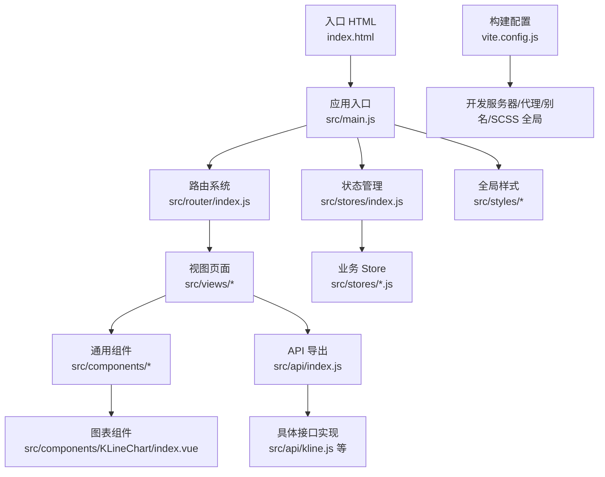
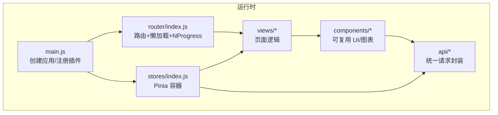
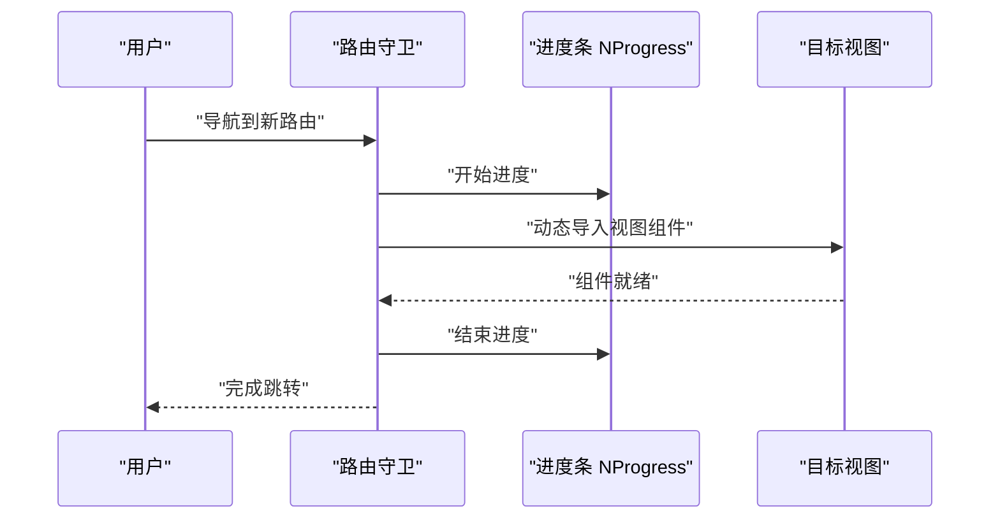
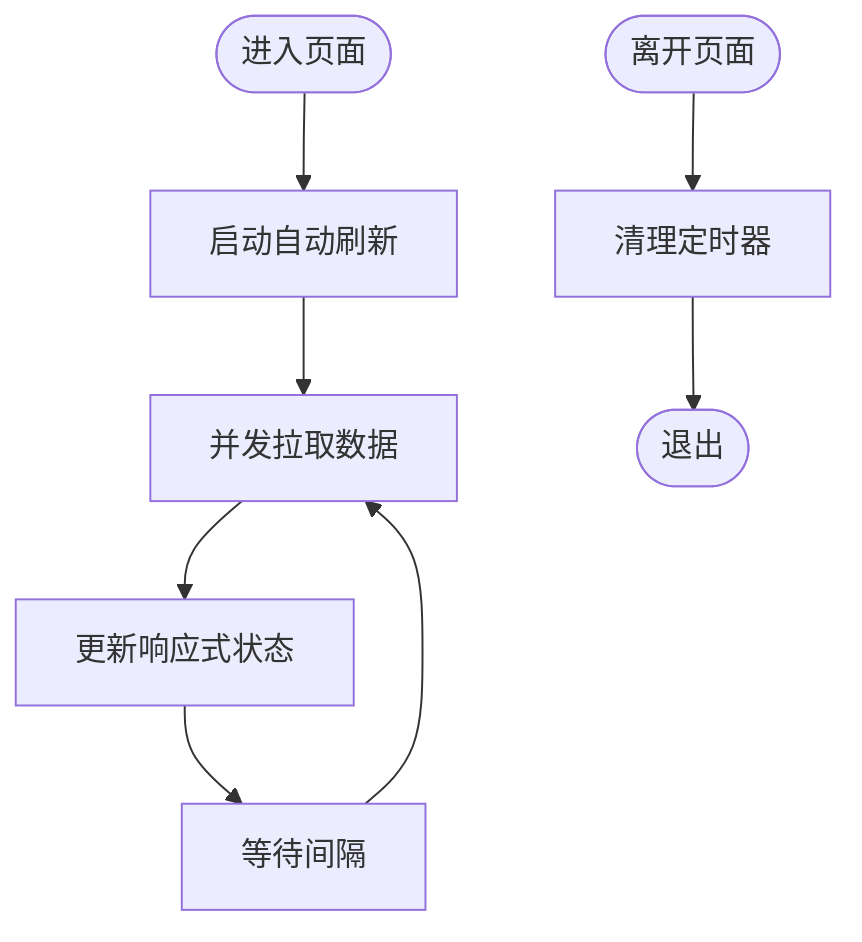
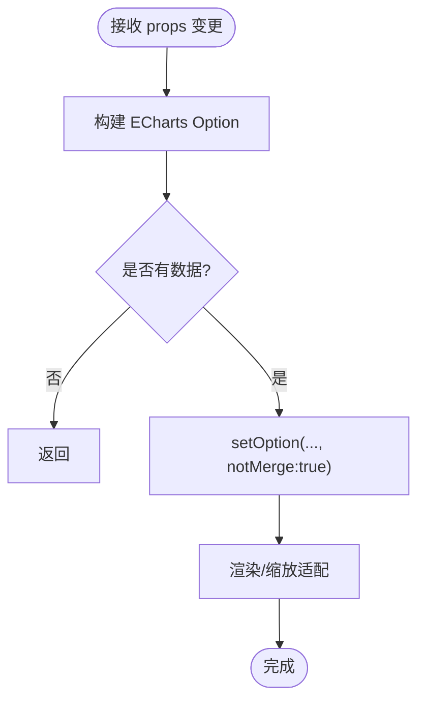
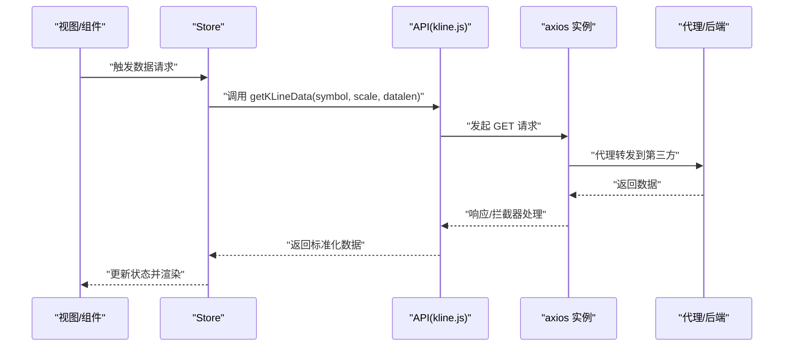
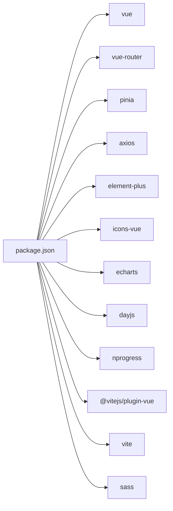

# 性能优化策略

<cite>
**本文引用的文件**
- [vite.config.js](file://vite.config.js)
- [package.json](file://package.json)
- [index.html](file://index.html)
- [src/main.js](file://src/main.js)
- [src/router/index.js](file://src/router/index.js)
- [src/stores/index.js](file://src/stores/index.js)
- [src/stores/market.js](file://src/stores/market.js)
- [src/stores/watchlist.js](file://src/stores/watchlist.js)
- [src/utils/request.js](file://src/utils/request.js)
- [src/utils/formatter.js](file://src/utils/formatter.js)
- [src/api/index.js](file://src/api/index.js)
- [src/api/kline.js](file://src/api/kline.js)
- [src/components/KLineChart/index.vue](file://src/components/KLineChart/index.vue)
- [src/components/WatchlistPanel/index.vue](file://src/components/WatchlistPanel/index.vue)
- [src/views/dashboard/index.vue](file://src/views/dashboard/index.vue)
</cite>

## 目录
1. [简介](#简介)
2. [项目结构](#项目结构)
3. [核心组件](#核心组件)
4. [架构总览](#架构总览)
5. [详细组件分析](#详细组件分析)
6. [依赖分析](#依赖分析)
7. [性能考量与优化建议](#性能考量与优化建议)
8. [故障排查指南](#故障排查指南)
9. [结论](#结论)
10. [附录](#附录)

## 简介
本指南面向量化交易平台，围绕前端性能优化提出系统化策略，覆盖首屏加载、交互响应、内存使用、代码分割与懒加载、构建优化（含 Tree Shaking、压缩）、图表渲染与大数据处理、状态管理优化、网络请求优化、性能监控与分析、移动端与跨浏览器兼容等方面。文档结合现有代码库进行落地分析，并给出可操作的改进建议。

## 项目结构
项目采用 Vue 3 + Vite 的现代前端架构，模块化组织清晰：路由按功能页面拆分，状态管理通过 Pinia 分片存储，API 层统一封装，组件以功能域划分，样式使用 SCSS 并集中变量注入。

**图表来源**
- [index.html:1-14](file://index.html#L1-L14)
- [src/main.js:1-17](file://src/main.js#L1-L17)
- [src/router/index.js:1-58](file://src/router/index.js#L1-L58)
- [src/stores/index.js:1-11](file://src/stores/index.js#L1-L11)
- [src/api/index.js:1-5](file://src/api/index.js#L1-L5)
- [src/api/kline.js:1-27](file://src/api/kline.js#L1-L27)
- [src/components/KLineChart/index.vue:1-285](file://src/components/KLineChart/index.vue#L1-L285)
- [vite.config.js:1-63](file://vite.config.js#L1-L63)

**章节来源**
- [index.html:1-14](file://index.html#L1-L14)
- [src/main.js:1-17](file://src/main.js#L1-L17)
- [src/router/index.js:1-58](file://src/router/index.js#L1-L58)
- [src/stores/index.js:1-11](file://src/stores/index.js#L1-L11)
- [src/api/index.js:1-5](file://src/api/index.js#L1-L5)
- [vite.config.js:1-63](file://vite.config.js#L1-L63)

## 核心组件
- 应用入口与插件注册：在入口中注册 Pinia、路由、Element Plus 国际化，确保全局依赖一次性挂载，减少重复初始化成本。
- 路由懒加载：使用动态 import 实现页面级路由懒加载，降低首屏包体与解析时间。
- 状态分片：市场与自选股等业务 Store 按领域拆分，避免全局状态膨胀导致的不必要重渲染。
- 图表组件：KLineChart 使用 ECharts 渲染多指标 K 线，具备缩放、标记点、网格布局等能力，需关注大数据量渲染与内存释放。
- 视图与组件：仪表盘页面聚合多个子组件，配合自动刷新定时器，注意定时器生命周期管理与去抖。

**章节来源**
- [src/main.js:1-17](file://src/main.js#L1-L17)
- [src/router/index.js:17-35](file://src/router/index.js#L17-L35)
- [src/stores/market.js:1-41](file://src/stores/market.js#L1-L41)
- [src/stores/watchlist.js:1-53](file://src/stores/watchlist.js#L1-L53)
- [src/components/KLineChart/index.vue:1-285](file://src/components/KLineChart/index.vue#L1-L285)
- [src/views/dashboard/index.vue:1-163](file://src/views/dashboard/index.vue#L1-L163)

## 架构总览
整体架构遵循“入口 -> 路由 -> 视图 -> 组件 -> 状态/API”的单向数据流，配合懒加载与状态分片，形成可维护且可优化的前端体系。

**图表来源**
- [src/main.js:1-17](file://src/main.js#L1-L17)
- [src/router/index.js:1-58](file://src/router/index.js#L1-L58)
- [src/stores/index.js:1-11](file://src/stores/index.js#L1-L11)
- [src/api/index.js:1-5](file://src/api/index.js#L1-L5)

## 详细组件分析

### 路由与懒加载
- 页面级懒加载已通过动态 import 实现，有效降低首屏体积。
- 进度条 NProgress 在路由切换前后控制显示，提升交互感知。
- 建议：对高频访问页面可做预取；对非关键路径延迟加载；结合浏览器原生 prefetch/ prerender（如适用）。

**图表来源**
- [src/router/index.js:47-55](file://src/router/index.js#L47-L55)

**章节来源**
- [src/router/index.js:17-35](file://src/router/index.js#L17-L35)
- [src/router/index.js:47-55](file://src/router/index.js#L47-L55)

### 状态管理与自动刷新
- 市场与自选股 Store 各自维护定时器，分别控制刷新频率与停止逻辑，避免相互干扰。
- 建议：将定时器统一管理，支持暂停/恢复；对频繁刷新的数据进行去抖/节流；使用计算属性缓存派生数据。

**图表来源**
- [src/stores/market.js:19-33](file://src/stores/market.js#L19-L33)
- [src/stores/watchlist.js:37-45](file://src/stores/watchlist.js#L37-L45)

**章节来源**
- [src/stores/market.js:1-41](file://src/stores/market.js#L1-L41)
- [src/stores/watchlist.js:1-53](file://src/stores/watchlist.js#L1-L53)
- [src/views/dashboard/index.vue:101-109](file://src/views/dashboard/index.vue#L101-L109)

### 图表渲染与大数据优化
- KLineChart 使用 ECharts，支持多指标叠加、DataZoom 缩放、标记点等，适合展示复杂技术分析。
- 当前实现要点：按需渲染子图、禁用动画、延迟渲染、ResizeObserver 自适应、卸载时 dispose。
- 建议：对超大数据集启用虚拟滚动或分页；对 series 进行采样/降采样；合理设置 dataZoom 初始范围；避免每次 props 微小变化都重建完整 option。

**图表来源**
- [src/components/KLineChart/index.vue:22-241](file://src/components/KLineChart/index.vue#L22-L241)
- [src/components/KLineChart/index.vue:243-276](file://src/components/KLineChart/index.vue#L243-L276)

**章节来源**
- [src/components/KLineChart/index.vue:1-285](file://src/components/KLineChart/index.vue#L1-L285)

### 网络请求与缓存
- 请求封装：区分 JSON 与文本两类请求实例，统一封装错误提示与拦截器。
- 接口实现：K 线接口通过代理转发至第三方数据源，异常时返回空数组，保证 UI 稳定。
- 建议：引入请求缓存（基于查询参数与过期时间）；对热点数据做本地持久化；对实时行情采用轮询节流与增量更新。

**图表来源**
- [src/api/kline.js:9-26](file://src/api/kline.js#L9-L26)
- [src/utils/request.js:5-28](file://src/utils/request.js#L5-L28)

**章节来源**
- [src/utils/request.js:1-29](file://src/utils/request.js#L1-L29)
- [src/api/kline.js:1-27](file://src/api/kline.js#L1-L27)

### 通用格式化与辅助
- 提供价格、百分比、成交量、金额、日期时间等格式化工具，以及市场开关判断与符号归一化。
- 建议：对高频格式化使用 memo 化；在组件层按需引入，避免全量导入造成包体增大。

**章节来源**
- [src/utils/formatter.js:1-60](file://src/utils/formatter.js#L1-L60)

## 依赖分析
- 运行时依赖：Vue 3、Vue Router、Pinia、Axios、Element Plus、ECharts、Day.js、NProgress。
- 开发依赖：@vitejs/plugin-vue、Vite、Sass。
- 构建与运行脚本：dev/build/preview。

**图表来源**
- [package.json:11-26](file://package.json#L11-L26)

**章节来源**
- [package.json:1-28](file://package.json#L1-L28)

## 性能考量与优化建议

### 首屏加载速度
- 代码分割与懒加载
  - 页面路由已使用动态 import，建议进一步对大型组件（如 KLineChart）做按需加载；对非关键路径组件延迟加载。
  - 对第三方库（如 ECharts）按需引入其子模块，避免整包引入。
- 资源与构建优化
  - Vite 默认开启 Tree Shaking；建议启用生产环境压缩（terser 或 esbuild），并开启资源压缩（gzip/br）。
  - 将常用依赖打入 vendor chunk，利用浏览器缓存；对动态 import 的模块进行合理分组。
  - 配置静态资源外链（CDN）以降低主包体积。
- 关键资源预加载
  - 对首屏关键字体、图标、主题样式进行 preload/prefetch；对首屏可见区域组件进行预取。

**章节来源**
- [src/router/index.js:17-35](file://src/router/index.js#L17-L35)
- [vite.config.js:1-63](file://vite.config.js#L1-L63)

### 交互响应性
- 避免主线程阻塞：将耗时计算（如大数据格式化、指标计算）放入 Web Worker 或分片执行。
- 事件节流/防抖：对窗口 resize、滚动、输入等高频事件进行节流；对实时行情轮询进行去抖。
- 动画与渲染
  - 图表组件已禁用动画，建议对频繁更新场景关闭不必要的重绘；使用 ResizeObserver 替代定时轮询检测尺寸变化。
  - 对长列表使用虚拟滚动（如 vue-virtual-scroller）降低 DOM 数量。

**章节来源**
- [src/components/KLineChart/index.vue:257-267](file://src/components/KLineChart/index.vue#L257-L267)

### 内存使用效率
- 生命周期管理：确保组件卸载时释放 ECharts 实例、断开 ResizeObserver、清理定时器。
- 状态瘦身：Pinia Store 按领域拆分，仅保存必要字段；对历史数据设置上限并定期清理。
- 引用类型优化：避免在响应式对象中存放大数组/对象副本，优先使用索引或映射结构。

**章节来源**
- [src/stores/market.js:31-33](file://src/stores/market.js#L31-L33)
- [src/stores/watchlist.js:43-45](file://src/stores/watchlist.js#L43-L45)
- [src/components/KLineChart/index.vue:264-268](file://src/components/KLineChart/index.vue#L264-L268)

### 图表渲染优化（ECharts）
- 大数据量处理
  - 采样/降采样：对 K 线数据按时间窗口聚合；对指标序列进行滑动平均。
  - 分页/分段：将长时间序列分批渲染，先渲染可见区间，滚动时再加载后续。
- 虚拟滚动
  - 对包含大量标记点或数据点的图表，结合虚拟列表减少 DOM 节点数量。
- 渲染细节
  - 关闭动画与不必要的高精度绘制；合理设置 series 的 symbol 与线宽；合并多次 setOption 为一次调用。

**章节来源**
- [src/components/KLineChart/index.vue:22-241](file://src/components/KLineChart/index.vue#L22-L241)

### 状态管理性能优化（Pinia）
- 状态分片：市场、自选股、设置等按领域拆分，避免全局状态膨胀。
- 计算属性缓存：对派生数据使用 computed，减少重复计算；对昂贵计算结果进行本地缓存。
- 响应式数据优化：避免在响应式对象中存放大对象；使用 ref/value 时尽量保持扁平结构。

**章节来源**
- [src/stores/index.js:1-11](file://src/stores/index.js#L1-L11)
- [src/stores/market.js:1-41](file://src/stores/market.js#L1-L41)
- [src/stores/watchlist.js:1-53](file://src/stores/watchlist.js#L1-L53)

### 网络请求优化
- 请求合并：对同一周期内的多个请求进行合并，减少请求数量。
- 缓存策略：基于查询参数与过期时间的本地缓存；对实时行情采用短 TTL；对历史数据采用强缓存。
- CDN 与代理：对外部数据源使用代理，统一 referer 与超时控制；对静态资源使用 CDN 加速。

**章节来源**
- [src/utils/request.js:1-29](file://src/utils/request.js#L1-L29)
- [vite.config.js:15-52](file://vite.config.js#L15-L52)

### 性能监控与分析
- 指标采集：收集 Web Vitals（LCP/FID/CLS/INP/FCP）与自定义指标（首屏时间、路由切换时间、图表渲染耗时）。
- 工具链：使用浏览器开发者工具 Timeline/Performance 面板、Vercel Speed Insights、Lighthouse、Sentry 性能监控。
- 瓶颈识别：通过火焰图定位耗时函数；通过内存快照发现泄漏；通过网络面板识别慢请求与重复请求。

**章节来源**
- [src/router/index.js:47-55](file://src/router/index.js#L47-L55)

### 移动端性能优化
- 触摸与手势：优化触摸事件与滚动性能，避免过度重绘；对图表交互进行移动端适配。
- 尺寸与分辨率：使用媒体查询与 DPR 适配；对图片与图标使用矢量格式或多分辨率位图。
- 网络与电量：在弱网/省电模式下降低刷新频率与数据量；提供离线缓存策略。

### 跨浏览器兼容性
- Polyfill：对较老浏览器引入必要的 polyfill（如 Promise、ResizeObserver）。
- CSS 兼容：使用 Autoprefixer 与目标浏览器列表；避免使用实验性特性。
- 功能降级：对不支持的 API（如某些 IntersectionObserver 变体）提供降级方案。

## 故障排查指南
- 首屏白屏或空白
  - 检查入口是否正确挂载；确认路由懒加载是否成功；查看控制台是否存在网络错误。
- 图表渲染卡顿或崩溃
  - 检查数据量是否过大；确认是否及时 dispose 实例；观察 setOption 是否频繁调用。
- 实时刷新不生效
  - 检查定时器是否被清理；确认 Store 中 start/stop 方法调用顺序；核对页面生命周期钩子。
- 网络请求失败
  - 查看代理配置与 referer 设置；确认超时与错误拦截逻辑；检查第三方接口可用性。

**章节来源**
- [src/components/KLineChart/index.vue:264-268](file://src/components/KLineChart/index.vue#L264-L268)
- [src/stores/market.js:31-33](file://src/stores/market.js#L31-L33)
- [src/stores/watchlist.js:43-45](file://src/stores/watchlist.js#L43-L45)
- [src/utils/request.js:17-28](file://src/utils/request.js#L17-L28)

## 结论
通过路由懒加载、状态分片、图表渲染优化、网络请求缓存与构建压缩等手段，可在保证功能完整性的同时显著提升量化平台的首屏速度、交互流畅度与长期稳定性。建议在持续集成中加入性能回归测试与监控告警，确保优化效果可持续。

## 附录
- 构建配置建议
  - 生产构建：开启压缩、资源压缩、资源外链、vendor 分包。
  - 开发调试：保留 sourcemap，启用热更新与错误边界。
- 监控清单
  - 首屏时间、路由切换时间、图表渲染耗时、内存峰值、CPU 占用、网络请求数与失败率。