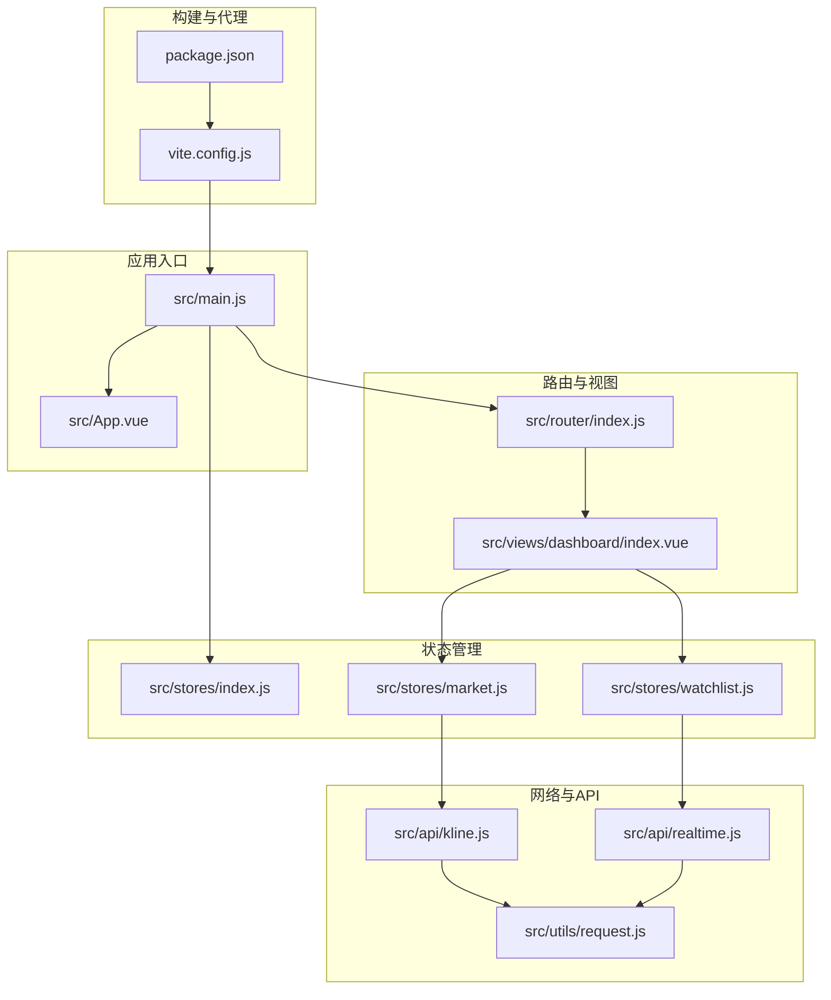
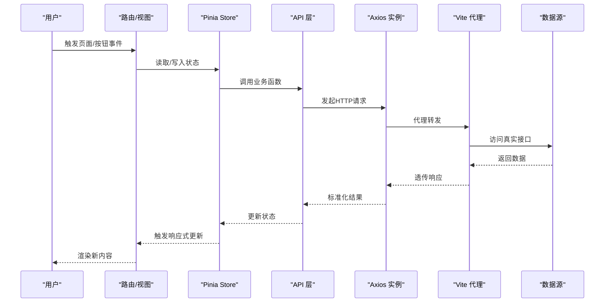
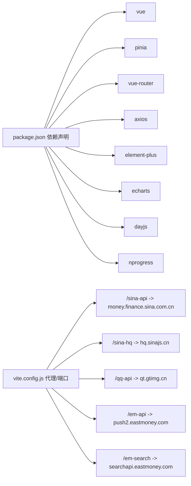

# 调试技巧与工具

<cite>
**本文引用的文件**
- [package.json](file://package.json)
- [vite.config.js](file://vite.config.js)
- [src/main.js](file://src/main.js)
- [src/App.vue](file://src/App.vue)
- [src/router/index.js](file://src/router/index.js)
- [src/stores/index.js](file://src/stores/index.js)
- [src/stores/market.js](file://src/stores/market.js)
- [src/stores/watchlist.js](file://src/stores/watchlist.js)
- [src/utils/request.js](file://src/utils/request.js)
- [src/utils/formatter.js](file://src/utils/formatter.js)
- [src/api/kline.js](file://src/api/kline.js)
- [src/api/realtime.js](file://src/api/realtime.js)
- [src/views/dashboard/index.vue](file://src/views/dashboard/index.vue)
</cite>

## 目录
1. [简介](#简介)
2. [项目结构](#项目结构)
3. [核心组件](#核心组件)
4. [架构总览](#架构总览)
5. [详细组件分析](#详细组件分析)
6. [依赖分析](#依赖分析)
7. [性能考虑](#性能考虑)
8. [故障排查指南](#故障排查指南)
9. [结论](#结论)
10. [附录](#附录)

## 简介
本指南面向量化交易平台的前端开发与调试，围绕浏览器开发者工具（Elements、Console、Network、Sources）、Vue DevTools、Vue 3 响应式调试、Pinia 状态调试、网络请求调试以及常见问题排查展开。结合项目实际代码结构，提供可操作的调试步骤与可视化流程图，帮助快速定位问题并优化性能。

## 项目结构
该工程采用 Vue 3 + Pinia + Vue Router + Vite 的现代前端栈，配合 Axios 进行网络请求，Element Plus 提供 UI 组件，SCSS 预处理样式。路由通过动态导入实现懒加载，状态集中在 Pinia Store 中管理，API 层封装了多个数据源（新浪财经、腾讯、东方财富）并通过代理统一访问。

**图表来源**
- [src/main.js:1-17](file://src/main.js#L1-L17)
- [src/App.vue:1-13](file://src/App.vue#L1-L13)
- [src/router/index.js:1-58](file://src/router/index.js#L1-L58)
- [src/stores/index.js:1-11](file://src/stores/index.js#L1-L11)
- [src/stores/market.js:1-41](file://src/stores/market.js#L1-L41)
- [src/stores/watchlist.js:1-53](file://src/stores/watchlist.js#L1-L53)
- [src/utils/request.js:1-29](file://src/utils/request.js#L1-L29)
- [src/api/kline.js:1-27](file://src/api/kline.js#L1-L27)
- [src/api/realtime.js:1-56](file://src/api/realtime.js#L1-L56)
- [vite.config.js:1-63](file://vite.config.js#L1-L63)
- [package.json:1-28](file://package.json#L1-L28)

**章节来源**
- [src/main.js:1-17](file://src/main.js#L1-L17)
- [src/router/index.js:1-58](file://src/router/index.js#L1-L58)
- [src/stores/index.js:1-11](file://src/stores/index.js#L1-L11)
- [src/utils/request.js:1-29](file://src/utils/request.js#L1-L29)
- [vite.config.js:1-63](file://vite.config.js#L1-L63)
- [package.json:1-28](file://package.json#L1-L28)

## 核心组件
- 应用入口与插件注册：在入口中完成 Pinia、Router、Element Plus 的安装与挂载，确保全局可用。
- 路由与进度条：使用 NProgress 在路由切换前后显示加载状态，便于观察页面切换耗时。
- 状态管理：市场与自选股两个 Store 使用组合式 API 定义，分别负责大盘指数、热门股、自选股列表与实时行情。
- 网络层：Axios 实例分两类（JSON/文本），统一封装错误提示与拦截器，支持代理转发到多家数据源。
- 视图层：仪表盘视图聚合多个组件，绑定 Store 数据与交互事件，负责启动/停止自动刷新。

**章节来源**
- [src/main.js:1-17](file://src/main.js#L1-L17)
- [src/router/index.js:1-58](file://src/router/index.js#L1-L58)
- [src/stores/market.js:1-41](file://src/stores/market.js#L1-L41)
- [src/stores/watchlist.js:1-53](file://src/stores/watchlist.js#L1-L53)
- [src/utils/request.js:1-29](file://src/utils/request.js#L1-L29)
- [src/views/dashboard/index.vue:1-163](file://src/views/dashboard/index.vue#L1-L163)

## 架构总览
下图展示从用户交互到数据返回的关键路径，包括路由导航、状态读取、API 请求与代理转发。

**图表来源**
- [src/router/index.js:47-55](file://src/router/index.js#L47-L55)
- [src/stores/market.js:19-23](file://src/stores/market.js#L19-L23)
- [src/stores/watchlist.js:29-35](file://src/stores/watchlist.js#L29-L35)
- [src/api/kline.js:9-26](file://src/api/kline.js#L9-L26)
- [src/api/realtime.js:39-55](file://src/api/realtime.js#L39-L55)
- [src/utils/request.js:5-28](file://src/utils/request.js#L5-L28)
- [vite.config.js:15-52](file://vite.config.js#L15-L52)

## 详细组件分析

### 浏览器开发者工具使用指南
- Elements 面板
  - 检查 DOM 结构与样式，定位布局异常、元素覆盖等问题。
  - 结合 Vue DevTools 的组件树查看，确认组件渲染层级与 props 传递是否正确。
- Console 控制台
  - 输出关键变量与状态快照，验证 Store 数据与 API 返回格式。
  - 使用断点捕获异常堆栈，定位错误发生位置。
- Network 网络面板
  - 过滤代理前缀（如 /sina-api、/sina-hq、/qq-api、/em-api），观察请求参数、响应体与耗时。
  - 关注跨域与 Referer 设置，确保代理头配置生效。
- Sources 调试器
  - 在关键函数入口设置断点（如 Store 的刷新函数、API 的解析函数），逐步执行观察变量变化。
  - 利用条件断点仅在特定条件下触发（如某个 symbol 或状态值）。

**章节来源**
- [vite.config.js:15-52](file://vite.config.js#L15-L52)
- [src/utils/request.js:17-28](file://src/utils/request.js#L17-L28)
- [src/api/realtime.js:7-33](file://src/api/realtime.js#L7-L33)

### Vue DevTools 安装与使用
- 安装
  - 在浏览器扩展商店安装 Vue DevTools（支持 Vue 3）。
- 组件树查看
  - 定位根组件与子组件，核对 props、slots 与响应式数据来源。
- 状态检查
  - 在“组件”页签查看组件内部响应式数据；在“Pinia”页签查看 Store 状态与变更历史。
- 性能分析
  - 观察组件重渲染次数与触发原因，识别不必要的频繁更新。

[本节为通用工具说明，无需列出具体文件来源]

### Vue 3 响应式调试技巧
- 响应式数据追踪
  - 在组件 mounted 钩子中打印 Store 引用与关键 ref 值，确认初始化状态。
  - 在模板中使用简单表达式输出，避免复杂计算导致难以定位问题。
- 计算属性调试
  - 将复杂计算拆分为多个 computed，逐个验证中间结果。
  - 在计算属性内部设置断点，观察依赖项变化。
- 组件生命周期观察
  - 在 onMounted/onUnmounted 中记录时间戳与状态快照，配合 Network 面板观察定时任务与请求频率。
  - 对比 startAutoRefresh/stopAutoRefresh 的调用，确保只存在一个定时器。

**章节来源**
- [src/views/dashboard/index.vue:101-109](file://src/views/dashboard/index.vue#L101-L109)
- [src/stores/market.js:25-33](file://src/stores/market.js#L25-L33)
- [src/stores/watchlist.js:37-45](file://src/stores/watchlist.js#L37-L45)

### Pinia 状态管理调试方法
- 状态变更追踪
  - 在浏览器中打开 Vue DevTools 的 Pinia 面板，查看 actions 与状态变更序列，确认异步流程顺序。
- Action 调试
  - 在 Store 的 action 内部设置断点，观察入参、内部逻辑与返回值。
  - 对 Promise.all 并行请求进行单独断点，确认并发与合并时机。
- 持久化状态检查
  - 检查本地存储键名与序列化格式，确保 watchlist 的增删改同步到本地存储。

**章节来源**
- [src/stores/market.js:19-23](file://src/stores/market.js#L19-L23)
- [src/stores/watchlist.js:13-23](file://src/stores/watchlist.js#L13-L23)
- [src/stores/watchlist.js:6-7](file://src/stores/watchlist.js#L6-L7)

### 网络请求调试技巧
- API 调用监控
  - 在 Network 面板过滤 /sina-api、/sina-hq、/qq-api、/em-api 等路径，观察请求参数与响应体。
  - 关注超时与跨域错误，必要时调整超时时间或代理头。
- 错误处理调试
  - 查看响应拦截器中的错误消息映射，确认错误类型与提示文案。
  - 对异常分支（try/catch）设置断点，验证降级策略（返回空数组）。
- 数据流追踪
  - 从 Store 的 fetch 函数到 API 的解析函数，再到组件渲染，逐层断点验证数据链路。

**章节来源**
- [src/utils/request.js:17-28](file://src/utils/request.js#L17-L28)
- [src/api/kline.js:9-26](file://src/api/kline.js#L9-L26)
- [src/api/realtime.js:39-55](file://src/api/realtime.js#L39-L55)

### 常见问题与调试方法
- 组件不更新
  - 检查 Store 的 ref 是否被直接赋值，避免遗漏 .value。
  - 确认模板中使用的是响应式数据而非快照值。
- 状态不同步
  - 核对多个 Store 之间的依赖关系，避免竞态条件。
  - 在路由切换时暂停/恢复定时器，防止重复刷新。
- 性能问题
  - 合理设置定时器间隔，避免频繁请求。
  - 使用虚拟滚动或分页减少渲染压力。
  - 在 Network 面板观察请求频率与响应大小。

**章节来源**
- [src/stores/market.js:25-33](file://src/stores/market.js#L25-L33)
- [src/stores/watchlist.js:37-45](file://src/stores/watchlist.js#L37-L45)
- [src/router/index.js:47-55](file://src/router/index.js#L47-L55)

### 断点设置与异步调试
- 断点设置
  - 在 Store 的异步函数入口设置断点，逐步执行 Promise 链。
  - 在 API 解析函数中设置断点，验证字符串到对象的转换。
- 条件断点
  - 仅在特定 symbol 或状态值满足条件时触发，提高调试效率。
- 异步调试
  - 使用 Promise.all 并行场景时，分别对每个 Promise 设置断点，观察完成顺序与错误传播。
  - 在定时器回调中设置断点，确认刷新周期与边界条件。

**章节来源**
- [src/stores/market.js:19-23](file://src/stores/market.js#L19-L23)
- [src/stores/watchlist.js:29-35](file://src/stores/watchlist.js#L29-L35)
- [src/api/realtime.js:7-33](file://src/api/realtime.js#L7-L33)

## 依赖分析
- 外部依赖
  - Vue 3、Pinia、Vue Router、Axios、Element Plus、ECharts、Day.js、NProgress。
- 开发依赖
  - @vitejs/plugin-vue、sass、vite。
- 代理与端口
  - Vite 服务器默认端口与代理规则，确保跨域访问与 Referer 校验。

**图表来源**
- [package.json:11-26](file://package.json#L11-L26)
- [vite.config.js:15-52](file://vite.config.js#L15-L52)

**章节来源**
- [package.json:11-26](file://package.json#L11-L26)
- [vite.config.js:15-52](file://vite.config.js#L15-L52)

## 性能考虑
- 请求频率控制
  - 市场与自选股的定时刷新间隔分别为 30 秒与 15 秒，建议根据网络状况适当调整。
- 并发与合并
  - 使用 Promise.all 并发拉取多个数据源，完成后一次性合并，减少多次渲染。
- 渲染优化
  - 表格组件使用 v-loading 显示加载状态，避免空白闪烁。
  - 对高频更新的数据进行节流/防抖处理。

**章节来源**
- [src/stores/market.js:25-33](file://src/stores/market.js#L25-L33)
- [src/stores/watchlist.js:37-45](file://src/stores/watchlist.js#L37-L45)
- [src/views/dashboard/index.vue:36](file://src/views/dashboard/index.vue#L36)

## 故障排查指南
- 组件不更新
  - 检查 Store 的 ref 是否被正确赋值，确认模板中使用的是响应式数据。
  - 在组件生命周期钩子中打印状态，验证更新时机。
- 状态不同步
  - 核对本地存储键名与序列化格式，确保 watchlist 的持久化正常。
  - 检查路由切换时的定时器启停逻辑。
- 网络错误
  - 查看 Network 面板中的代理转发与跨域头设置，确认 Referer 与目标域名。
  - 在响应拦截器中设置断点，验证错误消息映射与提示文案。
- 性能问题
  - 使用 Vue DevTools 的性能面板观察重渲染次数。
  - 在 Network 面板对比请求频率与响应大小，优化数据粒度与缓存策略。

**章节来源**
- [src/stores/watchlist.js:6-7](file://src/stores/watchlist.js#L6-L7)
- [src/router/index.js:47-55](file://src/router/index.js#L47-L55)
- [src/utils/request.js:17-28](file://src/utils/request.js#L17-L28)
- [vite.config.js:15-52](file://vite.config.js#L15-L52)

## 结论
通过结合浏览器开发者工具、Vue DevTools、Pinia 调试与网络面板，可以系统性地定位与解决量化平台中的组件更新、状态同步与性能问题。建议在开发过程中养成“先断点、后验证”的习惯，并利用代理与拦截器统一处理跨域与错误提示，提升调试效率与稳定性。

## 附录
- 快速定位清单
  - 使用 Vue DevTools 查看组件树与 Store 状态。
  - 在 Network 面板过滤代理路径，检查请求参数与响应。
  - 在 Sources 中对关键函数设置断点，逐步执行。
  - 在路由切换前后观察 NProgress 行为，评估页面切换性能。

[本节为总结性内容，无需列出具体文件来源]