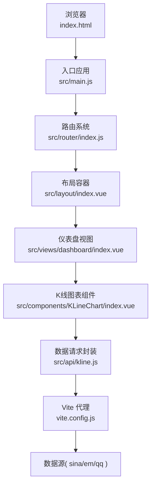
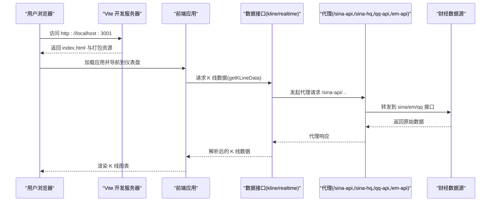
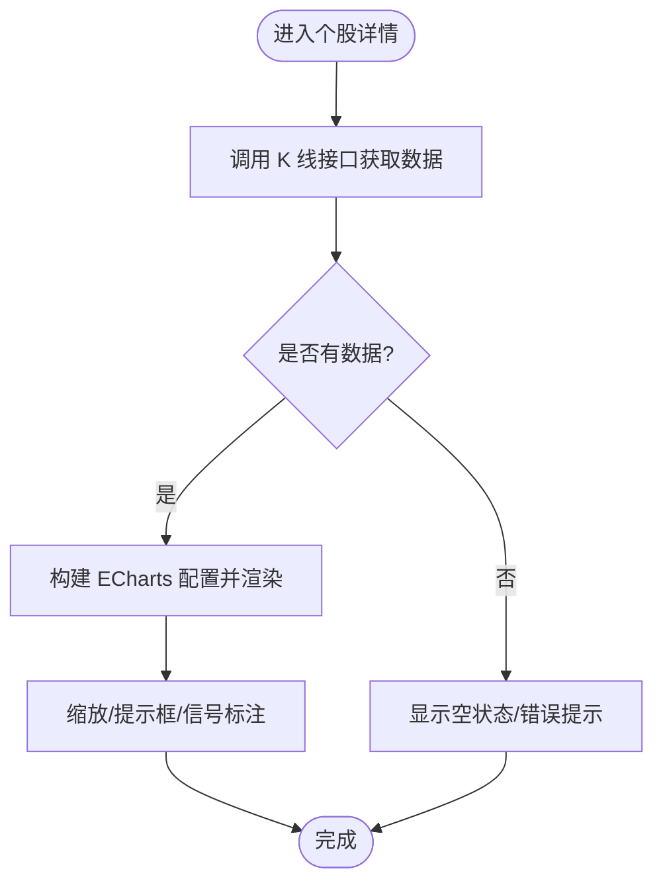
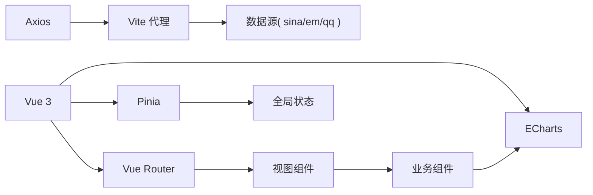

# 快速开始

<cite>
**本文引用的文件**
- [package.json](file://package.json)
- [vite.config.js](file://vite.config.js)
- [index.html](file://index.html)
- [src/main.js](file://src/main.js)
- [src/App.vue](file://src/App.vue)
- [src/router/index.js](file://src/router/index.js)
- [src/layout/index.vue](file://src/layout/index.vue)
- [src/views/dashboard/index.vue](file://src/views/dashboard/index.vue)
- [src/components/KLineChart/index.vue](file://src/components/KLineChart/index.vue)
- [src/api/kline.js](file://src/api/kline.js)
- [src/api/realtime.js](file://src/api/realtime.js)
- [src/utils/constants.js](file://src/utils/constants.js)
- [src/stores/index.js](file://src/stores/index.js)
- [jsconfig.json](file://jsconfig.json)
- [src/styles/variables.scss](file://src/styles/variables.scss)
</cite>

## 目录
1. [简介](#简介)
2. [项目结构](#项目结构)
3. [核心组件](#核心组件)
4. [架构总览](#架构总览)
5. [详细组件分析](#详细组件分析)
6. [依赖分析](#依赖分析)
7. [性能考虑](#性能考虑)
8. [故障排查指南](#故障排查指南)
9. [结论](#结论)
10. [附录](#附录)

## 简介
本指南面向首次接触该量化交易平台的用户，帮助你在本地快速搭建开发与运行环境，完成依赖安装、启动开发服务器、理解代理配置与数据接口，并通过第一个功能演示（K线图表）验证系统可用性。同时提供常见问题排查建议，涵盖端口占用、依赖冲突、浏览器兼容性等。

## 项目结构
该项目采用 Vue 3 + Vite 的前端工程化架构，使用 Vue Router 进行页面路由管理，Pinia 管理全局状态，Element Plus 提供 UI 组件，ECharts 展示 K 线与技术指标，通过 Vite 代理访问国内多家财经数据源。

**图表来源**
- [index.html:1-14](file://index.html#L1-L14)
- [src/main.js:1-17](file://src/main.js#L1-L17)
- [src/router/index.js:1-58](file://src/router/index.js#L1-L58)
- [src/layout/index.vue:1-61](file://src/layout/index.vue#L1-L61)
- [src/views/dashboard/index.vue:1-163](file://src/views/dashboard/index.vue#L1-L163)
- [src/components/KLineChart/index.vue:1-285](file://src/components/KLineChart/index.vue#L1-L285)
- [src/api/kline.js:1-27](file://src/api/kline.js#L1-L27)
- [vite.config.js:1-55](file://vite.config.js#L1-L55)

**章节来源**
- [package.json:1-28](file://package.json#L1-L28)
- [vite.config.js:1-55](file://vite.config.js#L1-L55)
- [index.html:1-14](file://index.html#L1-L14)
- [src/main.js:1-17](file://src/main.js#L1-L17)
- [src/router/index.js:1-58](file://src/router/index.js#L1-L58)
- [src/layout/index.vue:1-61](file://src/layout/index.vue#L1-L61)
- [src/views/dashboard/index.vue:1-163](file://src/views/dashboard/index.vue#L1-L163)
- [src/components/KLineChart/index.vue:1-285](file://src/components/KLineChart/index.vue#L1-L285)
- [src/api/kline.js:1-27](file://src/api/kline.js#L1-L27)

## 核心组件
- 应用入口与插件注册：在入口文件中挂载 Vue 应用，注册路由、状态管理与 UI 组件库，并引入全局样式。
- 路由与布局：定义页面路由与过渡动画，布局容器负责侧边栏与内容区排版。
- 视图层：仪表盘视图聚合市场指数、热门股票、自选股面板等模块。
- 图表组件：基于 ECharts 的 K 线组件，支持多周期蜡烛图、成交量、MACD、KDJ/RSI、布林带与买卖信号标注。
- 数据接口：封装对新浪财经、腾讯等数据源的请求，统一通过 Vite 代理转发。
- 全局状态：通过 Pinia 创建全局 Store 并导出各业务 Store。

**章节来源**
- [src/main.js:1-17](file://src/main.js#L1-L17)
- [src/router/index.js:1-58](file://src/router/index.js#L1-L58)
- [src/layout/index.vue:1-61](file://src/layout/index.vue#L1-L61)
- [src/views/dashboard/index.vue:1-163](file://src/views/dashboard/index.vue#L1-L163)
- [src/components/KLineChart/index.vue:1-285](file://src/components/KLineChart/index.vue#L1-L285)
- [src/api/kline.js:1-27](file://src/api/kline.js#L1-L27)
- [src/stores/index.js:1-11](file://src/stores/index.js#L1-L11)

## 架构总览
系统以浏览器为入口，通过 Vite 开发服务器提供静态资源与代理能力；前端通过 axios 封装的请求方法调用代理路径，代理将请求转发至目标财经数据源，返回的数据经解析后传递给图表组件渲染。

**图表来源**
- [vite.config.js:12-46](file://vite.config.js#L12-L46)
- [src/api/kline.js:9-26](file://src/api/kline.js#L9-L26)
- [src/components/KLineChart/index.vue:243-249](file://src/components/KLineChart/index.vue#L243-L249)

## 详细组件分析

### 环境与依赖要求
- Node.js 版本：推荐使用长期支持版本（LTS），确保与 Vite 5.x、Vue 3.x 生态兼容。
- 包管理器：支持 npm 或 yarn。本项目使用 npm scripts 启动与构建。
- 浏览器：现代浏览器即可，建议使用最新 Chrome/Firefox/Edge 以获得最佳体验。
- 代理与网络：开发环境需可访问 Vite 代理的目标站点（新浪财经、腾讯等），否则无法加载实时/历史数据。

**章节来源**
- [package.json:1-28](file://package.json#L1-L28)
- [vite.config.js:12-46](file://vite.config.js#L12-L46)

### 依赖安装步骤
- 在项目根目录执行安装命令，等待依赖下载完成。
- 安装完成后，可通过 npm scripts 启动开发服务器或进行构建预览。
- 若安装过程中出现权限或网络问题，请检查 npm/yarn 源、代理设置或使用缓存重试。

**章节来源**
- [package.json:6-10](file://package.json#L6-L10)

### 开发环境配置
- 启动开发服务器：执行开发脚本，Vite 将在指定端口启动本地服务并自动打开浏览器。
- 端口配置：默认端口为 3001，可在配置文件中调整。
- 代理设置：已内置多组代理规则，分别对应不同数据源，包含跨域与 Referer 头部设置。
- 路由与标题：路由守卫会动态更新页面标题，配合进度条提升交互体验。
- 路径别名：通过 Vite 与 jsconfig 的路径别名配置，简化导入路径。

**章节来源**
- [package.json:6-10](file://package.json#L6-L10)
- [vite.config.js:12-55](file://vite.config.js#L12-L55)
- [src/router/index.js:47-55](file://src/router/index.js#L47-L55)
- [jsconfig.json:1-12](file://jsconfig.json#L1-L12)

### 生产环境构建与部署
- 构建命令：执行构建脚本生成静态资源产物。
- 预览命令：本地预览构建结果，确认无误后再部署。
- 部署建议：将 dist 目录下的静态资源部署至任意静态服务器（Nginx/Apache/CDN），确保代理相关接口在生产环境可访问或替换为自有后端。

**章节来源**
- [package.json:6-10](file://package.json#L6-L10)

### 第一个功能演示：K 线图表
- 导航到仪表盘视图，组件会自动拉取市场数据并渲染热门股票表格。
- 点击任意股票行，跳转到个股详情页，K 线图表组件将根据传入的 K 线数据与指标参数绘制蜡烛图、成交量与技术指标。
- 图表支持缩放、提示框与信号标注，便于观察形态与买卖信号。

**图表来源**
- [src/views/dashboard/index.vue:97-109](file://src/views/dashboard/index.vue#L97-L109)
- [src/components/KLineChart/index.vue:243-249](file://src/components/KLineChart/index.vue#L243-L249)

**章节来源**
- [src/views/dashboard/index.vue:1-163](file://src/views/dashboard/index.vue#L1-L163)
- [src/components/KLineChart/index.vue:1-285](file://src/components/KLineChart/index.vue#L1-L285)
- [src/api/kline.js:1-27](file://src/api/kline.js#L1-L27)

## 依赖分析
- 运行时依赖：Vue 3、Vue Router、Pinia、Axios、Element Plus、ECharts、Day.js、NProgress。
- 开发依赖：Vite、@vitejs/plugin-vue、Sass、Vite 插件生态。
- 依赖关系：应用通过入口文件注册插件，路由控制页面切换，组件消费 Store 与 API 数据，最终由图表组件渲染可视化。

**图表来源**
- [package.json:11-26](file://package.json#L11-L26)
- [src/main.js:1-17](file://src/main.js#L1-L17)
- [src/router/index.js:1-58](file://src/router/index.js#L1-L58)
- [src/stores/index.js:1-11](file://src/stores/index.js#L1-L11)
- [src/components/KLineChart/index.vue:1-285](file://src/components/KLineChart/index.vue#L1-L285)
- [vite.config.js:12-46](file://vite.config.js#L12-L46)

**章节来源**
- [package.json:11-26](file://package.json#L11-L26)
- [src/main.js:1-17](file://src/main.js#L1-L17)
- [src/stores/index.js:1-11](file://src/stores/index.js#L1-L11)

## 性能考虑
- 图表渲染：禁用动画与延迟渲染可减少首屏压力；仅在数据变化时更新选项。
- 数据请求：合并批量请求、避免频繁刷新；对热点数据进行缓存。
- 资源体积：按需加载路由组件与第三方库，拆分大图表逻辑。
- 代理性能：合理设置代理头与重写规则，避免不必要的跨域往返。

[本节为通用指导，无需列出具体文件来源]

## 故障排查指南
- 端口占用
  - 现象：启动失败并提示端口被占用。
  - 处理：修改配置文件中的端口号或结束占用进程。
  - 参考：开发服务器端口配置。
- 依赖冲突
  - 现象：安装阶段报错或运行时报模块找不到。
  - 处理：清理缓存与 node_modules 后重新安装；检查包管理器版本与镜像源。
- 浏览器兼容性
  - 现象：部分特性在旧版浏览器不生效。
  - 处理：升级浏览器或引入 polyfill；关注 ES 模块与动态导入的兼容性。
- 代理失败
  - 现象：K 线或实时数据为空。
  - 处理：检查代理目标地址与 Referer 头是否正确；确认网络可访问代理站点；必要时更换代理或后端接口。
- 路由与标题异常
  - 现象：页面切换无效果或标题未更新。
  - 处理：检查路由守卫逻辑与 meta 字段；确认路由懒加载组件路径正确。

**章节来源**
- [vite.config.js:12-46](file://vite.config.js#L12-L46)
- [src/router/index.js:47-55](file://src/router/index.js#L47-L55)

## 结论
通过本指南，你可以在本地快速完成环境准备、依赖安装与开发服务器启动，并成功看到 K 线图表与基本分析功能。若需进一步扩展，可结合代理规则接入自有后端，完善数据源与指标体系。

## 附录
- 快速命令
  - 启动开发服务器：执行开发脚本
  - 构建产物：执行构建脚本
  - 本地预览：执行预览脚本
- 关键配置
  - Vite 代理与端口：查看开发服务器配置
  - 路由与标题：查看路由守卫
  - 路径别名：查看 Vite 与 jsconfig 配置

**章节来源**
- [package.json:6-10](file://package.json#L6-L10)
- [vite.config.js:12-55](file://vite.config.js#L12-L55)
- [src/router/index.js:47-55](file://src/router/index.js#L47-L55)
- [jsconfig.json:1-12](file://jsconfig.json#L1-L12)