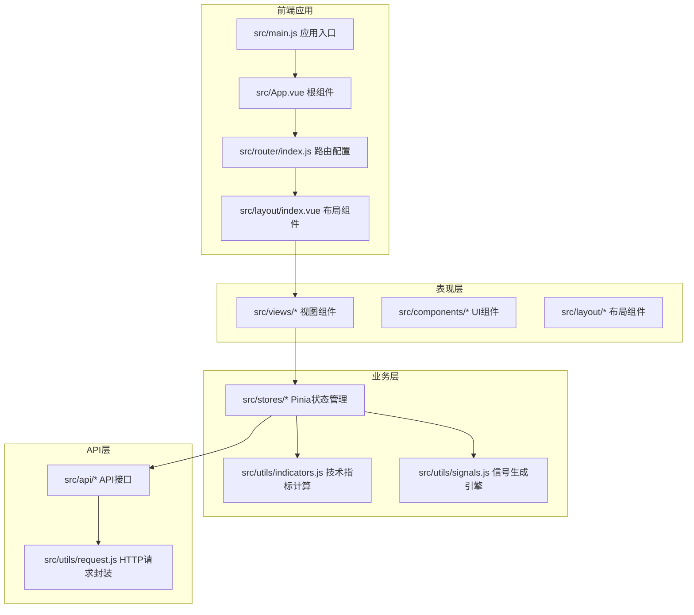
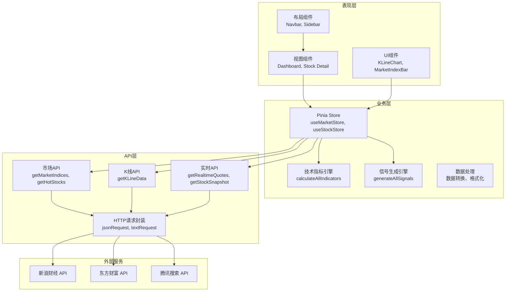
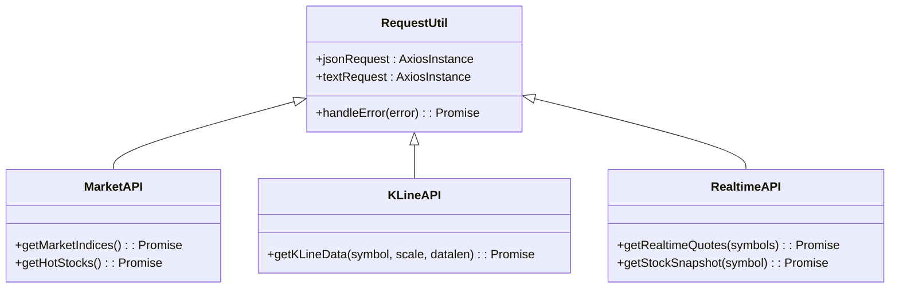
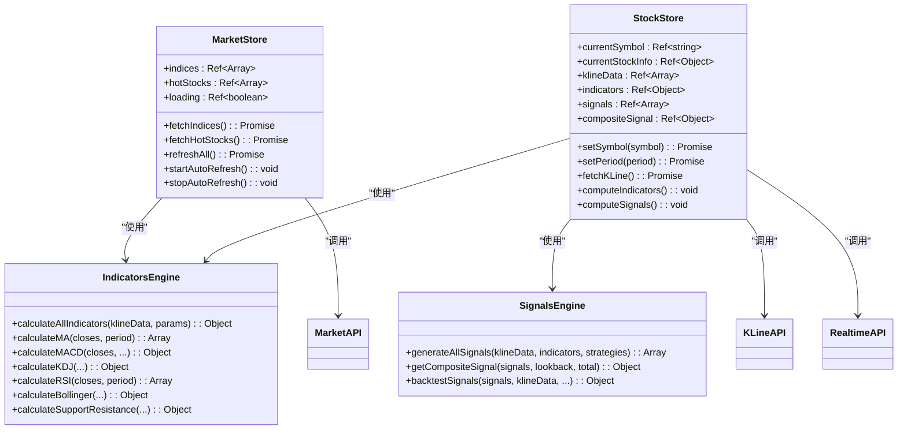
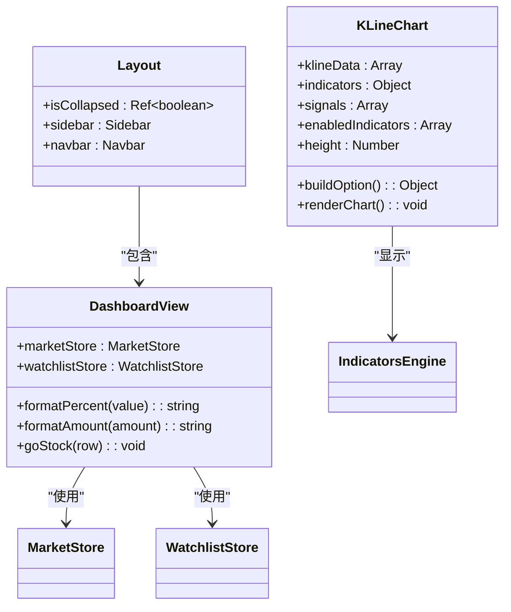

# 分层架构设计

<cite>
**本文档引用的文件**
- [src/main.js](file://src/main.js)
- [src/App.vue](file://src/App.vue)
- [src/router/index.js](file://src/router/index.js)
- [src/layout/index.vue](file://src/layout/index.vue)
- [src/stores/index.js](file://src/stores/index.js)
- [src/stores/market.js](file://src/stores/market.js)
- [src/stores/stock.js](file://src/stores/stock.js)
- [src/api/index.js](file://src/api/index.js)
- [src/api/market.js](file://src/api/market.js)
- [src/api/kline.js](file://src/api/kline.js)
- [src/utils/request.js](file://src/utils/request.js)
- [src/utils/indicators.js](file://src/utils/indicators.js)
- [src/utils/signals.js](file://src/utils/signals.js)
- [src/views/dashboard/index.vue](file://src/views/dashboard/index.vue)
- [src/components/KLineChart/index.vue](file://src/components/KLineChart/index.vue)
</cite>

## 目录
1. [简介](#简介)
2. [项目结构](#项目结构)
3. [核心组件](#核心组件)
4. [架构概览](#架构概览)
5. [详细组件分析](#详细组件分析)
6. [依赖分析](#依赖分析)
7. [性能考虑](#性能考虑)
8. [故障排除指南](#故障排除指南)
9. [结论](#结论)

## 简介

这是一个基于Vue 3的量化交易平台，采用分层架构设计，将系统划分为三层：API层、业务层和表现层。该架构旨在实现关注点分离，提高代码可维护性和可扩展性。

## 项目结构

项目采用基于功能的模块化组织方式，主要目录结构如下：



**图表来源**
- [src/main.js:1-17](file://src/main.js#L1-L17)
- [src/App.vue:1-13](file://src/App.vue#L1-L13)
- [src/router/index.js:1-58](file://src/router/index.js#L1-L58)
- [src/layout/index.vue:1-61](file://src/layout/index.vue#L1-L61)

**章节来源**
- [src/main.js:1-17](file://src/main.js#L1-L17)
- [src/App.vue:1-13](file://src/App.vue#L1-L13)
- [src/router/index.js:1-58](file://src/router/index.js#L1-L58)
- [src/layout/index.vue:1-61](file://src/layout/index.vue#L1-L61)

## 核心组件

### API层组件

API层负责与外部服务的数据交互，提供统一的接口封装：

- **请求封装**：通过axios创建JSON和文本请求实例，统一处理超时和响应格式
- **市场数据**：获取大盘指数、热门股票等市场宏观数据
- **K线数据**：获取股票历史K线数据，支持多种时间周期
- **实时数据**：获取股票实时报价和快照信息

### 业务层组件

业务层处理核心逻辑和算法实现：

- **状态管理**：使用Pinia进行全局状态管理，包括市场数据、股票数据、设置等
- **技术指标**：实现多种技术指标计算，包括MA、MACD、KDJ、RSI、布林带等
- **信号生成**：基于技术指标生成买卖信号，支持多策略组合
- **数据处理**：处理和转换API返回的数据，确保数据格式一致性

### 表现层组件

表现层负责用户界面和交互：

- **视图组件**：页面级别的组件，如仪表板、个股详情、回测页面等
- **UI组件**：可复用的UI组件，如K线图、市场指数条、信号徽章等
- **布局组件**：提供导航栏、侧边栏等基础布局结构

**章节来源**
- [src/api/index.js:1-5](file://src/api/index.js#L1-L5)
- [src/stores/index.js:1-11](file://src/stores/index.js#L1-L11)
- [src/utils/indicators.js:1-245](file://src/utils/indicators.js#L1-L245)
- [src/utils/signals.js:1-347](file://src/utils/signals.js#L1-L347)

## 架构概览

该量化交易平台采用清晰的分层架构，各层之间通过明确定义的接口进行通信：



**图表来源**
- [src/views/dashboard/index.vue:1-163](file://src/views/dashboard/index.vue#L1-L163)
- [src/stores/market.js:1-41](file://src/stores/market.js#L1-L41)
- [src/stores/stock.js:1-92](file://src/stores/stock.js#L1-L92)
- [src/api/market.js:1-46](file://src/api/market.js#L1-L46)
- [src/api/kline.js:1-27](file://src/api/kline.js#L1-L27)
- [src/utils/request.js:1-29](file://src/utils/request.js#L1-L29)

### 层间依赖关系

各层之间的依赖关系呈现单向依赖特性：

- **表现层**仅依赖**业务层**的状态和方法
- **业务层**仅依赖**API层**的数据接口
- **API层**依赖**HTTP请求封装**和**外部服务**
- **外部服务**独立于应用层

这种设计确保了各层职责明确，降低了耦合度。

## 详细组件分析

### API层详细分析

API层通过统一的请求封装处理各种数据源：



**图表来源**
- [src/utils/request.js:1-29](file://src/utils/request.js#L1-L29)
- [src/api/market.js:1-46](file://src/api/market.js#L1-L46)
- [src/api/kline.js:1-27](file://src/api/kline.js#L1-L27)

API层的核心优势：
- **统一错误处理**：集中处理网络错误、超时等异常情况
- **灵活的请求配置**：支持JSON和文本两种响应格式
- **参数标准化**：对外提供一致的接口参数格式

**章节来源**
- [src/utils/request.js:1-29](file://src/utils/request.js#L1-L29)
- [src/api/market.js:1-46](file://src/api/market.js#L1-L46)
- [src/api/kline.js:1-27](file://src/api/kline.js#L1-L27)

### 业务层详细分析

业务层是系统的核心逻辑处理层：



**图表来源**
- [src/stores/market.js:1-41](file://src/stores/market.js#L1-L41)
- [src/stores/stock.js:1-92](file://src/stores/stock.js#L1-L92)
- [src/utils/indicators.js:1-245](file://src/utils/indicators.js#L1-L245)
- [src/utils/signals.js:1-347](file://src/utils/signals.js#L1-L347)

业务层的关键特性：
- **响应式数据流**：使用Vue 3的ref和computed实现响应式状态管理
- **异步数据处理**：支持并发数据获取和Promise.all并行处理
- **自动刷新机制**：定时器实现数据的自动更新
- **策略化信号生成**：支持多种技术分析策略的组合

**章节来源**
- [src/stores/market.js:1-41](file://src/stores/market.js#L1-L41)
- [src/stores/stock.js:1-92](file://src/stores/stock.js#L1-L92)
- [src/utils/indicators.js:1-245](file://src/utils/indicators.js#L1-L245)
- [src/utils/signals.js:1-347](file://src/utils/signals.js#L1-L347)

### 表现层详细分析

表现层专注于用户界面和交互体验：



**图表来源**
- [src/views/dashboard/index.vue:1-163](file://src/views/dashboard/index.vue#L1-L163)
- [src/components/KLineChart/index.vue:1-285](file://src/components/KLineChart/index.vue#L1-L285)
- [src/layout/index.vue:1-61](file://src/layout/index.vue#L1-L61)

表现层的设计特点：
- **组件化架构**：高度模块化的组件设计，便于复用和维护
- **数据绑定**：使用Vue 3的Composition API实现响应式数据绑定
- **可视化展示**：集成ECharts实现丰富的K线图和指标图表
- **用户体验**：提供流畅的动画过渡和交互反馈

**章节来源**
- [src/views/dashboard/index.vue:1-163](file://src/views/dashboard/index.vue#L1-L163)
- [src/components/KLineChart/index.vue:1-285](file://src/components/KLineChart/index.vue#L1-L285)
- [src/layout/index.vue:1-61](file://src/layout/index.vue#L1-L61)

## 依赖分析

系统依赖关系分析显示了清晰的层次化结构：

```mermaid
graph TD
subgraph "应用入口"
A[src/main.js]
B[src/App.vue]
C[src/router/index.js]
end
subgraph "表现层"
D[src/views/*]
E[src/components/*]
F[src/layout/*]
end
subgraph "业务层"
G[src/stores/*]
H[src/utils/indicators.js]
I[src/utils/signals.js]
end
subgraph "API层"
J[src/api/*]
K[src/utils/request.js]
end
subgraph "外部依赖"
L[vue@^3.0.0]
M[pinia@^2.0.0]
N[element-plus@^2.0.0]
O[axios@^1.0.0]
P[echarts@^5.0.0]
end
A --> L
A --> M
A --> N
C --> L
D --> G
E --> G
F --> D
G --> H
G --> I
G --> J
J --> K
K --> O
E --> P
```

**图表来源**
- [src/main.js:1-17](file://src/main.js#L1-L17)
- [src/router/index.js:1-58](file://src/router/index.js#L1-L58)
- [src/stores/index.js:1-11](file://src/stores/index.js#L1-L11)

### 依赖约束分析

系统的依赖约束确保了架构的稳定性：

- **向上依赖**：表现层可以访问业务层，但业务层不能访问表现层
- **向下依赖**：业务层可以访问API层，但API层不能访问业务层
- **横向依赖**：同一层内组件通过标准接口进行通信
- **外部依赖**：所有外部依赖都在应用层之上，便于版本管理和升级

**章节来源**
- [src/main.js:1-17](file://src/main.js#L1-L17)
- [src/stores/index.js:1-11](file://src/stores/index.js#L1-L11)

## 性能考虑

分层架构在性能方面具有以下优势：

### 数据缓存策略
- **自动刷新间隔**：市场数据每30秒刷新，实时数据每10秒刷新
- **并发数据获取**：使用Promise.all并行获取多个数据源
- **响应式更新**：Vue 3的响应式系统只更新变化的数据

### 渲染优化
- **虚拟滚动**：大量数据时使用虚拟滚动减少DOM节点
- **懒加载**：路由级别的组件懒加载，提升首屏加载速度
- **图表优化**：ECharts使用animation禁用和数据压缩优化渲染

### 网络请求优化
- **请求实例复用**：统一的axios实例减少连接开销
- **超时控制**：15秒超时避免长时间等待
- **错误重试**：网络错误时提供友好的错误提示

## 故障排除指南

### 常见问题及解决方案

**API请求失败**
- 检查网络连接状态
- 验证API端点可用性
- 查看控制台错误信息

**数据更新异常**
- 确认定时器是否正常运行
- 检查store状态是否正确更新
- 验证数据格式转换逻辑

**图表渲染问题**
- 检查容器尺寸是否正确
- 验证数据格式是否符合要求
- 确认ECharts实例是否正确初始化

**章节来源**
- [src/utils/request.js:17-29](file://src/utils/request.js#L17-L29)
- [src/stores/market.js:25-33](file://src/stores/market.js#L25-L33)
- [src/components/KLineChart/index.vue:251-268](file://src/components/KLineChart/index.vue#L251-L268)

## 结论

该量化交易平台的分层架构设计有效地实现了关注点分离，提高了代码的可维护性和可扩展性。通过明确的职责划分和清晰的接口定义，系统能够在保持高性能的同时支持复杂的金融数据分析需求。

架构的主要优势包括：
- **清晰的层次结构**：API层、业务层、表现层职责明确
- **良好的可扩展性**：新增功能只需在相应层级添加代码
- **稳定的依赖关系**：单向依赖确保了系统的稳定性
- **优秀的用户体验**：响应式设计和丰富的可视化组件

未来可以考虑的改进方向：
- 添加单元测试覆盖关键业务逻辑
- 实现更精细的错误处理和恢复机制
- 优化大数据量场景下的性能表现
- 增加更多的技术分析指标和策略