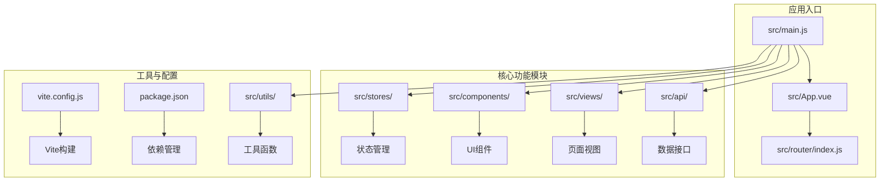
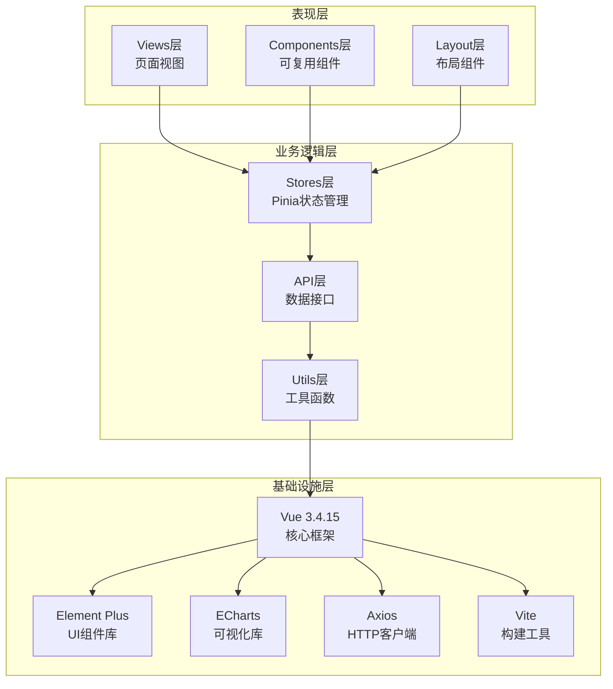
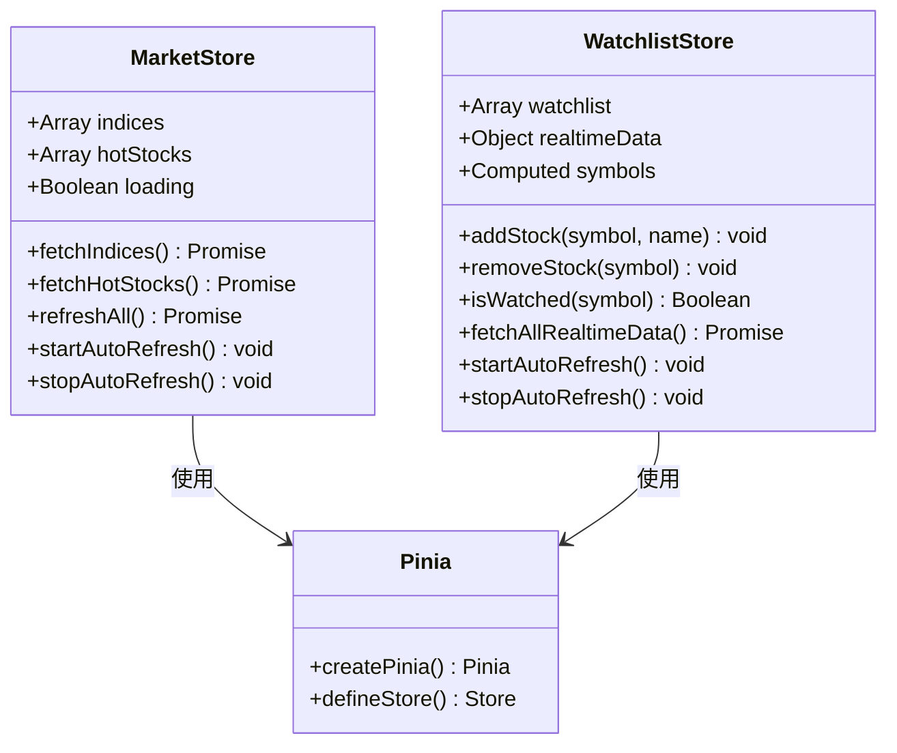
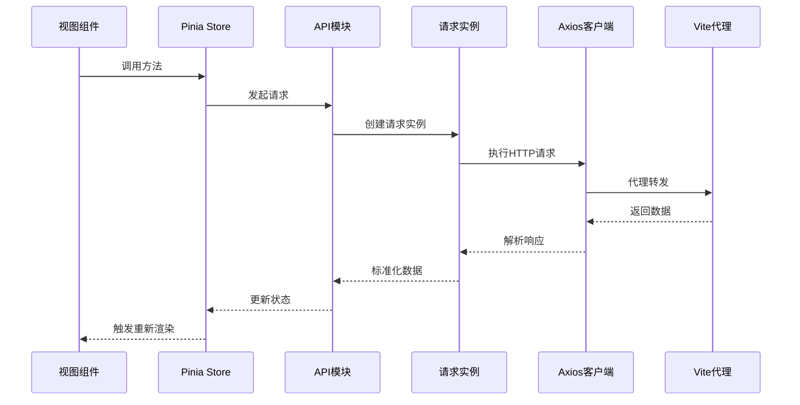
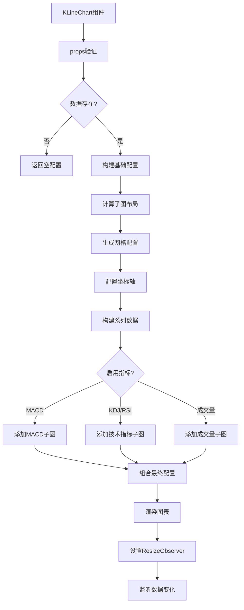

# 技术栈说明

<cite>
**本文档引用的文件**
- [package.json](file://package.json)
- [vite.config.js](file://vite.config.js)
- [src/main.js](file://src/main.js)
- [src/App.vue](file://src/App.vue)
- [src/router/index.js](file://src/router/index.js)
- [src/stores/index.js](file://src/stores/index.js)
- [src/stores/market.js](file://src/stores/market.js)
- [src/stores/watchlist.js](file://src/stores/watchlist.js)
- [src/utils/request.js](file://src/utils/request.js)
- [src/utils/constants.js](file://src/utils/constants.js)
- [src/utils/formatter.js](file://src/utils/formatter.js)
- [src/components/KLineChart/index.vue](file://src/components/KLineChart/index.vue)
- [src/components/StockSearch/index.vue](file://src/components/StockSearch/index.vue)
- [src/components/WatchlistPanel/index.vue](file://src/components/WatchlistPanel/index.vue)
- [src/layout/index.vue](file://src/layout/index.vue)
- [src/views/dashboard/index.vue](file://src/views/dashboard/index.vue)
- [src/api/market.js](file://src/api/market.js)
</cite>

## 目录
1. [简介](#简介)
2. [项目结构](#项目结构)
3. [核心技术栈](#核心技术栈)
4. [架构概览](#架构概览)
5. [详细组件分析](#详细组件分析)
6. [依赖关系分析](#依赖关系分析)
7. [性能考虑](#性能考虑)
8. [故障排除指南](#故障排除指南)
9. [学习路径建议](#学习路径建议)
10. [结论](#结论)

## 简介

本量化交易平台采用现代化前端技术栈，专注于提供高效、直观的股票交易分析体验。项目基于Vue 3.4.15构建，集成了完整的金融数据可视化解决方案，支持实时行情监控、技术指标分析、信号回测等功能。

该技术栈的选择充分考虑了金融应用对性能、可维护性和用户体验的要求，通过模块化设计实现了高内聚、低耦合的系统架构。

## 项目结构

项目采用典型的Vue 3单页应用结构，按照功能模块进行组织：



**图表来源**
- [src/main.js:1-17](file://src/main.js#L1-L17)
- [src/router/index.js:1-58](file://src/router/index.js#L1-L58)
- [src/stores/index.js:1-11](file://src/stores/index.js#L1-L11)

**章节来源**
- [package.json:1-28](file://package.json#L1-L28)
- [vite.config.js:1-63](file://vite.config.js#L1-L63)

## 核心技术栈

### Vue 3.4.15 - 响应式架构

Vue 3作为项目的核心框架，提供了以下关键特性：

**Composition API优势**：采用setup语法糖，实现更灵活的状态管理和逻辑复用
**响应式系统**：基于Proxy的响应式机制，提供更好的性能和开发体验
**Tree-shaking支持**：按需引入组件和功能，优化打包体积

### Element Plus UI组件库

提供完整的UI解决方案，包含丰富的金融数据展示组件：

**表格组件**：用于展示股票列表、技术指标等数据
**卡片组件**：构建信息面板和控制区域
**按钮和图标**：提供一致的交互元素
**表单组件**：支持搜索、筛选等用户操作

### ECharts数据可视化库

专为金融数据设计的强大可视化工具：

**K线图支持**：完整支持蜡烛图、成交量、技术指标叠加
**多维度图表**：支持MACD、KDJ、RSI等多种技术指标
**交互功能**：缩放、平移、标记点等专业功能
**性能优化**：针对大数据量的渲染优化

### Pinia状态管理

现代化的状态管理解决方案：

**TypeScript友好**：提供完整的类型推断支持
**模块化设计**：按功能划分store，便于维护
**开发工具支持**：内置时间旅行调试功能
**轻量级**：相比Vuex具有更小的体积和更好的性能

### Axios HTTP客户端

专业的HTTP通信库：

**拦截器机制**：统一处理请求和响应
**错误处理**：标准化的错误处理流程
**多实例支持**：区分JSON和文本格式的API
**超时控制**：合理的超时配置确保用户体验

### Vite构建工具

新一代构建工具的优势：

**快速开发服务器**：热更新速度极快
**原生ES模块**：更好的Tree-shaking效果
**插件生态**：丰富的插件支持Vue、SCSS等
**代理配置**：解决金融数据源跨域问题

**章节来源**
- [package.json:11-26](file://package.json#L11-L26)
- [src/main.js:10-17](file://src/main.js#L10-L17)

## 架构概览

系统采用分层架构设计，各层职责明确：



**图表来源**
- [src/stores/index.js:1-11](file://src/stores/index.js#L1-L11)
- [src/utils/request.js:1-29](file://src/utils/request.js#L1-L29)
- [src/components/KLineChart/index.vue:1-285](file://src/components/KLineChart/index.vue#L1-L285)

## 详细组件分析

### 状态管理系统

Pinia提供了清晰的状态管理架构：



**图表来源**
- [src/stores/market.js:1-41](file://src/stores/market.js#L1-L41)
- [src/stores/watchlist.js:1-53](file://src/stores/watchlist.js#L1-L53)
- [src/stores/index.js:1-11](file://src/stores/index.js#L1-L11)

### 数据流处理

HTTP请求采用分层设计，支持多种数据格式：



**图表来源**
- [src/utils/request.js:1-29](file://src/utils/request.js#L1-L29)
- [src/api/market.js:1-46](file://src/api/market.js#L1-L46)
- [vite.config.js:15-53](file://vite.config.js#L15-L53)

### K线图组件

ECharts集成展示了复杂数据可视化的实现：



**图表来源**
- [src/components/KLineChart/index.vue:22-241](file://src/components/KLineChart/index.vue#L22-L241)

**章节来源**
- [src/stores/market.js:5-40](file://src/stores/market.js#L5-L40)
- [src/stores/watchlist.js:6-52](file://src/stores/watchlist.js#L6-L52)
- [src/utils/request.js:4-29](file://src/utils/request.js#L4-L29)

## 依赖关系分析

项目依赖关系呈现清晰的层次结构：

```mermaid
graph TB
subgraph "运行时依赖"
A[vue@^3.4.15]
B[vue-router@^4.2.5]
C[pinia@^2.1.7]
D[element-plus@^2.5.3]
E[echarts@^5.4.3]
F[axios@^1.6.7]
G[dayjs@^1.11.10]
H[nprogress@^0.2.0]
end
subgraph "开发依赖"
I[@vitejs/plugin-vue@^5.0.3]
J[sass@^1.70.0]
K[vite@^5.0.11]
end
subgraph "应用层"
L[main.js]
M[router]
N[stores]
O[components]
P[views]
Q[utils]
R[api]
end
A --> L
B --> M
C --> N
D --> O
E --> O
F --> R
G --> Q
H --> M
L --> M
L --> N
L --> O
L --> P
L --> Q
L --> R
```

**图表来源**
- [package.json:11-26](file://package.json#L11-L26)
- [src/main.js:1-17](file://src/main.js#L1-L17)

**章节来源**
- [package.json:1-28](file://package.json#L1-L28)

## 性能考虑

### 响应式优化

- **浅拷贝策略**：使用ref而非reactive减少不必要的响应式开销
- **计算属性缓存**：利用computed避免重复计算
- **条件渲染**：根据数据状态动态渲染组件

### 图表性能

- **增量更新**：ECharts支持notMerge选项进行增量渲染
- **数据压缩**：大量历史数据采用数组存储优化内存使用
- **懒加载**：路由级别的组件懒加载减少初始包大小

### 网络优化

- **请求合并**：批量获取数据减少HTTP请求次数
- **缓存策略**：本地存储自选股数据避免重复请求
- **超时控制**：合理设置超时时间提升用户体验

## 故障排除指南

### 常见问题及解决方案

**图表渲染异常**
- 检查容器尺寸是否正确设置
- 确认数据格式符合ECharts要求
- 验证ResizeObserver兼容性

**数据获取失败**
- 检查Vite代理配置是否正确
- 验证目标API的跨域设置
- 确认网络连接状态

**状态更新不生效**
- 检查响应式数据的修改方式
- 确认store的正确导入和使用
- 验证组件的重新渲染触发

**章节来源**
- [src/utils/request.js:17-29](file://src/utils/request.js#L17-L29)
- [src/components/KLineChart/index.vue:251-277](file://src/components/KLineChart/index.vue#L251-L277)

## 学习路径建议

### Vue 3入门阶段

**第一阶段：基础概念**
- Composition API语法和生命周期
- 响应式系统的原理和使用
- 组件间的通信模式

**第二阶段：进阶应用**
- 自定义Hook的设计和实现
- 深入理解模板编译原理
- 性能优化技巧

**第三阶段：实战项目**
- 参与现有组件的重构和优化
- 独立完成小型功能模块
- 代码审查和最佳实践

### 金融数据可视化

**技术栈掌握顺序**
1. ECharts基础配置和主题定制
2. K线图的高级配置和交互
3. 多指标叠加显示的实现
4. 大数据量的性能优化

**实践建议**
- 从简单的折线图开始练习
- 逐步增加技术指标的复杂度
- 关注移动端适配和响应式设计

### 状态管理深入

**Pinia vs Vuex对比**
- 学习不同状态管理模式的适用场景
- 掌握复杂状态逻辑的封装技巧
- 了解TypeScript在状态管理中的应用

**章节来源**
- [src/stores/market.js:1-41](file://src/stores/market.js#L1-L41)
- [src/stores/watchlist.js:1-53](file://src/stores/watchlist.js#L1-L53)
- [src/components/KLineChart/index.vue:1-285](file://src/components/KLineChart/index.vue#L1-L285)

## 结论

本量化交易平台的技术栈选择体现了现代前端开发的最佳实践。Vue 3的响应式架构为复杂的金融数据处理提供了强大的基础，Element Plus确保了良好的用户体验，ECharts的专业可视化能力满足了金融分析的需求。

通过合理的架构设计和模块化组织，系统实现了高内聚、低耦合的特性，为后续的功能扩展和性能优化奠定了坚实的基础。推荐的新成员应该重点关注响应式原理、状态管理模式和数据可视化技术，这些是理解和贡献该项目的关键技能。