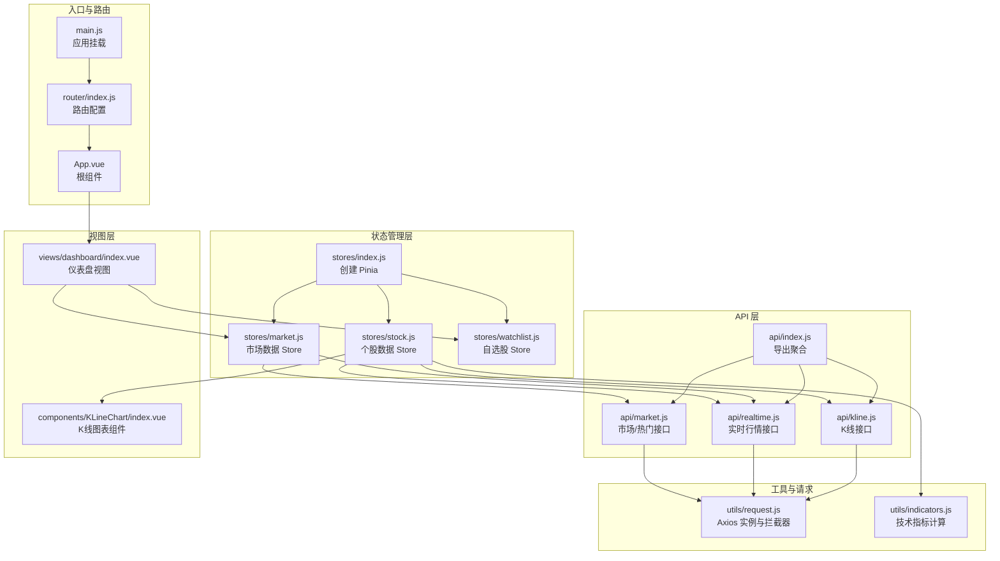
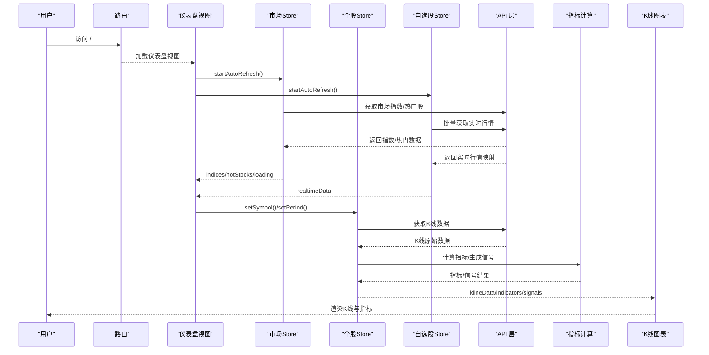
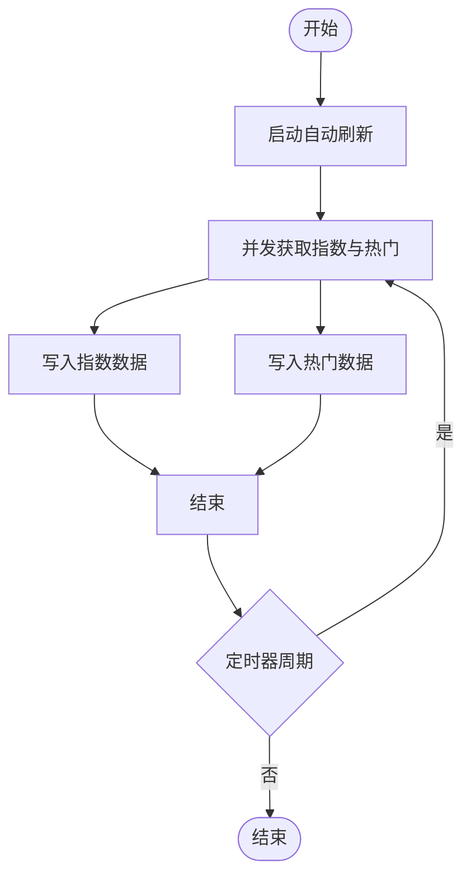
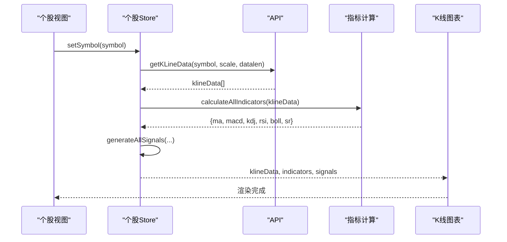
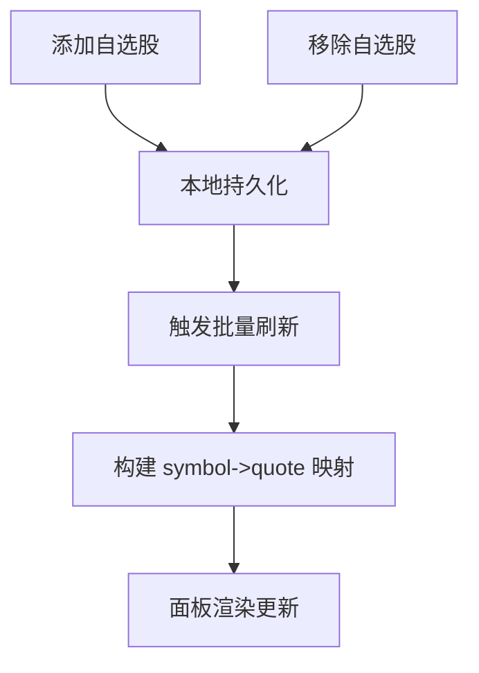
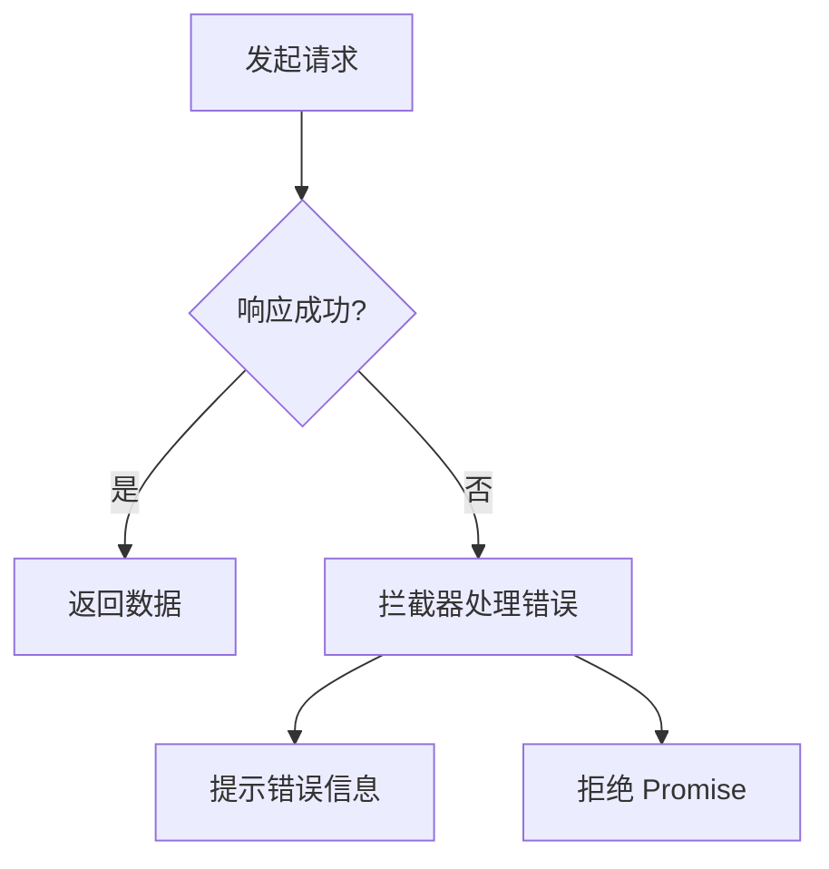
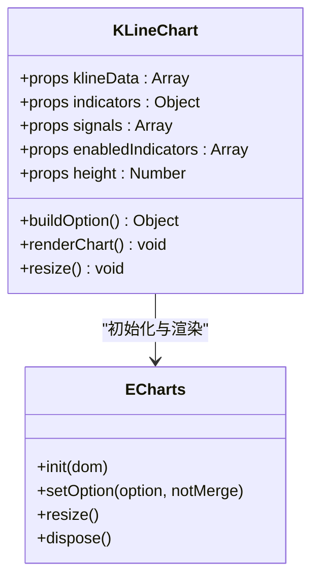
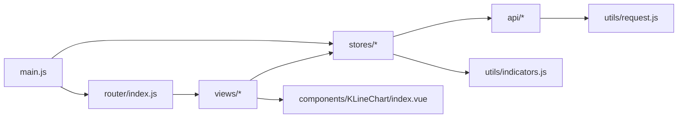

# 数据流设计

<cite>
**本文引用的文件**
- [src/main.js](file://src/main.js)
- [src/App.vue](file://src/App.vue)
- [src/router/index.js](file://src/router/index.js)
- [src/stores/index.js](file://src/stores/index.js)
- [src/stores/market.js](file://src/stores/market.js)
- [src/stores/stock.js](file://src/stores/stock.js)
- [src/stores/watchlist.js](file://src/stores/watchlist.js)
- [src/api/index.js](file://src/api/index.js)
- [src/api/kline.js](file://src/api/kline.js)
- [src/api/realtime.js](file://src/api/realtime.js)
- [src/api/market.js](file://src/api/market.js)
- [src/utils/request.js](file://src/utils/request.js)
- [src/utils/indicators.js](file://src/utils/indicators.js)
- [src/views/dashboard/index.vue](file://src/views/dashboard/index.vue)
- [src/components/KLineChart/index.vue](file://src/components/KLineChart/index.vue)
</cite>

## 目录
1. [简介](#简介)
2. [项目结构](#项目结构)
3. [核心组件](#核心组件)
4. [架构总览](#架构总览)
5. [详细组件分析](#详细组件分析)
6. [依赖关系分析](#依赖关系分析)
7. [性能考量](#性能考量)
8. [故障排查指南](#故障排查指南)
9. [结论](#结论)
10. [附录](#附录)

## 简介
本文件面向量化交易平台，系统化梳理从“数据获取—数据转换—状态管理—组件渲染”的完整数据流路径。重点覆盖：
- API 层：K线、实时行情、市场指数与热门股等接口封装
- 数据层：技术指标与信号计算、数据格式转换
- 状态层：Pinia Store 的数据生命周期、自动刷新与错误处理
- 视图层：图表渲染与响应式更新
- 实时性：定时器驱动的轮询刷新、组件级监听与渲染优化
- 缓存与错误：请求拦截器统一错误提示、本地持久化与去抖策略

## 项目结构
应用采用前端单页架构，路由驱动页面切换，Pinia 管理全局状态，ECharts 负责可视化渲染。

**图表来源**
- [src/main.js:1-17](file://src/main.js#L1-L17)
- [src/router/index.js:1-64](file://src/router/index.js#L1-L64)
- [src/App.vue:1-13](file://src/App.vue#L1-L13)
- [src/stores/index.js:1-11](file://src/stores/index.js#L1-L11)
- [src/stores/market.js:1-41](file://src/stores/market.js#L1-L41)
- [src/stores/stock.js:1-92](file://src/stores/stock.js#L1-L92)
- [src/stores/watchlist.js:1-53](file://src/stores/watchlist.js#L1-L53)
- [src/api/index.js:1-5](file://src/api/index.js#L1-L5)
- [src/api/kline.js:1-27](file://src/api/kline.js#L1-L27)
- [src/api/realtime.js:1-56](file://src/api/realtime.js#L1-L56)
- [src/api/market.js:1-46](file://src/api/market.js#L1-L46)
- [src/utils/request.js:1-29](file://src/utils/request.js#L1-L29)
- [src/utils/indicators.js:1-245](file://src/utils/indicators.js#L1-L245)
- [src/views/dashboard/index.vue:1-163](file://src/views/dashboard/index.vue#L1-L163)
- [src/components/KLineChart/index.vue:1-285](file://src/components/KLineChart/index.vue#L1-L285)

**章节来源**
- [src/main.js:1-17](file://src/main.js#L1-L17)
- [src/router/index.js:1-64](file://src/router/index.js#L1-L64)
- [src/App.vue:1-13](file://src/App.vue#L1-L13)

## 核心组件
- 应用入口与依赖注入：在入口文件中注册路由、Pinia、Element Plus，并挂载应用。
- 路由与页面：路由配置懒加载页面，仪表盘作为默认页，个股详情页通过动态路由进入。
- 状态管理：市场、个股、自选股三个 Store 分别负责不同维度的数据生命周期与刷新策略。
- API 封装：统一使用 Axios 实例，分别处理 JSON 与文本响应，内置错误拦截器。
- 图表渲染：K线组件基于 ECharts，支持多指标叠加、信号标记与自适应缩放。

**章节来源**
- [src/stores/index.js:1-11](file://src/stores/index.js#L1-L11)
- [src/stores/market.js:1-41](file://src/stores/market.js#L1-L41)
- [src/stores/stock.js:1-92](file://src/stores/stock.js#L1-L92)
- [src/stores/watchlist.js:1-53](file://src/stores/watchlist.js#L1-L53)
- [src/utils/request.js:1-29](file://src/utils/request.js#L1-L29)
- [src/components/KLineChart/index.vue:1-285](file://src/components/KLineChart/index.vue#L1-L285)

## 架构总览
下图展示从用户访问到数据渲染的关键流程：路由导航触发视图挂载，视图启动 Store 自动刷新；Store 调用 API 获取数据，进行指标与信号计算，最终驱动图表组件渲染。

**图表来源**
- [src/router/index.js:1-64](file://src/router/index.js#L1-L64)
- [src/views/dashboard/index.vue:1-163](file://src/views/dashboard/index.vue#L1-L163)
- [src/stores/market.js:1-41](file://src/stores/market.js#L1-L41)
- [src/stores/stock.js:1-92](file://src/stores/stock.js#L1-L92)
- [src/stores/watchlist.js:1-53](file://src/stores/watchlist.js#L1-L53)
- [src/api/market.js:1-46](file://src/api/market.js#L1-L46)
- [src/api/realtime.js:1-56](file://src/api/realtime.js#L1-L56)
- [src/utils/indicators.js:1-245](file://src/utils/indicators.js#L1-L245)
- [src/components/KLineChart/index.vue:1-285](file://src/components/KLineChart/index.vue#L1-L285)

## 详细组件分析

### 市场数据流（市场指数与热门股）
- 数据来源：实时行情接口批量获取指数与热门股，市场接口获取热门榜。
- 刷新策略：Store 内部使用定时器每 30 秒刷新一次，支持手动刷新按钮。
- 错误处理：API 层返回空数组兜底，Store 设置 loading 状态，视图层以骨架屏显示。
- 视图联动：仪表盘视图在挂载时启动自动刷新，在卸载时停止定时器。

**图表来源**
- [src/stores/market.js:19-33](file://src/stores/market.js#L19-L33)
- [src/views/dashboard/index.vue:101-109](file://src/views/dashboard/index.vue#L101-L109)

**章节来源**
- [src/stores/market.js:1-41](file://src/stores/market.js#L1-L41)
- [src/api/market.js:1-46](file://src/api/market.js#L1-L46)
- [src/views/dashboard/index.vue:1-163](file://src/views/dashboard/index.vue#L1-L163)

### 个股数据流（K线、指标与信号）
- 数据来源：K线接口返回 OHLCV，实时接口返回快照。
- 计算链路：Store 在拿到 K 线后调用指标计算模块生成 MA/MACD/KDJ/RSI/BOLL，再生成买卖信号并合成复合信号。
- 刷新策略：K线周期切换与个股切换会触发重新拉取；实时行情每 10 秒刷新一次。
- 错误处理：K线拉取异常时设置错误消息，避免渲染异常数据。
- 视图联动：K线组件接收 klineData、indicators、signals，使用深度监听触发重绘。

**图表来源**
- [src/stores/stock.js:25-72](file://src/stores/stock.js#L25-L72)
- [src/api/kline.js:1-27](file://src/api/kline.js#L1-L27)
- [src/utils/indicators.js:221-244](file://src/utils/indicators.js#L221-L244)
- [src/components/KLineChart/index.vue:270-274](file://src/components/KLineChart/index.vue#L270-L274)

**章节来源**
- [src/stores/stock.js:1-92](file://src/stores/stock.js#L1-L92)
- [src/api/kline.js:1-27](file://src/api/kline.js#L1-L27)
- [src/utils/indicators.js:1-245](file://src/utils/indicators.js#L1-L245)
- [src/components/KLineChart/index.vue:1-285](file://src/components/KLineChart/index.vue#L1-L285)

### 自选股数据流（批量实时行情）
- 数据来源：实时行情接口批量获取自选股列表的快照。
- 刷新策略：Store 维护定时器，每 15 秒刷新一次；新增/删除自选股后同步持久化并触发刷新。
- 视图联动：仪表盘右侧自选股面板读取 Store 的实时映射，实现热更新。

**图表来源**
- [src/stores/watchlist.js:13-35](file://src/stores/watchlist.js#L13-L35)
- [src/api/realtime.js:39-47](file://src/api/realtime.js#L39-L47)

**章节来源**
- [src/stores/watchlist.js:1-53](file://src/stores/watchlist.js#L1-L53)
- [src/api/realtime.js:1-56](file://src/api/realtime.js#L1-L56)

### 请求与错误处理
- 请求实例：JSON 与文本两类 Axios 实例，分别用于不同接口类型。
- 错误拦截：统一处理网络错误、超时与服务端错误，弹出消息提示并拒绝 Promise。
- 兜底策略：API 层在异常时返回空数组或空对象，避免前端崩溃。

**图表来源**
- [src/utils/request.js:17-28](file://src/utils/request.js#L17-L28)
- [src/api/kline.js:23-26](file://src/api/kline.js#L23-L26)
- [src/api/market.js:42-45](file://src/api/market.js#L42-L45)

**章节来源**
- [src/utils/request.js:1-29](file://src/utils/request.js#L1-L29)
- [src/api/kline.js:1-27](file://src/api/kline.js#L1-L27)
- [src/api/market.js:1-46](file://src/api/market.js#L1-L46)

### 图表渲染与响应式更新
- Props 输入：klineData、indicators、signals、enabledIndicators、height。
- 渲染逻辑：根据指标启用情况动态布局主图与子图，构建 ECharts 选项并设置。
- 响应式更新：对多个 props 进行深度监听，使用 nextTick 触发重绘。
- 交互能力：支持数据缩放、坐标轴联动、标记买卖点。

**图表来源**
- [src/components/KLineChart/index.vue:10-277](file://src/components/KLineChart/index.vue#L10-L277)

**章节来源**
- [src/components/KLineChart/index.vue:1-285](file://src/components/KLineChart/index.vue#L1-L285)

## 依赖关系分析
- 入口依赖：main.js 注册路由、Pinia、UI 组件库。
- 视图依赖：仪表盘视图依赖市场与自选股 Store；个股视图依赖个股 Store；K线组件依赖指标计算。
- API 依赖：市场与个股 Store 依赖 API 层；API 层依赖请求工具与拦截器。
- 组件依赖：K线图表组件依赖 ECharts 与常量颜色配置。

**图表来源**
- [src/main.js:1-17](file://src/main.js#L1-L17)
- [src/router/index.js:1-64](file://src/router/index.js#L1-L64)
- [src/stores/index.js:1-11](file://src/stores/index.js#L1-L11)
- [src/stores/market.js:1-41](file://src/stores/market.js#L1-L41)
- [src/stores/stock.js:1-92](file://src/stores/stock.js#L1-L92)
- [src/stores/watchlist.js:1-53](file://src/stores/watchlist.js#L1-L53)
- [src/api/index.js:1-5](file://src/api/index.js#L1-L5)
- [src/utils/request.js:1-29](file://src/utils/request.js#L1-L29)
- [src/utils/indicators.js:1-245](file://src/utils/indicators.js#L1-L245)
- [src/views/dashboard/index.vue:1-163](file://src/views/dashboard/index.vue#L1-L163)
- [src/components/KLineChart/index.vue:1-285](file://src/components/KLineChart/index.vue#L1-L285)

**章节来源**
- [src/main.js:1-17](file://src/main.js#L1-L17)
- [src/stores/index.js:1-11](file://src/stores/index.js#L1-L11)

## 性能考量
- 并发请求：Store 使用 Promise.all 并发获取指数与热门数据，减少总等待时间。
- 指标计算：指标计算在内存中进行，避免重复计算；仅在数据变化时触发。
- 图表渲染：禁用动画、延迟渲染与 ResizeObserver 自适应，降低重排成本。
- 定时器管理：组件挂载/卸载时启动/停止定时器，防止内存泄漏与无效请求。
- 缓存策略：自选股列表本地持久化，减少重复加载；API 层对异常返回进行兜底，避免频繁重试。

[本节为通用性能建议，不直接分析具体文件]

## 故障排查指南
- 网络错误：检查请求拦截器是否正确弹出错误消息；确认接口域名与代理配置。
- 数据为空：核对 API 返回结构与字段映射，确保在异常分支返回空数组/空对象。
- 图表不更新：确认 props 是否被深度监听，以及 nextTick 是否在变更后触发。
- 定时器泄漏：确认组件卸载时是否调用了停止定时器的方法。
- 实时刷新异常：检查自选股列表是否为空，批量请求是否正确构建参数。

**章节来源**
- [src/utils/request.js:17-28](file://src/utils/request.js#L17-L28)
- [src/stores/market.js:25-33](file://src/stores/market.js#L25-L33)
- [src/stores/stock.js:74-81](file://src/stores/stock.js#L74-L81)
- [src/stores/watchlist.js:37-45](file://src/stores/watchlist.js#L37-L45)
- [src/components/KLineChart/index.vue:270-274](file://src/components/KLineChart/index.vue#L270-L274)

## 结论
该平台采用“路由驱动视图 + Pinia 管理状态 + Axios 统一请求 + ECharts 可视化”的清晰分层架构。数据流从 API 获取原始数据，经 Store 聚合与指标/信号计算，最终由组件完成渲染。通过并发请求、定时刷新与错误兜底，系统在保证实时性的同时具备良好的稳定性与可维护性。

[本节为总结性内容，不直接分析具体文件]

## 附录
- 数据生命周期要点
  - 初始化：路由进入视图，Store 启动自动刷新。
  - 更新：定时器周期性拉取，或用户操作触发重新拉取。
  - 渲染：Store 将数据与计算结果传递给组件，组件监听并重绘。
  - 销毁：组件卸载时停止定时器，释放图表实例与观察者。
- 异步与订阅
  - 定时器轮询：市场/自选股/个股均使用定时器实现近实时更新。
  - 组件订阅：图表组件通过 props 与 watch 订阅数据变化，实现响应式渲染。
- 优化建议
  - 对高频指标计算引入缓存与增量更新。
  - 对图表渲染增加节流/防抖，避免频繁重绘。
  - 对批量请求进行分片与去重，降低峰值负载。

[本节为概念性内容，不直接分析具体文件]