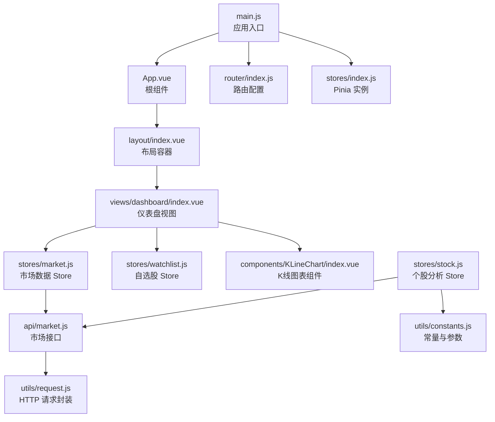
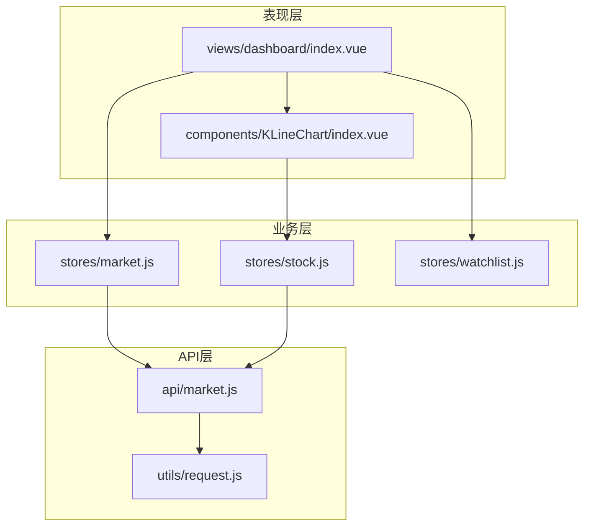
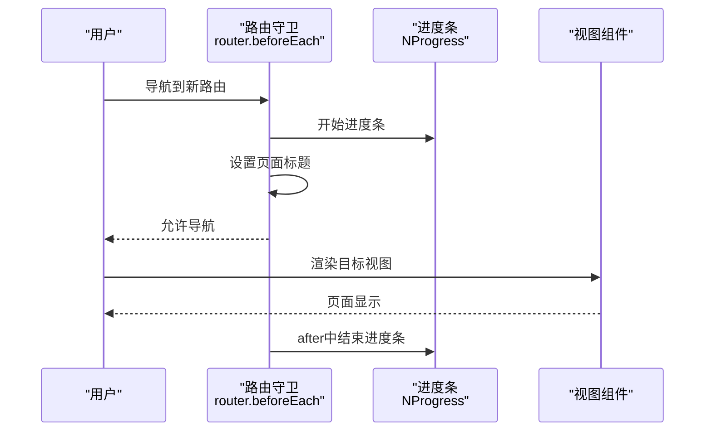
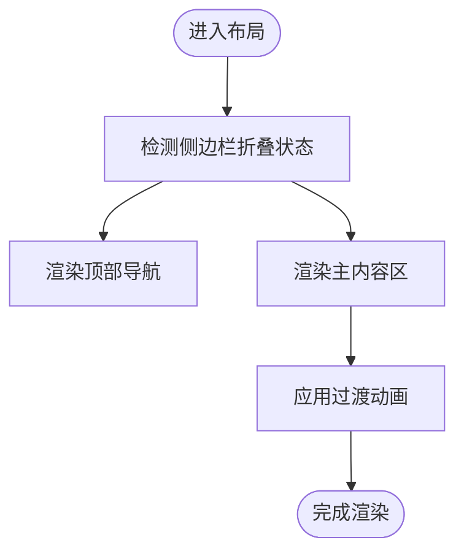
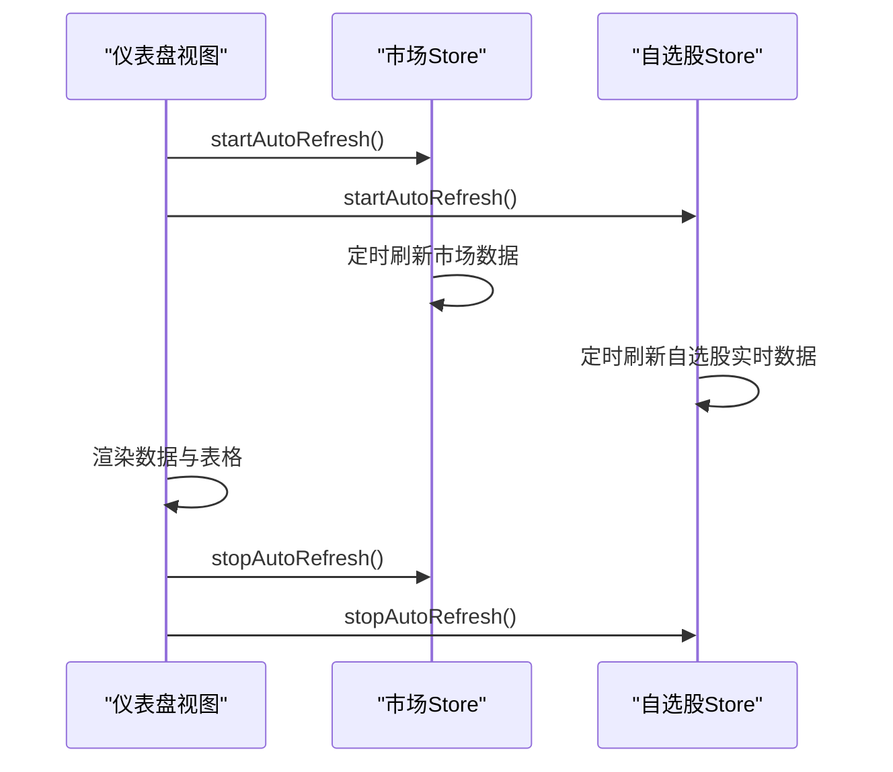
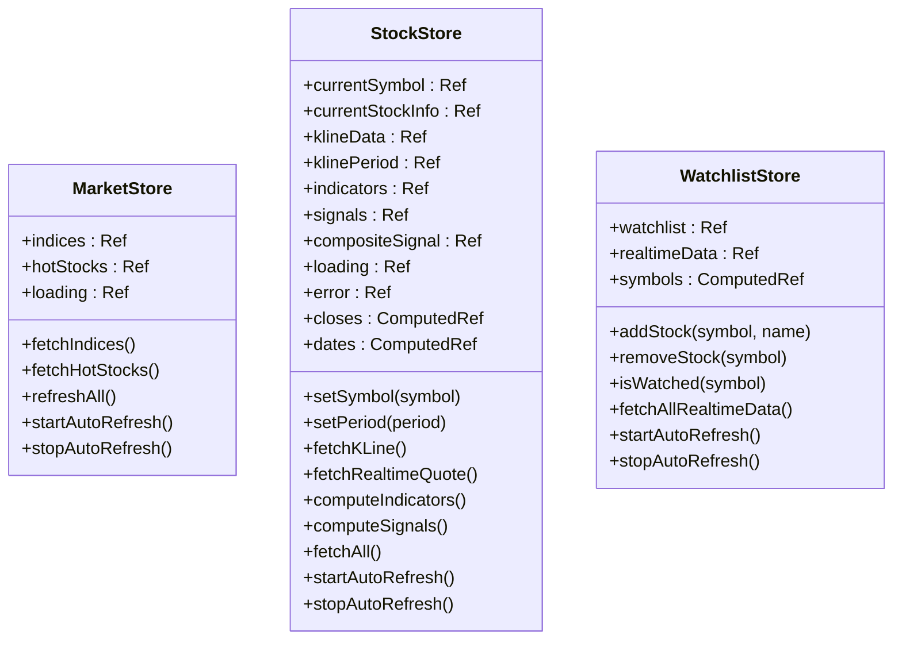
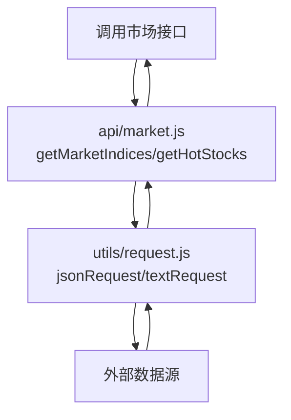
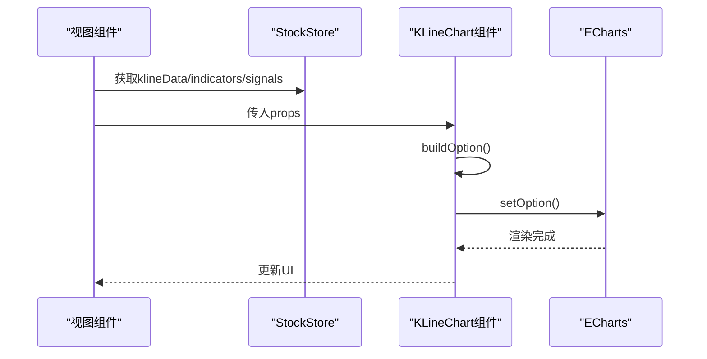
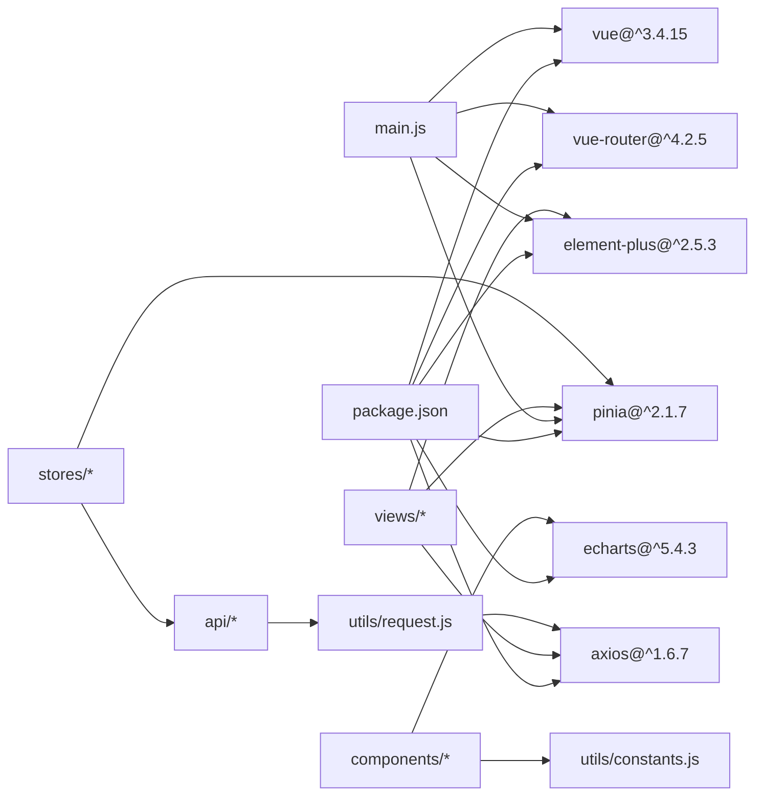

# 架构设计

<cite>
**本文引用的文件**
- [src/main.js](file://src/main.js)
- [src/App.vue](file://src/App.vue)
- [src/router/index.js](file://src/router/index.js)
- [src/layout/index.vue](file://src/layout/index.vue)
- [src/stores/index.js](file://src/stores/index.js)
- [src/stores/market.js](file://src/stores/market.js)
- [src/stores/stock.js](file://src/stores/stock.js)
- [src/stores/watchlist.js](file://src/stores/watchlist.js)
- [src/api/index.js](file://src/api/index.js)
- [src/api/market.js](file://src/api/market.js)
- [src/utils/request.js](file://src/utils/request.js)
- [src/utils/constants.js](file://src/utils/constants.js)
- [src/components/KLineChart/index.vue](file://src/components/KLineChart/index.vue)
- [src/views/dashboard/index.vue](file://src/views/dashboard/index.vue)
- [package.json](file://package.json)
</cite>

## 目录
1. [简介](#简介)
2. [项目结构](#项目结构)
3. [核心组件](#核心组件)
4. [架构总览](#架构总览)
5. [详细组件分析](#详细组件分析)
6. [依赖分析](#依赖分析)
7. [性能考虑](#性能考虑)
8. [故障排查指南](#故障排查指南)
9. [结论](#结论)
10. [附录](#附录)

## 简介
本项目是一个基于 Vue 3 的量化交易平台前端应用，采用 MVVM 架构与组合式 API（Composition API）实现，配合 Pinia 进行状态管理，形成清晰的分层架构：API 层负责数据获取与封装；业务层通过 Store 实现领域逻辑与状态聚合；表现层由视图与组件构成，完成数据渲染与用户交互。系统通过路由系统实现页面导航与动态路由，结合进度条与标题更新提升用户体验。

## 项目结构
项目采用按功能域划分的目录组织方式，主要模块如下：
- 入口与应用根：应用入口在 main.js 中初始化插件与挂载；根组件 App.vue 仅承载路由视图。
- 路由系统：router/index.js 定义路由表、导航守卫与进度条行为。
- 布局系统：layout/index.vue 提供全局布局容器，整合侧边栏与顶部导航，并通过过渡动画承载子路由视图。
- 状态管理：stores/index.js 创建 Pinia 实例并导出各 Store 的命名导出；各具体 Store（如 market、stock、watchlist）封装业务状态与方法。
- API 层：api/index.js 汇总导出各接口；api/market.js 封装市场与热门股票等数据请求。
- 工具与常量：utils/request.js 提供 Axios 实例与统一错误处理；utils/constants.js 提供颜色、周期、默认参数等常量。
- 视图与组件：views 下的页面组件（如 dashboard/index.vue）组织业务视图；components 下的可复用组件（如 KLineChart/index.vue）承担可视化与交互。

**图表来源**
- [src/main.js:1-17](file://src/main.js#L1-L17)
- [src/App.vue:1-13](file://src/App.vue#L1-L13)
- [src/router/index.js:1-58](file://src/router/index.js#L1-L58)
- [src/layout/index.vue:1-61](file://src/layout/index.vue#L1-L61)
- [src/stores/index.js:1-11](file://src/stores/index.js#L1-L11)
- [src/stores/market.js:1-41](file://src/stores/market.js#L1-L41)
- [src/stores/stock.js:1-92](file://src/stores/stock.js#L1-L92)
- [src/stores/watchlist.js:1-53](file://src/stores/watchlist.js#L1-L53)
- [src/api/market.js:1-46](file://src/api/market.js#L1-L46)
- [src/utils/request.js:1-29](file://src/utils/request.js#L1-L29)
- [src/views/dashboard/index.vue:1-163](file://src/views/dashboard/index.vue#L1-L163)
- [src/components/KLineChart/index.vue:1-285](file://src/components/KLineChart/index.vue#L1-L285)

**章节来源**
- [src/main.js:1-17](file://src/main.js#L1-L17)
- [src/App.vue:1-13](file://src/App.vue#L1-L13)
- [src/router/index.js:1-58](file://src/router/index.js#L1-L58)
- [src/layout/index.vue:1-61](file://src/layout/index.vue#L1-L61)
- [src/stores/index.js:1-11](file://src/stores/index.js#L1-L11)

## 核心组件
- 应用入口与插件注册：在入口文件中注册 Pinia、路由与 Element Plus 插件，确保全局可用性。
- 根组件：使用 router-view 承载路由视图，保证页面切换时的视图渲染。
- 路由系统：定义嵌套路由与懒加载视图，使用 beforeEach 设置页面标题与进度条，afterEach 结束进度条。
- 布局系统：提供侧边栏与顶部导航，支持内容区过渡动画与响应式布局。
- 状态管理：通过 Pinia Store 管理市场、个股、自选股等业务状态，提供自动刷新与计算属性。
- API 层：封装统一的 HTTP 请求实例与错误处理，提供市场与个股相关接口。
- 视图与组件：视图组件通过组合式 API 使用 Store 并驱动 UI；可复用组件负责复杂渲染与交互。

**章节来源**
- [src/main.js:1-17](file://src/main.js#L1-L17)
- [src/App.vue:1-13](file://src/App.vue#L1-L13)
- [src/router/index.js:1-58](file://src/router/index.js#L1-L58)
- [src/layout/index.vue:1-61](file://src/layout/index.vue#L1-L61)
- [src/stores/index.js:1-11](file://src/stores/index.js#L1-L11)
- [src/stores/market.js:1-41](file://src/stores/market.js#L1-L41)
- [src/stores/stock.js:1-92](file://src/stores/stock.js#L1-L92)
- [src/stores/watchlist.js:1-53](file://src/stores/watchlist.js#L1-L53)
- [src/api/market.js:1-46](file://src/api/market.js#L1-L46)
- [src/utils/request.js:1-29](file://src/utils/request.js#L1-L29)
- [src/views/dashboard/index.vue:1-163](file://src/views/dashboard/index.vue#L1-L163)
- [src/components/KLineChart/index.vue:1-285](file://src/components/KLineChart/index.vue#L1-L285)

## 架构总览
系统采用 MVVM 架构与组合式 API，Pinia 作为状态管理层，Vue Router 管理路由与导航，Element Plus 提供 UI 组件库，ECharts 用于可视化展示。整体数据流从 API 层获取数据，经过 Store 聚合与计算，最终由视图与组件渲染呈现。

**图表来源**
- [src/views/dashboard/index.vue:1-163](file://src/views/dashboard/index.vue#L1-L163)
- [src/components/KLineChart/index.vue:1-285](file://src/components/KLineChart/index.vue#L1-L285)
- [src/stores/market.js:1-41](file://src/stores/market.js#L1-L41)
- [src/stores/stock.js:1-92](file://src/stores/stock.js#L1-L92)
- [src/stores/watchlist.js:1-53](file://src/stores/watchlist.js#L1-L53)
- [src/api/market.js:1-46](file://src/api/market.js#L1-L46)
- [src/utils/request.js:1-29](file://src/utils/request.js#L1-L29)

## 详细组件分析

### 路由系统与导航守卫
- 路由表：采用嵌套路由，根路径 '/' 重定向至 '/dashboard'，子路由包含仪表盘、个股详情、回测与设置页面。
- 动态路由：个股详情路由使用动态段 ':symbol'，便于根据股票代码跳转。
- 导航守卫：beforeEach 启动进度条并设置页面标题；afterEach 结束进度条，提升用户感知。
- 懒加载视图：子路由组件通过动态导入实现按需加载，优化首屏性能。

**图表来源**
- [src/router/index.js:47-55](file://src/router/index.js#L47-L55)

**章节来源**
- [src/router/index.js:1-58](file://src/router/index.js#L1-L58)

### 布局与页面容器
- 布局容器：提供侧边栏与顶部导航，支持侧边栏折叠与内容区过渡动画。
- 主内容区：通过 router-view 包裹组件并使用过渡效果，保证页面切换体验。
- 响应式样式：通过 SCSS 变量控制侧边栏与导航高度，适配不同屏幕尺寸。

**图表来源**
- [src/layout/index.vue:1-61](file://src/layout/index.vue#L1-L61)

**章节来源**
- [src/layout/index.vue:1-61](file://src/layout/index.vue#L1-L61)

### 仪表盘视图与数据绑定
- 视图职责：展示大盘指数、热门股票列表、自选股面板与快速搜索。
- 数据绑定：通过组合式 API 获取市场与自选股 Store 实例，绑定表格数据与按钮事件。
- 自动刷新：在挂载与卸载阶段启动与停止定时器，实现数据轮询。

**图表来源**
- [src/views/dashboard/index.vue:101-109](file://src/views/dashboard/index.vue#L101-L109)
- [src/stores/market.js:25-33](file://src/stores/market.js#L25-L33)
- [src/stores/watchlist.js:37-45](file://src/stores/watchlist.js#L37-L45)

**章节来源**
- [src/views/dashboard/index.vue:1-163](file://src/views/dashboard/index.vue#L1-L163)
- [src/stores/market.js:1-41](file://src/stores/market.js#L1-L41)
- [src/stores/watchlist.js:1-53](file://src/stores/watchlist.js#L1-L53)

### 状态管理与数据流
- 市场数据 Store：维护大盘指数与热门股票列表，提供定时刷新与并发拉取能力。
- 个股分析 Store：管理当前股票符号、K线数据、周期、指标与信号，计算收盘价与日期序列，支持自动刷新与错误处理。
- 自选股 Store：持久化存储自选股列表，提供增删查与实时行情聚合，支持定时刷新。

**图表来源**
- [src/stores/market.js:5-40](file://src/stores/market.js#L5-L40)
- [src/stores/stock.js:10-91](file://src/stores/stock.js#L10-L91)
- [src/stores/watchlist.js:6-52](file://src/stores/watchlist.js#L6-L52)

**章节来源**
- [src/stores/market.js:1-41](file://src/stores/market.js#L1-L41)
- [src/stores/stock.js:1-92](file://src/stores/stock.js#L1-L92)
- [src/stores/watchlist.js:1-53](file://src/stores/watchlist.js#L1-L53)

### API 层与请求封装
- 接口汇总：api/index.js 汇总导出市场、实时与搜索接口，便于统一引入。
- 市场接口：封装获取大盘指数与热门股票的逻辑，处理返回数据映射。
- 请求封装：提供 JSON 与文本两类 Axios 实例，统一设置超时与响应类型，并添加拦截器进行错误提示与统一处理。

**图表来源**
- [src/api/market.js:1-46](file://src/api/market.js#L1-L46)
- [src/utils/request.js:1-29](file://src/utils/request.js#L1-L29)

**章节来源**
- [src/api/index.js:1-5](file://src/api/index.js#L1-L5)
- [src/api/market.js:1-46](file://src/api/market.js#L1-L46)
- [src/utils/request.js:1-29](file://src/utils/request.js#L1-L29)

### 可视化组件与数据渲染
- K线图表组件：接收 K 线数据、指标与信号，构建 ECharts 选项，支持多子图布局（成交量、MACD、KDJ/RSI），并根据启用的指标动态渲染均线与布林带。
- 响应式与生命周期：在挂载时初始化图表与 ResizeObserver，在卸载时释放资源；通过 watch 监听属性变化并重新渲染。
- 交互与标记：根据买卖信号在图表中标注点位，提供缩放与提示框。

**图表来源**
- [src/components/KLineChart/index.vue:22-241](file://src/components/KLineChart/index.vue#L22-L241)
- [src/stores/stock.js:35-68](file://src/stores/stock.js#L35-L68)

**章节来源**
- [src/components/KLineChart/index.vue:1-285](file://src/components/KLineChart/index.vue#L1-L285)
- [src/stores/stock.js:1-92](file://src/stores/stock.js#L1-L92)

### 组合式 API 与 MVVM 设计
- Model（模型）：Store 通过 ref/computed 管理响应式状态与派生数据，封装业务逻辑。
- View（视图）：视图组件通过组合式 API 使用 Store，绑定模板与事件，实现数据驱动的 UI。
- ViewModel（视图模型）：组合式函数在组件内协调 Store 与本地状态，处理用户交互与副作用（如定时器）。
- 双向绑定与事件：通过 v-model、事件监听与路由跳转实现用户与应用的交互。

**章节来源**
- [src/views/dashboard/index.vue:77-110](file://src/views/dashboard/index.vue#L77-L110)
- [src/stores/market.js:1-41](file://src/stores/market.js#L1-L41)
- [src/stores/stock.js:1-92](file://src/stores/stock.js#L1-L92)

## 依赖分析
- 外部依赖：Vue 3、Vue Router、Pinia、Axios、Element Plus、ECharts、Day.js、NProgress。
- 内部模块依赖：视图组件依赖 Store；Store 依赖 API 层；API 层依赖请求封装工具；组件依赖常量与格式化工具。

**图表来源**
- [package.json:11-26](file://package.json#L11-L26)
- [src/main.js:1-17](file://src/main.js#L1-L17)
- [src/stores/index.js:1-11](file://src/stores/index.js#L1-L11)
- [src/api/index.js:1-5](file://src/api/index.js#L1-L5)
- [src/utils/request.js:1-29](file://src/utils/request.js#L1-L29)
- [src/components/KLineChart/index.vue:1-285](file://src/components/KLineChart/index.vue#L1-L285)
- [src/utils/constants.js:1-68](file://src/utils/constants.js#L1-L68)

**章节来源**
- [package.json:1-28](file://package.json#L1-L28)
- [src/main.js:1-17](file://src/main.js#L1-L17)

## 性能考虑
- 懒加载与路由分割：子路由组件采用动态导入，减少初始包体积，提升首屏加载速度。
- 并发请求与批量刷新：市场 Store 使用 Promise.all 并发拉取多个接口；个股 Store 在设置周期或符号时并行获取 K 线与实时快照。
- 自动刷新策略：通过定时器定期刷新数据，避免频繁轮询造成资源浪费；在组件卸载时及时清理定时器。
- 图表渲染优化：K 线组件禁用动画、延迟渲染与 ResizeObserver 监听，降低重绘成本。
- 常量与计算属性：利用 computed 缓存派生数据，减少重复计算；常量集中管理，避免重复定义。

[本节为通用性能建议，不直接分析具体文件，故无“章节来源”]

## 故障排查指南
- 网络错误与超时：请求拦截器对网络错误与超时进行统一提示，便于定位问题。
- 错误恢复：个股 Store 在获取 K 线失败时设置错误状态，视图层可根据状态进行降级渲染。
- 日志与调试：可在 Store 方法中增加日志输出，结合浏览器开发者工具观察状态变化与组件渲染。

**章节来源**
- [src/utils/request.js:17-28](file://src/utils/request.js#L17-L28)
- [src/stores/stock.js:47-51](file://src/stores/stock.js#L47-L51)

## 结论
该量化交易平台以 MVVM 为核心，结合 Vue 3 组合式 API 与 Pinia 状态管理，实现了清晰的分层架构与高内聚低耦合的模块组织。路由系统提供良好的导航体验，API 层与工具层保障了数据获取与错误处理的一致性。通过可视化的组件与自动刷新机制，系统能够高效地为用户提供实时的市场与个股分析能力。

## 附录
- 技术栈：Vue 3、Vue Router、Pinia、Axios、Element Plus、ECharts、Day.js、NProgress。
- 关键常量：颜色、周期、默认指标参数、信号权重与阈值、大盘指数代码等集中于常量文件，便于统一维护。

**章节来源**
- [src/utils/constants.js:1-68](file://src/utils/constants.js#L1-L68)
- [package.json:11-26](file://package.json#L11-L26)