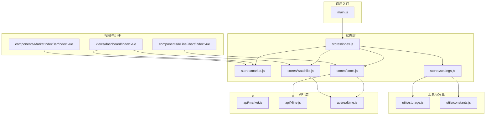
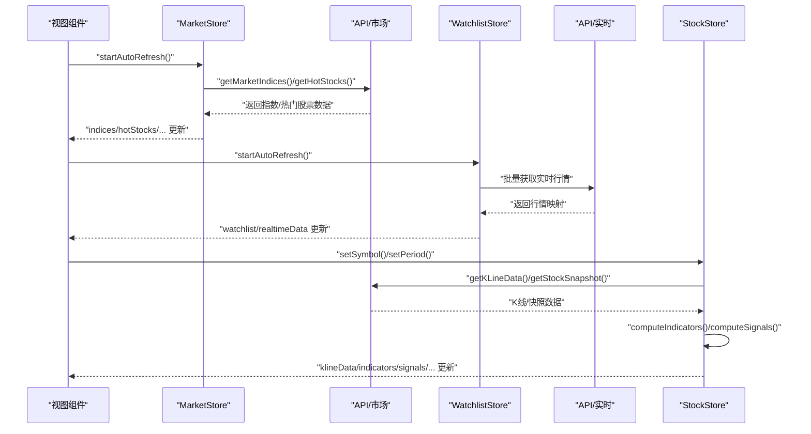
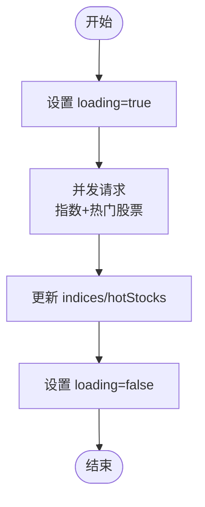
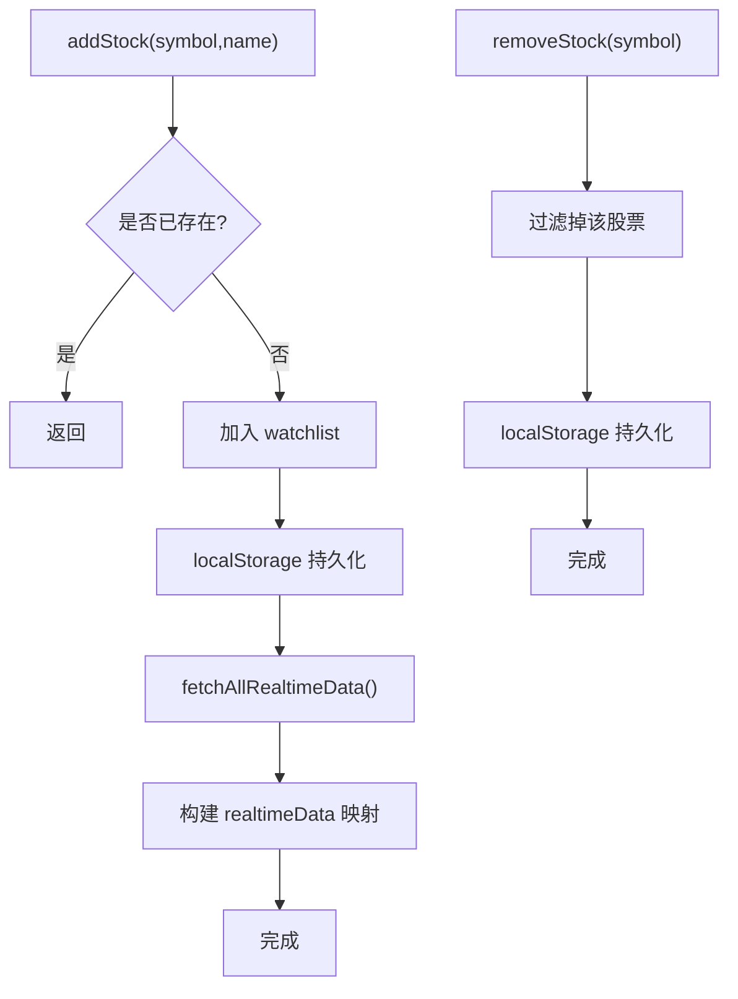
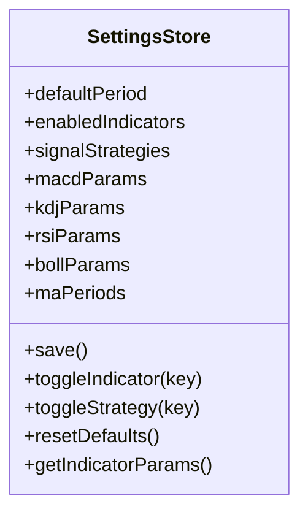
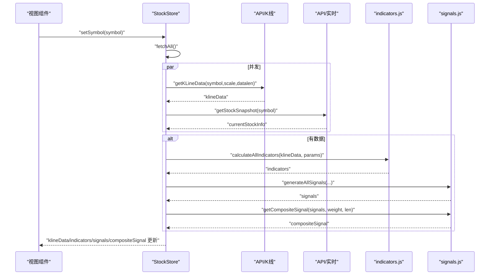
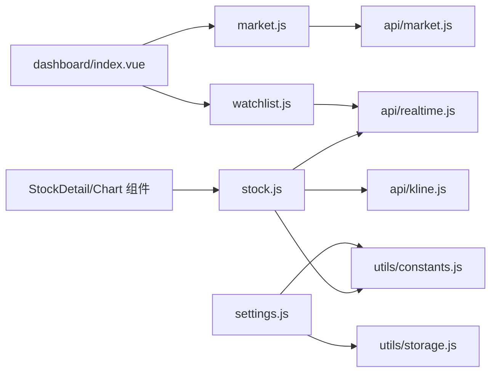

# 状态管理架构

<cite>
**本文引用的文件**
- [src/stores/index.js](file://src/stores/index.js)
- [src/stores/market.js](file://src/stores/market.js)
- [src/stores/settings.js](file://src/stores/settings.js)
- [src/stores/stock.js](file://src/stores/stock.js)
- [src/stores/watchlist.js](file://src/stores/watchlist.js)
- [src/utils/storage.js](file://src/utils/storage.js)
- [src/utils/constants.js](file://src/utils/constants.js)
- [src/main.js](file://src/main.js)
- [src/api/market.js](file://src/api/market.js)
- [src/api/kline.js](file://src/api/kline.js)
- [src/api/realtime.js](file://src/api/realtime.js)
- [src/views/dashboard/index.vue](file://src/views/dashboard/index.vue)
- [src/components/MarketIndexBar/index.vue](file://src/components/MarketIndexBar/index.vue)
- [src/components/KLineChart/index.vue](file://src/components/KLineChart/index.vue)
</cite>

## 目录
1. [简介](#简介)
2. [项目结构](#项目结构)
3. [核心组件](#核心组件)
4. [架构总览](#架构总览)
5. [详细组件分析](#详细组件分析)
6. [依赖关系分析](#依赖关系分析)
7. [性能考量](#性能考量)
8. [故障排查指南](#故障排查指南)
9. [结论](#结论)
10. [附录](#附录)

## 简介
本文件系统性阐述该量化交易项目的状态管理架构，基于 Pinia 的组合式 Store 设计与实现。文档覆盖 store 的组织结构、状态定义、Action 操作、Getter 计算属性；明确市场数据、股票数据、用户设置、自选股等 store 的职责边界；解释响应式更新机制、持久化策略与跨组件共享方式；并提供状态流转图、数据模型定义、状态同步机制说明，以及最佳实践与性能优化建议。

## 项目结构
项目采用“按功能域划分”的 store 组织方式，入口在根级 stores/index.js 中集中导出并挂载到应用实例。各 store 通过 defineStore 定义，内部使用 ref/computed 提供响应式状态与派生数据，Action 负责副作用与异步流程控制。

图表来源
- [src/main.js:1-17](file://src/main.js#L1-L17)
- [src/stores/index.js:1-11](file://src/stores/index.js#L1-L11)
- [src/stores/market.js:1-41](file://src/stores/market.js#L1-L41)
- [src/stores/stock.js:1-92](file://src/stores/stock.js#L1-L92)
- [src/stores/watchlist.js:1-53](file://src/stores/watchlist.js#L1-L53)
- [src/stores/settings.js:1-70](file://src/stores/settings.js#L1-L70)
- [src/utils/storage.js:1-21](file://src/utils/storage.js#L1-L21)
- [src/utils/constants.js:1-68](file://src/utils/constants.js#L1-L68)
- [src/api/market.js:1-46](file://src/api/market.js#L1-L46)
- [src/api/kline.js:1-27](file://src/api/kline.js#L1-L27)
- [src/api/realtime.js:1-56](file://src/api/realtime.js#L1-L56)
- [src/views/dashboard/index.vue:1-163](file://src/views/dashboard/index.vue#L1-L163)
- [src/components/MarketIndexBar/index.vue:1-87](file://src/components/MarketIndexBar/index.vue#L1-L87)
- [src/components/KLineChart/index.vue:1-285](file://src/components/KLineChart/index.vue#L1-L285)

章节来源
- [src/main.js:1-17](file://src/main.js#L1-L17)
- [src/stores/index.js:1-11](file://src/stores/index.js#L1-L11)

## 核心组件
- 应用初始化与 Pinia 注入：在应用入口完成 Pinia 实例创建与注册，确保全局可用。
- Store 导出：统一从 stores/index.js 导出 useSettingsStore/useWatchlistStore/useMarketStore/useStockStore，便于组件按需导入。
- 响应式基础：各 store 使用 ref 定义响应式状态，computed 定义派生数据（如 stock store 的 dates/closes）。
- Action 职责：封装异步数据拉取、计算与刷新逻辑；提供自动刷新定时器管理；提供保存与重置等设置类操作。
- Getter 行为：通过 computed 返回派生数据，避免在模板中重复计算；例如 stock store 的 dates/closes。

章节来源
- [src/stores/index.js:1-11](file://src/stores/index.js#L1-L11)
- [src/stores/market.js:1-41](file://src/stores/market.js#L1-L41)
- [src/stores/stock.js:1-92](file://src/stores/stock.js#L1-L92)
- [src/stores/watchlist.js:1-53](file://src/stores/watchlist.js#L1-L53)
- [src/stores/settings.js:1-70](file://src/stores/settings.js#L1-L70)

## 架构总览
本项目采用“Store 驱动视图”的架构模式：
- 视图组件通过 composables 方式获取 store 实例，直接读取响应式状态并在模板中绑定。
- 各 store 内部通过 Action 调用 API 层获取数据，完成本地计算（如指标与信号），并将结果写入响应式状态。
- Settings Store 负责用户偏好与默认参数，被其他 store 在计算阶段消费。
- Watchlist Store 与 Market Store 分别负责自选股列表与大盘指数/热门股票的实时行情，二者均支持定时刷新。
- Stock Store 负责单只股票的 K 线、指标、信号与综合信号，支持周期切换与自动刷新。

图表来源
- [src/views/dashboard/index.vue:101-109](file://src/views/dashboard/index.vue#L101-L109)
- [src/stores/market.js:19-33](file://src/stores/market.js#L19-L33)
- [src/stores/watchlist.js:37-45](file://src/stores/watchlist.js#L37-L45)
- [src/stores/stock.js:25-81](file://src/stores/stock.js#L25-L81)
- [src/api/market.js:7-45](file://src/api/market.js#L7-L45)
- [src/api/kline.js:9-26](file://src/api/kline.js#L9-L26)
- [src/api/realtime.js:39-55](file://src/api/realtime.js#L39-L55)

## 详细组件分析

### MarketStore（市场数据）
- 职责：维护大盘指数、热门股票列表与加载状态；提供一次性刷新与自动刷新能力。
- 状态：
  - indices：大盘指数数组
  - hotStocks：热门股票数组
  - loading：加载状态
- Action：
  - fetchIndices/fetchHotStocks：分别拉取指数与热门股票
  - refreshAll：并发刷新两者，并管理 loading
  - startAutoRefresh/stopAutoRefresh：定时器管理，周期 30 秒
- 依赖：调用 api/market.js 的接口；在 dashboard 页面挂载时启动自动刷新。

图表来源
- [src/stores/market.js:19-23](file://src/stores/market.js#L19-L23)

章节来源
- [src/stores/market.js:1-41](file://src/stores/market.js#L1-L41)
- [src/api/market.js:7-45](file://src/api/market.js#L7-L45)
- [src/views/dashboard/index.vue:101-109](file://src/views/dashboard/index.vue#L101-L109)

### WatchlistStore（自选股）
- 职责：维护自选股列表、实时行情映射与自动刷新；提供添加/移除/查询方法。
- 状态：
  - watchlist：自选股数组（含 symbol/name/addedAt）
  - realtimeData：symbol 到行情对象的映射
  - symbols：从 watchlist 派生的 symbol 数组
- Action：
  - addStock/removeStock/isWatched：管理自选股集合
  - fetchAllRealtimeData：批量获取实时行情并构建映射
  - startAutoRefresh/stopAutoRefresh：定时器管理，周期 15 秒
- 持久化：通过 utils/storage.js 将 watchlist 写入 localStorage。

图表来源
- [src/stores/watchlist.js:13-27](file://src/stores/watchlist.js#L13-L27)
- [src/stores/watchlist.js:29-35](file://src/stores/watchlist.js#L29-L35)
- [src/utils/storage.js:1-21](file://src/utils/storage.js#L1-L21)

章节来源
- [src/stores/watchlist.js:1-53](file://src/stores/watchlist.js#L1-L53)
- [src/utils/storage.js:1-21](file://src/utils/storage.js#L1-L21)

### SettingsStore（用户设置）
- 职责：管理用户偏好（默认周期、启用指标、信号策略、各指标参数），并提供保存/重置/切换等操作。
- 状态：
  - defaultPeriod、enabledIndicators、signalStrategies
  - 各指标参数（macdParams/kdjParams/rsiParams/bollParams/maPeriods）
- Action：
  - save：将全部设置写入 localStorage
  - toggleIndicator/toggleStrategy：增删启用项
  - resetDefaults：恢复默认值并保存
  - getIndicatorParams：聚合返回指标参数
- 持久化：通过 utils/storage.js 读写；默认值来自 utils/constants.js 的 DEFAULT_INDICATOR_PARAMS。

图表来源
- [src/stores/settings.js:6-68](file://src/stores/settings.js#L6-L68)
- [src/utils/storage.js:1-21](file://src/utils/storage.js#L1-L21)
- [src/utils/constants.js:39-45](file://src/utils/constants.js#L39-L45)

章节来源
- [src/stores/settings.js:1-70](file://src/stores/settings.js#L1-L70)
- [src/utils/storage.js:1-21](file://src/utils/storage.js#L1-L21)
- [src/utils/constants.js:39-45](file://src/utils/constants.js#L39-L45)

### StockStore（股票数据）
- 职责：管理单只股票的 K 线、指标、信号与综合信号；支持周期切换与自动刷新。
- 状态：
  - currentSymbol/currentStockInfo
  - klineData/klinePeriod
  - indicators/signals/compositeSignal
  - loading/error
- Computed：
  - closes/dates：从 klineData 派生
- Action：
  - setSymbol/setPeriod：设置标的与周期并触发数据拉取
  - fetchKLine：拉取 K 线并计算指标与信号
  - fetchRealtimeQuote：获取实时快照
  - computeIndicators/computeSignals：结合 SettingsStore 参数进行计算
  - fetchAll：并发拉取 K 线与实时行情
  - startAutoRefresh/stopAutoRefresh：每 10 秒刷新一次实时行情
- 依赖：api/kline.js、api/realtime.js、utils/indicators.js、utils/signals.js、utils/constants.js（PERIODS）。

图表来源
- [src/stores/stock.js:25-81](file://src/stores/stock.js#L25-L81)
- [src/api/kline.js:9-26](file://src/api/kline.js#L9-L26)
- [src/api/realtime.js:52-55](file://src/api/realtime.js#L52-L55)

章节来源
- [src/stores/stock.js:1-92](file://src/stores/stock.js#L1-L92)
- [src/utils/constants.js:29-36](file://src/utils/constants.js#L29-L36)

### 数据模型定义
- 市场指数条目：包含名称、代码、价格、涨跌额、涨跌幅、成交量、成交额、换手率、symbol 等字段。
- 热门股票条目：包含排名、名称、代码、价格、涨跌幅、涨跌额、成交量、成交额、换手率、symbol 等字段。
- K 线数据：包含日期、开盘、最高、最低、收盘、成交量等字段。
- 实时行情：包含名称、开盘、昨收、当前价、最高、最低、成交量、成交额、日期、时间、涨跌额、涨跌幅、symbol 等字段。
- 自选股条目：包含 symbol、name、addedAt 时间戳。
- 指标与信号：由计算模块生成，包含不同指标序列与买卖信号列表及综合信号。

章节来源
- [src/api/market.js:30-41](file://src/api/market.js#L30-L41)
- [src/api/kline.js:15-22](file://src/api/kline.js#L15-L22)
- [src/api/realtime.js:18-32](file://src/api/realtime.js#L18-L32)
- [src/stores/watchlist.js:15-16](file://src/stores/watchlist.js#L15-L16)

## 依赖关系分析
- 组件对 Store 的依赖：dashboard 视图依赖 MarketStore 与 WatchlistStore；K 线组件依赖 StockStore。
- Store 对 API 的依赖：MarketStore 依赖 api/market.js；StockStore 依赖 api/kline.js 与 api/realtime.js；WatchlistStore 依赖 api/realtime.js。
- Store 对工具的依赖：SettingsStore 依赖 utils/storage.js 与 utils/constants.js；StockStore 依赖 utils/constants.js（PERIODS）。
- 入口依赖：main.js 创建并注册 Pinia，stores/index.js 统一导出各 store。

图表来源
- [src/views/dashboard/index.vue:80-89](file://src/views/dashboard/index.vue#L80-L89)
- [src/stores/market.js:3](file://src/stores/market.js#L3)
- [src/stores/watchlist.js:4](file://src/stores/watchlist.js#L4)
- [src/stores/stock.js:3-8](file://src/stores/stock.js#L3-L8)
- [src/stores/settings.js:3-4](file://src/stores/settings.js#L3-L4)
- [src/utils/storage.js:1-21](file://src/utils/storage.js#L1-L21)
- [src/utils/constants.js:1-68](file://src/utils/constants.js#L1-L68)
- [src/api/market.js:1-46](file://src/api/market.js#L1-L46)
- [src/api/kline.js:1-27](file://src/api/kline.js#L1-L27)
- [src/api/realtime.js:1-56](file://src/api/realtime.js#L1-L56)

章节来源
- [src/main.js:1-17](file://src/main.js#L1-L17)
- [src/stores/index.js:1-11](file://src/stores/index.js#L1-L11)

## 性能考量
- 并发拉取：MarketStore 使用 Promise.all 并发刷新指数与热门股票；StockStore 在 setSymbol/setPeriod 中并发拉取 K 线与实时行情，减少等待时间。
- 自动刷新节流：MarketStore 30 秒、WatchlistStore 15 秒、StockStore 10 秒，避免频繁请求；在组件卸载时及时停止定时器。
- 计算复用：StockStore 将指标与信号计算拆分为独立 Action，便于按需触发；K 线组件通过深度监听 props 变化再渲染，避免不必要的重绘。
- 持久化策略：SettingsStore 与 WatchlistStore 使用 localStorage 持久化，减少初始化成本；注意键名前缀与 JSON 序列化容错。
- 图表渲染优化：K 线组件禁用动画、延迟初始化与 ResizeObserver 监听，降低首屏与窗口变化开销。

## 故障排查指南
- 加载状态异常：检查 MarketStore 的 loading 状态是否在并发请求前后正确切换；确认 Promise.all 的错误不会导致 loading 无法复位。
- 自动刷新未停止：确认组件 onUnmounted 生命周期中调用了对应 store 的 stopAutoRefresh。
- 实时行情缺失：检查 WatchlistStore 的 symbols 是否为空；确认批量请求返回的映射是否正确构建。
- K 线数据为空：检查 setSymbol/setPeriod 是否正确设置 currentSymbol/klinePeriod；确认 PERIODS 映射与 scale 参数一致。
- 设置不生效：确认 SettingsStore.save 是否被调用；检查 localStorage 写入是否成功；必要时调用 resetDefaults 恢复默认。
- 图表渲染问题：确认 ECharts 初始化时机与容器尺寸；检查 props 变更是否触发了 renderChart。

章节来源
- [src/stores/market.js:19-23](file://src/stores/market.js#L19-L23)
- [src/stores/watchlist.js:37-45](file://src/stores/watchlist.js#L37-L45)
- [src/stores/stock.js:74-81](file://src/stores/stock.js#L74-L81)
- [src/stores/settings.js:17-26](file://src/stores/settings.js#L17-L26)
- [src/components/KLineChart/index.vue:251-274](file://src/components/KLineChart/index.vue#L251-L274)

## 结论
该状态管理架构以 Pinia 为核心，围绕 Market/Watchlist/Stock/Settings 四大 store 形成清晰的职责边界：市场数据与热门股票、自选股与实时行情、单股票 K 线与衍生指标信号、用户偏好与默认参数。通过 Action 管理异步与定时任务，computed 提供高效派生数据，localStorage 实现轻量持久化。整体设计具备良好的可扩展性与可维护性，适合在量化场景中持续演进。

## 附录
- 最佳实践清单
  - 在组件生命周期中显式启动/停止自动刷新，避免内存泄漏。
  - 将计算密集型逻辑集中在 store 的 Action 中，保持模板简洁。
  - 使用 computed 缓存派生数据，避免重复计算。
  - 对外暴露稳定的 getter 接口，隐藏内部数据结构细节。
  - 对关键设置使用统一的 save/reset 流程，保证一致性。
- 性能优化建议
  - 合理设置自动刷新间隔，避免过度请求。
  - 对图表渲染进行防抖与节流，减少高频变更带来的重绘。
  - 使用 localStorage 时注意键名规范与 JSON 容错处理。
  - 对长列表与复杂计算引入分页或采样策略。