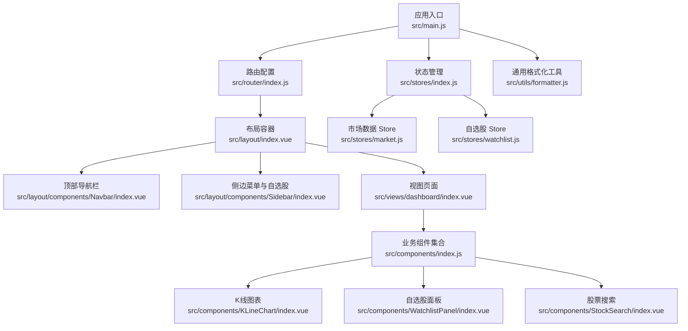
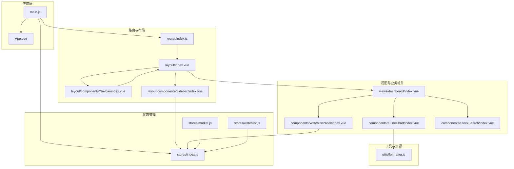
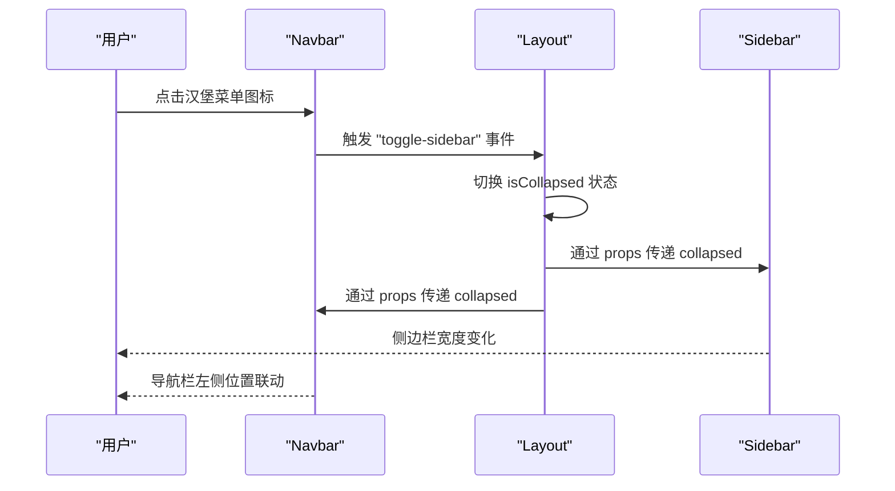
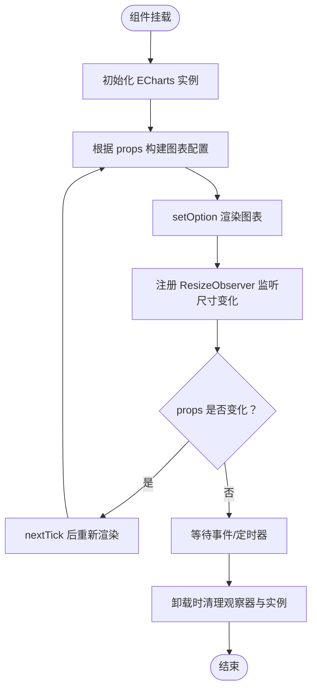
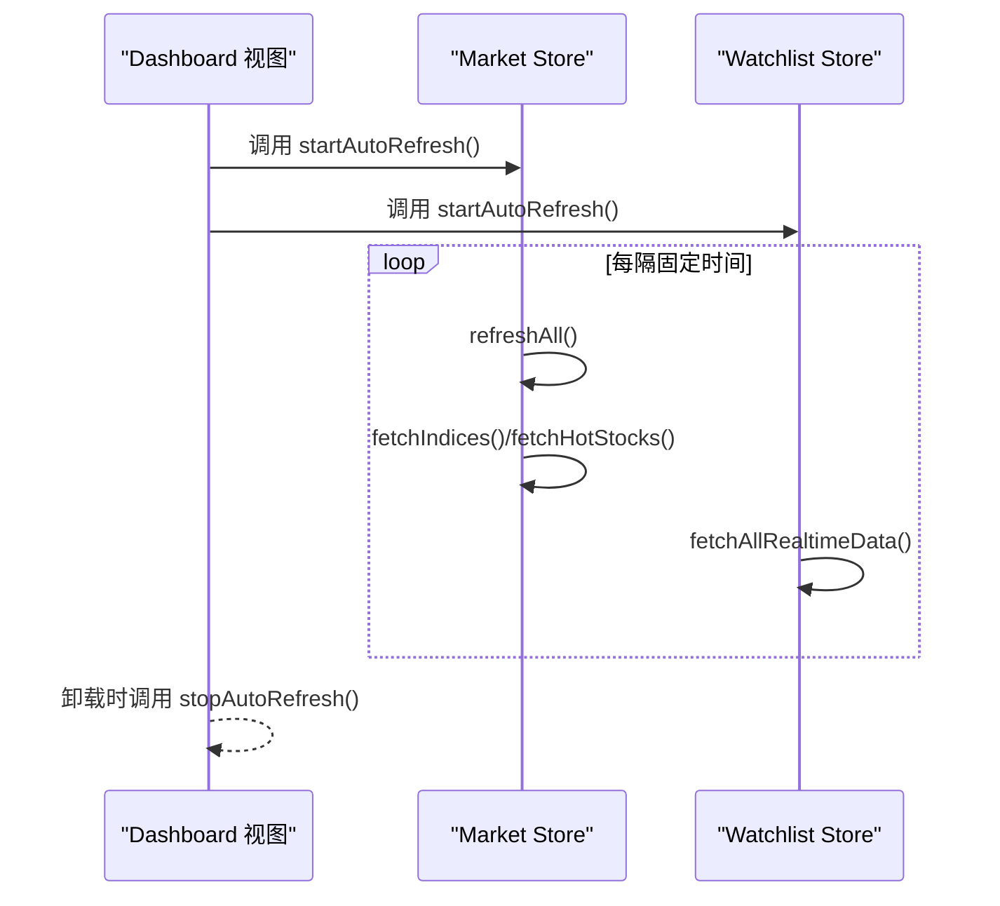
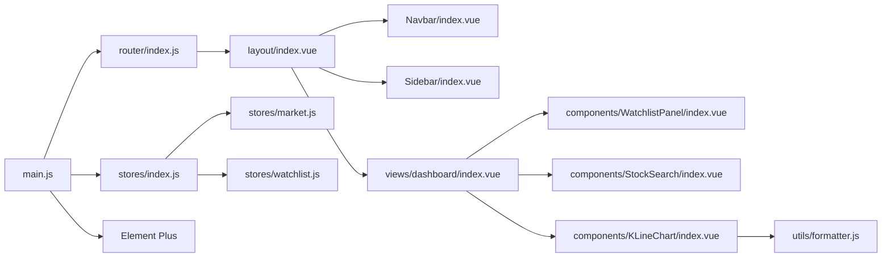

# 组件系统架构

<cite>
**本文档引用的文件**
- [src/App.vue](file://src/App.vue)
- [src/main.js](file://src/main.js)
- [src/layout/index.vue](file://src/layout/index.vue)
- [src/layout/components/Navbar/index.vue](file://src/layout/components/Navbar/index.vue)
- [src/layout/components/Sidebar/index.vue](file://src/layout/components/Sidebar/index.vue)
- [src/components/index.js](file://src/components/index.js)
- [src/components/KLineChart/index.vue](file://src/components/KLineChart/index.vue)
- [src/components/WatchlistPanel/index.vue](file://src/components/WatchlistPanel/index.vue)
- [src/components/StockSearch/index.vue](file://src/components/StockSearch/index.vue)
- [src/views/dashboard/index.vue](file://src/views/dashboard/index.vue)
- [src/stores/index.js](file://src/stores/index.js)
- [src/stores/market.js](file://src/stores/market.js)
- [src/stores/watchlist.js](file://src/stores/watchlist.js)
- [src/utils/formatter.js](file://src/utils/formatter.js)
- [src/router/index.js](file://src/router/index.js)
</cite>

## 目录
1. [简介](#简介)
2. [项目结构](#项目结构)
3. [核心组件](#核心组件)
4. [架构总览](#架构总览)
5. [详细组件分析](#详细组件分析)
6. [依赖分析](#依赖分析)
7. [性能考虑](#性能考虑)
8. [故障排除指南](#故障排除指南)
9. [结论](#结论)
10. [附录](#附录)

## 简介
本文件面向量化交易平台的前端组件系统，系统采用 Vue 3 + Pinia + Element Plus 技术栈，围绕“布局组件 + 业务组件 + UI 组件”的分层设计，结合 props 传递、事件发射、插槽与 provide/inject 的组合使用，实现清晰的组件边界与可复用性。同时，通过 Pinia 状态管理与路由守卫，完成数据驱动与页面导航的统一。

## 项目结构
项目采用按功能域划分的目录组织方式：布局层（layout）、视图层（views）、组件层（components）、状态层（stores）、工具层（utils）、路由层（router）与入口（main.js）。整体结构如下：

图表来源
- [src/main.js:1-17](file://src/main.js#L1-L17)
- [src/router/index.js:1-58](file://src/router/index.js#L1-L58)
- [src/layout/index.vue:1-61](file://src/layout/index.vue#L1-L61)
- [src/layout/components/Navbar/index.vue:1-128](file://src/layout/components/Navbar/index.vue#L1-L128)
- [src/layout/components/Sidebar/index.vue:1-172](file://src/layout/components/Sidebar/index.vue#L1-L172)
- [src/views/dashboard/index.vue:1-163](file://src/views/dashboard/index.vue#L1-L163)
- [src/components/index.js:1-22](file://src/components/index.js#L1-L22)
- [src/stores/index.js:1-11](file://src/stores/index.js#L1-L11)
- [src/stores/market.js:1-41](file://src/stores/market.js#L1-L41)
- [src/stores/watchlist.js:1-53](file://src/stores/watchlist.js#L1-L53)
- [src/utils/formatter.js:1-60](file://src/utils/formatter.js#L1-L60)

章节来源
- [src/main.js:1-17](file://src/main.js#L1-L17)
- [src/router/index.js:1-58](file://src/router/index.js#L1-L58)
- [src/layout/index.vue:1-61](file://src/layout/index.vue#L1-L61)

## 核心组件
- 布局组件
  - 应用根布局：负责整体布局与路由视图渲染，包含侧边栏折叠状态与页面切换动画。
  - 导航栏：显示当前页面标题、交易状态、时钟，向父级发出切换侧边栏事件。
  - 侧边栏：菜单导航、自选股列表展示与点击跳转。
- 业务组件
  - K线图表：基于 ECharts 的多指标可视化组件，支持动态指标开关与信号标注。
  - 自选股面板：展示自选股列表、实时报价、涨跌样式与移除操作。
  - 股票搜索：基于远程搜索的自动完成输入框，选择后跳转到个股详情页。
- 视图组件
  - 行情总览：整合大盘指数、热门股票、自选股等业务组件，协调定时刷新与交互。

章节来源
- [src/layout/index.vue:1-61](file://src/layout/index.vue#L1-L61)
- [src/layout/components/Navbar/index.vue:1-128](file://src/layout/components/Navbar/index.vue#L1-L128)
- [src/layout/components/Sidebar/index.vue:1-172](file://src/layout/components/Sidebar/index.vue#L1-L172)
- [src/components/KLineChart/index.vue:1-285](file://src/components/KLineChart/index.vue#L1-L285)
- [src/components/WatchlistPanel/index.vue:1-143](file://src/components/WatchlistPanel/index.vue#L1-L143)
- [src/components/StockSearch/index.vue:1-76](file://src/components/StockSearch/index.vue#L1-L76)
- [src/views/dashboard/index.vue:1-163](file://src/views/dashboard/index.vue#L1-L163)

## 架构总览
系统采用“布局容器 + 视图页面 + 业务组件 + UI 组件 + 状态管理 + 工具函数”的分层架构。组件间通过 props 下发数据、通过事件向上反馈、通过 Pinia 进行跨层级状态共享，通过路由进行页面导航与标题更新。

图表来源
- [src/App.vue:1-13](file://src/App.vue#L1-L13)
- [src/main.js:1-17](file://src/main.js#L1-L17)
- [src/router/index.js:1-58](file://src/router/index.js#L1-L58)
- [src/layout/index.vue:1-61](file://src/layout/index.vue#L1-L61)
- [src/layout/components/Navbar/index.vue:1-128](file://src/layout/components/Navbar/index.vue#L1-L128)
- [src/layout/components/Sidebar/index.vue:1-172](file://src/layout/components/Sidebar/index.vue#L1-L172)
- [src/views/dashboard/index.vue:1-163](file://src/views/dashboard/index.vue#L1-L163)
- [src/components/KLineChart/index.vue:1-285](file://src/components/KLineChart/index.vue#L1-L285)
- [src/components/WatchlistPanel/index.vue:1-143](file://src/components/WatchlistPanel/index.vue#L1-L143)
- [src/components/StockSearch/index.vue:1-76](file://src/components/StockSearch/index.vue#L1-L76)
- [src/stores/index.js:1-11](file://src/stores/index.js#L1-L11)
- [src/stores/market.js:1-41](file://src/stores/market.js#L1-L41)
- [src/stores/watchlist.js:1-53](file://src/stores/watchlist.js#L1-L53)
- [src/utils/formatter.js:1-60](file://src/utils/formatter.js#L1-L60)

## 详细组件分析

### 布局组件体系
- 根布局（layout/index.vue）
  - 职责：管理侧边栏折叠状态，承载路由视图并添加过渡动画；通过 v-slot 获取当前组件并以组件形式渲染。
  - 关键点：响应式控制主内容区左右边距，保证导航栏与侧边栏联动。
- 导航栏（layout/components/Navbar/index.vue）
  - 职责：显示页面标题、交易状态与时钟；通过 emit 向父级发送 toggle-sidebar 事件；内部使用定时器每秒更新时间与市场状态。
  - 通信：props 接收 collapsed；emit 触发父级状态变更。
- 侧边栏（layout/components/Sidebar/index.vue）
  - 职责：菜单导航、自选股列表展示与点击跳转；根据路由计算高亮菜单项；使用 watchlistStore 实时数据更新价格样式。
  - 通信：props 接收 collapsed；内部使用 useWatchlistStore 读取状态。

图表来源
- [src/layout/components/Navbar/index.vue:1-128](file://src/layout/components/Navbar/index.vue#L1-L128)
- [src/layout/index.vue:1-61](file://src/layout/index.vue#L1-L61)
- [src/layout/components/Sidebar/index.vue:1-172](file://src/layout/components/Sidebar/index.vue#L1-L172)

章节来源
- [src/layout/index.vue:1-61](file://src/layout/index.vue#L1-L61)
- [src/layout/components/Navbar/index.vue:1-128](file://src/layout/components/Navbar/index.vue#L1-L128)
- [src/layout/components/Sidebar/index.vue:1-172](file://src/layout/components/Sidebar/index.vue#L1-L172)

### 业务组件体系
- K线图表（components/KLineChart/index.vue）
  - 职责：接收 K 线数据、技术指标、信号列表与启用指标数组，构建 ECharts 配置并渲染；支持动态网格布局与数据缩放。
  - 数据流：props 输入 → buildOption 计算 → setOption 渲染；监听 props 变化触发重绘；暴露 resize 方法供外部调用。
  - 生命周期：onMounted 初始化图表与 ResizeObserver；onUnmounted 清理观察器与实例。
- 自选股面板（components/WatchlistPanel/index.vue）
  - 职责：展示自选股列表、实时报价与涨跌幅；提供刷新按钮与移除操作；点击行跳转至个股详情。
  - 状态：直接使用 useWatchlistStore 读取 watchlist 与 realtimeData。
- 股票搜索（components/StockSearch/index.vue）
  - 职责：远程搜索股票，自动完成展示；选择后清空关键词并跳转到个股详情页。
  - 通信：内部通过 useRouter 跳转；与视图层解耦。

图表来源
- [src/components/KLineChart/index.vue:1-285](file://src/components/KLineChart/index.vue#L1-L285)

章节来源
- [src/components/KLineChart/index.vue:1-285](file://src/components/KLineChart/index.vue#L1-L285)
- [src/components/WatchlistPanel/index.vue:1-143](file://src/components/WatchlistPanel/index.vue#L1-L143)
- [src/components/StockSearch/index.vue:1-76](file://src/components/StockSearch/index.vue#L1-L76)

### 视图组件与状态集成
- 行情总览（views/dashboard/index.vue）
  - 职责：聚合大盘指数、热门股票、自选股面板；在挂载时启动定时刷新，在卸载时停止；提供表格行点击跳转。
  - 状态：useMarketStore 与 useWatchlistStore；通过 store 方法控制刷新周期。
- 状态管理（stores/index.js、stores/market.js、stores/watchlist.js）
  - 职责：集中管理市场指数、热门股票、自选股列表与实时报价；提供定时拉取与本地存储；暴露 add/remove/isWatched 等方法。
  - 生命周期：startAutoRefresh/stopAutoRefresh 管理定时器；fetchAllRealtimeData 拉取最新报价。

图表来源
- [src/views/dashboard/index.vue:1-163](file://src/views/dashboard/index.vue#L1-L163)
- [src/stores/market.js:1-41](file://src/stores/market.js#L1-L41)
- [src/stores/watchlist.js:1-53](file://src/stores/watchlist.js#L1-L53)

章节来源
- [src/views/dashboard/index.vue:1-163](file://src/views/dashboard/index.vue#L1-L163)
- [src/stores/market.js:1-41](file://src/stores/market.js#L1-L41)
- [src/stores/watchlist.js:1-53](file://src/stores/watchlist.js#L1-L53)

### 组件通信机制
- Props 传递
  - 从父级向子级传递只读数据，如布局的 collapsed、图表的 klineData/indicators/signals/enabledIndicators/height。
- 事件发射
  - 子组件通过 emit 向父组件反馈交互，如 Navbar 的 toggle-sidebar。
- 插槽与模板引用
  - 布局通过 v-slot 获取当前组件并以组件形式渲染，实现页面切换动画。
- 依赖注入与全局状态
  - 通过 Pinia store 在任意层级共享状态，避免层层 props 下传；Element Plus 提供 UI 组件库能力。

章节来源
- [src/layout/components/Navbar/index.vue:1-128](file://src/layout/components/Navbar/index.vue#L1-L128)
- [src/layout/index.vue:1-61](file://src/layout/index.vue#L1-L61)
- [src/components/KLineChart/index.vue:1-285](file://src/components/KLineChart/index.vue#L1-L285)

### 组件树结构与复用策略
- 组件树结构
  - App → Layout → Dashboard → WatchlistPanel / StockSearch / KLineChart
  - Layout 内部包含 Navbar 与 Sidebar，二者通过 props/collapse 状态协同。
- 复用策略
  - 将通用 UI 逻辑抽象为独立组件（如 StockSearch），便于在多个视图中复用。
  - 使用 Pinia store 将跨页面状态抽取，减少重复请求与状态同步成本。
  - 通过工具函数（formatter）统一格式化逻辑，降低组件内样板代码。

章节来源
- [src/App.vue:1-13](file://src/App.vue#L1-L13)
- [src/layout/index.vue:1-61](file://src/layout/index.vue#L1-L61)
- [src/views/dashboard/index.vue:1-163](file://src/views/dashboard/index.vue#L1-L163)
- [src/components/index.js:1-22](file://src/components/index.js#L1-L22)

## 依赖分析
- 外部依赖
  - Vue 3、Element Plus、ECharts、Day.js、NProgress、Pinia。
- 内部依赖
  - main.js 注入 router、pinia、Element Plus；router 配置 Layout 作为根布局；layout 聚合 Navbar/Sidebar；views 调用 components；components 使用 stores 与 utils。

图表来源
- [src/main.js:1-17](file://src/main.js#L1-L17)
- [src/router/index.js:1-58](file://src/router/index.js#L1-L58)
- [src/layout/index.vue:1-61](file://src/layout/index.vue#L1-L61)
- [src/layout/components/Navbar/index.vue:1-128](file://src/layout/components/Navbar/index.vue#L1-L128)
- [src/layout/components/Sidebar/index.vue:1-172](file://src/layout/components/Sidebar/index.vue#L1-L172)
- [src/views/dashboard/index.vue:1-163](file://src/views/dashboard/index.vue#L1-L163)
- [src/components/WatchlistPanel/index.vue:1-143](file://src/components/WatchlistPanel/index.vue#L1-L143)
- [src/components/StockSearch/index.vue:1-76](file://src/components/StockSearch/index.vue#L1-L76)
- [src/components/KLineChart/index.vue:1-285](file://src/components/KLineChart/index.vue#L1-L285)
- [src/stores/index.js:1-11](file://src/stores/index.js#L1-L11)
- [src/stores/market.js:1-41](file://src/stores/market.js#L1-L41)
- [src/stores/watchlist.js:1-53](file://src/stores/watchlist.js#L1-L53)
- [src/utils/formatter.js:1-60](file://src/utils/formatter.js#L1-L60)

章节来源
- [src/main.js:1-17](file://src/main.js#L1-L17)
- [src/router/index.js:1-58](file://src/router/index.js#L1-L58)
- [src/stores/index.js:1-11](file://src/stores/index.js#L1-L11)

## 性能考虑
- 图表渲染优化
  - K线图表通过深度监听 props 并在 nextTick 中重绘，避免不必要的重绘；使用 ResizeObserver 监听容器尺寸变化，确保图表自适应。
- 状态刷新策略
  - Market 与 Watchlist Store 分别维护定时器，采用 Promise.all 并行拉取数据，减少刷新耗时；提供 stopAutoRefresh 以在组件卸载时释放资源。
- UI 交互优化
  - 导航栏时钟每秒更新，建议在后台标签页或隐藏场景下降频或暂停，避免不必要消耗。
- 资源加载
  - 路由采用异步加载视图组件，减少首屏体积；Element Plus 按需引入语言包与样式。

章节来源
- [src/components/KLineChart/index.vue:1-285](file://src/components/KLineChart/index.vue#L1-L285)
- [src/stores/market.js:1-41](file://src/stores/market.js#L1-L41)
- [src/stores/watchlist.js:1-53](file://src/stores/watchlist.js#L1-L53)
- [src/layout/components/Navbar/index.vue:1-128](file://src/layout/components/Navbar/index.vue#L1-L128)

## 故障排除指南
- 图表不显示或尺寸异常
  - 检查容器是否具有明确高度；确认 onMounted 后已初始化实例并注册 ResizeObserver；调用 expose 的 resize 方法手动触发重绘。
  - 参考路径：[src/components/KLineChart/index.vue:251-276](file://src/components/KLineChart/index.vue#L251-L276)
- 自选股列表为空或无实时数据
  - 确认本地存储中 watchlist 是否存在；检查 fetchAllRealtimeData 的定时器是否启动；核对后端接口返回格式。
  - 参考路径：[src/stores/watchlist.js:29-45](file://src/stores/watchlist.js#L29-L45)
- 页面切换动画不生效
  - 确认 Layout 中 router-view 的 v-slot 与 transition 配置正确；检查 CSS 动画类名。
  - 参考路径：[src/layout/index.vue:7-11](file://src/layout/index.vue#L7-L11)
- 导航栏时钟不更新
  - 检查 onMounted 定时器与 onUnmounted 清理逻辑；确认 isMarketOpen 与 formatTime 的调用时机。
  - 参考路径：[src/layout/components/Navbar/index.vue:42-49](file://src/layout/components/Navbar/index.vue#L42-L49)

章节来源
- [src/components/KLineChart/index.vue:251-276](file://src/components/KLineChart/index.vue#L251-L276)
- [src/stores/watchlist.js:29-45](file://src/stores/watchlist.js#L29-L45)
- [src/layout/index.vue:7-11](file://src/layout/index.vue#L7-L11)
- [src/layout/components/Navbar/index.vue:42-49](file://src/layout/components/Navbar/index.vue#L42-L49)

## 结论
该组件系统通过清晰的分层与职责划分，实现了布局、业务与 UI 的有效解耦；借助 Pinia 的状态管理与路由守卫，保障了数据一致性与用户体验。建议在后续迭代中进一步完善错误边界处理、性能监控与组件文档，持续提升系统的可维护性与扩展性。

## 附录
- 组件开发规范与最佳实践
  - Props 设计：保持单向数据流，尽量使用只读属性；对复杂对象使用默认值与类型校验。
  - 事件命名：使用 kebab-case，语义明确；避免在子组件中直接修改父组件状态。
  - 状态管理：将跨层级共享的状态放入 store；避免在组件内直接持久化数据。
  - 生命周期：在 onMounted 中初始化外部实例（如图表、定时器），在 onUnmounted 中统一清理。
  - 性能优化：对高频更新的数据使用防抖/节流；合理拆分组件，避免过度渲染。
  - 可测试性：将纯函数逻辑抽离到工具模块；组件内部尽量减少副作用。