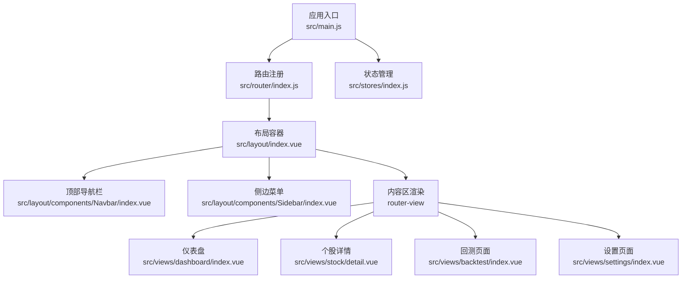
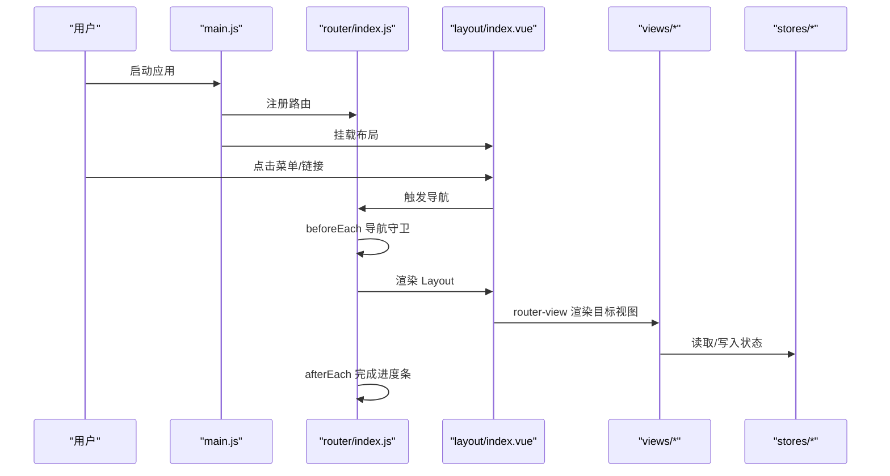
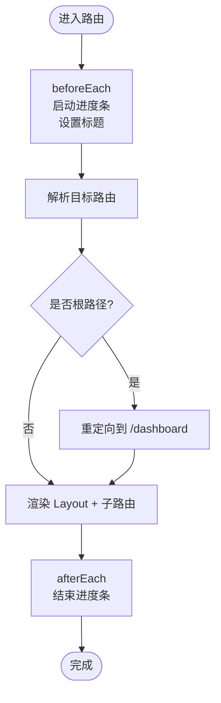
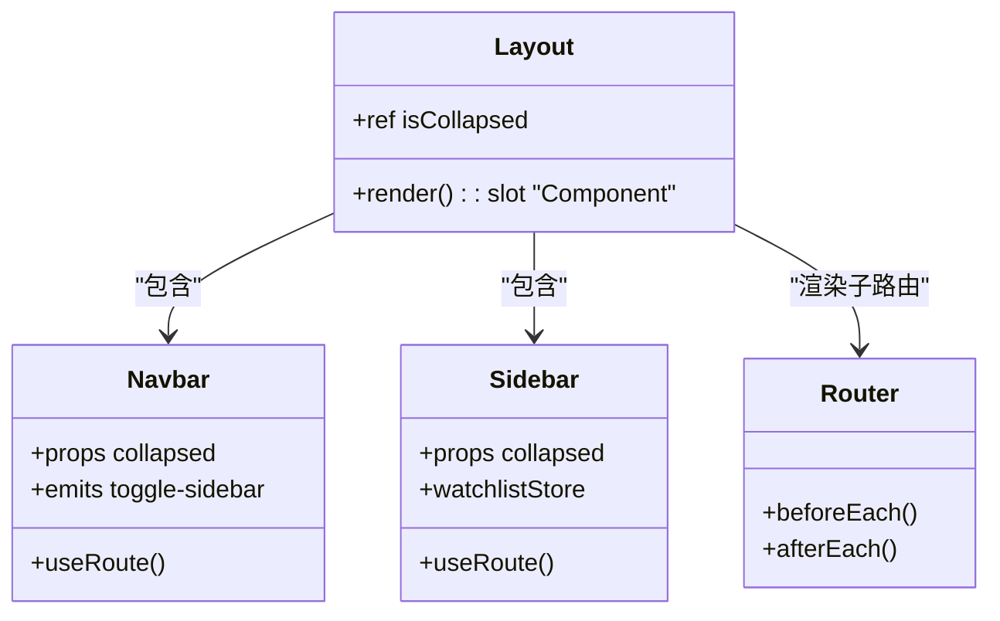
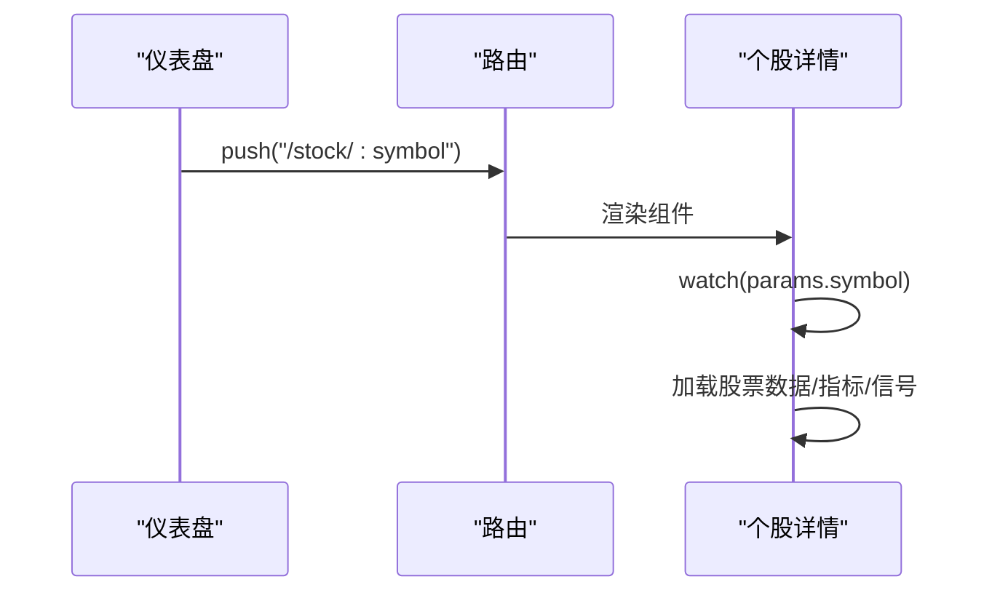
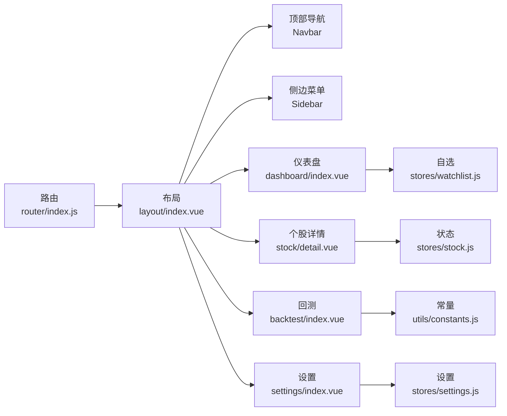
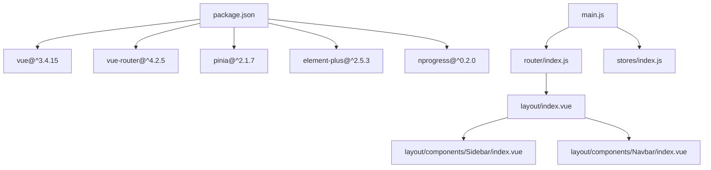

# 路由系统设计

<cite>
**本文引用的文件**
- [src/router/index.js](file://src/router/index.js)
- [src/main.js](file://src/main.js)
- [src/App.vue](file://src/App.vue)
- [src/layout/index.vue](file://src/layout/index.vue)
- [src/layout/components/Sidebar/index.vue](file://src/layout/components/Sidebar/index.vue)
- [src/layout/components/Navbar/index.vue](file://src/layout/components/Navbar/index.vue)
- [src/views/dashboard/index.vue](file://src/views/dashboard/index.vue)
- [src/views/stock/detail.vue](file://src/views/stock/detail.vue)
- [src/views/backtest/index.vue](file://src/views/backtest/index.vue)
- [src/views/settings/index.vue](file://src/views/settings/index.vue)
- [src/stores/index.js](file://src/stores/index.js)
- [src/stores/settings.js](file://src/stores/settings.js)
- [src/stores/watchlist.js](file://src/stores/watchlist.js)
- [src/utils/constants.js](file://src/utils/constants.js)
- [package.json](file://package.json)
</cite>

## 目录
1. [引言](#引言)
2. [项目结构](#项目结构)
3. [核心组件](#核心组件)
4. [架构总览](#架构总览)
5. [详细组件分析](#详细组件分析)
6. [依赖分析](#依赖分析)
7. [性能考虑](#性能考虑)
8. [故障排查指南](#故障排查指南)
9. [结论](#结论)
10. [附录](#附录)

## 引言
本设计文档面向量化交易平台的前端路由系统，围绕 Vue Router 的配置与实现展开，涵盖路由表定义、页面组件映射、导航守卫、懒加载、动态路由、嵌套路由、布局集成、面包屑与权限控制思路、路由流程图、页面跳转关系、路由参数传递、开发规范与 SEO 建议等内容。目标是帮助开发者在现有代码基础上进行扩展与维护。

## 项目结构
平台采用基于功能模块的目录组织方式：路由集中于 router 目录；布局组件位于 layout；页面视图位于 views；全局状态通过 Pinia stores 管理；工具常量位于 utils；入口在 main.js 注册路由与状态管理。

图表来源
- [src/main.js:1-17](file://src/main.js#L1-L17)
- [src/router/index.js:1-64](file://src/router/index.js#L1-L64)
- [src/layout/index.vue:1-61](file://src/layout/index.vue#L1-L61)
- [src/layout/components/Navbar/index.vue:1-128](file://src/layout/components/Navbar/index.vue#L1-L128)
- [src/layout/components/Sidebar/index.vue:1-176](file://src/layout/components/Sidebar/index.vue#L1-L176)
- [src/views/dashboard/index.vue:1-163](file://src/views/dashboard/index.vue#L1-L163)
- [src/views/stock/detail.vue:1-346](file://src/views/stock/detail.vue#L1-L346)
- [src/views/backtest/index.vue:1-242](file://src/views/backtest/index.vue#L1-L242)
- [src/views/settings/index.vue:1-135](file://src/views/settings/index.vue#L1-L135)

章节来源
- [src/main.js:1-17](file://src/main.js#L1-L17)
- [src/router/index.js:1-64](file://src/router/index.js#L1-L64)
- [src/layout/index.vue:1-61](file://src/layout/index.vue#L1-L61)

## 核心组件
- 路由器与导航守卫
  - 使用 createRouter 与 createWebHistory 创建路由实例。
  - 在 beforeEach 中启动进度条并设置页面标题；afterEach 结束进度条。
- 嵌套路由与布局
  - 根路径 '/' 对应 Layout 布局，子路由在 Layout 内部渲染。
  - 子路由包含仪表盘、个股详情（动态路由）、回测、设置、筛选记录等。
- 页面组件映射
  - 仪表盘、回测、设置、个股详情分别映射至对应视图组件。
  - 个股详情使用动态路由参数 :symbol 实现按股票跳转。
- 懒加载
  - 所有子路由组件均通过函数式 import 实现按需加载，提升首屏性能。
- 导航集成
  - 侧边菜单使用 Element Plus 的 el-menu，并开启 router 属性以启用菜单项点击跳转。
  - 顶部导航栏展示当前页面标题与市场状态。

章节来源
- [src/router/index.js:8-61](file://src/router/index.js#L8-L61)
- [src/layout/components/Sidebar/index.vue:7-31](file://src/layout/components/Sidebar/index.vue#L7-L31)
- [src/layout/components/Navbar/index.vue:8](file://src/layout/components/Navbar/index.vue#L8)

## 架构总览
下图展示了从应用入口到页面渲染的完整链路，以及布局与菜单如何参与路由渲染。

图表来源
- [src/main.js:10-16](file://src/main.js#L10-L16)
- [src/router/index.js:53-61](file://src/router/index.js#L53-L61)
- [src/layout/index.vue:7-11](file://src/layout/index.vue#L7-L11)
- [src/layout/components/Sidebar/index.vue:13](file://src/layout/components/Sidebar/index.vue#L13)

## 详细组件分析

### 路由表与导航守卫
- 路由表
  - 根路径 '/' 指向 Layout，并重定向到 '/dashboard'。
  - 子路由包括 dashboard、stock/:symbol、backtest、settings、screening。
  - meta 字段用于标题与图标等元信息。
- 导航守卫
  - beforeEach 启动进度条并设置 document.title。
  - afterEach 结束进度条。
- 动态路由
  - stock/:symbol 使用动态参数 symbol，用于个股详情页。
- 懒加载
  - 子路由组件通过函数式 import 实现按需加载。

图表来源
- [src/router/index.js:53-61](file://src/router/index.js#L53-L61)

章节来源
- [src/router/index.js:8-46](file://src/router/index.js#L8-L46)
- [src/router/index.js:53-61](file://src/router/index.js#L53-L61)

### 布局组件与页面渲染
- 布局容器
  - layout/index.vue 包含 Sidebar 与 Navbar，并通过 router-view 渲染子路由组件。
  - 使用过渡动画 fade 提升页面切换体验。
- 顶部导航栏
  - 显示当前页面标题（来自路由 meta.title）。
  - 展示市场状态与时钟。
- 侧边菜单
  - 使用 el-menu 并开启 router，菜单项直接跳转对应路径。
  - 根据当前路由高亮激活菜单；对 /stock/* 统一高亮到 /dashboard。

图表来源
- [src/layout/index.vue:17-23](file://src/layout/index.vue#L17-L23)
- [src/layout/components/Navbar/index.vue:21-30](file://src/layout/components/Navbar/index.vue#L21-L30)
- [src/layout/components/Sidebar/index.vue:57-72](file://src/layout/components/Sidebar/index.vue#L57-L72)
- [src/router/index.js:53-61](file://src/router/index.js#L53-L61)

章节来源
- [src/layout/index.vue:1-61](file://src/layout/index.vue#L1-L61)
- [src/layout/components/Navbar/index.vue:1-128](file://src/layout/components/Navbar/index.vue#L1-L128)
- [src/layout/components/Sidebar/index.vue:1-176](file://src/layout/components/Sidebar/index.vue#L1-L176)

### 页面跳转关系与路由参数传递
- 仪表盘到个股详情
  - 仪表盘中的热门股票表格点击后，通过 router.push 跳转到 /stock/:symbol。
- 个股详情参数
  - 通过 useRoute().params.symbol 获取当前股票代码。
  - 页面根据该参数加载数据并更新图表与信号。
- 设置页面参数
  - 设置页面通过 useSettingsStore 读取/保存指标参数与策略开关。
- 自选股跳转
  - 侧边栏“自选股”列表项点击时，通过 $router.push 跳转到个股详情。

图表来源
- [src/views/dashboard/index.vue:97-99](file://src/views/dashboard/index.vue#L97-L99)
- [src/views/stock/detail.vue:128-216](file://src/views/stock/detail.vue#L128-L216)
- [src/layout/components/Sidebar/index.vue:40](file://src/layout/components/Sidebar/index.vue#L40)

章节来源
- [src/views/dashboard/index.vue:97-99](file://src/views/dashboard/index.vue#L97-L99)
- [src/views/stock/detail.vue:128-216](file://src/views/stock/detail.vue#L128-L216)
- [src/layout/components/Sidebar/index.vue:33-53](file://src/layout/components/Sidebar/index.vue#L33-L53)

### 路由与布局、状态管理的集成
- 布局与路由
  - Layout 作为根级容器，内部通过 router-view 渲染子路由组件。
  - Navbar 读取当前路由 meta.title 作为页面标题。
- 状态管理
  - stores/index.js 统一导出各 store。
  - settings.js 提供指标参数、策略开关、默认周期等设置。
  - watchlist.js 提供自选股列表与实时行情刷新。
- 常量与默认值
  - utils/constants.js 提供周期、颜色、默认参数等常量，供设置页与图表组件使用。

图表来源
- [src/router/index.js:8-46](file://src/router/index.js#L8-L46)
- [src/layout/index.vue:1-61](file://src/layout/index.vue#L1-L61)
- [src/layout/components/Navbar/index.vue:32](file://src/layout/components/Navbar/index.vue#L32)
- [src/layout/components/Sidebar/index.vue:65-66](file://src/layout/components/Sidebar/index.vue#L65-L66)
- [src/views/dashboard/index.vue:87-89](file://src/views/dashboard/index.vue#L87-L89)
- [src/views/stock/detail.vue:128-131](file://src/views/stock/detail.vue#L128-L131)
- [src/views/backtest/index.vue:135](file://src/views/backtest/index.vue#L135)
- [src/stores/index.js:7-11](file://src/stores/index.js#L7-L11)
- [src/stores/settings.js:64-68](file://src/stores/settings.js#L64-L68)
- [src/stores/watchlist.js:47-51](file://src/stores/watchlist.js#L47-L51)
- [src/utils/constants.js:28-45](file://src/utils/constants.js#L28-L45)

章节来源
- [src/stores/index.js:1-11](file://src/stores/index.js#L1-L11)
- [src/stores/settings.js:1-70](file://src/stores/settings.js#L1-L70)
- [src/stores/watchlist.js:1-53](file://src/stores/watchlist.js#L1-L53)
- [src/utils/constants.js:1-68](file://src/utils/constants.js#L1-L68)

### 面包屑导航与权限控制（设计建议）
- 面包屑导航
  - 当前路由未实现面包屑组件。建议在 Layout 或 Navbar 中根据当前路由路径动态生成面包屑，结合 meta.title 与动态参数展示层级。
- 权限控制
  - 当前路由未实现鉴权守卫。建议在 beforeEach 中增加权限校验逻辑，例如检查登录状态、角色权限、路由 meta.requireAuth 等字段，未授权时跳转至登录页或提示。

[本节为概念性建议，不直接分析具体文件，故无章节来源]

## 依赖分析
- 外部依赖
  - vue、vue-router、pinia、element-plus、nprogress 等。
- 内部依赖
  - main.js 依赖 router 与 stores；router 依赖 layout；layout 依赖 sidebar 与 navbar；各 views 依赖 stores 与 utils。

图表来源
- [package.json:11-26](file://package.json#L11-L26)
- [src/main.js:10-16](file://src/main.js#L10-L16)
- [src/router/index.js:1-6](file://src/router/index.js#L1-L6)
- [src/layout/index.vue:19-20](file://src/layout/index.vue#L19-L20)

章节来源
- [package.json:1-28](file://package.json#L1-L28)
- [src/main.js:1-17](file://src/main.js#L1-L17)

## 性能考虑
- 懒加载
  - 子路由组件均采用函数式 import，减少初始包体积，提升首屏加载速度。
- 进度条
  - 使用 nprogress 在路由切换时显示加载状态，改善用户体验。
- 过渡动画
  - Layout 中的 router-view 使用淡入淡出过渡，避免页面闪烁。
- 自动刷新
  - 仪表盘与个股详情在挂载时启动自动刷新，在卸载时停止，避免内存泄漏。

[本节为通用指导，不直接分析具体文件，故无章节来源]

## 故障排查指南
- 页面标题未更新
  - 检查 beforeEach 是否正确设置 document.title 且 meta.title 存在。
- 路由跳转无效
  - 确认 el-menu 开启 router 属性；确认菜单 index 与路由 path 一致。
- 个股详情不显示数据
  - 检查 params.symbol 是否存在；确认 watch(route.params.symbol) 是否触发；确认 stores 中数据加载逻辑。
- 进度条不消失
  - 确认 afterEach 是否执行；确保所有导航分支都调用 next。

章节来源
- [src/router/index.js:53-61](file://src/router/index.js#L53-L61)
- [src/layout/components/Sidebar/index.vue:13](file://src/layout/components/Sidebar/index.vue#L13)
- [src/views/stock/detail.vue:214-216](file://src/views/stock/detail.vue#L214-L216)

## 结论
本路由系统以简洁的嵌套路由与懒加载为核心，配合布局组件与状态管理，实现了清晰的页面跳转与数据驱动。建议后续补充面包屑与权限控制，进一步完善用户体验与安全性。

## 附录

### 路由开发规范
- 路由命名
  - 使用语义化 name，如 Dashboard、StockDetail、Backtest、Settings、Screening。
- 路由路径
  - 使用短横线分隔的小写路径，动态参数使用 :param 形式。
- 元信息
  - 在 meta 中统一提供 title、icon 等信息，便于导航与标题设置。
- 导航守卫
  - 在 beforeEach 中处理通用逻辑（进度条、标题、权限），避免重复代码。
- 组件懒加载
  - 所有子路由组件均采用函数式 import，确保按需加载。

[本节为通用规范，不直接分析具体文件，故无章节来源]

### SEO 优化建议
- 页面标题
  - 在 meta.title 中提供明确标题，配合 beforeEach 设置 document.title。
- 动态标题
  - 对动态路由（如个股详情）可结合 params 与 store 数据动态拼接标题。
- 描述与关键词
  - 可在页面内通过 head 标签或插件注入 meta description 与 keywords。
- 结构化数据
  - 对重要页面（如个股详情）可考虑添加 JSON-LD 结构化数据，提升搜索引擎识别度。

[本节为通用建议，不直接分析具体文件，故无章节来源]