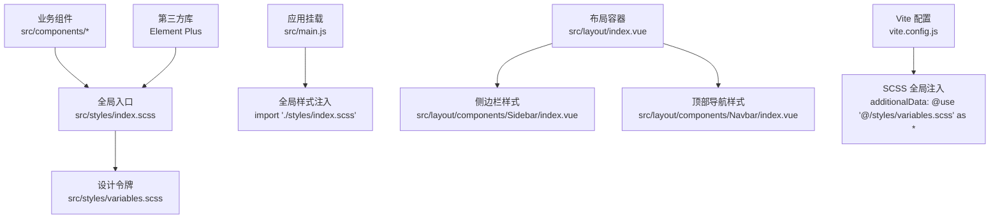
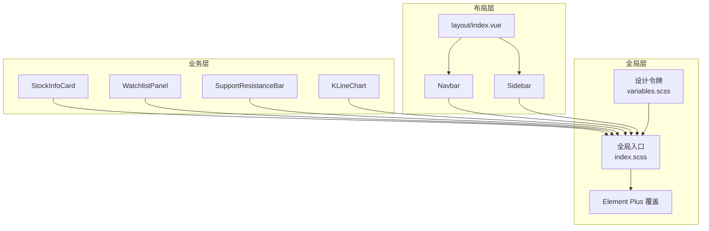
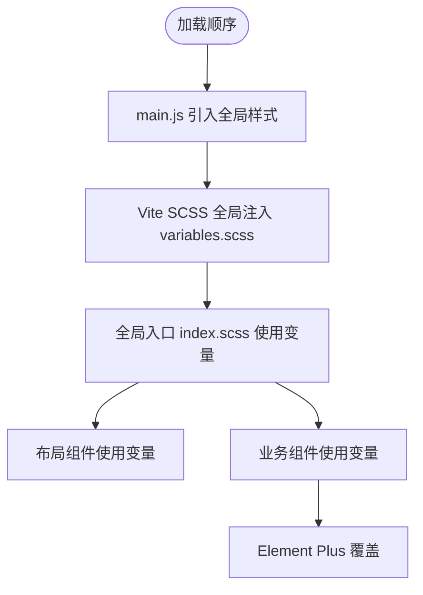
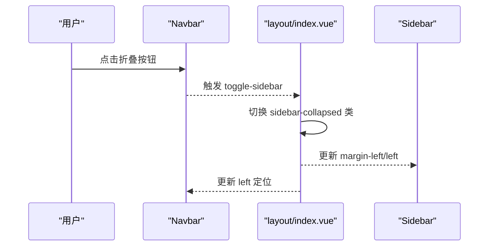
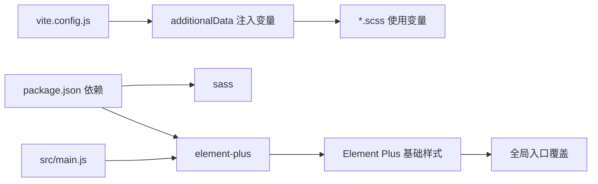

# 样式系统

<cite>
**本文引用的文件**
- [src/styles/index.scss](file://src/styles/index.scss)
- [src/styles/variables.scss](file://src/styles/variables.scss)
- [vite.config.js](file://vite.config.js)
- [package.json](file://package.json)
- [src/main.js](file://src/main.js)
- [src/layout/index.vue](file://src/layout/index.vue)
- [src/layout/components/Navbar/index.vue](file://src/layout/components/Navbar/index.vue)
- [src/layout/components/Sidebar/index.vue](file://src/layout/components/Sidebar/index.vue)
- [src/components/StockInfoCard/index.vue](file://src/components/StockInfoCard/index.vue)
- [src/components/WatchlistPanel/index.vue](file://src/components/WatchlistPanel/index.vue)
- [src/components/SupportResistanceBar/index.vue](file://src/components/SupportResistanceBar/index.vue)
- [src/components/KLineChart/index.vue](file://src/components/KLineChart/index.vue)
- [src/App.vue](file://src/App.vue)
</cite>

## 目录
1. [简介](#简介)
2. [项目结构](#项目结构)
3. [核心组件](#核心组件)
4. [架构总览](#架构总览)
5. [详细组件分析](#详细组件分析)
6. [依赖分析](#依赖分析)
7. [性能考虑](#性能考虑)
8. [故障排查指南](#故障排查指南)
9. [结论](#结论)
10. [附录](#附录)

## 简介
本文件系统性梳理量化交易平台的样式体系，覆盖以下方面：
- SCSS 预处理与配置：变量系统、模块化导入、全局样式入口
- CSS 架构设计：模块化组织、命名规范、BEM 方法论应用
- 主题定制系统：颜色、字体、间距等设计令牌
- 响应式与移动端适配：现有布局与可扩展建议
- 组件样式隔离：Vue 单文件组件 scoped 用法
- 第三方库集成：Element Plus 的主题覆盖与按需引入
- 性能优化与最佳实践：构建期优化、运行时渲染建议

## 项目结构
样式系统由三层构成：
- 全局样式入口：统一重置、基础排版、第三方覆盖
- 设计令牌（变量）：颜色、字体、间距、尺寸等
- 组件级样式：基于 scoped 的局部作用域样式



图表来源
- [src/styles/index.scss:1-64](file://src/styles/index.scss#L1-L64)
- [src/styles/variables.scss:1-24](file://src/styles/variables.scss#L1-L24)
- [src/main.js:8](file://src/main.js#L8)
- [vite.config.js:55-61](file://vite.config.js#L55-L61)
- [src/layout/index.vue:25-60](file://src/layout/index.vue#L25-L60)
- [src/layout/components/Navbar/index.vue:52-127](file://src/layout/components/Navbar/index.vue#L52-L127)
- [src/layout/components/Sidebar/index.vue:78-171](file://src/layout/components/Sidebar/index.vue#L78-L171)

章节来源
- [src/styles/index.scss:1-64](file://src/styles/index.scss#L1-L64)
- [src/styles/variables.scss:1-24](file://src/styles/variables.scss#L1-L24)
- [vite.config.js:55-61](file://vite.config.js#L55-L61)
- [src/main.js:8](file://src/main.js#L8)

## 核心组件
- 全局样式入口：统一重置、基础排版、第三方覆盖、滚动条与涨跌色块
- 设计令牌：颜色、字体、间距、尺寸等变量集中管理
- 布局组件：侧边栏、顶部导航、主内容区，均使用变量与 scoped 样式
- 业务组件：信息卡、自选股面板、支撑阻力条等，复用设计令牌与通用类名
- 图表组件：K 线图内部通过 ECharts 渲染，不直接依赖全局 SCSS 类名

章节来源
- [src/styles/index.scss:1-64](file://src/styles/index.scss#L1-L64)
- [src/styles/variables.scss:1-24](file://src/styles/variables.scss#L1-L24)
- [src/layout/index.vue:25-60](file://src/layout/index.vue#L25-L60)
- [src/layout/components/Navbar/index.vue:52-127](file://src/layout/components/Navbar/index.vue#L52-L127)
- [src/layout/components/Sidebar/index.vue:78-171](file://src/layout/components/Sidebar/index.vue#L78-L171)
- [src/components/StockInfoCard/index.vue:85-149](file://src/components/StockInfoCard/index.vue#L85-L149)
- [src/components/WatchlistPanel/index.vue:66-142](file://src/components/WatchlistPanel/index.vue#L66-L142)
- [src/components/SupportResistanceBar/index.vue:56-127](file://src/components/SupportResistanceBar/index.vue#L56-L127)
- [src/components/KLineChart/index.vue:279-284](file://src/components/KLineChart/index.vue#L279-L284)

## 架构总览
样式系统采用“变量驱动 + 组件隔离”的架构：
- 变量驱动：通过 Vite 的 SCSS 全局注入，所有样式文件可直接使用设计令牌
- 组件隔离：使用 Vue SFC 的 scoped，避免样式泄漏
- 第三方覆盖：在全局入口对 Element Plus 组件进行轻量覆盖
- 基础层：统一重置、基础排版、滚动条与涨跌色块



图表来源
- [src/styles/variables.scss:1-24](file://src/styles/variables.scss#L1-L24)
- [src/styles/index.scss:1-64](file://src/styles/index.scss#L1-L64)
- [src/layout/index.vue:25-60](file://src/layout/index.vue#L25-L60)
- [src/layout/components/Navbar/index.vue:52-127](file://src/layout/components/Navbar/index.vue#L52-L127)
- [src/layout/components/Sidebar/index.vue:78-171](file://src/layout/components/Sidebar/index.vue#L78-L171)
- [src/components/StockInfoCard/index.vue:85-149](file://src/components/StockInfoCard/index.vue#L85-L149)
- [src/components/WatchlistPanel/index.vue:66-142](file://src/components/WatchlistPanel/index.vue#L66-L142)
- [src/components/SupportResistanceBar/index.vue:56-127](file://src/components/SupportResistanceBar/index.vue#L56-L127)
- [src/components/KLineChart/index.vue:279-284](file://src/components/KLineChart/index.vue#L279-L284)

## 详细组件分析

### 全局样式入口与变量系统
- 全局入口负责：重置、基础排版、链接色、NProgress 覆盖、涨跌色块、通用卡片、滚动条、第三方覆盖
- 变量系统集中定义：主色、状态色、涨跌色、尺寸、背景、文本、边框、字体族
- Vite 通过 additionalData 将变量全局注入，无需在每个文件重复 @use



图表来源
- [src/main.js:8](file://src/main.js#L8)
- [vite.config.js:55-61](file://vite.config.js#L55-L61)
- [src/styles/index.scss:1-64](file://src/styles/index.scss#L1-L64)
- [src/styles/variables.scss:1-24](file://src/styles/variables.scss#L1-L24)

章节来源
- [src/styles/index.scss:1-64](file://src/styles/index.scss#L1-L64)
- [src/styles/variables.scss:1-24](file://src/styles/variables.scss#L1-L24)
- [vite.config.js:55-61](file://vite.config.js#L55-L61)
- [src/main.js:8](file://src/main.js#L8)

### 布局与导航样式
- 侧边栏与顶部导航使用变量控制宽度、高度、边框与过渡动画
- 通过父组件类名切换实现侧边栏折叠，影响布局与定位



图表来源
- [src/layout/components/Navbar/index.vue:4-7](file://src/layout/components/Navbar/index.vue#L4-L7)
- [src/layout/index.vue:22](file://src/layout/index.vue#L22)
- [src/layout/index.vue:41-43](file://src/layout/index.vue#L41-L43)
- [src/layout/components/Navbar/index.vue:68-70](file://src/layout/components/Navbar/index.vue#L68-L70)

章节来源
- [src/layout/index.vue:25-60](file://src/layout/index.vue#L25-L60)
- [src/layout/components/Navbar/index.vue:52-127](file://src/layout/components/Navbar/index.vue#L52-L127)
- [src/layout/components/Sidebar/index.vue:78-171](file://src/layout/components/Sidebar/index.vue#L78-L171)

### 业务组件样式与通用类名
- 信息卡、自选股面板、支撑阻力条等组件广泛使用变量与通用类名（如涨跌色块）
- 通用卡片类名用于统一卡片风格，减少重复定义

```mermaid
classDiagram
class StockInfoCard {
"+使用变量<br/>$border-color 等"
"+使用通用类名<br/>.price-up/.price-down"
}
class WatchlistPanel {
"+使用变量<br/>$border-color 等"
"+hover 效果<br/>过渡动画"
}
class SupportResistanceBar {
"+使用变量<br/>$success-color/$danger-color/$primary-color"
"+涨跌色块<br/>.resistance/.support/.current"
}
StockInfoCard --> "使用" Variables["variables.scss"]
WatchlistPanel --> "使用" Variables
SupportResistanceBar --> "使用" Variables
```

图表来源
- [src/components/StockInfoCard/index.vue:85-149](file://src/components/StockInfoCard/index.vue#L85-L149)
- [src/components/WatchlistPanel/index.vue:66-142](file://src/components/WatchlistPanel/index.vue#L66-L142)
- [src/components/SupportResistanceBar/index.vue:56-127](file://src/components/SupportResistanceBar/index.vue#L56-L127)
- [src/styles/variables.scss:1-24](file://src/styles/variables.scss#L1-L24)

章节来源
- [src/components/StockInfoCard/index.vue:85-149](file://src/components/StockInfoCard/index.vue#L85-L149)
- [src/components/WatchlistPanel/index.vue:66-142](file://src/components/WatchlistPanel/index.vue#L66-L142)
- [src/components/SupportResistanceBar/index.vue:56-127](file://src/components/SupportResistanceBar/index.vue#L56-L127)

### 图表组件样式隔离
- 图表组件内部使用 ECharts 渲染，样式通过 ECharts 配置项控制；组件自身仅保留最小必要样式，避免与全局样式耦合
- 组件使用 scoped，确保样式不外溢

章节来源
- [src/components/KLineChart/index.vue:279-284](file://src/components/KLineChart/index.vue#L279-L284)
- [src/components/KLineChart/index.vue:243-249](file://src/components/KLineChart/index.vue#L243-L249)

### 第三方库集成：Element Plus 主题覆盖
- 在全局入口对 Element Plus 的卡片圆角进行统一覆盖
- 应用启动时引入 Element Plus 中文语言包与基础样式

章节来源
- [src/styles/index.scss:60-63](file://src/styles/index.scss#L60-L63)
- [src/main.js:2-4](file://src/main.js#L2-L4)

## 依赖分析
- 构建工具：Vite 通过 css.preprocessorOptions.scss.additionalData 注入变量
- 运行时：Element Plus 作为 UI 基础库，配合本地覆盖
- 样式隔离：Vue SFC scoped 保证组件样式边界



图表来源
- [package.json:11-26](file://package.json#L11-L26)
- [vite.config.js:55-61](file://vite.config.js#L55-L61)
- [src/main.js:2-4](file://src/main.js#L2-L4)
- [src/styles/index.scss:60-63](file://src/styles/index.scss#L60-L63)

章节来源
- [package.json:11-26](file://package.json#L11-L26)
- [vite.config.js:55-61](file://vite.config.js#L55-L61)
- [src/main.js:2-4](file://src/main.js#L2-L4)

## 性能考虑
- 减少全局选择器与深层嵌套，降低样式计算复杂度
- 合理拆分样式文件，避免单文件过大
- 使用变量与混入替代重复代码，提升维护效率
- 对第三方组件的覆盖尽量轻量，避免过度样式重绘
- 在组件内使用 scoped，减少样式冲突与回流

## 故障排查指南
- 变量未生效：确认 Vite 的 additionalData 是否正确注入变量文件
- 样式覆盖无效：检查 Element Plus 覆盖是否在全局入口且优先级足够
- 组件样式泄漏：检查是否使用了 scoped 或作用域选择器
- 字体或字号异常：核对全局入口中的字体与字号变量

章节来源
- [vite.config.js:55-61](file://vite.config.js#L55-L61)
- [src/styles/index.scss:1-64](file://src/styles/index.scss#L1-L64)
- [src/layout/index.vue:25-60](file://src/layout/index.vue#L25-L60)

## 结论
该样式系统以变量为核心、以组件为边界，结合 Vite 的全局 SCSS 注入与 Element Plus 的轻量覆盖，形成了清晰、可维护、可扩展的前端样式基线。建议后续在保持现有架构的前提下，逐步引入响应式断点与更完善的 BEM 命名规范，并对图表组件进行更细粒度的样式隔离与主题化。

## 附录
- 命名规范建议（概念性说明）
  - 基类：语义化命名，如 .stat-card
  - 组件：前缀区分，如 .kline-chart
  - 状态：以 .is-* 或 .has-* 表示，如 .sidebar-collapsed
  - 上下文：以父选择器限定，如 .navbar .page-title
- 响应式断点建议（概念性说明）
  - 移动端：≤768px
  - 平板：769px–1024px
  - 桌面端：>1024px
  - 断点命名：$breakpoint-mobile、$breakpoint-tablet、$breakpoint-desktop
- BEM 示例（概念性说明）
  - Block：.watchlist-panel
  - Element：.watchlist-panel__header
  - Modifier：.watchlist-panel--collapsed