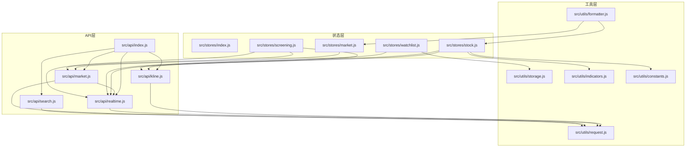
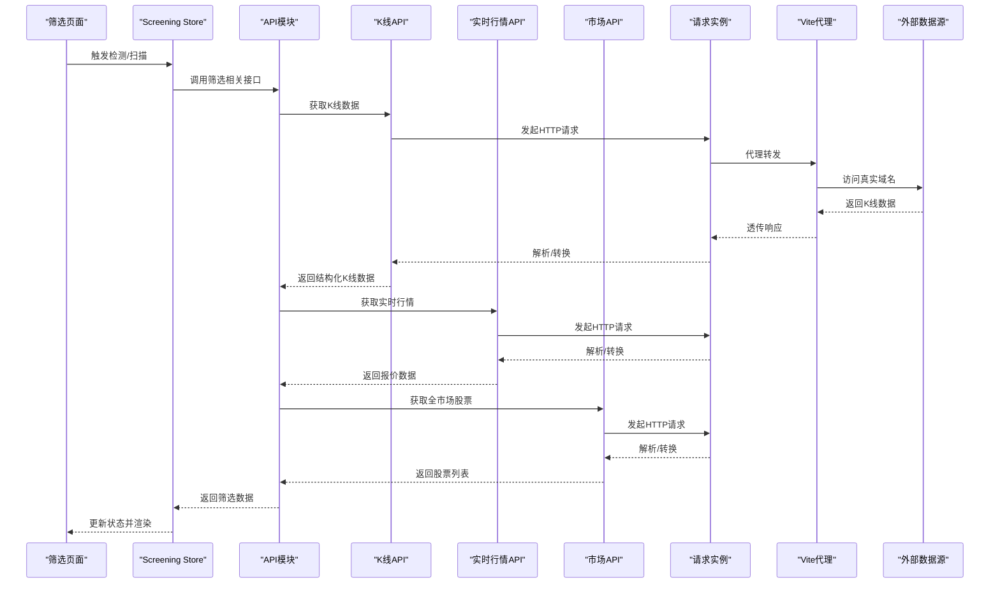
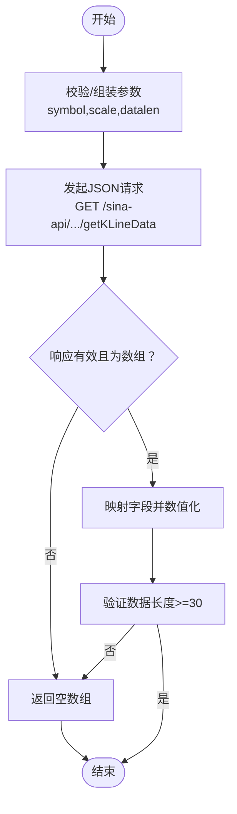
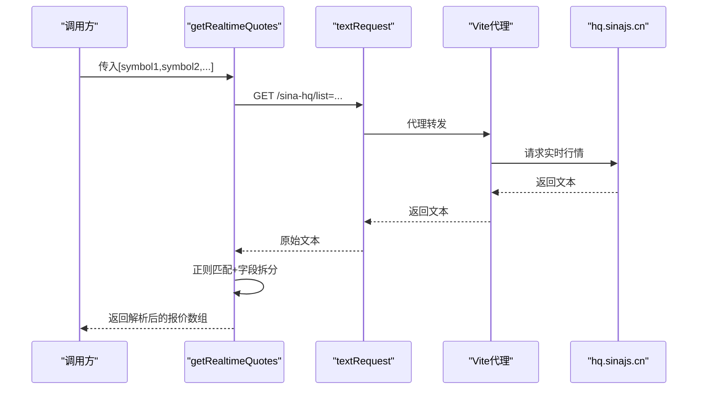
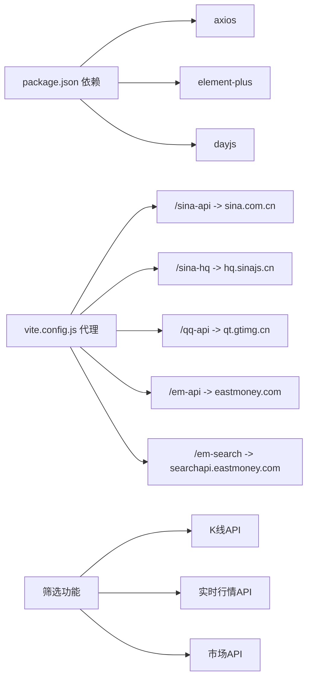

# API数据层

<cite>
**本文引用的文件**
- [src/api/index.js](file://src/api/index.js)
- [src/api/kline.js](file://src/api/kline.js)
- [src/api/market.js](file://src/api/market.js)
- [src/api/realtime.js](file://src/api/realtime.js)
- [src/api/search.js](file://src/api/search.js)
- [src/utils/request.js](file://src/utils/request.js)
- [src/utils/storage.js](file://src/utils/storage.js)
- [src/stores/index.js](file://src/stores/index.js)
- [src/stores/market.js](file://src/stores/market.js)
- [src/stores/stock.js](file://src/stores/stock.js)
- [src/stores/watchlist.js](file://src/stores/watchlist.js)
- [src/stores/screening.js](file://src/stores/screening.js)
- [src/utils/constants.js](file://src/utils/constants.js)
- [src/utils/formatter.js](file://src/utils/formatter.js)
- [src/utils/indicators.js](file://src/utils/indicators.js)
- [src/views/screening/index.vue](file://src/views/screening/index.vue)
- [src/views/stock/detail.vue](file://src/views/stock/detail.vue)
- [vite.config.js](file://vite.config.js)
- [package.json](file://package.json)
</cite>

## 更新摘要
**变更内容**
- 增强股票搜索功能的过滤逻辑和数据验证机制
- 改进市场数据接口的错误处理和数据结构
- 完善筛选功能的数据验证、过滤和本地存储机制
- 优化API请求的异常处理和降级策略
- 增强数据格式验证和边界条件处理

## 目录
1. [简介](#简介)
2. [项目结构](#项目结构)
3. [核心组件](#核心组件)
4. [架构总览](#架构总览)
5. [详细组件分析](#详细组件分析)
6. [依赖关系分析](#依赖关系分析)
7. [性能考虑](#性能考虑)
8. [故障排查指南](#故障排查指南)
9. [结论](#结论)
10. [附录](#附录)

## 简介
本文件系统性梳理量化交易平台的数据层API设计与实现，覆盖以下方面：
- 接口职责与调用流程：K线数据、实时行情、股票搜索、市场数据（大盘指数、热门股）、筛选功能中的API使用。
- 请求封装与错误处理：统一的请求实例、拦截器、错误提示与降级返回。
- 数据格式与参数校验：输入参数、返回字段、数据清洗与转换。
- 缓存与本地存储：浏览器本地存储、定时刷新与去抖策略。
- 性能优化：批量请求、并发控制、自动刷新节流。
- 安全与跨域：Vite代理与Referer头设置。
- 扩展指南：新增数据源与接口类型的接入步骤。

## 项目结构
数据层主要由"API模块 + 工具模块 + 状态管理"三部分组成：
- API模块：封装各路数据源的HTTP请求与数据转换。
- 工具模块：请求实例、本地存储、格式化、技术指标与常量。
- 状态管理：Pinia Store负责数据聚合、自动刷新与跨组件共享。

**图表来源**
- [src/api/index.js:1-5](file://src/api/index.js#L1-L5)
- [src/api/kline.js:1-27](file://src/api/kline.js#L1-L27)
- [src/api/realtime.js:1-56](file://src/api/realtime.js#L1-L56)
- [src/api/search.js:1-38](file://src/api/search.js#L1-L38)
- [src/api/market.js:1-46](file://src/api/market.js#L1-L46)
- [src/utils/request.js:1-29](file://src/utils/request.js#L1-L29)
- [src/utils/storage.js:1-21](file://src/utils/storage.js#L1-L21)
- [src/stores/market.js:1-41](file://src/stores/market.js#L1-L41)
- [src/stores/stock.js:1-92](file://src/stores/stock.js#L1-L92)
- [src/stores/watchlist.js:1-53](file://src/stores/watchlist.js#L1-L53)
- [src/stores/screening.js:1-212](file://src/stores/screening.js#L1-L212)
- [src/utils/formatter.js:1-60](file://src/utils/formatter.js#L1-L60)
- [src/utils/indicators.js:1-245](file://src/utils/indicators.js#L1-L245)
- [src/utils/constants.js:1-68](file://src/utils/constants.js#L1-L68)

**章节来源**
- [src/api/index.js:1-5](file://src/api/index.js#L1-L5)
- [src/stores/index.js:1-11](file://src/stores/index.js#L1-L11)

## 核心组件
- API导出入口：集中导出各模块的对外接口，便于组件按需引入。
- 请求封装：基于Axios创建JSON与文本两类请求实例，统一超时、响应类型与错误拦截。
- 数据转换：对第三方返回进行字段映射、类型转换与过滤。
- 自动刷新：定时器驱动的轮询策略，避免频繁重复请求。
- 本地存储：统一前缀的localStorage读写，持久化自选列表。
- **筛选功能集成**：K线数据与实时行情在筛选功能中被广泛使用，支持全网扫描和自选股检测。

**章节来源**
- [src/api/index.js:1-5](file://src/api/index.js#L1-L5)
- [src/utils/request.js:1-29](file://src/utils/request.js#L1-L29)
- [src/utils/storage.js:1-21](file://src/utils/storage.js#L1-L21)
- [src/stores/watchlist.js:1-53](file://src/stores/watchlist.js#L1-L53)
- [src/stores/screening.js:1-212](file://src/stores/screening.js#L1-L212)

## 架构总览
数据从API层经Store聚合，再由组件消费；同时通过定时器实现增量更新与离线兜底。筛选功能通过API层获取K线数据和实时行情，结合技术指标生成买卖信号。

**图表来源**
- [src/views/screening/index.vue:304-347](file://src/views/screening/index.vue#L304-L347)
- [src/api/kline.js:9-26](file://src/api/kline.js#L9-L26)
- [src/api/realtime.js:39-55](file://src/api/realtime.js#L39-L55)
- [src/api/market.js:15-47](file://src/api/market.js#L15-L47)
- [src/utils/request.js:1-29](file://src/utils/request.js#L1-L29)
- [vite.config.js:15-52](file://vite.config.js#L15-L52)

## 详细组件分析

### K线数据接口（getKLineData）
- 功能：从新浪财经获取指定周期与长度的K线数据，返回标准化数组。
- 参数：
  - symbol：股票代码（如 sz000001），字符串。
  - scale：周期，默认240（日K），支持5/15/30/60/240/1200。
  - datalen：数据条数，默认300。
- 返回：数组，每项包含日期、开盘、最高、最低、收盘、成交量等数值字段。
- 错误处理：异常时返回空数组，保证UI稳定。
- 数据转换：将字符串转为数值，确保后续指标计算可用。
- **筛选功能使用**：在筛选功能中用于获取100条日K线数据进行技术指标计算。

**图表来源**
- [src/api/kline.js:9-26](file://src/api/kline.js#L9-L26)
- [src/views/screening/index.vue:306-308](file://src/views/screening/index.vue#L306-L308)

**章节来源**
- [src/api/kline.js:1-27](file://src/api/kline.js#L1-L27)
- [src/views/screening/index.vue:306-308](file://src/views/screening/index.vue#L306-L308)

### 实时行情接口（getRealtimeQuotes / getStockSnapshot）
- 批量接口：getRealtimeQuotes(symbols[])，将多个股票代码拼接为列表，一次请求返回文本，再逐个解析。
- 单只快照：getStockSnapshot(symbol)，内部调用批量接口取首项。
- 解析逻辑：根据正则匹配对应股票的行情文本，拆分字段并计算涨跌额与涨跌幅。
- 返回字段：名称、开盘、昨收、现价、最高、最低、成交量、成交额、日期、时间、涨跌额、涨跌幅、symbol。
- 错误处理：异常或字段不完整时返回空数组/空对象。
- **筛选功能使用**：在筛选功能中用于获取最新股价，作为买入信号的价格参考。

**图表来源**
- [src/api/realtime.js:7-47](file://src/api/realtime.js#L7-L47)
- [src/utils/request.js:10-15](file://src/utils/request.js#L10-L15)
- [vite.config.js:24-31](file://vite.config.js#L24-L31)

**章节来源**
- [src/api/realtime.js:1-56](file://src/api/realtime.js#L1-L56)
- [src/views/screening/index.vue:321-323](file://src/views/screening/index.vue#L321-L323)

### 股票搜索接口（searchStocks）
- 功能：通过东方财富搜索接口，返回匹配的股票列表。
- 参数：keyword，非空字符串。
- 返回：数组，每项包含代码、名称、市场标识（sh/sz）、symbol。
- 过滤规则：仅保留A股主板/创业板/科创板代码（6/0/3开头6位数字）。
- 数据验证：增加严格的格式验证和过滤逻辑，确保返回数据的有效性。
- 错误处理：异常时记录日志并返回空数组。

**更新** 增强了过滤逻辑和数据验证机制，增加了对A股代码的严格验证

**章节来源**
- [src/api/search.js:1-38](file://src/api/search.js#L1-L38)

### 市场数据接口（getMarketIndices / getHotStocks）
- 大盘指数：直接复用实时行情接口，获取上证、深证、创业板指数。
- 热门股票：调用东方财富接口，按成交额排序，返回前若干条，映射为统一结构。
- 全市场股票：调用东方财富接口，按总市值排序，返回前N只股票，用于全网扫描。
- 并发策略：Store中使用Promise.all并行拉取指数与热门榜，减少总等待时间。
- **数据验证**：改进了错误处理机制，确保在API异常时返回空数组而非抛出异常。

**更新** 改进了错误处理和数据结构验证

**章节来源**
- [src/api/market.js:1-46](file://src/api/market.js#L1-L46)
- [src/stores/market.js:19-23](file://src/stores/market.js#L19-L23)

### 筛选功能API集成
- **全网扫描**：使用getAllStocks获取全市场股票列表，然后对每个股票调用detectStockSignal进行信号检测。
- **自选股检测**：直接对watchlist中的股票调用detectStockSignal进行信号检测。
- **信号检测流程**：获取K线数据 → 计算技术指标 → 生成买卖信号 → 获取最新股价 → 组装筛选结果。
- **数据持久化**：检测到的信号通过screeningStore.addStock保存到本地存储。
- **数据验证**：增强了数据验证机制，包括重复检测、格式验证和边界条件处理。

**更新** 增强了数据验证和过滤逻辑，完善了本地存储机制

**章节来源**
- [src/views/screening/index.vue:397-448](file://src/views/screening/index.vue#L397-L448)
- [src/views/screening/index.vue:350-395](file://src/views/screening/index.vue#L350-L395)
- [src/stores/screening.js:108-145](file://src/stores/screening.js#L108-L145)

### 请求封装与错误处理
- JSON请求实例：默认JSON响应、15秒超时。
- 文本请求实例：默认文本响应、15秒超时，禁用默认响应转换以保留原始文本。
- 全局错误拦截：根据响应状态或网络错误/超时给出用户提示消息，统一reject以便上层捕获。
- **异常处理**：改进了异常处理机制，增加了更详细的错误信息和降级策略。

**更新** 增强了异常处理和降级策略

**章节来源**
- [src/utils/request.js:1-29](file://src/utils/request.js#L1-L29)

### 本地存储与自选管理
- 存储接口：统一前缀的local.get/set/remove。
- 自选列表：持久化保存watchlist，支持增删查，启动时从localStorage恢复。
- 实时行情：按符号集合批量拉取，构建symbol->报价的映射表，供组件快速查询。
- **筛选数据**：screeningStore使用localStorage保存筛选历史，支持最近5个交易日的数据保留。
- **数据清理**：增加了自动清理过期数据的功能，确保存储空间的有效利用。

**更新** 增强了数据清理和验证机制

**章节来源**
- [src/utils/storage.js:1-21](file://src/utils/storage.js#L1-L21)
- [src/stores/watchlist.js:1-53](file://src/stores/watchlist.js#L1-L53)
- [src/stores/screening.js:4-6](file://src/stores/screening.js#L4-L6)

### 技术指标与信号
- 指标计算：MA、MACD、KDJ、RSI、布林带、支撑/压力位，支持参数化配置。
- 信号生成：基于指标序列生成买卖信号，综合评分决定强弱。
- Store集成：K线就绪后自动触发指标与信号计算，图为表格与信号面板使用。
- **筛选功能集成**：在筛选功能中用于检测买入信号，支持多种技术指标组合。

**章节来源**
- [src/utils/indicators.js:1-245](file://src/utils/indicators.js#L1-L245)
- [src/stores/stock.js:59-68](file://src/stores/stock.js#L59-L68)
- [src/utils/constants.js:38-60](file://src/utils/constants.js#L38-L60)
- [src/views/screening/index.vue:310-317](file://src/views/screening/index.vue#L310-L317)

## 依赖关系分析
- 外部依赖：axios、element-plus（消息提示）、dayjs（时间格式化）。
- 内部耦合：API模块依赖请求封装；Store依赖API与工具模块；组件通过Store消费数据。
- 代理配置：Vite为不同数据源设置代理，统一设置Referer头，规避跨域与防盗链限制。
- **筛选功能依赖**：筛选功能依赖K线API、实时行情API和市场API，形成完整的信号检测闭环。

**图表来源**
- [package.json:11-20](file://package.json#L11-L20)
- [vite.config.js:15-52](file://vite.config.js#L15-L52)
- [src/views/screening/index.vue:176-178](file://src/views/screening/index.vue#L176-L178)

**章节来源**
- [package.json:11-20](file://package.json#L11-L20)
- [vite.config.js:15-52](file://vite.config.js#L15-L52)

## 性能考虑
- 批量请求与并发控制
  - 实时行情：将多个symbol拼接为单次请求，降低RTT与服务端压力。
  - 市场数据：指数与热门榜并行拉取，缩短首屏等待。
  - **筛选功能**：全网扫描时对每个股票进行检测，使用200ms延迟避免请求过快。
- 刷新节流
  - K线：按周期scale与固定条数拉取，避免无界增长。
  - 实时：自选与个股行情分别以10s/15s间隔轮询，防止过于频繁。
  - 大盘：30s轮询，兼顾时效与成本。
  - **筛选功能**：全网扫描时使用150ms延迟，自选股检测时使用200ms延迟。
- 数据缓存与本地化
  - 自选列表持久化，减少重复搜索与初始化开销。
  - Store内聚合指标与信号，避免重复计算。
  - **筛选数据**：使用localStorage持久化筛选历史，支持最近5个交易日的数据。
- 可观测性
  - 统一错误拦截与消息提示，便于定位问题。

**章节来源**
- [src/api/realtime.js:39-47](file://src/api/realtime.js#L39-L47)
- [src/stores/market.js:25-33](file://src/stores/market.js#L25-L33)
- [src/stores/stock.js:74-81](file://src/stores/stock.js#L74-L81)
- [src/stores/watchlist.js:37-45](file://src/stores/watchlist.js#L37-L45)
- [src/views/screening/index.vue:383-384](file://src/views/screening/index.vue#L383-L384)
- [src/views/screening/index.vue:436-437](file://src/views/screening/index.vue#L436-L437)

## 故障排查指南
- 网络与跨域
  - 若出现跨域或403，检查Vite代理是否正确配置以及Referer头是否生效。
- 请求超时/失败
  - 查看全局错误拦截器提示；确认timeout设置与网络状况。
- 数据为空
  - 检查API返回结构与字段映射；确认异常分支返回空数组/对象的降级逻辑。
- 实时行情解析失败
  - 核对正则匹配与字段索引；确认symbol格式与返回文本一致性。
- 自选列表丢失
  - 检查storage前缀与key；确认页面未被清理或同域多实例冲突。
- **筛选功能异常**
  - 检查K线数据长度是否满足≥30的条件；确认技术指标计算正常。
  - 验证实时行情获取是否成功，作为信号价格参考。
- **数据验证异常**
  - 检查股票代码格式是否符合A股标准（6/0/3开头6位数字）。
  - 确认筛选数据的重复检测和边界条件处理。

**更新** 增加了数据验证异常的排查指导

**章节来源**
- [src/utils/request.js:17-25](file://src/utils/request.js#L17-L25)
- [src/api/realtime.js:7-33](file://src/api/realtime.js#L7-L33)
- [src/utils/storage.js:4-19](file://src/utils/storage.js#L4-L19)
- [src/views/screening/index.vue:308](file://src/views/screening/index.vue#L308)

## 结论
该数据层以清晰的模块划分与统一的请求封装为基础，结合Pinia Store实现高效的数据聚合与自动刷新，满足K线、实时行情、搜索与市场数据的业务需求。通过批量请求、并发控制与本地存储，兼顾性能与稳定性。**筛选功能的集成进一步扩展了API的应用场景，通过K线数据与实时行情的结合，实现了完整的信号检测与数据持久化能力。** 增强的过滤逻辑、数据验证机制和异常处理使得API更加健壮和可靠。建议在扩展新接口时遵循现有模式，统一参数校验、返回结构与错误处理，确保整体一致性。

## 附录

### API接口一览与参数规范
- K线数据
  - 入口：getKLineData(symbol, scale=240, datalen=300)
  - 返回：数组，元素字段包含day/open/high/low/close/volume
  - **筛选功能使用**：getKLineData(stock.symbol, 240, 100)
- 实时行情
  - 批量：getRealtimeQuotes(symbols[])
  - 单只：getStockSnapshot(symbol)
  - 返回：报价对象数组，字段包含name/open/prevClose/price/high/low/volume/amount/date/time/change/changePercent/symbol
  - **筛选功能使用**：getStockSnapshot(stock.symbol)
- 股票搜索
  - 入口：searchStocks(keyword)
  - 返回：数组，元素字段包含code/name/market/symbol
  - **过滤规则**：仅保留A股主板/创业板/科创板代码（6/0/3开头6位数字）
- 市场数据
  - 大盘指数：getMarketIndices()
  - 热门股票：getHotStocks()
  - 全市场股票：getAllStocks(pageSize=100)

**更新** 增加了股票搜索的过滤规则说明

**章节来源**
- [src/api/kline.js:9-26](file://src/api/kline.js#L9-L26)
- [src/api/realtime.js:39-55](file://src/api/realtime.js#L39-L55)
- [src/api/search.js:7-37](file://src/api/search.js#L7-L37)
- [src/api/market.js:7-45](file://src/api/market.js#L7-L45)
- [src/views/screening/index.vue:306-323](file://src/views/screening/index.vue#L306-L323)

### 数据格式与字段说明
- 数值字段：open/high/low/close/volume/amount/price/change/turnoverRate等，均应为数值类型。
- 百分比字段：changePercent等，建议保留两位小数并带百分号显示。
- 时间字段：date/time用于展示，可配合格式化工具转换为本地时间。
- 符号标准化：统一为sh/sz前缀+6位数字的symbol格式。
- **筛选数据字段**：symbol、code、name、market、signalType、signalSource、signalStrength、price、score、addedAt等。
- **数据验证字段**：增加重复检测、格式验证和边界条件检查。

**更新** 增加了数据验证字段的说明

**章节来源**
- [src/api/kline.js:15-22](file://src/api/kline.js#L15-L22)
- [src/api/realtime.js:18-32](file://src/api/realtime.js#L18-L32)
- [src/utils/formatter.js:3-39](file://src/utils/formatter.js#L3-L39)
- [src/views/screening/index.vue:329-339](file://src/views/screening/index.vue#L329-L339)

### 参数验证与边界条件
- 必填参数：symbol、symbols[]、keyword。
- 边界值：scale必须为允许的周期值；datalen建议不超过合理上限；symbols长度为0时直接返回空数组。
- 格式约束：股票代码需符合A股标准（6/0/3开头6位数字），否则过滤掉。
- **筛选功能边界**：K线数据长度必须≥30才进行信号检测；实时行情获取失败时使用K线最后一条数据的收盘价。
- **数据验证边界**：增加重复检测、格式验证和存储空间清理机制。

**更新** 增加了数据验证和边界条件的详细说明

**章节来源**
- [src/api/kline.js:9-13](file://src/api/kline.js#L9-L13)
- [src/api/realtime.js:39-43](file://src/api/realtime.js#L39-L43)
- [src/api/search.js:23-31](file://src/api/search.js#L23-L31)
- [src/views/screening/index.vue:308](file://src/views/screening/index.vue#L308)

### 缓存策略与本地存储
- 自选列表：localStorage持久化，应用启动时恢复。
- 实时行情映射：内存中维护symbol到报价对象的映射，避免重复解析。
- 指标与信号：K线就绪后一次性计算并缓存，直至数据变更。
- **筛选数据**：localStorage持久化筛选历史，支持最近5个交易日的数据保留与清理。
- **数据清理策略**：自动清理过期数据，确保存储空间的有效利用。

**更新** 增加了数据清理策略的说明

**章节来源**
- [src/stores/watchlist.js:7-35](file://src/stores/watchlist.js#L7-L35)
- [src/stores/stock.js:59-68](file://src/stores/stock.js#L59-L68)
- [src/stores/screening.js:46-95](file://src/stores/screening.js#L46-L95)

### 性能优化实践
- 请求合并：将多个symbol合并为一次请求。
- 并发控制：指数与热门榜并行拉取；K线与实时行情分别定时刷新。
- 数据裁剪：固定周期与条数，避免无限增长。
- 本地化：自选列表与计算结果本地化，减少重复请求。
- **筛选功能优化**：使用延迟避免请求过快，批量检测时添加适当的延时。
- **异常处理优化**：改进异常处理和降级策略，提高系统稳定性。

**更新** 增加了异常处理优化的说明

**章节来源**
- [src/api/realtime.js:42-43](file://src/api/realtime.js#L42-L43)
- [src/stores/market.js:21-22](file://src/stores/market.js#L21-L22)
- [src/stores/stock.js:40-46](file://src/stores/stock.js#L40-L46)
- [src/views/screening/index.vue:383-384](file://src/views/screening/index.vue#L383-L384)
- [src/views/screening/index.vue:436-437](file://src/views/screening/index.vue#L436-L437)

### 扩展开发指南
- 新增数据源
  - 在utils/request.js中新增请求实例（如需要不同超时/响应类型）。
  - 在src/api/下新建模块，定义接口函数并进行参数校验与返回结构化。
  - 在src/api/index.js中导出新接口。
  - 在stores中创建或扩展Store，接入新接口并设置定时刷新。
- 新增接口类型
  - 明确请求方法、URL路径、参数与返回字段。
  - 在Store中设置合理的刷新频率与并发策略。
  - 在组件中通过Store暴露的方法进行调用与展示。
- 跨域与安全
  - 使用Vite代理统一转发至目标域名，并设置必要的Referer头。
  - 对外暴露的接口需考虑限流与鉴权（如需），前端侧做好错误提示与降级。
- **筛选功能扩展**
  - 在筛选功能中使用新的API接口时，确保添加适当的错误处理与数据验证。
  - 考虑添加请求延迟以避免触发反爬虫机制。
  - 实现数据持久化以提升用户体验。
- **数据验证扩展**
  - 在新增API时，确保实现严格的参数验证和数据过滤逻辑。
  - 考虑边界条件处理和异常降级策略。

**更新** 增加了数据验证扩展的指导

**章节来源**
- [src/utils/request.js:4-15](file://src/utils/request.js#L4-L15)
- [src/api/index.js:1-5](file://src/api/index.js#L1-L5)
- [vite.config.js:15-52](file://vite.config.js#L15-L52)
- [src/views/screening/index.vue:304-347](file://src/views/screening/index.vue#L304-L347)