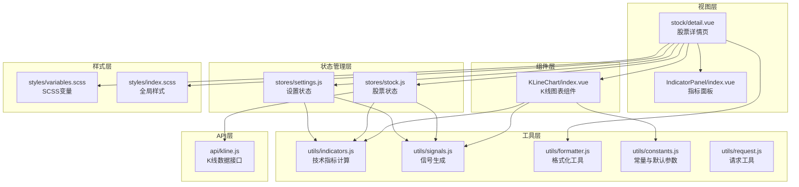
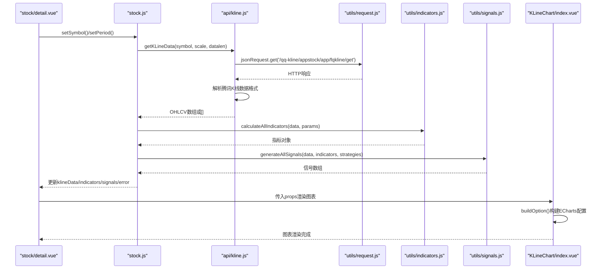
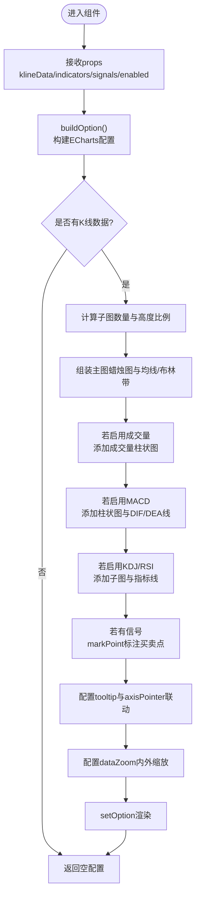
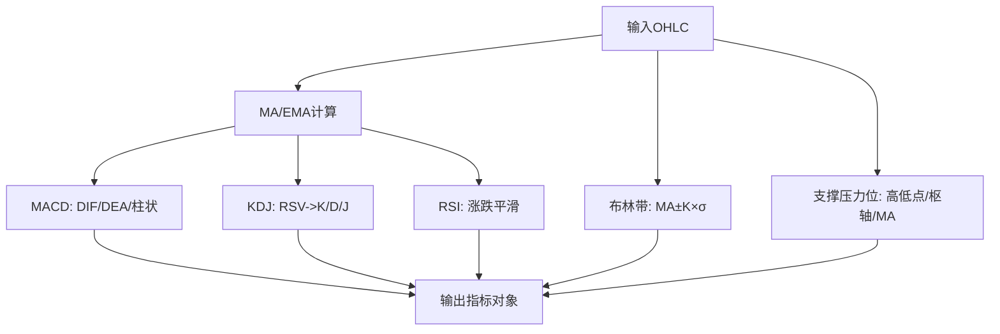
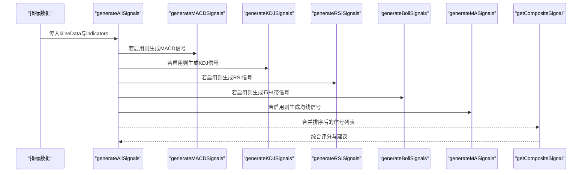
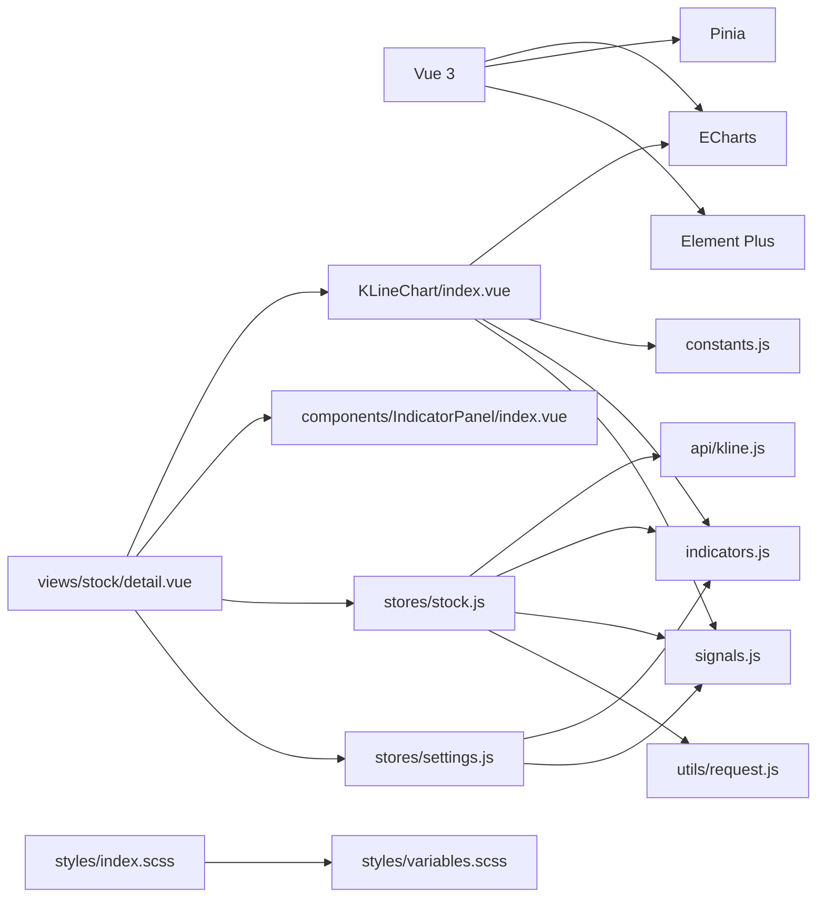

# K线图表系统

<cite>
**本文档引用的文件**
- [index.vue](file://src/components/KLineChart/index.vue)
- [indicators.js](file://src/utils/indicators.js)
- [kline.js](file://src/api/kline.js)
- [stock.js](file://src/stores/stock.js)
- [settings.js](file://src/stores/settings.js)
- [constants.js](file://src/utils/constants.js)
- [formatter.js](file://src/utils/formatter.js)
- [signals.js](file://src/utils/signals.js)
- [detail.vue](file://src/views/stock/detail.vue)
- [index.vue](file://src/components/IndicatorPanel/index.vue)
- [variables.scss](file://src/styles/variables.scss)
- [index.scss](file://src/styles/index.scss)
- [request.js](file://src/utils/request.js)
- [package.json](file://package.json)
</cite>

## 目录
1. [简介](#简介)
2. [项目结构](#项目结构)
3. [核心组件](#核心组件)
4. [架构总览](#架构总览)
5. [详细组件分析](#详细组件分析)
6. [依赖关系分析](#依赖关系分析)
7. [性能考虑](#性能考虑)
8. [故障排除指南](#故障排除指南)
9. [结论](#结论)
10. [附录](#附录)

## 简介
本文件面向量化交易平台的K线图表系统，基于Vue 3 + ECharts构建，提供完整的K线图、成交量、技术指标（MA、MACD、KDJ、RSI、布林带）叠加显示能力，以及信号标注、缩放平移、主题定制与响应式设计。文档深入解释图表实现原理、交互功能、技术指标叠加方法、性能优化策略、与后端数据集成及实时更新机制，并提供扩展开发指南。

**更新** 本版本重点改进了K线数据获取逻辑，增加了对腾讯财经API的适配和完善的错误处理机制，提升了系统的稳定性和可靠性。

## 项目结构
该系统采用模块化组织，前端使用Vue 3 + Pinia状态管理，ECharts负责可视化渲染，工具层封装指标计算与信号生成，API层对接后端数据源。

**图表来源**
- [detail.vue:113-175](file://src/views/stock/detail.vue#L113-L175)
- [index.vue:5-277](file://src/components/KLineChart/index.vue#L5-L277)
- [stock.js:10-91](file://src/stores/stock.js#L10-L91)
- [settings.js:6-69](file://src/stores/settings.js#L6-L69)
- [indicators.js:1-245](file://src/utils/indicators.js#L1-L245)
- [signals.js:1-347](file://src/utils/signals.js#L1-L347)
- [kline.js:1-49](file://src/api/kline.js#L1-L49)
- [constants.js:1-68](file://src/utils/constants.js#L1-L68)
- [request.js:1-29](file://src/utils/request.js#L1-L29)
- [variables.scss:1-24](file://src/styles/variables.scss#L1-L24)
- [index.scss:1-64](file://src/styles/index.scss#L1-L64)

**章节来源**
- [package.json:1-28](file://package.json#L1-L28)
- [detail.vue:113-175](file://src/views/stock/detail.vue#L113-L175)

## 核心组件
- K线图表组件：负责ECharts初始化、选项构建、渲染与响应式适配，支持蜡烛图、成交量、技术指标叠加、信号标注、缩放与提示框。
- 技术指标计算引擎：提供MA、MACD、KDJ、RSI、布林带、支撑压力位等指标的高效计算。
- 信号生成引擎：基于指标生成买入/卖出信号，并进行综合评分与回测统计。
- 股票状态管理：统一管理K线数据、指标、信号、周期与自动刷新逻辑，包含错误状态管理。
- 设置状态管理：持久化用户偏好（指标启用、周期、参数），支持重置默认值。
- API层：封装K线数据请求，返回标准化OHLCV数据，包含腾讯财经API适配和错误处理。
- 请求工具：提供统一的HTTP请求封装，包含错误拦截和消息提示。
- 样式层：提供主题变量与全局样式覆盖，确保图表与界面风格一致。

**章节来源**
- [index.vue:10-277](file://src/components/KLineChart/index.vue#L10-L277)
- [indicators.js:221-245](file://src/utils/indicators.js#L221-L245)
- [signals.js:197-261](file://src/utils/signals.js#L197-L261)
- [stock.js:10-91](file://src/stores/stock.js#L10-L91)
- [settings.js:6-69](file://src/stores/settings.js#L6-L69)
- [kline.js:9-49](file://src/api/kline.js#L9-L49)
- [request.js:17-28](file://src/utils/request.js#L17-L28)
- [constants.js:1-68](file://src/utils/constants.js#L1-L68)
- [variables.scss:1-24](file://src/styles/variables.scss#L1-L24)
- [index.scss:1-64](file://src/styles/index.scss#L1-L64)

## 架构总览
系统采用"视图层-组件层-状态管理层-工具层-API层-样式层"的分层架构。视图层通过组件与状态管理协调数据流；组件层负责图表渲染与交互；状态管理层统一调度数据与参数；工具层提供算法与格式化；API层处理后端集成；样式层保证视觉一致性。

**图表来源**
- [detail.vue:152-174](file://src/views/stock/detail.vue#L152-L174)
- [stock.js:25-72](file://src/stores/stock.js#L25-L72)
- [kline.js:9-49](file://src/api/kline.js#L9-L49)
- [request.js:17-28](file://src/utils/request.js#L17-L28)
- [indicators.js:221-245](file://src/utils/indicators.js#L221-L245)
- [signals.js:197-230](file://src/utils/signals.js#L197-L230)
- [index.vue:22-241](file://src/components/KLineChart/index.vue#L22-L241)

## 详细组件分析

### K线图表组件（KLineChart）
- 功能要点
  - 蜡烛图绘制：OHLC数据映射到ECharts candlestick系列，涨跌颜色由COLORS控制。
  - 成交量柱状图：按K线日期对齐，涨时用上涨颜色，跌时用下跌颜色。
  - 技术指标叠加：
    - MA：多条均线线性叠加，颜色按周期区分。
    - BOLL：上下轨虚线，中轨实线，形成通道。
    - MACD：柱状图+两条线（DIF/DEA），颜色区分正负。
    - KDJ/RSI：子图叠加，RSI可配置水平参考线。
  - 信号标注：在K线下方标注买入三角形，在K线上方标注卖出图钉，颜色区分。
  - 交互功能：tooltip跨轴联动、dataZoom内外缩放、滑块缩放、ResizeObserver响应式适配。
- 数据流与渲染
  - props输入：klineData、indicators、signals、enabledIndicators、height。
  - buildOption根据启用指标动态构建grid、xAxis、yAxis、series与dataZoom。
  - 渲染：首次挂载初始化ECharts实例，后续watch监听props变化触发setOption。
- 性能与体验
  - animation关闭以避免大数据量闪烁。
  - 内部缩放默认展示最近80根K线，提升初始加载体验。
  - ResizeObserver监听容器尺寸变化，自动resize图表。

**图表来源**
- [index.vue:22-241](file://src/components/KLineChart/index.vue#L22-L241)

**章节来源**
- [index.vue:10-277](file://src/components/KLineChart/index.vue#L10-L277)
- [constants.js:1-26](file://src/utils/constants.js#L1-L26)

### 技术指标计算引擎（indicators.js）
- MA（简单移动均线）：支持多周期（默认5/10/20/60），滑动窗口求和。
- EMA（指数移动平均）：作为MACD基础，递推公式计算。
- MACD：短期EMA-长期EMA得到DIF，再对DIF做EMA得到DEA，柱状=2×(DIF-DEA)。
- KDJ：基于RSV，K平滑得到K，D平滑得到D，J=3K-2D。
- RSI：计算相邻收盘价涨跌幅，平滑得到相对强弱指数。
- 布林带：MA为中轨，标准差乘倍数为上下轨。
- 支撑压力位：结合近N日高低价、枢轴点、MA关键位，合并相近价位后取前3个支撑与阻力。

**图表来源**
- [indicators.js:21-245](file://src/utils/indicators.js#L21-L245)

**章节来源**
- [indicators.js:21-245](file://src/utils/indicators.js#L21-L245)
- [constants.js:39-45](file://src/utils/constants.js#L39-L45)

### 信号生成引擎（signals.js）
- MACD：DIF上穿DEA（金叉）或下穿DEA（死叉）生成买卖信号，结合柱状方向判断强弱。
- KDJ：J值从超卖区反弹或K从超买区回落，或低位金叉/高位死叉生成信号。
- RSI：RSI从超卖区反弹或从超买区回落生成信号。
- 布林带：价格触及下轨反弹或上轨回落生成信号。
- 均线：多条均线交叉组合生成信号。
- 综合评分：按信号强度权重与类型加减分，给出综合建议等级与描述。

**图表来源**
- [signals.js:197-261](file://src/utils/signals.js#L197-L261)

**章节来源**
- [signals.js:8-42](file://src/utils/signals.js#L8-L42)
- [signals.js:45-95](file://src/utils/signals.js#L45-L95)
- [signals.js:98-122](file://src/utils/signals.js#L98-L122)
- [signals.js:125-160](file://src/utils/signals.js#L125-L160)
- [signals.js:163-194](file://src/utils/signals.js#L163-L194)
- [signals.js:197-261](file://src/utils/signals.js#L197-L261)

### 股票状态管理（stock.js）
- 职责：管理当前股票符号、周期、K线数据、指标、信号、综合信号、加载状态与错误状态；提供自动刷新定时器。
- 错误状态管理：新增error状态字段，用于跟踪K线数据获取失败的情况。
- 流程：setSymbol/setPeriod触发fetchKLine，调用API获取数据，计算指标与信号，更新状态供视图使用。

**更新** 增加了错误状态管理机制，当K线数据获取失败时会设置error状态，便于UI层进行相应的错误提示和处理。

**章节来源**
- [stock.js:10-91](file://src/stores/stock.js#L10-L91)

### 设置状态管理（settings.js）
- 职责：保存用户偏好的默认周期、启用指标、信号策略、各指标参数；提供切换与重置默认值方法；持久化到本地存储。
- 参数：MACD、KDJ、RSI、布林带、MA周期等。

**章节来源**
- [settings.js:6-69](file://src/stores/settings.js#L6-L69)
- [constants.js:39-45](file://src/utils/constants.js#L39-L45)

### API层（kline.js）
- 职责：封装K线数据请求，将后端返回的字符串数值转换为数字，标准化为OHLCV结构。
- 腾讯财经API适配：专门针对腾讯K线API的数据格式进行解析，支持日K、周K、5分钟、15分钟、30分钟、60分钟等多种周期。
- 错误处理机制：使用try-catch块捕获异常，记录错误日志并返回空数组，确保系统稳定性。
- 数据解析：支持qfqday和day两种数据格式，自动选择合适的格式进行解析。

**更新** 本版本重点改进了K线数据获取逻辑，增加了对腾讯财经API的完整适配和错误处理机制。

**章节来源**
- [kline.js:9-49](file://src/api/kline.js#L9-L49)

### 请求工具（request.js）
- 职责：提供统一的HTTP请求封装，包含JSON和文本两种请求实例。
- 错误拦截：统一处理网络错误、超时和响应错误，通过Element Plus的消息组件进行用户提示。
- 超时配置：设置15秒超时时间，平衡响应速度和稳定性。

**更新** 增加了统一的错误处理机制，为API层提供可靠的错误拦截和用户反馈。

**章节来源**
- [request.js:1-29](file://src/utils/request.js#L1-L29)

### 视图与交互（detail.vue + IndicatorPanel）
- detail.vue：股票详情页，整合K线图表、指标面板、信号卡片与支撑压力位展示；周期切换与自动刷新控制。
- IndicatorPanel：指标启用/禁用切换，通过事件通知设置状态。

**章节来源**
- [detail.vue:113-175](file://src/views/stock/detail.vue#L113-L175)
- [index.vue:14-28](file://src/components/IndicatorPanel/index.vue#L14-L28)

## 依赖关系分析

**图表来源**
- [package.json:11-21](file://package.json#L11-L21)
- [index.vue:6-8](file://src/components/KLineChart/index.vue#L6-L8)
- [stock.js:3-7](file://src/stores/stock.js#L3-L7)
- [settings.js:3-4](file://src/stores/settings.js#L3-L4)
- [detail.vue:118-124](file://src/views/stock/detail.vue#L118-L124)

**章节来源**
- [package.json:11-21](file://package.json#L11-L21)

## 性能考虑
- 渲染优化
  - 关闭动画：图表初始化时禁用动画，避免大数据量渲染闪烁。
  - 初始缩放：内部缩放默认展示最近80根K线，减少首屏渲染压力。
  - 懒渲染：仅在有数据时构建ECharts配置并setOption。
- DOM与内存
  - ResizeObserver监听容器尺寸变化，自动resize图表，避免手动触发。
  - 组件卸载时释放图表实例与观察器，防止内存泄漏。
- 数据处理
  - 指标计算采用滑窗与递推，时间复杂度线性，适合大周期数据。
  - 信号生成按索引遍历，避免重复计算，排序后一次性输出。
- 前端缓存
  - 设置状态持久化到本地存储，减少重复计算与网络请求。
- 错误处理优化
  - API层提供完善的错误捕获和降级处理，避免单点故障影响整个系统。
  - 请求工具统一处理网络异常，提供友好的用户提示。
- 可选优化建议
  - 大数据量场景可引入虚拟滚动或分页加载，限制单次渲染K线数量。
  - 对高频刷新场景，可增加节流/防抖与增量更新策略。
  - 使用Web Workers离线计算指标，主线程只负责渲染。

**更新** 增加了错误处理优化部分，强调了API层和请求工具的错误处理机制对系统稳定性的重要性。

**章节来源**
- [index.vue:212-241](file://src/components/KLineChart/index.vue#L212-L241)
- [index.vue:251-268](file://src/components/KLineChart/index.vue#L251-L268)
- [settings.js:17-26](file://src/stores/settings.js#L17-L26)
- [kline.js:44-47](file://src/api/kline.js#L44-L47)
- [request.js:17-28](file://src/utils/request.js#L17-L28)

## 故障排除指南
- 图表不显示
  - 检查props是否传入有效klineData；确认buildOption返回非空配置。
  - 确认ECharts实例已初始化且容器ref存在。
- 数据异常
  - 核对API返回数据结构与数值类型，确保OHLCV为数字。
  - 检查indicators计算结果是否为空数组或null。
  - 验证腾讯财经API返回的数据格式，确认qfqday或day字段存在。
- 交互失效
  - 确认dataZoom配置正确绑定所有xAxisIndex。
  - 检查tooltip formatter中索引与数据映射。
- 性能问题
  - 关闭动画与减少初始展示K线数量。
  - 避免频繁setOption，使用深度watch与nextTick合并更新。
- 实时刷新
  - 确认自动刷新定时器已启动与停止逻辑正确。
  - 检查后端接口可用性与返回格式。
- 错误处理问题
  - 检查API层的try-catch块是否正常工作。
  - 确认请求工具的错误拦截器是否正确处理异常。
  - 验证stock store中的error状态是否正确设置和清除。

**更新** 增加了错误处理相关的故障排除指导，帮助开发者快速定位和解决数据获取和处理过程中的问题。

**章节来源**
- [index.vue:22-241](file://src/components/KLineChart/index.vue#L22-L241)
- [kline.js:9-49](file://src/api/kline.js#L9-L49)
- [stock.js:74-81](file://src/stores/stock.js#L74-L81)
- [request.js:17-28](file://src/utils/request.js#L17-L28)

## 结论
本K线图表系统以ECharts为核心，结合Vue 3与Pinia实现了从数据获取、指标计算、信号生成到图表渲染与交互的完整链路。系统具备良好的扩展性与可维护性，支持多指标叠加、信号标注、缩放平移与响应式适配。通过合理的性能优化与状态管理，能够满足量化交易场景下的实时性与稳定性需求。

**更新** 本版本通过改进K线数据获取逻辑和增加腾讯财经API适配，显著提升了系统的稳定性和可靠性。完善的错误处理机制确保了在各种异常情况下系统的正常运行，为用户提供更好的使用体验。

## 附录

### 主题定制与颜色配置
- 颜色常量集中管理，涵盖涨跌、均线、布林带、MACD、KDJ、RSI、成交量、支撑压力与信号等。
- SCSS变量统一管理主题色、文本色、边框色与背景色，全局样式覆盖Element Plus组件风格。

**章节来源**
- [constants.js:1-26](file://src/utils/constants.js#L1-L26)
- [variables.scss:1-24](file://src/styles/variables.scss#L1-L24)
- [index.scss:1-64](file://src/styles/index.scss#L1-L64)

### 响应式设计实现
- 容器使用百分比宽度与最小高度，组件内通过ResizeObserver监听容器尺寸变化并调用图表resize。
- 样式层提供通用卡片与滚动条样式，确保在不同设备上的良好体验。

**章节来源**
- [index.vue:280-284](file://src/components/KLineChart/index.vue#L280-L284)
- [index.vue:257-260](file://src/components/KLineChart/index.vue#L257-L260)
- [index.scss:47-64](file://src/styles/index.scss#L47-L64)

### 图表与后端数据集成
- API层封装K线数据请求，返回标准化OHLCV数组，支持腾讯财经API的多种周期格式。
- 股票状态管理负责拉取数据、计算指标与信号，并驱动视图更新。
- 自动刷新：定时器定期拉取实时快照，保持界面最新。
- 错误处理：提供完善的异常捕获和降级处理，确保系统稳定性。

**更新** 增强了数据集成部分，特别强调了腾讯财经API的适配和错误处理机制。

**章节来源**
- [kline.js:9-49](file://src/api/kline.js#L9-L49)
- [stock.js:35-72](file://src/stores/stock.js#L35-L72)
- [stock.js:74-81](file://src/stores/stock.js#L74-L81)

### 扩展开发指南
- 新增技术指标
  - 在indicators.js中新增计算函数，返回数组或对象。
  - 在buildOption中根据enabledIndicators条件渲染对应series。
  - 在constants.js中补充颜色与默认参数。
- 自定义信号策略
  - 在signals.js中新增策略函数，遵循现有信号结构。
  - 在generateAllSignals中启用新策略，并在getCompositeSignal中参与评分。
- 图表交互增强
  - 在buildOption中扩展tooltip、dataZoom、markArea/markLine等配置。
  - 通过props暴露更多交互开关，如十字光标、缩放范围等。
- 性能优化实践
  - 引入虚拟滚动或分页加载，限制单次渲染K线数量。
  - 对高频刷新场景增加节流/防抖与增量更新策略。
  - 将计算密集型任务迁移至Web Workers或服务端。
- API扩展开发
  - 在kline.js中添加新的API适配逻辑，遵循现有的错误处理模式。
  - 扩展periodMap支持新的时间周期。
  - 确保新API的数据格式与现有解析逻辑兼容。

**更新** 增加了API扩展开发指南，为开发者提供了适配新数据源的具体步骤和注意事项。

**章节来源**
- [indicators.js:1-245](file://src/utils/indicators.js#L1-L245)
- [signals.js:197-261](file://src/utils/signals.js#L197-L261)
- [index.vue:22-241](file://src/components/KLineChart/index.vue#L22-L241)
- [constants.js:1-68](file://src/utils/constants.js#L1-L68)
- [kline.js:12-19](file://src/api/kline.js#L12-L19)