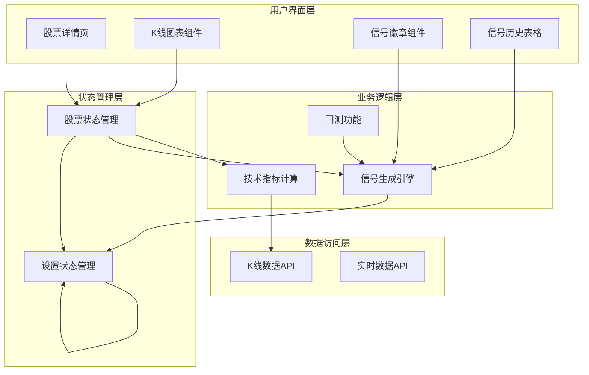
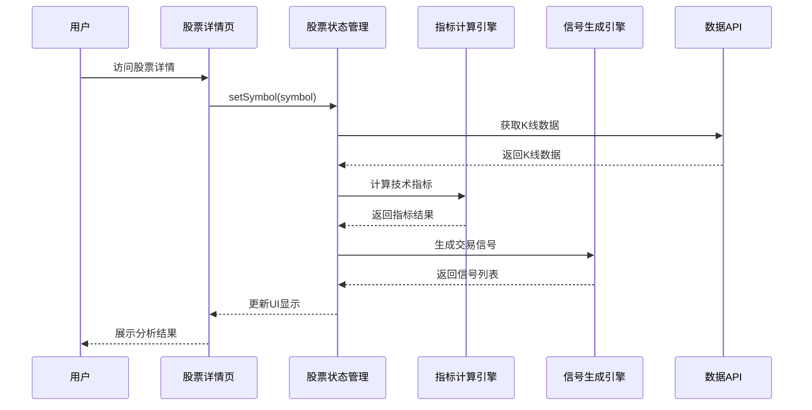
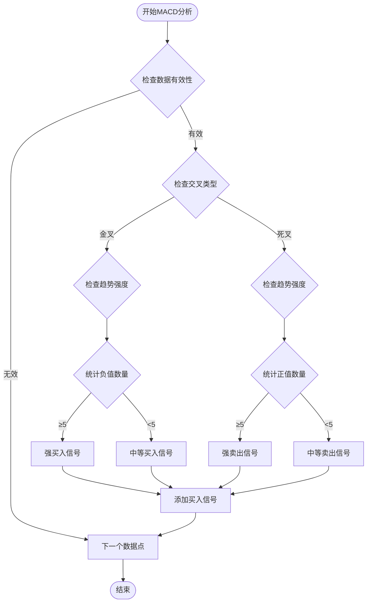
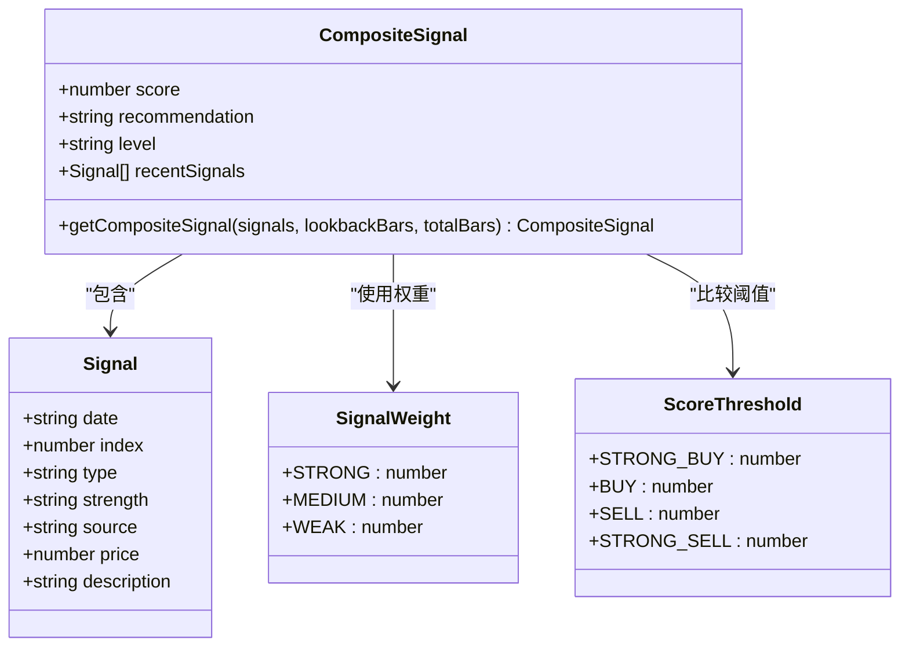
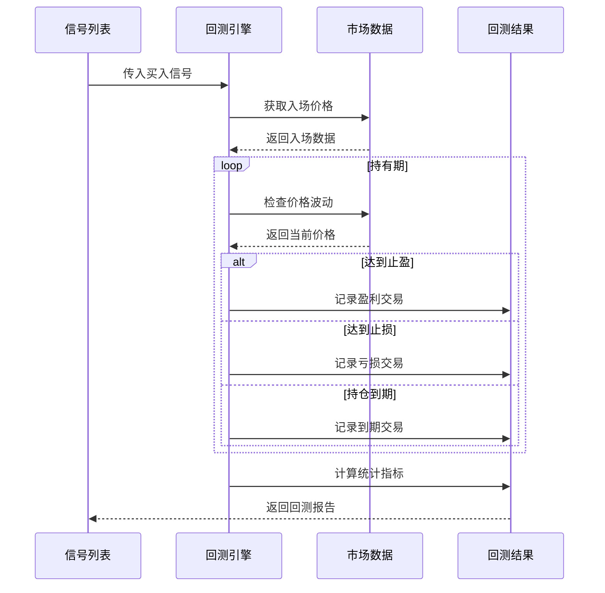
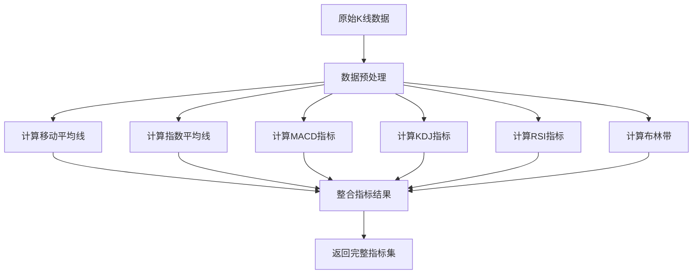
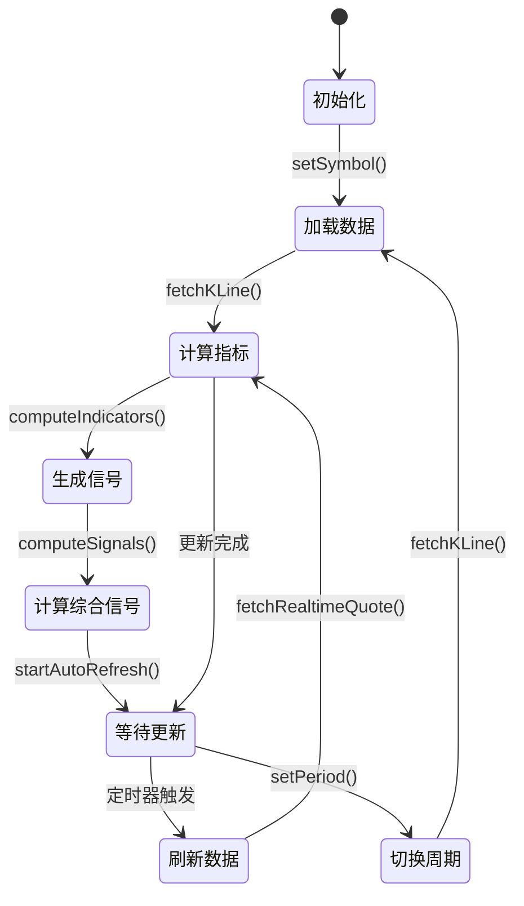
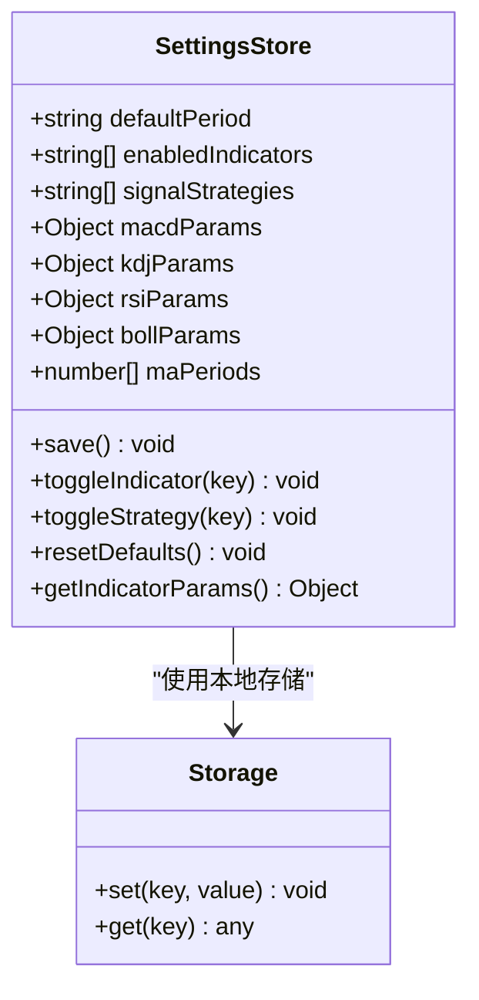
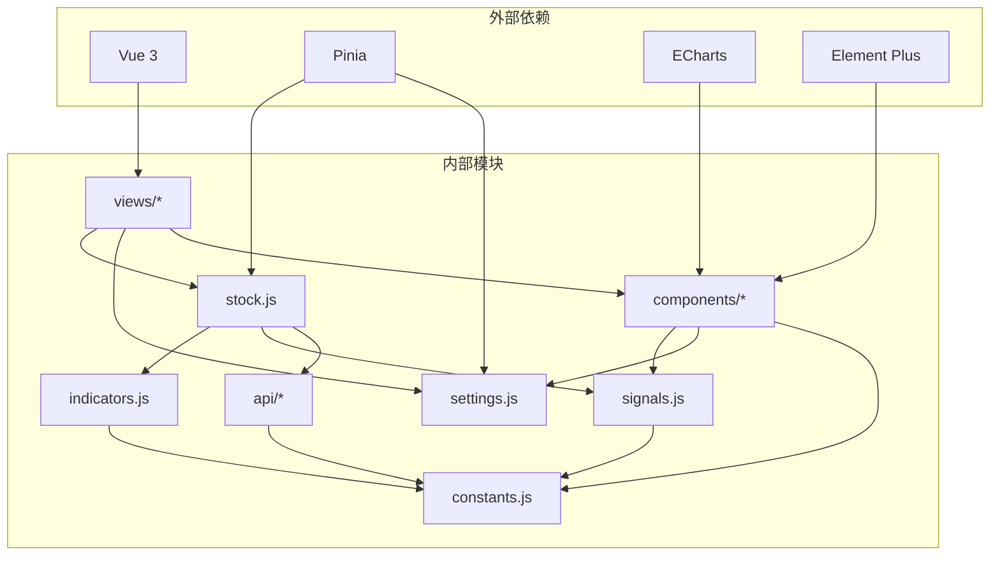

# 信号生成引擎

<cite>
**本文档引用的文件**
- [signals.js](file://src/utils/signals.js)
- [indicators.js](file://src/utils/indicators.js)
- [constants.js](file://src/utils/constants.js)
- [stock.js](file://src/stores/stock.js)
- [settings.js](file://src/stores/settings.js)
- [detail.vue](file://src/views/stock/detail.vue)
- [index.vue](file://src/components/KLineChart/index.vue)
- [index.vue](file://src/components/SignalBadge/index.vue)
- [index.vue](file://src/components/SignalHistoryTable/index.vue)
- [kline.js](file://src/api/kline.js)
- [realtime.js](file://src/api/realtime.js)
</cite>

## 目录
1. [简介](#简介)
2. [项目结构](#项目结构)
3. [核心组件](#核心组件)
4. [架构概览](#架构概览)
5. [详细组件分析](#详细组件分析)
6. [依赖关系分析](#依赖关系分析)
7. [性能考虑](#性能考虑)
8. [故障排除指南](#故障排除指南)
9. [结论](#结论)

## 简介

信号生成引擎是量化交易系统的核心组件，负责基于多种技术指标自动产生买卖信号。该系统采用模块化设计，通过独立的技术指标计算引擎和信号生成器，为用户提供全面的市场分析和交易决策支持。

系统主要包含以下核心功能：
- 多策略技术指标计算（MACD、KDJ、RSI、布林带、均线、成交量）
- 自动信号生成和强度评估
- 综合评分和趋势判断
- 可视化展示和历史记录
- 实时数据更新和回测功能

## 项目结构

该项目采用Vue 3 + Pinia的状态管理架构，整体结构清晰，职责分离明确：

**图表来源**
- [detail.vue:1-364](file://src/views/stock/detail.vue#L1-L364)
- [stock.js:1-92](file://src/stores/stock.js#L1-L92)
- [indicators.js:1-245](file://src/utils/indicators.js#L1-L245)

**章节来源**
- [detail.vue:1-364](file://src/views/stock/detail.vue#L1-L364)
- [stock.js:1-92](file://src/stores/stock.js#L1-L92)

## 核心组件

### 信号生成引擎

信号生成引擎是系统的核心，负责将技术指标转换为可执行的交易信号。它支持六种不同的技术分析策略：

1. **MACD策略** - 基于快慢线交叉和零轴位置判断趋势
2. **KDJ策略** - 基于随机指标的超买超卖判断
3. **RSI策略** - 基于相对强弱指数的动量分析
4. **布林带策略** - 基于通道突破的价格行为
5. **均线策略** - 基于多周期均线交叉的技术分析
6. **成交量策略** - 基于量能变化的确认信号

### 技术指标计算引擎

提供完整的指标计算能力，包括：
- 移动平均线（MA）计算
- 指数移动平均线（EMA）计算
- MACD指标计算
- KDJ随机指标计算
- RSI相对强弱指数计算
- 布林带计算
- 支撑阻力位识别

### 状态管理系统

采用Pinia进行状态管理，包含：
- 股票数据存储（K线、指标、信号）
- 用户设置管理（指标参数、策略启用）
- 实时数据刷新机制

**章节来源**
- [signals.js:1-442](file://src/utils/signals.js#L1-L442)
- [indicators.js:1-245](file://src/utils/indicators.js#L1-L245)
- [stock.js:1-92](file://src/stores/stock.js#L1-L92)

## 架构概览

系统采用分层架构设计，确保各组件职责清晰、耦合度低：

**图表来源**
- [stock.js:25-72](file://src/stores/stock.js#L25-L72)
- [detail.vue:219-237](file://src/views/stock/detail.vue#L219-L237)

系统的关键特性包括：
- **异步数据流**：所有数据操作都是异步的，避免阻塞UI
- **缓存机制**：计算结果缓存，减少重复计算
- **实时更新**：支持定时刷新实时数据
- **配置灵活**：支持自定义指标参数和策略组合

## 详细组件分析

### 信号生成引擎详细分析

#### MACD信号生成

MACD策略通过分析DIF和DEA线的交叉来判断买卖时机：

**图表来源**
- [signals.js:8-42](file://src/utils/signals.js#L8-L42)

#### 综合信号评分系统

系统使用加权评分机制对多个信号进行综合评估：

**图表来源**
- [signals.js:328-356](file://src/utils/signals.js#L328-L356)
- [constants.js:47-60](file://src/utils/constants.js#L47-L60)

#### 回测功能实现

系统提供简单的回测功能来验证信号的有效性：

**图表来源**
- [signals.js:359-441](file://src/utils/signals.js#L359-L441)

**章节来源**
- [signals.js:1-442](file://src/utils/signals.js#L1-L442)
- [constants.js:1-68](file://src/utils/constants.js#L1-L68)

### 技术指标计算引擎

#### 指标计算流程

技术指标计算引擎采用模块化设计，每个指标都有独立的计算函数：

**图表来源**
- [indicators.js:221-244](file://src/utils/indicators.js#L221-L244)

#### 参数配置系统

系统支持灵活的参数配置，用户可以调整各种技术指标的计算参数：

| 指标类型 | 默认参数 | 可配置项 |
|---------|---------|---------|
| MA | [5, 10, 20, 60] | 周期数组 |
| MACD | short:12, long:26, signal:9 | 快线、慢线、信号线周期 |
| KDJ | period:9, kPeriod:3, dPeriod:3 | 周期和平滑参数 |
| RSI | period:14 | 计算周期 |
| 布林带 | period:20, multiplier:2 | 周期和标准差倍数 |

**章节来源**
- [indicators.js:1-245](file://src/utils/indicators.js#L1-L245)
- [settings.js:1-70](file://src/stores/settings.js#L1-L70)

### 状态管理与数据流

#### 股票状态管理

股票状态管理器负责协调整个数据流：

**图表来源**
- [stock.js:10-92](file://src/stores/stock.js#L10-L92)

#### 设置状态管理

设置状态管理器提供持久化的用户偏好配置：

**图表来源**
- [settings.js:6-69](file://src/stores/settings.js#L6-L69)

**章节来源**
- [stock.js:1-92](file://src/stores/stock.js#L1-L92)
- [settings.js:1-70](file://src/stores/settings.js#L1-L70)

## 依赖关系分析

系统采用松耦合的设计，各组件之间的依赖关系清晰：

**图表来源**
- [package.json:11-26](file://package.json#L11-L26)
- [signals.js:5](file://src/utils/signals.js#L5)
- [indicators.js:5](file://src/utils/indicators.js#L5)

**章节来源**
- [package.json:1-28](file://package.json#L1-L28)

## 性能考虑

### 计算优化策略

1. **增量计算**：只对新增的数据点重新计算指标
2. **缓存机制**：计算结果缓存，避免重复计算
3. **批量处理**：使用数组方法进行向量化计算
4. **内存管理**：及时清理不需要的数据引用

### 渲染性能优化

1. **虚拟滚动**：信号历史表格使用虚拟滚动
2. **懒加载**：图表组件按需渲染
3. **防抖处理**：输入参数变更时使用防抖
4. **组件复用**：通用组件设计提高复用率

### 数据流优化

1. **异步加载**：所有网络请求都是异步的
2. **错误处理**：完善的错误捕获和恢复机制
3. **数据验证**：输入数据的完整性检查
4. **资源清理**：组件销毁时清理定时器和事件监听

## 故障排除指南

### 常见问题及解决方案

#### 信号生成异常

**问题**：信号生成器返回空结果
**可能原因**：
- 输入数据格式不正确
- 技术指标计算失败
- 参数配置错误

**解决步骤**：
1. 检查K线数据的完整性
2. 验证技术指标参数的有效性
3. 确认策略启用状态

#### 图表渲染问题

**问题**：ECharts图表无法正常显示
**可能原因**：
- DOM元素未就绪
- 数据格式不匹配
- 图表实例未正确初始化

**解决步骤**：
1. 确保chartRef元素存在
2. 检查数据格式是否符合ECharts要求
3. 验证图表实例的生命周期

#### 实时数据更新失败

**问题**：股票实时数据无法刷新
**可能原因**：
- API接口调用失败
- 网络连接问题
- 服务器响应超时

**解决步骤**：
1. 检查网络连接状态
2. 验证API接口可用性
3. 查看控制台错误信息

**章节来源**
- [stock.js:35-52](file://src/stores/stock.js#L35-L52)
- [kline.js:9-48](file://src/api/kline.js#L9-L48)

## 结论

信号生成引擎是一个功能完整、架构清晰的量化交易系统核心组件。其主要优势包括：

1. **模块化设计**：各个组件职责明确，易于维护和扩展
2. **灵活配置**：支持多种技术指标和参数配置
3. **性能优化**：采用多种优化策略确保系统响应速度
4. **用户体验**：提供直观的可视化界面和丰富的交互功能

系统目前支持六种主流技术分析策略，能够满足大多数量化交易需求。未来可以考虑增加更多高级分析功能，如机器学习算法集成、更复杂的回测框架等。

通过合理的架构设计和代码组织，该系统为构建更复杂的量化交易应用奠定了坚实的基础。