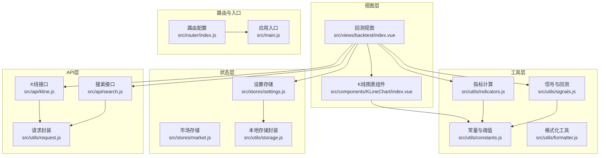
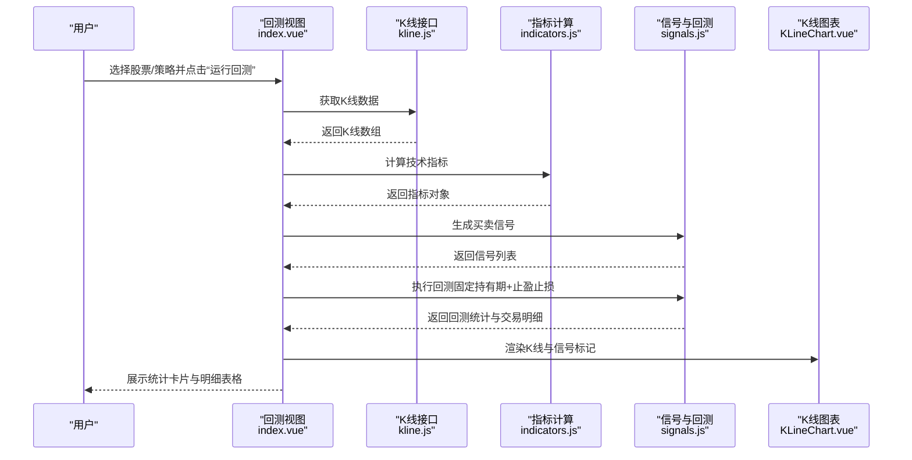
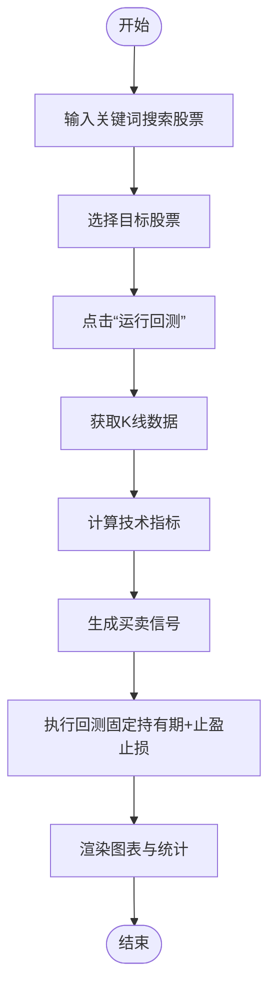
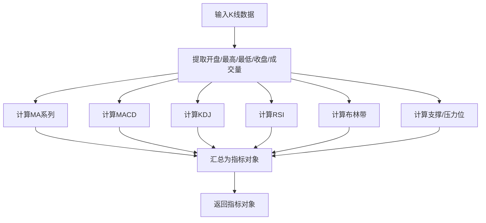
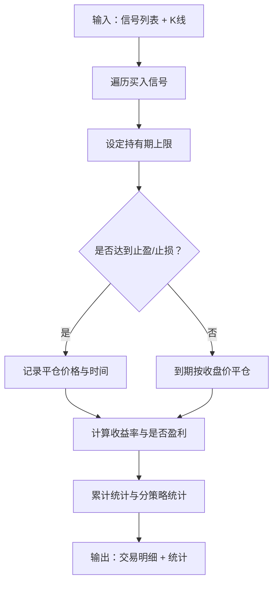
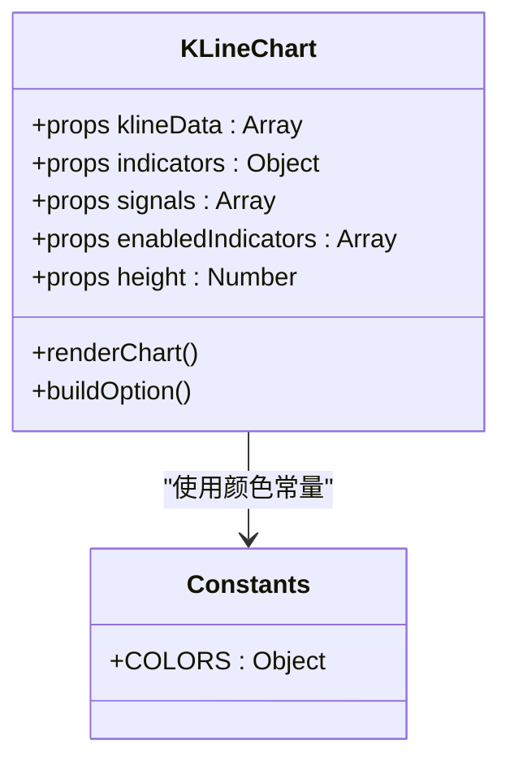
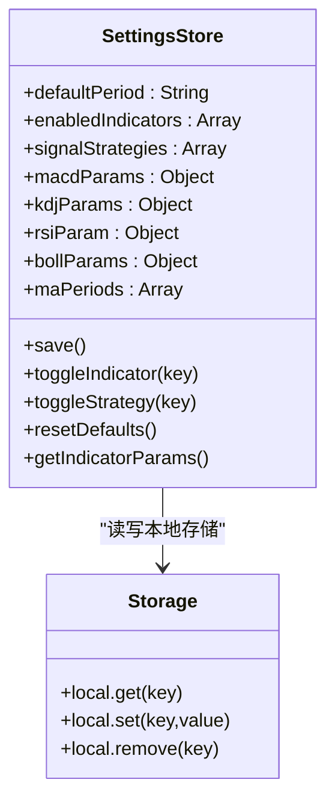
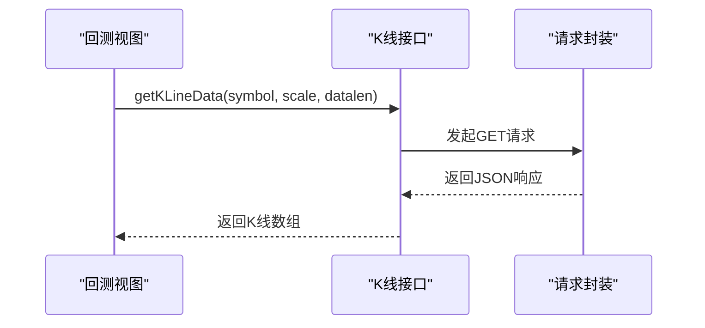
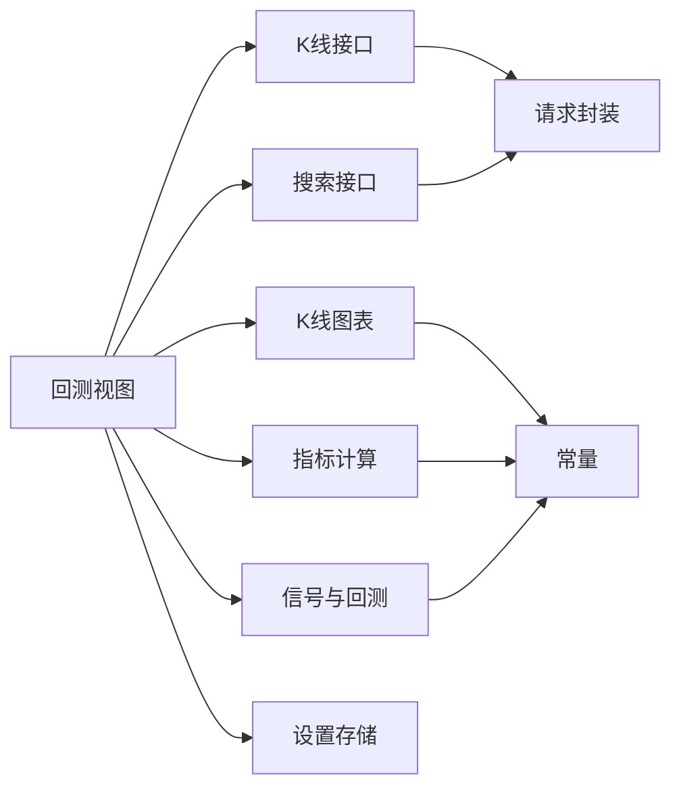

# 回测系统

<cite>
**本文引用的文件**
- [src/views/backtest/index.vue](file://src/views/backtest/index.vue)
- [src/utils/signals.js](file://src/utils/signals.js)
- [src/utils/indicators.js](file://src/utils/indicators.js)
- [src/utils/constants.js](file://src/utils/constants.js)
- [src/stores/settings.js](file://src/stores/settings.js)
- [src/stores/market.js](file://src/stores/market.js)
- [src/components/KLineChart/index.vue](file://src/components/KLineChart/index.vue)
- [src/api/kline.js](file://src/api/kline.js)
- [src/api/search.js](file://src/api/search.js)
- [src/utils/request.js](file://src/utils/request.js)
- [src/utils/formatter.js](file://src/utils/formatter.js)
- [src/utils/storage.js](file://src/utils/storage.js)
- [src/router/index.js](file://src/router/index.js)
- [src/main.js](file://src/main.js)
- [package.json](file://package.json)
</cite>

## 目录
1. [简介](#简介)
2. [项目结构](#项目结构)
3. [核心组件](#核心组件)
4. [架构总览](#架构总览)
5. [详细组件分析](#详细组件分析)
6. [依赖关系分析](#依赖关系分析)
7. [性能考量](#性能考量)
8. [故障排查指南](#故障排查指南)
9. [结论](#结论)
10. [附录](#附录)

## 简介
本回测系统面向量化交易应用，提供基于公开数据与技术指标的信号生成与简易回测能力。用户可在界面中选择股票与策略，系统自动拉取K线数据、计算技术指标、生成买卖信号，并对信号进行持有期固定、止盈止损的回测，输出整体统计与分策略统计、交易明细以及可视化图表。系统当前未内置复杂资金管理、滑点与交易成本模型，但已具备扩展接口。

## 项目结构
回测系统采用前端单页应用架构，核心逻辑集中在视图层与工具模块之间：
- 视图层负责交互与展示（回测页面、K线图表）
- 工具模块负责指标计算、信号生成与回测统计
- API 层负责外部数据获取
- 状态层负责参数持久化与全局状态
- 路由与入口负责应用初始化与页面导航

**图表来源**
- [src/views/backtest/index.vue:126-182](file://src/views/backtest/index.vue#L126-L182)
- [src/utils/indicators.js:221-244](file://src/utils/indicators.js#L221-L244)
- [src/utils/signals.js:197-230](file://src/utils/signals.js#L197-L230)
- [src/components/KLineChart/index.vue:10-16](file://src/components/KLineChart/index.vue#L10-L16)
- [src/stores/settings.js:6-68](file://src/stores/settings.js#L6-L68)
- [src/api/kline.js:9-26](file://src/api/kline.js#L9-L26)
- [src/api/search.js:7-37](file://src/api/search.js#L7-L37)
- [src/utils/request.js:5-28](file://src/utils/request.js#L5-L28)
- [src/router/index.js:8-46](file://src/router/index.js#L8-L46)
- [src/main.js:10-16](file://src/main.js#L10-L16)

**章节来源**
- [src/views/backtest/index.vue:1-242](file://src/views/backtest/index.vue#L1-L242)
- [src/router/index.js:1-64](file://src/router/index.js#L1-L64)
- [src/main.js:1-17](file://src/main.js#L1-L17)

## 核心组件
- 回测视图：负责股票选择、策略勾选、运行回测、展示K线与信号、统计卡片与交易明细
- 指标计算：提供 MA/MACD/KDJ/RSI/布林带与支撑压力位计算
- 信号生成：基于指标规则生成买卖信号，并支持综合评分
- 回测引擎：按固定持有期与止盈止损条件执行回测，统计胜率、平均收益、最大回撤等
- 图表组件：基于 ECharts 展示K线、指标与信号标记
- 设置存储：持久化周期、启用指标、策略与指标参数
- API 封装：统一请求实例与错误处理

**章节来源**
- [src/views/backtest/index.vue:126-182](file://src/views/backtest/index.vue#L126-L182)
- [src/utils/indicators.js:221-244](file://src/utils/indicators.js#L221-L244)
- [src/utils/signals.js:197-346](file://src/utils/signals.js#L197-L346)
- [src/components/KLineChart/index.vue:22-241](file://src/components/KLineChart/index.vue#L22-L241)
- [src/stores/settings.js:6-68](file://src/stores/settings.js#L6-L68)
- [src/utils/request.js:5-28](file://src/utils/request.js#L5-L28)

## 架构总览
回测流程自上而下的数据流如下：
- 用户在回测视图选择股票与策略
- 视图调用 K 线接口获取历史数据
- 视图调用指标计算模块生成技术指标
- 视图调用信号生成模块生成买卖信号
- 视图调用回测模块对信号进行回测
- 视图渲染 K 线图表与统计卡片、交易明细

**图表来源**
- [src/views/backtest/index.vue:158-171](file://src/views/backtest/index.vue#L158-L171)
- [src/api/kline.js:9-26](file://src/api/kline.js#L9-L26)
- [src/utils/indicators.js:221-244](file://src/utils/indicators.js#L221-L244)
- [src/utils/signals.js:197-346](file://src/utils/signals.js#L197-L346)
- [src/components/KLineChart/index.vue:243-249](file://src/components/KLineChart/index.vue#L243-L249)

## 详细组件分析

### 回测视图（src/views/backtest/index.vue）
- 功能要点
  - 股票搜索与选择
  - 策略复选框控制启用的信号策略
  - 调用 API 获取K线、计算指标、生成信号、执行回测
  - 可视化：K线图表、统计卡片、分策略统计表、交易明细表
- 关键流程
  - 搜索股票：调用搜索接口，返回候选列表
  - 运行回测：获取K线 → 计算指标 → 生成信号 → 回测 → 更新状态
- 输出
  - 总信号数、胜率、平均收益、最大回撤
  - 分策略统计（每种策略的信号数、胜率、平均收益）
  - 交易明细（入场/出场时间、价格、收益率、持有天数）

**图表来源**
- [src/views/backtest/index.vue:148-171](file://src/views/backtest/index.vue#L148-L171)

**章节来源**
- [src/views/backtest/index.vue:1-242](file://src/views/backtest/index.vue#L1-L242)

### 指标计算（src/utils/indicators.js）
- 提供的技术指标
  - MA（多周期均线）
  - MACD（DIF/DEA/MACD柱状）
  - KDJ（K/D/J）
  - RSI（相对强弱指数）
  - 布林带（上/中/下轨）
  - 支撑/压力位（基于近期高低价、枢轴点与均线）
- 参数来源
  - 默认参数来自常量模块
  - 可通过设置存储覆盖默认参数
- 复杂度
  - 单个指标计算通常为 O(n)，整体计算随指标数量线性增长

**图表来源**
- [src/utils/indicators.js:221-244](file://src/utils/indicators.js#L221-L244)

**章节来源**
- [src/utils/indicators.js:1-245](file://src/utils/indicators.js#L1-L245)
- [src/utils/constants.js:38-45](file://src/utils/constants.js#L38-L45)
- [src/stores/settings.js:54-62](file://src/stores/settings.js#L54-L62)

### 信号生成与回测（src/utils/signals.js）
- 信号策略
  - MACD：DIF上穿/下穿DEA，结合正负柱状分布判定强弱
  - KDJ：J值超卖/超买区域的金叉/死叉
  - RSI：RSI穿越30/70阈值
  - 布林带：价格触及上下轨后的反抽/回调
  - MA：多周期均值交叉
- 综合评分
  - 基于信号强度权重与最近若干周期的信号聚合，给出推荐级别
- 回测逻辑
  - 对每个买入信号，按固定持有期或达到止盈/止损提前平仓
  - 计算每笔交易的收益率、是否盈利、持有天数
  - 汇总整体统计（总交易数、胜率、平均收益、最大回撤）与分策略统计

**图表来源**
- [src/utils/signals.js:264-346](file://src/utils/signals.js#L264-L346)

**章节来源**
- [src/utils/signals.js:1-347](file://src/utils/signals.js#L1-L347)
- [src/utils/constants.js:47-60](file://src/utils/constants.js#L47-L60)

### K线图表组件（src/components/KLineChart/index.vue）
- 功能
  - 基于 ECharts 渲染蜡烛图与多子图（成交量、MACD、KDJ/RSI）
  - 支持信号标记（买入三角形、卖出图钉）
  - 自适应布局与缩放
- 配置
  - 可启用/禁用指标与显示项
  - 颜色与样式来自常量模块

**图表来源**
- [src/components/KLineChart/index.vue:10-16](file://src/components/KLineChart/index.vue#L10-L16)
- [src/utils/constants.js:1-26](file://src/utils/constants.js#L1-L26)

**章节来源**
- [src/components/KLineChart/index.vue:1-285](file://src/components/KLineChart/index.vue#L1-L285)

### 设置存储与参数持久化（src/stores/settings.js, src/utils/storage.js）
- 设置项
  - 默认周期、启用指标、信号策略
  - 各指标参数（MACD/KDJ/RSI/布林/均线）
- 持久化
  - 使用本地存储封装进行读写
- 方法
  - 保存、切换指标/策略、重置默认值、获取指标参数

**图表来源**
- [src/stores/settings.js:6-68](file://src/stores/settings.js#L6-L68)
- [src/utils/storage.js:3-20](file://src/utils/storage.js#L3-L20)

**章节来源**
- [src/stores/settings.js:1-70](file://src/stores/settings.js#L1-L70)
- [src/utils/storage.js:1-21](file://src/utils/storage.js#L1-L21)

### API 与数据准备
- K线接口
  - 通过 sina-api 获取指定周期与长度的历史K线
  - 解析为内部统一结构（日期、OHLC、成交量）
- 搜索接口
  - 通过 em-search 获取股票建议，过滤主板/创业板/科创板
- 请求封装
  - 统一拦截器处理错误提示

**图表来源**
- [src/views/backtest/index.vue:162-162](file://src/views/backtest/index.vue#L162-L162)
- [src/api/kline.js:9-26](file://src/api/kline.js#L9-L26)
- [src/utils/request.js:5-28](file://src/utils/request.js#L5-L28)

**章节来源**
- [src/api/kline.js:1-27](file://src/api/kline.js#L1-L27)
- [src/api/search.js:1-38](file://src/api/search.js#L1-L38)
- [src/utils/request.js:1-29](file://src/utils/request.js#L1-L29)

## 依赖关系分析
- 模块耦合
  - 回测视图依赖 API、指标、信号、图表与设置存储
  - 指标与信号模块相互独立，通过数据结构解耦
  - 图表组件依赖常量模块的颜色定义
- 外部依赖
  - Vue/Pinia/ECharts/Axios/Element Plus/dayjs 等

**图表来源**
- [src/views/backtest/index.vue:128-133](file://src/views/backtest/index.vue#L128-L133)
- [src/utils/indicators.js:221-244](file://src/utils/indicators.js#L221-L244)
- [src/utils/signals.js:197-230](file://src/utils/signals.js#L197-L230)
- [src/components/KLineChart/index.vue:8-8](file://src/components/KLineChart/index.vue#L8-L8)
- [src/stores/settings.js:6-68](file://src/stores/settings.js#L6-L68)
- [src/api/kline.js:9-26](file://src/api/kline.js#L9-L26)
- [src/api/search.js:7-37](file://src/api/search.js#L7-L37)
- [src/utils/request.js:5-28](file://src/utils/request.js#L5-L28)

**章节来源**
- [package.json:11-26](file://package.json#L11-L26)

## 性能考量
- 指标与信号计算
  - 当前实现为 O(n) 级别，适合中小规模数据；若需更大样本，可考虑分段计算或Web Worker
- 图表渲染
  - ECharts 在大数据量下可通过关闭动画、减少 series 数量、使用 dataZoom 优化
- 网络请求
  - 合理设置 datalen 与 scale，避免一次性请求过多数据
- 本地存储
  - 参数持久化读写为 O(1)，影响可忽略

[本节为通用指导，无需特定文件来源]

## 故障排查指南
- 无法获取K线数据
  - 检查网络与接口可用性；查看请求拦截器错误提示
  - 确认股票代码格式正确
- 无信号或信号过少
  - 调整策略启用项与指标参数（周期、阈值）
  - 检查数据长度是否满足指标计算要求
- 图表不显示或空白
  - 确认传入数据非空且结构正确
  - 检查 ECharts 初始化与容器尺寸
- 回测统计异常
  - 检查信号索引与K线长度匹配
  - 确认止盈止损与持有期参数设置合理

**章节来源**
- [src/utils/request.js:17-25](file://src/utils/request.js#L17-L25)
- [src/api/kline.js:9-26](file://src/api/kline.js#L9-L26)
- [src/components/KLineChart/index.vue:251-268](file://src/components/KLineChart/index.vue#L251-L268)

## 结论
该回测系统以简洁的前端架构实现了从数据获取到可视化展示的完整闭环，具备良好的可扩展性。当前版本侧重于信号生成与基础回测统计，后续可在资金管理、手续费与滑点建模、参数优化等方面进一步增强，以满足更贴近实战的回测需求。

[本节为总结性内容，无需特定文件来源]

## 附录

### 回测数据准备与策略参数配置
- 数据准备
  - 通过搜索接口选择股票，调用 K 线接口获取历史数据
  - 设置默认周期与数据长度，确保覆盖足够样本
- 策略参数
  - 在设置存储中调整各指标参数（如 MACD 的短/长/信号周期、KDJ 的周期与平滑、RSI 周期、布林周期与倍数、均线周期）
  - 通过策略勾选控制启用的信号策略集合

**章节来源**
- [src/api/search.js:7-37](file://src/api/search.js#L7-L37)
- [src/api/kline.js:9-26](file://src/api/kline.js#L9-L26)
- [src/stores/settings.js:54-62](file://src/stores/settings.js#L54-L62)
- [src/utils/constants.js:38-45](file://src/utils/constants.js#L38-L45)

### 执行流程与结果分析
- 执行流程
  - 选择股票与策略 → 获取K线 → 计算指标 → 生成信号 → 回测 → 统计与展示
- 结果分析
  - 整体指标：总信号数、胜率、平均收益、最大回撤
  - 分策略指标：每种策略的信号数、胜率、平均收益
  - 交易明细：入场/出场时间、价格、收益率、持有天数

**章节来源**
- [src/views/backtest/index.vue:158-171](file://src/views/backtest/index.vue#L158-L171)
- [src/utils/signals.js:320-346](file://src/utils/signals.js#L320-L346)

### 回测优化策略（建议）
- 参数网格搜索
  - 遍历指标参数组合，记录胜率/年化收益/最大回撤等目标指标，选择最优组合
- 遗传算法优化
  - 将参数编码为染色体，以目标函数为适应度，迭代选择、交叉、变异，收敛至最优参数集
- 风险控制
  - 引入动态止盈止损、波动率自适应、最大回撤阈值控制等机制

[本节为概念性建议，无需特定文件来源]

### 交易成本模型、滑点与流动性（建议）
- 交易成本
  - 佣金、印花税、过户费等固定与比例费用
- 滑点
  - 基于成交量、买卖价差与订单簿深度建模
- 流动性
  - 限制单笔下单量，避免冲击成本过大；在低流动性时段降低仓位

[本节为概念性建议，无需特定文件来源]

### 可视化功能清单
- 收益曲线：基于回测结果的累计收益序列
- 交易记录：入场/出场时间与价格、收益率、持有天数
- 风险指标：最大回撤、波动率、夏普比率等（需在回测中扩展计算）

[本节为概念性建议，无需特定文件来源]

### 策略开发最佳实践
- 先在小样本数据上验证策略有效性
- 严格区分样本内与样本外测试，避免过拟合
- 明确参数含义与边界条件，确保回测可重现
- 逐步引入交易成本与滑点，使结果更贴近真实

[本节为通用指导，无需特定文件来源]