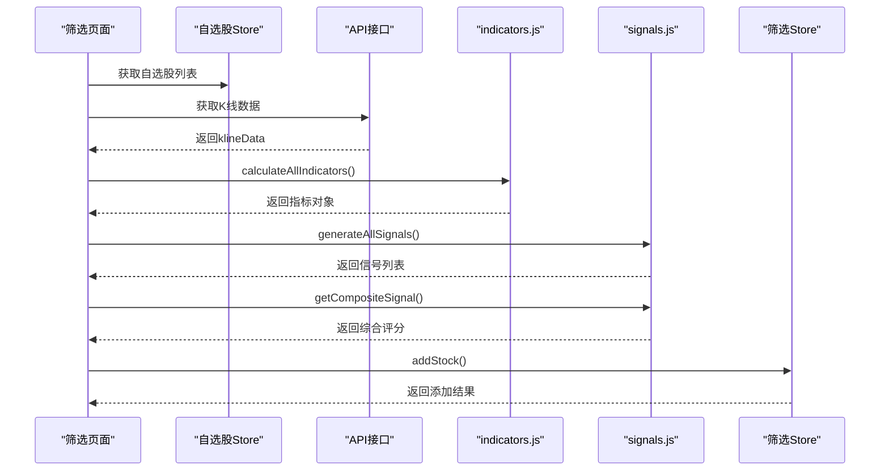
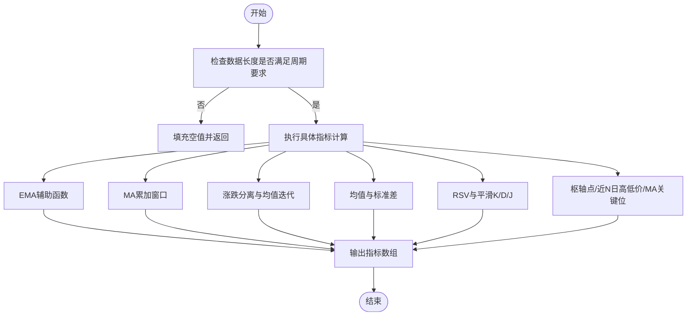
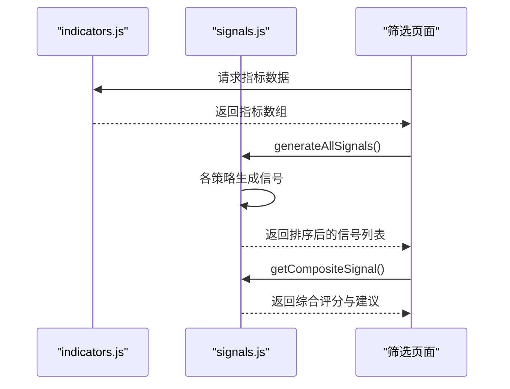
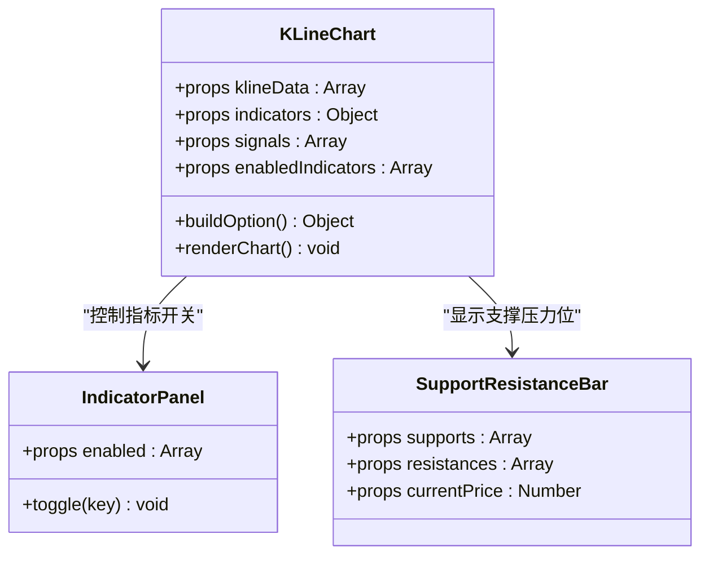
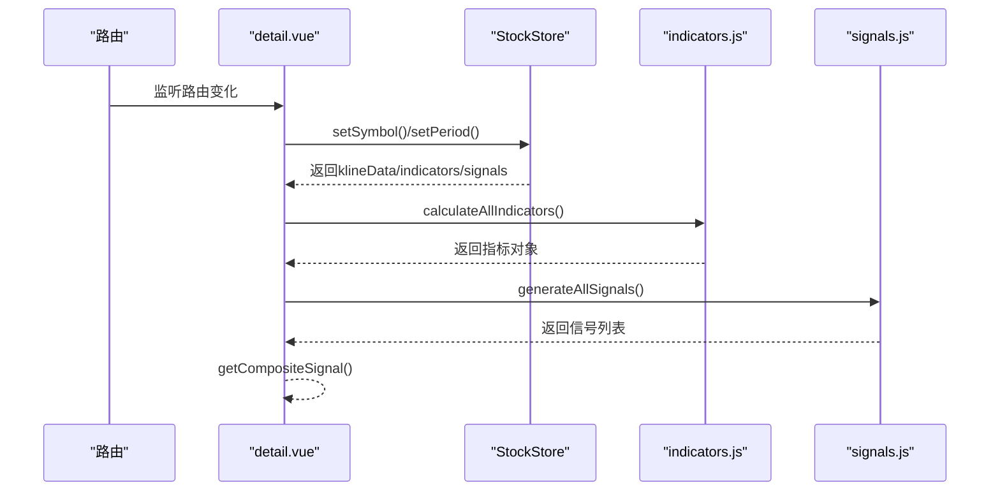
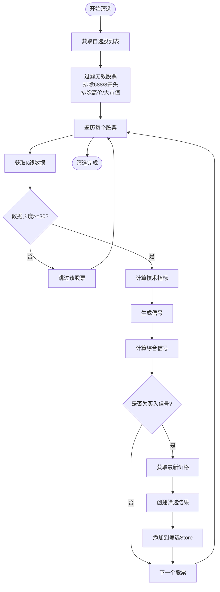
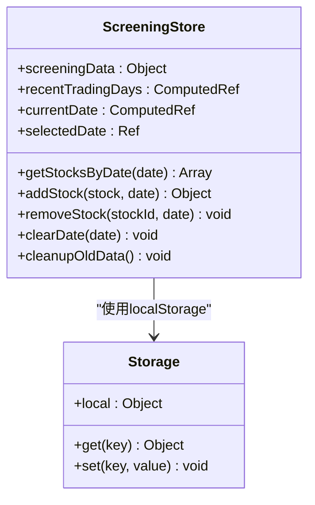
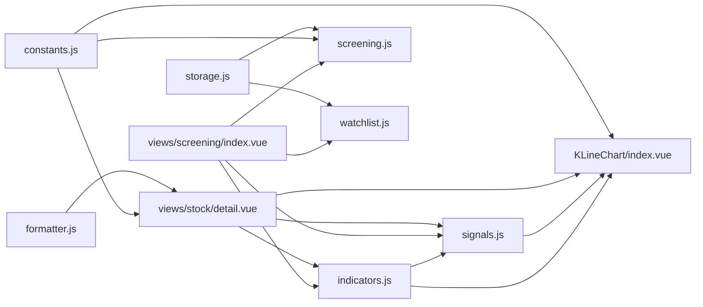

# 技术指标系统

<cite>
**本文引用的文件列表**
- [indicators.js](file://src/utils/indicators.js)
- [signals.js](file://src/utils/signals.js)
- [screening.js](file://src/stores/screening.js)
- [index.vue](file://src/views/screening/index.vue)
- [watchlist.js](file://src/stores/watchlist.js)
- [KLineChart/index.vue](file://src/components/KLineChart/index.vue)
- [IndicatorPanel/index.vue](file://src/components/IndicatorPanel/index.vue)
- [SupportResistanceBar/index.vue](file://src/components/SupportResistanceBar/index.vue)
- [constants.js](file://src/utils/constants.js)
- [formatter.js](file://src/utils/formatter.js)
- [detail.vue](file://src/views/stock/detail.vue)
- [index.js](file://src/stores/index.js)
- [storage.js](file://src/utils/storage.js)
</cite>

## 更新摘要
**变更内容**
- 新增筛选功能中的指标计算和信号生成技术实现
- 补充批量检测买点信号的完整流程
- 增加筛选存储管理和交易日处理机制
- 完善信号权重和阈值配置体系
- 扩展综合评分算法和回测功能
- **新增全网扫描功能**：支持扫描全市场股票的强买入信号
- **增强过滤机制**：排除科创板、北交所、高价股和大市值股票
- **改进UI交互**：提供进度显示和状态反馈

## 目录
1. [简介](#简介)
2. [项目结构](#项目结构)
3. [核心组件](#核心组件)
4. [架构总览](#架构总览)
5. [详细组件分析](#详细组件分析)
6. [筛选功能详解](#筛选功能详解)
7. [依赖关系分析](#依赖关系分析)
8. [性能考量](#性能考量)
9. [故障排查指南](#故障排查指南)
10. [结论](#结论)
11. [附录](#附录)

## 简介
本技术指标系统为量化交易平台的核心分析模块，提供多维技术分析能力：
- 指标计算：移动平均线(MA)、指数平滑异同移动平均线(MACD)、随机指标(KDJ)、相对强弱指数(RSI)、布林带(Bollinger Bands)
- 支撑压力位与枢轴点分析
- 信号生成与综合评分
- **筛选功能**：批量检测买点信号，支持自选股筛选和全网扫描
- **存储管理**：交易日数据清理，筛选记录持久化
- 可视化展示（ECharts）
- 参数化配置与可扩展设计

系统采用纯前端实现，通过函数式计算与组件化渲染，支持实时数据刷新与交互式图表。

## 项目结构
围绕技术指标系统的文件组织如下：
- 计算层：src/utils/indicators.js（指标计算）、src/utils/signals.js（信号生成）
- 存储层：src/stores/screening.js（筛选存储）、src/stores/watchlist.js（自选股存储）
- 展示层：src/components/KLineChart/index.vue（K线与指标可视化）、src/components/IndicatorPanel/index.vue（指标开关）、src/components/SupportResistanceBar/index.vue（支撑压力位）
- 筛选界面：src/views/screening/index.vue（筛选页面）
- 配置与格式化：src/utils/constants.js（颜色、默认参数、阈值）、src/utils/formatter.js（数值格式化）
- 页面集成：src/views/stock/detail.vue（页面容器与数据流）
- 状态管理：src/stores/index.js（Pinia Store 入口）
- 本地存储：src/utils/storage.js（localStorage封装）

```mermaid
graph TB
subgraph "计算层"
IND["indicators.js<br/>指标计算"]
SIG["signals.js<br/>信号生成"]
END
subgraph "存储层"
SCREEN["screening.js<br/>筛选存储"]
WATCH["watchlist.js<br/>自选股存储"]
STORAGE["storage.js<br/>本地存储封装"]
END
subgraph "展示层"
KLINE["KLineChart/index.vue<br/>K线与指标可视化"]
PANEL["IndicatorPanel/index.vue<br/>指标开关"]
SRBAR["SupportResistanceBar/index.vue<br/>支撑压力位"]
END
subgraph "筛选界面"
SCREENVIEW["views/screening/index.vue<br/>筛选页面"]
END
subgraph "配置与格式化"
CONST["constants.js<br/>颜色/默认参数/阈值"]
FMT["formatter.js<br/>格式化工具"]
END
subgraph "页面与状态"
DETAIL["views/stock/detail.vue<br/>页面容器"]
STORE["stores/index.js<br/>Pinia入口"]
END
SCREENVIEW --> IND
SCREENVIEW --> SIG
SCREENVIEW --> SCREEN
SCREENVIEW --> WATCH
DETAIL --> KLINE
DETAIL --> PANEL
DETAIL --> SRBAR
DETAIL --> IND
DETAIL --> SIG
DETAIL --> CONST
DETAIL --> FMT
DETAIL --> STORE
SCREEN --> STORAGE
```

**图表来源**
- [indicators.js:1-245](file://src/utils/indicators.js#L1-L245)
- [signals.js:1-442](file://src/utils/signals.js#L1-L442)
- [screening.js:1-212](file://src/stores/screening.js#L1-L212)
- [watchlist.js:1-53](file://src/stores/watchlist.js#L1-L53)
- [KLineChart/index.vue:1-285](file://src/components/KLineChart/index.vue#L1-L285)
- [IndicatorPanel/index.vue:1-37](file://src/components/IndicatorPanel/index.vue#L1-L37)
- [SupportResistanceBar/index.vue:1-129](file://src/components/SupportResistanceBar/index.vue#L1-L129)
- [index.vue:1-597](file://src/views/screening/index.vue#L1-L597)
- [constants.js:1-68](file://src/utils/constants.js#L1-L68)
- [formatter.js:1-60](file://src/utils/formatter.js#L1-L60)
- [detail.vue:1-295](file://src/views/stock/detail.vue#L1-L295)
- [index.js:1-11](file://src/stores/index.js#L1-L11)
- [storage.js:1-21](file://src/utils/storage.js#L1-L21)

## 核心组件
- 指标计算引擎：提供 MA、MACD、KDJ、RSI、布林带、支撑压力位的完整计算流程
- 信号生成引擎：基于指标规则生成买卖信号，并进行综合评分
- **筛选引擎**：批量检测自选股买点信号，支持多策略组合和全网扫描
- **存储管理**：交易日数据清理，筛选记录持久化存储
- 图表组件：基于 ECharts 渲染蜡烛图与各类技术指标曲线
- 配置与常量：统一的颜色、默认参数、阈值与格式化工具
- 页面容器：整合指标计算、信号生成与可视化展示

## 架构总览
系统采用"计算-存储-展示-筛选"四层架构：
- 计算层：独立函数负责指标与信号计算，便于单元测试与复用
- 存储层：Pinia Store 管理筛选和自选股数据，支持本地存储
- 展示层：Vue 组件负责数据绑定与图表渲染，支持动态开关指标
- 筛选层：专门的筛选页面处理批量信号检测和结果管理



**图表来源**
- [index.vue:395-448](file://src/views/screening/index.vue#L395-L448)
- [screening.js:121-145](file://src/stores/screening.js#L121-L145)
- [signals.js:328-356](file://src/utils/signals.js#L328-L356)

## 详细组件分析

### 指标计算引擎（indicators.js）
- 移动平均线（MA）：提供简单移动平均，支持多周期组合
- 指数平滑异同移动平均线（MACD）：基于 EMA 计算 DIF、DEA 与柱状值
- 随机指标（KDJ）：计算 RSV 并以平滑方式得到 K、D、J
- 相对强弱指数（RSI）：基于 N 日涨跌幅均值得到相对强弱
- 布林带（Bollinger Bands）：以均值为中心，上下轨由标准差确定
- 支撑压力位与枢轴点：结合近期高低价、枢轴点与 MA 关键位生成候选位



**图表来源**
- [indicators.js:7-18](file://src/utils/indicators.js#L7-L18)
- [indicators.js:21-40](file://src/utils/indicators.js#L21-L40)
- [indicators.js:43-75](file://src/utils/indicators.js#L43-L75)
- [indicators.js:78-107](file://src/utils/indicators.js#L78-L107)
- [indicators.js:110-141](file://src/utils/indicators.js#L110-L141)
- [indicators.js:144-169](file://src/utils/indicators.js#L144-L169)
- [indicators.js:172-218](file://src/utils/indicators.js#L172-L218)

### 信号生成引擎（signals.js）
- MACD：金叉/死叉识别，结合柱状图正负区间判断强度
- KDJ：超卖/超买区域穿越、K/D 交叉
- RSI：超卖/超买区域穿越
- 布林带：触碰上下轨后的反向信号
- 均线：多条均线的交叉组合
- **综合评分**：按信号强度加权求和，给出综合建议
- **简易回测**：支持止盈止损的模拟交易回测



**图表来源**
- [signals.js:7-42](file://src/utils/signals.js#L7-L42)
- [signals.js:44-95](file://src/utils/signals.js#L44-L95)
- [signals.js:97-122](file://src/utils/signals.js#L97-L122)
- [signals.js:125-160](file://src/utils/signals.js#L125-L160)
- [signals.js:163-194](file://src/utils/signals.js#L163-L194)
- [signals.js:197-230](file://src/utils/signals.js#L197-L230)
- [signals.js:233-261](file://src/utils/signals.js#L233-L261)

### K线与指标可视化（KLineChart/index.vue）
- 动态网格布局：根据启用的指标自动调整主图与子图高度
- 多子图支持：成交量、MACD、KDJ/RSI 可同时显示
- 数据联动：Tooltip 与 DataZoom 支持跨轴联动
- 指标开关：通过 IndicatorPanel 控制 MA、MACD、KDJ、RSI、BOLL、VOL 的显示



**图表来源**
- [KLineChart/index.vue:10-16](file://src/components/KLineChart/index.vue#L10-L16)
- [IndicatorPanel/index.vue:14-27](file://src/components/IndicatorPanel/index.vue#L14-L27)
- [SupportResistanceBar/index.vue:43-47](file://src/components/SupportResistanceBar/index.vue#L43-L47)

### 页面容器与数据流（detail.vue）
- 页面加载时根据路由参数设置股票与周期
- 调用指标计算与信号生成，传递给图表与面板组件
- 提供指标摘要与综合信号展示



**图表来源**
- [detail.vue:125-174](file://src/views/stock/detail.vue#L125-L174)
- [indicators.js:221-244](file://src/utils/indicators.js#L221-L244)
- [signals.js:328-356](file://src/utils/signals.js#L328-L356)

## 筛选功能详解

### 筛选引擎（index.vue）
筛选功能提供批量检测自选股买点信号的能力，核心流程包括：
- **数据获取**：从API获取日K线数据（240周期，100天）
- **指标计算**：调用指标计算引擎生成完整技术指标
- **信号生成**：基于多策略生成买卖信号
- **综合评分**：计算最近N根K线的综合信号强度
- **结果处理**：将符合条件的股票添加到筛选列表

**新增功能**：
- **全网扫描**：支持扫描全市场股票的强买入信号
- **智能过滤**：排除科创板(688开头)、北交所(8开头)、高价股(>300)和大市值股(>1200亿)
- **进度显示**：提供实时检测进度和状态反馈
- **批量处理**：支持自选股批量检测和全网扫描



**图表来源**
- [index.vue:395-448](file://src/views/screening/index.vue#L395-L448)
- [index.vue:453-501](file://src/views/screening/index.vue#L453-L501)

### 筛选存储管理（screening.js）
筛选存储提供完整的数据管理能力：
- **交易日处理**：自动识别交易日，排除周末
- **数据清理**：只保留最近5个交易日的数据
- **去重机制**：防止同一股票重复添加
- **本地存储**：使用localStorage持久化筛选结果
- **日期管理**：支持多日期切换查看



**图表来源**
- [screening.js:44-212](file://src/stores/screening.js#L44-L212)

### 信号权重与阈值配置（constants.js）
信号系统采用标准化的权重和阈值配置：
- **信号强度权重**：强烈(3) > 中等(2) > 弱(1)
- **综合评分阈值**：强烈买入≥5，买入≥2，卖出≤-2，强烈卖出≤-5
- **策略权重**：MACD、KDJ、RSI、BOLL、MA 等策略的信号强度不同

**章节来源**
- [constants.js:47-60](file://src/utils/constants.js#L47-L60)
- [signals.js:328-356](file://src/utils/signals.js#L328-L356)

**章节来源**
- [indicators.js:6-18](file://src/utils/indicators.js#L6-L18)
- [indicators.js:20-40](file://src/utils/indicators.js#L20-L40)
- [indicators.js:42-75](file://src/utils/indicators.js#L42-L75)
- [indicators.js:77-107](file://src/utils/indicators.js#L77-L107)
- [indicators.js:109-141](file://src/utils/indicators.js#L109-L141)
- [indicators.js:143-169](file://src/utils/indicators.js#L143-L169)
- [indicators.js:171-218](file://src/utils/indicators.js#L171-L218)
- [indicators.js:220-244](file://src/utils/indicators.js#L220-L244)
- [signals.js:7-42](file://src/utils/signals.js#L7-L42)
- [signals.js:44-95](file://src/utils/signals.js#L44-L95)
- [signals.js:97-122](file://src/utils/signals.js#L97-L122)
- [signals.js:125-160](file://src/utils/signals.js#L125-L160)
- [signals.js:163-194](file://src/utils/signals.js#L163-L194)
- [signals.js:197-230](file://src/utils/signals.js#L197-L230)
- [signals.js:233-261](file://src/utils/signals.js#L233-L261)
- [index.vue:395-448](file://src/views/screening/index.vue#L395-L448)
- [screening.js:44-212](file://src/stores/screening.js#L44-L212)
- [constants.js:47-60](file://src/utils/constants.js#L47-L60)

## 依赖关系分析
- 指标计算依赖 ECharts 进行可视化渲染
- 信号生成依赖指标计算结果
- 筛选功能依赖自选股存储和API接口
- 页面容器依赖 Store 管理状态与数据
- 配置常量统一颜色与默认参数，避免硬编码



**图表来源**
- [indicators.js:1-245](file://src/utils/indicators.js#L1-L245)
- [signals.js:1-442](file://src/utils/signals.js#L1-L442)
- [screening.js:1-212](file://src/stores/screening.js#L1-L212)
- [watchlist.js:1-53](file://src/stores/watchlist.js#L1-L53)
- [KLineChart/index.vue:1-285](file://src/components/KLineChart/index.vue#L1-L285)
- [index.vue:1-597](file://src/views/screening/index.vue#L1-L597)
- [constants.js:1-68](file://src/utils/constants.js#L1-L68)
- [formatter.js:1-60](file://src/utils/formatter.js#L1-L60)
- [detail.vue:1-295](file://src/views/stock/detail.vue#L1-L295)
- [storage.js:1-21](file://src/utils/storage.js#L1-L21)

## 性能考量
- 时间复杂度
  - MA：O(N×P)，其中 N 为数据长度，P 为周期数
  - EMA：O(N)
  - MACD：O(N)
  - KDJ：O(N×P)
  - RSI：O(N)
  - 布林带：O(N×P)
  - 支撑压力位：O(N×P)
  - **筛选功能**：批量处理时为 O(N×M×P)，其中 N 为股票数，M 为每只股票的计算量
- 空间复杂度：各指标输出数组长度与输入一致，整体 O(N)
- 优化建议
  - 使用滑动窗口减少重复计算（如 MA 的累积和）
  - 对长周期指标采用分段缓存策略
  - 在图表渲染前进行数据裁剪，仅保留最近 M 条用于展示
  - 将 ECharts 的 setOption 设置为 notMerge，避免不必要的重绘
  - 对信号生成采用增量更新，仅处理新增数据点
  - **筛选功能优化**：添加请求节流，避免频繁API调用
  - **全网扫描优化**：使用更短的延迟(150ms vs 200ms)提升扫描速度

## 故障排查指南
- 指标显示为空或全为 null
  - 检查数据长度是否满足最小周期要求
  - 确认传入的 klineData 是否包含 close/high/low/volume 字段
- 图表不更新
  - 确认 props 变更触发了 watch 与 renderChart
  - 检查 enabledIndicators 是否正确传入
- 信号异常
  - 核对信号强度权重与阈值配置
  - 检查 generateAllSignals 的启用策略列表
- 支撑压力位不准确
  - 调整 lookback 参数与去重阈值
  - 确认 MA 周期与当前价格的匹配
- **筛选功能问题**
  - 检查自选股列表是否为空
  - 确认API接口返回的数据格式正确
  - 验证筛选存储的本地存储权限
  - 检查交易日计算逻辑是否正确
  - **全网扫描问题**：确认getAllStocks接口正常工作
  - **过滤机制问题**：检查isValidStock和isValidPriceAndCap函数

**章节来源**
- [indicators.js:21-40](file://src/utils/indicators.js#L21-L40)
- [KLineChart/index.vue:196-200](file://src/components/KLineChart/index.vue#L196-L200)
- [signals.js:328-356](file://src/utils/signals.js#L328-L356)
- [constants.js:48-60](file://src/utils/constants.js#L48-L60)
- [index.vue:395-448](file://src/views/screening/index.vue#L395-L448)
- [screening.js:121-145](file://src/stores/screening.js#L121-L145)

## 结论
该技术指标系统以函数式计算为核心，配合组件化展示与统一配置，实现了从数据到可视化的完整链路。新增的筛选功能进一步增强了系统的实用性，通过批量信号检测和存储管理，为用户提供了一站式的股票筛选解决方案。系统具备良好的可扩展性与可维护性，建议在实际部署中结合业务场景对参数进行调优，并持续监控性能表现。

## 附录

### 指标参数与默认值
- MACD：短期周期、长期周期、信号周期
- KDJ：周期、K 平滑周期、D 平滑周期
- RSI：周期
- 布林带：周期、倍数
- MA：周期列表

**章节来源**
- [constants.js:38-45](file://src/utils/constants.js#L38-L45)
- [indicators.js:43-75](file://src/utils/indicators.js#L43-L75)
- [indicators.js:78-107](file://src/utils/indicators.js#L78-L107)
- [indicators.js:110-141](file://src/utils/indicators.js#L110-L141)
- [indicators.js:144-169](file://src/utils/indicators.js#L144-L169)
- [indicators.js:34-40](file://src/utils/indicators.js#L34-L40)

### 指标解读与参数调优建议
- MA：短期均线用于捕捉趋势，长期均线用于确认方向；周期过短噪声大，过长滞后性强
- MACD：参数组合影响灵敏度与信号质量；可结合柱状图正负区间判断强度
- KDJ：超买超卖阈值因市场而异；在震荡市中更有效，在单边行情中需谨慎
- RSI：30/70 为常用阈值，极端值（20/80）可作为强信号参考
- 布林带：标准差倍数影响轨道宽度；结合价格位置判断突破有效性
- 支撑压力位：枢轴点与 MA 关键位结合使用，提高可靠性

### 代码实现示例路径
- 指标计算入口：[calculateAllIndicators:221-244](file://src/utils/indicators.js#L221-L244)
- 信号生成入口：[generateAllSignals:288-325](file://src/utils/signals.js#L288-L325)
- 综合评分入口：[getCompositeSignal:328-356](file://src/utils/signals.js#L328-L356)
- 图表构建：[buildOption:22-241](file://src/components/KLineChart/index.vue#L22-L241)
- 指标开关组件：[IndicatorPanel:1-37](file://src/components/IndicatorPanel/index.vue#L1-L37)
- 支撑压力位组件：[SupportResistanceBar:1-129](file://src/components/SupportResistanceBar/index.vue#L1-L129)
- **筛选页面**：[筛选功能实现：395-448:395-448](file://src/views/screening/index.vue#L395-L448)
- **筛选存储**：[存储管理：121-145:121-145](file://src/stores/screening.js#L121-L145)
- **全网扫描**：[scanMarketBuySignals:453-501](file://src/views/screening/index.vue#L453-L501)

**章节来源**
- [indicators.js:221-244](file://src/utils/indicators.js#L221-L244)
- [signals.js:288-325](file://src/utils/signals.js#L288-L325)
- [signals.js:328-356](file://src/utils/signals.js#L328-L356)
- [KLineChart/index.vue:22-241](file://src/components/KLineChart/index.vue#L22-L241)
- [IndicatorPanel/index.vue:1-37](file://src/components/IndicatorPanel/index.vue#L1-L37)
- [SupportResistanceBar/index.vue:1-129](file://src/components/SupportResistanceBar/index.vue#L1-L129)
- [index.vue:395-448](file://src/views/screening/index.vue#L395-L448)
- [screening.js:121-145](file://src/stores/screening.js#L121-L145)
- [index.vue:453-501](file://src/views/screening/index.vue#L453-L501)