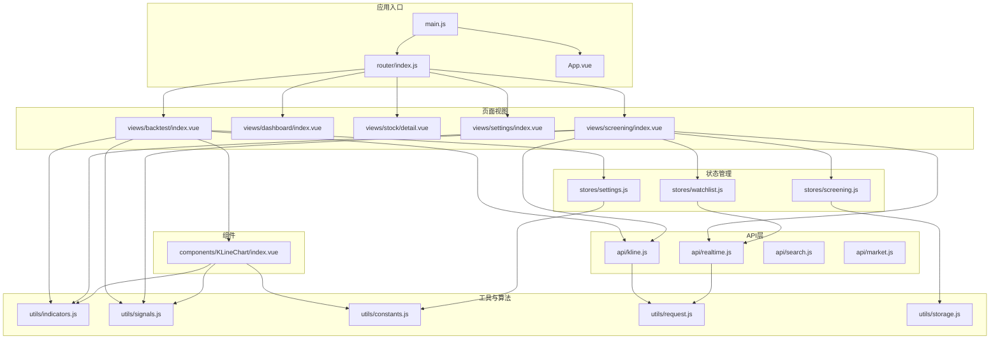
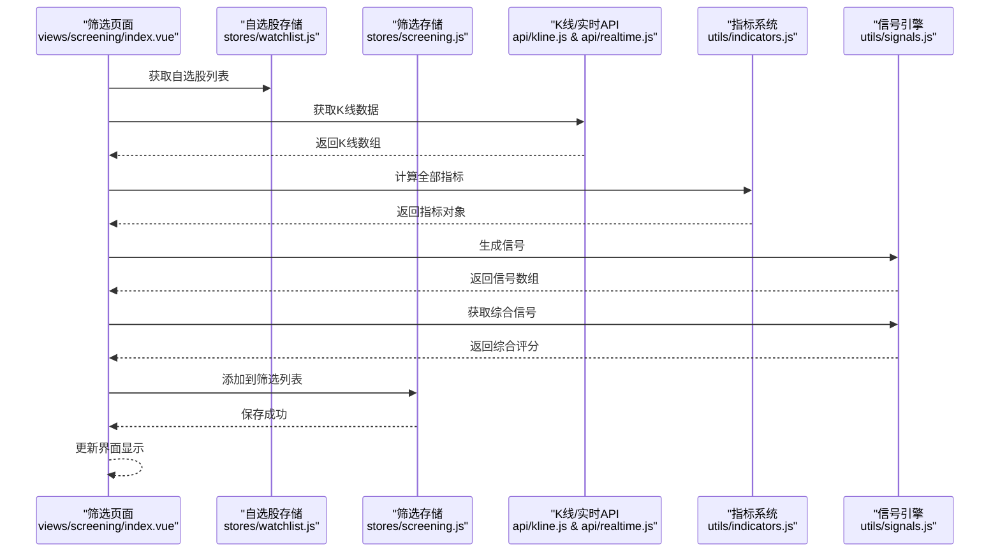
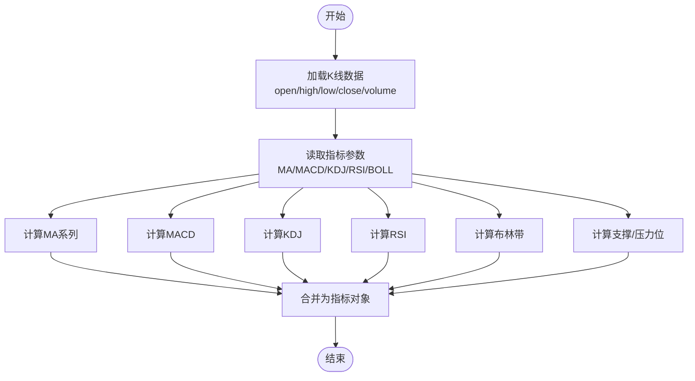
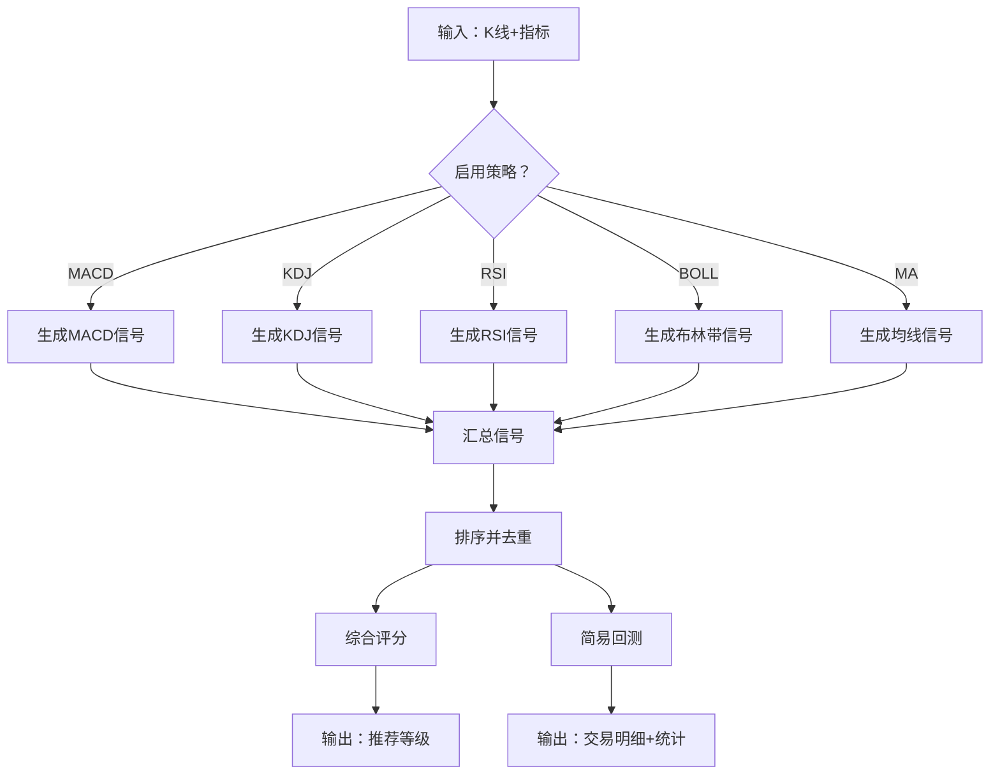
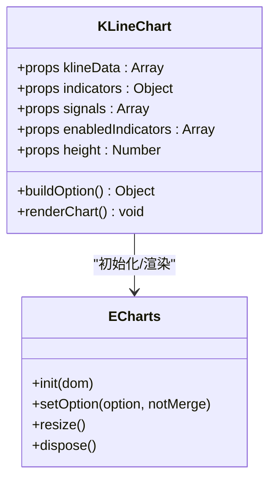
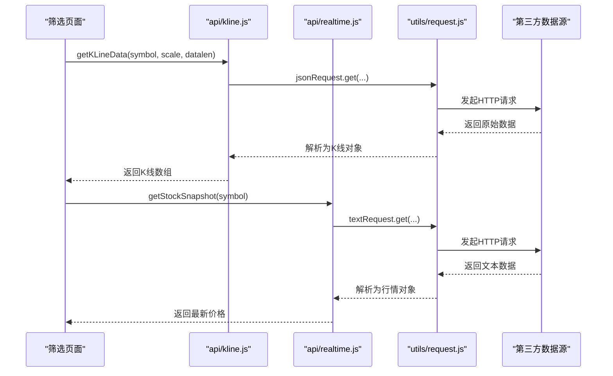
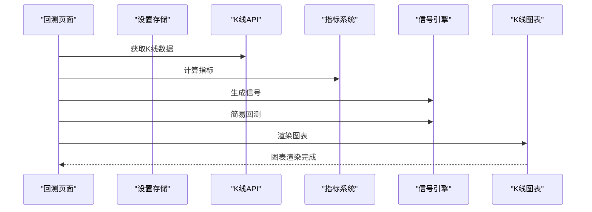
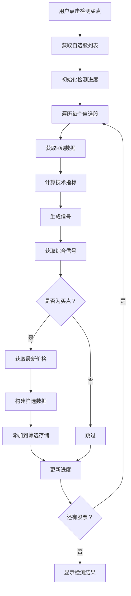
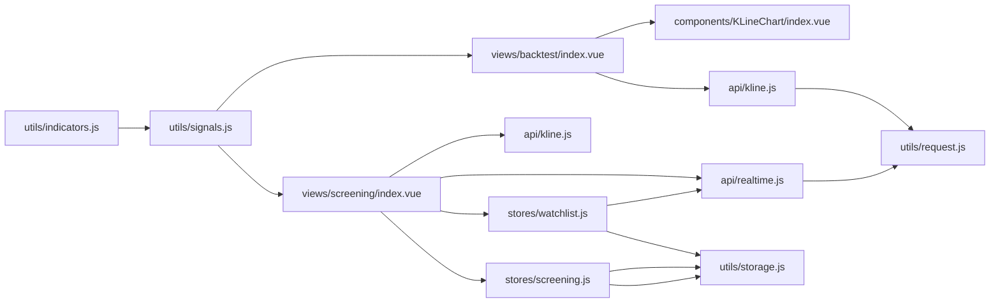

# 核心功能模块

<cite>
**本文引用的文件列表**
- [src/utils/indicators.js](file://src/utils/indicators.js)
- [src/utils/signals.js](file://src/utils/signals.js)
- [src/components/KLineChart/index.vue](file://src/components/KLineChart/index.vue)
- [src/views/backtest/index.vue](file://src/views/backtest/index.vue)
- [src/views/screening/index.vue](file://src/views/screening/index.vue)
- [src/api/kline.js](file://src/api/kline.js)
- [src/api/market.js](file://src/api/market.js)
- [src/api/realtime.js](file://src/api/realtime.js)
- [src/utils/constants.js](file://src/utils/constants.js)
- [src/stores/settings.js](file://src/stores/settings.js)
- [src/stores/screening.js](file://src/stores/screening.js)
- [src/stores/watchlist.js](file://src/stores/watchlist.js)
- [src/utils/storage.js](file://src/utils/storage.js)
- [src/utils/request.js](file://src/utils/request.js)
- [src/router/index.js](file://src/router/index.js)
- [src/main.js](file://src/main.js)
- [src/App.vue](file://src/App.vue)
- [package.json](file://package.json)
</cite>

## 目录
1. [简介](#简介)
2. [项目结构](#项目结构)
3. [核心组件](#核心组件)
4. [架构总览](#架构总览)
5. [详细组件分析](#详细组件分析)
6. [依赖关系分析](#依赖关系分析)
7. [性能考量](#性能考量)
8. [故障排查指南](#故障排查指南)
9. [结论](#结论)
10. [附录](#附录)

## 简介
本文件面向量化交易平台的核心功能模块，系统性梳理技术指标系统、信号生成引擎、K线图表系统、API数据层、回测系统与**新增的每日筛选记录功能模块**之间的协作关系与数据流转过程。文档同时给出模块的扩展性与可定制性说明，以及最佳实践与性能优化建议，并通过多种可视化图表帮助开发者快速理解整体运作机制。

## 项目结构
该平台采用前端单页应用（Vue 3 + Vite）架构，围绕"数据获取—指标计算—信号生成—图表渲染—回测验证—筛选管理"的完整闭环设计组织模块。核心目录与职责概览：
- src/utils：通用工具与算法实现（指标计算、信号策略、常量与请求封装）
- src/api：对外部数据源的访问封装（K线、实时行情、搜索、市场指数）
- src/components：可复用UI组件（K线图表、信号标记、搜索框等）
- src/views：页面级视图（仪表盘、个股详情、信号回测、**每日筛选记录**、设置）
- src/stores：状态管理（Pinia），用于持久化用户偏好与参数
- src/router：路由配置与进度条控制
- src/main.js：应用入口，注册插件与挂载

**图表来源**
- [src/main.js:1-17](file://src/main.js#L1-L17)
- [src/router/index.js:1-64](file://src/router/index.js#L1-L64)
- [src/views/backtest/index.vue:126-182](file://src/views/backtest/index.vue#L126-L182)
- [src/views/screening/index.vue:1-475](file://src/views/screening/index.vue#L1-L475)
- [src/components/KLineChart/index.vue:1-285](file://src/components/KLineChart/index.vue#L1-L285)
- [src/stores/settings.js:1-70](file://src/stores/settings.js#L1-L70)
- [src/stores/screening.js:1-212](file://src/stores/screening.js#L1-L212)
- [src/stores/watchlist.js:1-53](file://src/stores/watchlist.js#L1-L53)
- [src/api/kline.js:1-27](file://src/api/kline.js#L1-L27)
- [src/api/realtime.js:1-56](file://src/api/realtime.js#L1-L56)
- [src/utils/indicators.js:1-245](file://src/utils/indicators.js#L1-L245)
- [src/utils/signals.js:1-347](file://src/utils/signals.js#L1-L347)
- [src/utils/constants.js:1-68](file://src/utils/constants.js#L1-L68)
- [src/utils/request.js:1-29](file://src/utils/request.js#L1-L29)
- [src/utils/storage.js:1-21](file://src/utils/storage.js#L1-L21)

**章节来源**
- [src/main.js:1-17](file://src/main.js#L1-L17)
- [src/router/index.js:1-64](file://src/router/index.js#L1-L64)
- [package.json:1-28](file://package.json#L1-L28)

## 核心组件
- 技术指标系统：提供多周期K线数据的指标计算能力，覆盖MA、MACD、KDJ、RSI、布林带、支撑/压力位等，支持参数化与批量计算。
- 信号生成引擎：基于指标阈值与形态规则生成买卖信号，支持综合评分与简易回测统计。
- K线图表系统：基于 ECharts 实现蜡烛图、成交量、多指标叠加与信号标记，具备自适应布局与交互缩放。
- API数据层：封装外部数据接口（如新浪财经K线、实时行情），统一错误处理与响应格式转换。
- 回测系统：在回测页面中执行信号回测，输出交易明细与统计指标，支持按策略拆分统计。
- **每日筛选记录功能模块**：提供股票买点信号的批量检测和管理能力，支持按日期维度存储和查询筛选结果。

**章节来源**
- [src/utils/indicators.js:1-245](file://src/utils/indicators.js#L1-L245)
- [src/utils/signals.js:1-347](file://src/utils/signals.js#L1-L347)
- [src/components/KLineChart/index.vue:1-285](file://src/components/KLineChart/index.vue#L1-L285)
- [src/api/kline.js:1-27](file://src/api/kline.js#L1-L27)
- [src/views/backtest/index.vue:126-182](file://src/views/backtest/index.vue#L126-L182)
- [src/views/screening/index.vue:1-475](file://src/views/screening/index.vue#L1-L475)

## 架构总览
平台以"页面视图"为入口，通过"状态管理"读取用户参数，调用"API层"获取K线数据，随后进入"指标系统"与"信号引擎"，最终由"图表组件"渲染展示；回测流程在回测页面中串联上述链路并输出统计结果。**新增的筛选功能模块**通过"自选股存储"与"筛选存储"实现买点信号的批量检测和管理。

**图表来源**
- [src/views/screening/index.vue:289-332](file://src/views/screening/index.vue#L289-L332)
- [src/stores/watchlist.js:1-53](file://src/stores/watchlist.js#L1-L53)
- [src/stores/screening.js:121-145](file://src/stores/screening.js#L121-L145)
- [src/api/kline.js:9-26](file://src/api/kline.js#L9-L26)
- [src/api/realtime.js:52-55](file://src/api/realtime.js#L52-L55)
- [src/utils/indicators.js:221-244](file://src/utils/indicators.js#L221-L244)
- [src/utils/signals.js:197-230](file://src/utils/signals.js#L197-L230)
- [src/utils/signals.js:233-261](file://src/utils/signals.js#L233-L261)

## 详细组件分析

### 技术指标系统
- 设计要点
  - 指标计算函数独立、可组合，便于扩展新指标与参数化。
  - 提供批量计算入口，统一返回结构，便于后续信号与图表消费。
  - 对边界条件（如周期不足）进行保护，避免空值传播。
- 关键算法
  - EMA/MA：滑动窗口与递推公式，时间复杂度 O(n)。
  - MACD：双EMA差值与信号线，时间复杂度 O(n)。
  - KDJ：RSV计算与平滑，时间复杂度 O(n·k)（k为周期）。
  - RSI：相对强弱指数，时间复杂度 O(n)。
  - 布林带：均值与标准差，时间复杂度 O(n·k)。
  - 支撑/压力位：多来源聚合与合并，时间复杂度近似 O(n)。
- 参数化与默认值
  - 通过常量与设置存储提供默认参数，支持用户调整。

**图表来源**
- [src/utils/indicators.js:221-244](file://src/utils/indicators.js#L221-L244)
- [src/utils/constants.js:38-45](file://src/utils/constants.js#L38-L45)
- [src/stores/settings.js:54-62](file://src/stores/settings.js#L54-L62)

**章节来源**
- [src/utils/indicators.js:1-245](file://src/utils/indicators.js#L1-L245)
- [src/utils/constants.js:38-45](file://src/utils/constants.js#L38-L45)
- [src/stores/settings.js:1-70](file://src/stores/settings.js#L1-L70)

### 信号生成引擎
- 设计要点
  - 按策略独立实现，统一输出标准化信号结构（日期、索引、类型、强度、价格、描述）。
  - 支持综合评分与简易回测，便于快速评估策略有效性。
- 关键策略
  - MACD：金叉/死叉结合柱状图正负区间判断强度。
  - KDJ：超买/超卖阈值与交叉形态。
  - RSI：超买/超卖阈值与穿越判断。
  - 布林带：触轨反弹/回落形态。
  - 均线：多周期交叉组合。
- 综合评分与回测
  - 基于信号强度权重与时间窗口进行评分，输出推荐等级。
  - 简易回测模拟止盈止损与持有期，输出交易明细与统计指标。

**图表来源**
- [src/utils/signals.js:197-230](file://src/utils/signals.js#L197-L230)
- [src/utils/signals.js:233-261](file://src/utils/signals.js#L233-L261)
- [src/utils/signals.js:264-346](file://src/utils/signals.js#L264-L346)

**章节来源**
- [src/utils/signals.js:1-347](file://src/utils/signals.js#L1-L347)

### K线图表系统
- 设计要点
  - 基于 ECharts 的多子图布局，主图为K线与均线/布林带，子图可选MACD、KDJ/RSI、成交量。
  - 自适应网格高度与X轴DataZoom，支持滑块与内部缩放。
  - 信号标记使用不同符号与颜色标注买卖点。
- 数据绑定
  - 接收K线数据、指标对象、信号数组与启用指标列表，动态构建 series 与 markPoint。
- 性能与交互
  - 使用防抖与ResizeObserver保证渲染性能与响应式；禁用动画提升大数据量下的交互流畅度。

**图表来源**
- [src/components/KLineChart/index.vue:10-277](file://src/components/KLineChart/index.vue#L10-L277)

**章节来源**
- [src/components/KLineChart/index.vue:1-285](file://src/components/KLineChart/index.vue#L1-L285)

### API数据层
- 设计要点
  - 封装 axios 实例，分别处理JSON与文本响应，统一封装错误提示。
  - K线API对接第三方数据源，解析为统一结构。
  - **实时行情API**：解析新浪行情文本格式，提供批量获取能力。
- 错误处理
  - 捕获网络错误、超时与服务端异常，统一弹出消息提示。

**图表来源**
- [src/api/kline.js:9-26](file://src/api/kline.js#L9-L26)
- [src/api/realtime.js:39-55](file://src/api/realtime.js#L39-L55)
- [src/utils/request.js:5-29](file://src/utils/request.js#L5-L29)

**章节来源**
- [src/api/kline.js:1-27](file://src/api/kline.js#L1-L27)
- [src/api/realtime.js:1-56](file://src/api/realtime.js#L1-L56)
- [src/utils/request.js:1-29](file://src/utils/request.js#L1-L29)

### 回测系统
- 设计要点
  - 在回测页面中，按用户选择的策略生成信号并执行简易回测。
  - 输出总信号数、胜率、平均收益、最大回撤等宏观指标，以及分策略统计与交易明细。
- 流程
  - 搜索股票 -> 获取K线 -> 计算指标 -> 生成信号 -> 执行回测 -> 展示结果。

**图表来源**
- [src/views/backtest/index.vue:158-171](file://src/views/backtest/index.vue#L158-L171)
- [src/utils/signals.js:264-346](file://src/utils/signals.js#L264-L346)

**章节来源**
- [src/views/backtest/index.vue:1-242](file://src/views/backtest/index.vue#L1-L242)
- [src/utils/signals.js:264-346](file://src/utils/signals.js#L264-L346)

### **新增：每日筛选记录功能模块**
- 设计要点
  - **批量检测**：支持对自选股列表进行批量买点信号检测，自动过滤无效信号。
  - **日期维度管理**：按最近5个交易日维度存储筛选结果，自动清理过期数据。
  - **本地存储**：使用localStorage持久化存储，确保数据可靠性。
  - **进度反馈**：提供检测进度显示和结果统计。
- 核心功能
  - **自选股集成**：与自选股存储无缝集成，支持实时行情获取。
  - **信号检测**：自动获取K线数据、计算指标、生成信号并获取综合评分。
  - **数据管理**：支持添加、移除、清空指定日期的筛选记录。
  - **日期选择**：提供日期选择器，支持历史日期查询。
- 工作流程
  - 用户点击"检测买点"按钮 -> 获取自选股列表 -> 逐个检测信号 -> 过滤有效买点 -> 保存到筛选存储 -> 更新界面显示。

**图表来源**
- [src/views/screening/index.vue:337-380](file://src/views/screening/index.vue#L337-L380)
- [src/stores/screening.js:121-145](file://src/stores/screening.js#L121-L145)
- [src/stores/watchlist.js:11-18](file://src/stores/watchlist.js#L11-L18)

**章节来源**
- [src/views/screening/index.vue:1-475](file://src/views/screening/index.vue#L1-L475)
- [src/stores/screening.js:1-212](file://src/stores/screening.js#L1-L212)
- [src/stores/watchlist.js:1-53](file://src/stores/watchlist.js#L1-L53)

## 依赖关系分析
- 模块内聚与耦合
  - 指标系统与信号引擎解耦，通过标准化数据结构传递，便于替换或扩展。
  - 图表组件仅依赖数据结构，不直接依赖具体策略实现，利于维护。
  - API层与业务逻辑分离，便于切换数据源或增加缓存。
  - **筛选模块**与自选股模块、存储模块形成清晰的依赖关系。
- 外部依赖
  - Vue 3、Element Plus、ECharts、Axios、Pinia 等。
- 可能的循环依赖
  - 当前未发现直接循环依赖；若新增策略或指标，需确保导入顺序与导出命名规范。

**图表来源**
- [src/utils/indicators.js:1-245](file://src/utils/indicators.js#L1-L245)
- [src/utils/signals.js:1-347](file://src/utils/signals.js#L1-L347)
- [src/views/backtest/index.vue:126-182](file://src/views/backtest/index.vue#L126-L182)
- [src/views/screening/index.vue:1-475](file://src/views/screening/index.vue#L1-L475)
- [src/components/KLineChart/index.vue:1-285](file://src/components/KLineChart/index.vue#L1-L285)
- [src/api/kline.js:1-27](file://src/api/kline.js#L1-L27)
- [src/api/realtime.js:1-56](file://src/api/realtime.js#L1-L56)
- [src/utils/request.js:1-29](file://src/utils/request.js#L1-L29)
- [src/stores/screening.js:1-212](file://src/stores/screening.js#L1-L212)
- [src/stores/watchlist.js:1-53](file://src/stores/watchlist.js#L1-L53)
- [src/utils/storage.js:1-21](file://src/utils/storage.js#L1-L21)

**章节来源**
- [package.json:11-26](file://package.json#L11-L26)

## 性能考量
- 指标计算
  - 对长序列计算采用滑动窗口与递推公式，避免重复计算；对多周期指标建议按需启用，减少不必要的计算。
- 图表渲染
  - 禁用动画与合理设置DataZoom范围，避免大数据量时的卡顿；使用ResizeObserver监听容器尺寸变化。
- 网络请求
  - 合理设置超时与重试策略；对频繁查询进行节流/防抖；必要时引入本地缓存。
- 回测性能
  - 简易回测已做基础优化；若需要更复杂的回测，可考虑分批计算与异步处理。
- **筛选功能性能**
  - **批量检测**：使用200ms延时避免请求过快，防止被服务器限制。
  - **数据清理**：自动清理超过5天的历史数据，避免存储膨胀。
  - **本地存储**：使用localStorage，避免频繁网络请求。

## 故障排查指南
- 数据为空或异常
  - 检查API返回是否为数组；确认解析字段与类型转换是否正确。
- 图表不显示或渲染异常
  - 确认传入数据结构完整；检查启用指标与指标对象是否匹配。
- 信号缺失
  - 核对策略开关与参数设置；确认信号生成函数的输入数据是否满足阈值条件。
- 设置未生效
  - 检查设置存储的持久化与读取逻辑；确认默认参数与用户设置的优先级。
- **筛选功能问题**
  - **检测失败**：检查网络连接和API可用性；确认K线数据长度是否足够。
  - **数据丢失**：检查localStorage权限和容量；确认数据清理逻辑是否正常。
  - **进度异常**：检查定时器和异步操作是否正确执行。

**章节来源**
- [src/api/kline.js:9-26](file://src/api/kline.js#L9-L26)
- [src/utils/request.js:17-28](file://src/utils/request.js#L17-L28)
- [src/components/KLineChart/index.vue:22-241](file://src/components/KLineChart/index.vue#L22-L241)
- [src/utils/signals.js:197-230](file://src/utils/signals.js#L197-L230)
- [src/stores/settings.js:17-26](file://src/stores/settings.js#L17-L26)
- [src/views/screening/index.vue:328-332](file://src/views/screening/index.vue#L328-L332)
- [src/stores/screening.js:87-90](file://src/stores/screening.js#L87-L90)

## 结论
该平台以清晰的模块划分与标准化的数据结构实现了从数据到可视化的完整链路。技术指标系统与信号引擎相互独立，K线图表系统与业务逻辑解耦，API层与工具层职责明确。**新增的每日筛选记录功能模块**进一步完善了平台的实用价值，提供了批量买点检测和管理能力。通过参数化与策略开关，系统具备良好的可定制性与扩展性。建议在后续迭代中进一步完善缓存策略、回测引擎与多数据源适配，以提升性能与可用性。

## 附录

### 扩展性与可定制性指南
- 添加新的技术指标
  - 在指标系统中新增计算函数，遵循现有返回结构；在批量计算入口中注册；在设置存储中增加对应参数项。
- 添加新的信号策略
  - 在信号引擎中新增策略函数，保持统一输出结构；在综合生成器中注册启用开关；在回测统计中纳入分策略统计。
- 新增图表类型
  - 在图表组件中扩展series与grid布局；确保输入数据结构兼容；注意性能与交互体验。
- **新增筛选功能**
  - **扩展检测策略**：在筛选页面中添加新的信号检测逻辑，支持更多技术指标。
  - **自定义存储格式**：根据需求调整筛选数据的存储结构和字段。
  - **批量处理优化**：实现更高效的批量检测算法，支持并发处理。
- 参数化与持久化
  - 通过设置存储集中管理参数；提供重置默认值与保存逻辑，确保用户体验一致。

**章节来源**
- [src/utils/indicators.js:221-244](file://src/utils/indicators.js#L221-L244)
- [src/utils/signals.js:197-230](file://src/utils/signals.js#L197-L230)
- [src/stores/settings.js:54-62](file://src/stores/settings.js#L54-L62)
- [src/components/KLineChart/index.vue:22-241](file://src/components/KLineChart/index.vue#L22-L241)
- [src/views/screening/index.vue:289-332](file://src/views/screening/index.vue#L289-L332)
- [src/stores/screening.js:121-145](file://src/stores/screening.js#L121-L145)