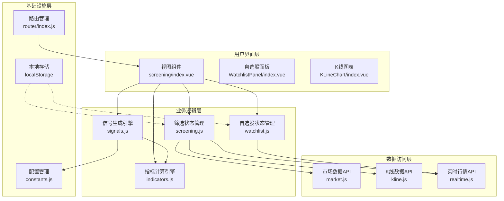
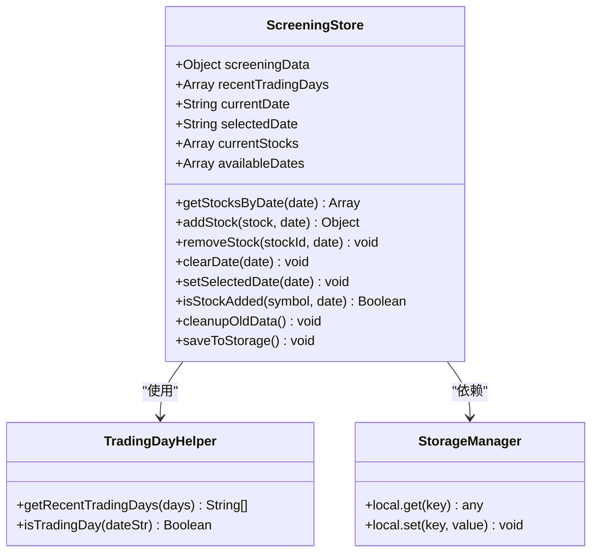
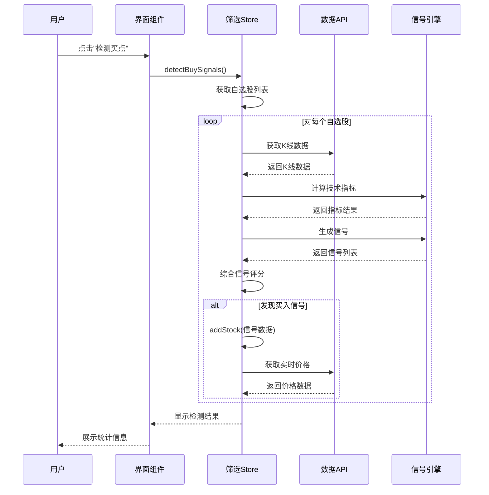
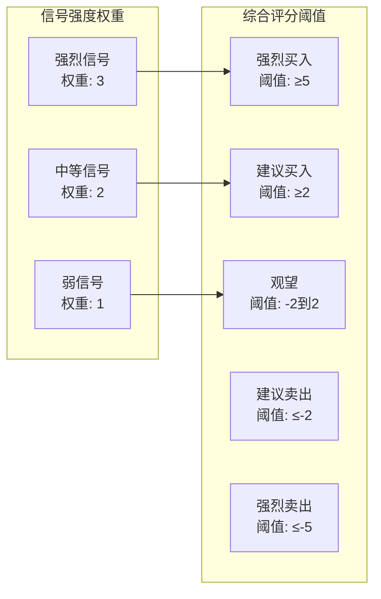
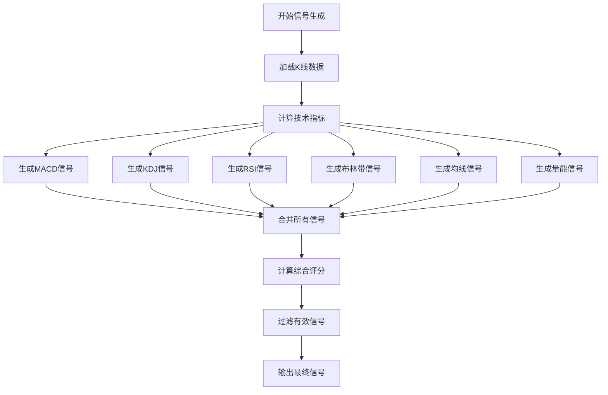
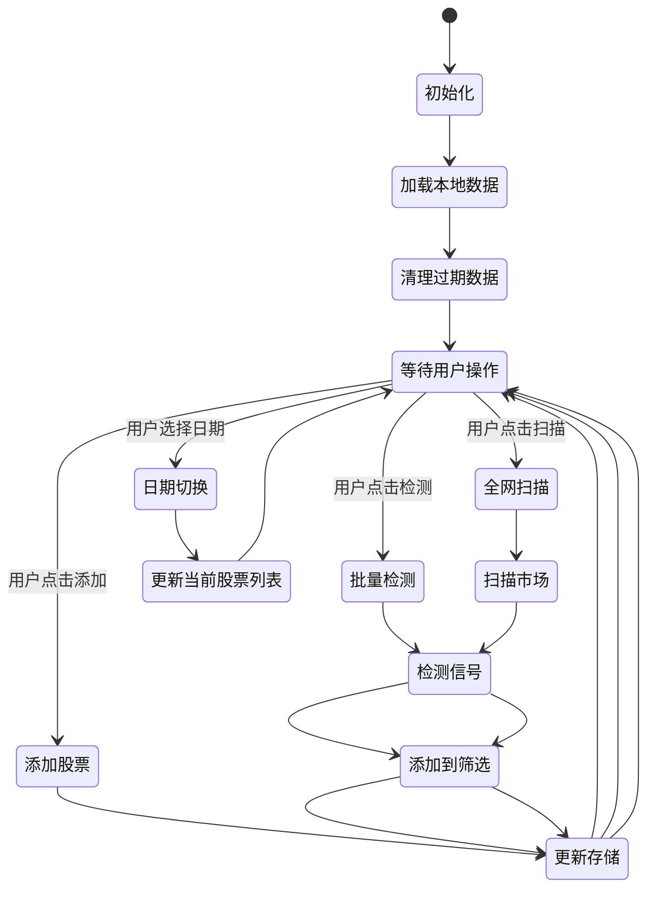
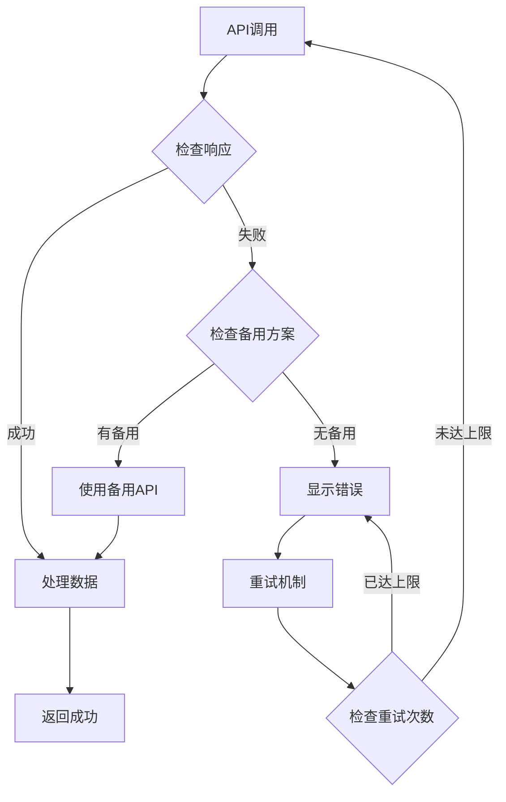

# 每日筛选系统

<cite>
**本文档引用的文件**
- [screening.js](file://src/stores/screening.js)
- [index.vue](file://src/views/screening/index.vue)
- [signals.js](file://src/utils/signals.js)
- [constants.js](file://src/utils/constants.js)
- [watchlist.js](file://src/stores/watchlist.js)
- [market.js](file://src/api/market.js)
- [indicators.js](file://src/utils/indicators.js)
- [index.js](file://src/router/index.js)
- [main.js](file://src/main.js)
- [package.json](file://package.json)
</cite>

## 目录
1. [项目概述](#项目概述)
2. [系统架构](#系统架构)
3. [核心组件](#核心组件)
4. [技术指标体系](#技术指标体系)
5. [信号生成引擎](#信号生成引擎)
6. [数据流分析](#数据流分析)
7. [性能优化策略](#性能优化策略)
8. [故障处理机制](#故障处理机制)
9. [扩展性设计](#扩展性设计)
10. [总结](#总结)

## 项目概述

每日筛选系统是一个基于Vue 3 + Pinia + Element Plus构建的量化交易辅助工具，专注于提供智能的股票筛选和信号检测功能。该系统通过技术指标分析和多策略组合，帮助用户识别潜在的投资机会，并提供完整的筛选历史管理功能。

### 主要功能特性

- **智能信号检测**：基于多种技术指标的自动化信号生成
- **多策略组合**：MACD、KDJ、RSI、布林带、均线、量能等六种策略
- **筛选历史管理**：按交易日维度的数据存储和查询
- **批量扫描功能**：支持全市场股票的自动化扫描
- **实时监控**：自选股列表的实时行情监控
- **可视化展示**：直观的信号强度和统计信息展示

## 系统架构

系统采用现代化的前端架构设计，基于Vue 3 Composition API和Pinia状态管理，实现了清晰的分层结构。

**图表来源**
- [index.vue:1-556](file://src/views/screening/index.vue#L1-L556)
- [screening.js:44-211](file://src/stores/screening.js#L44-L211)
- [signals.js:1-442](file://src/utils/signals.js#L1-L442)

## 核心组件

### 筛选状态管理器

筛选状态管理器是整个系统的核心，负责管理所有与筛选相关的数据和操作。

**图表来源**
- [screening.js:44-211](file://src/stores/screening.js#L44-L211)

### 信号检测流程

系统提供了两种主要的信号检测方式：批量检测自选股和全网扫描。

**图表来源**
- [index.vue:349-392](file://src/views/screening/index.vue#L349-L392)
- [signals.js:288-325](file://src/utils/signals.js#L288-L325)

**章节来源**
- [screening.js:13-211](file://src/stores/screening.js#L13-L211)
- [index.vue:169-461](file://src/views/screening/index.vue#L169-L461)

## 技术指标体系

系统集成了六大核心技术指标，每种指标都有其独特的分析价值和适用场景。

### 指标权重配置

**图表来源**
- [constants.js:47-60](file://src/utils/constants.js#L47-L60)

### 指标计算实现

系统采用高效的算法实现，确保在大数据量下的流畅运行：

- **MACD指标**：使用指数移动平均计算，支持自定义参数
- **KDJ指标**：包含K、D、J三线计算，支持超买超卖判断
- **RSI指标**：相对强弱指数计算，标准14日周期
- **布林带**：20日周期，2倍标准差，支持压力支撑位识别
- **均线系统**：5/10/20/60日均线组合分析
- **量能分析**：20日均量对比，5日活跃度检测

**章节来源**
- [indicators.js:1-200](file://src/utils/indicators.js#L1-L200)
- [constants.js:28-46](file://src/utils/constants.js#L28-L46)

## 信号生成引擎

信号生成引擎是系统的核心分析模块，负责将技术指标转换为可执行的投资信号。

### 多策略信号生成

**图表来源**
- [signals.js:288-325](file://src/utils/signals.js#L288-L325)

### 信号强度评估

系统采用多层次的信号强度评估机制：

- **MACD金叉**：深度金叉(≥5根负值)标记为强烈，普通金叉为中等
- **KDJ超卖反弹**：极度超卖(<0)标记为强烈，普通超卖为中等
- **布林带触轨**：连续触底(≥2次)标记为强烈，单次触底为中等
- **均线交叉**：短期交叉标记为弱，长期交叉标记为强
- **量能活跃**：5日活跃度≥4天且均量放大≥1.8倍为强烈，≥4天为强烈，≥3天为中等

**章节来源**
- [signals.js:8-194](file://src/utils/signals.js#L8-L194)
- [signals.js:328-356](file://src/utils/signals.js#L328-L356)

## 数据流分析

系统采用响应式数据流设计，确保数据的一致性和实时性。

### 交易日数据管理

**图表来源**
- [screening.js:87-195](file://src/stores/screening.js#L87-L195)

### 实时数据更新机制

系统实现了高效的实时数据更新机制：

- **自选股自动刷新**：每15秒自动获取一次实时行情
- **手动刷新**：用户可随时点击刷新按钮获取最新数据
- **增量更新**：仅更新发生变化的数据项
- **错误重试**：网络异常时自动重试机制

**章节来源**
- [watchlist.js:29-45](file://src/stores/watchlist.js#L29-L45)
- [index.vue:349-392](file://src/views/screening/index.vue#L349-L392)

## 性能优化策略

系统在多个层面实施了性能优化策略，确保在大数据量下的流畅运行。

### 请求限流和节流

- **批量请求限制**：全网扫描限制在500只股票以内
- **请求间隔控制**：检测信号时添加200ms延迟，扫描时添加150ms延迟
- **并发控制**：避免同时发起大量API请求
- **缓存策略**：利用浏览器缓存减少重复请求

### 内存管理优化

- **数据清理**：自动清理超过5个交易日的历史数据
- **增量更新**：仅更新变化的数据，避免全量重绘
- **虚拟滚动**：股票列表使用虚拟滚动提升大列表渲染性能
- **懒加载**：非关键组件按需加载

### 计算优化

- **向量化计算**：使用数组操作替代循环遍历
- **预计算缓存**：计算结果缓存避免重复计算
- **算法优化**：采用O(n)复杂度的算法实现
- **内存池**：复用数组对象减少内存分配

## 故障处理机制

系统实现了完善的错误处理和容错机制。

### API调用容错

**图表来源**
- [index.vue:401-415](file://src/views/screening/index.vue#L401-L415)

### 错误恢复策略

- **API降级**：当主API失败时自动切换到备用API
- **数据回退**：使用本地缓存数据保证基本功能
- **进度提示**：长时间操作显示进度条和状态信息
- **用户反馈**：错误发生时提供友好的错误提示

**章节来源**
- [market.js:15-50](file://src/api/market.js#L15-L50)
- [index.vue:454-460](file://src/views/screening/index.vue#L454-L460)

## 扩展性设计

系统具有良好的扩展性，支持未来功能的添加和现有功能的改进。

### 插件化架构

- **策略插件**：新的技术指标可以作为插件添加
- **信号源扩展**：支持第三方信号源接入
- **可视化扩展**：图表组件支持自定义样式和交互
- **数据源扩展**：支持多种数据源的统一接口

### 配置化管理

- **参数配置**：所有技术指标参数可配置
- **阈值调整**：信号强度阈值可动态调整
- **界面定制**：界面布局和样式可个性化定制
- **功能开关**：可启用或禁用特定功能模块

### 数据标准化

- **统一数据格式**：所有数据遵循统一的结构规范
- **版本兼容**：支持数据格式的向后兼容
- **扩展字段**：预留扩展字段支持未来需求
- **数据验证**：严格的输入验证确保数据质量

## 总结

每日筛选系统是一个功能完整、架构清晰、性能优异的量化交易辅助工具。系统通过集成多种技术指标和智能信号生成算法，为用户提供了一套完整的股票筛选解决方案。

### 核心优势

1. **智能化程度高**：基于多策略组合的智能信号生成
2. **用户体验优秀**：直观的界面设计和流畅的操作体验
3. **性能表现优异**：高效的算法实现和优化的内存管理
4. **可靠性强**：完善的错误处理和容错机制
5. **扩展性强**：模块化的架构设计便于功能扩展

### 应用价值

- **投资决策支持**：为投资者提供客观的技术分析依据
- **交易效率提升**：自动化筛选减少人工分析时间
- **风险控制**：多维度信号分析帮助识别潜在风险
- **学习辅助**：直观的信号展示帮助用户理解技术分析

该系统不仅满足了当前的功能需求，更为未来的功能扩展和技术升级奠定了坚实的基础。