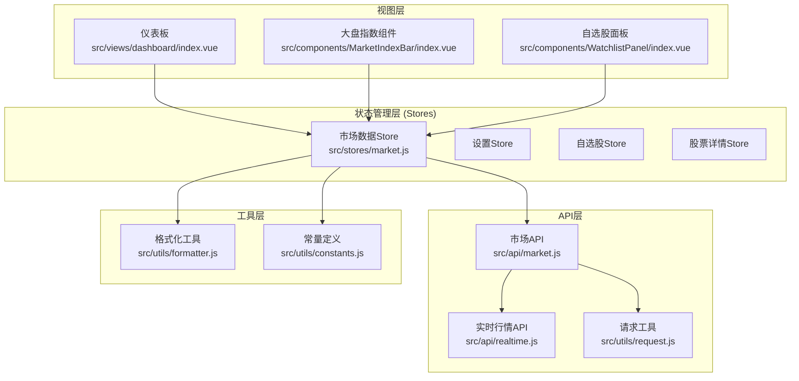
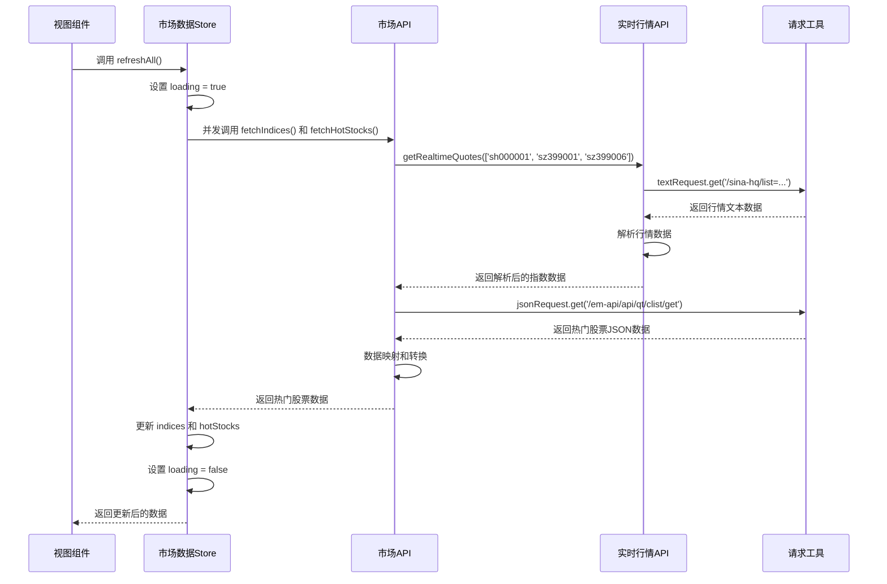
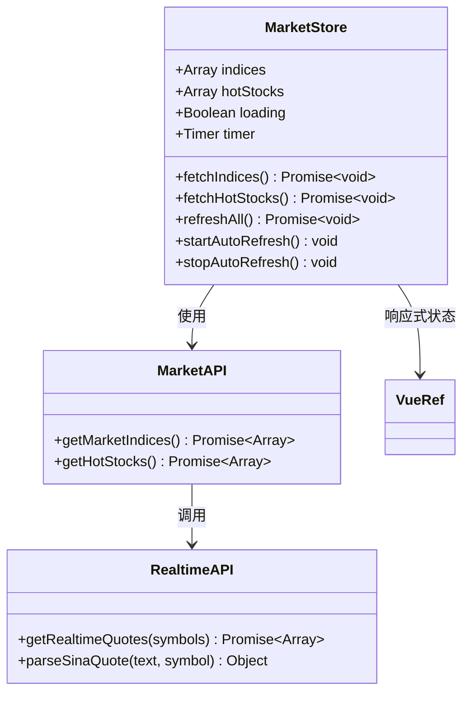
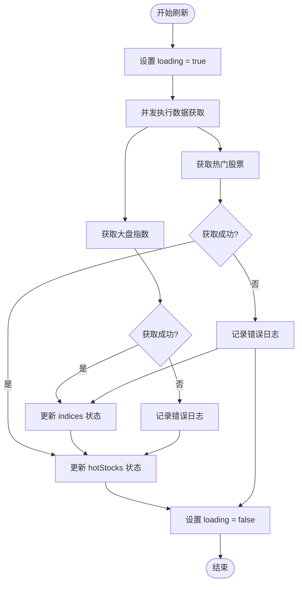
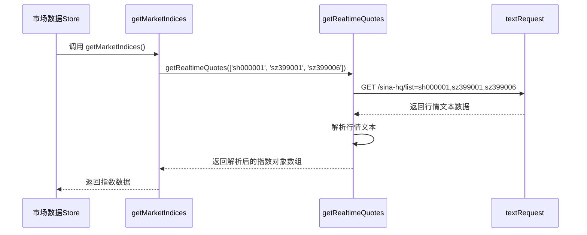
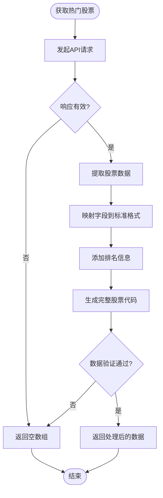
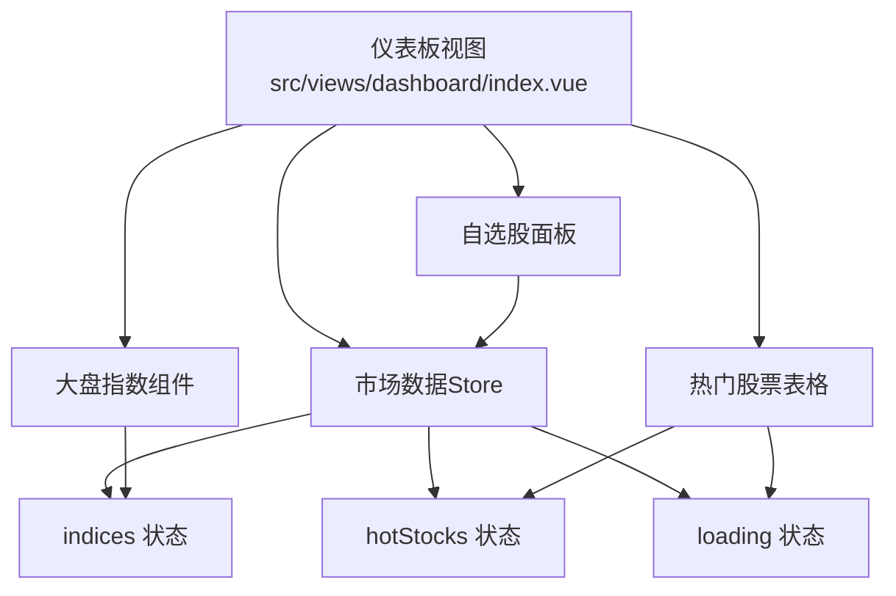
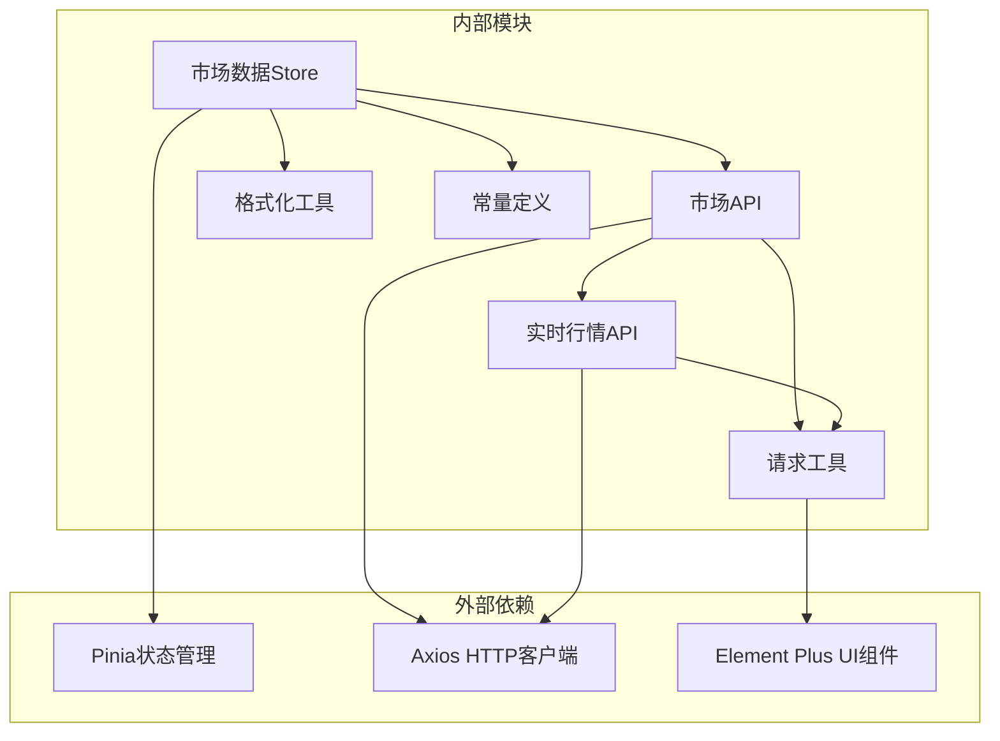

# 市场数据Store

<cite>
**本文档引用的文件**
- [src/stores/market.js](file://src/stores/market.js)
- [src/api/market.js](file://src/api/market.js)
- [src/api/realtime.js](file://src/api/realtime.js)
- [src/utils/request.js](file://src/utils/request.js)
- [src/utils/constants.js](file://src/utils/constants.js)
- [src/utils/formatter.js](file://src/utils/formatter.js)
- [src/stores/index.js](file://src/stores/index.js)
- [src/views/dashboard/index.vue](file://src/views/dashboard/index.vue)
- [src/components/MarketIndexBar/index.vue](file://src/components/MarketIndexBar/index.vue)
- [src/components/WatchlistPanel/index.vue](file://src/components/WatchlistPanel/index.vue)
</cite>

## 目录
1. [简介](#简介)
2. [项目结构](#项目结构)
3. [核心组件](#核心组件)
4. [架构概览](#架构概览)
5. [详细组件分析](#详细组件分析)
6. [依赖关系分析](#依赖关系分析)
7. [性能考虑](#性能考虑)
8. [故障排除指南](#故障排除指南)
9. [结论](#结论)

## 简介

市场数据Store是量化交易系统中的核心数据管理模块，负责管理大盘指数数据、热门股票列表等关键市场信息。该Store采用Pinia状态管理库实现，提供了完整的数据获取、更新、缓存和自动刷新机制，为前端组件提供实时的市场数据支持。

该Store的设计目标是：
- 提供统一的市场数据访问接口
- 实现数据的自动定时刷新
- 支持数据的并发获取和更新
- 提供完整的错误处理和数据验证机制
- 与API层建立清晰的交互边界

## 项目结构

市场数据Store位于`src/stores/market.js`，与相关的API层、工具函数和视图组件共同构成了完整的市场数据管理系统。

**图表来源**
- [src/stores/market.js:1-41](file://src/stores/market.js#L1-L41)
- [src/api/market.js:1-46](file://src/api/market.js#L1-L46)
- [src/views/dashboard/index.vue:1-163](file://src/views/dashboard/index.vue#L1-L163)

**章节来源**
- [src/stores/market.js:1-41](file://src/stores/market.js#L1-L41)
- [src/stores/index.js:1-11](file://src/stores/index.js#L1-L11)

## 核心组件

### 状态定义

市场数据Store定义了以下核心状态：

| 状态属性 | 类型 | 描述 | 默认值 |
|---------|------|------|--------|
| `indices` | Array | 大盘指数数据数组 | `[]` |
| `hotStocks` | Array | 热门股票列表 | `[]` |
| `loading` | Boolean | 数据加载状态 | `false` |
| `timer` | Timer | 自动刷新定时器 | `null` |

### Getter方法

Store提供了以下计算属性和辅助方法：

- **`indices`**: 返回当前的大盘指数数据
- **`hotStocks`**: 返回当前的热门股票列表  
- **`loading`**: 返回数据加载状态

### Action函数

Store实现了以下核心操作方法：

- **`fetchIndices()`**: 异步获取大盘指数数据
- **`fetchHotStocks()`**: 异步获取热门股票列表
- **`refreshAll()`**: 并发刷新所有市场数据
- **`startAutoRefresh()`**: 启动自动刷新机制（每30秒）
- **`stopAutoRefresh()`**: 停止自动刷新

**章节来源**
- [src/stores/market.js:5-40](file://src/stores/market.js#L5-L40)

## 架构概览

市场数据Store采用分层架构设计，实现了清晰的关注点分离：

**图表来源**
- [src/stores/market.js:19-23](file://src/stores/market.js#L19-L23)
- [src/api/market.js:7-45](file://src/api/market.js#L7-L45)
- [src/api/realtime.js:39-47](file://src/api/realtime.js#L39-L47)

## 详细组件分析

### 市场数据Store实现

市场数据Store基于Vue 3的Composition API和Pinia实现，提供了响应式的状态管理和异步数据操作能力。

#### 状态管理机制

**图表来源**
- [src/stores/market.js:5-40](file://src/stores/market.js#L5-L40)
- [src/api/market.js:7-45](file://src/api/market.js#L7-L45)

#### 数据获取流程

市场数据的获取采用了并行处理策略，通过Promise.all实现两个数据源的并发请求：

**图表来源**
- [src/stores/market.js:19-23](file://src/stores/market.js#L19-L23)
- [src/api/market.js:14-45](file://src/api/market.js#L14-L45)

**章节来源**
- [src/stores/market.js:11-33](file://src/stores/market.js#L11-L33)

### API层集成

#### 大盘指数数据获取

大盘指数数据通过实时行情API获取，支持上证指数、深证成指和创业板指三个主要指数：

**图表来源**
- [src/api/market.js:7-9](file://src/api/market.js#L7-L9)
- [src/api/realtime.js:39-47](file://src/api/realtime.js#L39-L47)

#### 热门股票数据获取

热门股票数据通过东方财富API获取，支持按成交额排序的股票列表：

**图表来源**
- [src/api/market.js:14-45](file://src/api/market.js#L14-L45)

**章节来源**
- [src/api/market.js:14-45](file://src/api/market.js#L14-L45)

### 视图组件集成

#### 仪表板集成

仪表板页面集成了市场数据Store，实现了完整的市场数据展示：

**图表来源**
- [src/views/dashboard/index.vue:4-66](file://src/views/dashboard/index.vue#L4-L66)
- [src/stores/market.js:35-39](file://src/stores/market.js#L35-L39)

#### 大盘指数组件

大盘指数组件负责展示三大指数的实时行情：

| 指数代码 | 指数名称 | 展示样式 |
|---------|---------|----------|
| `sh000001` | 上证指数 | 红色涨跌标识 |
| `sz399001` | 深证成指 | 绿色涨跌标识 |
| `sz399006` | 创业板指 | 紫色涨跌标识 |

**章节来源**
- [src/views/dashboard/index.vue:4-66](file://src/views/dashboard/index.vue#L4-L66)
- [src/components/MarketIndexBar/index.vue:1-87](file://src/components/MarketIndexBar/index.vue#L1-L87)

## 依赖关系分析

市场数据Store的依赖关系体现了清晰的分层架构：

**图表来源**
- [src/stores/market.js:1-3](file://src/stores/market.js#L1-L3)
- [src/api/market.js:1-2](file://src/api/market.js#L1-L2)
- [src/utils/request.js:1-2](file://src/utils/request.js#L1-L2)

### 关键依赖特性

1. **Pinia集成**: 使用`defineStore`实现响应式状态管理
2. **HTTP客户端**: 通过Axios实现RESTful API调用
3. **UI集成**: 与Element Plus组件库无缝集成
4. **工具函数**: 依赖格式化和常量工具函数

**章节来源**
- [src/stores/market.js:1-3](file://src/stores/market.js#L1-L3)
- [src/utils/request.js:1-29](file://src/utils/request.js#L1-L29)

## 性能考虑

### 缓存策略

市场数据Store采用了多层缓存策略：

1. **内存缓存**: Store内部维护的响应式状态
2. **定时缓存**: 30秒自动刷新间隔
3. **组件缓存**: Vue组件层面的渲染优化

### 并发优化

- 使用`Promise.all`实现并行数据获取
- 避免重复的API调用
- 合理的错误恢复机制

### 内存管理

- 定时器资源清理
- 组件卸载时的资源释放
- 大数据量的分页处理

## 故障排除指南

### 常见问题及解决方案

#### 数据获取失败

**症状**: 热门股票列表显示为空白
**原因**: API请求超时或网络错误
**解决方案**: 
1. 检查网络连接状态
2. 查看控制台错误日志
3. 验证API端点可用性

#### 数据格式异常

**症状**: 指数数据显示异常或计算错误
**原因**: 行情数据解析失败
**解决方案**:
1. 验证返回数据格式
2. 检查正则表达式匹配
3. 添加数据验证逻辑

#### 性能问题

**症状**: 页面加载缓慢或卡顿
**原因**: 大量数据渲染
**解决方案**:
1. 实施虚拟滚动
2. 优化数据结构
3. 减少不必要的重新渲染

**章节来源**
- [src/api/market.js:42-45](file://src/api/market.js#L42-L45)
- [src/api/realtime.js:44-47](file://src/api/realtime.js#L44-L47)
- [src/utils/request.js:17-28](file://src/utils/request.js#L17-L28)

## 结论

市场数据Store是一个设计精良的状态管理模块，具有以下特点：

### 设计优势

1. **清晰的职责分离**: Store专注于数据管理，API层负责数据获取
2. **响应式更新**: 基于Vue 3的响应式系统实现自动更新
3. **并发处理**: 支持多个数据源的并行获取
4. **错误处理**: 完善的错误捕获和降级机制
5. **可扩展性**: 模块化设计便于功能扩展

### 使用建议

1. **合理使用自动刷新**: 在需要实时数据的场景启用自动刷新
2. **注意性能影响**: 避免频繁的手动刷新操作
3. **数据验证**: 在业务逻辑中添加必要的数据验证
4. **错误处理**: 在组件中妥善处理数据获取失败的情况

### 未来改进方向

1. **增加本地存储**: 实现数据的持久化存储
2. **优化缓存策略**: 实现更智能的缓存失效机制
3. **增强监控**: 添加数据获取成功率和延迟监控
4. **国际化支持**: 支持多语言环境下的数据展示

该Store为整个量化交易系统的数据层奠定了坚实的基础，通过合理的架构设计和完善的错误处理机制，确保了系统的稳定性和可靠性。