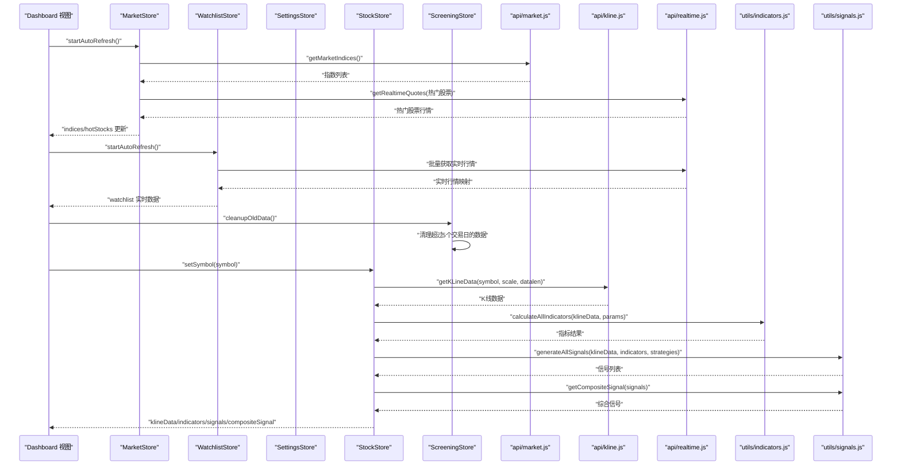
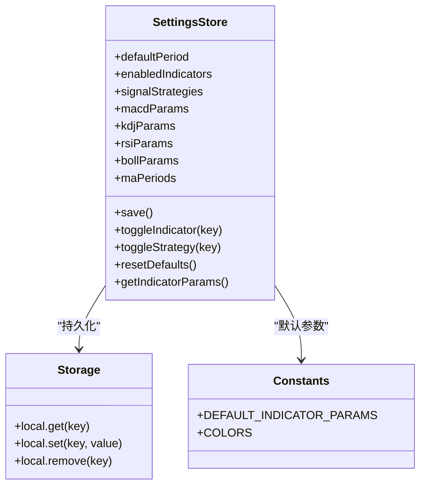
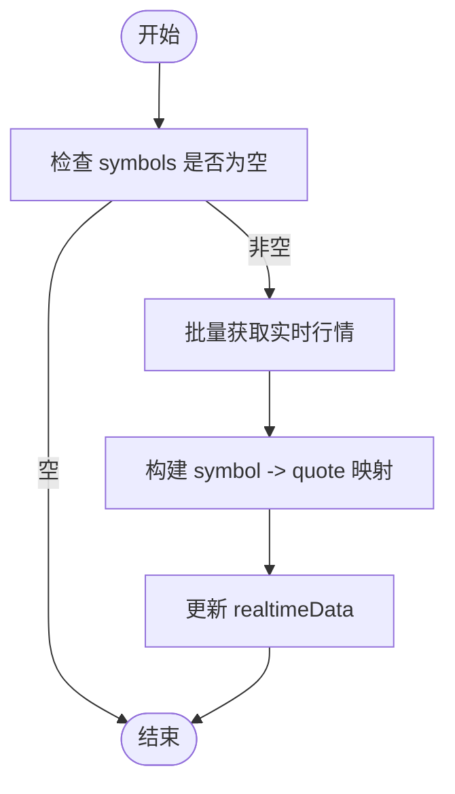
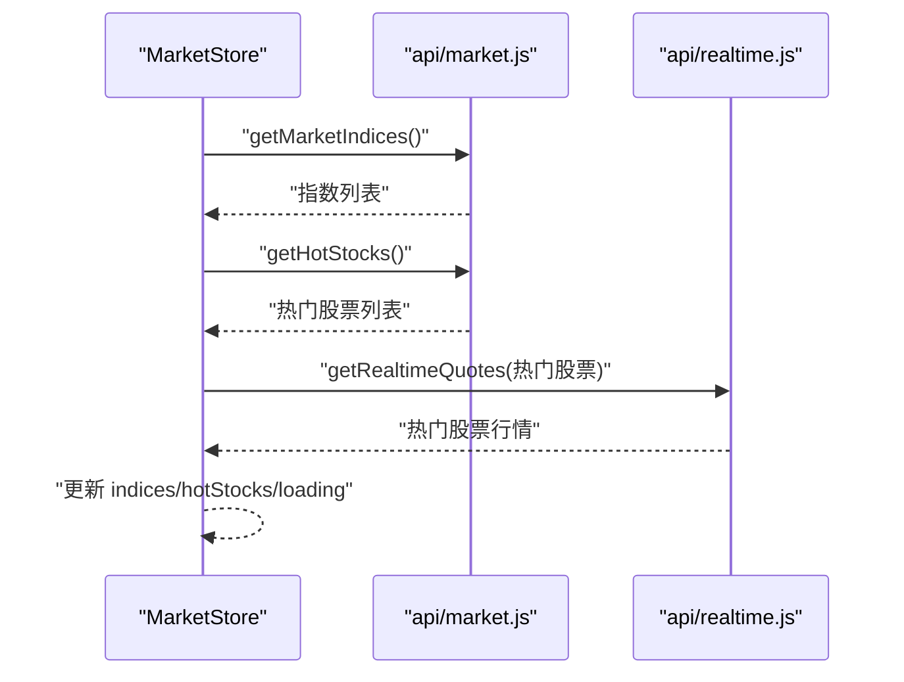
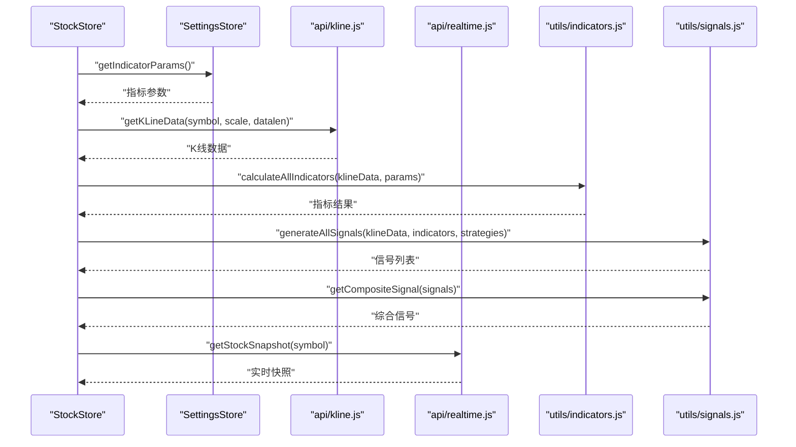
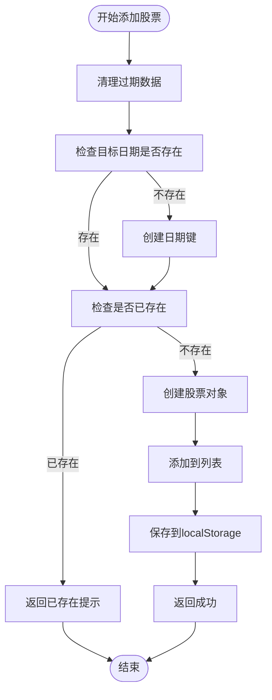
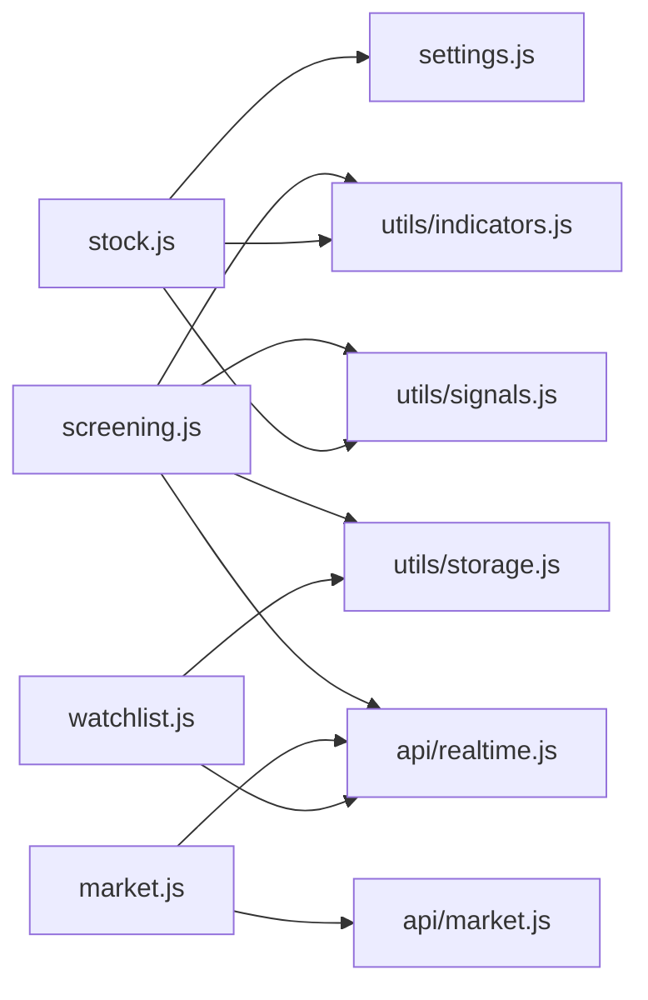

# 状态管理系统

<cite>
**本文引用的文件**
- [src/stores/index.js](file://src/stores/index.js)
- [src/stores/market.js](file://src/stores/market.js)
- [src/stores/settings.js](file://src/stores/settings.js)
- [src/stores/stock.js](file://src/stores/stock.js)
- [src/stores/watchlist.js](file://src/stores/watchlist.js)
- [src/stores/screening.js](file://src/stores/screening.js)
- [src/utils/storage.js](file://src/utils/storage.js)
- [src/utils/constants.js](file://src/utils/constants.js)
- [src/utils/indicators.js](file://src/utils/indicators.js)
- [src/utils/signals.js](file://src/utils/signals.js)
- [src/api/market.js](file://src/api/market.js)
- [src/api/kline.js](file://src/api/kline.js)
- [src/api/realtime.js](file://src/api/realtime.js)
- [src/views/dashboard/index.vue](file://src/views/dashboard/index.vue)
- [src/views/screening/index.vue](file://src/views/screening/index.vue)
- [src/views/stock/detail.vue](file://src/views/stock/detail.vue)
- [src/components/MarketIndexBar/index.vue](file://src/components/MarketIndexBar/index.vue)
- [src/components/WatchlistPanel/index.vue](file://src/components/WatchlistPanel/index.vue)
- [src/components/SignalHistoryTable/index.vue](file://src/components/SignalHistoryTable/index.vue)
- [src/router/index.js](file://src/router/index.js)
- [src/main.js](file://src/main.js)
</cite>

## 目录
1. [简介](#简介)
2. [项目结构](#项目结构)
3. [核心组件](#核心组件)
4. [架构总览](#架构总览)
5. [详细组件分析](#详细组件分析)
6. [依赖分析](#依赖分析)
7. [性能考虑](#性能考虑)
8. [故障排查指南](#故障排查指南)
9. [结论](#结论)
10. [附录](#附录)

## 简介
本文件系统性阐述量化交易平台的状态管理系统，基于 Pinia 的组合式 Store 设计与实现。内容涵盖：
- Store 创建与导出、状态定义、Action 设计、Getter 实现
- 各模块职责划分：市场数据、用户设置、股票数据、自选股、筛选记录
- 响应式更新机制与组件间状态同步
- 状态持久化（localStorage）与数据恢复
- 最佳实践、性能优化与调试技巧
- 使用示例与常见问题解决方案

## 项目结构
本项目采用"按功能域划分"的目录组织方式，状态管理集中在 src/stores 中，配合 src/utils 提供指标与信号计算、常量与存储封装，以及 src/api 提供数据获取。

```mermaid
graph TB
subgraph "应用入口"
MAIN["main.js"]
END
subgraph "状态层"
PINIA["stores/index.js<br/>创建 Pinia 实例"]
SETTINGS["stores/settings.js<br/>用户设置 Store"]
WATCHLIST["stores/watchlist.js<br/>自选股 Store"]
MARKET["stores/market.js<br/>市场数据 Store"]
STOCK["stores/stock.js<br/>股票数据 Store"]
SCREENING["stores/screening.js<br/>筛选记录 Store"]
END
subgraph "工具层"
STORAGE["utils/storage.js<br/>localStorage 封装"]
CONST["utils/constants.js<br/>常量与默认参数"]
IND["utils/indicators.js<br/>指标计算引擎"]
SIG["utils/signals.js<br/>信号生成与综合评分"]
END
subgraph "API 层"
API_MARKET["api/market.js"]
API_KLINE["api/kline.js"]
API_RT["api/realtime.js"]
END
subgraph "视图层"
DASH["views/dashboard/index.vue"]
SCREENING_VIEW["views/screening/index.vue"]
STOCK_DETAIL["views/stock/detail.vue"]
IDX_BAR["components/MarketIndexBar/index.vue"]
WL_PANEL["components/WatchlistPanel/index.vue"]
SIG_HISTORY["components/SignalHistoryTable/index.vue"]
END
MAIN --> PINIA
PINIA --> SETTINGS
PINIA --> WATCHLIST
PINIA --> MARKET
PINIA --> STOCK
PINIA --> SCREENING
SETTINGS --> STORAGE
SETTINGS --> CONST
WATCHLIST --> STORAGE
WATCHLIST --> API_RT
MARKET --> API_MARKET
MARKET --> API_RT
STOCK --> API_KLINE
STOCK --> API_RT
STOCK --> IND
STOCK --> SIG
STOCK --> CONST
SCREENING --> STORAGE
SCREENING --> API_RT
DASH --> MARKET
DASH --> WATCHLIST
DASH --> SCREENING
SCREENING_VIEW --> SCREENING
SCREENING_VIEW --> WATCHLIST
SCREENING_VIEW --> API_KLINE
SCREENING_VIEW --> API_RT
SCREENING_VIEW --> IND
SCREENING_VIEW --> SIG
STOCK_DETAIL --> STOCK
STOCK_DETAIL --> SETTINGS
STOCK_DETAIL --> SCREENING
STOCK_DETAIL --> SIG_HISTORY
IDX_BAR --> MARKET
WL_PANEL --> WATCHLIST
```

**图表来源**
- [src/main.js:1-17](file://src/main.js#L1-L17)
- [src/stores/index.js:1-11](file://src/stores/index.js#L1-L11)
- [src/stores/settings.js:1-70](file://src/stores/settings.js#L1-L70)
- [src/stores/watchlist.js:1-53](file://src/stores/watchlist.js#L1-L53)
- [src/stores/market.js:1-41](file://src/stores/market.js#L1-L41)
- [src/stores/stock.js:1-92](file://src/stores/stock.js#L1-L92)
- [src/stores/screening.js:1-212](file://src/stores/screening.js#L1-L212)
- [src/utils/storage.js:1-21](file://src/utils/storage.js#L1-L21)
- [src/utils/constants.js:1-68](file://src/utils/constants.js#L1-L68)
- [src/utils/indicators.js:1-245](file://src/utils/indicators.js#L1-L245)
- [src/utils/signals.js:1-347](file://src/utils/signals.js#L1-L347)
- [src/api/market.js:1-46](file://src/api/market.js#L1-L46)
- [src/api/kline.js:1-27](file://src/api/kline.js#L1-L27)
- [src/api/realtime.js:1-56](file://src/api/realtime.js#L1-L56)
- [src/views/dashboard/index.vue:1-163](file://src/views/dashboard/index.vue#L1-L163)
- [src/views/screening/index.vue:1-476](file://src/views/screening/index.vue#L1-L476)
- [src/views/stock/detail.vue:1-364](file://src/views/stock/detail.vue#L1-L364)
- [src/components/MarketIndexBar/index.vue:1-87](file://src/components/MarketIndexBar/index.vue#L1-L87)
- [src/components/WatchlistPanel/index.vue:1-143](file://src/components/WatchlistPanel/index.vue#L1-L143)
- [src/components/SignalHistoryTable/index.vue:1-32](file://src/components/SignalHistoryTable/index.vue#L1-L32)

**章节来源**
- [src/main.js:1-17](file://src/main.js#L1-L17)
- [src/stores/index.js:1-11](file://src/stores/index.js#L1-L11)

## 核心组件
本节概述五个核心 Store 的职责、状态与 Action，帮助快速理解模块边界与协作关系。

- 用户设置 Store（settings）
  - 责任：维护用户偏好（默认周期、启用指标、信号策略、各指标参数），并负责本地持久化与恢复。
  - 关键状态：默认周期、启用指标集合、信号策略集合、各指标参数对象。
  - 关键 Action：保存、切换指标/策略、重置默认值、读取指标参数。
  - 持久化：通过 storage.local 将键值写入 localStorage，启动时从 localStorage 读取。

- 自选股 Store（watchlist）
  - 责任：维护用户关注的股票清单，拉取实时行情，支持增删查与自动刷新。
  - 关键状态：watchlist 列表、实时行情映射、派生 symbols。
  - 关键 Action：添加/移除/查询、批量获取实时行情、启动/停止定时刷新。
  - 持久化：watchlist 存储到 localStorage，启动时恢复。

- 市场数据 Store（market）
  - 责任：获取大盘指数与热门股票，支持手动刷新与自动轮询。
  - 关键状态：indices、hotStocks、loading。
  - 关键 Action：获取指数、获取热门股、并发刷新、启动/停止自动刷新。
  - 数据源：通过 api/market.js 与 api/realtime.js 获取。

- 股票数据 Store（stock）
  - 责任：加载某只股票的 K 线、计算指标、生成信号、生成综合信号、拉取实时快照、自动刷新。
  - 关键状态：当前股票符号、股票信息、K 线、周期、指标结果、信号列表、综合信号、加载与错误状态。
  - 关键 Action：设置股票、设置周期、获取 K 线、获取实时快照、计算指标/信号、并发获取、启动/停止自动刷新。
  - 计算：依赖 utils/indicators.js 与 utils/signals.js；参数来自 settings store。

- 筛选记录 Store（screening）
  - 责任：管理每日筛选的股票记录，支持按日期分类存储、去重检查、数据清理与持久化。
  - 关键状态：screeningData（按日期分组的股票列表）、selectedDate（当前选中日期）。
  - 关键 Getter：recentTradingDays（最近5个交易日）、currentDate（当前交易日）、currentStocks（当前日期股票列表）、availableDates（可用日期列表）。
  - 关键 Action：addStock（添加股票）、removeStock（移除股票）、clearDate（清空日期）、cleanupOldData（清理过期数据）、isStockAdded（检查股票是否存在）。
  - 持久化：通过 storage.local 按 STORAGE_KEY 存储，自动清理超过5个交易日的数据。

**章节来源**
- [src/stores/settings.js:1-70](file://src/stores/settings.js#L1-L70)
- [src/stores/watchlist.js:1-53](file://src/stores/watchlist.js#L1-L53)
- [src/stores/market.js:1-41](file://src/stores/market.js#L1-L41)
- [src/stores/stock.js:1-92](file://src/stores/stock.js#L1-L92)
- [src/stores/screening.js:1-212](file://src/stores/screening.js#L1-L212)

## 架构总览
下图展示从视图到 Store、再到 API 与工具层的数据流与调用关系。



**图表来源**
- [src/views/dashboard/index.vue:101-109](file://src/views/dashboard/index.vue#L101-L109)
- [src/stores/market.js:19-33](file://src/stores/market.js#L19-L33)
- [src/stores/watchlist.js:29-45](file://src/stores/watchlist.js#L29-L45)
- [src/stores/stock.js:25-81](file://src/stores/stock.js#L25-L81)
- [src/stores/screening.js:94-106](file://src/stores/screening.js#L94-L106)
- [src/api/market.js:7-45](file://src/api/market.js#L7-L45)
- [src/api/kline.js:9-26](file://src/api/kline.js#L9-L26)
- [src/api/realtime.js:39-55](file://src/api/realtime.js#L39-L55)
- [src/utils/indicators.js:221-244](file://src/utils/indicators.js#L221-L244)
- [src/utils/signals.js:197-261](file://src/utils/signals.js#L197-L261)

## 详细组件分析

### 用户设置 Store（settings）
- 设计理念
  - 使用组合式 Store 定义响应式状态与方法，集中管理用户偏好与默认参数。
  - 通过 storage.local 封装对 localStorage 的读写，确保跨会话持久化。
- 状态与 Getter
  - 默认周期、启用指标集合、信号策略集合、各指标参数对象。
  - 提供 getIndicatorParams 用于其他 Store 获取当前参数。
- Action
  - save：统一写入多个键值。
  - toggleIndicator/toggleStrategy：切换启用状态并持久化。
  - resetDefaults：恢复默认值并持久化。
- 与常量与存储的关系
  - 依赖 DEFAULT_INDICATOR_PARAMS 与 COLORS 等常量。
  - 依赖 storage.local 进行持久化。



**图表来源**
- [src/stores/settings.js:6-68](file://src/stores/settings.js#L6-L68)
- [src/utils/storage.js:3-19](file://src/utils/storage.js#L3-L19)
- [src/utils/constants.js:39-45](file://src/utils/constants.js#L39-L45)

**章节来源**
- [src/stores/settings.js:1-70](file://src/stores/settings.js#L1-L70)
- [src/utils/storage.js:1-21](file://src/utils/storage.js#L1-L21)
- [src/utils/constants.js:1-68](file://src/utils/constants.js#L1-L68)

### 自选股 Store（watchlist）
- 设计理念
  - 维护用户关注的股票清单，提供实时行情聚合与自动刷新。
  - 通过 symbols 派生属性，减少不必要的计算。
- 状态与 Getter
  - watchlist：[{ symbol, name, addedAt }, ...]
  - realtimeData：{ [symbol]: quote }
  - symbols：从 watchlist 派生。
- Action
  - addStock/removeStock/isWatched：管理清单。
  - fetchAllRealtimeData：批量获取并构建映射。
  - startAutoRefresh/stopAutoRefresh：定时刷新。



**图表来源**
- [src/stores/watchlist.js:29-45](file://src/stores/watchlist.js#L29-L45)
- [src/api/realtime.js:39-47](file://src/api/realtime.js#L39-L47)

**章节来源**
- [src/stores/watchlist.js:1-53](file://src/stores/watchlist.js#L1-L53)
- [src/api/realtime.js:1-56](file://src/api/realtime.js#L1-L56)

### 市场数据 Store（market）
- 设计理念
  - 负责大盘指数与热门股票的获取与刷新，支持并发请求与自动轮询。
- 状态与 Action
  - indices、hotStocks、loading。
  - fetchIndices/fetchHotStocks/refreshAll 并发刷新。
  - startAutoRefresh/stopAutoRefresh 定时任务。



**图表来源**
- [src/stores/market.js:11-33](file://src/stores/market.js#L11-L33)
- [src/api/market.js:7-45](file://src/api/market.js#L7-L45)
- [src/api/realtime.js:39-47](file://src/api/realtime.js#L39-L47)

**章节来源**
- [src/stores/market.js:1-41](file://src/stores/market.js#L1-L41)
- [src/api/market.js:1-46](file://src/api/market.js#L1-L46)

### 股票数据 Store（stock）
- 设计理念
  - 单一股票的全栈数据管理：K 线、指标、信号、综合信号、实时快照与自动刷新。
  - 与 settings store 解耦，通过参数注入实现可配置性。
- 状态与 Computed
  - closes/dates：从 klineData 派生。
- Action
  - setSymbol/setPeriod：切换标的与周期。
  - fetchKLine：根据周期映射 scale 获取 K 线，计算指标与信号。
  - fetchRealtimeQuote：获取实时快照。
  - computeIndicators/computeSignals：调用工具层计算。
  - fetchAll/startAutoRefresh/stopAutoRefresh：并发与定时刷新。



**图表来源**
- [src/stores/stock.js:25-81](file://src/stores/stock.js#L25-L81)
- [src/stores/settings.js:54-62](file://src/stores/settings.js#L54-L62)
- [src/api/kline.js:9-26](file://src/api/kline.js#L9-L26)
- [src/api/realtime.js:52-55](file://src/api/realtime.js#L52-L55)
- [src/utils/indicators.js:221-244](file://src/utils/indicators.js#L221-L244)
- [src/utils/signals.js:197-261](file://src/utils/signals.js#L197-L261)

**章节来源**
- [src/stores/stock.js:1-92](file://src/stores/stock.js#L1-L92)
- [src/utils/indicators.js:1-245](file://src/utils/indicators.js#L1-L245)
- [src/utils/signals.js:1-347](file://src/utils/signals.js#L1-L347)

### 筛选记录 Store（screening）
- 设计理念
  - 专门管理每日筛选的股票记录，支持按日期分类存储、自动清理过期数据、防止重复添加。
  - 通过交易日计算确保数据的时效性和准确性。
- 状态与 Getter
  - screeningData：{ [date]: [{ stockInfo, addedAt, id }] } 按日期分组的股票列表。
  - selectedDate：当前选中日期，默认为当前交易日。
  - recentTradingDays：计算最近5个交易日（排除周末）。
  - currentDate：当前交易日，如果今天不是交易日则返回最近的交易日。
  - currentStocks：当前日期的股票列表。
  - availableDates：所有有数据的日期列表（降序排列）。
- Action
  - addStock：添加股票到指定日期的列表，自动清理过期数据并检查重复。
  - removeStock：从指定日期移除股票，如果日期为空则删除该日期键。
  - clearDate：清空指定日期的所有股票。
  - setSelectedDate：设置当前选中日期。
  - isStockAdded：检查股票是否已在指定日期的列表中。
  - cleanupOldData：清理超过5个交易日的数据。
  - saveToStorage：保存到 localStorage。
- 数据持久化
  - 使用 STORAGE_KEY 存储到 localStorage。
  - 启动时自动清理过期数据，只保留最近5个交易日。



**图表来源**
- [src/stores/screening.js:121-145](file://src/stores/screening.js#L121-L145)
- [src/stores/screening.js:94-106](file://src/stores/screening.js#L94-L106)

**章节来源**
- [src/stores/screening.js:1-212](file://src/stores/screening.js#L1-L212)
- [src/utils/storage.js:1-21](file://src/utils/storage.js#L1-L21)

## 依赖分析
- Store 与工具层
  - stock 依赖 settings 的参数与策略；依赖 utils/indicators.js 与 utils/signals.js 进行计算与信号生成。
  - watchlist 依赖 api/realtime.js 获取实时行情；依赖 utils/storage.js 持久化。
  - market 依赖 api/market.js 与 api/realtime.js。
  - screening 依赖 utils/storage.js 进行本地存储；依赖 api/realtime.js 获取股票快照；依赖 utils/indicators.js 和 utils/signals.js 进行信号检测。
- 应用入口
  - main.js 创建并注册 Pinia，使各 Store 在组件中可用。



**图表来源**
- [src/stores/stock.js:7,59-68](file://src/stores/stock.js#L7,L59-L68)
- [src/stores/watchlist.js:3,29-35](file://src/stores/watchlist.js#L3,L29-L35)
- [src/stores/market.js:3,11-17](file://src/stores/market.js#L3,L11-L17)
- [src/stores/screening.js:3,13,169-170](file://src/stores/screening.js#L3,L13,L169-L170)
- [src/utils/indicators.js:1-245](file://src/utils/indicators.js#L1-L245)
- [src/utils/signals.js:1-347](file://src/utils/signals.js#L1-L347)
- [src/api/realtime.js:1-56](file://src/api/realtime.js#L1-L56)
- [src/api/market.js:1-46](file://src/api/market.js#L1-L46)
- [src/utils/storage.js:1-21](file://src/utils/storage.js#L1-L21)

**章节来源**
- [src/main.js:1-17](file://src/main.js#L1-L17)

## 性能考虑
- 并发与去抖
  - market.refreshAll 使用 Promise.all 并发获取指数与热门股票，减少等待时间。
  - stock.fetchAll 并发获取 K 线与实时快照，提升首屏渲染速度。
  - screening.detectBuySignals 在批量检测时添加小延迟，避免请求过快。
- 计算优化
  - 指标计算与信号生成在工具层集中实现，避免重复计算；通过 settings 注入参数，减少 Store 内部状态膨胀。
  - screening 使用交易日计算函数，避免不必要的日期处理。
- 刷新策略
  - market 与 watchlist 默认 30s 与 15s 轮询；stock 实时行情 10s 轮询，可根据网络与设备性能调整。
  - screening 自动清理过期数据，限制存储大小。
- 渲染优化
  - 使用 computed 派生 closes/dates，减少不必要重算。
  - 组件内仅订阅所需字段，避免全局响应式风暴。

## 故障排查指南
- 常见问题与定位
  - 无法获取数据：检查 api/* 返回格式与异常处理分支，确认返回数组与字段映射正确。
  - 自选股未刷新：确认 symbols 非空且定时器已启动；检查网络请求是否成功。
  - 指标/信号为空：确认 K 线数据长度满足指标最小周期；检查 settings 参数是否合理。
  - 设置未持久化：检查 storage.local 的键前缀与 JSON 序列化/反序列化逻辑。
  - 筛选记录异常：检查 localStorage 中的 STORAGE_KEY 数据格式；确认交易日计算逻辑正确。
  - 筛选记录被自动清理：确认当前日期是否为最近5个交易日内的交易日。
- 调试技巧
  - 在 Store 中打印关键状态变化（如 loading、error）。
  - 在组件中使用 Vue DevTools 观察 Store 响应式更新路径。
  - 对高频刷新接口增加节流/去抖，避免频繁请求导致卡顿。
  - 在 screening.addStock 中添加日志，跟踪重复检查与数据清理过程。

**章节来源**
- [src/stores/market.js:19-33](file://src/stores/market.js#L19-L33)
- [src/stores/watchlist.js:29-45](file://src/stores/watchlist.js#L29-L45)
- [src/stores/stock.js:35-52](file://src/stores/stock.js#L35-L52)
- [src/stores/screening.js:121-145](file://src/stores/screening.js#L121-L145)
- [src/utils/storage.js:5-18](file://src/utils/storage.js#L5-L18)

## 结论
本状态管理系统以 Pinia 组合式 Store 为核心，围绕用户设置、自选股、市场数据、股票数据与筛选记录五大模块进行职责划分，结合工具层的指标与信号计算，形成清晰的数据流与可维护的架构。通过 localStorage 持久化与定时刷新机制，实现了良好的用户体验与可扩展性。新增的筛选记录模块进一步完善了系统的数据分析能力，支持按日期分类管理和自动数据清理。遵循本文最佳实践与性能建议，可在保证响应性的前提下持续演进。

## 附录

### 状态持久化与恢复机制
- 存储封装
  - storage.local 提供 get/set/remove，统一键前缀与 JSON 序列化。
- settings 持久化
  - 启动时从 localStorage 读取；每次变更调用 save 写入。
- watchlist 持久化
  - 启动时从 localStorage 读取；每次增删调用 set 写入。
- screening 持久化
  - 启动时从 localStorage 读取；每次变更调用 saveToStorage 写入。
  - 自动清理过期数据，只保留最近5个交易日。

**章节来源**
- [src/utils/storage.js:1-21](file://src/utils/storage.js#L1-L21)
- [src/stores/settings.js:7-26](file://src/stores/settings.js#L7-L26)
- [src/stores/watchlist.js:7,16,22](file://src/stores/watchlist.js#L7,L16,L22)
- [src/stores/screening.js:46,87-89,194-195](file://src/stores/screening.js#L46,L87-L89,L194-L195)

### 组件间状态同步方式
- 市场面板与自选股面板均通过各自 Store 的自动刷新能力保持最新。
- 股票详情页通过 stock.store 的 setSymbol/setPeriod 切换标的与周期，触发指标与信号重新计算。
- 筛选记录通过 screening.store 的 addStock/removeStock/clearDate 等 Action 实现数据同步。
- 组件通过 props 或直接访问 Store 实例完成数据绑定与交互。

**章节来源**
- [src/views/dashboard/index.vue:101-109](file://src/views/dashboard/index.vue#L101-L109)
- [src/views/screening/index.vue:183-189](file://src/views/screening/index.vue#L183-L189)
- [src/views/stock/detail.vue:190-217](file://src/views/stock/detail.vue#L190-L217)
- [src/components/MarketIndexBar/index.vue:1-87](file://src/components/MarketIndexBar/index.vue#L1-L87)
- [src/components/WatchlistPanel/index.vue:1-143](file://src/components/WatchlistPanel/index.vue#L1-L143)
- [src/components/SignalHistoryTable/index.vue:1-32](file://src/components/SignalHistoryTable/index.vue#L1-L32)
- [src/stores/stock.js:25-33](file://src/stores/stock.js#L25-L33)

### 使用示例与最佳实践
- 在视图中使用 Store
  - 导入：import { useMarketStore, useWatchlistStore, useScreeningStore } from '@/stores'
  - 生命周期：onMounted/onUnmounted 中启动/停止自动刷新
- 状态设计原则
  - 将可变状态集中在一个 Store，避免分散在多处
  - 通过 computed 派生稳定数据，减少冗余状态
  - 为每个功能域创建独立的 Store，保持模块化
- 性能优化
  - 合理使用 Promise.all 并发请求
  - 控制定时刷新频率，避免过度轮询
  - 在高频操作中添加防抖/节流
- 调试技巧
  - 在关键 Action 中输出状态快照
  - 使用浏览器开发者工具观察响应式更新路径
  - 为筛选功能添加详细的日志输出，便于追踪数据流向

**章节来源**
- [src/views/dashboard/index.vue:77-109](file://src/views/dashboard/index.vue#L77-L109)
- [src/views/screening/index.vue:337-380](file://src/views/screening/index.vue#L337-L380)
- [src/views/stock/detail.vue:190-217](file://src/views/stock/detail.vue#L190-L217)
- [src/stores/market.js:25-33](file://src/stores/market.js#L25-L33)
- [src/stores/watchlist.js:37-45](file://src/stores/watchlist.js#L37-L45)
- [src/stores/stock.js:74-81](file://src/stores/stock.js#L74-L81)
- [src/stores/screening.js:121-145](file://src/stores/screening.js#L121-L145)

### 筛选功能集成示例
- 个股分析页面集成
  - 在 StockDetail 页面中，当检测到买入信号时，用户可以一键将股票加入筛选列表。
  - 页面显示"已加入筛选"状态，防止重复添加。
- 批量筛选功能
  - Screening 页面提供"检测买点"按钮，批量检测自选股的买入信号。
  - 支持按日期选择、清空当日记录、查看信号统计等功能。
- 数据管理
  - 自动清理超过5个交易日的数据，保持存储空间的有效利用。
  - 支持按日期浏览历史筛选记录，便于回顾分析。

**章节来源**
- [src/views/stock/detail.vue:190-217](file://src/views/stock/detail.vue#L190-L217)
- [src/views/screening/index.vue:337-380](file://src/views/screening/index.vue#L337-L380)
- [src/stores/screening.js:94-106](file://src/stores/screening.js#L94-L106)
- [src/router/index.js:39-43](file://src/router/index.js#L39-L43)