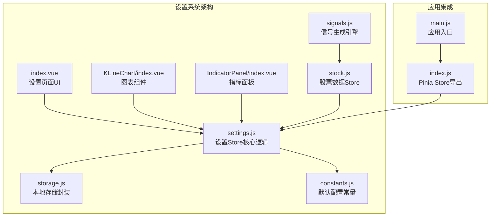
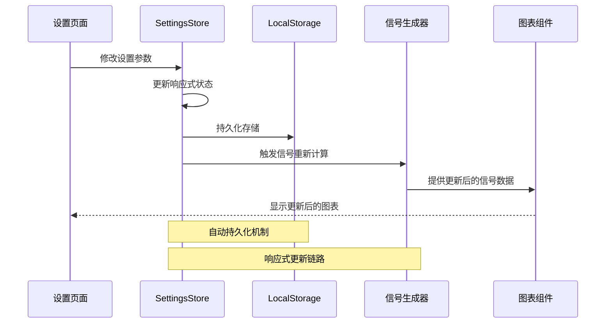
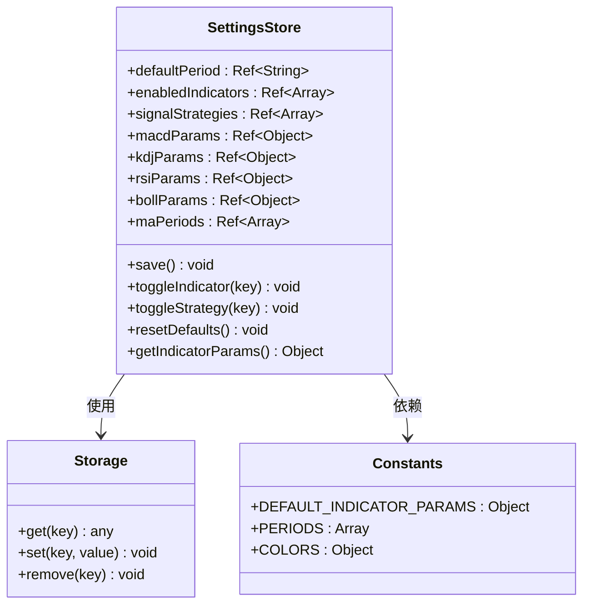
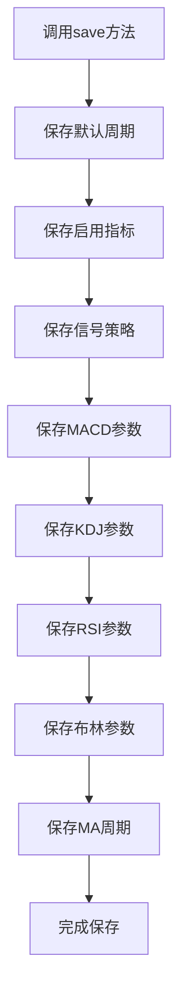
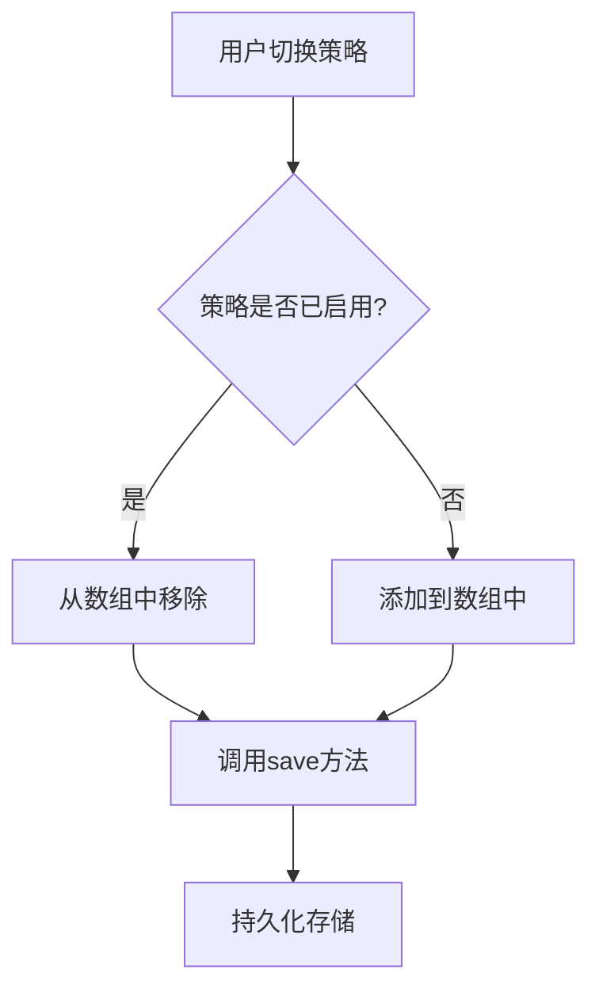
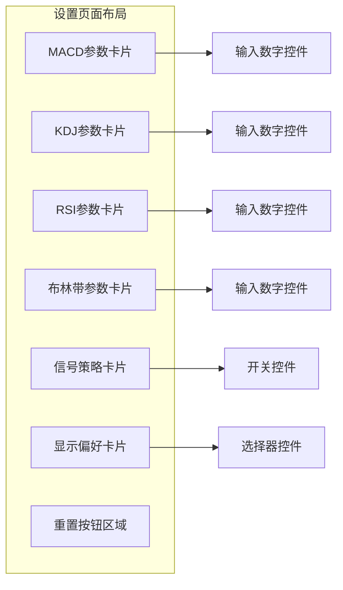
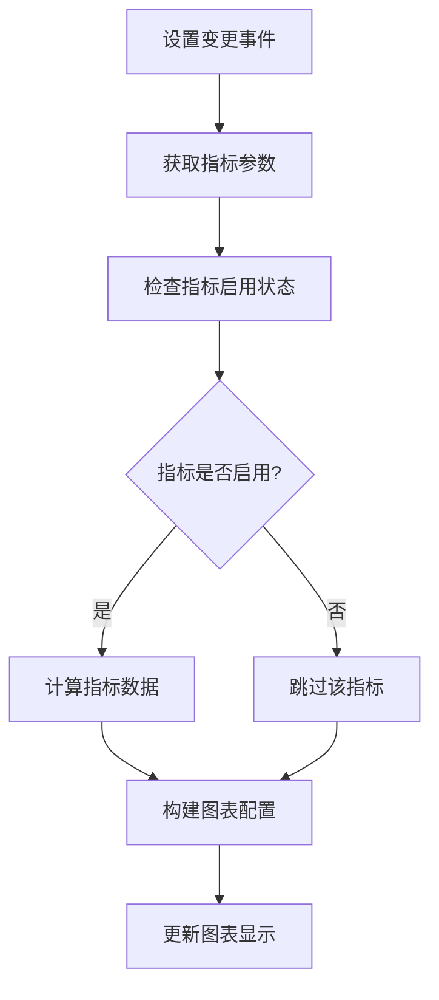
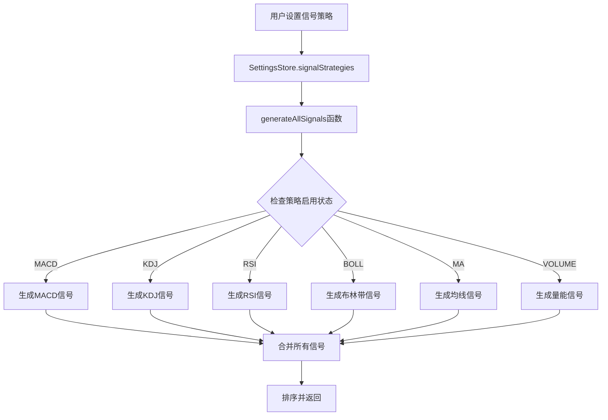
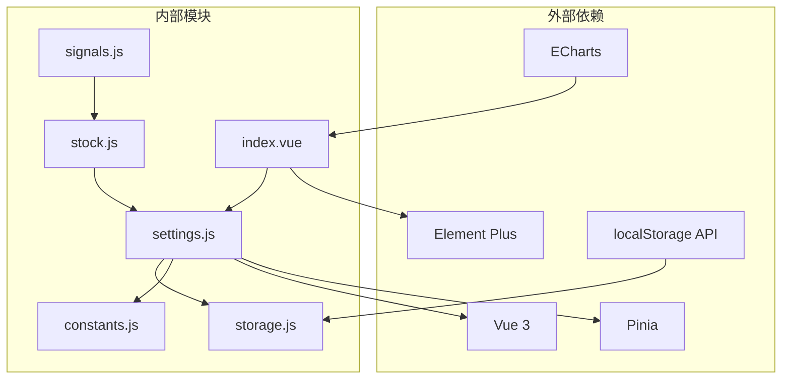

# 用户设置Store

<cite>
**本文档引用的文件**
- [settings.js](file://src/stores/settings.js)
- [storage.js](file://src/utils/storage.js)
- [constants.js](file://src/utils/constants.js)
- [index.vue](file://src/views/settings/index.vue)
- [index.js](file://src/stores/index.js)
- [main.js](file://src/main.js)
- [KLineChart/index.vue](file://src/components/KLineChart/index.vue)
- [IndicatorPanel/index.vue](file://src/components/IndicatorPanel/index.vue)
- [signals.js](file://src/utils/signals.js)
- [stock.js](file://src/stores/stock.js)
</cite>

## 更新摘要
**变更内容**
- 新增信号策略配置选项，支持MACD、KDJ、RSI、布林带、均线交叉和量能活跃策略
- 改进设置持久化机制，采用统一的命名空间前缀'quant_'
- 增强技术指标参数管理，支持更多技术分析参数配置
- 完善设置页面UI，提供更丰富的配置界面
- **更新** 新增signalStrategies配置，允许用户自定义信号策略组合

## 目录
1. [简介](#简介)
2. [项目结构](#项目结构)
3. [核心组件](#核心组件)
4. [架构概览](#架构概览)
5. [详细组件分析](#详细组件分析)
6. [依赖关系分析](#依赖关系分析)
7. [性能考虑](#性能考虑)
8. [故障排除指南](#故障排除指南)
9. [结论](#结论)

## 简介

用户设置Store是量化交易系统中的核心配置管理模块，负责管理用户的所有个性化设置。该系统采用Vue 3 + Pinia的现代前端架构，提供了完整的设置持久化、响应式更新和全局同步机制。

系统主要涵盖以下配置类别：
- **技术指标参数**：MACD、KDJ、RSI、布林带等技术分析参数
- **图表偏好设置**：默认K线周期、指标显示偏好
- **信号策略配置**：各种技术分析信号策略的启用/禁用状态
- **界面主题设置**：颜色方案和视觉偏好（通过COLORS常量）

## 项目结构

用户设置系统在项目中的组织结构如下：

**图表来源**
- [settings.js:1-70](file://src/stores/settings.js#L1-L70)
- [storage.js:1-21](file://src/utils/storage.js#L1-L21)
- [constants.js:1-68](file://src/utils/constants.js#L1-L68)
- [signals.js:287-325](file://src/utils/signals.js#L287-L325)
- [stock.js:64-68](file://src/stores/stock.js#L64-L68)

**章节来源**
- [settings.js:1-70](file://src/stores/settings.js#L1-L70)
- [storage.js:1-21](file://src/utils/storage.js#L1-L21)
- [constants.js:1-68](file://src/utils/constants.js#L1-L68)

## 核心组件

### 设置Store设计原理

用户设置Store基于以下设计理念构建：

1. **响应式状态管理**：使用Vue 3的ref响应式系统确保设置变更的实时更新
2. **持久化存储**：所有设置自动保存到localStorage中，支持跨会话持久化
3. **默认值机制**：提供完善的默认值配置，确保首次使用时的良好体验
4. **模块化设计**：将不同类型的设置分离管理，便于维护和扩展

### 数据结构定义

设置Store管理的核心数据结构包括：

| 设置类别 | 数据类型 | 默认值 | 存储键 |
|---------|---------|--------|--------|
| 默认周期 | String | 'daily' | 'settings_period' |
| 启用指标 | Array[String] | ['MA','MACD','VOL'] | 'settings_indicators' |
| **信号策略** | Array[String] | ['MACD','KDJ','RSI','BOLL','MA','VOLUME'] | 'settings_strategies' |
| MACD参数 | Object | {short:12,long:26,signal:9} | 'settings_macd' |
| KDJ参数 | Object | {period:9,kPeriod:3,dPeriod:3} | 'settings_kdj' |
| RSI参数 | Object | {period:14} | 'settings_rsi' |
| 布林参数 | Object | {period:20,multiplier:2} | 'settings_boll' |
| MA周期 | Array[Number] | [5,10,20,60] | 'settings_ma' |

**更新** 新增信号策略配置，默认包含6种不同的技术分析策略，支持用户自定义组合

**章节来源**
- [settings.js:6-69](file://src/stores/settings.js#L6-L69)
- [constants.js:38-45](file://src/utils/constants.js#L38-L45)

## 架构概览

用户设置系统的整体架构采用分层设计模式：

**图表来源**
- [settings.js:17-26](file://src/stores/settings.js#L17-L26)
- [index.vue:77-78](file://src/views/settings/index.vue#L77-L78)
- [signals.js:287-325](file://src/utils/signals.js#L287-L325)

### 技术指标参数管理

系统为每种技术指标提供了专门的参数配置：

**图表来源**
- [settings.js:6-69](file://src/stores/settings.js#L6-L69)
- [storage.js:3-19](file://src/utils/storage.js#L3-L19)
- [constants.js:38-45](file://src/utils/constants.js#L38-L45)

**章节来源**
- [settings.js:6-69](file://src/stores/settings.js#L6-L69)
- [storage.js:3-19](file://src/utils/storage.js#L3-L19)
- [constants.js:38-45](file://src/utils/constants.js#L38-L45)

## 详细组件分析

### 设置Store核心实现

#### 初始化流程

设置Store在初始化时执行以下步骤：

1. **读取本地存储**：从localStorage中恢复之前的设置
2. **应用默认值**：对于未设置的项使用默认值
3. **建立响应式绑定**：创建Vue响应式引用对象
4. **启动持久化监听**：自动保存设置变更

#### 关键方法详解

##### 保存机制 (`save` 方法)

**图表来源**
- [settings.js:17-26](file://src/stores/settings.js#L17-L26)

##### 切换策略 (`toggleStrategy` 方法)
该方法实现了信号策略的动态启用/禁用功能：

**图表来源**
- [settings.js:35-40](file://src/stores/settings.js#L35-L40)

**章节来源**
- [settings.js:17-52](file://src/stores/settings.js#L17-L52)

### 持久化存储机制

#### 存储封装设计

系统采用统一的存储封装层，提供以下功能：

- **命名空间隔离**：所有存储键都带有'quant_'前缀
- **JSON序列化**：自动处理复杂数据类型的存储和读取
- **异常安全**：捕获并处理存储操作中的异常情况
- **类型转换**：智能处理字符串和对象之间的转换

#### 存储键命名规范

| 设置类别 | 存储键格式 | 示例 |
|---------|-----------|------|
| 默认周期 | settings_period | quant_settings_period |
| 启用指标 | settings_indicators | quant_settings_indicators |
| **信号策略** | settings_strategies | quant_settings_strategies |
| 技术参数 | settings_[指标名] | quant_settings_macd |

**更新** 改进了存储机制，采用统一的命名空间前缀确保数据隔离

**章节来源**
- [storage.js:1-21](file://src/utils/storage.js#L1-L21)

### 设置页面UI集成

#### 参数配置界面

设置页面采用Element Plus组件库构建，提供直观的参数配置界面：

**图表来源**
- [index.vue:1-136](file://src/views/settings/index.vue#L1-L136)

#### 信号策略配置

**新增功能** 设置页面现在包含完整的信号策略配置界面：

- **MACD策略**：移动平均收敛/发散
- **KDJ策略**：随机指标
- **RSI策略**：相对强弱指标
- **布林带策略**：布林带通道
- **均线策略**：均线交叉
- **量能策略**：五交易日量能活跃

**章节来源**
- [index.vue:1-136](file://src/views/settings/index.vue#L1-L136)

### 图表组件集成

#### 设置对图表的影响

设置Store与图表组件的集成体现在多个层面：

1. **指标显示控制**：通过enabledIndicators控制指标的显示/隐藏
2. **参数传递**：通过getIndicatorParams提供技术参数给图表
3. **实时更新**：设置变更触发图表的重新渲染

#### 图表渲染逻辑

**图表来源**
- [KLineChart/index.vue:32-134](file://src/components/KLineChart/index.vue#L32-L134)

**章节来源**
- [KLineChart/index.vue:1-200](file://src/components/KLineChart/index.vue#L1-L200)

### 信号策略系统

#### 信号生成架构

系统实现了完整的信号生成和管理机制：

**图表来源**
- [signals.js:287-325](file://src/utils/signals.js#L287-L325)

#### 信号策略详细说明

| 策略名称 | 策略代码 | 策略描述 | 适用场景 |
|---------|---------|----------|----------|
| MACD | MACD | 移动平均收敛/发散指标 | 趋势跟踪和反转信号 |
| KDJ | KDJ | 随机指标 | 超买超卖判断 |
| RSI | RSI | 相对强弱指标 | 动量分析和超买超卖 |
| 布林带 | BOLL | 布林带通道 | 支撑压力位识别 |
| 均线 | MA | 均线交叉 | 趋势方向判断 |
| 量能 | VOLUME | 五交易日量能活跃 | 成交量驱动信号 |

**章节来源**
- [signals.js:287-325](file://src/utils/signals.js#L287-L325)
- [stock.js:64-68](file://src/stores/stock.js#L64-L68)

## 依赖关系分析

### 组件耦合度评估

用户设置系统展现了良好的模块化设计：

**图表来源**
- [settings.js:1-4](file://src/stores/settings.js#L1-L4)
- [index.vue:96](file://src/views/settings/index.vue#L96)
- [signals.js:287-325](file://src/utils/signals.js#L287-L325)

### 数据流分析

设置系统遵循单向数据流原则：

1. **用户交互** → **设置Store** → **本地存储** → **信号生成器** → **图表组件**
2. **本地存储** → **设置Store** → **响应式状态** → **UI更新**

这种设计确保了数据的一致性和可预测性。

**章节来源**
- [settings.js:1-70](file://src/stores/settings.js#L1-L70)
- [index.js:1-11](file://src/stores/index.js#L1-L11)

## 性能考虑

### 内存优化策略

1. **懒加载机制**：设置数据仅在需要时从localStorage读取
2. **响应式最小化**：只跟踪必要的状态变化
3. **批量更新**：通过save方法集中处理存储操作

### 渲染性能优化

1. **条件渲染**：根据enabledIndicators动态决定图表元素
2. **增量更新**：仅在设置变更时重新计算指标
3. **防抖处理**：输入控件变更时及时保存但避免频繁写入

## 故障排除指南

### 常见问题及解决方案

#### 设置无法持久化

**症状**：刷新页面后设置丢失
**原因**：localStorage访问权限问题或存储空间不足
**解决**：检查浏览器隐私设置，清理不必要的localStorage数据

#### 设置加载失败

**症状**：应用启动时出现错误
**原因**：localStorage中存在损坏的数据
**解决**：清除相关存储键或重置为默认设置

#### 图表不更新

**症状**：修改设置后图表无变化
**原因**：响应式绑定失效或组件未正确监听设置变更
**解决**：检查组件的props绑定和watcher配置

#### 信号策略不生效

**症状**：切换信号策略后无变化
**原因**：信号策略配置未正确保存或图表组件未重新计算
**解决**：确认toggleStrategy方法正常调用save，检查图表组件的信号计算逻辑

#### 信号生成异常

**症状**：信号列表为空或显示异常
**原因**：指标数据未正确计算或信号策略配置错误
**解决**：检查generateAllSignals函数的策略检查逻辑，确认指标数据完整性

**章节来源**
- [storage.js:5-11](file://src/utils/storage.js#L5-L11)

## 结论

用户设置Store系统展现了现代前端应用的最佳实践：

1. **架构清晰**：模块化设计使得各组件职责明确
2. **用户体验优秀**：响应式更新和持久化存储提供了流畅的使用体验
3. **扩展性强**：默认值机制和常量配置便于新功能的添加
4. **可靠性高**：完善的错误处理和数据验证机制

**更新亮点**：
- **信号策略增强**：新增6种技术分析策略配置，提供更全面的技术分析能力
- **存储机制改进**：采用统一命名空间前缀，提升数据隔离和安全性
- **配置界面完善**：提供直观的信号策略开关界面，支持用户个性化配置
- **技术指标扩展**：支持更多技术分析参数，满足专业用户需求
- **信号生成系统**：完整的信号策略组合管理，支持灵活的策略配置

该系统为量化交易应用提供了坚实的基础，支持用户进行个性化的技术分析配置，同时保持了良好的性能和可维护性。