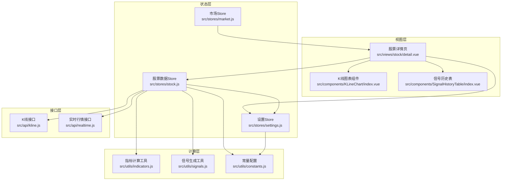
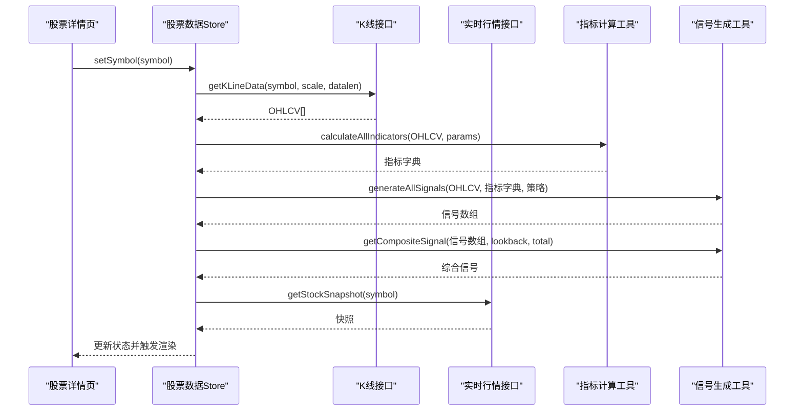
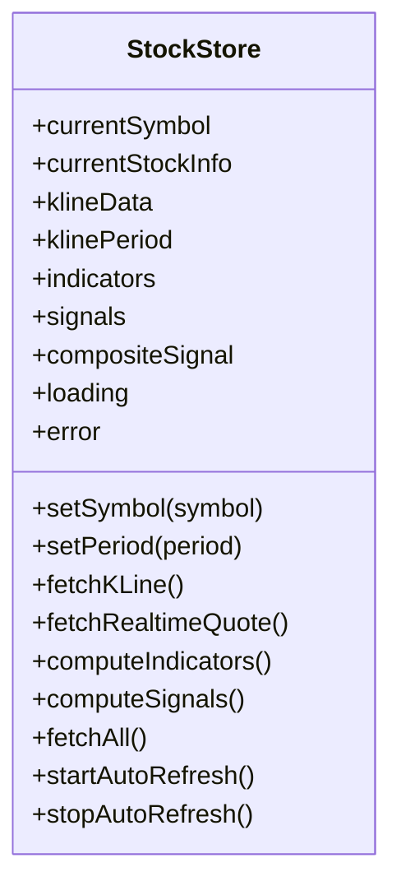
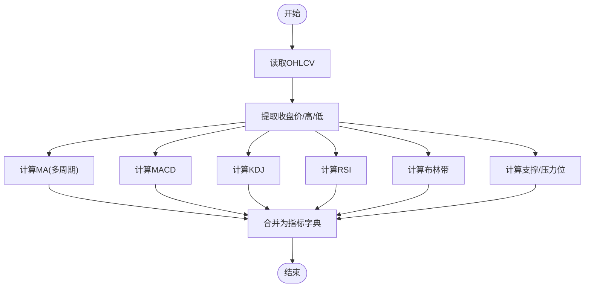
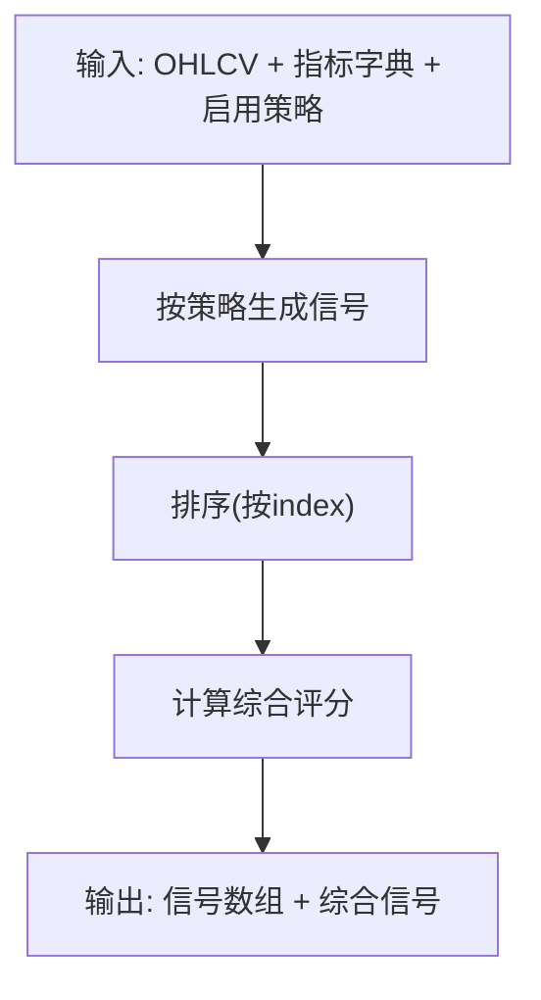
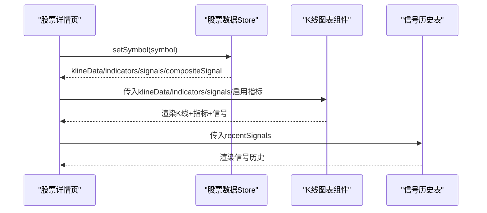
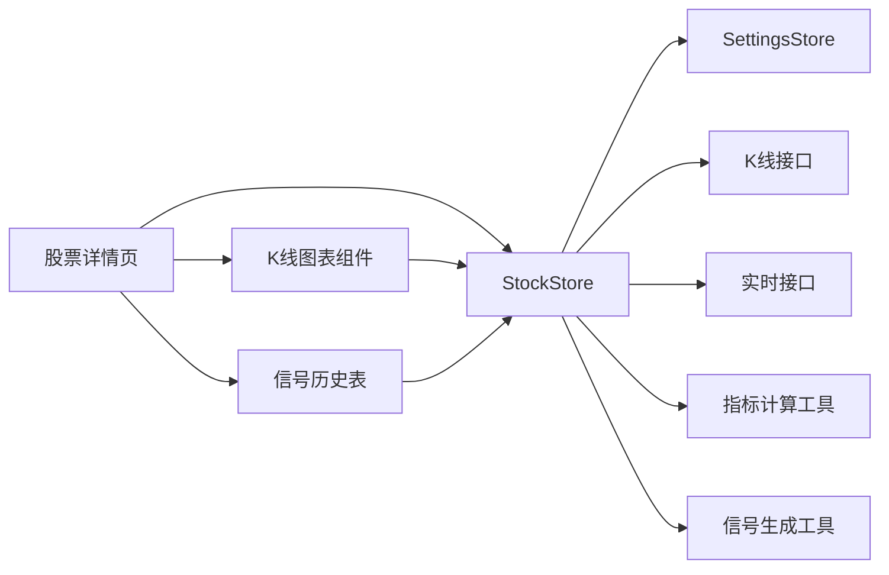

# 股票数据Store

<cite>
**本文档引用的文件**
- [src/stores/stock.js](file://src/stores/stock.js)
- [src/utils/indicators.js](file://src/utils/indicators.js)
- [src/utils/signals.js](file://src/utils/signals.js)
- [src/api/kline.js](file://src/api/kline.js)
- [src/api/realtime.js](file://src/api/realtime.js)
- [src/stores/settings.js](file://src/stores/settings.js)
- [src/utils/constants.js](file://src/utils/constants.js)
- [src/views/stock/detail.vue](file://src/views/stock/detail.vue)
- [src/components/KLineChart/index.vue](file://src/components/KLineChart/index.vue)
- [src/components/SignalHistoryTable/index.vue](file://src/components/SignalHistoryTable/index.vue)
- [src/stores/market.js](file://src/stores/market.js)
</cite>

## 目录
1. [简介](#简介)
2. [项目结构](#项目结构)
3. [核心组件](#核心组件)
4. [架构总览](#架构总览)
5. [详细组件分析](#详细组件分析)
6. [依赖关系分析](#依赖关系分析)
7. [性能考虑](#性能考虑)
8. [故障排查指南](#故障排查指南)
9. [结论](#结论)
10. [附录](#附录)

## 简介
本文件面向“股票数据Store”的使用者与维护者，系统性阐述其核心功能、数据模型、计算管线与前端集成方式。重点覆盖：
- 个股K线数据（OHLCV）的获取与缓存策略
- 技术指标计算（MA/MACD/KDJ/RSI/布林带/支撑压力位）
- 信号生成与综合评分（多策略融合）
- 实时行情自动刷新机制
- 查询、过滤、排序等操作方法
- 时间序列处理、批量数据管理与图表渲染

## 项目结构
该模块位于前端工程的Pinia Store层，围绕“股票详情页”进行数据驱动展示，主要涉及以下文件：
- Store层：股票数据Store、设置Store、市场Store
- 计算层：指标计算工具、信号生成工具
- 接口层：K线接口、实时行情接口
- 视图层：股票详情页、K线图表组件、信号历史表格

**图表来源**
- [src/views/stock/detail.vue:1-295](file://src/views/stock/detail.vue#L1-L295)
- [src/stores/stock.js:1-92](file://src/stores/stock.js#L1-L92)
- [src/stores/settings.js:1-70](file://src/stores/settings.js#L1-L70)
- [src/stores/market.js:1-41](file://src/stores/market.js#L1-L41)
- [src/utils/indicators.js:1-245](file://src/utils/indicators.js#L1-L245)
- [src/utils/signals.js:1-347](file://src/utils/signals.js#L1-L347)
- [src/utils/constants.js:1-68](file://src/utils/constants.js#L1-L68)
- [src/api/kline.js:1-27](file://src/api/kline.js#L1-L27)
- [src/api/realtime.js:1-56](file://src/api/realtime.js#L1-L56)

**章节来源**
- [src/stores/stock.js:1-92](file://src/stores/stock.js#L1-L92)
- [src/views/stock/detail.vue:1-295](file://src/views/stock/detail.vue#L1-L295)

## 核心组件
- 股票数据Store（useStockStore）
  - 状态字段：当前股票代码、股票快照、K线数据、K线周期、技术指标、信号数组、综合信号、加载状态、错误状态
  - 方法：设置股票、设置周期、获取K线、获取实时行情、计算指标、生成信号、批量获取、启动/停止自动刷新
- 指标计算工具（calculateAllIndicators）
  - 提供MA/MACD/KDJ/RSI/布林带/支撑压力位的批量计算
- 信号生成工具（generateAllSignals + getCompositeSignal）
  - 基于启用策略生成买卖信号，并给出综合评分与建议
- 设置Store（useSettingsStore）
  - 存储用户偏好的默认周期、启用指标、信号策略及各指标参数
- 接口层
  - K线接口：返回OHLCV数组
  - 实时行情接口：返回单只股票快照

**章节来源**
- [src/stores/stock.js:10-92](file://src/stores/stock.js#L10-L92)
- [src/utils/indicators.js:221-245](file://src/utils/indicators.js#L221-L245)
- [src/utils/signals.js:197-261](file://src/utils/signals.js#L197-L261)
- [src/stores/settings.js:6-70](file://src/stores/settings.js#L6-L70)
- [src/api/kline.js:9-27](file://src/api/kline.js#L9-L27)
- [src/api/realtime.js:52-56](file://src/api/realtime.js#L52-L56)

## 架构总览
股票数据Store采用“数据-计算-展示”三层协作模式：
- 数据获取：通过K线接口拉取OHLCV，通过实时接口拉取快照
- 指标计算：基于OHLCV计算多类技术指标，形成指标字典
- 信号生成：按策略组合生成买卖信号，再计算综合评分
- 展示渲染：K线图表组件消费OHLCV与指标/信号；信号历史表展示信号明细

**图表来源**
- [src/stores/stock.js:25-72](file://src/stores/stock.js#L25-L72)
- [src/api/kline.js:9-27](file://src/api/kline.js#L9-L27)
- [src/api/realtime.js:52-56](file://src/api/realtime.js#L52-L56)
- [src/utils/indicators.js:221-245](file://src/utils/indicators.js#L221-L245)
- [src/utils/signals.js:197-261](file://src/utils/signals.js#L197-L261)

## 详细组件分析

### 股票数据Store（useStockStore）
- 状态结构
  - currentSymbol：当前股票代码
  - currentStockInfo：实时快照（名称、开盘、昨收、当前价、最高、最低、成交量、成交额、涨跌额、涨跌幅、日期、时间）
  - klineData：K线数组，元素包含day/open/high/low/close/volume
  - klinePeriod：K线周期（如daily/weekly/60min等）
  - indicators：指标字典，包含ma/macd/kdj/rsi/boll/supportResistance
  - signals：信号数组，每项含date/index/type/source/strength/price/description
  - compositeSignal：综合信号，含score/recommendation/level/recentSignals
  - loading/error：加载状态与错误提示
- 关键方法
  - setSymbol(symbol)：设置股票并触发fetchAll
  - setPeriod(period)：切换周期并重新获取K线
  - fetchKLine()：获取K线，计算指标与信号
  - fetchRealtimeQuote()：获取实时快照
  - computeIndicators()/computeSignals()：分别计算指标与生成信号
  - fetchAll()：并发获取K线与实时行情
  - startAutoRefresh()/stopAutoRefresh()：定时刷新实时行情

**图表来源**
- [src/stores/stock.js:10-92](file://src/stores/stock.js#L10-L92)

**章节来源**
- [src/stores/stock.js:10-92](file://src/stores/stock.js#L10-L92)

### 技术指标计算（indicators.js）
- 指标清单与输入输出
  - MA：输入收盘价数组，输出多周期均线数组
  - MACD：输入收盘价与短/长/信号周期，输出DIF/DEA/柱状图
  - KDJ：输入高/低/收与周期，输出K/D/J
  - RSI：输入收盘价与周期，输出RSI数组
  - 布林带：输入收盘价与周期/倍数，输出上/中/下轨
  - 支撑压力位：输入高/低/收与MA20/MA60，输出支撑/压力集合
- 计算特点
  - 对缺失数据填充null，保证时间序列对齐
  - 支持可配置参数，便于策略调优
  - 支撑压力位合并相近价位，避免冗余

**图表来源**
- [src/utils/indicators.js:221-245](file://src/utils/indicators.js#L221-L245)

**章节来源**
- [src/utils/indicators.js:1-245](file://src/utils/indicators.js#L1-L245)

### 信号生成与综合评分（signals.js）
- 策略清单
  - MACD：金叉/死叉结合柱状图正负区间判断
  - KDJ：超卖/超买与金叉/死叉
  - RSI：超卖/超买
  - 布林带：触轨反弹/回落
  - 均线：多组均线交叉
- 信号结构
  - 每条信号包含：日期、索引、类型(BUY/SELL)、来源、强度(STRONG/MEDIUM/WEAK)、价格、描述
- 综合评分
  - 基于信号强度权重与最近N根K线内的信号数量，给出综合评分与建议级别

**图表来源**
- [src/utils/signals.js:197-261](file://src/utils/signals.js#L197-L261)

**章节来源**
- [src/utils/signals.js:1-347](file://src/utils/signals.js#L1-L347)

### 数据获取流程与缓存策略
- 数据来源
  - K线：通过K线接口获取指定周期与长度的OHLCV
  - 实时：通过实时接口获取单只股票快照
- 缓存与更新
  - Store内部未实现持久化缓存；每次setSymbol/setPeriod会重新拉取数据
  - 自动刷新：启动后每10秒请求一次实时行情，适合观察盘中变化
- 错误处理
  - K线获取异常时设置错误状态并保持空数组
  - 实时接口异常时返回null，Store层赋值为空对象

**章节来源**
- [src/stores/stock.js:35-57](file://src/stores/stock.js#L35-L57)
- [src/api/kline.js:9-27](file://src/api/kline.js#L9-L27)
- [src/api/realtime.js:52-56](file://src/api/realtime.js#L52-L56)

### 查询、过滤、排序与展示
- 查询与过滤
  - 信号历史：在视图层对signals进行倒序并截取最近N条
  - 指标摘要：按需显示最新有效指标值（忽略null）
- 排序
  - 信号按index升序排列，确保时间顺序一致
- 展示
  - K线图表组件根据启用指标动态渲染子图与系列
  - 信号以标记点形式叠加到K线下方或上方

**图表来源**
- [src/views/stock/detail.vue:131-175](file://src/views/stock/detail.vue#L131-L175)
- [src/components/KLineChart/index.vue:22-241](file://src/components/KLineChart/index.vue#L22-L241)
- [src/components/SignalHistoryTable/index.vue:1-32](file://src/components/SignalHistoryTable/index.vue#L1-L32)

**章节来源**
- [src/views/stock/detail.vue:1-295](file://src/views/stock/detail.vue#L1-L295)
- [src/components/KLineChart/index.vue:1-285](file://src/components/KLineChart/index.vue#L1-L285)
- [src/components/SignalHistoryTable/index.vue:1-32](file://src/components/SignalHistoryTable/index.vue#L1-L32)

## 依赖关系分析
- 组件耦合
  - 股票数据Store依赖设置Store（参数）、接口层（数据）、计算层（指标/信号）
  - 视图层依赖Store与组件库（Element Plus），并通过组件消费Store状态
- 外部依赖
  - ECharts用于K线渲染
  - Day.js用于日期格式化
  - Pinia用于状态管理

**图表来源**
- [src/stores/stock.js:1-92](file://src/stores/stock.js#L1-L92)
- [src/stores/settings.js:1-70](file://src/stores/settings.js#L1-L70)
- [src/views/stock/detail.vue:1-295](file://src/views/stock/detail.vue#L1-L295)
- [src/components/KLineChart/index.vue:1-285](file://src/components/KLineChart/index.vue#L1-L285)
- [src/components/SignalHistoryTable/index.vue:1-32](file://src/components/SignalHistoryTable/index.vue#L1-L32)

**章节来源**
- [src/stores/stock.js:1-92](file://src/stores/stock.js#L1-L92)
- [src/stores/settings.js:1-70](file://src/stores/settings.js#L1-L70)
- [src/views/stock/detail.vue:1-295](file://src/views/stock/detail.vue#L1-L295)

## 性能考虑
- 计算复杂度
  - MA/MACD/KDJ/RSI均为O(n)线性扫描，适合大规模时间序列
  - 布林带窗口内均值/方差计算为O(n×window)，注意window大小
  - 支撑压力位合并去重为O(n log n)，受价位数量影响
- 渲染优化
  - ECharts内部已做大量优化，Store层避免不必要的深拷贝
  - 通过computed派生数组（如closes/dates）减少重复映射
- 刷新策略
  - 实时行情每10秒一次，适合盘中观察；若需降低网络压力可延长间隔
- 批量数据管理
  - Store默认拉取固定长度数据，可根据需要调整datalen参数

[本节为通用性能建议，不直接分析具体文件]

## 故障排查指南
- 常见问题
  - 无数据：检查symbol是否正确；确认接口返回格式与解析逻辑
  - 指标为空：确认OHLCV长度是否满足最小周期要求
  - 信号异常：检查启用策略与参数配置；核对信号强度阈值
- 定位方法
  - 在Store中设置断点，观察fetchKLine/fetchRealtimeQuote执行路径
  - 在接口层打印请求参数与响应结构
  - 在图表组件中验证传入数据格式

**章节来源**
- [src/stores/stock.js:35-57](file://src/stores/stock.js#L35-L57)
- [src/api/kline.js:9-27](file://src/api/kline.js#L9-L27)
- [src/api/realtime.js:52-56](file://src/api/realtime.js#L52-L56)

## 结论
股票数据Store以清晰的职责划分实现了从数据获取到指标计算再到信号展示的完整链路。通过Pinia与Vue组合式API，Store提供了简洁的API与良好的可扩展性。建议后续可在Store层增加本地缓存与增量更新策略，以进一步提升性能与用户体验。

[本节为总结性内容，不直接分析具体文件]

## 附录

### 数据模型定义
- OHLCV数据
  - 字段：day、open、high、low、close、volume
  - 类型：字符串日期、数值
- 技术指标数组
  - MA：ma5/ma10/ma20/ma60等
  - MACD：dif/dea/macd
  - KDJ：k/d/j
  - RSI：rsi
  - 布林带：upper/middle/lower
  - 支撑压力位：supports/resistances
- 信号数据
  - 字段：date、index、type、source、strength、price、description
  - 类型：日期、整数索引、枚举类型、字符串来源、强度等级、数值价格、文本描述

**章节来源**
- [src/api/kline.js:15-22](file://src/api/kline.js#L15-L22)
- [src/utils/indicators.js:221-245](file://src/utils/indicators.js#L221-L245)
- [src/utils/signals.js:8-42](file://src/utils/signals.js#L8-L42)

### 使用示例（方法与路径）
- 设置股票并获取全部数据
  - 路径：[src/stores/stock.js:25-28](file://src/stores/stock.js#L25-L28)
- 切换K线周期并重新获取
  - 路径：[src/stores/stock.js:30-33](file://src/stores/stock.js#L30-L33)
- 获取实时行情并自动刷新
  - 路径：[src/stores/stock.js:54-57](file://src/stores/stock.js#L54-L57)、[src/stores/stock.js:74-81](file://src/stores/stock.js#L74-L81)
- 计算指标与生成信号
  - 路径：[src/stores/stock.js:59-68](file://src/stores/stock.js#L59-L68)
- 查看信号历史（最近N条）
  - 路径：[src/views/stock/detail.vue:131-133](file://src/views/stock/detail.vue#L131-L133)
- 图表渲染（启用指标与信号）
  - 路径：[src/components/KLineChart/index.vue:22-241](file://src/components/KLineChart/index.vue#L22-L241)

**章节来源**
- [src/stores/stock.js:25-81](file://src/stores/stock.js#L25-L81)
- [src/views/stock/detail.vue:131-133](file://src/views/stock/detail.vue#L131-L133)
- [src/components/KLineChart/index.vue:22-241](file://src/components/KLineChart/index.vue#L22-L241)