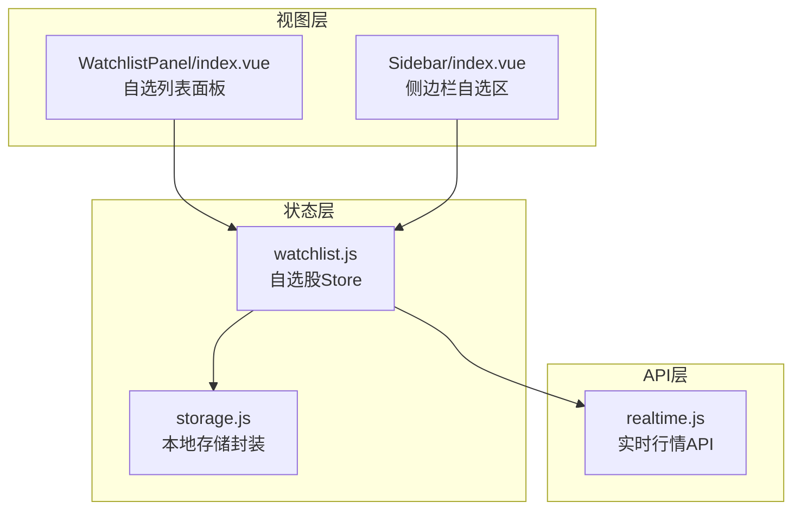
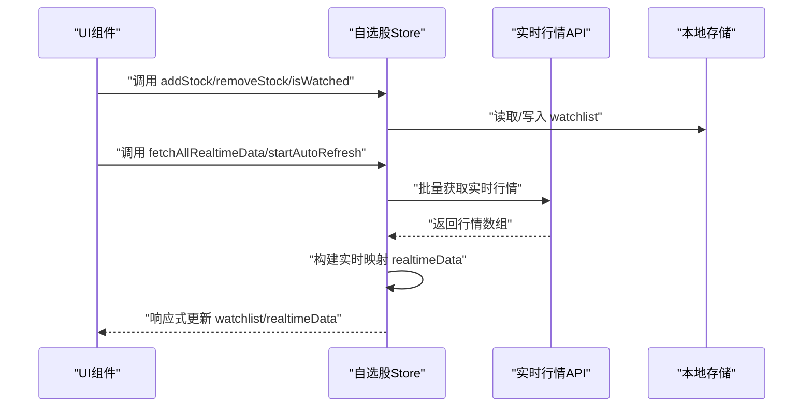
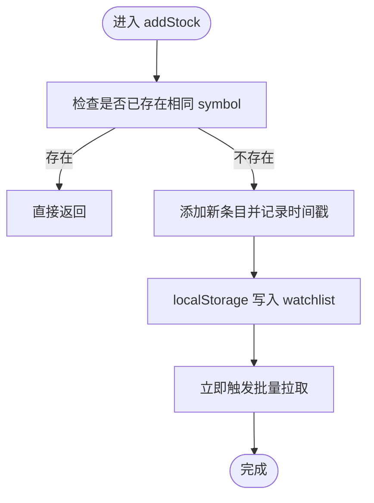
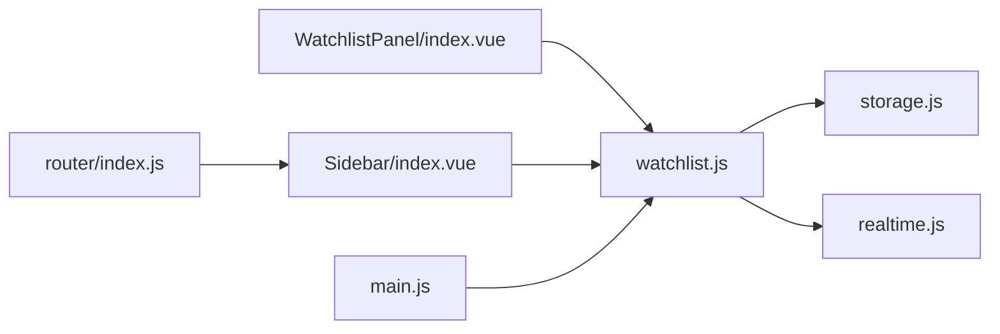

# 自选股Store

<cite>
**本文引用的文件**
- [src/stores/watchlist.js](file://src/stores/watchlist.js)
- [src/utils/storage.js](file://src/utils/storage.js)
- [src/api/realtime.js](file://src/api/realtime.js)
- [src/components/WatchlistPanel/index.vue](file://src/components/WatchlistPanel/index.vue)
- [src/layout/components/Sidebar/index.vue](file://src/layout/components/Sidebar/index.vue)
- [src/main.js](file://src/main.js)
- [src/router/index.js](file://src/router/index.js)
- [src/stores/index.js](file://src/stores/index.js)
- [src/utils/formatter.js](file://src/utils/formatter.js)
</cite>

## 目录
1. [简介](#简介)
2. [项目结构](#项目结构)
3. [核心组件](#核心组件)
4. [架构总览](#架构总览)
5. [详细组件分析](#详细组件分析)
6. [依赖关系分析](#依赖关系分析)
7. [性能考虑](#性能考虑)
8. [故障排查指南](#故障排查指南)
9. [结论](#结论)
10. [附录](#附录)

## 简介
本文件系统性阐述“自选股Store”的设计目标与实现细节，覆盖以下方面：
- 设计目标：为用户提供便捷的自选股管理能力（增删改查、批量刷新）、实时行情跟踪与本地持久化。
- 功能实现：自选股列表管理、批量获取实时行情、自动刷新策略、本地存储与读取。
- 数据结构：自选股条目字段、实时行情字段、以及与之配套的格式化与展示逻辑。
- 同步机制：本地持久化（localStorage）与组件渲染的联动；当前未实现云端同步。
- 性能优化：批量请求、定时器管理、防抖与节流策略建议。

## 项目结构
自选股Store位于Pinia状态层，配合API层与UI组件协同工作，整体结构如下：

图表来源
- [src/stores/watchlist.js:1-53](file://src/stores/watchlist.js#L1-L53)
- [src/utils/storage.js:1-21](file://src/utils/storage.js#L1-L21)
- [src/api/realtime.js:1-56](file://src/api/realtime.js#L1-L56)
- [src/components/WatchlistPanel/index.vue:1-143](file://src/components/WatchlistPanel/index.vue#L1-L143)
- [src/layout/components/Sidebar/index.vue:1-172](file://src/layout/components/Sidebar/index.vue#L1-L172)

章节来源
- [src/stores/watchlist.js:1-53](file://src/stores/watchlist.js#L1-L53)
- [src/utils/storage.js:1-21](file://src/utils/storage.js#L1-L21)
- [src/api/realtime.js:1-56](file://src/api/realtime.js#L1-L56)
- [src/components/WatchlistPanel/index.vue:1-143](file://src/components/WatchlistPanel/index.vue#L1-L143)
- [src/layout/components/Sidebar/index.vue:1-172](file://src/layout/components/Sidebar/index.vue#L1-L172)

## 核心组件
- 自选股Store（watchlist.js）
  - 负责：自选股列表的增删改查、批量实时行情拉取、自动刷新控制、本地持久化。
  - 关键状态：watchlist、realtimeData、symbols计算属性、定时器。
  - 关键方法：addStock、removeStock、isWatched、fetchAllRealtimeData、startAutoRefresh、stopAutoRefresh。
- 本地存储封装（storage.js）
  - 负责：统一的localStorage读写，带前缀与JSON序列化。
- 实时行情API（realtime.js）
  - 负责：批量解析新浪行情文本并返回标准化行情对象数组。
- 视图组件
  - WatchlistPanel：桌面端自选面板，支持手动刷新与删除。
  - Sidebar：侧边栏自选区，点击跳转个股详情，展示实时价格与涨跌。

章节来源
- [src/stores/watchlist.js:1-53](file://src/stores/watchlist.js#L1-L53)
- [src/utils/storage.js:1-21](file://src/utils/storage.js#L1-L21)
- [src/api/realtime.js:1-56](file://src/api/realtime.js#L1-L56)
- [src/components/WatchlistPanel/index.vue:1-143](file://src/components/WatchlistPanel/index.vue#L1-L143)
- [src/layout/components/Sidebar/index.vue:1-172](file://src/layout/components/Sidebar/index.vue#L1-L172)

## 架构总览
自选股Store通过Pinia集中管理状态，UI组件通过组合式API使用Store实例，API层负责从后端获取实时行情数据。数据流如下：

图表来源
- [src/stores/watchlist.js:13-45](file://src/stores/watchlist.js#L13-L45)
- [src/api/realtime.js:39-47](file://src/api/realtime.js#L39-L47)
- [src/utils/storage.js:4-19](file://src/utils/storage.js#L4-L19)

## 详细组件分析

### 自选股Store（watchlist.js）
- 数据结构
  - 自选股条目：包含 symbol（股票代码）、name（名称）、addedAt（加入时间戳）。
  - 实时行情映射：realtimeData 以 symbol 为键，值为标准化行情对象（含 price、change、changePercent 等）。
- 增删改查
  - 新增：去重后追加至 watchlist，并持久化；随后触发一次批量拉取。
  - 删除：过滤掉指定 symbol 并持久化。
  - 查询：isWatched 判断是否已关注。
- 批量管理
  - symbols 计算属性汇总当前自选股代码集合。
  - fetchAllRealtimeData 将 symbols 传给 API 层，合并为映射并覆盖 realtimeData。
- 自动刷新
  - startAutoRefresh 停止旧定时器，立即拉取一次，然后每15秒重复一次。
  - stopAutoRefresh 清理定时器，避免内存泄漏与后台消耗。
- 本地持久化
  - 使用 storage.local.get/set 包装 localStorage，键名带前缀，值为JSON字符串。

图表来源
- [src/stores/watchlist.js:13-18](file://src/stores/watchlist.js#L13-L18)
- [src/utils/storage.js:4-19](file://src/utils/storage.js#L4-L19)

章节来源
- [src/stores/watchlist.js:1-53](file://src/stores/watchlist.js#L1-L53)
- [src/utils/storage.js:1-21](file://src/utils/storage.js#L1-L21)

### 本地存储封装（storage.js）
- 统一前缀：所有键名带固定前缀，避免命名冲突。
- 安全读取：捕获异常，防止因损坏数据导致崩溃。
- 序列化：统一使用JSON进行存取。

章节来源
- [src/utils/storage.js:1-21](file://src/utils/storage.js#L1-L21)

### 实时行情API（realtime.js）
- 批量接口：接收 symbol 数组，拼接为后端查询串，返回标准化行情数组。
- 字段提取：解析新浪行情文本，抽取名称、开盘、昨收、当前价、最高、最低、成交量、成交额、日期、时间、涨跌额、涨跌幅、symbol。
- 错误处理：网络异常或解析失败时返回空数组，保证前端健壮性。

章节来源
- [src/api/realtime.js:1-56](file://src/api/realtime.js#L1-L56)

### 视图组件（WatchlistPanel 与 Sidebar）
- WatchlistPanel
  - 展示自选股列表，点击行跳转个股详情。
  - 支持手动刷新与删除按钮，删除后即时更新本地存储与实时数据。
  - 价格涨跌样式根据 change 或 changePercent 动态切换。
- Sidebar
  - 在侧边栏展示自选列表，点击跳转个股详情。
  - 实时价格与涨跌样式同上，便于快速浏览。

章节来源
- [src/components/WatchlistPanel/index.vue:1-143](file://src/components/WatchlistPanel/index.vue#L1-L143)
- [src/layout/components/Sidebar/index.vue:1-172](file://src/layout/components/Sidebar/index.vue#L1-L172)
- [src/utils/formatter.js:1-60](file://src/utils/formatter.js#L1-L60)

## 依赖关系分析
- Store 依赖
  - storage.local：用于读写 watchlist。
  - getRealtimeQuotes：用于批量获取实时行情。
- 组件依赖
  - WatchlistPanel 与 Sidebar 依赖 useWatchlistStore 提供的状态与方法。
- 应用集成
  - main.js 注册 Pinia，全局可注入。
  - router 提供个股详情路由，支持跳转。

图表来源
- [src/stores/watchlist.js:1-53](file://src/stores/watchlist.js#L1-L53)
- [src/utils/storage.js:1-21](file://src/utils/storage.js#L1-L21)
- [src/api/realtime.js:1-56](file://src/api/realtime.js#L1-L56)
- [src/components/WatchlistPanel/index.vue:1-143](file://src/components/WatchlistPanel/index.vue#L1-L143)
- [src/layout/components/Sidebar/index.vue:1-172](file://src/layout/components/Sidebar/index.vue#L1-L172)
- [src/main.js:1-17](file://src/main.js#L1-L17)
- [src/router/index.js:1-58](file://src/router/index.js#L1-L58)

章节来源
- [src/stores/index.js:1-11](file://src/stores/index.js#L1-L11)
- [src/main.js:1-17](file://src/main.js#L1-L17)
- [src/router/index.js:1-58](file://src/router/index.js#L1-L58)

## 性能考虑
- 批量请求
  - 通过 symbols 计算属性一次性生成批量请求，减少多次小请求带来的开销。
- 定时刷新
  - 默认15秒刷新一次，可在业务需要时调整频率或按需停止。
- 前端渲染
  - 使用计算属性 symbols，避免在每次渲染中重复构造数组。
- 存储与序列化
  - localStorage 读写采用JSON，注意大体量数据可能影响首屏性能，建议分页或懒加载。
- 建议优化
  - 对高频组件（如Sidebar）可增加防抖/节流，避免频繁点击触发刷新。
  - 可引入缓存失效策略（如TTL），避免过期数据长时间驻留。
  - 若用户量增长，建议引入云端同步与增量更新，降低本地存储压力。

## 故障排查指南
- 自选股列表为空
  - 检查 localStorage 中是否存在带前缀的键；确认 storage.local.get 是否正常返回。
  - 确认 addStock 是否被正确调用且未被去重逻辑提前返回。
- 实时行情不更新
  - 确认 startAutoRefresh 已调用且未被 stopAutoRefresh 清理。
  - 检查 getRealtimeQuotes 返回是否为空数组（网络异常或解析失败）。
- 删除无效
  - 确认 removeStock 的 symbol 与存储一致；检查 storage.local.set 是否成功写入。
- UI 不显示涨跌颜色
  - 检查行情对象是否包含 change 或 changePercent 字段；确认样式类名绑定逻辑。

章节来源
- [src/stores/watchlist.js:13-45](file://src/stores/watchlist.js#L13-L45)
- [src/utils/storage.js:4-19](file://src/utils/storage.js#L4-L19)
- [src/api/realtime.js:39-47](file://src/api/realtime.js#L39-L47)
- [src/utils/formatter.js:57-60](file://src/utils/formatter.js#L57-L60)

## 结论
自选股Store以Pinia为核心，结合本地存储与批量实时行情API，提供了简洁高效的自选股管理能力。其设计具备良好的扩展性，未来可在以下方向演进：
- 引入云端同步与冲突解决策略，提升多设备一致性。
- 增加提醒阈值与通知机制，完善“提醒设置”能力。
- 优化大数据量场景下的渲染与存储策略，提升性能与稳定性。

## 附录

### 数据结构定义
- 自选股条目
  - symbol：股票代码（如 sh600036）
  - name：股票名称（如 中国银行）
  - addedAt：加入时间戳（毫秒）
- 实时行情对象
  - name：名称
  - open：开盘价
  - prevClose：昨收
  - price：当前价
  - high：最高
  - low：最低
  - volume：成交量
  - amount：成交额
  - date/time：日期与时间
  - change：涨跌额
  - changePercent：涨跌幅%
  - symbol：股票代码

章节来源
- [src/stores/watchlist.js:13-18](file://src/stores/watchlist.js#L13-L18)
- [src/api/realtime.js:18-32](file://src/api/realtime.js#L18-L32)