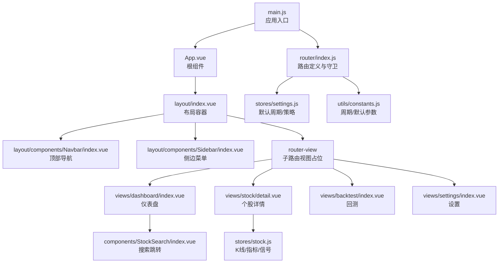
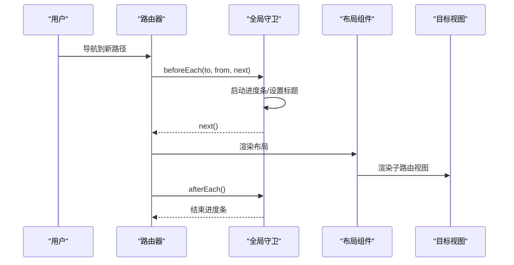
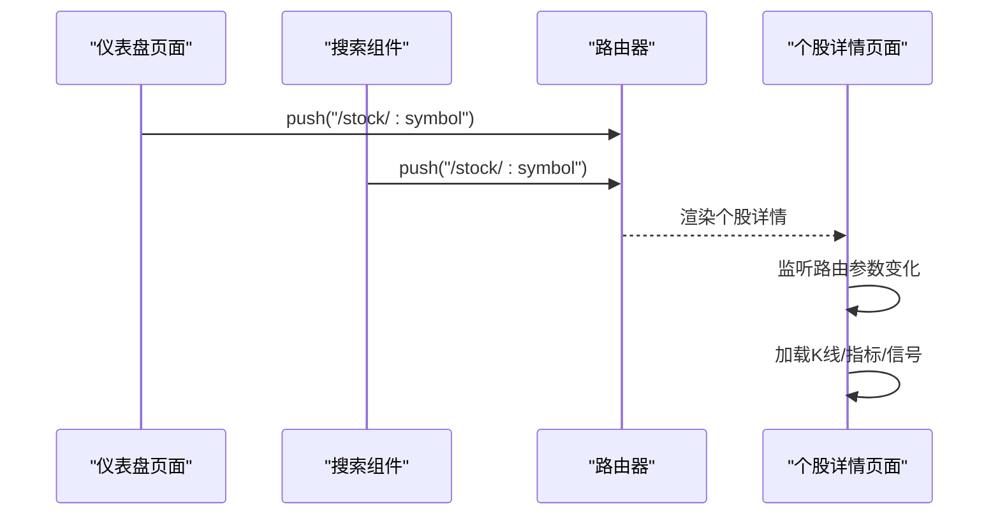
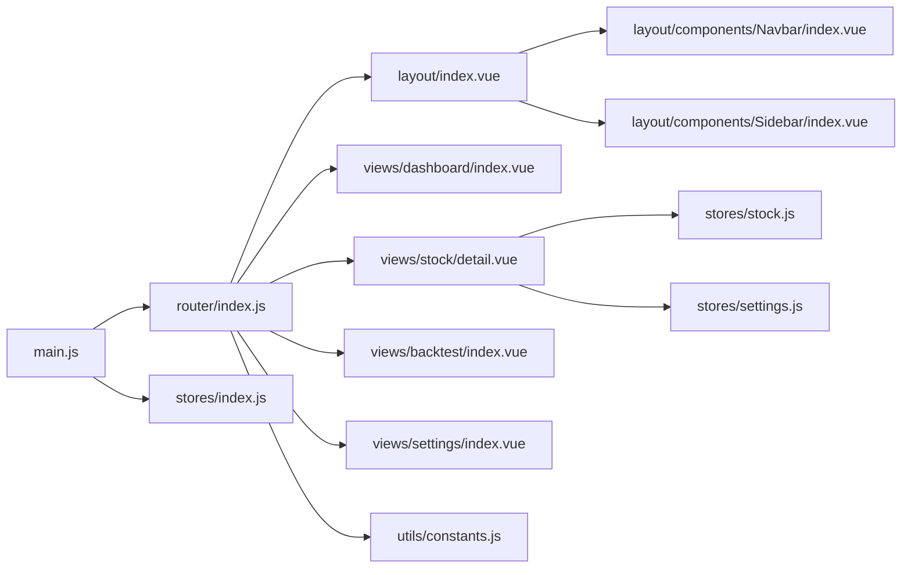

# 路由系统

<cite>
**本文引用的文件**
- [src/router/index.js](file://src/router/index.js)
- [src/main.js](file://src/main.js)
- [src/App.vue](file://src/App.vue)
- [src/layout/index.vue](file://src/layout/index.vue)
- [src/layout/components/Navbar/index.vue](file://src/layout/components/Navbar/index.vue)
- [src/layout/components/Sidebar/index.vue](file://src/layout/components/Sidebar/index.vue)
- [src/views/dashboard/index.vue](file://src/views/dashboard/index.vue)
- [src/views/stock/detail.vue](file://src/views/stock/detail.vue)
- [src/views/backtest/index.vue](file://src/views/backtest/index.vue)
- [src/views/settings/index.vue](file://src/views/settings/index.vue)
- [src/components/StockSearch/index.vue](file://src/components/StockSearch/index.vue)
- [src/stores/index.js](file://src/stores/index.js)
- [src/stores/stock.js](file://src/stores/stock.js)
- [src/stores/settings.js](file://src/stores/settings.js)
- [src/utils/constants.js](file://src/utils/constants.js)
- [package.json](file://package.json)
</cite>

## 更新摘要
**变更内容**
- 更新路由定义部分，反映路由配置从4个路由项简化为3个路由项
- 删除关于screening路由项的描述，因为该路由已被移除
- 更新侧边栏菜单结构，移除screening相关菜单项
- 更新架构图和依赖关系图，反映简化的路由结构

## 目录
1. [简介](#简介)
2. [项目结构](#项目结构)
3. [核心组件](#核心组件)
4. [架构总览](#架构总览)
5. [详细组件分析](#详细组件分析)
6. [依赖分析](#依赖分析)
7. [性能考虑](#性能考虑)
8. [故障排查指南](#故障排查指南)
9. [结论](#结论)
10. [附录](#附录)

## 简介
本文件系统性梳理量化交易平台的前端路由体系，基于 Vue Router 4 实现。内容涵盖路由定义与嵌套路由、动态路由参数、路由守卫与权限控制、懒加载与性能优化、参数传递与查询字符串处理、路由元信息、导航守卫与错误处理、以及单页应用的路由行为与浏览器历史记录管理。文档同时结合布局组件、页面视图与状态管理，给出端到端的导航流程说明。

## 项目结构
路由系统围绕以下关键文件组织：
- 应用入口与挂载：在应用入口注册路由与状态管理，并在根组件中渲染路由视图。
- 路由定义：集中于路由模块，采用 history 模式与嵌套路由，配合懒加载与进度条。
- 布局与导航：侧边栏菜单项与面包屑标题来自路由元信息；顶部导航展示当前页面标题与实时状态。
- 页面视图：仪表盘、个股详情、回测、设置等页面通过路由驱动。
- 状态管理：K线与指标计算、信号生成、默认周期与策略等设置通过 Pinia Store 驱动页面逻辑。

**图表来源**
- [src/main.js:1-17](file://src/main.js#L1-L17)
- [src/router/index.js:1-58](file://src/router/index.js#L1-L58)
- [src/App.vue:1-13](file://src/App.vue#L1-L13)
- [src/layout/index.vue:1-61](file://src/layout/index.vue#L1-L61)
- [src/layout/components/Navbar/index.vue:1-128](file://src/layout/components/Navbar/index.vue#L1-L128)
- [src/layout/components/Sidebar/index.vue:1-172](file://src/layout/components/Sidebar/index.vue#L1-L172)
- [src/views/dashboard/index.vue:1-163](file://src/views/dashboard/index.vue#L1-L163)
- [src/views/stock/detail.vue:1-295](file://src/views/stock/detail.vue#L1-L295)
- [src/views/backtest/index.vue:1-242](file://src/views/backtest/index.vue#L1-L242)
- [src/views/settings/index.vue:1-135](file://src/views/settings/index.vue#L1-L135)
- [src/components/StockSearch/index.vue:1-76](file://src/components/StockSearch/index.vue#L1-L76)
- [src/stores/stock.js:1-92](file://src/stores/stock.js#L1-L92)
- [src/stores/settings.js:1-70](file://src/stores/settings.js#L1-L70)
- [src/utils/constants.js:1-68](file://src/utils/constants.js#L1-L68)

**章节来源**
- [src/main.js:1-17](file://src/main.js#L1-L17)
- [src/router/index.js:1-58](file://src/router/index.js#L1-L58)
- [src/App.vue:1-13](file://src/App.vue#L1-L13)

## 核心组件
- 路由器实例与历史模式：使用 Web History 模式，支持浏览器前进后退与地址栏直连。
- 嵌套路由：根路径 '/' 包含布局组件与多个子路由，形成"布局-页面"的层次化结构。
- 动态路由：个股详情路由使用动态参数，从路由参数读取股票代码并驱动数据加载。
- 路由守卫：全局前置守卫启动进度条、设置页面标题；后置守卫完成进度条。
- 懒加载：各页面组件通过函数式导入实现按需加载，降低首屏体积。
- 路由元信息：用于菜单图标、标题与隐藏策略（如个股详情）。

**章节来源**
- [src/router/index.js:8-58](file://src/router/index.js#L8-L58)
- [src/layout/index.vue:7-11](file://src/layout/index.vue#L7-L11)
- [src/layout/components/Navbar/index.vue:8](file://src/layout/components/Navbar/index.vue#L8)

## 架构总览
路由系统采用"布局容器 + 子路由视图"的结构。布局容器负责渲染侧边栏与顶部导航，子路由视图根据当前路径动态切换。全局守卫统一处理页面标题与加载进度，确保用户体验一致。

**图表来源**
- [src/router/index.js:47-55](file://src/router/index.js#L47-L55)
- [src/layout/index.vue:7-11](file://src/layout/index.vue#L7-L11)

## 详细组件分析

### 路由定义与嵌套路由
- 根路径 '/' 使用布局组件作为父容器，children 定义子路由：
  - 仪表盘：路径 '/dashboard'，懒加载，元信息包含标题与图标。
  - 个股详情：路径 '/stock/:symbol'，动态参数 symbol，懒加载，元信息用于隐藏策略。
  - 信号回测：路径 '/backtest'，懒加载，元信息包含标题与图标。
  - 参数设置：路径 '/settings'，懒加载，元信息包含标题与图标。
- 重定向：根路径重定向至 '/dashboard'，保证首次访问进入仪表盘。

**更新** 路由配置已简化，从原来的4个路由项减少到3个路由项，移除了screening相关功能。

**章节来源**
- [src/router/index.js:8-40](file://src/router/index.js#L8-L40)

### 动态路由与参数传递
- 个股详情路由使用动态段 ':symbol'，在页面中通过路由钩子读取参数并触发数据加载。
- 仪表盘与搜索组件均通过编程式导航跳转到动态路由，携带股票代码参数。

**图表来源**
- [src/views/dashboard/index.vue:97-99](file://src/views/dashboard/index.vue#L97-L99)
- [src/components/StockSearch/index.vue:40-43](file://src/components/StockSearch/index.vue#L40-L43)
- [src/views/stock/detail.vue:163-169](file://src/views/stock/detail.vue#L163-L169)

**章节来源**
- [src/views/dashboard/index.vue:97-99](file://src/views/dashboard/index.vue#L97-L99)
- [src/components/StockSearch/index.vue:40-43](file://src/components/StockSearch/index.vue#L40-L43)
- [src/views/stock/detail.vue:163-169](file://src/views/stock/detail.vue#L163-L169)

### 路由守卫与权限控制
- 全局前置守卫：
  - 启动进度条，避免白屏。
  - 设置页面标题，标题来源于路由元信息。
- 全局后置守卫：
  - 结束进度条，保证导航完成后关闭。
- 权限控制：
  - 当前仓库未实现鉴权逻辑，可扩展在前置守卫中校验用户状态或角色。

**章节来源**
- [src/router/index.js:47-55](file://src/router/index.js#L47-L55)

### 懒加载与性能优化
- 所有页面组件均通过函数式导入实现懒加载，减少首屏资源占用。
- 结合进度条提升感知性能，避免长时间加载导致的卡顿感。
- 建议：
  - 将高频页面拆分为独立 chunk，进一步降低初始包体。
  - 对大组件进行代码分割，按需加载图表与信号组件。

**章节来源**
- [src/router/index.js:17](file://src/router/index.js#L17)
- [src/router/index.js:29](file://src/router/index.js#L29)
- [src/router/index.js:35](file://src/router/index.js#L35)
- [src/router/index.js:4](file://src/router/index.js#L4)

### 路由元信息与导航
- 元信息字段：
  - title：用于设置页面标题与顶部导航标题。
  - icon：用于侧边栏菜单图标。
  - hidden：用于控制是否在菜单中显示（如个股详情）。
- 顶部导航标题：直接读取当前路由元信息的标题字段。
- 侧边栏菜单：使用 router 属性启用菜单路由跳转，结合 activeMenu 计算当前激活项。

**更新** 侧边栏菜单已简化，移除了screening相关菜单项，只保留仪表盘、回测和设置三个主要菜单。

**章节来源**
- [src/router/index.js:18](file://src/router/index.js#L18)
- [src/router/index.js:30](file://src/router/index.js#L30)
- [src/router/index.js:36](file://src/router/index.js#L36)
- [src/layout/components/Navbar/index.vue:8](file://src/layout/components/Navbar/index.vue#L8)
- [src/layout/components/Sidebar/index.vue:15-26](file://src/layout/components/Sidebar/index.vue#L15-L26)
- [src/layout/components/Sidebar/index.vue:64-68](file://src/layout/components/Sidebar/index.vue#L64-L68)

### 页面导航逻辑与交互
- 仪表盘：
  - 快速搜索与热门股票点击事件均通过编程式导航跳转到个股详情。
  - 自动刷新市场与自选股数据，离开时停止定时器。
- 个股详情：
  - 监听路由参数变化，动态加载指定股票的数据。
  - 提供周期切换，联动设置存储的默认周期。
- 回测：
  - 股票选择与策略勾选后执行回测，生成统计与明细表格。
- 设置：
  - 提供指标参数调整、策略开关与默认周期设置，变更即持久化。

**章节来源**
- [src/views/dashboard/index.vue:97-99](file://src/views/dashboard/index.vue#L97-L99)
- [src/views/dashboard/index.vue:101-109](file://src/views/dashboard/index.vue#L101-L109)
- [src/views/stock/detail.vue:163-169](file://src/views/stock/detail.vue#L163-L169)
- [src/views/stock/detail.vue:152-154](file://src/views/stock/detail.vue#L152-L154)
- [src/views/backtest/index.vue:154-171](file://src/views/backtest/index.vue#L154-L171)
- [src/views/settings/index.vue:96-107](file://src/views/settings/index.vue#L96-L107)

### 单页应用的路由行为与历史记录
- 浏览器历史记录：
  - 使用 Web History 模式，支持前进/后退与地址栏直连。
- 视图切换动画：
  - 布局容器对子路由视图包裹过渡效果，提升切换体验。
- 页面标题：
  - 全局守卫根据路由元信息动态设置 document.title，增强语义化。

**章节来源**
- [src/router/index.js:42-45](file://src/router/index.js#L42-L45)
- [src/layout/index.vue:8-11](file://src/layout/index.vue#L8-L11)
- [src/router/index.js:49](file://src/router/index.js#L49)

## 依赖分析
- 路由与应用集成：
  - 应用入口注册路由与状态管理，根组件仅负责渲染路由视图。
- 路由与布局：
  - 布局容器承载侧边栏与顶部导航，子路由视图在布局内渲染。
- 路由与页面：
  - 页面通过编程式导航与路由参数驱动数据流，页面内部通过状态管理与工具常量协同工作。

**图表来源**
- [src/main.js:10-16](file://src/main.js#L10-L16)
- [src/router/index.js:1-58](file://src/router/index.js#L1-L58)
- [src/layout/index.vue:1-61](file://src/layout/index.vue#L1-L61)
- [src/layout/components/Navbar/index.vue:1-128](file://src/layout/components/Navbar/index.vue#L1-L128)
- [src/layout/components/Sidebar/index.vue:1-172](file://src/layout/components/Sidebar/index.vue#L1-L172)
- [src/views/dashboard/index.vue:1-163](file://src/views/dashboard/index.vue#L1-L163)
- [src/views/stock/detail.vue:1-295](file://src/views/stock/detail.vue#L1-L295)
- [src/views/backtest/index.vue:1-242](file://src/views/backtest/index.vue#L1-L242)
- [src/views/settings/index.vue:1-135](file://src/views/settings/index.vue#L1-L135)
- [src/stores/stock.js:1-92](file://src/stores/stock.js#L1-L92)
- [src/stores/settings.js:1-70](file://src/stores/settings.js#L1-L70)
- [src/utils/constants.js:1-68](file://src/utils/constants.js#L1-L68)

**章节来源**
- [src/main.js:10-16](file://src/main.js#L10-L16)
- [src/router/index.js:1-58](file://src/router/index.js#L1-L58)

## 性能考虑
- 懒加载：所有页面组件均采用异步导入，有效降低首屏体积。
- 进度条：全局守卫中引入进度条库，改善长请求的感知性能。
- 数据加载策略：
  - 页面挂载时按需加载数据，卸载时清理定时器，避免内存泄漏。
  - 个股详情监听路由参数变化，避免重复请求相同数据。
- 建议优化：
  - 对图表与信号计算进行缓存与节流，减少重复计算。
  - 将不常用功能拆分异步组件，进一步缩小主包。

**章节来源**
- [src/router/index.js:17](file://src/router/index.js#L17)
- [src/router/index.js:29](file://src/router/index.js#L29)
- [src/router/index.js:35](file://src/router/index.js#L35)
- [src/router/index.js:4](file://src/router/index.js#L4)
- [src/views/dashboard/index.vue:101-109](file://src/views/dashboard/index.vue#L101-L109)
- [src/views/stock/detail.vue:163-169](file://src/views/stock/detail.vue#L163-L169)
- [src/views/stock/detail.vue:172-174](file://src/views/stock/detail.vue#L172-L174)

## 故障排查指南
- 页面标题未更新：
  - 检查路由元信息是否存在 title 字段，确认全局守卫是否正确设置 document.title。
- 个股详情不加载数据：
  - 检查路由参数是否传入 symbol，确认页面监听了参数变化并触发数据加载。
- 进度条不消失：
  - 确认全局后置守卫是否执行，避免 next() 未调用导致阻塞。
- 菜单高亮异常：
  - 检查 activeMenu 的计算逻辑，确保动态路由路径能正确映射到父级菜单。
- 搜索跳转无效：
  - 确认编程式导航的目标路径与动态段匹配，且路由表中存在对应子路由。

**章节来源**
- [src/router/index.js:47-55](file://src/router/index.js#L47-L55)
- [src/layout/components/Sidebar/index.vue:64-68](file://src/layout/components/Sidebar/index.vue#L64-L68)
- [src/views/stock/detail.vue:163-169](file://src/views/stock/detail.vue#L163-L169)

## 结论
该路由系统以 Vue Router 4 为基础，采用嵌套路由与懒加载设计，结合全局守卫与布局组件，实现了清晰的导航与良好的用户体验。动态路由参数与状态管理协同，支撑了个股详情等关键页面的数据驱动需求。路由配置的简化使得系统更加轻量化，减少了不必要的复杂性。未来可在权限控制、路由缓存与更细粒度的懒加载方面继续优化。

## 附录
- 技术栈与版本：
  - Vue 3、Vue Router 4、Pinia、Element Plus、NProgress。
- 关键实现参考：
  - 路由定义与守卫：[src/router/index.js:1-58](file://src/router/index.js#L1-L58)
  - 应用入口与挂载：[src/main.js:1-17](file://src/main.js#L1-L17)
  - 根组件渲染：[src/App.vue:1-13](file://src/App.vue#L1-L13)
  - 布局容器与过渡：[src/layout/index.vue:1-61](file://src/layout/index.vue#L1-L61)
  - 顶部导航标题与搜索：[src/layout/components/Navbar/index.vue:1-128](file://src/layout/components/Navbar/index.vue#L1-L128)
  - 侧边菜单与自选股跳转：[src/layout/components/Sidebar/index.vue:1-172](file://src/layout/components/Sidebar/index.vue#L1-L172)
  - 仪表盘导航与自动刷新：[src/views/dashboard/index.vue:1-163](file://src/views/dashboard/index.vue#L1-L163)
  - 个股详情参数监听与周期切换：[src/views/stock/detail.vue:1-295](file://src/views/stock/detail.vue#L1-L295)
  - 回测页面与信号统计：[src/views/backtest/index.vue:1-242](file://src/views/backtest/index.vue#L1-L242)
  - 设置页面与参数持久化：[src/views/settings/index.vue:1-135](file://src/views/settings/index.vue#L1-L135)
  - 搜索组件跳转：[src/components/StockSearch/index.vue:1-76](file://src/components/StockSearch/index.vue#L1-L76)
  - 状态管理（K线/指标/信号）：[src/stores/stock.js:1-92](file://src/stores/stock.js#L1-L92)
  - 设置存储与默认参数：[src/stores/settings.js:1-70](file://src/stores/settings.js#L1-L70)
  - 周期与默认参数常量：[src/utils/constants.js:1-68](file://src/utils/constants.js#L1-L68)
  - 依赖与脚本：[package.json:1-28](file://package.json#L1-L28)