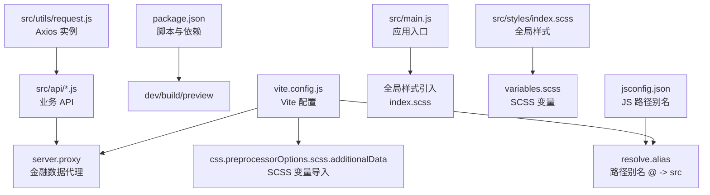
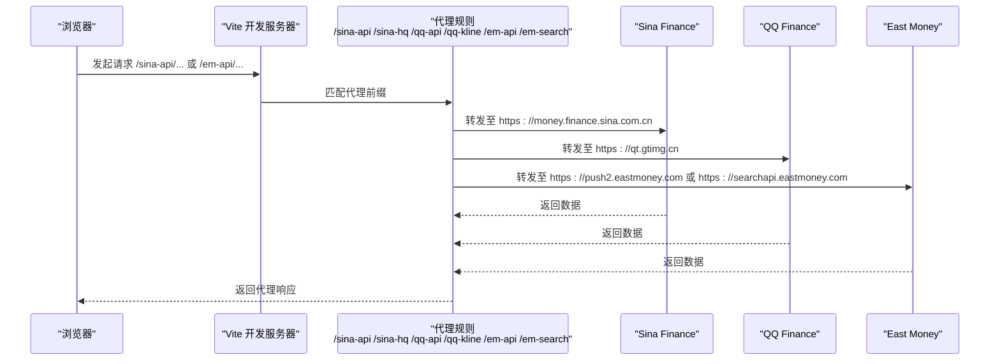
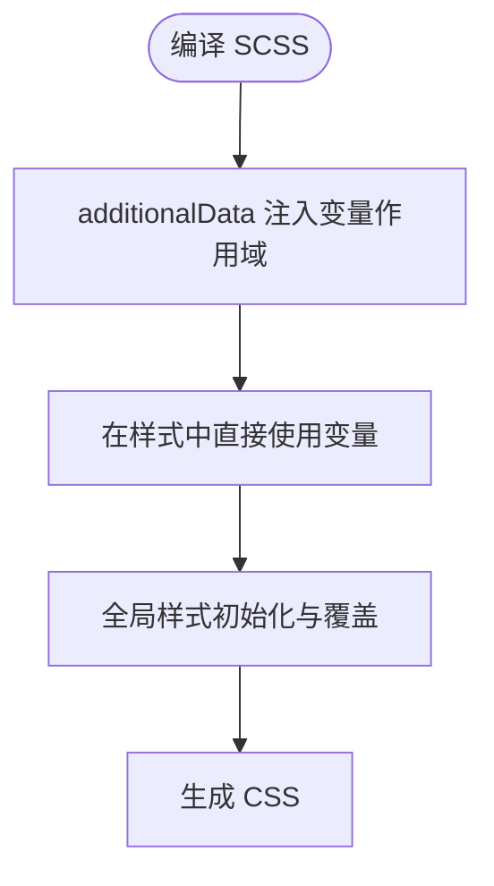
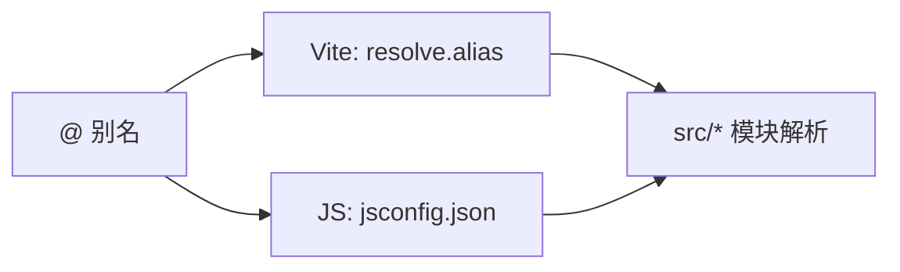
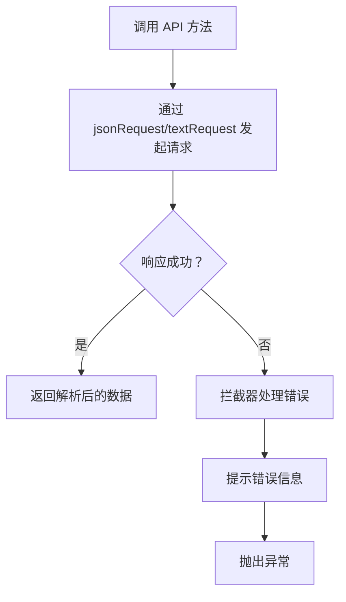
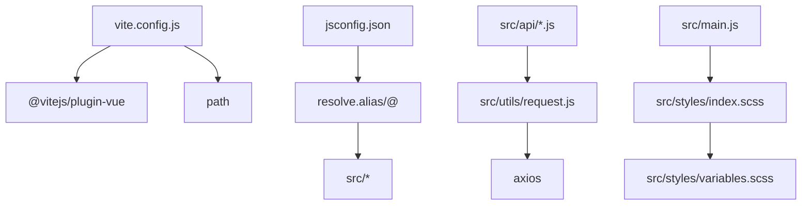

# 构建配置

<cite>
**本文引用的文件**
- [vite.config.js](file://vite.config.js)
- [package.json](file://package.json)
- [jsconfig.json](file://jsconfig.json)
- [src/styles/index.scss](file://src/styles/index.scss)
- [src/styles/variables.scss](file://src/styles/variables.scss)
- [src/utils/request.js](file://src/utils/request.js)
- [src/api/kline.js](file://src/api/kline.js)
- [src/api/realtime.js](file://src/api/realtime.js)
- [src/api/market.js](file://src/api/market.js)
- [src/api/search.js](file://src/api/search.js)
- [src/main.js](file://src/main.js)
</cite>

## 更新摘要
**变更内容**
- 优化了代理配置，新增了安全证书处理和QQ K线数据源支持
- 增强了请求封装的错误处理机制
- 完善了API层的功能实现，包括备用方案和批量处理
- 更新了开发服务器配置和代理规则
- **新增CSS预处理器配置**：添加了SCSS变量导入功能，支持在样式中直接使用变量

## 目录
1. [简介](#简介)
2. [项目结构](#项目结构)
3. [核心组件](#核心组件)
4. [架构总览](#架构总览)
5. [详细组件分析](#详细组件分析)
6. [依赖关系分析](#依赖关系分析)
7. [性能考虑](#性能考虑)
8. [故障排查指南](#故障排查指南)
9. [结论](#结论)
10. [附录](#附录)

## 简介
本文件面向量化交易平台的前端工程，系统性梳理 Vite 构建配置与相关开发/运行机制，重点覆盖：
- 开发服务器与端口、自动打开浏览器等开发体验配置
- 金融数据 API 代理（Sina Finance、QQ Finance、East Money）及 Referer 头配置
- CSS 预处理器（SCSS）变量导入与全局样式设置
- 路径别名（@ 指向 src）在 Vite 与 JS 配置中的协同
- 构建优化（代码分割、资源压缩、缓存策略）与开发/生产差异

## 项目结构
该工程采用 Vue 3 + Vite 的现代前端架构，核心目录与文件如下：
- 构建配置：vite.config.js
- 包管理与脚本：package.json
- 路径别名：jsconfig.json
- 样式体系：src/styles/variables.scss、src/styles/index.scss
- 请求封装：src/utils/request.js
- API 层：src/api/*.js（K线、实时行情、市场、搜索）
- 应用入口：src/main.js

**图表来源**
- [vite.config.js:1-66](file://vite.config.js#L1-L66)
- [package.json:1-28](file://package.json#L1-L28)
- [jsconfig.json:1-12](file://jsconfig.json#L1-L12)
- [src/main.js:1-17](file://src/main.js#L1-L17)
- [src/styles/index.scss:1-64](file://src/styles/index.scss#L1-L64)
- [src/styles/variables.scss:1-24](file://src/styles/variables.scss#L1-L24)
- [src/utils/request.js:1-29](file://src/utils/request.js#L1-L29)
- [src/api/kline.js:1-55](file://src/api/kline.js#L1-L55)
- [src/api/realtime.js:1-56](file://src/api/realtime.js#L1-L56)
- [src/api/market.js:1-188](file://src/api/market.js#L1-L188)
- [src/api/search.js:1-38](file://src/api/search.js#L1-L38)

**章节来源**
- [vite.config.js:1-66](file://vite.config.js#L1-L66)
- [package.json:1-28](file://package.json#L1-L28)
- [jsconfig.json:1-12](file://jsconfig.json#L1-L12)
- [src/main.js:1-17](file://src/main.js#L1-L17)
- [src/styles/index.scss:1-64](file://src/styles/index.scss#L1-L64)
- [src/styles/variables.scss:1-24](file://src/styles/variables.scss#L1-L24)
- [src/utils/request.js:1-29](file://src/utils/request.js#L1-L29)
- [src/api/kline.js:1-55](file://src/api/kline.js#L1-L55)
- [src/api/realtime.js:1-56](file://src/api/realtime.js#L1-L56)
- [src/api/market.js:1-188](file://src/api/market.js#L1-L188)
- [src/api/search.js:1-38](file://src/api/search.js#L1-L38)

## 核心组件
- Vite 构建配置：定义插件、路径别名、开发服务器、代理、CSS 预处理等
- 路径别名：统一通过 @ 指向 src，提升模块导入可读性与一致性
- 金融数据代理：针对 Sina、QQ、East Money 的跨域访问与 Referer 校验
- SCSS 全局样式：变量集中管理与全局样式初始化
- 请求封装：Axios 实例化与拦截器，统一错误处理
- API 层：以代理前缀抽象真实上游接口，便于切换与测试

**章节来源**
- [vite.config.js:1-66](file://vite.config.js#L1-L66)
- [jsconfig.json:1-12](file://jsconfig.json#L1-L12)
- [src/styles/index.scss:1-64](file://src/styles/index.scss#L1-L64)
- [src/styles/variables.scss:1-24](file://src/styles/variables.scss#L1-L24)
- [src/utils/request.js:1-29](file://src/utils/request.js#L1-L29)
- [src/api/kline.js:1-55](file://src/api/kline.js#L1-L55)
- [src/api/realtime.js:1-56](file://src/api/realtime.js#L1-L56)
- [src/api/market.js:1-188](file://src/api/market.js#L1-L188)
- [src/api/search.js:1-38](file://src/api/search.js#L1-L38)

## 架构总览
下图展示从浏览器到金融数据源的请求链路，以及本地开发代理如何绕过跨域限制与 Referer 校验。

**图表来源**
- [vite.config.js:15-55](file://vite.config.js#L15-L55)
- [src/api/kline.js:11](file://src/api/kline.js#L11)
- [src/api/realtime.js:42](file://src/api/realtime.js#L42)
- [src/api/market.js:16](file://src/api/market.js#L16)
- [src/api/search.js:11](file://src/api/search.js#L11)

## 详细组件分析

### 开发服务器与端口配置
- 端口：开发服务器默认监听端口为 3001
- 自动打开浏览器：启动后自动在默认浏览器中打开页面
- 插件：启用 Vue 官方插件以支持单文件组件与热更新

这些配置直接影响开发体验与调试效率，建议在团队内保持一致。

**章节来源**
- [vite.config.js:12-15](file://vite.config.js#L12-L15)

### 代理配置（金融数据 API）
为规避跨域与 Referer 校验，配置了多条代理规则，分别对应不同金融数据源：
- Sina Finance K线与行情
  - 前缀：/sina-api
  - 目标：https://money.finance.sina.com.cn
  - Referer：https://finance.sina.com.cn
  - 重写：移除前缀，透传原始路径
- Sina HQ 行情
  - 前缀：/sina-hq
  - 目标：https://hq.sinajs.cn
  - Referer：https://finance.sina.com.cn
  - 重写：移除前缀
- QQ Finance
  - 前缀：/qq-api
  - 目标：https://qt.gtimg.cn
  - 重写：移除前缀
- **QQ K线数据**
  - 前缀：/qq-kline
  - 目标：https://web.ifzq.gtimg.cn
  - 重写：移除前缀
- East Money 推送
  - 前缀：/em-api
  - 目标：https://push2.eastmoney.com
  - 重写：移除前缀
  - **安全配置**：secure: false（允许非HTTPS连接）
- East Money 搜索
  - 前缀：/em-search
  - 目标：https://searchapi.eastmoney.com
  - Referer：https://www.eastmoney.com
  - 重写：移除前缀

使用方式：在 API 层以代理前缀发起请求，Vite 将自动转发到目标域名，并注入必要的 Referer 头。

**更新** 新增了 QQ K线数据源的代理配置，支持腾讯财经的K线数据获取；优化了东方财富代理的安全配置

**章节来源**
- [vite.config.js:15-55](file://vite.config.js#L15-L55)
- [src/api/kline.js:11](file://src/api/kline.js#L11)
- [src/api/realtime.js:42](file://src/api/realtime.js#L42)
- [src/api/market.js:16](file://src/api/market.js#L16)
- [src/api/search.js:11](file://src/api/search.js#L11)

### CSS 预处理器与全局样式
- **SCSS 变量导入**：通过 additionalData 在编译阶段注入变量作用域，无需在每个组件重复导入
- 全局样式：统一初始化、滚动条、Element Plus 组件覆盖等
- 变量定义：颜色、字号、边框、布局尺寸等主题变量集中维护

**图表来源**
- [vite.config.js:58-64](file://vite.config.js#L58-L64)
- [src/styles/index.scss:1-64](file://src/styles/index.scss#L1-L64)
- [src/styles/variables.scss:1-24](file://src/styles/variables.scss#L1-L24)

**章节来源**
- [vite.config.js:58-64](file://vite.config.js#L58-L64)
- [src/styles/index.scss:1-64](file://src/styles/index.scss#L1-L64)
- [src/styles/variables.scss:1-24](file://src/styles/variables.scss#L1-L24)

### 路径别名配置（@ -> src）
- Vite 层：通过 resolve.alias 将 @ 映射到 src 目录，便于在组件与工具中统一使用相对路径
- JS 层：jsconfig.json 同步配置，确保编辑器与 TS/JS 解析器识别别名

**图表来源**
- [vite.config.js:7-11](file://vite.config.js#L7-L11)
- [jsconfig.json:6-8](file://jsconfig.json#L6-L8)

**章节来源**
- [vite.config.js:7-11](file://vite.config.js#L7-L11)
- [jsconfig.json:6-8](file://jsconfig.json#L6-L8)

### 请求封装与错误处理
- Axios 实例：
  - jsonRequest：JSON 响应类型，用于 Sina K线、EM 推送等
  - textRequest：文本响应类型，用于 Sina 行情文本解析
- 超时与响应类型：统一超时时间与响应类型
- 错误拦截：统一提示网络错误、超时、服务端错误信息

**图表来源**
- [src/utils/request.js:1-29](file://src/utils/request.js#L1-L29)
- [src/api/kline.js:11](file://src/api/kline.js#L11)
- [src/api/realtime.js:42](file://src/api/realtime.js#L42)
- [src/api/market.js:16](file://src/api/market.js#L16)
- [src/api/search.js:11](file://src/api/search.js#L11)

**章节来源**
- [src/utils/request.js:1-29](file://src/utils/request.js#L1-L29)
- [src/api/kline.js:1-55](file://src/api/kline.js#L1-L55)
- [src/api/realtime.js:1-56](file://src/api/realtime.js#L1-L56)
- [src/api/market.js:1-188](file://src/api/market.js#L1-L188)
- [src/api/search.js:1-38](file://src/api/search.js#L1-L38)

### 构建优化与开发/生产差异
- 代码分割：Vite 默认对动态导入进行代码分割；可通过路由懒加载进一步优化首屏
- 资源压缩：生产构建自动启用 JS/CSS 压缩与 HTML 压缩
- 缓存策略：生产构建输出带内容哈希的静态资源，利于浏览器缓存
- 开发 vs 生产：
  - 开发：启用热更新、SourceMap、严格模式
  - 生产：最小化、Tree-shaking、产物体积分析（可选）

说明：本仓库未显式配置 rollupOptions/define 等高级优化项，建议在 CI 中开启产物分析与缓存策略验证。

**章节来源**
- [package.json:6-10](file://package.json#L6-L10)
- [vite.config.js:1-66](file://vite.config.js#L1-L66)

## 依赖关系分析
- Vite 配置依赖 Vue 插件与 Node 路径模块
- 路径别名同时服务于 Vite 与 JS 解析器
- API 层依赖请求封装，请求封装依赖 Axios
- 样式层依赖 SCSS 与变量文件

**图表来源**
- [vite.config.js:1-66](file://vite.config.js#L1-L66)
- [jsconfig.json:1-12](file://jsconfig.json#L1-L12)
- [src/utils/request.js:1-29](file://src/utils/request.js#L1-L29)
- [src/api/kline.js:1-55](file://src/api/kline.js#L1-L55)
- [src/api/realtime.js:1-56](file://src/api/realtime.js#L1-L56)
- [src/api/market.js:1-188](file://src/api/market.js#L1-L188)
- [src/api/search.js:1-38](file://src/api/search.js#L1-L38)
- [src/styles/index.scss:1-64](file://src/styles/index.scss#L1-L64)
- [src/styles/variables.scss:1-24](file://src/styles/variables.scss#L1-L24)
- [src/main.js:1-17](file://src/main.js#L1-L17)

## 性能考虑
- 代理层避免跨域与 Referer 校验，减少网络往返与失败重试
- Axios 统一超时与错误处理，降低异常对用户体验的影响
- **SCSS 变量集中管理，减少重复计算与编译开销**
- 建议在生产构建中启用产物分析与缓存策略验证，持续优化首屏加载

## 故障排查指南
- 代理不生效
  - 检查请求路径是否以代理前缀开头
  - 确认 Vite 开发服务器已启动且端口为 3001
- Referer 校验失败
  - 确认代理规则中已配置正确的 Referer 头
  - 检查上游域名与路径是否匹配
- 路径别名无效
  - 确认 Vite 与 JS 配置均包含 @ 到 src 的映射
- **样式变量未生效**
  - 确认 additionalData 已正确注入变量作用域
  - 检查变量命名与拼写
- 请求超时或网络错误
  - 检查超时时间与网络连通性
  - 查看拦截器错误提示与控制台日志
- **安全证书问题**
  - 检查 /em-api 代理的 secure: false 配置
  - 确认开发环境下的 HTTPS/HTTP 混合内容处理

**章节来源**
- [vite.config.js:12-15](file://vite.config.js#L12-L15)
- [vite.config.js:15-55](file://vite.config.js#L15-L55)
- [vite.config.js:58-64](file://vite.config.js#L58-L64)
- [jsconfig.json:6-8](file://jsconfig.json#L6-L8)
- [src/utils/request.js:17-25](file://src/utils/request.js#L17-L25)

## 结论
本构建配置围绕"易用、稳定、可扩展"的目标设计：通过合理的代理与别名配置，简化金融数据接入；通过 SCSS 变量与全局样式，统一视觉与交互体验；通过清晰的请求封装与错误处理，提升开发效率与稳定性。新增的 QQ K线数据源代理和优化的代理配置进一步丰富了平台的数据获取能力，**新增的CSS预处理器配置使得样式开发更加高效和一致**，建议在后续迭代中结合 CI 进一步完善构建产物分析与缓存策略验证。

## 附录
- 开发命令：dev（启动开发服务器）、build（生产构建）、preview（预览构建产物）
- 依赖：Vue 3、Vue Router、Pinia、Axios、Element Plus、ECharts、Day.js、NProgress
- **SCSS 依赖**：sass

**章节来源**
- [package.json:6-26](file://package.json#L6-L26)