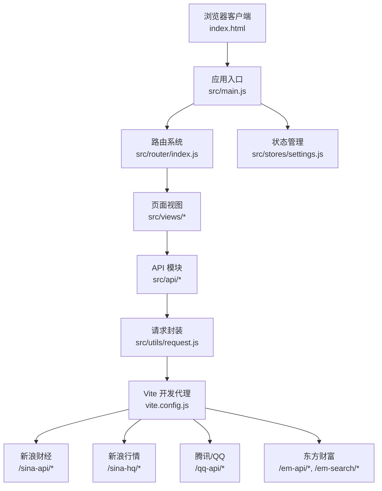
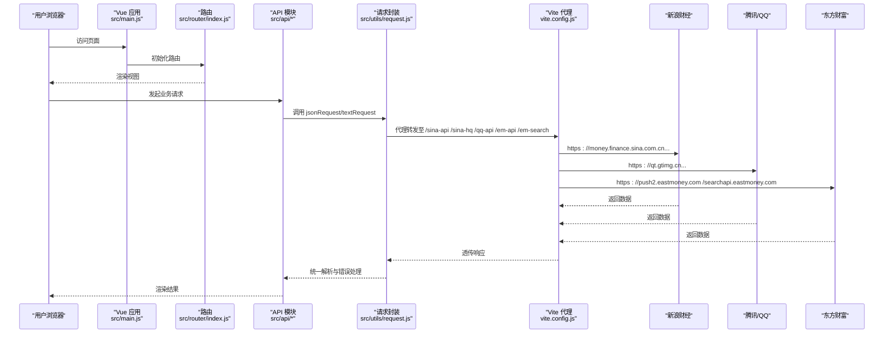
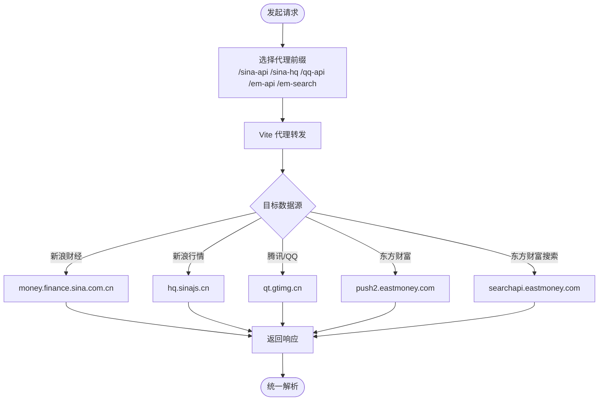
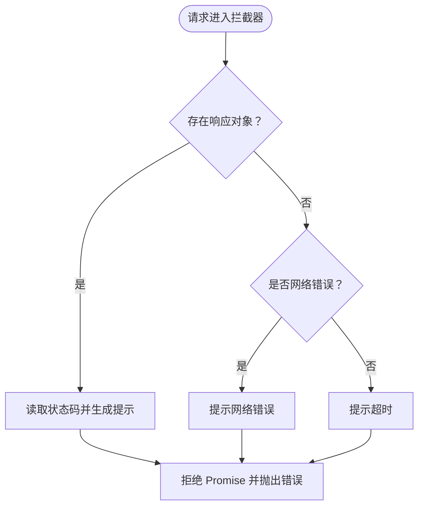
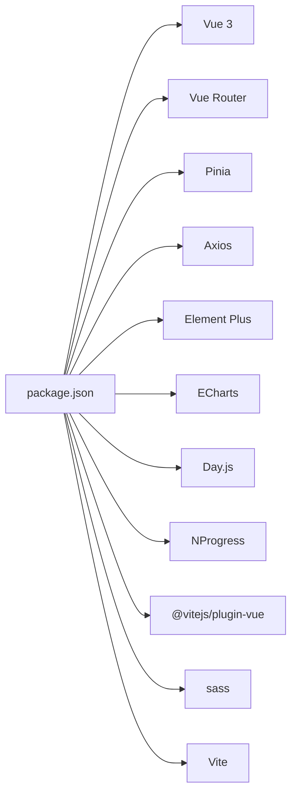

# 环境管理

<cite>
**本文引用的文件**
- [package.json](file://package.json)
- [vite.config.js](file://vite.config.js)
- [index.html](file://index.html)
- [src/main.js](file://src/main.js)
- [src/router/index.js](file://src/router/index.js)
- [src/utils/request.js](file://src/utils/request.js)
- [src/api/index.js](file://src/api/index.js)
- [src/api/kline.js](file://src/api/kline.js)
- [src/api/realtime.js](file://src/api/realtime.js)
- [src/api/market.js](file://src/api/market.js)
- [src/api/search.js](file://src/api/search.js)
- [src/utils/constants.js](file://src/utils/constants.js)
- [src/utils/storage.js](file://src/utils/storage.js)
- [src/stores/settings.js](file://src/stores/settings.js)
</cite>

## 目录
1. [简介](#简介)
2. [项目结构](#项目结构)
3. [核心组件](#核心组件)
4. [架构总览](#架构总览)
5. [详细组件分析](#详细组件分析)
6. [依赖分析](#依赖分析)
7. [性能考虑](#性能考虑)
8. [故障排查指南](#故障排查指南)
9. [结论](#结论)
10. [附录](#附录)

## 简介
本文件面向量化交易平台的前端工程，系统化梳理环境管理与配置体系，覆盖以下主题：
- 环境变量与构建配置：开发、测试、生产三类环境的变量设置与差异策略
- API 端点配置：多金融数据源的 API 密钥管理与切换机制
- 域名与路径配置：相对路径、绝对路径、代理前缀等
- 配置文件管理最佳实践：敏感信息保护、配置模板、环境差异化配置与版本控制策略
- 配置验证与错误处理机制：统一的请求拦截与错误提示

## 项目结构
前端采用 Vite + Vue 3 架构，API 层通过 Axios 封装两类请求实例（JSON 与文本），并以 Vite 本地开发服务器代理到多家金融数据源。

图表来源
- [index.html:1-14](file://index.html#L1-L14)
- [src/main.js:1-17](file://src/main.js#L1-L17)
- [src/router/index.js:1-58](file://src/router/index.js#L1-L58)
- [src/api/index.js:1-5](file://src/api/index.js#L1-L5)
- [src/utils/request.js:1-29](file://src/utils/request.js#L1-L29)
- [vite.config.js:1-63](file://vite.config.js#L1-L63)

章节来源
- [index.html:1-14](file://index.html#L1-L14)
- [src/main.js:1-17](file://src/main.js#L1-L17)
- [src/router/index.js:1-58](file://src/router/index.js#L1-L58)
- [vite.config.js:1-63](file://vite.config.js#L1-L63)

## 核心组件
- 构建与运行脚本：通过包管理脚本启动开发服务器、构建产物与预览
- 本地开发代理：集中配置多个金融数据源的代理规则，统一使用代理前缀
- 请求封装：基于 Axios 的 JSON 与文本两类请求实例，内置统一错误处理
- API 模块：按功能拆分 K 线、实时行情、市场与搜索接口，统一走代理路径
- 路由与页面：基于 Vue Router 的单页应用路由，页面按需加载
- 设置与存储：Pinia Store 管理用户偏好，localStorage 本地持久化

章节来源
- [package.json:1-28](file://package.json#L1-L28)
- [vite.config.js:1-63](file://vite.config.js#L1-L63)
- [src/utils/request.js:1-29](file://src/utils/request.js#L1-L29)
- [src/api/index.js:1-5](file://src/api/index.js#L1-L5)
- [src/router/index.js:1-58](file://src/router/index.js#L1-L58)
- [src/stores/settings.js:1-70](file://src/stores/settings.js#L1-L70)
- [src/utils/storage.js:1-21](file://src/utils/storage.js#L1-L21)

## 架构总览
下图展示从浏览器到金融数据源的完整链路，强调代理前缀与数据源的映射关系。

图表来源
- [src/main.js:1-17](file://src/main.js#L1-L17)
- [src/router/index.js:1-58](file://src/router/index.js#L1-L58)
- [src/api/kline.js:1-27](file://src/api/kline.js#L1-L27)
- [src/api/realtime.js:1-56](file://src/api/realtime.js#L1-L56)
- [src/api/market.js:1-46](file://src/api/market.js#L1-L46)
- [src/api/search.js:1-38](file://src/api/search.js#L1-L38)
- [src/utils/request.js:1-29](file://src/utils/request.js#L1-L29)
- [vite.config.js:1-63](file://vite.config.js#L1-L63)

## 详细组件分析

### 环境变量与构建配置
- 开发环境
  - 本地开发服务器端口与自动打开浏览器
  - 代理规则集中定义，便于在开发阶段屏蔽真实密钥
- 测试/生产环境
  - 构建产物通过 Vite 输出，部署于静态服务器
  - 代理仅在开发阶段生效；生产环境应将 API 地址指向实际服务端或 CDN

建议
- 使用环境变量区分不同环境（如 VITE_API_BASE）并在构建时注入
- 生产环境禁止暴露任何金融数据源密钥，统一通过自有服务端中转

章节来源
- [vite.config.js:12-54](file://vite.config.js#L12-L54)
- [package.json:6-10](file://package.json#L6-L10)

### API 端点配置与密钥管理
- 代理前缀与目标映射
  - /sina-api → 新浪财经行情数据
  - /sina-hq → 新浪实时行情文本
  - /qq-api → 腾讯/QQ 股票数据
  - /em-api → 东方财富行情
  - /em-search → 东方财富搜索
- 密钥管理与切换机制
  - 当前实现未直接使用密钥，而是通过代理转发
  - 若未来接入需要密钥的接口，建议：
    - 在 Vite 环境变量中注入密钥（开发/测试/生产）
    - 通过服务端统一鉴权与转发，避免前端泄露
    - 提供配置开关，支持多数据源并行或降级

图表来源
- [vite.config.js:15-52](file://vite.config.js#L15-L52)
- [src/api/kline.js:10-13](file://src/api/kline.js#L10-L13)
- [src/api/realtime.js:42-43](file://src/api/realtime.js#L42-L43)
- [src/api/market.js:16-28](file://src/api/market.js#L16-L28)
- [src/api/search.js:11-17](file://src/api/search.js#L11-L17)

章节来源
- [vite.config.js:15-52](file://vite.config.js#L15-L52)
- [src/api/kline.js:10-13](file://src/api/kline.js#L10-L13)
- [src/api/realtime.js:42-43](file://src/api/realtime.js#L42-L43)
- [src/api/market.js:16-28](file://src/api/market.js#L16-L28)
- [src/api/search.js:11-17](file://src/api/search.js#L11-L17)

### 域名与路径配置
- 相对路径与绝对路径
  - API 请求使用以“/”开头的相对路径，结合代理前缀统一转发
  - 静态资源通过 Vite 自动处理，入口 HTML 中通过模块入口加载
- 代理前缀设计
  - 以“/sina-api”“/sina-hq”“/qq-api”“/em-api”“/em-search”作为统一前缀，便于维护与扩展
- 路由与页面
  - 路由基于 History 模式，页面按需异步加载，利于首屏优化

章节来源
- [src/api/kline.js:10-13](file://src/api/kline.js#L10-L13)
- [src/api/realtime.js:42-43](file://src/api/realtime.js#L42-L43)
- [src/api/market.js:16-28](file://src/api/market.js#L16-L28)
- [src/api/search.js:11-17](file://src/api/search.js#L11-L17)
- [src/router/index.js:42-45](file://src/router/index.js#L42-L45)
- [index.html:11-11](file://index.html#L11-L11)
- [src/main.js:10-16](file://src/main.js#L10-L16)

### 配置文件管理最佳实践
- 敏感信息保护
  - 不在前端直接暴露金融数据源密钥
  - 通过服务端统一鉴权与转发，前端仅使用代理前缀
- 配置模板
  - 为不同环境准备模板文件（如 .env.development、.env.test、.env.production）
  - 在模板中定义默认值，避免在仓库中提交真实密钥
- 环境差异化配置
  - 通过 Vite 环境变量注入 API 基础地址与开关
  - 支持在构建时替换，实现开发/测试/生产的无缝切换
- 版本控制策略
  - 将模板文件纳入版本控制，真实密钥放入 .gitignore
  - 使用分支或子模块隔离不同环境配置

章节来源
- [vite.config.js:12-54](file://vite.config.js#L12-L54)
- [package.json:6-10](file://package.json#L6-L10)

### 配置验证与错误处理机制
- 请求拦截与错误提示
  - 统一的响应拦截器对错误进行分类处理，并通过消息组件提示
  - 对网络错误与超时进行明确提示，提升用户体验
- 错误处理流程
  - 网络错误：提示“网络错误，请检查网络连接”
  - 超时/异常：提示“请求超时，请稍后重试”
  - 其他：根据响应状态码生成可读提示

图表来源
- [src/utils/request.js:17-28](file://src/utils/request.js#L17-L28)

章节来源
- [src/utils/request.js:1-29](file://src/utils/request.js#L1-L29)

## 依赖分析
- 运行时依赖
  - Vue 3、Vue Router、Pinia、Axios、Element Plus、ECharts、Day.js、NProgress
- 开发依赖
  - Vite、@vitejs/plugin-vue、sass
- 关键耦合点
  - API 模块依赖请求封装
  - 路由与页面依赖状态管理与 UI 组件库
  - 开发代理依赖 Vite 配置

图表来源
- [package.json:11-26](file://package.json#L11-L26)

章节来源
- [package.json:1-28](file://package.json#L1-L28)

## 性能考虑
- 代理转发的延迟
  - 本地开发阶段代理会引入额外往返，建议在生产环境直连服务端或 CDN
- 按需加载与懒路由
  - 页面组件按需加载，减少首屏体积
- 图表与指标计算
  - 合理限制请求频率与数据量，避免频繁刷新导致性能问题

## 故障排查指南
- 代理无法访问
  - 检查 Vite 代理配置与目标站点可达性
  - 确认代理前缀与 API 调用一致
- 网络错误或超时
  - 查看拦截器错误提示，确认网络状态与超时时间
- 数据为空或格式异常
  - 核对目标站点返回字段与解析逻辑
- 路由跳转异常
  - 检查路由配置与页面组件导入路径

章节来源
- [vite.config.js:15-52](file://vite.config.js#L15-L52)
- [src/utils/request.js:17-28](file://src/utils/request.js#L17-L28)
- [src/api/realtime.js:7-33](file://src/api/realtime.js#L7-L33)
- [src/router/index.js:47-55](file://src/router/index.js#L47-L55)

## 结论
本项目通过 Vite 代理与 Axios 封装实现了清晰的 API 路由与错误处理机制。建议在后续迭代中完善环境变量与密钥管理策略，统一通过服务端鉴权与转发，确保生产环境的安全与稳定。

## 附录
- 常用配置项清单
  - 本地开发端口：3001
  - 代理前缀：/sina-api、/sina-hq、/qq-api、/em-api、/em-search
  - 请求超时：15000ms
  - UI 主题：Element Plus 中文语言包

章节来源
- [vite.config.js:12-14](file://vite.config.js#L12-L14)
- [src/utils/request.js:6-8](file://src/utils/request.js#L6-L8)
- [src/main.js:3-3](file://src/main.js#L3-L3)