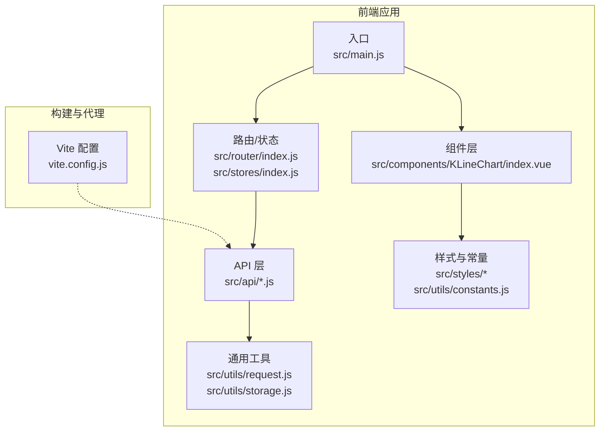
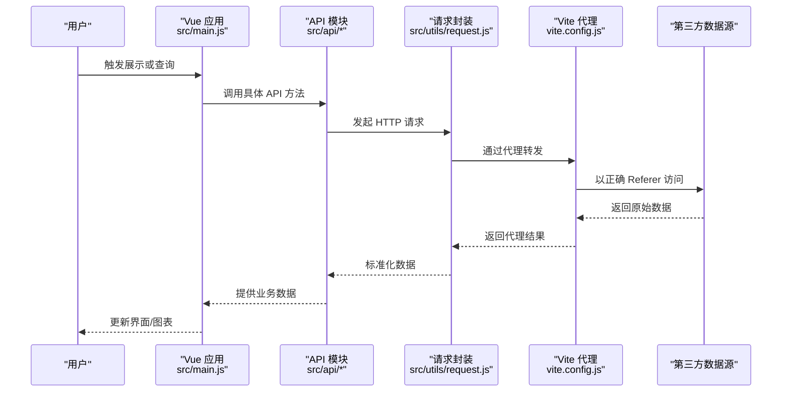
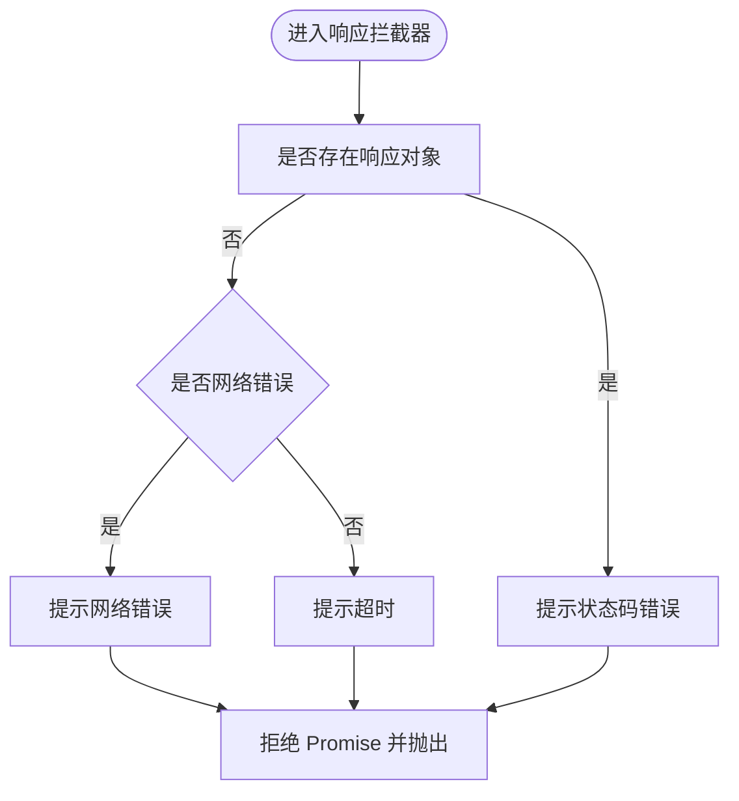
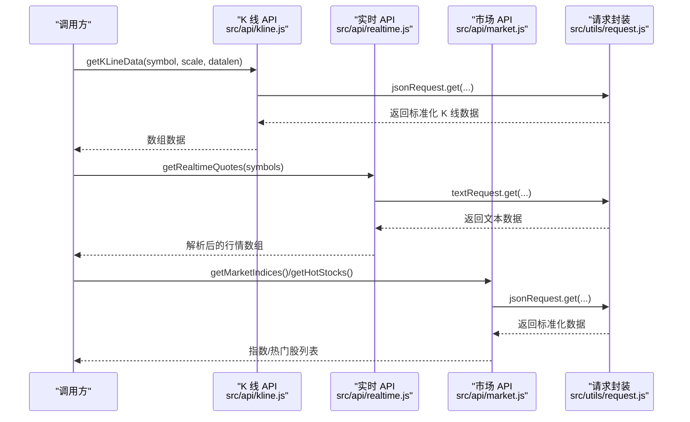
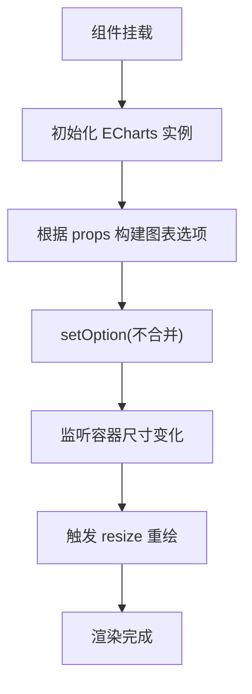
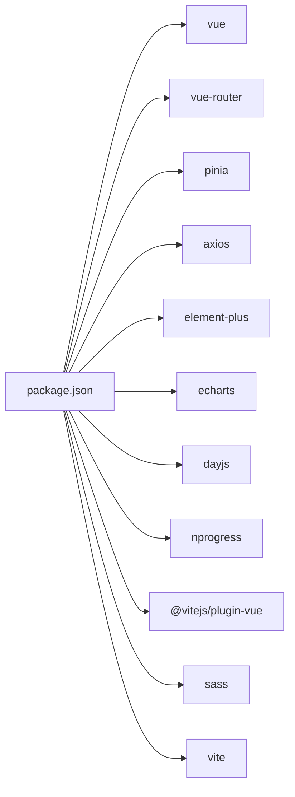

# 监控维护

<cite>
**本文引用的文件**
- [src/main.js](file://src/main.js)
- [src/utils/request.js](file://src/utils/request.js)
- [src/api/index.js](file://src/api/index.js)
- [src/api/kline.js](file://src/api/kline.js)
- [src/api/realtime.js](file://src/api/realtime.js)
- [src/api/market.js](file://src/api/market.js)
- [vite.config.js](file://vite.config.js)
- [package.json](file://package.json)
- [src/utils/constants.js](file://src/utils/constants.js)
- [src/utils/storage.js](file://src/utils/storage.js)
- [src/stores/index.js](file://src/stores/index.js)
- [src/stores/screening.js](file://src/stores/screening.js)
- [src/components/KLineChart/index.vue](file://src/components/KLineChart/index.vue)
- [src/App.vue](file://src/App.vue)
</cite>

## 目录
1. [简介](#简介)
2. [项目结构](#项目结构)
3. [核心组件](#核心组件)
4. [架构总览](#架构总览)
5. [详细组件分析](#详细组件分析)
6. [依赖分析](#依赖分析)
7. [性能考虑](#性能考虑)
8. [故障排查指南](#故障排查指南)
9. [结论](#结论)
10. [附录](#附录)

## 简介
本文件面向量化交易平台的监控与运维，围绕应用性能监控、日志与错误追踪、系统健康检查、缓存策略监控、安全监控以及故障预警与自动恢复等方面，结合现有代码实现进行系统化梳理与改进建议。目标是帮助开发与运维团队建立可落地的监控体系，保障平台在高并发、多数据源场景下的稳定性与可观测性。

## 项目结构
项目采用 Vue 3 + Vite 架构，前端通过 Axios 发起对多家第三方数据源的请求，并使用 ECharts 进行可视化展示。构建与代理由 Vite 配置管理，依赖通过 npm 管理。

图表来源
- [src/main.js:1-17](file://src/main.js#L1-L17)
- [src/stores/index.js:1-11](file://src/stores/index.js#L1-L11)
- [src/api/index.js:1-5](file://src/api/index.js#L1-L5)
- [src/utils/request.js:1-29](file://src/utils/request.js#L1-L29)
- [src/components/KLineChart/index.vue:1-285](file://src/components/KLineChart/index.vue#L1-L285)
- [vite.config.js:1-63](file://vite.config.js#L1-L63)

章节来源
- [src/main.js:1-17](file://src/main.js#L1-L17)
- [vite.config.js:1-63](file://vite.config.js#L1-L63)

## 核心组件
- 应用入口与全局注册
  - 入口文件负责挂载应用、注册路由、状态管理与 UI 组件库。
- 请求封装与拦截器
  - 通过 Axios 创建 JSON 与文本两类请求实例，统一设置超时与响应处理；错误提示通过消息组件反馈。
- API 模块
  - K 线、实时行情、市场指数与热门股等接口模块，统一调用请求封装。
- 构建与代理
  - Vite 配置集中代理多个第三方数据源，便于本地开发调试。
- 可视化组件
  - K 线图表组件基于 ECharts，负责渲染与交互。
- 状态与存储
  - Pinia 状态管理与本地存储封装，用于筛选与缓存策略支持。

章节来源
- [src/main.js:1-17](file://src/main.js#L1-L17)
- [src/utils/request.js:1-29](file://src/utils/request.js#L1-L29)
- [src/api/index.js:1-5](file://src/api/index.js#L1-L5)
- [src/api/kline.js:1-27](file://src/api/kline.js#L1-L27)
- [src/api/realtime.js:1-56](file://src/api/realtime.js#L1-L56)
- [src/api/market.js:1-46](file://src/api/market.js#L1-L46)
- [vite.config.js:1-63](file://vite.config.js#L1-L63)
- [src/components/KLineChart/index.vue:1-285](file://src/components/KLineChart/index.vue#L1-L285)
- [src/stores/index.js:1-11](file://src/stores/index.js#L1-L11)
- [src/utils/storage.js:1-21](file://src/utils/storage.js#L1-L21)

## 架构总览
前端通过 Axios 向代理后的第三方数据源发起请求，API 模块负责数据解析与转换，状态管理与本地存储负责数据持久化与筛选逻辑，ECharts 负责可视化呈现。构建阶段通过 Vite 代理屏蔽跨域与 Referer 限制，提升开发体验。

图表来源
- [src/main.js:1-17](file://src/main.js#L1-L17)
- [src/api/kline.js:1-27](file://src/api/kline.js#L1-L27)
- [src/api/realtime.js:1-56](file://src/api/realtime.js#L1-L56)
- [src/api/market.js:1-46](file://src/api/market.js#L1-L46)
- [src/utils/request.js:1-29](file://src/utils/request.js#L1-L29)
- [vite.config.js:15-52](file://vite.config.js#L15-L52)

## 详细组件分析

### 请求与错误处理（应用性能与错误率基础）
- 统一超时与响应处理
  - JSON 与文本两类请求实例分别针对不同数据格式，统一设置超时与响应类型，避免解析异常导致的未处理错误。
- 错误提示与返回
  - 响应拦截器对错误进行分类提示（网络错误、超时、服务端错误），并通过消息组件反馈给用户，形成基础的错误率统计入口。
- 性能基线
  - 通过统一超时与错误提示，为后续埋点统计“请求耗时”“错误率”“超时率”奠定基础。

图表来源
- [src/utils/request.js:17-28](file://src/utils/request.js#L17-L28)

章节来源
- [src/utils/request.js:1-29](file://src/utils/request.js#L1-L29)

### API 模块（页面加载与 API 响应时间）
- K 线数据
  - 通过代理访问第三方 K 线接口，解析为统一结构，包含时间、开盘、最高、最低、收盘、成交量等字段，便于后续指标计算与图表渲染。
- 实时行情
  - 支持批量解析新浪行情文本，提取关键字段并计算涨跌与幅度，作为实时面板与图表的数据来源。
- 市场指数与热门股
  - 通过东方财富接口获取指数与热门股票列表，统一字段映射，便于大盘视图与筛选功能使用。

图表来源
- [src/api/kline.js:1-27](file://src/api/kline.js#L1-L27)
- [src/api/realtime.js:1-56](file://src/api/realtime.js#L1-L56)
- [src/api/market.js:1-46](file://src/api/market.js#L1-L46)
- [src/utils/request.js:1-29](file://src/utils/request.js#L1-L29)

章节来源
- [src/api/kline.js:1-27](file://src/api/kline.js#L1-L27)
- [src/api/realtime.js:1-56](file://src/api/realtime.js#L1-L56)
- [src/api/market.js:1-46](file://src/api/market.js#L1-L46)

### 可视化组件（页面加载时间与渲染性能）
- 图表初始化与自适应
  - 使用 ECharts 初始化图表，监听容器尺寸变化进行自适应重绘，减少因窗口变化导致的重复渲染。
- 数据更新与渲染
  - 通过响应式属性驱动图表选项重建与增量更新，避免全量重绘带来的性能损耗。
- 交互与缩放
  - 内置数据区域缩放与滑动缩放，优化大数据量下的浏览体验。

图表来源
- [src/components/KLineChart/index.vue:243-276](file://src/components/KLineChart/index.vue#L243-L276)

章节来源
- [src/components/KLineChart/index.vue:1-285](file://src/components/KLineChart/index.vue#L1-L285)

### 状态与存储（缓存策略与数据持久化）
- 本地存储封装
  - 统一前缀的本地存储读写，提供安全的 JSON 解析与异常兜底，适合作为轻量缓存与用户偏好持久化。
- 筛选与交易日逻辑
  - 筛选模块基于本地存储维护筛选清单，包含交易日判断与近期日期生成，有助于减少重复请求与提升首屏性能。

章节来源
- [src/utils/storage.js:1-21](file://src/utils/storage.js#L1-L21)
- [src/stores/screening.js:1-145](file://src/stores/screening.js#L1-L145)

### 构建与代理（跨域与可用性）
- 代理规则
  - 针对多个第三方数据源配置代理，统一设置 Referer 与路径重写，降低跨域与鉴权问题对前端的影响。
- 开发体验
  - 通过代理隐藏真实域名，简化本地联调流程，同时为后续接入网关或反向代理留出空间。

章节来源
- [vite.config.js:15-52](file://vite.config.js#L15-L52)

## 依赖分析
- 运行时依赖
  - Vue 3、Vue Router、Pinia、Axios、Element Plus、ECharts、Day.js、NProgress 等，构成前端核心能力栈。
- 构建与开发依赖
  - Vite、Vue 插件、Sass 等，支撑现代化构建与样式工程化。

图表来源
- [package.json:11-26](file://package.json#L11-L26)

章节来源
- [package.json:1-28](file://package.json#L1-L28)

## 性能考虑
- 页面加载时间
  - 通过 NProgress 提升首屏感知，结合组件懒加载与按需引入第三方库，减少初始包体积。
- API 响应时间
  - 统一超时与错误处理，为后续埋点统计“平均响应时间”“P95/P99 延迟”提供基础。
- 渲染性能
  - 图表组件避免全量重绘，使用增量更新与自适应重绘；合理设置数据量与指标数量，避免过度渲染。
- 缓存策略
  - 结合本地存储与接口缓存（如 CDN/网关缓存）减少重复请求；对高频数据设置合理的过期时间。

## 故障排查指南
- 常见错误与定位
  - 网络错误：检查代理配置与网络连通性；确认 Referer 设置是否正确。
  - 超时错误：评估第三方接口限流与带宽，必要时增加重试与降级策略。
  - 解析异常：核对数据格式变更与正则匹配，确保容错处理。
- 日志与追踪
  - 在请求封装处增加日志采集（请求 URL、参数、耗时、状态码、错误信息），结合错误提示形成基础的错误追踪。
- 可视化与健康检查
  - 将图表渲染耗时与数据更新延迟纳入监控，发现异常及时告警。

章节来源
- [src/utils/request.js:17-28](file://src/utils/request.js#L17-L28)
- [vite.config.js:15-52](file://vite.config.js#L15-L52)

## 结论
当前项目已具备统一的请求封装与错误提示能力，API 模块清晰分离，代理配置简化了跨域与鉴权问题。建议在此基础上补充埋点与日志采集、完善缓存策略与健康检查、强化安全监控与故障预警，从而形成完整的监控维护体系，保障平台在复杂金融场景下的稳定运行。

## 附录

### 监控指标与实施建议（基于现有代码）
- 应用性能监控
  - 页面加载时间：利用 NProgress 与路由守卫统计首屏时间；结合浏览器 Performance API 采集关键指标。
  - API 响应时间：在请求封装中埋点记录请求开始/结束时间与状态码，计算平均值与分位数。
  - 错误率统计：基于拦截器错误分类，统计网络错误、超时、服务端错误占比。
- 日志与错误追踪
  - 前端错误捕获：全局错误处理器记录堆栈与上下文；结合消息提示形成错误事件。
  - 网络请求日志：记录请求 URL、方法、参数、响应体摘要、耗时与错误信息。
  - 用户行为追踪：记录关键操作（切换周期、添加自选、图表交互）与停留时长。
- 系统健康检查
  - API 可用性检测：定时探测代理后的第三方接口可达性与响应时间。
  - 数据源连接状态：对关键数据源设置心跳与断链告警。
  - 缓存有效性检查：校验本地存储与接口缓存一致性，定期清理过期数据。
- 缓存策略监控
  - 浏览器缓存：检查静态资源缓存命中率与版本更新策略。
  - API 缓存：统计接口缓存命中率与过期比例，优化缓存键与 TTL。
  - CDN 缓存：监控边缘节点命中率与回源比例，调整缓存策略。
- 安全监控
  - 跨域请求监控：记录异常 Origin 与 Referer，识别潜在风险。
  - API 访问频率限制：在代理层或网关层设置速率限制与 IP 黑名单。
  - 异常流量检测：基于请求模式与用户行为识别异常流量，触发限流或验证码。
- 故障预警与自动恢复
  - 预警阈值：为页面加载时间、API 延迟、错误率、缓存命中率设定阈值。
  - 自动恢复：对可重试的网络错误与超时执行指数退避重试；对缓存失效触发预热。