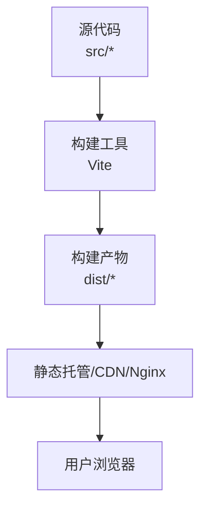
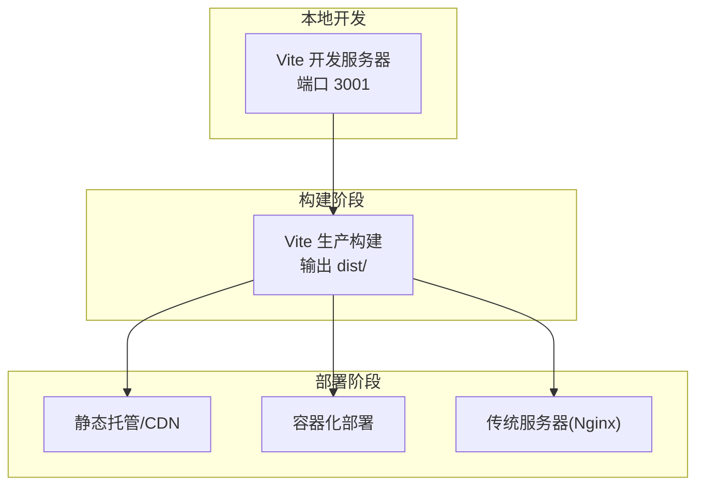
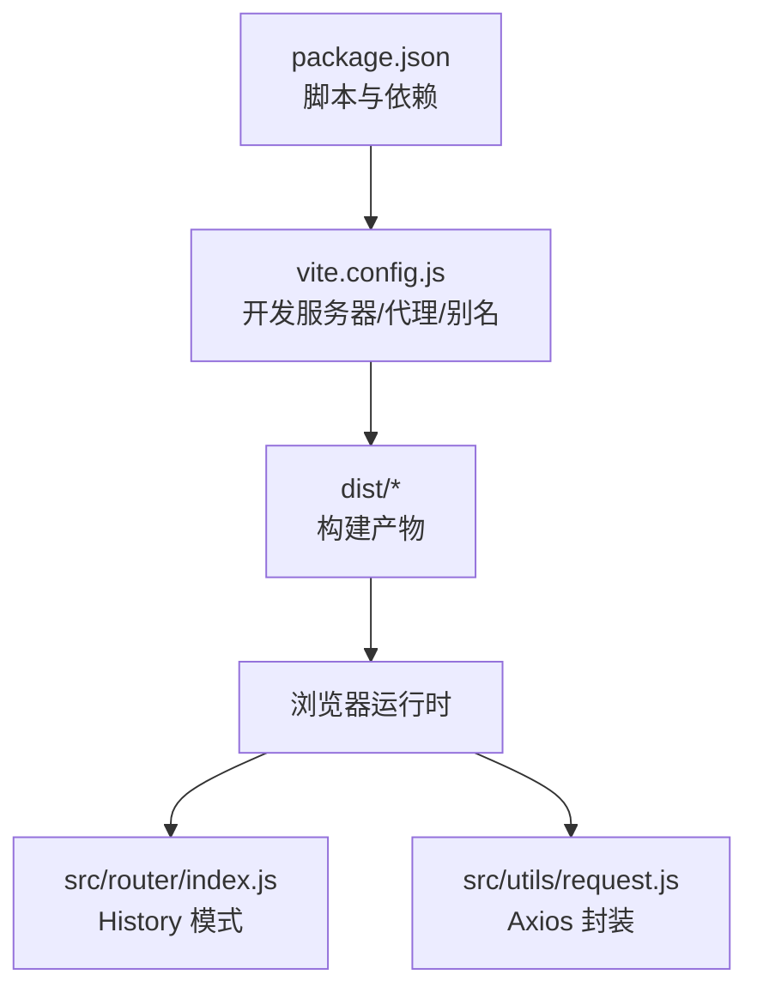
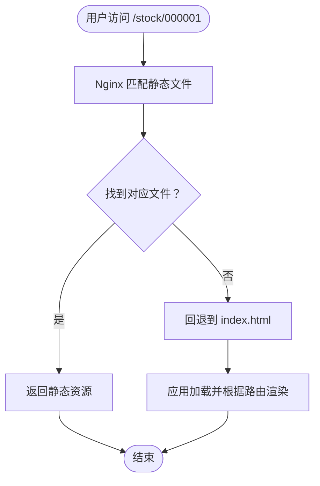
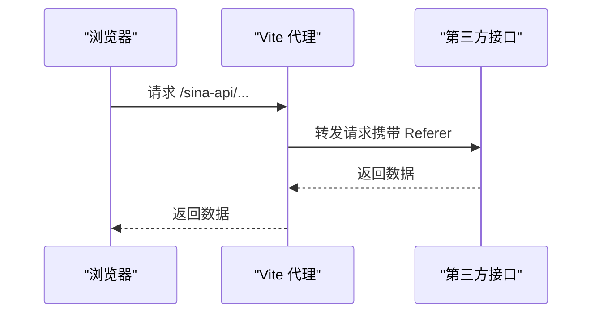

# 部署方式

<cite>
**本文引用的文件**
- [package.json](file://package.json)
- [vite.config.js](file://vite.config.js)
- [index.html](file://index.html)
- [dist/index.html](file://dist/index.html)
- [src/main.js](file://src/main.js)
- [src/router/index.js](file://src/router/index.js)
- [src/utils/request.js](file://src/utils/request.js)
</cite>

## 目录
1. [简介](#简介)
2. [项目结构](#项目结构)
3. [核心组件](#核心组件)
4. [架构总览](#架构总览)
5. [详细组件分析](#详细组件分析)
6. [依赖关系分析](#依赖关系分析)
7. [性能考量](#性能考量)
8. [故障排查指南](#故障排查指南)
9. [结论](#结论)
10. [附录](#附录)

## 简介
本文件面向量化交易平台的多场景部署需求，提供从静态托管到容器化与传统服务器部署的完整指南，并结合项目实际技术栈（Vue 3 + Vite）给出可操作的配置要点、流程图解与自动化建议。内容涵盖：
- 静态托管部署：GitHub Pages、Netlify、Vercel 等平台的部署步骤与配置要求
- CDN 部署方案：静态资源优化、缓存策略、域名配置
- 容器化部署：Docker 镜像构建、容器编排、环境变量配置
- 传统服务器部署：Nginx 反向代理、SSL 证书配置
- 不同部署方式的优缺点对比与选择建议
- 部署脚本示例与自动化部署流程

## 项目结构
该前端项目基于 Vue 3 + Vite 构建，采用单页应用（SPA）模式，路由使用 HTML5 History 模式。构建产物位于 dist 目录，包含入口 HTML 与打包后的资源文件。

**图表来源**
- [vite.config.js:1-63](file://vite.config.js#L1-L63)
- [package.json:6-10](file://package.json#L6-L10)
- [dist/index.html:1-15](file://dist/index.html#L1-L15)

**章节来源**
- [package.json:6-10](file://package.json#L6-L10)
- [vite.config.js:1-63](file://vite.config.js#L1-L63)
- [index.html:1-14](file://index.html#L1-L14)
- [dist/index.html:1-15](file://dist/index.html#L1-L15)

## 核心组件
- 构建与开发服务器
  - 使用 Vite 提供开发服务器与生产构建，支持插件扩展与路径别名配置。
  - 开发服务器端口与代理规则用于访问第三方金融数据接口。
- 应用入口与路由
  - 应用通过 main.js 初始化 Vue 实例、注册路由与状态管理，并挂载到 DOM。
  - 路由采用 History 模式，页面切换使用 NProgress 进度条。
- 请求封装
  - 基于 Axios 的请求实例封装，统一处理超时、网络错误与响应拦截，提升健壮性。

**章节来源**
- [vite.config.js:12-54](file://vite.config.js#L12-L54)
- [src/main.js:1-17](file://src/main.js#L1-L17)
- [src/router/index.js:1-58](file://src/router/index.js#L1-L58)
- [src/utils/request.js:1-29](file://src/utils/request.js#L1-L29)

## 架构总览
下图展示从构建到上线的关键环节，以及不同部署方式的适配点：

**图表来源**
- [vite.config.js:12-54](file://vite.config.js#L12-L54)
- [package.json:6-10](file://package.json#L6-L10)

## 详细组件分析

### 静态托管部署（GitHub Pages / Netlify / Vercel）
适用场景
- 快速上线、零运维成本、全球加速（CDN）
- 无需后端服务，仅需静态资源分发

前置条件
- 已完成本地构建，生成 dist 目录
- 已在目标平台创建仓库或站点

部署步骤（通用流程）
- GitHub Pages
  - 将 dist 目录作为发布分支（如 gh-pages 或 docs），或启用 Pages 功能并指定构建输出目录
  - 配置基础路径（如子路径部署时需要调整）
- Netlify/Vercel
  - 在平台控制台导入仓库，设置构建命令与输出目录
  - 配置环境变量（如 API 域名、功能开关）

配置要点
- 基础路径与路由
  - 若部署在子路径（如 /quant-trading/），需在构建配置中设置 base 路径，确保静态资源与路由正确解析
- CORS 与第三方接口
  - 由于项目使用代理访问第三方金融接口，静态托管环境下需通过平台提供的代理或自建后端转发，避免跨域问题
- 缓存与压缩
  - 启用 Gzip/Brotli 压缩与长期缓存策略，提升加载速度

**章节来源**
- [vite.config.js:12-54](file://vite.config.js#L12-L54)
- [package.json:6-10](file://package.json#L6-L10)

### CDN 部署方案
适用场景
- 大流量、高并发、全球用户访问

方案设计
- 资源优化
  - 使用 Vite 的默认打包策略；必要时开启代码分割与懒加载
  - 对第三方库进行预构建与缓存
- 缓存策略
  - 静态资源采用强缓存（如一年），HTML 采用协商缓存
  - 版本化文件名（由 Vite 自动生成）以实现精准失效
- 域名与证书
  - 自定义域名接入 CDN，配置 HTTPS 证书
  - 针对第三方接口，若仍需跨域访问，建议通过 CDN 的边缘计算或自建网关统一处理

**章节来源**
- [dist/index.html:1-15](file://dist/index.html#L1-L15)
- [vite.config.js:12-54](file://vite.config.js#L12-L54)

### 容器化部署（Docker）
适用场景
- 需要一致的运行环境、快速扩缩容、与后端服务统一编排

镜像构建
- 基础镜像选择精简发行版
- 构建阶段：安装依赖、执行构建命令，产出 dist 目录
- 运行阶段：使用 Nginx 静态服务器提供 dist 目录

容器编排
- 使用 Docker Compose 或 Kubernetes 管理容器生命周期
- 挂载持久化卷（如日志）、配置环境变量（如 API 地址、功能开关）

环境变量配置
- 通过环境变量控制运行时行为（如 API 域名、调试开关）
- 在容器内注入配置文件或通过 Kubernetes ConfigMap/Secret 管理敏感信息

**章节来源**
- [package.json:6-10](file://package.json#L6-L10)
- [vite.config.js:12-54](file://vite.config.js#L12-L54)

### 传统服务器部署（Nginx）
适用场景
- 企业内网或自有服务器，需要精细控制与安全策略

Nginx 配置要点
- 根目录指向 dist 目录
- 静态资源缓存与压缩
- SPA 路由回退：将未匹配的路由重写到 index.html，保证刷新与直连 URL 正常工作
- SSL 证书：申请并配置 HTTPS，启用现代加密套件与安全头

反向代理设置
- 如需访问第三方金融接口，可在 Nginx 中配置上游代理，或通过自建后端服务统一转发

**章节来源**
- [dist/index.html:1-15](file://dist/index.html#L1-L15)
- [src/router/index.js:42-45](file://src/router/index.js#L42-L45)

### 部署脚本示例与自动化流程
构建与发布脚本（示例思路）
- 执行构建命令，生成 dist 目录
- 静态托管：将 dist 目录推送至目标平台（可通过 CI/CD 平台的部署任务）
- 容器化：构建镜像并推送到镜像仓库，再触发编排系统更新
- 传统服务器：通过 rsync 或 SCP 将 dist 目录同步至服务器，重启 Nginx

CI/CD 流程建议
- 触发条件：主分支合并或打标签
- 步骤：安装依赖 → 单元测试（如有） → 构建 → 上传制品 → 部署到目标环境
- 回滚策略：版本化部署与蓝绿/金丝雀发布

**章节来源**
- [package.json:6-10](file://package.json#L6-L10)

## 依赖关系分析
项目前端依赖与构建配置之间的关系如下：

**图表来源**
- [package.json:6-26](file://package.json#L6-L26)
- [vite.config.js:1-63](file://vite.config.js#L1-L63)
- [src/router/index.js:42-45](file://src/router/index.js#L42-L45)
- [src/utils/request.js:1-29](file://src/utils/request.js#L1-L29)

**章节来源**
- [package.json:6-26](file://package.json#L6-L26)
- [vite.config.js:1-63](file://vite.config.js#L1-L63)
- [src/router/index.js:42-45](file://src/router/index.js#L42-L45)
- [src/utils/request.js:1-29](file://src/utils/request.js#L1-L29)

## 性能考量
- 资源加载
  - 利用浏览器缓存与长期缓存策略，减少重复下载
  - 启用压缩（Gzip/Brotli）降低传输体积
- 代码分割
  - 页面级懒加载与按需引入第三方库，缩短首屏时间
- 第三方接口
  - 静态托管环境下避免直接跨域访问，建议通过代理或后端统一转发
- 路由与渲染
  - History 模式配合 Nginx 回退策略，确保刷新与分享链接可用

[本节为通用指导，不直接分析具体文件]

## 故障排查指南
常见问题与定位方法
- 路由 404 或刷新白屏
  - 检查 Nginx 是否正确回退到 index.html
  - 确认构建时的基础路径与部署路径一致
- 跨域与接口失败
  - 静态托管环境需通过代理或后端转发访问第三方接口
  - 核对请求拦截器与错误提示逻辑
- 资源加载异常
  - 检查 dist 输出与资源引用是否正确
  - 确认缓存策略与版本号是否生效

**章节来源**
- [src/router/index.js:42-45](file://src/router/index.js#L42-L45)
- [src/utils/request.js:17-28](file://src/utils/request.js#L17-L28)
- [dist/index.html:1-15](file://dist/index.html#L1-L15)

## 结论
- 静态托管适合快速上线与低成本运维，但受限于跨域与第三方接口访问
- CDN 提供最佳的全球访问体验，需关注缓存与域名配置
- 容器化便于标准化与弹性伸缩，适合与后端服务统一编排
- 传统服务器部署可控性强，适合有安全与合规要求的场景
- 建议结合业务规模与团队能力选择部署方式，并配套完善的 CI/CD 与监控体系

[本节为总结性内容，不直接分析具体文件]

## 附录

### 不同部署方式的优缺点对比与选择建议
- 静态托管（GitHub Pages/Netlify/Vercel）
  - 优点：零运维、全球 CDN、快速上线
  - 缺点：跨域限制、第三方接口需代理
  - 适合：演示站、个人项目、轻量产品
- CDN 部署
  - 优点：极致性能、全球加速、灵活缓存
  - 缺点：成本较高、配置复杂
  - 适合：高并发、全球用户
- 容器化部署
  - 优点：环境一致、易扩展、统一编排
  - 缺点：学习成本、运维投入
  - 适合：微服务架构、DevOps 成熟团队
- 传统服务器部署（Nginx）
  - 优点：可控性强、安全策略完善
  - 缺点：运维成本高、弹性差
  - 适合：内网系统、合规要求高的场景

[本节为概念性内容，不直接分析具体文件]

### 关键流程图与时序图

SPA 路由与回退流程（Nginx）

**图表来源**
- [src/router/index.js:42-45](file://src/router/index.js#L42-L45)
- [dist/index.html:1-15](file://dist/index.html#L1-L15)

第三方接口代理时序（开发环境）

**图表来源**
- [vite.config.js:15-31](file://vite.config.js#L15-L31)