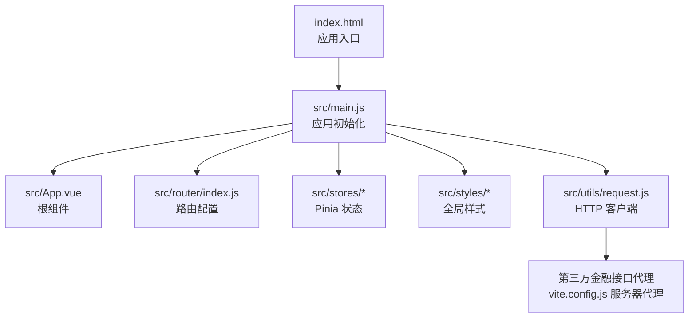
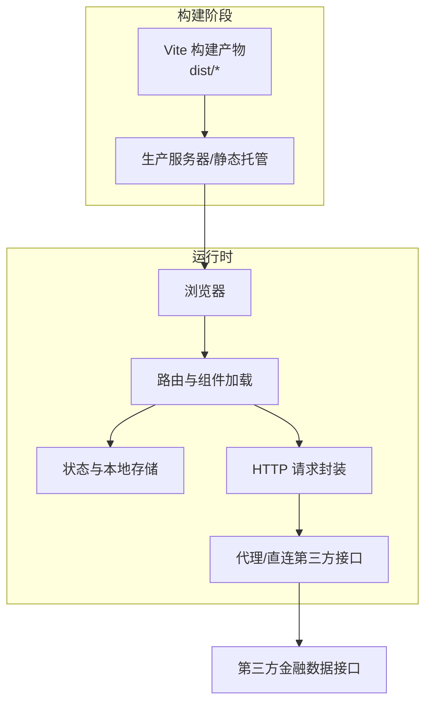
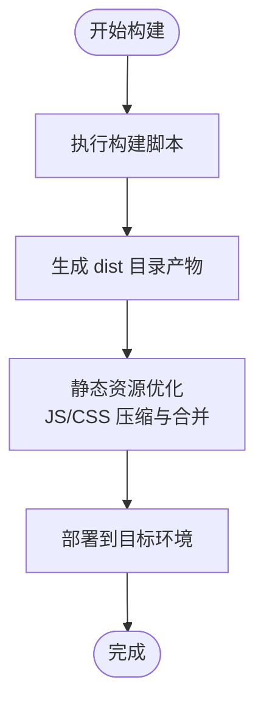
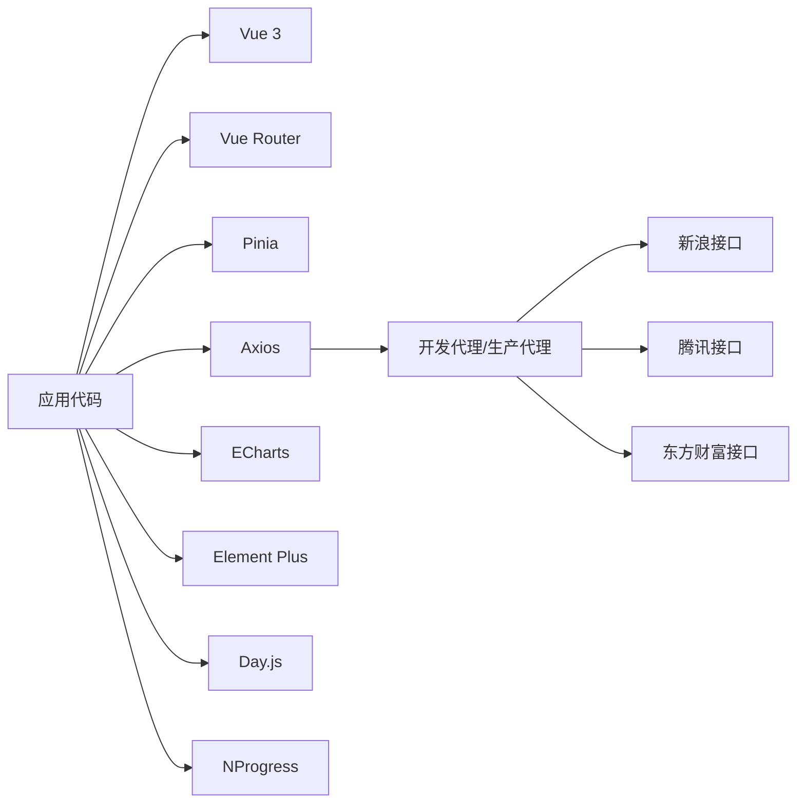

# 部署运维

<cite>
**本文引用的文件**
- [package.json](file://package.json)
- [vite.config.js](file://vite.config.js)
- [index.html](file://index.html)
- [src/main.js](file://src/main.js)
- [src/router/index.js](file://src/router/index.js)
- [src/utils/request.js](file://src/utils/request.js)
- [src/utils/constants.js](file://src/utils/constants.js)
- [src/utils/storage.js](file://src/utils/storage.js)
- [src/stores/settings.js](file://src/stores/settings.js)
</cite>

## 目录
1. [简介](#简介)
2. [项目结构](#项目结构)
3. [核心组件](#核心组件)
4. [架构总览](#架构总览)
5. [详细组件分析](#详细组件分析)
6. [依赖分析](#依赖分析)
7. [性能考虑](#性能考虑)
8. [故障排查指南](#故障排查指南)
9. [结论](#结论)
10. [附录](#附录)

## 简介
本文件面向量化交易平台的部署与运维团队，提供从生产构建到多环境部署、性能监控与日志、安全加固以及自动化流水线的完整指南。内容基于仓库中的 Vite 构建配置、前端路由与状态管理、API 请求封装与代理策略，帮助在不同运行环境中（静态托管、CDN、容器化）稳定交付应用。

## 项目结构
该前端项目采用 Vue 3 + Vite 的现代单页应用（SPA）架构，核心入口为 HTML 模板与主应用挂载点，路由按需加载页面组件，状态通过 Pinia 管理，样式使用 SCSS 并引入 Element Plus UI 组件库。构建与开发服务器由 Vite 提供，支持本地代理以绕过跨域限制访问第三方金融数据接口。

图表来源
- [index.html:1-14](file://index.html#L1-L14)
- [src/main.js:1-17](file://src/main.js#L1-L17)
- [src/router/index.js:1-58](file://src/router/index.js#L1-L58)
- [src/utils/request.js:1-29](file://src/utils/request.js#L1-L29)
- [vite.config.js:1-63](file://vite.config.js#L1-L63)

章节来源
- [index.html:1-14](file://index.html#L1-L14)
- [src/main.js:1-17](file://src/main.js#L1-L17)
- [src/router/index.js:1-58](file://src/router/index.js#L1-L58)
- [vite.config.js:1-63](file://vite.config.js#L1-L63)

## 核心组件
- 应用入口与初始化：HTML 入口负责挂载应用，main.js 负责注册路由、状态、UI 组件库与全局样式。
- 路由系统：基于 History 模式的动态路由，结合进度条 NProgress 提升用户体验。
- 状态管理：Pinia Store 封装设置项持久化，使用本地存储进行用户偏好保存。
- 请求封装：Axios 实例区分 JSON 与文本响应类型，统一错误提示与拦截器处理。
- 构建与代理：Vite 配置别名、SCSS 变量注入、开发服务器代理第三方金融数据接口。

章节来源
- [src/main.js:1-17](file://src/main.js#L1-L17)
- [src/router/index.js:1-58](file://src/router/index.js#L1-L58)
- [src/stores/settings.js:1-70](file://src/stores/settings.js#L1-L70)
- [src/utils/request.js:1-29](file://src/utils/request.js#L1-L29)
- [vite.config.js:1-63](file://vite.config.js#L1-L63)

## 架构总览
下图展示生产构建产物与运行时交互关系，包括静态资源、第三方接口代理、浏览器缓存与 CDN 加速等关键环节。

图表来源
- [vite.config.js:1-63](file://vite.config.js#L1-L63)
- [src/utils/request.js:1-29](file://src/utils/request.js#L1-L29)
- [src/router/index.js:1-58](file://src/router/index.js#L1-L58)

## 详细组件分析

### 构建与生产优化
- 构建命令：通过包脚本调用 Vite 进行生产构建与预览。
- 资源输出：默认输出至 dist 目录，包含 HTML、JS、CSS、静态资源等。
- 代码分割与懒加载：路由按需加载页面组件，减少首屏体积。
- 开发代理：开发服务器对多个第三方金融接口设置代理，便于本地联调；生产环境需在反向代理或 CDN 层面配置相同规则。

图表来源
- [package.json:6-10](file://package.json#L6-L10)
- [vite.config.js:1-63](file://vite.config.js#L1-L63)

章节来源
- [package.json:6-10](file://package.json#L6-L10)
- [vite.config.js:1-63](file://vite.config.js#L1-L63)

### 部署方式指南

- 静态托管服务
  - 适用场景：无需后端逻辑的纯前端应用，可直接部署至任意静态站点（如 GitHub Pages、Vercel、Netlify）。
  - 关键步骤：构建后将 dist 目录上传至托管平台；确保 404 回退到 index.html（SPA 路由需要）。
  - 注意事项：若使用开发代理访问第三方接口，需在生产反向代理或 CDN 层配置对应上游地址与 Referer 头。

- CDN 部署
  - 适用场景：高并发访问与全球加速需求。
  - 关键步骤：将 dist 产物上传至 CDN 存储桶或对象存储；配置缓存策略（静态资源强缓存、HTML 不缓存）；开启 Gzip/Brotli 压缩。
  - 安全建议：启用 HTTPS、配置 CORS 与安全头；对敏感路径进行鉴权或令牌校验。

- 容器化部署
  - 适用场景：微服务化或需要弹性扩缩容的场景。
  - 关键步骤：使用 Nginx 或 Caddy 作为静态 Web 服务器，映射 dist 目录；配置健康检查与日志采集；通过反向代理转发第三方接口请求。
  - 缓存与压缩：在容器内启用 gzip/br 压缩与静态缓存；合理设置缓存头。

- 反向代理与第三方接口
  - 生产环境建议在 Nginx/Caddy 中配置与开发代理一致的上游地址与 Referer 头，避免跨域与防盗链问题。
  - 对于需要鉴权的接口，可在代理层统一添加认证头或令牌。

章节来源
- [vite.config.js:12-54](file://vite.config.js#L12-L54)

### 环境配置管理
- 环境变量与 API 配置
  - 当前项目未内置环境变量读取逻辑，建议在构建阶段通过环境变量注入（如 VITE_API_BASE）并在运行时读取。
  - 若需区分开发/测试/生产环境，可在 CI 中设置不同构建参数或通过 Docker 环境变量注入。
- 域名与路径
  - SPA 路由基于 History 模式，需确保服务器正确处理 404 回退至 index.html。
  - 若部署在子路径（如 /app/），需在构建配置中设置 base 路径并在服务器中配置相应重写规则。

章节来源
- [src/router/index.js:42-45](file://src/router/index.js#L42-L45)
- [vite.config.js:1-63](file://vite.config.js#L1-L63)

### 性能监控与日志收集
- 前端性能
  - 使用浏览器性能面板与 Lighthouse 进行基准测试；关注首屏时间、交互延迟与内存占用。
  - 合理拆分代码与懒加载，减少初始 JS 包体；对第三方图表库进行按需引入。
- 日志与错误上报
  - 建议集成前端错误监控（如 Sentry 或自建上报接口），对请求异常与运行时错误进行捕获与统计。
  - 对关键操作（如指标计算、回测）记录埋点事件，便于后续分析。

章节来源
- [src/utils/request.js:17-28](file://src/utils/request.js#L17-L28)
- [src/router/index.js:47-55](file://src/router/index.js#L47-L55)

### 安全配置建议
- HTTPS
  - 强制使用 HTTPS，启用 HSTS；证书由可信 CA 颁发并定期续期。
- CORS 与安全头
  - 对跨域请求明确允许来源与方法；对第三方接口代理时，确保 Referer 与 UA 合规。
  - 设置安全头：X-Frame-Options、X-Content-Type-Options、Referrer-Policy、Content-Security-Policy。
- 认证与授权
  - 对需要鉴权的接口在代理层统一鉴权；对敏感设置项进行权限控制。

章节来源
- [vite.config.js:15-52](file://vite.config.js#L15-L52)

### 自动化部署与 CI/CD
- 构建与发布
  - 在 CI 中执行安装依赖、构建与测试；将 dist 目录制品上传至对象存储或 CDN。
- 分支策略
  - 主分支保护与 PR 审查；版本标签与变更日志管理。
- 环境管理
  - 通过环境变量区分开发/测试/生产；对密钥与令牌进行加密存储与注入。

章节来源
- [package.json:6-10](file://package.json#L6-L10)

## 依赖分析
- 运行时依赖
  - Vue 3、Vue Router、Pinia、Axios、Element Plus、ECharts、Day.js、NProgress。
- 开发依赖
  - Vite、@vitejs/plugin-vue、Sass。
- 第三方接口
  - 通过开发代理访问新浪、腾讯、东方财富等金融数据接口；生产环境需在反向代理或 CDN 层配置相同上游。

图表来源
- [package.json:11-26](file://package.json#L11-L26)
- [vite.config.js:15-52](file://vite.config.js#L15-L52)

章节来源
- [package.json:11-26](file://package.json#L11-L26)
- [vite.config.js:15-52](file://vite.config.js#L15-L52)

## 性能考虑
- 构建优化
  - 启用最小化与代码分割；对静态资源进行指纹命名与缓存策略。
- 运行时优化
  - 图表渲染按需加载；路由懒加载；减少不必要的全局样式与字体加载。
- 网络优化
  - 使用 CDN 与 Gzip/Brotli 压缩；合理设置缓存头；对第三方接口进行聚合与去抖。

章节来源
- [vite.config.js:1-63](file://vite.config.js#L1-L63)
- [src/router/index.js:17-36](file://src/router/index.js#L17-L36)

## 故障排查指南
- 构建失败
  - 检查 Node 版本与依赖安装；确认 Vite 插件与配置语法正确。
- 首屏白屏或路由 404
  - 确认服务器将所有未知路径回退到 index.html；检查 History 模式与 base 配置。
- 第三方接口跨域/防盗链
  - 在生产反向代理中配置 Referer 与上游地址；确保代理头与路径重写正确。
- 请求超时与错误提示
  - 查看统一错误拦截器逻辑与消息提示；检查网络与超时配置。
- 本地开发代理不可用
  - 确认代理规则与目标地址；检查本地网络与防火墙设置。

章节来源
- [src/utils/request.js:17-28](file://src/utils/request.js#L17-L28)
- [vite.config.js:12-54](file://vite.config.js#L12-L54)
- [src/router/index.js:42-45](file://src/router/index.js#L42-L45)

## 结论
本项目具备清晰的前端架构与完善的开发体验，生产部署的关键在于：正确的构建产物管理、稳定的第三方接口代理、合理的缓存与安全策略，以及可追溯的自动化流水线。按照本文档的建议实施，可在不同环境下实现高质量、高可用的交付。

## 附录
- 关键配置参考
  - 构建与脚本：[package.json:6-10](file://package.json#L6-L10)
  - 开发代理与别名：[vite.config.js:1-63](file://vite.config.js#L1-L63)
  - 应用入口与挂载：[index.html:1-14](file://index.html#L1-L14)、[src/main.js:1-17](file://src/main.js#L1-L17)
  - 路由与进度条：[src/router/index.js:1-58](file://src/router/index.js#L1-L58)
  - 请求封装与错误处理：[src/utils/request.js:1-29](file://src/utils/request.js#L1-L29)
  - 设置与本地存储：[src/stores/settings.js:1-70](file://src/stores/settings.js#L1-L70)、[src/utils/storage.js:1-21](file://src/utils/storage.js#L1-L21)
  - 常量与指标参数：[src/utils/constants.js:1-68](file://src/utils/constants.js#L1-L68)