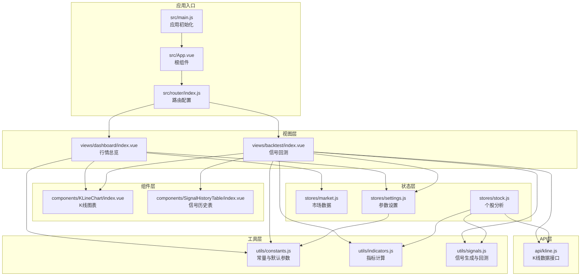
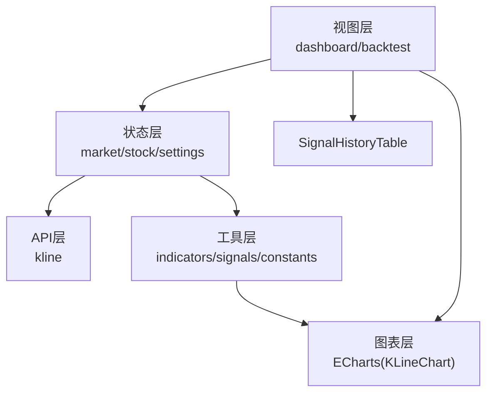
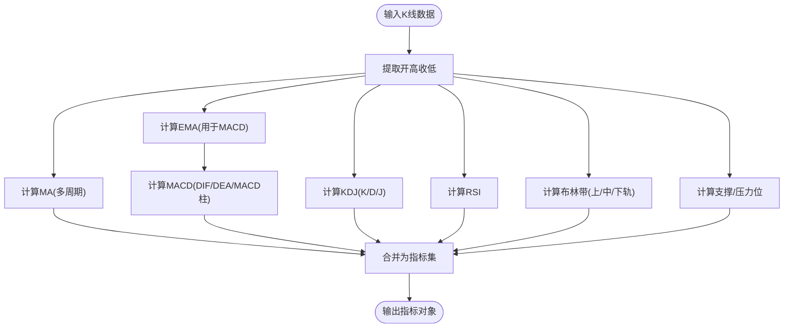
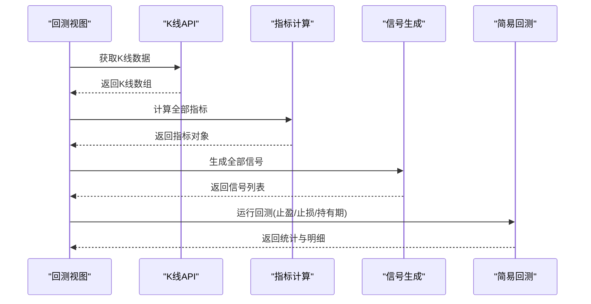
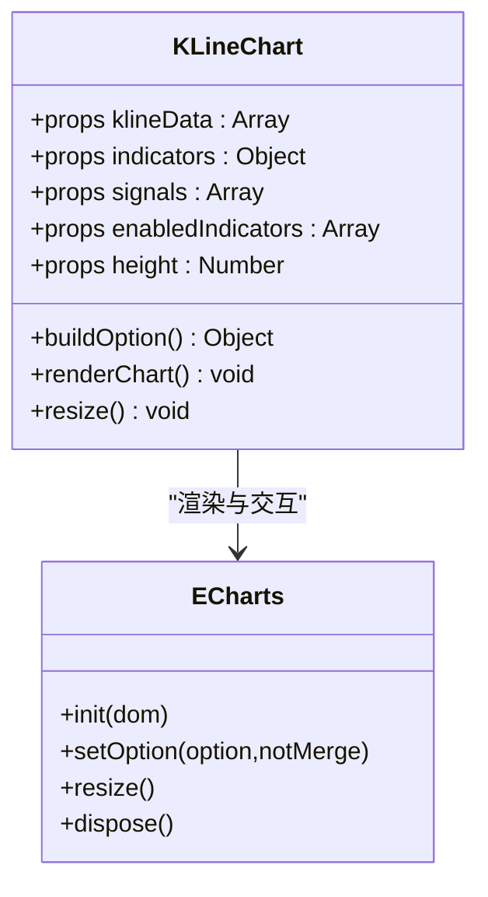
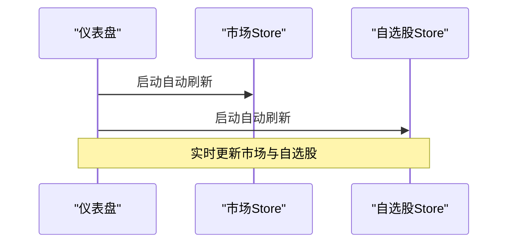
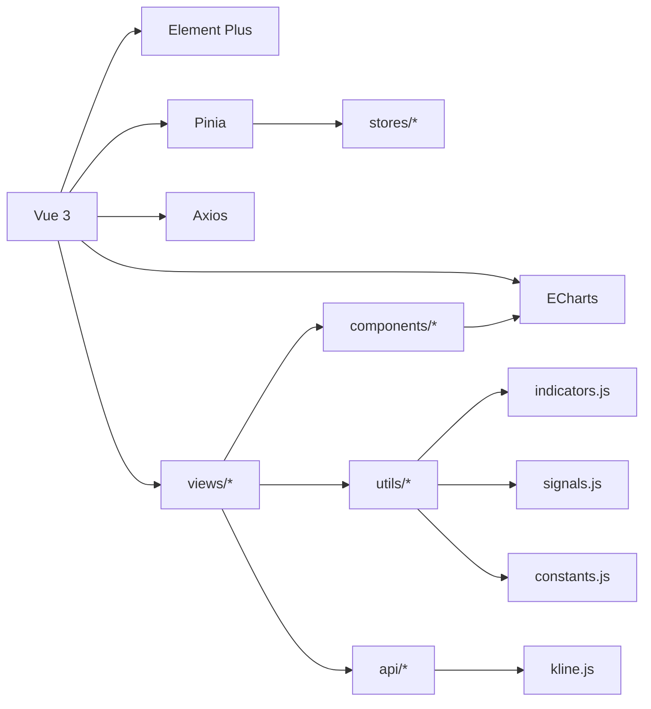

# 项目概述

<cite>
**本文档引用的文件**
- [package.json](file://package.json)
- [src/main.js](file://src/main.js)
- [src/App.vue](file://src/App.vue)
- [src/router/index.js](file://src/router/index.js)
- [src/utils/constants.js](file://src/utils/constants.js)
- [src/utils/indicators.js](file://src/utils/indicators.js)
- [src/utils/signals.js](file://src/utils/signals.js)
- [src/stores/market.js](file://src/stores/market.js)
- [src/stores/stock.js](file://src/stores/stock.js)
- [src/stores/settings.js](file://src/stores/settings.js)
- [src/components/KLineChart/index.vue](file://src/components/KLineChart/index.vue)
- [src/components/SignalHistoryTable/index.vue](file://src/components/SignalHistoryTable/index.vue)
- [src/views/dashboard/index.vue](file://src/views/dashboard/index.vue)
- [src/views/backtest/index.vue](file://src/views/backtest/index.vue)
- [src/api/kline.js](file://src/api/kline.js)
</cite>

## 目录
1. [简介](#简介)
2. [项目结构](#项目结构)
3. [核心组件](#核心组件)
4. [架构总览](#架构总览)
5. [详细组件分析](#详细组件分析)
6. [依赖关系分析](#依赖关系分析)
7. [性能考虑](#性能考虑)
8. [故障排除指南](#故障排除指南)
9. [结论](#结论)
10. [附录](#附录)

## 简介
本项目是一个基于前端技术栈构建的量化交易分析平台，旨在为用户提供从K线图表到技术指标、信号生成与简易回测的一体化分析体验。平台采用Vue 3 + Element Plus + ECharts 的组合，结合 Pinia 状态管理与 Axios 请求封装，形成清晰的分层架构。其核心价值在于：
- 技术分析：提供多周期K线、多指标叠加展示（MA、MACD、KDJ、RSI、布林带）与支撑/压力位识别。
- 信号生成：基于多种经典指标的交易信号规则，输出买入/卖出信号及强度等级，并支持综合评分。
- 回测功能：内置简易回测引擎，支持按策略筛选与参数配置，输出胜率、平均收益、最大回撤等统计指标。

## 项目结构
项目采用“视图层 + 组件层 + 工具层 + 状态层 + API层”的分层组织方式，路由以布局页承载多个视图，核心分析逻辑集中在工具函数与状态存储中，图表渲染由 ECharts 完成。

**图表来源**
- [src/main.js:1-17](file://src/main.js#L1-L17)
- [src/App.vue:1-13](file://src/App.vue#L1-L13)
- [src/router/index.js:1-58](file://src/router/index.js#L1-L58)
- [src/views/dashboard/index.vue:1-163](file://src/views/dashboard/index.vue#L1-L163)
- [src/views/backtest/index.vue:1-242](file://src/views/backtest/index.vue#L1-L242)
- [src/components/KLineChart/index.vue:1-285](file://src/components/KLineChart/index.vue#L1-L285)
- [src/components/SignalHistoryTable/index.vue:1-32](file://src/components/SignalHistoryTable/index.vue#L1-L32)
- [src/stores/market.js:1-41](file://src/stores/market.js#L1-L41)
- [src/stores/stock.js:1-92](file://src/stores/stock.js#L1-L92)
- [src/stores/settings.js:1-70](file://src/stores/settings.js#L1-L70)
- [src/utils/constants.js:1-68](file://src/utils/constants.js#L1-L68)
- [src/utils/indicators.js:1-245](file://src/utils/indicators.js#L1-L245)
- [src/utils/signals.js:1-347](file://src/utils/signals.js#L1-L347)
- [src/api/kline.js:1-27](file://src/api/kline.js#L1-L27)

**章节来源**
- [src/main.js:1-17](file://src/main.js#L1-L17)
- [src/router/index.js:1-58](file://src/router/index.js#L1-L58)
- [src/views/dashboard/index.vue:1-163](file://src/views/dashboard/index.vue#L1-L163)
- [src/views/backtest/index.vue:1-242](file://src/views/backtest/index.vue#L1-L242)

## 核心组件
- 应用入口与路由
  - 应用通过 main.js 初始化 Vue 实例，挂载 Element Plus 国际化与全局样式，注册路由与状态管理。
  - 路由采用 history 模式，包含仪表盘、个股详情、信号回测、参数设置等页面。
- 状态管理
  - market.store：负责大盘指数与热门股票的拉取与自动刷新。
  - stock.store：负责个股K线、指标、信号与综合评分的计算与缓存。
  - settings.store：持久化用户偏好（默认周期、启用指标、信号策略、各指标参数）。
- 图表组件
  - KLineChart：基于 ECharts 渲染蜡烛图、成交量、MACD、KDJ/RSI、MA、布林带，并支持信号标记。
- 工具函数
  - indicators：提供 MA、MACD、KDJ、RSI、布林带与支撑/压力位计算。
  - signals：提供各类策略的信号生成、综合评分与简易回测。
- API 封装
  - kline.api：封装新浪财经K线接口，返回标准化K线数据。

**章节来源**
- [src/main.js:1-17](file://src/main.js#L1-L17)
- [src/router/index.js:1-58](file://src/router/index.js#L1-L58)
- [src/stores/market.js:1-41](file://src/stores/market.js#L1-L41)
- [src/stores/stock.js:1-92](file://src/stores/stock.js#L1-L92)
- [src/stores/settings.js:1-70](file://src/stores/settings.js#L1-L70)
- [src/components/KLineChart/index.vue:1-285](file://src/components/KLineChart/index.vue#L1-L285)
- [src/utils/indicators.js:1-245](file://src/utils/indicators.js#L1-L245)
- [src/utils/signals.js:1-347](file://src/utils/signals.js#L1-L347)
- [src/api/kline.js:1-27](file://src/api/kline.js#L1-L27)

## 架构总览
平台采用“前端单页应用 + 工具函数 + 状态管理 + 图表渲染”的架构设计，强调可配置性与可扩展性。用户通过视图层选择股票与周期，状态层统一调度数据与计算，工具层提供纯函数式的指标与信号处理，图表层负责可视化呈现。

**图表来源**
- [src/views/dashboard/index.vue:1-163](file://src/views/dashboard/index.vue#L1-L163)
- [src/views/backtest/index.vue:1-242](file://src/views/backtest/index.vue#L1-L242)
- [src/stores/market.js:1-41](file://src/stores/market.js#L1-L41)
- [src/stores/stock.js:1-92](file://src/stores/stock.js#L1-L92)
- [src/stores/settings.js:1-70](file://src/stores/settings.js#L1-L70)
- [src/api/kline.js:1-27](file://src/api/kline.js#L1-L27)
- [src/utils/indicators.js:1-245](file://src/utils/indicators.js#L1-L245)
- [src/utils/signals.js:1-347](file://src/utils/signals.js#L1-L347)
- [src/components/KLineChart/index.vue:1-285](file://src/components/KLineChart/index.vue#L1-L285)
- [src/components/SignalHistoryTable/index.vue:1-32](file://src/components/SignalHistoryTable/index.vue#L1-L32)

## 详细组件分析

### 技术指标系统（indicators）
- 设计思路
  - 提供独立的纯函数指标计算模块，便于单元测试与复用。
  - 支持多周期与多参数配置，计算结果以对象形式返回，便于后续信号生成与图表渲染。
- 关键算法
  - EMA：指数平滑，用于MACD等指标的前置计算。
  - MA：多周期均线，支持批量计算。
  - MACD：短中长期EMA差值与信号线，包含柱状图正负颜色区分。
  - KDJ：随机指标，包含K/D/J三线与超买超卖阈值。
  - RSI：相对强弱指标，支持阈值判断。
  - 布林带：上下轨与中轨，支持自定义周期与倍数。
  - 支撑/压力位：基于近期高低价、枢轴点与均线的合并与去噪。
- 复杂度与优化
  - 多数指标为 O(n) 单次遍历，EMA/MA具备滑动窗口优化。
  - 批量MA与综合计算通过映射与聚合减少重复计算。

**图表来源**
- [src/utils/indicators.js:221-245](file://src/utils/indicators.js#L221-L245)

**章节来源**
- [src/utils/indicators.js:1-245](file://src/utils/indicators.js#L1-L245)

### 信号生成引擎（signals）
- 设计思路
  - 基于指标规则生成买入/卖出信号，支持强度等级与描述信息。
  - 提供综合评分机制，对近期信号进行加权汇总，输出推荐级别。
  - 内置简易回测，模拟止盈止损与持有期，输出统计指标。
- 关键流程
  - MACD：DIF上穿/下穿DEA，结合MACD柱正负区间判断强度。
  - KDJ：J值超卖/超买反弹与金叉/死叉，结合K值位置判断强度。
  - RSI：超卖/超买阈值穿越，结合历史极值判断强度。
  - 布林带：价格触及上下轨后的反转向，结合持续时间判断强度。
  - 均线：多周期均值交叉，按短期/长期差异确定强度。
  - 综合评分：按强度权重对买卖信号进行加权求和，映射到推荐级别。
  - 简易回测：按买入信号依次模拟出场，支持止盈/止损/持有期限制。

**图表来源**
- [src/views/backtest/index.vue:158-171](file://src/views/backtest/index.vue#L158-L171)
- [src/api/kline.js:9-26](file://src/api/kline.js#L9-L26)
- [src/utils/indicators.js:221-245](file://src/utils/indicators.js#L221-L245)
- [src/utils/signals.js:197-230](file://src/utils/signals.js#L197-L230)
- [src/utils/signals.js:264-346](file://src/utils/signals.js#L264-L346)

**章节来源**
- [src/utils/signals.js:1-347](file://src/utils/signals.js#L1-L347)
- [src/views/backtest/index.vue:126-182](file://src/views/backtest/index.vue#L126-L182)

### K线图表组件（KLineChart）
- 设计思路
  - 使用 ECharts 渲染蜡烛图与多子图（成交量、MACD、KDJ/RSI），支持动态切换指标与信号标记。
  - 自适应网格布局，根据启用指标数量调整主图与子图高度比例。
  - 支持数据缩放、响应式尺寸变化与交互提示。
- 关键实现
  - 构建选项：根据传入的K线、指标与信号生成 series 与坐标轴配置。
  - 信号标记：在买入/卖出信号处绘制三角形/图钉标记，标注信号类型与强度。
  - 指标叠加：MA、布林带上中下轨、MACD柱状图与线、KDJ/RSI线与阈值线。
  - 数据缩放：内部缩放与滑块缩放联动，初始定位最近80根K线。

**图表来源**
- [src/components/KLineChart/index.vue:10-285](file://src/components/KLineChart/index.vue#L10-L285)

**章节来源**
- [src/components/KLineChart/index.vue:1-285](file://src/components/KLineChart/index.vue#L1-L285)

### 仪表盘与回测视图
- 仪表盘（dashboard）
  - 展示大盘指数、热门股票列表与自选股面板，支持快捷搜索与自动刷新。
  - 热门股票表格支持点击跳转至个股详情。
- 信号回测（backtest）
  - 提供股票搜索、策略勾选、运行回测的完整流程。
  - 展示K线+信号标记、回测统计卡片、分策略统计与交易明细。

**图表来源**
- [src/views/dashboard/index.vue:101-109](file://src/views/dashboard/index.vue#L101-L109)
- [src/stores/market.js:25-33](file://src/stores/market.js#L25-L33)
- [src/stores/market.js:19-23](file://src/stores/market.js#L19-L23)

**章节来源**
- [src/views/dashboard/index.vue:1-163](file://src/views/dashboard/index.vue#L1-L163)
- [src/views/backtest/index.vue:1-242](file://src/views/backtest/index.vue#L1-L242)

## 依赖关系分析
- 技术栈选择
  - Vue 3：组合式API提升开发效率与可维护性。
  - Element Plus：提供丰富的UI组件与中文本地化。
  - ECharts：专业图表库，满足多指标叠加与复杂交互需求。
  - Pinia：轻量状态管理，易于持久化与模块化。
  - Axios：HTTP请求封装，配合统一的请求工具。
- 模块耦合
  - 视图层仅依赖状态层与工具层，保持低耦合。
  - 工具层为纯函数，无副作用，便于测试与复用。
  - 图表组件通过属性接收数据，解耦具体指标实现。

**图表来源**
- [package.json:11-26](file://package.json#L11-L26)
- [src/main.js:1-17](file://src/main.js#L1-L17)
- [src/stores/index.js](file://src/stores/index.js)
- [src/utils/indicators.js:1-245](file://src/utils/indicators.js#L1-L245)
- [src/utils/signals.js:1-347](file://src/utils/signals.js#L1-L347)
- [src/utils/constants.js:1-68](file://src/utils/constants.js#L1-L68)
- [src/api/kline.js:1-27](file://src/api/kline.js#L1-L27)

**章节来源**
- [package.json:1-28](file://package.json#L1-L28)
- [src/main.js:1-17](file://src/main.js#L1-L17)

## 性能考虑
- 指标计算
  - 多数指标为 O(n) 线性扫描，EMA/MA采用递推公式避免重复计算。
  - 批量MA通过一次遍历生成多条均线，减少冗余。
- 图表渲染
  - ECharts 使用 setOption 并开启动画关闭，降低频繁更新的开销。
  - ResizeObserver 监听容器尺寸变化，避免全量重绘。
- 状态与缓存
  - stock.store 对指标与信号进行缓存，仅在数据或参数变化时重新计算。
  - settings.store 将用户偏好持久化，减少重复初始化成本。
- 网络请求
  - market.store 采用定时器轮询与并发刷新，避免阻塞主线程。

[本节为通用性能建议，不直接分析具体文件，故无章节来源]

## 故障排除指南
- K线数据为空
  - 检查股票代码是否正确，确认API返回格式与解析逻辑。
  - 参考路径：[src/api/kline.js:9-26](file://src/api/kline.js#L9-L26)
- 图表不显示或空白
  - 确认容器DOM存在且非零尺寸，检查 ECharts 初始化与 ResizeObserver。
  - 参考路径：[src/components/KLineChart/index.vue:251-268](file://src/components/KLineChart/index.vue#L251-L268)
- 信号未生成或评分异常
  - 检查启用策略与指标参数，确认 signals 与 constants 中权重与阈值配置。
  - 参考路径：[src/utils/signals.js:197-230](file://src/utils/signals.js#L197-L230)，[src/utils/constants.js:47-60](file://src/utils/constants.js#L47-L60)
- 自动刷新不生效
  - 确认定时器已启动与清理，避免内存泄漏。
  - 参考路径：[src/stores/market.js:25-33](file://src/stores/market.js#L25-L33)，[src/stores/stock.js:74-81](file://src/stores/stock.js#L74-L81)

**章节来源**
- [src/api/kline.js:1-27](file://src/api/kline.js#L1-L27)
- [src/components/KLineChart/index.vue:251-268](file://src/components/KLineChart/index.vue#L251-L268)
- [src/utils/signals.js:197-230](file://src/utils/signals.js#L197-L230)
- [src/utils/constants.js:47-60](file://src/utils/constants.js#L47-L60)
- [src/stores/market.js:25-33](file://src/stores/market.js#L25-L33)
- [src/stores/stock.js:74-81](file://src/stores/stock.js#L74-L81)

## 结论
本项目以清晰的分层架构与模块化设计，实现了从数据获取、指标计算、信号生成到可视化的完整闭环。通过可配置的指标与策略、直观的图表展示以及简易回测能力，帮助用户在量化交易决策中快速验证想法并形成体系化的分析流程。未来可在以下方面进一步演进：
- 引入更丰富的技术指标与策略模板；
- 增强回测引擎的灵活性（如滑点、手续费、资金曲线）；
- 提供策略参数优化与多标的组合分析能力。

[本节为总结性内容，不直接分析具体文件，故无章节来源]

## 附录
- 主要功能模块概览
  - K线图表分析：蜡烛图、成交量、多指标叠加与信号标记。
  - 技术指标系统：MA、MACD、KDJ、RSI、布林带、支撑/压力位。
  - 信号生成引擎：多策略信号、强度等级与综合评分。
  - 回测系统：止盈止损模拟、统计指标与分策略评估。
- 术语说明
  - 金叉/死叉：短期均线上穿/下穿长期均线的形态。
  - 超买/超卖：KDJ/RSI处于高位/低位的背离信号。
  - 止盈/止损：回测中设定的强制出场条件。

[本节为概念性说明，不直接分析具体文件，故无章节来源]